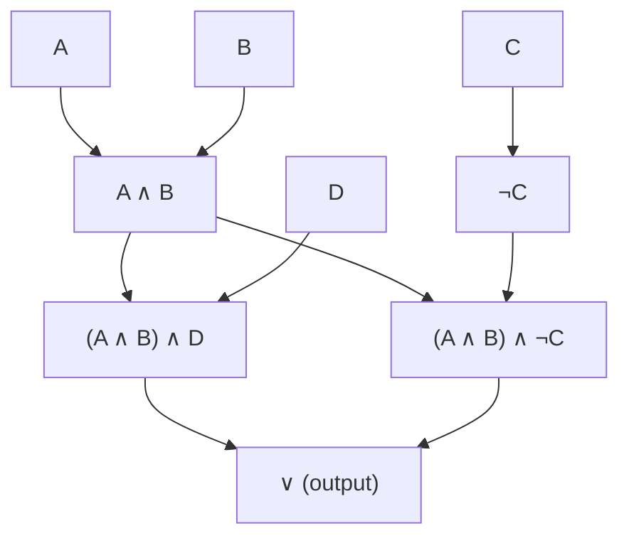

[[book-guidelines|↩ Back to guidelines]]

# Switching Circuits

Enderton flags this section with a footnote most textbooks would bury in a preface: it "discusses an application of the ideas of previous sections" and "may be omitted without loss of continuity." Nothing in Section 1.7 (Compactness) or Chapter Two depends on it. That's worth saying up front, and again at the end — this is the one section in Chapter One that is explicitly a payoff, not a prerequisite. It's here because Section 1.5 just spent its entire length arguing that a Boolean function is a purely semantic object — a function from truth-value tuples to a truth value, indifferent to which wff happens to realize it. Section 1.6's contribution is to point out that this abstraction has a second, non-syntactic realization: a physical circuit made of gates. Same object (a $k$-place Boolean function), two completely different implementations — a wff built from $\wedge,\vee,\neg$, or a box built from AND-gates, OR-gates, and inverters — and Theorem 15A already told you they're interchangeable wherever tautological equivalence is the criterion of sameness.

## From black box to Boolean function

Enderton's setup is deliberately physical: an electrical device with $n$ inputs and one output, each carrying one of two signal levels $F$ and $T$ (he even offers the "0 potential / 1 potential" framing, foreshadowing that $F$ and $T$ are just labels for a bistable physical quantity). The one substantive assumption is that **the device has no memory** — the output depends only on the *present* inputs, never on history. That assumption is exactly what licenses calling the device's behavior a Boolean function:
$$
G(X_1,\ldots,X_n) = \text{the output level given the input signals } X_1,\ldots,X_n.
$$

**What breaks without the no-memory assumption.** Drop it, and $G$ stops being well-defined as a function of the current inputs alone — you'd need to add a "state" argument, and you've left combinational logic for sequential logic (flip-flops, latches, clocked circuits), which Enderton doesn't touch here. The entire correspondence this section builds — wff $\leftrightarrow$ circuit — only works because both sides are memoryless: a wff's truth value is a pure function of its sentence symbols' truth values (that's Theorem 12A from Section 1.2), and a combinational circuit's output is a pure function of its current inputs. Sequential circuits would need something more like a wff evaluated against a *sequence* of assignments — a different mathematical object entirely.

Two named devices realize named Boolean functions directly: the two-input **AND gate** (output = minimum of the inputs, $F<T$) realizes exactly the function $K$ from Section 1.5 ($K(T,T)=T$, else $F$); the two-input **OR gate** (output = maximum of the inputs) realizes $A$; the **NOT gate**/inverter realizes $N$. Enderton labels the gates' outputs with wffs directly — the AND gate's output wire gets the label $A_1 \wedge A_2$ — which is the whole trick of the section in miniature: a circuit *is* a wff, drawn with boxes instead of connective symbols, and wires instead of parenthesization.

## Circuits as the wff's formation tree, with one caveat

Given a wff, wiring up its circuit is mechanical: recurse down the formula tree, put a gate at each connective, and feed sentence symbols in at the leaves. Enderton's own example, $((A \wedge B) \wedge D) \vee ((A \wedge B) \wedge \neg C)$, makes the one subtlety explicit — the sub-wff $A \wedge B$ occurs *twice* in the formula, but "duplication of the circuit for $A \wedge B$ would not usually be desirable." A wff's formation tree is genuinely a tree (each subformula occurrence is a distinct node), but a good circuit is a **directed acyclic graph** — shared subformulas become shared wires, computed once and fanned out to both places that need them.



Notice `AB` has two outgoing edges — that's the shared-subformula fan-out a naive tree-walk over the wff's syntax would miss, and it's exactly the "common subexpression elimination" a compiler's backend does over an expression DAG. Even at this most basic level, Section 1.6's "circuit" is already a slightly richer data structure than the "wff" it's built from.

## Delay: a recursive definition that mirrors the wff's own recursion

Enderton defines **delay** (equivalently, **depth**) of a circuit as the longest signal path — the maximum number of boxes a signal crosses from any input to the output. He then gives the formula-side analogue by recursion on formula structure, deliberately parallel to how wffs themselves are defined by recursion in Section 1.4:

1. The delay of a sentence symbol is $0$.
2. The delay of $\neg\alpha$ is one greater than the delay of $\alpha$.
3. The delay of $\alpha \wedge \beta$ (and similarly any other binary connective) is one greater than the *maximum* of the delays of $\alpha$ and $\beta$.

This is worth pausing on precisely because it is not a novel idea in this section — it's [[Sentential-Propositional-Logic#The Induction Principle|the induction principle]] from Section 1.4, instantiated with "depth of formation tree" as the recursively-defined quantity, restated in circuit language ("boxes a signal passes through") instead of formula language ("connectives applied"). The point Enderton is making by choosing this example is that *this same recursive-definition pattern is what a real cost model looks like* — and it composes by max, not by sum, because gates on independent branches of an AND/OR run in parallel; only genuinely sequential dependency (one gate's output feeding another) adds to the critical path.

**Grounding.** This delay recursion is close to literal compiler-backend code — computing the depth of an expression DAG for scheduling or critical-path analysis is exactly this function, applied to an arithmetic or SSA expression instead of a wff.

```rust
/// A circuit, expressed the same way a compiler would represent an
/// expression DAG: nodes are gates or inputs, edges are wires.
enum Circuit {
    Input(char),
    Not(Box<Circuit>),
    And(Box<Circuit>, Box<Circuit>),
    Or(Box<Circuit>, Box<Circuit>),
}

impl Circuit {
    /// Enderton's recursive delay/depth definition, verbatim:
    /// leaves are depth 0, Not adds 1, binary gates add 1 to the max
    /// of their two operands' depths (parallel fan-in, not summed).
    fn delay(&self) -> u32 {
        match self {
            Circuit::Input(_) => 0,
            Circuit::Not(a) => 1 + a.delay(),
            Circuit::And(a, b) | Circuit::Or(a, b) => 1 + a.delay().max(b.delay()),
        }
    }

    /// Cost, in Enderton's simplest sense: total device count.
    fn cost(&self) -> u32 {
        match self {
            Circuit::Input(_) => 0,
            Circuit::Not(a) => 1 + a.cost(),
            Circuit::And(a, b) | Circuit::Or(a, b) => 1 + a.cost() + b.cost(),
        }
    }
}
```

Enderton's own numerical example is the reason this pair of functions matters, rather than just one of them: $(A_1 \wedge A_2) \vee \neg A_3$ uses **3 devices** and has **delay 2**. The tautologically equivalent formula $\neg(A_3 \wedge (\neg A_1 \vee \neg A_2))$ — De Morgan applied twice — uses **5 devices** and has **delay 4**. Same Boolean function (Theorem 15A(b): tautological equivalence *is* equality of the realized Boolean function), wildly different cost and delay. This is the entire reason circuit minimization is a nontrivial engineering problem rather than a solved one: tautological equivalence is a coarse notion of "sameness" that erases the two numbers ($\text{cost}$, $\text{delay}$) an engineer actually optimizes.

## The minimization problem, and why the device catalog matters

Enderton states the general problem cleanly: given a circuit (or its wff), find an equivalent circuit of minimum cost, possibly subject to a maximum-delay constraint — and crucially, subject to a fixed **catalog of available devices** (e.g. "NOT, two-input AND, three-input OR"). The catalog determines a formal language with one connective symbol per device, and Enderton notes in passing why this reconnects directly to Section 1.5: *"it is clearly desirable that the available devices correspond to a complete set of connectives"* — otherwise there are Boolean functions in the target application that no circuit built from the catalog could realize at all, no matter the cost budget. Completeness (Section 1.5's whole subject) is the precondition for the minimization problem to even have a solution; delay and cost are what you optimize once a solution is guaranteed to exist.

The section works this out through four increasingly rich worked examples:

**Example 1 — majority of three inputs, using AND/OR only.** The naive disjunctive-normal-form-style solution
$$
((A \wedge B) \vee (A \wedge C)) \vee (B \wedge C)
$$
uses 5 devices at delay 3. Factoring differently,
$$
(A \wedge (B \vee C)) \vee (B \wedge C)
$$
uses only 4 devices at the *same* delay 3 — a strictly better solution reachable purely by algebraic regrouping, with no change to the Boolean function realized. Enderton notes (deferred to an exercise) that 3 devices is provably impossible — so 4 is optimal for this catalog.

**Example 2 — equality test, using two-input NOR only.** With only $\downarrow$ (NOR) available, testing $A \leftrightarrow B$ becomes
$$
((A \downarrow A) \downarrow B) \downarrow ((B \downarrow B) \downarrow A),
$$
5 devices, and Enderton explicitly leaves open whether this is optimal — flagging this as an open-ended research question ("is there an efficient procedure for finding a minimal solution?") rather than a solved exercise. This is the book's most honest moment in the section: minimization isn't a technique you're being taught here, it's a problem being pointed at.

**Example 3 — relay circuits, where the cost model itself changes.** Here the catalog is unlimited-fan-in AND/OR gates that are *free*, but each *use of an input* costs one unit — a genuinely different cost function than device-counting. Testing $A \leftrightarrow B$ via $(A \wedge B) \vee (\neg A \wedge \neg B)$ costs 4 (four literal occurrences). Enderton uses this to introduce a physical wrinkle: relays are **bilateral** (current passes either direction), which makes "bridge" circuits possible — topologies with no wff/tree analogue at all, which is why he says outright: *"the methods described here do not apply to such circuits."* This is a clean boundary-drawing move — not every physical switching network is captured by the wff-circuit correspondence built up over the section; bilaterality breaks the assumption that a circuit is a DAG with a well-defined signal-flow direction.

**Example 4 — four inputs, a specified truth table with don't-cares, solved by inspection of a grid.** $G$'s value is pinned down at 13 of the 16 possible inputs; three combinations are physically impossible and so left unconstrained ("don't-care" — the circuit's behavior there is free, because the application guarantees those inputs never occur). Laid out on a $4\times4$ grid (Figure 7 — this is a Karnaugh map, though Enderton doesn't use that name), a rectangular block covering every required-$T$ cell and no required-$F$ cell reads off directly as
$$
(\neg A) \vee (\neg C \wedge D),
$$
with input $B$ dropped entirely — it plays no role in any required output. This is the section's clearest illustration of why "minimize" is a genuinely geometric/combinatorial search once you leave toy examples: exploiting don't-cares to shrink the formula is only visible once you can see the whole truth table's shape at once.

## Prime implicants: the exercises quietly hand you the real algorithm

The end-of-section exercises (worked here because they define vocabulary the *next* topic in the guidelines — completeness's DNF machinery — depends on) introduce the actual technical apparatus behind "minimize":

> **Literal.** A wff that is either a sentence symbol or the negation of one.
> **Implicant** of $\varphi$. A conjunction $\alpha$ of literals (distinct sentence symbols) such that $\alpha \models \varphi$.
> **Prime implicant.** An implicant $\alpha$ of $\varphi$ that stops being an implicant if *any* of its literals is deleted.

Corollary 15C (Section 1.5) already guarantees every satisfiable $\varphi$ is equivalent to *some* disjunction of implicants — that's disjunctive normal form. The exercises' point is sharper: **any minimum-length disjunction-of-implicants representation must consist entirely of prime implicants** — a non-prime implicant is always improvable by deleting a literal, so it can never appear in an optimal solution. Finding all prime implicants of a formula and then choosing a minimal covering subset of them is, essentially, the Quine–McCluskey algorithm — the systematic version of the by-inspection grid trick used in Example 4. Enderton doesn't name it, but the exercises (find all prime implicants of $(A \to B) \wedge (\neg A \to C)$, then find which disjunctions of them are equivalent to the original) are literally its two phases: *generate prime implicants*, then *cover*.

## Where this leads

Structurally, this section is a leaf, not a trunk: nothing later in Chapter One or Chapter Two builds on switching circuits, and Enderton says so himself. It exists to cash out Section 1.5's Boolean-function abstraction against a second, physical realization, and to hand the reader vocabulary (implicant, prime implicant, delay, cost) that dignifies "simplify this formula" as an actual optimization problem rather than a matter of taste.

Against this book's standing learning goals — a Rust verifier over Hoare-triple-style contracts, and a Lean-style elaborator built around metavariable unification — this section is honestly not load-bearing. It doesn't touch substitution, judgment forms, definitional equality, or unification, and forcing a tie-in to either target would be more misleading than useful. The one genuine echo worth keeping, rather than manufacturing: this section's device-catalog-plus-cost-model picture of a Boolean function — gates wired into a DAG, evaluated bottom-up, optimized under a device budget — is *exactly* the internal representation ("AIG," and-inverter graph) that SAT-based automation inside modern proof assistants compiles propositions into before handing them to a solver like CaDiCaL (this is literally what Lean's `bv_decide`/`decide` tactics do under the hood for finite, decidable propositions: elaborate the goal, compile it to a circuit of ANDs and inverters, minimize/normalize it, then discharge it with a SAT solver). If you ever end up wiring a SAT- or SMT-backed decision procedure into the verifier, the vocabulary from this section — cost, delay, device catalog, prime implicant — is precisely the vocabulary that literature will use.
