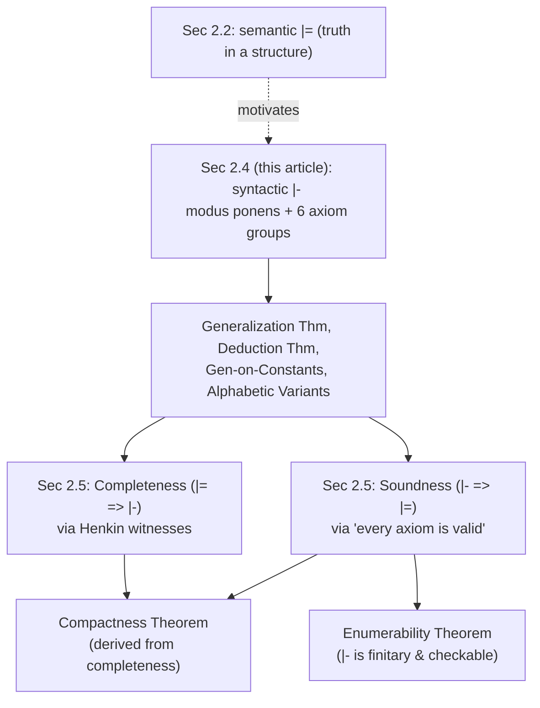

[[book-guidelines|↩ Back to guidelines]]

# The Deductive Calculus for First-Order Logic

## Why "proof" needs a mathematical definition at all

Section 2.2 gave first-order logic a semantic notion of truth: $\models_{\mathfrak{A}} \varphi[s]$, and from it, logical implication $\Gamma \models \tau$. That's a clean definition, but it's a *checking* definition, not a *finding* one — to verify $\Gamma \models \tau$ directly from its definition you'd have to survey every structure and every assignment, which is not a procedure anyone (or any machine) can carry out. Enderton opens Section 2.4 by asking the question this gap forces: if $\Gamma \models \tau$, what would actually *convince* someone of that fact? What has to be true of an argument for it to count as a proof?

He extracts three requirements a proof must satisfy, and they're worth stating as requirements because they are exactly the requirements you'd write down if you were designing a proof-checking data structure from scratch:

1. **Finite.** You cannot hand someone an infinite object. Even if $\Gamma$ is infinite, a proof of $\tau$ from $\Gamma$ can only ever cite finitely many members of $\Gamma$.
2. **Effectively checkable.** Whether a candidate proof *is* a proof must be decidable — checkable by a dumb, mechanical process, "without brilliant flashes of insight on the part of the checker." No step in checking a proof may itself require solving an open problem.
3. **Enumerable in aggregate.** If the set of correct proofs-from-$\emptyset$ is decidable, then the set of provable formulas is automatically enumerable (generate all finite symbol strings, run the checker on each, output the conclusion of every one that passes).

**What breaks without this:** without a finitary, syntactic, checkable notion of proof, everything the rest of the book wants to say — that logical implication is a *tractable* relationship, not just a true-by-definition one — is unstatable. The soundness and completeness theorems of Section 2.5 are precisely the bridge between this section's syntactic $\vdash$ and Section 2.2's semantic $\models$; without $\vdash$ existing as a well-defined object first, there's nothing for that bridge to connect.

Enderton's solution — the one this article covers — is a **Hilbert-style deductive calculus**: an infinite set $\Lambda$ of formulas called *logical axioms*, plus exactly one rule of inference, **modus ponens**. He is explicit that this is one arbitrary choice among many possible calculi (you could use zero axioms and many rules instead), chosen for how cleanly it supports the metatheorems that follow.

## Deductions as finite construction sequences

The rule of inference is stated the way you'd expect:

$$\frac{\alpha, \quad \alpha \rightarrow \beta}{\beta}$$

From $\alpha$ and $\alpha \rightarrow \beta$, infer $\beta$. That's the *only* rule — everything else the calculus can do has to be encoded into the axioms.

> **DEFINITION.** A **deduction** of $\varphi$ from $\Gamma$ is a finite sequence $\alpha_0, \dots, \alpha_n$ of formulas such that $\alpha_n$ is $\varphi$, and for each $k \le n$, either
> (a) $\alpha_k \in \Gamma \cup \Lambda$, or
> (b) $\alpha_k$ is obtained by modus ponens from two earlier formulas in the sequence — i.e., for some $i, j < k$, $\alpha_j$ is $\alpha_i \rightarrow \alpha_k$.
>
> If such a deduction exists, we write $\Gamma \vdash \varphi$ and say $\varphi$ is a **theorem** of $\Gamma$.

This is deliberately the linearized version of a **derivation tree**: each formula's children are the two premises that produced it by modus ponens, and a deduction is what you get by squashing that tree into a straight line (topologically sorted so every premise appears before its conclusion). Enderton keeps deductions linear rather than tree-shaped purely for notational convenience — the tree view is what actually explains the theorems; the sequence view is what you'd implement.

There's one structural difference from the construction sequences of Section 1.4/2.3 (terms and wffs built up by the formula-building operations) worth flagging explicitly, because it's easy to expect deductions to behave like parse trees and they don't: **the set of theorems is not freely generated.** A wff has a *unique* parse tree (that was the whole content of unique readability). A theorem has no unique deduction — wildly different sequences of axioms and modus ponens steps can all terminate in the same formula, and modus ponens can even *shrink* a formula (going from $\alpha \to \beta$ and $\alpha$ down to the shorter $\beta$), unlike the formula-building operations, which only ever grow expressions. So there is no analogue here of "compute the parse tree" — finding a deduction is a search problem, not a recursive read-off.

The book states this as the calculus's characteristic induction principle, which will drive nearly every proof in the rest of the section:

> **INDUCTION PRINCIPLE.** If $S$ is a set of wffs that includes $\Gamma \cup \Lambda$ and is closed under modus ponens (i.e. $\alpha \in S$ and $(\alpha \to \beta) \in S$ imply $\beta \in S$), then $S$ contains every theorem of $\Gamma$.

### Grounding: a deduction is exactly a linear proof-checker's core data structure

This is the load-bearing idea for a Rust verifier: **a deduction is a `Vec<Formula>` plus a *checker* that walks it once, left to right, verifying each entry against only the entries already accepted.**

```rust
#[derive(Clone, PartialEq, Eq, Hash)]
enum Formula {
    Atom(String),
    Not(Box<Formula>),
    Implies(Box<Formula>, Box<Formula>),
    ForAll(String, Box<Formula>),
    // ... predicate/function application, equality, etc.
}

/// Checks candidate deduction `steps` witnesses `Gamma |- steps.last()`.
/// This is a direct transcription of the book's definition: no step is
/// trusted until it is either a hypothesis/axiom, or follows from two
/// EARLIER steps by modus ponens.
fn check_deduction(gamma: &[Formula], steps: &[Formula]) -> bool {
    for (k, step) in steps.iter().enumerate() {
        let is_hypothesis_or_axiom = gamma.contains(step) || is_logical_axiom(step);
        let is_modus_ponens = steps[..k].iter().enumerate().any(|(i, alpha)| {
            steps[..k].iter().any(|maybe_arrow| {
                *maybe_arrow == Formula::Implies(Box::new(alpha.clone()), Box::new(step.clone()))
            })
        });
        if !is_hypothesis_or_axiom && !is_modus_ponens {
            return false;
        }
    }
    !steps.is_empty()
}
```

Notice what this function does *not* need: no unification, no backtracking, no cleverness — it is a linear scan, exactly because a deduction packages the search that produced it away and keeps only the auditable trail. This single-pass, only-look-backward shape is the ancestor of how every real proof assistant's kernel checks a proof term or tactic script: the hard part (finding the deduction) is entirely separated from the easy, mechanical part (checking one), and only the second part has to be trusted. `is_logical_axiom` is the one piece of real work — that's exactly the six axiom groups below.

## The six groups of logical axioms

$\Lambda$ is not given as a list of formulas, but as a list of *shapes* wffs must have to count as logical axioms — plus a closure condition. Say $\varphi$ is a **generalization** of $\psi$ if $\varphi = \forall x_1 \cdots \forall x_n\, \psi$ for some $n \ge 0$ and variables $x_1, \dots, x_n$ (the case $n=0$ means every wff is trivially a generalization of itself). $\Lambda$ consists of **all generalizations** of wffs of the following six forms:

1. **Tautologies** — wffs obtained from a sentential-logic tautology by substituting first-order wffs for sentence symbols.
2. $\forall x\, \alpha \rightarrow \alpha^t_x$, where **$t$ is substitutable for $x$ in $\alpha$** (defined below — this side condition is the crux of the section).
3. $\forall x(\alpha \rightarrow \beta) \rightarrow (\forall x\, \alpha \rightarrow \forall x\, \beta)$ — distribution of $\forall$ over $\rightarrow$.
4. $\alpha \rightarrow \forall x\, \alpha$, where $x$ does not occur free in $\alpha$ — vacuous quantification.

And if the language has equality:

5. $x = x$.
6. $x = y \rightarrow (\alpha \rightarrow \alpha')$, where $\alpha$ is atomic and $\alpha'$ comes from $\alpha$ by replacing $x$ in zero or more (not necessarily all) places by $y$.

Enderton is candid that this list looks arbitrary on first encounter, and explains its shape only after using it: groups 3 and 4 exist *solely* to make the Generalization Theorem provable (see below); groups 5 and 6 exist *solely* to prove the basic algebraic facts about equality. The two groups that carry actual logical content are 1 and 2.

### Group 1: tautologies, via a change of "atoms"

The elegant way to see group 1: split every wff into **prime formulas** (atomic formulas, and formulas of the form $\forall x\, \alpha$) and **nonprime formulas** (negations and implications). Every wff is built from prime formulas by $\neg$ and $\rightarrow$ alone — exactly the grammar of sentential logic. So: take the prime formulas of the first-order language as if they were *sentence symbols* of sentential logic, and group 1 is precisely the sentential tautologies over that alphabet. $\forall y\, \neg Py$ and $Px$ are, from this point of view, two independent "atoms," even though one contains a quantifier binding the other's predicate symbol — sentential logic doesn't look inside them.

This is a genuine "overkill" choice, which Enderton flags directly: all of sentential logic's (undecidable-fast, though decidable) tautologies are dumped into $\Lambda$ wholesale, rather than a smaller polynomial-time-checkable subset from which the rest could be derived by modus ponens. It's a design tradeoff between axiom-set simplicity and deduction length, made explicitly in favor of simplicity here.

### Group 2: instantiating a universal — and where it can go wrong

Group 2 formalizes "if $\alpha$ holds of everything, it holds of $t$ in particular" — the introduction rule for universal instantiation. But making that precise requires two auxiliary definitions Enderton gives *by recursion on formula structure* (not just informally), because both will later be needed inside inductive proofs.

**Substitution**, $\alpha^t_x$ — "replace every *free* occurrence of $x$ in $\alpha$ by $t$":

$$
\begin{aligned}
1.&\ \alpha^t_x \text{ for atomic } \alpha: \text{ replace } x \text{ by } t \text{ throughout.}\\
2.&\ (\neg\alpha)^t_x = \neg(\alpha^t_x).\\
3.&\ (\alpha \rightarrow \beta)^t_x = (\alpha^t_x \rightarrow \beta^t_x).\\
4.&\ (\forall y\, \alpha)^t_x = \begin{cases} \forall y\, \alpha & \text{if } x = y,\\ \forall y\,(\alpha^t_x) & \text{if } x \ne y. \end{cases}
\end{aligned}
$$

Case 4 is the important one: substitution only ever touches $x$ where it's *free*, so once you're under a $\forall x$ binder, substitution stops (case "$x=y$" leaves the whole subformula untouched).

Substitution alone is a purely mechanical, always-defined operation — it never fails. The problem is that it can produce a formula that means something completely different from what was intended, if a variable *inside $t$* gets swallowed by a quantifier it passes through. Enderton's own example makes the hazard vivid: let $\alpha$ be $\neg \forall y\, x = y$ ("$x$ is not equal to everything," i.e., there's something $x$ isn't). Then

$$\forall x\, \alpha \rightarrow \alpha^y_x \quad\text{is}\quad \forall x\, \neg \forall y\, x = y \;\rightarrow\; \neg \forall y\, y = y.$$

The antecedent is *true* in any structure with $\ge 2$ elements. The consequent, $\neg \forall y\, y=y$, is *false* in every structure (equality is always reflexive). So this instance of the group-2 schema is not just non-valid, it's a formula that's *nearly always false* — exactly the kind of thing a logical axiom must never be, since Section 2.5 will need every logical axiom to be valid.

What went wrong: substituting $y$ for $x$ pushed a free $y$ (from the term $t=y$) into the scope of $\forall y$, where it got **captured** — reinterpreted as *the bound* $y$, not as "whatever $x$ used to denote." The fix is a side condition on when the axiom schema is even allowed to fire:

> **DEFINITION.** "$t$ is substitutable for $x$ in $\alpha$":
> 1. For atomic $\alpha$: always (no quantifiers, so no capture is possible).
> 2. For $\neg\alpha$: iff $t$ is substitutable for $x$ in $\alpha$. For $\alpha \rightarrow \beta$: iff substitutable in both.
> 3. For $\forall y\, \alpha$: iff **either** (a) $x$ does not occur free in $\forall y\, \alpha$ (nothing to substitute, vacuously fine), **or** (b) $y$ does not occur in $t$, *and* $t$ is substitutable for $x$ in $\alpha$.

Axiom group 2 is then only the generalizations of $\forall x\,\alpha \to \alpha^t_x$ where this side condition holds. In the bad example above, $y$ *does* occur in $t=y$, and clause (b) fails — so that instance was never a legal axiom in the first place. Crisis averted by definition, not by luck.

One subtlety Enderton flags to preempt confusion: substitutability and substitution are independent operations. Even when $t$ is *not* substitutable for $x$ in $\alpha$, $\alpha^t_x$ is still computed — the recursive definition above has no guard clause. "Substitutable" only gates whether the *axiom schema* is allowed to use that instance; it doesn't gate whether the mechanical replacement can be carried out. A careless implementation would substitute first and check second — which is exactly backwards from how you'd want a real proof checker to behave, and exactly why the axiom schema, not the substitution operation, carries the guard.

### Grounding: this is capture-avoiding substitution, named and formalized

This is precisely the mechanism a type-theoretic kernel spends enormous care on, and Enderton's two-part treatment — a total, capture-blind substitution operation, plus a separate, structural side-predicate gating when it's *safe* to use as an axiom — is the same two-part design every implementation of substitution under binders converges on.

In Lean's kernel, terms with binders (`Expr.forallE`, `Expr.lam`) use **de Bruijn indices** specifically so that this side condition becomes structurally free: a bound variable is a relative offset, not a name, so a substituted term can never accidentally alias a binder it passes under — there's no name to collide with. `Expr.instantiate1` (substituting a term for the outermost bound variable) is the direct kernel analogue of $\alpha^t_x$, and it *has no failure mode*, exactly like Enderton's operation — because de Bruijn representation makes "capture" a non-event rather than a checked precondition. What Enderton does with an explicit recursive substitutability predicate, Lean's representation does by construction. If you ever wondered why real proof assistants bother with de Bruijn indices instead of names, this is the theorem being engineered around: name-based substitution needs Enderton's side condition checked at every step; index-based substitution needs it checked zero times, because the bug it prevents becomes literally unrepresentable.

```python
# A name-based substitution WITHOUT capture-avoidance, to make the bug visible.
# This directly reconstructs Enderton's Example 4 (alpha = not(forall y, x = y)).
def subst(formula, x, t):
    match formula:
        case ("not", a): return ("not", subst(a, x, t))
        case ("implies", a, b): return ("implies", subst(a, x, t), subst(b, x, t))
        case ("forall", y, a):
            if x == y: return formula
            return ("forall", y, subst(a, x, t))   # BUG: no capture check!
        case ("eq", l, r):
            return ("eq", t if l == x else l, t if r == x else r)
    return formula

alpha = ("not", ("forall", "y", ("eq", "x", "y")))
print(subst(alpha, "x", "y"))
# -> ('not', ('forall', 'y', ('eq', 'y', 'y')))   -- the free 'y' got captured!
```

Every real substitution function needs *either* Enderton's substitutability guard, *or* a representation (de Bruijn indices, or a fresh-name-generating "nominal" substitution) that makes the guard unnecessary. There is no third option; this is the single recurring piece of plumbing under variable binding in every system that has it.

## $\Gamma \vdash \varphi$ reduces to tautological implication

The first real theorem of the section nails down exactly how much work modus ponens plus axiom group 1 is doing:

> **THEOREM 24B.** $\Gamma \vdash \varphi$ iff $\Gamma \cup \Lambda$ **tautologically implies** $\varphi$ (i.e., implies it treating first-order connectives sententially, per Chapter 1).

($\Rightarrow$) is an easy induction using that $\{\alpha, \alpha \to \beta\}$ tautologically implies $\beta$. ($\Leftarrow$) is the more interesting direction and uses sentential compactness (Chapter 1) over a possibly-uncountable set of "sentence symbols" (the prime formulas): a finite subset $\{\gamma_1,\dots,\gamma_m,\lambda_1,\dots,\lambda_n\} \subseteq \Gamma \cup \Lambda$ already tautologically implies $\varphi$, so $\gamma_1 \to \cdots \to \gamma_m \to \lambda_1 \to \cdots \to \lambda_n \to \varphi$ is a tautology (hence in $\Lambda$), and $m+n$ applications of modus ponens peel it down to $\varphi$.

This is the theorem that licenses treating first-order deducibility as "ordinary propositional reasoning over first-order atoms, plus whatever axiom groups 2–6 contribute" — and it's the reason the calculus needs *all* tautologies in group 1 rather than a hand-picked few: any tautological consequence of what's already available is free.

## Generalization on constants and the deduction theorem

The section's real payload is a pair of **metatheorems** — English-language (not formal-deduction) results *about* deducibility, proved once and reused constantly to avoid ever hand-building a raw sequence of axioms and modus ponens steps. Enderton is careful to flag the terminology collision: "theorem" is used both for a formula with $\Gamma \vdash \varphi$, and for an ordinary mathematical theorem about the calculus — the latter is what "metatheorem" means.

> **GENERALIZATION THEOREM.** If $\Gamma \vdash \varphi$ and $x$ does not occur free in any formula of $\Gamma$, then $\Gamma \vdash \forall x\, \varphi$.

Proved by the calculus's induction principle: show $\{\varphi \mid \Gamma \vdash \forall x\, \varphi\}$ contains $\Gamma \cup \Lambda$ and is closed under modus ponens. The three cases of that proof are exactly why axiom groups 3 and 4 exist — group 4 handles $\varphi \in \Gamma$ (since $x \notin$ free in $\Gamma$, $\varphi \to \forall x\, \varphi$ is a group-4 axiom), and group 3 handles the modus-ponens step (given $\Gamma \vdash \forall x\,\psi$ and $\Gamma \vdash \forall x(\psi \to \varphi)$, group 3 delivers $\Gamma \vdash \forall x\, \varphi$). This is the formal counterpart of "since $x$ was arbitrary, it holds for all $x$" — but notice the freeness side condition is essential, not decoration: $Px \not\models \forall x\, Px$ is false as a logical implication ($Px \models \forall x\, Px$ actually *does* hold semantically here since $x$ is free in the hypothesis — Enderton's point is that without the restriction the *theorem itself* would be unsound, since with $x$ free in $\Gamma$ you could "generalize" a hypothesis about one specific $x$ into a claim about all $x$).

> **LEMMA 24C (Rule T).** If $\Gamma \vdash \alpha_1, \dots, \Gamma \vdash \alpha_n$ and $\{\alpha_1,\dots,\alpha_n\}$ tautologically implies $\beta$, then $\Gamma \vdash \beta$.

(Immediate from Theorem 24B: $\alpha_1 \to \cdots \to \alpha_n \to \beta$ is a tautology, hence a group-1 axiom, and $n$ modus-ponens steps finish it.) Rule T is the formal license to do ordinary boolean-logic bookkeeping (contrapositives, chained implications, De Morgan rewrites) inside a deduction without spelling out every modus-ponens step — the single most-used shortcut in the rest of the book's proofs.

> **DEDUCTION THEOREM.** If $\Gamma; \gamma \vdash \varphi$, then $\Gamma \vdash (\gamma \to \varphi)$.

This is the metatheorem that licenses **hypothetical reasoning**: "assume $\gamma$, derive $\varphi$, conclude $\gamma \to \varphi$ unconditionally" — precisely the pattern every informal mathematical proof of an implication uses, now certified to correspond to an actual deduction. Enderton gives two independent proofs:

- **First proof** (via 24B): $\Gamma;\gamma \vdash \varphi$ iff $(\Gamma;\gamma)\cup\Lambda$ tautologically implies $\varphi$ iff $\Gamma \cup \Lambda$ tautologically implies $\gamma \to \varphi$ iff $\Gamma \vdash \gamma \to \varphi$ — three uses of ordinary sentential-logic facts about $\to$, chained through 24B.
- **Second proof** (direct, by induction on the deduction of $\varphi$ from $\Gamma;\gamma$): shows, constructively, how to *transform* an existing deduction of $\varphi$ from $\Gamma;\gamma$ into one of $\gamma \to \varphi$ from $\Gamma$ alone — case $\varphi = \gamma$ is trivial ($\vdash \gamma \to \gamma$ is a tautology); the axiom/$\Gamma$-membership case and the modus-ponens case both fall out by Rule T.

The converse of the deduction theorem holds too, and is nothing but modus ponens itself — so $\Gamma; \gamma \vdash \varphi \iff \Gamma \vdash \gamma \to \varphi$ is a genuine equivalence, not a one-way implication.

Two corollaries follow immediately and get used constantly downstream:

- **Corollary 24D (Contraposition).** $\Gamma;\varphi \vdash \neg\psi$ iff $\Gamma;\psi \vdash \neg\varphi$ — chase the deduction theorem, Rule T, and modus ponens once each way.
- **Corollary 24E (Reductio ad absurdum).** If $\Gamma;\varphi$ is inconsistent (some $\beta$ has both $\beta, \neg\beta$ deducible from it), then $\Gamma \vdash \neg\varphi$.

### Grounding: the deduction theorem is exactly implication-introduction, and the ancestor of Hoare-logic sequents

This is one of the most directly load-bearing results in the whole section for a verifier project, because the deduction theorem *is* the metatheoretic justification for a pattern you already use constantly without necessarily naming it: reasoning under a temporary hypothesis, then discharging it.

Under Curry–Howard, $\Gamma;\gamma \vdash \varphi \Rightarrow \Gamma \vdash \gamma \to \varphi$ is precisely a typed function abstraction: given a term of type $\varphi$ built using a free variable of type $\gamma$, you get a term of type $\gamma \to \varphi$ by abstracting over that variable — `fn(h: Gamma) -> (fn(g: gamma) -> phi)`. This is *exactly* what a Hoare-logic-flavored verifier does with hypothetical assumptions: to prove `{P} S {Q} → {P'} S {Q'}` you assume the antecedent triple as a hypothesis, derive the consequent triple under that assumption, and the deduction theorem is the metatheoretic fact licensing you to package that derivation back up as a proof of the implication, with the hypothesis now *discharged* rather than a standing assumption. A Rust verifier's proof context is, at any point in the search, exactly $\Gamma$ — a set of currently-assumed formulas — and "introduce a hypothesis, prove the goal, discharge it" is the deduction theorem playing out as a stack push/pop on that context:

```rust
struct ProofContext {
    hypotheses: Vec<Formula>,
}

impl ProofContext {
    /// Deduction-theorem-shaped combinator: to prove `gamma -> phi`,
    /// push `gamma` as a hypothesis, run `prove_phi`, then pop it —
    /// exactly mirroring Gamma; gamma |- phi  =>  Gamma |- (gamma -> phi).
    fn prove_implication(
        &mut self,
        gamma: Formula,
        prove_phi: impl FnOnce(&mut Self) -> bool,
    ) -> bool {
        self.hypotheses.push(gamma);
        let phi_derived = prove_phi(self);
        self.hypotheses.pop();
        phi_derived
    }
}
```

Note what's implicit here and what Enderton's second proof makes explicit: the theorem is not just an existence claim ("such a deduction exists") but a **constructive transformation** — given the actual deduction sequence for $\varphi$ from $\Gamma;\gamma$, there's an effective algorithm producing the actual deduction sequence for $\gamma \to \varphi$ from $\Gamma$. That's exactly the shape of a real tactic-combinator implementation: `prove_implication` above isn't merely asserting the implication is provable, it's the algorithm that builds the proof.

## Strategy: reading a goal's syntax to choose the next step

Before diving further into worked examples, Enderton pauses to name the search heuristic implicit in everything so far — how do you decide *where to start* proving $\Gamma \vdash \varphi$? The answer is to read $\varphi$'s outermost connective and pick the matching move:

1. $\varphi = (\psi \to \theta)$: reduce to $\Gamma;\psi \vdash \theta$ (deduction theorem — always applicable).
2. $\varphi = \forall x\, \psi$: reduce to $\Gamma \vdash \psi$, provided $x$ is not free in $\Gamma$ (generalization theorem); if it is free in $\Gamma$, a fresh-variable trick still recovers this via the re-replacement lemma.
3. $\varphi = \neg(\text{something})$: three subcases —
   - $\neg(\psi \to \theta)$: reduce to $\Gamma \vdash \psi$ and $\Gamma \vdash \neg\theta$ (Rule T).
   - $\neg\neg\psi$: reduce to $\Gamma \vdash \psi$.
   - $\neg\forall x\,\psi$ (the hard case): sometimes reducible to $\Gamma \vdash \neg \psi^t_x$ for a substitutable $t$, but *not always* — Enderton gives a concrete counterexample where no term witnesses it — so contraposition ($\Gamma;\alpha \vdash \neg\forall x\,\psi$ iff $\Gamma;\forall x\,\psi \vdash \neg\alpha$) or reductio ad absurdum are the fallback moves.

This is exactly goal-directed proof search organized by syntactic case analysis on the goal formula — the same shape as a tactic dispatcher in an interactive theorem prover (match on the goal's head symbol, apply the corresponding introduction rule, recurse on the resulting subgoal). The one genuinely hard case — $\neg\forall x\,\psi$, i.e., proving an existential — is hard for the same reason existential proof search is always hard: there's no guarantee a *syntactic witness term* exists even when the existential is true, which is precisely why rule EI (below) has to work by introducing a **fresh constant** rather than committing to a term up front.

## Generalization on constants: constants as scoped, disposable variables

A sharper tool than plain generalization handles a very common pattern: you prove something about a *constant* $c$ (standing in for "an arbitrary object"), and want to conclude the universally quantified statement.

> **THEOREM 24F (Generalization on Constants).** If $\Gamma \vdash \varphi$ and constant symbol $c$ does not occur in $\Gamma$, then for some variable $y$ not occurring in $\varphi$, $\Gamma \vdash \forall y\, \varphi^y_c$ — and there is a deduction of it in which $c$ itself never appears.

The proof is constructive and mechanical in a way worth dwelling on: take an actual deduction $\alpha_0,\dots,\alpha_n$ of $\varphi$ from $\Gamma$, pick a variable $y$ fresh to the whole sequence, and *replace $c$ by $y$ everywhere, in every line*. Because $c$ doesn't occur in $\Gamma$, lines from $\Gamma$ are untouched; because relabeling a variable in a logical axiom yields another logical axiom, axiom lines survive; and modus ponens steps commute with uniform substitution. The result, $(\alpha_0)^y_c,\dots,(\alpha_n)^y_c$, is *automatically* a legal deduction of $\varphi^y_c$ — then plain generalization finishes the job, since $y$ doesn't occur in the (finite) part of $\Gamma$ actually used.

Two consequences sharpen this into daily-use tools:

- **Corollary 24G.** If $\Gamma \vdash \varphi^x_c$ ($c$ new to both $\Gamma$ and $\varphi$), then $\Gamma \vdash \forall x\, \varphi$ — letting you pick the *specific* bound variable $x$ in advance rather than whatever fresh $y$ the theorem happened to produce.
- **Corollary 24H (Rule EI, "existential instantiation").** If $c$ occurs in none of $\varphi, \psi, \Gamma$ and $\Gamma;\varphi^x_c \vdash \psi$, then $\Gamma;\exists x\,\varphi \vdash \psi$ — the formal counterpart of "there is an $x$ satisfying $\varphi$; call it $c$; derive $\psi$ from $c$." Crucially, rule EI does **not** claim $\exists x\,\varphi \vdash \varphi^x_c$ (usually false — you can't materialize an actual witness term from a bare existence claim), only that reasoning *hypothetically* from a fresh, otherwise-unconstrained name is safe.

### Grounding: this is exactly hygienic name introduction — `intro`/`Exists.elim`, and Rust's scoped generics

A constant introduced "fresh to $\Gamma, \varphi, \psi$" and then generalized or discharged away is precisely what Lean's tactic mode does with `intro x` on a `∀`-goal, or `Exists.elim`/`obtain ⟨c, hc⟩ := h` on an existential hypothesis: a genuinely new, opaque name is brought into scope, reasoned about as if arbitrary, and the metatheoretic guarantee (freshness) is exactly what licenses later re-generalizing over it or discharging it without leakage. In Lean's kernel this shows up as a **local constant** (a free variable local to one proof term) that must never escape its scope — structurally the same non-negotiable "does not occur in $\Gamma$" side condition Enderton writes out by hand. The Rust analogue is a generic type parameter scoped to one function: `fn arbitrary<C>(c: C) -> bool` reasons about `c` for *all* possible types without any type-specific information leaking in, which is why parametricity theorems ("theorems for free") and the Generalization-on-Constants theorem are two instances of the identical underlying principle — reasoning that provably didn't use any special property of the placeholder can be generalized over every possible instantiation of it.

## Alphabetic variants: renaming your way around a substitutability failure

Failure of substitutability isn't a dead end — it's a symptom of an unlucky choice of bound-variable *names*, always fixable by renaming. Motivating example: proving $\vdash \forall x\forall y\, Pxy \to \forall y\, Pyy$ hits a wall directly, because $y$ is not substitutable for $x$ in $\forall y\, Pxy$ (it would get captured) — but the *logically equivalent* $\vdash \forall x \forall z\, Pxz \to \forall y\, Pyy$ has no such problem, and $\vdash \forall x\forall y\,Pxy \to \forall x\forall z\,Pxz$ is itself trivial (pure renaming). Chain the two and the original goal is proved.

> **THEOREM 24I (Existence of Alphabetic Variants).** For any formula $\varphi$, term $t$, variable $x$, there is a formula $\varphi'$ differing from $\varphi$ only in choice of bound variables, such that (a) $\varphi \vdash \varphi'$ and $\varphi' \vdash \varphi$ (mutual deducibility — they're interchangeable), and (b) $t$ *is* substitutable for $x$ in $\varphi'$.

The construction is recursion on $\varphi$: atomic formulas are untouched; $\neg,\to$ pass through; the only interesting case is $\forall y\,\alpha$, where — if $y$ occurs in $t$ and $y \ne x$ (the dangerous case) — a fresh variable $z$ is chosen (fresh to $\alpha', t, x$) and $(\forall y\,\alpha)' := \forall z\, (\alpha')^z_y$. Both directions of mutual deducibility follow from the generalization theorem plus the fact that renaming a bound variable to a fresh one changes nothing semantically.

This is, name for name, **alpha-conversion** in the lambda calculus — $\lambda y. \alpha \equiv \lambda z.\, \alpha[z/y]$ for $z$ fresh — proved here in a first-order deductive setting rather than assumed as a definitional identification the way most type theory texts take it. Where Lean and most modern kernels sidestep the entire alphabetic-variant machinery by using de Bruijn indices (there are no *names* to be alphabetic variants of), Enderton's route shows you *why* that sidestep is legitimate: two alpha-variants are always mutually deducible, i.e. logically interchangeable, so identifying them outright (as de Bruijn representations do, by construction) loses no logical content.

## Equality: the payoff of axiom groups 5 and 6

The section closes by cashing in groups 5–6 for the properties equality needs to actually behave like equality:

- **Eq1** $\vdash \forall x\, x=x$ — reflexivity, straight from group 5.
- **Eq2** $\vdash \forall x\forall y(x=y \to y=x)$ — symmetry, via a short Rule-T derivation from groups 5–6.
- **Eq3** $\vdash \forall x\forall y\forall z(x=y \to y=z \to x=z)$ — transitivity (left as Exercise 11, following the same pattern).
- **Eq4** (congruence for predicates), **Eq5** (congruence for functions) — $x_1=y_1 \to x_2=y_2 \to Px_1x_2 \to Py_1y_2$, and the function-symbol analogue $x_1=y_1\to x_2=y_2\to fx_1x_2=fy_1y_2$ — both direct instances of axiom group 6, chained by Rule T.

Together Eq1–Eq3 say $=$ interpreted syntactically is provably an equivalence relation, and Eq4–Eq5 say it's provably a *congruence* with respect to every predicate and function symbol in the language — exactly the properties "$=$" needs before it's safe to substitute equals for equals anywhere, which is precisely what group 6 was built to license in the first place.

## Where this leads



Everything downstream in Chapter 2 depends on $\vdash$ being exactly the object built here: the **Soundness Theorem** (Section 2.5) is a direct induction on deduction length showing every logical axiom is valid and modus ponens preserves validity — it literally cannot be stated until "deduction" has this section's precise finite-sequence meaning. The **Completeness Theorem**'s Henkin construction repeatedly uses the Generalization Theorem and Rule EI-style reasoning about fresh witnessing constants — machinery introduced here specifically so that proof would go through later. And the motivating discussion at the top of this section (finite, checkable, enumerable) becomes, once Soundness and Completeness are both in hand, the actual **Compactness** and **Enumerability** theorems for first-order logic.

For the standing project of building a Rust proof-checker/verifier and a Lean-style elaborator, this section is about as directly load-bearing as source material gets:

- **The deduction-as-linear-sequence data structure** (§ *Deductions as finite construction sequences* above) is not an analogy — it *is* the design of a proof-checker's core artifact: an append-only log where each entry is either trusted axiomatically or justified by exactly two earlier entries, checkable in one linear pass with no search.
- **The Deduction Theorem** is the metatheoretic fact that makes hypothetical/contextual reasoning — assume, derive, discharge — sound in the first place; it is the direct ancestor of implication-introduction in a sequent calculus and of Hoare-logic-style reasoning about triples under temporary assumptions.
- **Substitutability and quantifier capture** is exactly the plumbing a Rust or Lean-style substitution function must either check for explicitly (as Enderton does, with a recursive side-predicate) or engineer away entirely via a de Bruijn/nameless representation (as real kernels do) — this section is the formal specification of the bug a capture-avoiding substitution implementation exists to prevent, named and proved correct rather than merely patched around.
- **Generalization on constants and Rule EI** are the formal license for introducing a fresh, opaque placeholder (a Rust generic parameter, a Lean local constant from `intro`/`obtain`) and reasoning about it as if arbitrary — the side condition "$c$ does not occur in $\Gamma$" is the same freshness/scoping discipline every real implementation of variable introduction has to enforce.
