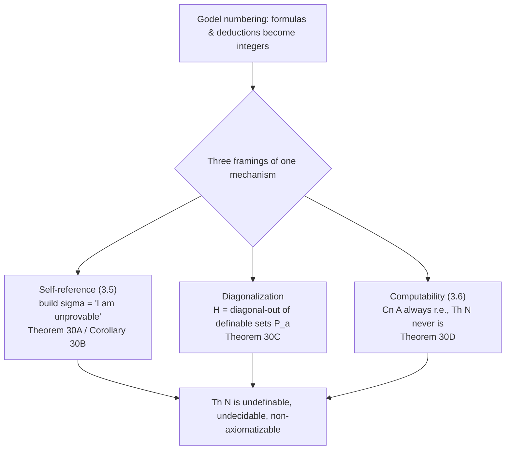
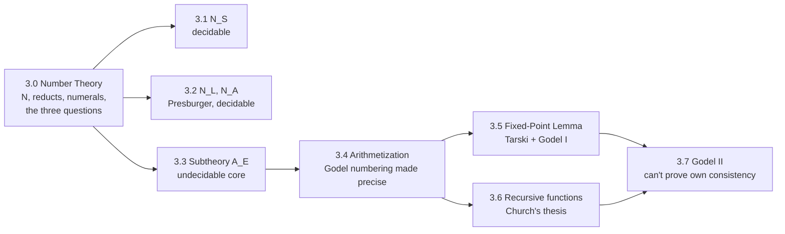

[[book-guidelines|↩ Back to guidelines]]

# The Language and Structure of Number Theory

## Why pin down "the" natural numbers as a structure?

Everything in Chapter 2 was general machinery: an arbitrary first-order language, an arbitrary structure interpreting it, a soundness/completeness theorem holding for *any* such pair. Chapter Three ("Undecidability") stops being general. It picks one specific language — the language of number theory — and one specific structure for it, and spends the rest of the book proving things *about that one structure*: Gödel's incompleteness theorems, Tarski's undefinability theorem, the undecidability of arithmetic. Section 3.0 is the setup chapter for all of that: it fixes the vocabulary, fixes the intended meaning, and — this is the part worth paying close attention to — previews the three questions that every later section in the chapter will come back and answer for a slightly different fragment of that vocabulary.

If you're used to thinking about this from the programming-languages side: Section 3.0 is doing the same job as the opening page of a language reference manual that says "here is our reduced instruction set, here is the reference implementation semantics, and here are the three properties (decidability, definability, model uniqueness) we will characterize for every subset of this instruction set as we build it up." Nothing here is deep yet. But it is the scaffolding everything else hangs on, and Enderton is explicit that he chose *this* structure, out of all the structures he could have picked, specifically because it turns out to be expressive enough to encode facts about decision procedures — which is precisely what will let him run a diagonal argument later.

## The intended structure $\mathfrak{N}$

The language of number theory is a first-order language with equality and these non-logical symbols ("parameters," in Enderton's terminology — everything in the language besides the fixed logical connectives, quantifier, variables, and equality):

- $0$ — a constant symbol, meant to denote the number zero.
- $S$ — a one-place function symbol, meant to denote the successor function $S : \mathbb{N} \to \mathbb{N}$, $S(n) = n+1$.
- $<$ — a two-place predicate symbol, meant to denote the usual strict ordering on $\mathbb{N}$.
- $+, \cdot, E$ — two-place function symbols, meant to denote addition, multiplication, and exponentiation.

The **intended structure** for this language — the one Enderton calls $\mathfrak{N}$ — interprets each symbol exactly the way its name suggests:

$$\mathfrak{N} = (\mathbb{N}; 0, S, <, +, \cdot, E).$$

This is worth being precise about, because it's easy to skate past: $\mathfrak{N}$ is *a* structure in the formal sense from Chapter 2 (a domain plus an interpretation function for every parameter — Enderton writes $0^{\mathfrak{N}} = 0$, $S^{\mathfrak{N}} = $ the successor function, and so on), it just happens to be the structure that matches everyday arithmetic. Nothing forces a structure for this language to look like $\mathbb{N}$ at all — you could build a structure where $<^{\mathfrak{A}}$ is empty and $S^{\mathfrak{A}}$ is the identity function, and it would still be a legal structure for the language. $\mathfrak{N}$ is just the one we actually care about. **Number theory**, as a technical term for the rest of the chapter, means the theory of this structure: $\mathrm{Th}\,\mathfrak{N}$, the set of all sentences of the language true in $\mathfrak{N}$.

**Grounding — a structure as a trait's one canonical `impl`.** If a first-order language is a `trait` declaring the symbols (`fn zero() -> Self`, `fn succ(&self) -> Self`, `fn lt(&self, other: &Self) -> bool`, ...), then a structure is one `impl` of that trait for some concrete carrier type. You could write many impls — over `Z/nZ`, over a two-element set, over anything satisfying the arities — and every one of them is a legitimate model. $\mathfrak{N}$ is the `impl Arithmetic for u64` that everyone actually means when they say "arithmetic": the one where `succ` really does add one and `lt` really is the usual order. The whole reason model theory is interesting is that a language's syntax never forces you to land on that one impl — which is exactly the fact Section 3.0's later "nonstandard models" question will exploit.

## Reducts: the same domain, a shrinking vocabulary

Rather than working with the full six-symbol structure $\mathfrak{N}$ immediately, Enderton spends most of Chapter Three studying **reducts** of $\mathfrak{N}$ — the same universe $\mathbb{N}$, but restricted to a *sublanguage* that only uses some of the parameters. A reduct doesn't change what any surviving symbol means; it just throws away the symbols (and the corresponding assignments) that aren't in the sublanguage. Four reducts recur through the chapter:

$$\mathfrak{N}_S = (\mathbb{N}; 0, S) \qquad \mathfrak{N}_L = (\mathbb{N}; 0, S, <) \qquad \mathfrak{N}_A = (\mathbb{N}; 0, S, <, +) \qquad \mathfrak{N}_M = (\mathbb{N}; 0, S, <, +, \cdot)$$

($\mathfrak{N}_S$ — "successor arithmetic" — studied in Section 3.1; $\mathfrak{N}_L$ and $\mathfrak{N}_A$ — adding order, then addition, giving Presburger arithmetic — studied in Section 3.2; $\mathfrak{N}_M$, adding multiplication but withholding exponentiation, studied later, Section 3.8.) The book asks the *same three questions* of every one of these structures, and the punchline of the chapter is that the answers change sharply as the vocabulary grows: $\mathrm{Th}\,\mathfrak{N}_S$ and $\mathrm{Th}\,\mathfrak{N}_A$ turn out to be decidable, but once you have enough multiplication and quantification to talk about primality — as $\mathfrak{N}_M$'s language can — decidability is gone for good. Somewhere between addition-only and full multiplication, undecidability switches on. Section 3.0 doesn't prove this yet; it just tells you this is the shape of the investigation to come.

**What breaks without the reducts.** You could, in principle, skip straight to proving everything about the full $\mathfrak{N}$. But then you'd never isolate *which* symbol is responsible for undecidability. By working reduct by reduct, Enderton pins the boundary precisely: successor alone is safe, order and addition together are still safe (Presburger's theorem), multiplication is where it breaks. That's a genuinely informative result, and it's only available because the reducts were treated as first-class objects of study rather than shortcuts.

**Grounding — reducts as a verifier's logic fragment.** This is worth sitting with if you're building a checker: the reduct move is *exactly* the design decision a program verifier makes when it chooses its assertion language. A Hoare-logic verifier over linear arithmetic (think Presburger-flavored — additions and comparisons, no free multiplication of two variables) gets to keep a decidable, complete decision procedure for its verification conditions — that's the whole appeal of tools that restrict themselves to linear arithmetic over full nonlinear arithmetic. The moment you let your specification language express unrestricted multiplication of unknowns (or worse, exponentiation), you've silently adopted the expressive power of $\mathfrak{N}_M$ or beyond, and your solver's job goes from "decidable, complete" to "no complete decision procedure exists, full stop." Choosing your logic fragment isn't a performance tweak — it is choosing which reduct of arithmetic your prover lives in, and that choice determines up front whether "prove this VC automatically" is even a solvable problem in principle, independent of how good your SMT solver is.

## Numerals: naming every natural number inside the language

A first-order language has infinitely many domain elements to talk about but, on the face of it, only one constant symbol, $0$. How do you refer to $7$? The language of number theory solves this with **numerals**: for each natural number $k$, the term

$$S^k 0$$

(that is, "$S$ applied $k$ times to $0$") denotes $k$. Written out: $S^0 0 = 0$, $S^1 0 = S0$, $S^2 0 = SS0$, and so on — the numerals are exactly the terms generated from $\{0\}$ by prefixing $S$. This gives every element of $\mathbb{N}$ a canonical *closed term* in the language — no free variables, no reference to an assignment function, just a syntactic name you can substitute directly into a formula. Enderton flags this explicitly as "a useful feature": whatever you want to say about a specific number, you now have a term to say it with.

You can already see this machinery doing real work in the section's own example. The set of primes is defined in $\mathfrak{N}$ by the formula

$$v_1 = S^1 0 \;\wedge\; \forall v_2\, \forall v_3\, (v_1 = v_2 \cdot v_3 \rightarrow v_2 = S^1 0 \vee v_3 = S^1 0)$$

— note the numeral $S^1 0$ standing in for "1" twice, doing the job that a numeral literal does in any programming language. Numerals are also exactly what makes the self-reference machinery previewed later in this section possible: a formula can name a specific Gödel number $q$ by using the numeral $S^q 0$, and substitute it into itself — that's the entire mechanical core of the fixed-point construction the chapter builds toward.

**What breaks without numerals.** Without a canonical term for each number, you could still quantify — $\forall v_1 (\ldots)$ — but you could never *pin one number down and refer back to it later in the same formula*, the way $\sigma$ in Theorem 30A below needs to refer to its own Gödel number. Diagonalization is fundamentally an act of "take this number, and now use *that exact number* as data inside a formula about numbers" — and that requires the language to have a name for every number, not just quantifiers ranging over them.

**Grounding — numerals as canonical term representatives.** This is precisely the concern your theorem prover's internal term representation has to solve: given a semantic value (a natural number, in Enderton's case), what is *the* canonical syntactic object denoting it, so that two occurrences of "the same value" are recognizable as syntactically equal rather than merely semantically equal? In Lean's kernel, numeric literals are elaborated to `OfNat.ofNat` applications backed by a binary representation, and definitional equality (`isDefEq`, ultimately grounded in `rfl`-style unfolding) is what certifies that two different-looking numeral terms denote the same value. Enderton's unary $S^k 0$ is the crudest possible version of the same idea — one canonical closed term per value — and it's crude on purpose: readability and provability, not efficiency, is the goal. If you were representing terms in a Rust AST for a small arithmetic DSL, this is the same design question as "do I represent the literal `7` as `Lit(7)` or unfold it structurally as `Succ(Succ(...(Zero)))`?" — Enderton picks the unfolded form specifically because arithmetization (turning formulas into numbers, coming two topics later) wants a uniform, structurally recursive syntax with no special-cased literal nodes.

## Definability: what you can carve out of $\mathbb{N}$ with a formula

A subset $R \subseteq \mathbb{N}^n$ is **definable in $\mathfrak{N}$** if some formula $\varphi(v_1, \ldots, v_n)$ of the language is true in $\mathfrak{N}$ exactly of the tuples in $R$ — the definability notion inherited directly from Chapter 2's semantics (Section 2.2), just specialized to this one structure. Section 3.0 makes two observations about definability that set up everything downstream:

First, a cardinality fact with real bite: since there are only countably many formulas but $2^{\aleph_0}$ subsets of $\mathbb{N}$, only countably many subsets of $\mathbb{N}$ can *possibly* be definable in $\mathfrak{N}$ — almost all subsets of $\mathbb{N}$ are, in this precise sense, indescribable. And yet — this is the point Enderton is making by immediately giving the primes example — "almost all the *familiar* relations" you'd ever want to write down (primality, divisibility, being a perfect square, being a power of two, and so on) turn out to be definable. The expressive language wins in practice even though it must lose in principle.

Second, definability is sensitive to the reduct you're in, and not in an obvious monotone way that always tracks "more symbols, more definable sets" pointwise per relation — the primes example is used precisely to demonstrate this: primality is definable in the full $\mathfrak{N}$, but *not* definable in $\mathfrak{N}_A$ (the addition-only reduct) — you genuinely need multiplication's expressive power to write that formula, addition alone cannot simulate it. Conversely, Section 3.8 will later show that any relation definable in the full $\mathfrak{N}$ is *also* definable in $\mathfrak{N}_M$ (multiplication, but no exponentiation) — a nontrivial closure fact, since it says $E$ turns out to be eliminable for definability purposes even though it's not eliminable as a primitive symbol.

**Why definability matters here, not just as a curiosity:** definability of *Gödel-number sets* is the load-bearing property behind the whole undecidability argument (see the preview below). Theorem 30A's hypothesis isn't "$A$ is a nice set of axioms" — it's specifically "the set $\{\sharp\alpha \mid \alpha \in A\}$ is definable in $\mathfrak{N}$." Definability of number-sets, not of arbitrary properties, is the technical hinge the rest of the chapter turns on.

## The preview: Gödel numbers and three roads to the same wall

Enderton now sketches — deliberately without full technical machinery, which is deferred to Section 3.4 — the strategy the rest of the chapter will execute. To each formula $\alpha$ of the language, we can assign an integer $\sharp\alpha$, its **Gödel number**: some effective, injective coding of syntax as arithmetic. (The actual coding scheme — a later dedicated topic, "[[Arithmetization-of-Syntax|Arithmetization of Syntax]]" — doesn't matter yet; all that matters here is that from $\alpha$ you can effectively compute $\sharp\alpha$, and vice versa, and similarly a finite sequence of formulas $D$ — e.g. a deduction — gets coded as an integer $G(D)$.) Once syntax has become numbers, a set of formulas $A$ becomes a set of numbers $\{\sharp\alpha \mid \alpha \in A\}$, and questions about provability become questions about arithmetic — which is exactly the trick that lets a first-order theory of arithmetic talk about *its own* proof relation.

Enderton previews three routes to the same destination — the point he's careful to flag up front is that these aren't really three different arguments, just three framings of one mechanism:

**1. Self-reference.** Build a sentence $\sigma$ that (indirectly) says "I am not provable from $A$." **Theorem 30A**: if $A \subseteq \mathrm{Th}\,\mathfrak{N}$ (every axiom in $A$ is actually true) and the Gödel-number set $\{\sharp\alpha \mid \alpha \in A\}$ is definable in $\mathfrak{N}$, then there is a sentence $\sigma$ true in $\mathfrak{N}$ but not deducible from $A$. The proof constructs a ternary relation $R$ — "$a$ is the Gödel number of a formula $\alpha$, and $c$ codes a deduction from $A$ of $\alpha(S^b0)$" — shows $R$ is definable (because $A$'s number-set is), takes a defining formula $\rho$, and diagonalizes: letting $q = \sharp(\forall v_3\, \neg\rho(v_1,v_1,v_3))$, the sentence $\sigma := \forall v_3\, \neg\rho(S^q0, S^q0, v_3)$ ends up asserting its own unprovability. **Corollary 30B**: taking $A = \mathrm{Th}\,\mathfrak{N}$ itself in Theorem 30A immediately gives that the Gödel-number set $\{\sharp\tau \mid \models_{\mathfrak{N}} \tau\}$ of *all* true sentences cannot be definable in $\mathfrak{N}$ — if it were, Theorem 30A would hand you a true, unprovable-from-everything-true sentence, which is absurd (everything true is trivially "deducible" from the set of all true things in the relevant sense the proof uses).

**2. Diagonalization**, without the self-reference framing. Define $P \subseteq \mathbb{N}^2$ by $\langle a,b\rangle \in P \iff a$ codes a one-free-variable formula $\alpha(v_1)$ and $\models_{\mathfrak{N}} \alpha(S^b 0)$ — informally, "$a$ is true of $b$." Every set definable in $\mathfrak{N}$ shows up as some "row" $P_a = \{b \mid \langle a,b\rangle \in P\}$ of this relation. Now run Cantor's diagonal construction directly on the enumeration: $H = \{b \mid \langle b,b\rangle \notin P\}$ cannot equal any $P_a$ (it disagrees with $P_a$ at $b=a$), so $H$ is not definable in $\mathfrak{N}$ — and by elimination, the only place a definition of $H$ could fail to translate into the language is at the one predicate that isn't otherwise translatable: "...is true in $\mathfrak{N}$." **Theorem 30C**: (a) the Gödel-number set of true sentences is not definable in $\mathfrak{N}$ (same fact as 30B, reached by the diagonal route instead); (b) $\mathrm{Th}\,\mathfrak{N}$ is undecidable; (c) $\mathrm{Th}\,\mathfrak{N}$ is not axiomatizable. (Part (b) leans on a fact proved later using Church's Thesis — every decidable set of numbers is definable in $\mathfrak{N}$ — so an undefinable Gödel-number set can't be decidable either; part (c) follows because $\mathrm{Th}\,\mathfrak{N}$, being the theory of a single fixed structure, is complete, and complete + undecidable + axiomatizable is a contradiction via Corollary 26I from Chapter 2.)

**3. Computability.** Section 2.6's machinery already tells you that if $A$ is a decidable (or merely effectively enumerable) set of axioms, then $\mathrm{Cn}\,A$ — everything provable from $A$ — is effectively enumerable. The computability approach shows, via Church's Thesis, that $\mathrm{Th}\,\mathfrak{N}$ itself is *not* effectively enumerable. **Theorem 30D**: for any decidable (or effectively enumerable) axiom set $A$, $\mathrm{Cn}\,A \neq \mathrm{Th}\,\mathfrak{N}$ — because the left side is always effectively enumerable and the right side never is. Enderton states the resulting dilemma plainly: either your axioms let you deduce something false (unsound), or your axioms are incomplete (some truth about $\mathfrak{N}$ is out of reach). There is no third option.

**Mermaid — the shared skeleton of all three routes:**

## The three guiding questions

Section 3.0 closes its setup by stating, once and for all, the three questions the chapter will ask of *every* structure it studies — $\mathfrak{N}_S$, $\mathfrak{N}_L$, $\mathfrak{N}_A$, $\mathfrak{N}_M$, and finally $\mathfrak{N}$ itself:

- **(A) Decidability.** Is the theory of the structure decidable? If so, is there a nice — ideally finite — axiomatization?
- **(B) Definability.** Which subsets of $\mathbb{N}$ (or $\mathbb{N}^n$) are definable in the structure?
- **(C) Nonstandard models.** What do models of the theory that are *not isomorphic to the intended structure* look like?

These aren't three independent curiosities — they're deeply entangled, and the chapter's own logic threads them together: definability of Gödel-number sets is what makes the self-reference/diagonal arguments run (question B feeding the undecidability argument), and Church's Thesis is the bridge that turns "decidable" into "definable" so that undefinability (proved directly) forces undecidability (question A) as a corollary. Nonstandard models (question C) get comparatively little airtime in Section 3.0 itself — but the chapter's very next section, on $\mathfrak{N}_S$, opens by constructing them (the notion of a "Z-chain": a nonstandard model of successor arithmetic looks like $\mathbb{N}$ followed by disjoint copies of $\mathbb{Z}$), and this is the reduct-by-reduct study's other payoff: as the language gets more expressive, the nonstandard models get more tightly constrained, right up to the point (full $\mathfrak{N}$) where no finite or decidable axiomatization can even pin down the standard model uniquely — a fact the incompleteness theorems make precise later.

**Grounding — the same three questions, asked of your own logic fragment.** If you're designing a verifier's specification language or an automated theorem prover's proof-search fragment, these are literally the three questions you need answered before you ship it, and Enderton is handing you the template for asking them systematically rather than by ad hoc worry: (A) is checking whether a formula in my fragment holds *decidable at all*, and if so is there a complete axiomatization my prover can actually search over — the SMT-solver-exists-or-doesn't question; (B) what can a user of my specification language actually express — if the fragment can't define "is prime," can it define the invariants I actually need to state; (C) does my fragment pin down the intended model uniquely, or does it admit models the user didn't intend — a real risk in underspecified Hoare-logic axiomatizations, where a "provable" postcondition can hold in some unintended nonstandard model of your arithmetic theory without holding of the actual integers your program runs on. Every fragment you might choose (Presburger-only, linear arithmetic plus uninterpreted functions, full nonlinear arithmetic) sits somewhere on this same three-axis map, and Enderton's chapter is, in effect, a worked case study in exactly how these three axes trade off against each other as expressiveness grows.

## Where this leads

Section 3.0 is the chapter's table of contents in prose form. Concretely:

- **3.1–3.2** answer questions (A)–(C) for the weak reducts $\mathfrak{N}_S$ and $\mathfrak{N}_L, \mathfrak{N}_A$ — successor arithmetic and Presburger arithmetic both turn out decidable, with quantifier elimination as the technique and Z-chains as the nonstandard-model picture.
- **3.3** finds a genuinely *undecidable* axiom set $A_E$, a small subtheory of number theory, by way of primitive recursion and the notion of a *representable* relation/function — the real technical foundation the self-reference argument was gesturing at with "definable" above.
- **3.4** (a later dedicated article) makes the Gödel-numbering sketched above fully precise: the coding $\sharp$, and the proof that syntactic relations like "is a deduction" are representable in $\mathrm{Cn}\,A_E$.
- **3.5** delivers on Theorem 30A's proof sketch for real: the Fixed-Point Lemma, Tarski's Undefinability Theorem, and Gödel's First Incompleteness Theorem.
- **3.6** makes the computability approach (Theorem 30D) precise via recursive functions and Church's Thesis.
- **3.7** closes the chapter with the Second Incompleteness Theorem — a sufficiently strong consistent theory cannot prove its own consistency.

Every one of these sections is, in a real sense, discharging one of the three promissory notes Section 3.0 wrote: which reducts are decidable, which relations are definable in each, and what the nonstandard models look like once the standard model can no longer be pinned down.

