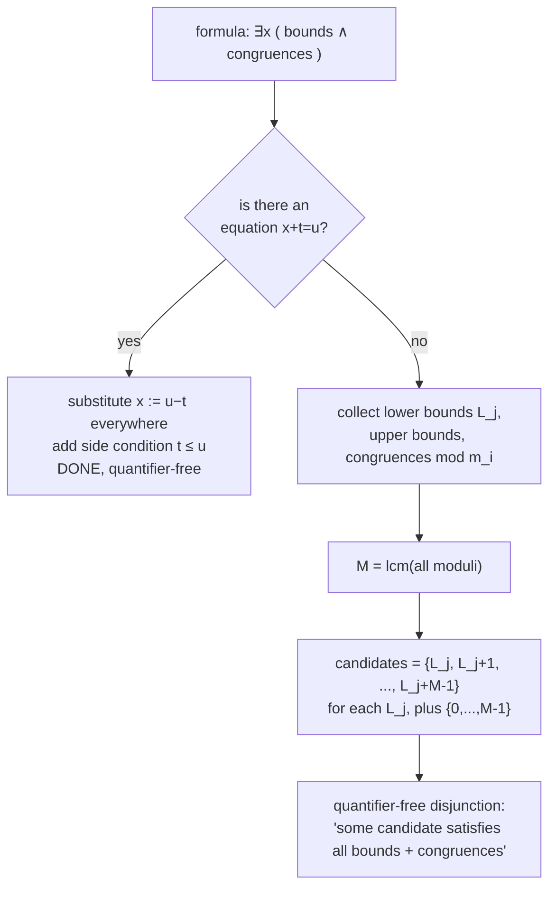

# Weak Fragments of Number Theory

[[book-guidelines|↩ Back to guidelines]]

## Why bother with a *weak* number theory at all?

The big theorem looming over Chapter 3 is that full number theory — the structure $\mathfrak{N} = (\mathbb{N}; 0, S, <, +, \cdot, E)$, with successor, order, addition, multiplication, and exponentiation all in the language — has an undecidable theory. There is no algorithm that, given an arbitrary first-order sentence about the natural numbers, tells you whether it's true. That's Gödel/Church/Turing territory, and it's coming in Section 3.3 onward.

But before tearing that down, Enderton does something more interesting than just asserting undecidability: he shows *exactly where the line is*. Strip multiplication (and exponentiation) out of the language, and — surprisingly — the theory becomes decidable again. Not "probably decidable" or "decidable in principle by some abstract argument" — decidable *by an actual algorithm you could code up*, one that terminates on every input and tells you true or false.

That's the payoff of this section, and it's why it matters for anything you'd build as a real decision procedure: it's not enough to know a theory is decidable in the abstract sense (complete + axiomatizable implies decidable, by a counting argument — enumerate proofs until you find one). You want a procedure that's actually usable. The technique that delivers this is called **[[Models-of-Theories#Elimination of quantifiers|elimination of quantifiers]]** (QE), and it is, in every sense that matters to you as an engineer, a *compiler pass*: it rewrites a formula with quantifiers into an equivalent formula without them, recursively, by pattern-matching on syntactic shape. If you've ever written a constant-folding or strength-reduction pass, the shape of this proof will feel familiar.

Three structures get this treatment, each one adding back a symbol:

$$\mathfrak{N}_S = (\mathbb{N}; 0, S) \quad\subset\quad \mathfrak{N}_L = (\mathbb{N}; 0, S, <) \quad\subset\quad \mathfrak{N}_A = (\mathbb{N}; 0, S, <, +)$$

Successor only, then successor plus order, then successor plus order plus addition — this last one is **Presburger arithmetic**, and its decidability (Presburger, 1929) is a landmark result: it's the theoretical basis for real array-bounds-checking and loop-invariant verification tools today (SMT solvers routinely include a Presburger decision procedure, sometimes literally called "the Omega test" in the older verification literature). The moment you add multiplication back in — Section 3.3 — all of this collapses. Understanding *why* the line falls exactly where it does is the point of this article.

## Part 1 — Successor arithmetic, $\mathfrak{N}_S = (\mathbb{N}; 0, S)$

### The axioms

Strip the language down to just equality, $0$, and the successor function symbol $S$ (so $S(x)$, or $Sx$, means "$x+1$", but you're not allowed to write $+$). You still have every numeral — $S0$ is 1, $SS0$ is 2, and so on — so you can name any specific natural number. What you *can't* express is anything that requires comparing or combining two different unknowns arithmetically. Enderton lists the axioms true in $\mathfrak{N}_S$ that will turn out to axiomatize the whole theory, call this set $A_S$:

- **S1**: $\forall x \; Sx \neq 0$ — zero has no predecessor.
- **S2**: $\forall x \forall y (Sx = Sy \rightarrow x = y)$ — successor is injective.
- **S3**: $\forall y (y \neq 0 \rightarrow \exists x \; y = Sx)$ — every nonzero element has a predecessor.
- **S4.$n$** (one axiom per $n = 1, 2, \dots$): $\forall x \; S^n x \neq x$ — no successor-cycles of length $n$ (here $S^n x$ means $S$ applied $n$ times).

Note this is an *infinite* axiom set — one axiom per $n$ ruling out cycles of that length. That already tells you something: a finite subset of $A_S$ can never pin down "no cycles of any length," so (Exercise 6) $\mathrm{Th}\,\mathfrak{N}_S$ turns out not to be finitely axiomatizable, even though it *is* decidable. Decidable and finitely axiomatizable are different properties — worth keeping straight, because it's tempting to conflate them.

### What a model of $A_S$ has to look like

This is the part worth sitting with, because it's the engine behind everything that follows. Take *any* model $\mathfrak{A} = (|A|; 0^A, S^A)$ satisfying $A_S$. What does its underlying set have to look like?

$S^A$ is injective (S2) and everything but $0^A$ is in its range (S1, S3), so starting from $0^A$ and repeatedly applying $S^A$, you get an infinite chain of distinct elements — the "standard part," isomorphic to the actual natural numbers:

$$0^A \to S^A(0^A) \to S^A(S^A(0^A)) \to \cdots$$

But the model might have *more* elements than that. Take any element $a$ not in the standard part. It has a successor, a successor's successor, etc. — and by S3/S2 it also has a unique predecessor, a predecessor's predecessor, etc. None of these can loop back (that's what the infinite family S4.$n$ rules out) and none can hit the standard part (the standard part only has forward successors from $0^A$; nothing maps *into* $0^A$). So $a$ sits in a doubly-infinite chain:

$$\cdots \to * \to * \to a \to S^A(a) \to S^A(S^A(a)) \to \cdots$$

Enderton calls this a **$Z$-chain**, because it's shaped exactly like the integers $\mathbb{Z} = \{\ldots, -1, 0, 1, 2, \ldots\}$ — no endpoints in either direction. Different $Z$-chains are forced to be disjoint from each other and from the standard part (S2 again — successor can't merge two chains).

This is a complete structural classification: *any* model of $A_S$ is the standard part, plus some number of disjoint $Z$-chains — nothing else is possible, and (check the axioms) anything of this shape *is* a model. The classification is purely combinatorial: a model is determined up to isomorphism by nothing more than **how many $Z$-chains it has** (Lemma 31A — swap chains isomorphically, use choice to glue). $\mathfrak{N}_S$ itself has zero $Z$-chains.

<svg viewBox="0 0 720 260" xmlns="http://www.w3.org/2000/svg" font-family="monospace" font-size="13">
  <!-- Standard part -->
  <text x="10" y="30" fill="#888">standard part</text>
  <circle cx="40" cy="60" r="10" fill="none" stroke="#6699cc" stroke-width="2"/>
  <text x="35" y="64" fill="#6699cc" font-size="11">0</text>
  <line x1="50" y1="60" x2="90" y2="60" stroke="#888" stroke-width="1.5" marker-end="url(#arrow)"/>
  <circle cx="100" cy="60" r="10" fill="none" stroke="#6699cc" stroke-width="2"/>
  <line x1="110" y1="60" x2="150" y2="60" stroke="#888" stroke-width="1.5" marker-end="url(#arrow)"/>
  <circle cx="160" cy="60" r="10" fill="none" stroke="#6699cc" stroke-width="2"/>
  <line x1="170" y1="60" x2="210" y2="60" stroke="#888" stroke-width="1.5" marker-end="url(#arrow)"/>
  <text x="215" y="64" fill="#888">...</text>

  <!-- Z-chain 1 -->
  <text x="10" y="120" fill="#888">a Z-chain (nonstandard)</text>
  <text x="30" y="154" fill="#888">...</text>
  <line x1="55" y1="150" x2="95" y2="150" stroke="#cc7a4d" stroke-width="1.5" marker-end="url(#arrow2)"/>
  <circle cx="105" cy="150" r="10" fill="none" stroke="#cc7a4d" stroke-width="2"/>
  <line x1="115" y1="150" x2="155" y2="150" stroke="#cc7a4d" stroke-width="1.5" marker-end="url(#arrow2)"/>
  <circle cx="165" cy="150" r="10" fill="none" stroke="#cc7a4d" stroke-width="2"/>
  <text x="158" y="154" fill="#cc7a4d" font-size="11">a</text>
  <line x1="175" y1="150" x2="215" y2="150" stroke="#cc7a4d" stroke-width="1.5" marker-end="url(#arrow2)"/>
  <circle cx="225" cy="150" r="10" fill="none" stroke="#cc7a4d" stroke-width="2"/>
  <line x1="235" y1="150" x2="275" y2="150" stroke="#cc7a4d" stroke-width="1.5" marker-end="url(#arrow2)"/>
  <text x="280" y="154" fill="#888">...</text>

  <!-- Z-chain 2 -->
  <text x="30" y="214" fill="#888">...</text>
  <line x1="55" y1="210" x2="95" y2="210" stroke="#7aa87a" stroke-width="1.5" marker-end="url(#arrow3)"/>
  <circle cx="105" cy="210" r="10" fill="none" stroke="#7aa87a" stroke-width="2"/>
  <line x1="115" y1="210" x2="155" y2="210" stroke="#7aa87a" stroke-width="1.5" marker-end="url(#arrow3)"/>
  <circle cx="165" cy="210" r="10" fill="none" stroke="#7aa87a" stroke-width="2"/>
  <line x1="175" y1="210" x2="215" y2="210" stroke="#7aa87a" stroke-width="1.5" marker-end="url(#arrow3)"/>
  <circle cx="225" cy="210" r="10" fill="none" stroke="#7aa87a" stroke-width="2"/>
  <line x1="235" y1="210" x2="275" y2="210" stroke="#7aa87a" stroke-width="1.5" marker-end="url(#arrow3)"/>
  <text x="280" y="214" fill="#888">...</text>

  <text x="330" y="120" fill="#888">disjoint from standard part</text>
  <text x="330" y="140" fill="#888">and from each other —</text>
  <text x="330" y="160" fill="#888">no cycles (S4.n), no merges (S2)</text>

  <defs>
    <marker id="arrow" markerWidth="8" markerHeight="8" refX="6" refY="4" orient="auto"><path d="M0,0 L8,4 L0,8 z" fill="#888"/></marker>
    <marker id="arrow2" markerWidth="8" markerHeight="8" refX="6" refY="4" orient="auto"><path d="M0,0 L8,4 L0,8 z" fill="#cc7a4d"/></marker>
    <marker id="arrow3" markerWidth="8" markerHeight="8" refX="6" refY="4" orient="auto"><path d="M0,0 L8,4 L0,8 z" fill="#7aa87a"/></marker>
  </defs>
</svg>

There's a subtlety worth naming explicitly: **no sentence of this language can say "there are no $Z$-chains."** By the Löwenheim–Skolem–Tarski theorem there's an uncountable structure $\mathfrak{A}$ elementarily equivalent to $\mathfrak{N}_S$ — meaning it satisfies exactly the same sentences — yet $\mathfrak{A}$ has uncountably many $Z$-chains and $\mathfrak{N}_S$ has none. "No $Z$-chains" is a property of the *particular* model, invisible to first-order sentences. This is your first hint of the recurring theme in model theory (and later, in [[Nonstandard-Analysis|nonstandard analysis]]): first-order logic cannot pin down "no junk beyond what I built" — a nonstandard model can carry along extra structure that no sentence can detect or forbid.

**Why decidability follows.** Any two uncountable models of $A_S$ with the same cardinality have the same number of $Z$-chains (cardinal arithmetic: if there's $\lambda$ many $Z$-chains, the model has $\aleph_0 + \aleph_0 \cdot \lambda$ elements, which for uncountable $\lambda$ is just $\lambda$) — hence are isomorphic (Theorem 31B). So $\mathrm{Cn}\,A_S$ is *categorical in every uncountable power*. Combined with the fact that $A_S$ has no finite models (S4.1 alone rules those out), the **Łoś–Vaught test** (from Chapter 2's compactness material) applies directly: a theory with no finite models that's categorical in some infinite power is complete. So $\mathrm{Cn}\,A_S$ is a complete theory (Theorem 31C), and since it's a true, satisfiable subset of $\mathrm{Th}\,\mathfrak{N}_S$, completeness forces $\mathrm{Cn}\,A_S = \mathrm{Th}\,\mathfrak{N}_S$ (Corollary 31D).

And now the general theorem that a complete, *axiomatizable* theory is automatically decidable (proved earlier via effective proof-search: enumerate all proofs from the axioms, and for a complete theory, either $\sigma$ or $\neg\sigma$ is provable, so the search always terminates) gives you:

> **Corollary 31E.** $\mathrm{Th}\,\mathfrak{N}_S$ is decidable.

**What breaks without the model classification.** This entire argument hinges on being able to *characterize every model* of $A_S$ up to isomorphism by a single number (its count of $Z$-chains). If successor arithmetic allowed richer structures — say, models that could branch, or merge, or have chains of varying "widths" — you wouldn't get categoricity in uncountable powers, the Łoś–Vaught test wouldn't fire, and you'd have no route to completeness through this argument. The austerity of the language (just $0$ and $S$) is precisely what keeps the space of possible models small enough to classify.

## Part 2 — Quantifier elimination: decidability you can actually run

Corollary 31E is a real theorem, but it's a *terrible* algorithm: "enumerate proofs until you find one" is decidability in the same sense that brute-forcing SAT is decidability — technically an algorithm, uselessly slow, and it gives you no insight into *why* a sentence is true. Enderton immediately follows up with something much better: a **direct, syntactic decision procedure**, built by showing that $\mathrm{Th}\,\mathfrak{N}_S$ *admits elimination of quantifiers*.

### The definition, and why it's enough to handle one syntactic shape

**Definition.** A theory $T$ admits elimination of quantifiers iff for every formula $\varphi$ there's a quantifier-free formula $\psi$ with $T \models (\varphi \leftrightarrow \psi)$.

That's a strong-sounding claim about *every* formula, with arbitrarily nested quantifiers. Theorem 31F cuts the work down to almost nothing: **it suffices to handle formulas of the shape**

$$\exists x (\alpha_0 \wedge \cdots \wedge \alpha_n)$$

where each $\alpha_i$ is atomic or the negation of an atomic formula — i.e., a single existential quantifier over a conjunction of literals. Why is that enough? Any quantifier-free formula can be put into disjunctive normal form (a disjunction of conjunctions of literals), and $\exists x$ distributes over $\vee$:

$$\exists x[(\alpha_0 \wedge \cdots) \vee (\beta_0 \wedge \cdots) \vee \cdots] \;\equiv\; \exists x(\alpha_0 \wedge \cdots) \vee \exists x(\beta_0 \wedge \cdots) \vee \cdots$$

So handle each disjunct separately, and you've eliminated one quantifier from an arbitrary formula. Peel quantifiers off one at a time, innermost first, and by induction you eliminate all of them from any formula whatsoever. This is exactly the recursive structure of a compiler pass that normalizes an AST bottom-up: solve the base case (one quantifier, conjunction of literals), then the general case falls out by structural induction over the rest of the grammar.

### The algorithm for $\mathfrak{N}_S$

In the language of $\mathfrak{N}_S$, every term has the shape $S^k u$ where $u$ is $0$ or a variable — there's nothing else to build a term out of. Every atomic formula is an equation between two such terms. Given $\exists x(\alpha_0 \wedge \cdots \wedge \alpha_q)$ where every $\alpha_i$ mentions $x$ (conjuncts not mentioning $x$ just float outside the quantifier for free), each $\alpha_i$ reduces to the form $S^m x = S^n u$ (or its negation), with $u$ being $0$ or some other variable. Then:

- **Case 1 — every conjunct is a negated equation.** No positive constraint pins $x$ down to a specific value, and the language can always name *some* value avoiding finitely many forbidden ones (the domain is infinite). Replace the whole formula by $0 = 0$ (always true).
- **Case 2 — some conjunct $\alpha_0$ is a positive equation**, say $S^m x = t$ where $t$ doesn't mention $x$. This pins $x$ down completely: $x$ must equal "$t$ minus $m$", which only makes sense if $t$ is actually $\geq m$. So replace $\alpha_0$ by the side condition $t \neq 0 \wedge \cdots \wedge t \neq S^{m-1}0$ (i.e. $t$ isn't one of the first $m$ numerals — "$t \geq m$" spelled out without subtraction). Then substitute this solved value of $x$ into every other conjunct: $S^k x = u$ becomes, after shifting by $m$, an equation purely in $t$ and $u$ with no $x$ left.

Once every $\alpha_i$ is rewritten without $x$, drop the now-vacuous quantifier. That's the entire algorithm — no search, no backtracking, just pattern-matching on the shape of the literals and substituting.

**Rust-shaped version.** Here's the same algorithm sketched as a genuine compiler pass — a `Term`/`Formula` AST and a function that recursively strips quantifiers, matching the book's case analysis directly against enum variants:

```rust
enum Term {
    Zero,
    Succ(Box<Term>),   // S(t)
    Var(String),
}

enum Formula {
    Eq(Term, Term),
    Not(Box<Formula>),
    And(Box<Formula>, Box<Formula>),
    Or(Box<Formula>, Box<Formula>),
    Exists(String, Box<Formula>),
}

// Peel S off a term, returning (k, base) so that term == S^k(base).
fn peel(t: &Term) -> (usize, &Term) {
    match t {
        Term::Succ(inner) => {
            let (k, base) = peel(inner);
            (k + 1, base)
        }
        other => (0, other),
    }
}

// Eliminate one quantifier from `Exists(x, conjunction_of_literals)`.
// Assumes the body is already a conjunction of atomic/negated-atomic literals.
fn eliminate_one(x: &str, literals: &[Formula]) -> Formula {
    // Case 2: look for a positive equation pinning x down.
    if let Some(pos) = literals.iter().find_map(|lit| match lit {
        Formula::Eq(a, b) if mentions(a, x) => Some((a, b)),
        Formula::Eq(a, b) if mentions(b, x) => Some((b, a)),
        _ => None,
    }) {
        let (m, _x_var) = peel(pos.0);
        let t = pos.1.clone();
        // side condition: t is not one of the first m numerals (t >= m)
        let side_condition = at_least(&t, m);
        // substitute t (shifted by m) for x in every other literal
        let rest = literals.iter()
            .filter(|l| !std::ptr::eq(*l, pos.0 as *const _ as *const Formula))
            .map(|l| substitute(l, x, &t, m))
            .fold(side_condition, |acc, f| Formula::And(Box::new(acc), Box::new(f)));
        rest
    } else {
        // Case 1: only negated equations — infinite domain always has a witness.
        Formula::Eq(Term::Zero, Term::Zero) // "true"
    }
}
```

(`mentions`, `substitute`, `at_least` are the obvious structural-recursion helpers — this is meant to show the *shape* of the decision procedure, not a full, compiling implementation.) The point: `eliminate_one` is a total function that always terminates, always produces a strictly smaller formula (fewer quantifiers), and the composition of these calls, bottom-up over the AST, *is* the decision procedure. Feed it a closed sentence and out comes a quantifier-free sentence built entirely from equations like $S^k 0 = S^l 0$ — trivially decidable by comparing $k$ and $l$.

### Bonus: this re-derives completeness, for free

Once you have QE, you get an independent, more constructive proof that $\mathrm{Cn}\,A_S$ is complete, without touching Z-chains or the Löš–Vaught test at all: reduce any sentence $\sigma$ to a quantifier-free $\tau$ via the algorithm above; $\tau$ is built from atomic sentences of the form $S^k 0 = S^l 0$, each of which is either provable from just $\{S1, S2\}$ (if $k = l$) or refutable (if $k \neq l$); combine through $\neg$ and $\rightarrow$ and every quantifier-free sentence is decided; hence $\sigma$ itself is decided by $A_S$. Two independent routes to the same result — model-theoretic (Łoś–Vaught) and proof-theoretic/algorithmic (QE) — landing on the same completeness fact is a good sanity check that the classification of models in Part 1 wasn't an accident.

**What breaks without QE, concretely.** Definability also falls out as a side effect: since every 2-variable formula reduces to a quantifier-free equivalent, and the quantifier-free fragment can only express "finitely many exceptions" or "cofinitely many" conditions (Exercise 4/5), you get for free that the *order relation* $<$ is **not definable** in $\mathfrak{N}_S$ — there's no quantifier-free formula in just $0, S$ that captures "$m < n$" for all pairs. Without QE you'd have no handle on this at all; you'd be stuck trying to prove a negative ("no formula defines this") by staring at infinitely many candidate formulas. QE turns "no formula defines $<$" into "no *quantifier-free* formula defines $<$" — a finite, checkable syntactic class.

## Part 3 — Adding order back: $\mathfrak{N}_L = (\mathbb{N}; 0, S, <)$

Add the ordering symbol $<$ back to the language. Now the theory is **finitely** axiomatizable — six axioms $A_L$ suffice, using $x \leq y$ as shorthand for $x < y \vee x = y$:

$$
\begin{aligned}
&\forall y\;(y \neq 0 \rightarrow \exists x\; y = Sx) &&\text{(S3)}\\
&\forall x \forall y\;(x < Sy \leftrightarrow x \leq y) &&\text{(L1)}\\
&\forall x\; \neg(x < 0) &&\text{(L2)}\\
&\forall x \forall y\;(x < y \vee x = y \vee y < x) &&\text{(L3, trichotomy)}\\
&\forall x \forall y\;\neg(x < y \wedge y < x) &&\text{(L4, antisymmetry-ish)}\\
&\forall x \forall y \forall z\;(x<y \wedge y<z \rightarrow x<z) &&\text{(L5, transitivity)}
\end{aligned}
$$

A short chain of derivations shows $A_L \vdash S1$ and $A_L \vdash S2$ and $A_L \vdash$ every S4.$n$ — so any model of $A_L$, forgetting $<$, is automatically a model of $A_S$ too. That means the model classification from Part 1 carries straight over: a model of $A_L$ is a standard part plus some $Z$-chains, now additionally linearly ordered.

Quantifier elimination for $\mathrm{Cn}\,A_L$ (Theorem 32A) follows the exact same recipe as Part 2, with one extra step: first eliminate negation (using trichotomy L3/L4 to rewrite $\neg(t_1 < t_2)$ as $t_2 \leq t_1$, etc.), so you're down to positive atomic literals only. Then split on whether the existential formula has an equation pinning the variable down (handled exactly as in $\mathfrak{N}_S$) or is purely inequalities — in which case you collect the lower bounds $t_i < S^{m_i}x$ and upper bounds $S^{n_j}x < u_j$ on the quantified variable, and the formula is satisfiable exactly when "every lower bound plus one satisfies every upper bound, and zero satisfies every upper bound" — a purely quantifier-free arithmetic condition, spelled out over the finitely many bound terms. This is precisely the shape of interval/range analysis a compiler does for bounds-checking: you're eliminating an existential by replacing it with a closed-form feasibility condition on the interval $(\text{glb}, \text{lub})$.

This gives $\mathrm{Cn}\,A_L = \mathrm{Th}\,\mathfrak{N}_L$, decidability of $\mathrm{Th}\,\mathfrak{N}_L$ (Corollary 32B), and definability results in the same style: a subset of $\mathbb{N}$ is definable in $\mathfrak{N}_L$ iff finite or cofinite (same as $\mathfrak{N}_S$ — adding order alone buys you *more relations definable in two variables*, like $<$ itself now trivially, but no richer *unary* sets) — while **addition itself is still not definable** in $\mathfrak{N}_L$ (Corollary 32D: if you could define $+$, you could define the even numbers, which is neither finite nor cofinite, contradiction). Order alone isn't enough machinery to reconstruct addition.

## Part 4 — Presburger arithmetic: $\mathfrak{N}_A = (\mathbb{N}; 0, S, <, +)$

This is the headline result of the section: **Theorem 32E (Presburger, 1929)** — $\mathrm{Th}\,\mathfrak{N}_A$, the full theory of the natural numbers with successor, order, *and addition*, is decidable.

### Why $\mathfrak{N}_A$ itself does not admit quantifier elimination

Here's a genuinely instructive wrinkle. Unlike the previous two cases, $\mathrm{Th}\,\mathfrak{N}_A$ **does not** admit elimination of quantifiers directly. The formula defining the even numbers,

$$\exists y\; v_1 = y + y,$$

has no quantifier-free equivalent in the language $(0, S, <, +)$ alone. Intuitively: quantifier-free formulas over this language can only express bounded arithmetic constraints and comparisons, and "is a multiple of 2" is a genuinely modular condition that these constraints can't pin down without help.

**The fix is to enrich the language, not weaken the goal.** Add a family of new binary relation symbols $\equiv_2, \equiv_3, \equiv_4, \ldots$ for congruence modulo $k$, giving the expanded structure

$$\mathfrak{N}_{\equiv} = (\mathbb{N}; 0, S, <, +, \equiv_2, \equiv_3, \ldots)$$

*This* structure's theory does admit elimination of quantifiers. This is a general and important move in the QE toolkit: if a theory almost admits QE but keeps needing one specific relation as a witness, throw that relation into the language as a primitive and eliminate quantifiers *there* instead. (You still owe a separate argument — done at the end — that adding all these new symbols doesn't itself break decidability; enriching the language for QE purposes and getting decidability back out are two different steps.)

### The algorithm, step by step

This is the most elaborate QE procedure in the section, and it's worth walking through because its *shape* — normalize terms, uniformize coefficients, eliminate a coefficient by substitution, bound-search over a finite residue window — is recognizably the ancestor of real Presburger-arithmetic decision procedures used in program verification today (the Omega test, and the Presburger fragments inside modern SMT solvers).

1. **Normal form for terms.** Every term expands to $S^{n_0}0 + n_1 x_1 + \cdots + n_k x_k$ (repeated addition written as scalar multiples of variables — recall multiplication *by a numeral* is just definable via iterated $+$, unlike general multiplication).
2. **Eliminate negation**, same idea as before: $\neg(t_1 = t_2)$ becomes $t_1 < t_2 \vee t_2 < t_1$; $\neg(t_1 < t_2)$ becomes $t_1 = t_2 \vee t_2 < t_1$; $\neg(t_1 \equiv_m t_2)$ becomes a disjunction over the $m-1$ other residues. Regroup into $\exists y(\alpha_1 \wedge \cdots \wedge \alpha_m)$ where every $\alpha_i$ is atomic and mentions $y$, in one of four forms: $ny + t = u$, $ny + t \equiv_m u$, $ny + t < u$, $u < ny + t$.
3. **Uniformize the coefficient of $y$.** Let $p$ be the LCM of all the coefficients appearing on $y$; multiply every literal through so $y$'s coefficient is uniformly $p$ everywhere (for congruences, multiplying by $k$ means also multiplying the modulus by $k$: $a \equiv_m b$ iff $ka \equiv_{km} kb$).
4. **Substitute out the coefficient.** Replace $py$ by a fresh variable $x$, adding the side conjunct $x \equiv_p 0$ ("$x$ is a multiple of $p$"). Now every literal has $x$ with coefficient exactly 1.
5. **Special case — an equation is present.** If some literal is $x + t = u$, you can solve directly: substitute $u - t$ for $x$ everywhere else (written without real subtraction, by transposing terms) and add the side condition $t \leq u$. Done — no case 6 needed, this is a full solution for $x$.
6. **Otherwise — only inequalities and congruences remain.** You now have a formula of the shape
   $$\exists x\Big[\bigwedge_j (r_j - s_j < x) \;\wedge\; \bigwedge_i (x < t_i - u_i) \;\wedge\; \bigwedge_i (x \equiv_{m_i} v_i - w_i)\Big]$$
   — lower bounds, upper bounds, and modular constraints on $x$, none of which mention $x$ themselves. If there are **no congruences**, this is just an interval-feasibility check: replace the whole thing by "every lower bound $+1$ is below every upper bound, and zero is below every upper bound" — quantifier-free.

   With congruences present, here's the key finiteness insight: let $M$ be the LCM of all the moduli $m_0, \ldots, m_{n-1}$. Residues modulo each $m_i$ repeat with period $M$ (since $a + M \equiv_{m_i} a$ for every $i$). So **if a solution for $x$ exists at all, one exists within any window of $M$ consecutive integers above a lower bound.** You never need to search infinitely far — check $L_j, L_j+1, \ldots, L_j + M - 1$ for each lower bound $L_j$ (plus the window starting at 0, to catch the case where $x$ is small and every "lower bound" term is actually negative). The existential collapses into a finite, quantifier-free disjunction enumerating these $O(M \cdot l)$ candidate residues and asserting each satisfies all the bounds and congruences.



Once every atomic sentence reduces to $S^n 0 \equiv_m S^p 0$ (decidable by checking $n \equiv_m p$ directly), you have both halves of decidability: (1) an effective procedure from any sentence $\sigma$ to a quantifier-free $\tau$, and (2) an effective way to evaluate $\tau$. That's Theorem 32E, in full.

**Complexity, honestly.** Enderton flags this immediately: in 1974, Fischer and Rabin showed there is **no** decision procedure for Presburger arithmetic fast enough to be feasible on long formulas — the problem is provably doubly-exponential in the worst case. Decidable does not mean fast. This is worth internalizing as an engineer: a positive decidability theorem gives you a correctness argument for your decision procedure, never a performance budget. Real SMT implementations of Presburger arithmetic spend enormous engineering effort on heuristics and special-casing to stay off the worst-case exponential blowup in practice.

### Definability: eventually periodic sets, exactly

QE for $\mathfrak{N}_A$ pays off with a clean characterization (Theorem 32F): **a set of natural numbers is definable in $(\mathbb{N}; 0, S, <, +)$ if and only if it is eventually periodic** — meaning past some threshold $M$, membership repeats with period $p$: $n \in D \iff n+p \in D$ for all $n > M$. The four possible atomic-formula shapes with one free variable ($ny+t=u$, the inequalities, and $ny + t \equiv_m u$) define, respectively: a finite set, a finite set, a cofinite set, and a periodic set — and eventually-periodic sets are closed under union/intersection/complement, so every quantifier-free (hence every) definable set is eventually periodic. As an immediate corollary, **multiplication is not definable** in $\mathfrak{N}_A$: if it were, you could define the squares, and the set of perfect squares is not eventually periodic (the gaps between consecutive squares grow without bound). This is your first hard evidence of *why* multiplication is qualitatively different from addition for decidability purposes — it defines sets with unbounded, non-repeating structure that these weak fragments simply cannot talk about.

## Part 5 — Z-chains revisited: what nonstandard models of Presburger arithmetic look like

Since any model of $\mathrm{Th}\,\mathfrak{N}_A$ is also a model of $\mathrm{Th}\,\mathfrak{N}_L$, it inherits the standard-part-plus-$Z$-chains structure from Part 1/3. But now addition is in the language, and it constrains how those $Z$-chains can be arranged relative to each other. The order $<^A$ induces a well-defined ordering on the *set of $Z$-chains themselves* (not just within each chain), and Enderton sketches why this induced order must be a **dense linear order with no endpoints**:

- **No largest chain:** if $a$ is a nonstandard element, $a +^A a$ lands in a strictly larger chain.
- **No smallest chain:** there must be some $b$ with $b +^A b$ equal to $a$ or its successor, and $b$ sits in a smaller chain.
- **Density (a chain between any two):** given $a_1, a_2$ in different chains, there's a $b$ with $b +^A b$ near $a_1 +^A a_2$, and $b$'s chain sits strictly between theirs.

So a nonstandard model of Presburger arithmetic looks like: the standard natural numbers, followed by a **dense, endpoint-free linear order of $Z$-chains** — structurally, a copy of $\mathbb{Q}$'s order type, but where each "point" of that order is itself a full copy of $\mathbb{Z}$. This is strictly more constrained than the $\mathfrak{N}_S$ case, where the $Z$-chains could be arranged in *any* order (or no order at all) — addition is doing real work pinning down the global shape, even though it still can't rule out nonstandard models entirely (no first-order theory with infinite models can, by compactness — a fact from Chapter 2 that keeps resurfacing here as the reason none of these theories can be categorical in every infinite cardinality, only in specific ones).

**What breaks without this picture.** If you only knew "the theory is decidable" without this structural picture of nonstandard models, you'd have no way to answer natural follow-up questions — e.g. "can two different nonstandard models of Presburger arithmetic of the same cardinality fail to be isomorphic?" (Yes, unlike $\mathfrak{N}_S$: the order type of the $Z$-chains can differ even at fixed cardinality, so $\mathrm{Th}\,\mathfrak{N}_A$ is *not* categorical in uncountable powers the way $\mathrm{Cn}\,A_S$ was — which is exactly why the completeness argument for Presburger arithmetic had to go through QE directly rather than through Łoś–Vaught.) The Z-chain analysis isn't decoration; it's what tells you *why* the proof strategy had to change between Part 1 and Part 4.

## Where this leads

Section 3.3 onward puts multiplication back into the language, restricted first to a small, cleverly chosen finitely axiomatized fragment ($\mathrm{Cn}\,A_E$, using eleven axioms including multiplication and exponentiation) strong enough to represent every decidable set/relation — and from there the machinery builds toward Gödel's undecidability and incompleteness results for full number theory $\mathfrak{N} = (\mathbb{N}; 0, S, <, +, \cdot, E)$. Everything in this article is the last stretch of solid ground before that cliff: successor alone, successor-plus-order, and successor-plus-order-plus-addition are exactly the fragments where quantifier elimination *works*, and multiplication is precisely the operation whose absence QE depends on (Corollary 32D and 32G both hinge on "we couldn't define $+$ from $<$" and "we couldn't define $\times$ from $+$" — each new operation is a genuine jump in expressive power, not a free upgrade).

For the decision-procedure/verifier project specifically: this section *is* the theoretical core of a real, deployable technique. Presburger arithmetic's decidability via quantifier elimination is exactly the mechanism modern SMT solvers use for linear integer arithmetic reasoning — array bounds checks, loop invariants, and a large chunk of what a Hoare-triple verifier needs to discharge automatically are literally Presburger-arithmetic queries. The QE algorithm sketched in Part 4 (normalize, uniformize coefficients, substitute, finite residue search) is close in spirit to what the Omega test and Cooper's algorithm do in practice. If you build an embedded theorem prover into a Rust verifier, a Presburger decision procedure is one of the first "real" pieces of automated reasoning worth implementing directly — and this section gives you both its correctness argument and, honestly, fair warning about its worst-case cost (Fischer–Rabin), which is exactly the kind of thing that should shape your implementation strategy (heuristics, incremental solving, avoiding the naive worst case) rather than being discovered the hard way in production.
