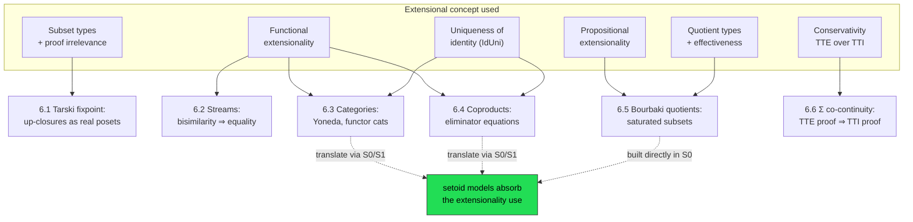

[[book-guidelines|↩ Back to guidelines]]

## Why the thesis needs a chapter like this at all

Chapters 3–5 did the hard theoretical work: they showed that functional extensionality, uniqueness of identity, proof irrelevance, subset types, propositional extensionality, and quotient types can all be *justified* — either as derivable properties of a syntactic model ([[The-Deliverables-Model|the deliverables model]], [[The-Setoid-Model|the setoid model]] $S_0$, [[The-Groupoid-And-Dependent-Setoid-Models|the groupoid and dependent setoid models]]) or, for `Ext`/`IdUni` used axiomatically, as conservative over pure intensional type theory ([[Intensional-And-Extensional-Type-Theory|Thm. 3.2.5]]). But a theorem that a concept is *sound to add* doesn't yet tell you it's *worth adding*. Chapter 6 is Hofmann's answer to the obvious objection: "fine, these six concepts are safe — but do you ever actually need them?"

The chapter is a tour of six small case studies, each chosen to isolate one extensional concept and show concretely what breaks without it, then — for several of them — show what happens when you push the construction through the setoid-model translation back into pure intensional type theory. That second half is the payoff of the whole thesis: you get to *use* `Ext`, `IdUni`, subset types, and quotients as if they were primitive, informal, set-theoretic tools, and the syntactic models silently absorb the bill, expanding your one-line uses of extensionality into long but entirely intensional, N-canonical derivations. This article works through all six studies and, per the topic list, treats the last one — conservativity as a practical proof technique — as the chapter's own explicit moral, not just one more example among equals.

## 6.1 Tarski's fixpoint theorem — subset types as "the poset restricted to X"

**The theorem.** For a complete lattice $(T, \leq)$ (every $P \subseteq T$ has a least upper bound $\bigvee P$) and a monotone $f : T \to T$, the set of fixpoints of $f$ is again a complete lattice. This is the Knaster–Tarski theorem, and it is the theorem that makes lattice-based program analysis possible at all: every abstract-interpretation framework that computes a program invariant as "the least fixpoint of the transfer function on the lattice of abstract states" is invoking exactly this result. If you are building a CSP/abstract-interpretation kernel with widening and domain propagation, this is the load-bearing mathematical fact underneath it — Hofmann's formalization is worth reading with that in mind, not just as a type-theory exercise.

**What breaks without subset types.** The mathematical proof (recapped in the source) repeatedly needs to restrict attention to a sub-poset: first the up-closure $\mathord\uparrow x := \{y \mid x \leq y\}$ of a point, then the sub-poset of fixpoints itself, then (recursively) up-closures *within* that sub-poset. Each of these needs to be *a poset again* — you need to reuse the definitions of `lub`, `glb`, `CL` ("complete lattice") on the restricted set without re-deriving anything. If you define a poset naively as a type with a `Prop`-valued relation, $\mathord\uparrow x$ has no honest way to *be* a type — you'd have to smuggle the restriction in by hand everywhere a lemma is applied, which is exactly the "relativize every argument, every time" bookkeeping tax that makes formalized set theory painful.

Hofmann's fix: formalize in the internal language of $\mathcal{D}$, [[The-Deliverables-Model|the deliverables model]] (Chapter 4), where subset types and proof irrelevance are *already* derivable rules, not axioms. A poset then really is a type $T:U$ with $\leq : T \to T \to \mathrm{Prop}$, and $\mathord\uparrow x := \{y:T \mid x \leq y\}$ is a genuine subset type with witness projection $\mathrm{wit}$, injective by $\mathrm{Pr\text{-}Ir}$ (proof irrelevance) exactly as established in §4.6. Predicates like

$$\mathrm{lub}[P, x] := \mathrm{upper}[P,x] \wedge \mathrm{lower}[\lambda y.\,\mathrm{upper}[P,y],\, x]$$
$$\mathrm{CL} := \mathrm{PO} \wedge \forall P{:}T\to\mathrm{Prop}.\,\exists x{:}T.\,\mathrm{lub}[P,x]$$

are stated once for a generic $(T,{\leq})$ and then *instantiated* at $\mathord\uparrow x$ or at the fixpoint subposet $\mathrm{Fix} := \{x{:}T \mid x =_L f\,x\}$ — because they're ordinary parametrized definitions, substitution just works. The proof of `upsCL : ∀x:T. CL[↑x, ≤]` (the up-closure of a point in a complete lattice is itself a complete lattice) then follows the informal set-theoretic argument almost line for line, using existential quantification over membership proofs to "lift" a predicate on the subset back up to a predicate on $T$.

**What it costs.** Every time you cross the boundary between $T$ and $\mathord\uparrow x$ or $\mathrm{Fix}$, you need an explicit coercion via `wit`, and Hofmann is candid that this is "extremely cumbersome" in practice (he cites B. Reus's synthetic-domain-theory development in Lego as independent testimony). This is the general tax of subset types you'd pay in a Rust verifier too:

```rust
// A "poset restricted to elements ≥ x" as a genuine, separate type —
// mirroring Hofmann's ↑x subset type. `wit` is the forgetful coercion,
// injective because two proofs of the same `ge` fact are interchangeable
// (proof irrelevance) — see The-Deliverables-Model for why that's derivable
// rather than assumed here.
struct UpClosure<T: Poset> {
    wit: T::Elem,
    proof_ge_x: T::LeqProof, // x ≤ wit — a proof-carrying field, erased at runtime
}
```
Every lemma proved generically over `Poset` has to be explicitly re-instantiated (or blanket-impl'd) for `UpClosure<T>` — Rust's trait system gives you this almost for free via a blanket `impl<T: Poset> Poset for UpClosure<T>`, but you still pay the conceptual cost Hofmann describes: the *statement* of `Poset` has to be phrased so that restriction is itself an instance, not a special case.

### 6.1.1 Discussion — subset types vs. refinement types, revisited

Hofmann's closing remark echoes the refinement-vs-deliverables tension from [[The-Deliverables-Model|Chapter 4]]: the subset-type proof, despite its coercion overhead, is judged *more faithful* to the informal mathematics than Pollack's earlier direct Calculus-of-Constructions proof — because it lets you write "$x : {\uparrow}\,y$" and mean exactly what a mathematician means by it, instead of threading a separate correctness obligation through every application.

## 6.2 Streams, bisimulation, and coinduction — functional extensionality earning its keep

**The setup.** Work in a type theory with functional extensionality (the internal language of $S_0$ or $S_1$ — see [[The-Setoid-Model|The Setoid Model]] and [[The-Groupoid-And-Dependent-Setoid-Models|the dependent setoid model $S_1$]]). Streams are encoded, cheaply, as functions from the naturals:

$$\mathrm{Str}(\sigma) := \mathbb{N} \to \sigma, \qquad \mathrm{Hd}(S) := S\,0, \qquad \mathrm{Tl}(S) := \lambda n.\,S(\mathrm{Suc}(n))$$

A **bisimulation** is a relation $R$ on streams that is a fixpoint condition of exactly the shape you'd recognize from process-algebra equivalence checking: $R[s,s'] \Rightarrow \mathrm{Hd}(s) =_L \mathrm{Hd}(s')$ and $R[s,s'] \Rightarrow R[\mathrm{Tl}(s), \mathrm{Tl}(s')]$ ("head-equal, and tail-related"). The **coinduction principle** says: if $R$ is a bisimulation and $R[s,s']$, then $s =_L s'$ — bisimilar streams are *equal*, not just "behaviorally indistinguishable."

**What breaks without functional extensionality.** Streams-as-functions is only a *useful* encoding if propositional equality on $\mathrm{Str}(\sigma)$ coincides with pointwise equality. Coinduction's proof is genuinely simple — reduce stream equality to equality on $\sigma$ (by definitional unfolding of `Hd`/`Tl`) plus one appeal to `Ext`, plus $\mathbb{N}$-induction — but that one appeal is doing all the work: without `Ext`, two streams could satisfy "same head, same tail, forever" and still fail to be propositionally equal, because $\mathrm{Str}(\sigma) = \mathbb{N} \to \sigma$ is a function type and propositional equality on function types is, by default, exactly as coarse as the identity type's own $J$-eliminator lets it be — which is to say, useless for anything but syntactically identical functions.

**Co-iteration and terminality.** Streams are *built* via a fixpoint-free combinator, co-iteration: given $\mathrm{out} : \rho \to \sigma$ and $\mathrm{step} : \rho \to \rho$,

$$\mathrm{CoIt}_{\rho,\sigma}(\mathrm{out}, \mathrm{step}, \mathrm{init}) := \lambda n.\,\mathrm{out}(\mathrm{step}^n(\mathrm{init})) : \mathrm{Str}(\sigma)$$

satisfying the defining equations **definitionally**: $\mathrm{Hd}(\mathrm{CoIt}(\ldots)) = \mathrm{out}(\mathrm{init})$ and $\mathrm{Tl}(\mathrm{CoIt}(\ldots)) = \mathrm{CoIt}(\mathrm{out}, \mathrm{step}, \mathrm{step}(\mathrm{init}))$. Using coinduction, one shows $\mathrm{Str}(\sigma)$ is *terminal*: any $f : \rho \to \mathrm{Str}(\sigma)$ satisfying those two equations only *propositionally* must itself be propositionally equal to the canonical `CoIt`. This "definitional for the canonical constructor, propositional for anything that merely behaves the same way" split is the exact coinductive mirror of how [[Intensional-Quotient-Types|quotient types]] make representative-independent reasoning propositional rather than definitional.

**The genuinely load-bearing part: candidate fixpoints and `Total`.** Streams have *no* general fixpoint combinator — Hofmann gives two explicit counterexamples: $\lambda s{:}\mathrm{Str}(\mathbb{N}).\,\mathrm{Const}(\mathrm{Suc}(\mathrm{Hd}(s)))$ has no fixpoint at all, and $\lambda s.\,\mathrm{Tl}(s)$ has no *unique* one. This matters because dataflow-network semantics (agents communicating over unbounded channels — a real model used in protocol verification) is classically defined as a *least* fixpoint in a domain of possibly-terminating streams, and that domain-theoretic apparatus doesn't transport directly into a total type theory. Hofmann's workaround is to define a **candidate fixpoint** `Fix(F, M)` by co-iterating a "best guess" construction (using an inhabitant $M{:}\sigma$ to seed a guess at the first output, then iterating), together with a **totality predicate** defined as a *greatest* fixpoint via higher-order impredicative encoding:

$$\mathrm{Total}(F) := \exists P.\; P(F) \wedge \Big(\forall F'.\, P(F') \Rightarrow \exists x.\, (\forall s.\,\mathrm{Hd}(F' s) =_L x) \wedge P(\lambda s.\,\mathrm{Tl}(F'(\mathrm{Pref}(x,s))))\Big)$$

and proves, by coinduction, that whenever `Total(F)` holds, `Fix(F, M)` really is a fixpoint of $F$, and the unique one. This is exactly the "greatest fixpoint for liveness/totality, least fixpoint for safety/reachability" duality you'll meet again in abstract interpretation: `Total` here plays the same structural role as a liveness invariant computed as a greatest fixpoint over a lattice of predicates, dual to the least-fixpoint reachable-states computation. Hofmann's Lego proof of `Total` for the alternating-bit protocol's central loop is a genuine formalized liveness argument.

Grounding this in a checker you'd actually build: coinductive reasoning about streams is structurally identical to coinductive reasoning about infinite transition-system traces used in CEGAR-style model checking (bisimulation-checking two abstract state machines is literally this bisimulation relation, specialized). In Lean, the relevant primitive is a `CoInductive`/`QPF`-style codata definition with a `corec` principle mirroring `CoIt` exactly, and bisimulation-implies-equality is proved via `Quotient`-adjacent or `Setoid`-based extensionality lemmas — the same functional-extensionality dependency Hofmann flags.

```python
# A quick illustrative sketch (not load-bearing) of Hofmann's Fix/Total idea:
# streams as generator functions, with a totality check playing the role
# of the greatest-fixpoint "liveness" predicate.
def bisimilar(s, sp, depth):
    """Approximate bisimulation check up to `depth` — the finite shadow
    of the coinduction principle Hofmann proves holds *exactly*, not
    just up to some bound, once functional extensionality is assumed."""
    for _ in range(depth):
        if s.head() != sp.head():
            return False
        s, sp = s.tail(), sp.tail()
    return True
```

## 6.3 Category theory internalized in type theory — object equality as the crux

**The natural definition.** A category is a type $\mathrm{Ob}$ of objects, a family $\mathrm{Mor}[x,y]$ of morphism-types, identities, composition, and the usual coherence laws (`idL`, `idR`, `Ass`) — but stated using **propositional equality on objects, `IdOb`**, not just on morphisms. This is the detail that matters: without object equality, you cannot even *state* the slice-category construction (which needs to compare two objects for equality to form a fiber), and you cannot build functor categories cleanly. Hofmann reports formalizing the Yoneda Lemma in Lego with this definition — a genuinely hard formalization because presheaf categories mix object-equality and morphism-equality inextricably.

The trick that makes `IdOb` usable despite morphisms being typed by domain/codomain: `Subst` transports a morphism along a proof of object equality. If $P : \mathrm{IdOb}(X,X')$ and $F : \mathrm{Mor}[X,Y]$, then

$$F' := \mathrm{Subst}_{\mathrm{Ob},\,[x{:}\mathrm{Ob}]\mathrm{Mor}[x,Y]}(P, F) : \mathrm{Mor}[X', Y]$$

and $J$ (the identity-type eliminator) lets you carry properties of $F$ (e.g. "is an isomorphism") along to $F'$. This is precisely the "reindexing along a proof of relatedness" operation that [[The-Groupoid-And-Dependent-Setoid-Models|the groupoid and dependent setoid models]] make into a first-class piece of model structure — Chapter 6 is showing you *why* you'd want that operation available, before Chapter 5 hands you the model that supplies it cheaply.

**Translated into $S_0$ (§6.3.1).** Objects become a type with a `Prop`-valued partial equivalence relation `x = y`; morphisms collapse to a *single* type `Mor` independent of domain/codomain, tagged with a relation `f =_{x,y} g` stating "f and g are equal as morphisms from x to y." The single-morphism-type trick makes domain/codomain substitution trivial (there's nothing to reindex — a morphism doesn't carry its endpoints in its type), but it costs you the ability to form $\mathrm{Full}[U, \mathrm{El}]$ (the category of "small" types, indexed by a universe $U$), because $S_0$ has no usable universe (recall from [[The-Setoid-Model|The Setoid Model]] §5.1.8: $S_0$ admits no genuine type dependency beyond what propositions give you).

**Translated into $S_1$ (§6.3.2).** Here morphisms genuinely depend on their objects, and — because $S_1$'s families come with a `reindex` operator (the whole point of [[The-Groupoid-And-Dependent-Setoid-Models|the dependent setoid model]]) — the encoding supports functor categories, arrow categories, slice categories, and $\mathrm{Full}[\Gamma,\Phi]$ in full generality. The price is combinatorial: `reindex` has to be threaded through every operation (`comp`, `id`, the coherence laws), and Hofmann is explicit that even with Lego's help, the encoding becomes "unmanageable" past the simplest examples.

**The pattern to notice.** This is the chapter's clearest illustration of the thesis's central bargain: writing category theory *once*, using propositional equality on objects the way a working mathematician would, buys you a definition that automatically specializes to two different faithful encodings — one cheap-but-limited ($S_0$), one general-but-heavy ($S_1$) — without you re-deriving anything by hand. It's the same "prove it once against the abstract model, get every concrete model's version for free" move that [[The-Method-Of-Syntactic-Models|the method of syntactic models]] promises as the thesis's whole methodology.

## 6.4 Encoding the coproduct type — where functional extensionality gets "compiled away"

**The construction.** Troelstra's classical trick encodes a sum type $\sigma + \tau$ using a two-element type $N_2 := \{0,1\}$ (itself built from $\mathbb{N}$ and $\mathrm{Id}$) and functions out of it:

$$\sigma + \tau := \prod_{n:N_2} \big(\mathrm{Id}_{N_2}(n,0) \to \sigma\big) \times \big(\mathrm{Id}_{N_2}(n,1) \to \tau\big)$$

An element is a tag $n$ together with (vacuous, "ex falso"-style) proof-obligation functions for whichever branch doesn't apply — built using a term $\bot_\rho : \mathrm{Id}_{N_2}(0,1) \to \rho$ that exploits inconsistency of $0 =_L 1$ for arbitrary target type $\rho$.

**Why this needs functional extensionality and uniqueness of identity.** Given $u : \mathrm{Id}(0,0) \to \sigma$ and $v : \mathrm{Id}(0,1) \to \tau$, you need to show the pair $(0,u,v)$ equals $\mathrm{inl}(u(\mathrm{Refl}(0)))$ — i.e. that any function *out of* the singleton-like type $\mathrm{Id}(0,0)$ is (propositionally) the constant function determined by its value at the canonical proof. That's `Ext` plus `IdUni` in one line: `Ext` gets you from "these two functions agree pointwise" (which follows because $\mathrm{Id}(0,0)$ has, up to `IdUni`, only one inhabitant) to "these two functions are propositionally equal." Without both, the computation rules for the coproduct's eliminator can only be shown to hold up to something weaker than what a real coproduct interface promises. Even *with* them, Hofmann notes the two eliminator equations hold only **propositionally**, not definitionally — `IdUni` gets applied to an open variable inside the derivation, and open variables don't reduce.

**What happens under translation.** In $S_1$ the construction transfers essentially unchanged, because $S_1$ was built precisely to validate `Ext` and `IdUni`. In $S_0$ it also goes through (replacing `Id` by Leibniz equality), with one extra wrinkle: because $S_0$'s underlying types can be built from an impredicative `Prop`, the "extensional unit type" that a `Prf`-family's `set`-component collapses to (recall [[The-Deliverables-Model|Chapter 4]]'s $1_E$ trick) *disappears* on the left of a function arrow — $(\mathrm{Id}(0,0) \to \sigma)_{\mathrm{set}} \cong \sigma_{\mathrm{set}}$, definitionally, once you unfold what the `set`-component of an identity-type family actually is. This is the concrete moment where you can watch functional extensionality get **eliminated**: the informal step "these functions agree everywhere on a singleton type, hence are equal" becomes, after translation, the *definitional* fact that a function out of a unit-like type just *is* its value — no appeal to extensionality survives into the translated term, because the model quietly arranged for the relevant space of functions to already be a singleton at the level of raw representations. This is the payoff Hofmann keeps promising: extensionality used informally becomes ordinary computation once you unfold the model.

```lean
-- Lean's own encoding of Sum via a tag + dependent match makes the
-- eliminator's computation rules *definitional* by fiat (Sum is a
-- primitive inductive, not derived) — Hofmann's point is that the
-- *derived* Troelstra-style encoding needs Ext/UIP to recover exactly
-- this behavior only propositionally. Compare:
inductive Sum (α β : Type) where
  | inl : α → Sum α β
  | inr : β → Sum α β
-- `Sum.rec` reduces definitionally on `inl`/`inr` for free — no Ext, no UIP.
-- Hofmann's §6.4 is precisely the "what if your kernel doesn't have Sum
-- as a primitive, only Π/Σ/Id/ℕ" case, i.e. what an elaborator has to do
-- to justify treating derived sums as if they had this same behavior.
```

## 6.5 Bourbaki-style quotient constructions — the classical algebra playbook, redone

Hofmann works through a sequence of the standard quotient-set lemmas from Bourbaki's *Théorie des Ensembles*, in $S_0$ (needed for the impredicative `Prop` several of these use), showing each has a faithful type-theoretic counterpart via [[Intensional-Quotient-Types|intensional quotient types]].

- **§6.5.1 Canonical factorization.** Any $f : \sigma \to \tau$ factors through the quotient $\sigma / R$ (where $R[x,x'] := f(x) =_L f(x')$) as a surjection followed by an injection — this factorization is *initial* among all such. Dually, factoring through the image $\mathrm{Im}(f) := \{y{:}\tau \mid \exists x.\,f(x) =_L y\}$ gives a *terminal* factorization. **Without the axiom of choice** — and type theory doesn't have it internally, by design — these two factorizations only agree up to a map $\sigma/R \to \mathrm{Im}(f)$ that need not be invertible; inverting it is exactly the statement of **unique choice** ($\mathrm{AC}^!$), which [[The-Setoid-Model|The Setoid Model]] already flagged as failing in $S_0$.
- **§6.5.2 The categorical view.** Restricting $S_0$ to closed types and functions-up-to-propositional-equality gives a **regular category** $S_0/{=_L}$: quotient types are exactly its coequalizers, subset types are exactly its equalizers/regular monos, and $\mathrm{Prop}$ classifies the regular monos. Unique choice, reformulated categorically, is *exactly* the statement "every regular epi that is also mono is an isomorphism" — equivalently, that the category with functional-relation morphisms (rather than function morphisms) forms a **topos**. This is a clean, concrete instance of the more general theme running through the whole thesis: keeping definitional and propositional equality apart (refusing to be Boolean/topos-like by fiat) is what buys you decidable typing.
- **§6.5.3 Subsets vs. quotients.** A subset $\rho := \{x{:}\sigma \mid P[x]\}$ with an induced equivalence relation $R_\rho$ has $\rho / R_\rho$ in bijection with the image, inside $\sigma/R$, of the class map — reconstructed using the *dependent* quotient eliminator `Q-I-Elim` from [[Intensional-Quotient-Types|Intensional Quotient Types]] §5.1.5.1/§3.2.6.1, in place of the "pick a right inverse to the class map" move that set theory uses for free.
- **§6.5.4 Saturated subsets.** $P$ is *saturated* w.r.t. $R$ if it's closed under $R$-relatedness; saturated subsets of $\sigma$ correspond bijectively to arbitrary subsets of $\sigma/R$. This bijection needs **both** propositional extensionality **and** the quotient's *effectiveness* (that $[x]_R =_L [x']_R$ implies $R[x,x']$, established for $S_0$'s quotients in [[Intensional-Quotient-Types|Intensional Quotient Types]] §5.1.6.4) — drop effectiveness and the construction stops going through even after weakening equality of predicates to bi-implication.
- **§6.5.5/6.5.6 Iterated and product quotients.** $(\sigma/R)/S \cong \sigma/T$ (iterated quotienting collapses to a single quotient by a composite relation $T$), and $(\sigma/R)\times(\tau/S) \cong (\sigma\times\tau)/(R\times S)$ — both reconstructed by lifting class maps, matching Bourbaki's presentation move for move. The product case gives a reusable *template* for defining any binary function on a quotient: define it on representatives, prove it respects both relations component-wise, and precompose with this bijection.
- **§6.5.7 Where the pattern finally fails: quotients vs. function spaces.** Is $\rho \to \sigma/S$ isomorphic to $(\rho \to \sigma)/({\to}S)$ (pointwise-lifted relation)? This one is **not** derivable from the quotient-type rules alone. Hofmann traces the failure precisely: this isomorphism holding for *all* quotients is equivalent to every class map being **powerful** (a surjection $s : \sigma' \to \sigma$ such that $\rho \to s$ is again surjective for every $\rho$), and internal splitting of all powerful surjections is equivalent to the **internal axiom of choice** ($\mathrm{IAC}$) — the same obstruction from §5.1.4.2 and §6.5.1, now showing up a third time in a completely different guise. This triple appearance (canonical factorization, topos-ness, function-space compatibility) is worth internalizing as one fact wearing three costumes, not three separate facts: *in $S_0$, "quotients commute with the operation you're doing" is uniformly a question about how much choice you're implicitly assuming.*

## 6.6 Conservativity as a practical proof technique

This is the chapter's real thesis-in-miniature, and the topic list is right to single it out. Mendler's theorem — in a locally cartesian closed category, a "$\Sigma$-functor" $f : \mathcal C/A \to \mathcal C/B$ preserves $\omega$-chain limits — has real payoff for coinductive-type encodings (streams-as-$\mathbb{N}\to\sigma$ is a special case) and for formulating bisimilarity *intensionally*, avoiding the impredicative "quantify over all bisimulations" definition altogether.

**The move.** Locally cartesian closed categories correspond to **extensional** type theory (TTE). So:

1. Prove Mendler's result set-theoretically (routine — §6.6.1, an explicit limit-as-compatible-families construction, with the *proof-relevant* $\Sigma$ crucially doing work a proof-irrelevant $\exists$ could not — Hofmann gives an explicit counterexample showing the $\exists$-indexed version fails).
2. Formalize it in TTE almost verbatim (§6.6.2 — TTE's equality reflection rule lets the informal proof go through basically unchanged, `CompFam` standing in for the limit).
3. **Invoke [[Intensional-And-Extensional-Type-Theory|Thm. 3.2.5 (conservativity)]] to get the TTI statement for free** — no re-proof required, just the theorem's guarantee that a TTI-inhabited type with a TTE witness has a TTI witness too.

**Why step 3 matters practically, not just formally.** Hofmann then tries the *direct* route in §6.6.3: proving the same statement inside TTI (with `Ext`/`IdUni`) by hand. The candidate witness already contains nested nested instances of `Subst`, so *every* subsequent verification has to reason about terms syntactically containing `Subst` applications — a genuinely different, much harder proof-engineering problem than the TTE version, even though the two statements are logically equivalent by conservativity. He reports spending "considerable time" trying to formalize this directly in Lego and not succeeding, concluding explicitly: *machine-supported reasoning in TTI needs tactic support built on the conservativity theorem*, i.e. a tactic that (a) strips a TTI goal to its TTE shadow, (b) lets the user prove the easy TTE version, (c) uses the (non-constructive, but this doesn't matter — you only need existence of *some* witness, and conservativity's proof, though it uses choice, is fine for that) conservativity theorem to transport the TTE proof back.

This is a genuinely reusable architectural pattern for any proof-producing system with two logics of different strength connected by a soundness/conservativity result:

- **Prove in the strong, decision-procedure-unfriendly logic** (TTE here — the analogue in an SMT-backed verifier is "prove the verification condition using full extensionality/set comprehension, ignore decidability").
- **Transport the *existence* of a proof, not the proof term itself**, back into the trusted, decidable kernel via a conservativity/soundness theorem, rather than hand-translating the syntactic derivation.
- Reserve direct proof-term construction in the weak logic for cases where the transport theorem doesn't apply or a concrete extracted term is actually needed (e.g. for program extraction, per [[The-Deliverables-Model|Chapter 4 §4.6.2.1]]).

If you are building a bidirectional elaborator whose trusted kernel does intensional definitional-equality checking (`isDefEq`) but whose elaboration layer needs to reason about propositional facts (unification up to extensionality, or discharging obligations that are "true but not by `rfl`"), this is precisely the shape of the trusted-kernel/oracle split you want: elaborate/search in a convenient, possibly extensional or classical theory, and use a conservativity-style metatheorem — rather than re-deriving each obligation term by term in the kernel's own intensional vocabulary — to justify accepting the result. Proof reconstruction in this style trades "replay every inference step in the trusted kernel" for "trust the *class* of transports the conservativity theorem covers," which is a strictly cheaper trusted-computing-base commitment as long as the conservativity theorem itself is airtight (recall from [[Intensional-And-Extensional-Type-Theory|Definitional Versus Propositional Equality / TTI vs TTE]] that its own proof, via the quotiented term model $\mathcal Q$, is non-constructive but is a *theorem*, not a trusted axiom you're taking on faith at runtime).

## How the six studies relate to each other



The pattern across §6.1–6.5: pick one extensional concept, show a real construction that needs it stated informally, then (where Hofmann carries it out) show the setoid-model translation absorbing the extensionality use into ordinary — if baroque — intensional computation. §6.6 is different in kind: instead of building a *model-level* translation of one proof, it invokes the *theorem* that such a translation always exists (Thm. 3.2.5) and treats that as a proof-search shortcut in its own right.

## Where this leads

Chapter 6 is the last technical chapter — Chapter 7 is a two-page conclusion. Everything here draws on the machinery built earlier: [[The-Deliverables-Model|Chapter 4's deliverables model]] for §6.1's subset types, [[The-Setoid-Model|the setoid model $S_0$]] and [[The-Groupoid-And-Dependent-Setoid-Models|the dependent setoid model $S_1$]] for §6.2–6.4's functional extensionality and UIP, [[Intensional-Quotient-Types|intensional quotient types]] for §6.5, and [[Intensional-And-Extensional-Type-Theory|the TTE/TTI conservativity theorem]] for §6.6. Nothing new is proved about the models themselves; the chapter's job is purely to demonstrate *usefulness*, and its clearest lesson for building a real proof-producing toolchain is §6.6's: don't hand-derive every consequence of a strong logic inside a weak trusted kernel when a conservativity theorem lets you transport existence instead — that's the difference between a kernel that verifies proof terms one substitution at a time and one that trusts a small number of airtight metatheorems and gets to skip the bookkeeping. If your compiler's elaborator ever needs to justify accepting a term whose obligations were discharged in a more permissive intermediate theory (extensional reasoning, classical reasoning, or a decision procedure's own internal logic), §6.6 is the methodological template: prove conservativity once, invoke it everywhere, and keep your trusted kernel intensional and decidable.
