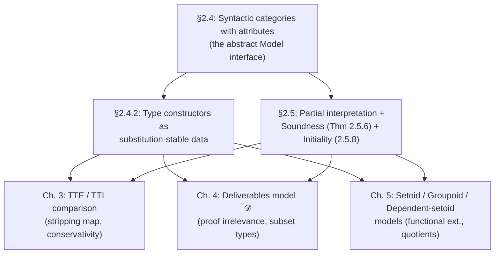

[[book-guidelines|↩ Back to guidelines]]

## What breaks without a model, and why "just interpret the syntax" isn't enough

Chapter 2's first half fixed a concrete syntax: judgement forms, formation/introduction/elimination rules for $\Pi$, $\mathbb{N}$, $\mathrm{Id}$, and a rewrite system defining definitional equality. That's the trusted kernel's *specification*. But the rest of the thesis needs to say things like "[[The-Method-Of-Syntactic-Models#The setoid interpretation|the setoid interpretation]] validates functional extensionality" or "the term model is initial" — sentences about *models* of the syntax, not the syntax itself. You need a precise, reusable notion of "what counts as an interpretation of this type theory" before you can even state such claims, let alone prove them.

The naive approach — just write down, once, a semantic clause for each syntax rule, targeting some fixed category like $\mathbf{Set}$ — has two problems that matter a lot if you're building a verified kernel or elaborator:

1. **You'd have to redo the soundness proof for every target.** If "model" isn't a reusable abstract structure, then showing the set-theoretic model is sound, the $\omega$-set (realizability) model is sound, and [[The-Setoid-Model|the setoid model]] (Chapter 5) is sound are three unrelated proofs, each re-deriving the same substitution lemmas from scratch. This is exactly the "prove it against the abstract interface once" move a verified compiler wants: define an abstract `Model` trait, implement soundness against the trait, then get soundness of every concrete instance for free by implementing the trait.
2. **Universal-property definitions don't fit the term model.** The obvious categorical move — define $\Pi$-types by a universal property (the usual "cartesian closed category" style used for simply typed $\lambda$-calculus) — silently assumes an $\eta$-rule. Without $\eta$, the term model (syntax quotiented by definitional equality) does *not* satisfy that universal property, so a universal-property-based notion of model would exclude the very structure you're trying to justify semantics *against*. §2.4 is explicit about this (Remark 2.4.15): you could add an $\eta$-rule and get the universal property, but then the term model of a syntax *without* $\eta$ would fail to be a model at all. So every semantic type-former definition in this chapter is deliberately phrased as *data plus substitution-stability equations* — closer to an operational specification than a universal property — precisely so the term model is guaranteed to be an instance.

This is the chapter's central design decision, and it's the one most worth carrying into a Rust type-checker kernel: **model correctness conditions should be checkable structural equations, not existence-of-a-mediating-morphism universal properties**, because your own syntax is going to be the first model you need to validate, and syntax rarely satisfies universal properties unless you've deliberately engineered $\eta$-rules for everything.

## Syntactic categories with attributes: contexts, families, sections

### The three sorts, and why sections need to be a primitive

The abstract notion of model used throughout the thesis is **syntactic categories with attributes** (Def. 2.4.1), Hofmann's variant of Cartmell's *categories with attributes* / Pitts's *type categories*, adapted from Curien's categorical combinators. It has three sorts of data:

- A category $\mathcal{C}$ of **contexts** ($\Gamma, \Delta, \dots$) and **context morphisms** ($f, g, h, \dots$), with terminal object $\top$.
- A functor $\mathrm{Fam} : \mathcal{C}^{op} \to \mathbf{Set}$ assigning to each context $\Gamma$ a set $\mathrm{Fam}(\Gamma)$ of **families** (interpretations of types in context $\Gamma$: $\sigma, \tau, \rho, \dots$), with substitution written $\sigma\{f\}$ for $f : \Delta \to \Gamma$.
- For each family $\sigma \in \mathrm{Fam}(\Gamma)$, a set $\mathrm{Sect}(\sigma)$ of **sections** (interpretations of terms: $M, N, \dots$).

The reason sections are a *separate, primitive sort* — rather than being *defined* as morphisms into the comprehension satisfying a projection equation — is entirely about avoiding **conditional equations**. If you defined a section as "a morphism $f : \Gamma \to \Gamma.\sigma$ such that $p(\sigma) \circ f = \mathrm{id}$," then any equation you want to state about sections becomes conditional on that side-condition already holding, which is exactly the kind of thing that's painful to verify by term rewriting inside a proof assistant (the thesis notes this was mechanically checked in Lego, §4.4). By making $\mathrm{Sect}(\sigma)$ its own set with its own operations, you can quantify over sections freely — Proposition 2.4.7 then *proves*, as a theorem rather than baking it into the definition, that $\mathrm{Sect}(\sigma)$ is in bijection with $\{f : \Gamma \to \Gamma.\sigma \mid p(\sigma) \circ f = \mathrm{id}_\Gamma\}$. This is a recurring pattern worth internalizing: **push a side condition out of the definition and re-derive it as a lemma**, so the definition itself stays equation-only.

**What breaks without this.** If you skip the separate `Sect` sort and try to define your Rust kernel's `Term` type as "a `Morphism` satisfying a runtime-checked predicate," every operation on terms now needs to re-verify or re-thread that predicate, which is precisely the "conditional equation" problem in code form — you end up with `Result<Term, InvariantViolation>` scattered everywhere instead of a type that's correct by construction.

### The comprehension, the display map, and weakening

For $\sigma \in \mathrm{Fam}(\Gamma)$, the model gives:

- A context $\Gamma.\sigma$, the **comprehension** — semantically, "$\Gamma$ extended by a variable of type $\sigma$."
- A context morphism $p(\sigma) : \Gamma.\sigma \to \Gamma$, the **display map** / projection — "forget the last variable." Substitution along $p(\sigma)$ *is* weakening.
- For $f : \Delta \to \Gamma$, a **weakening of $f$**, $q(f,\sigma) : \Delta.\sigma\{f\} \to \Gamma.\sigma$, making the square

$$
\begin{array}{ccc}
\Delta.\sigma\{f\} & \xrightarrow{\ q(f,\sigma)\ } & \Gamma.\sigma \\
\downarrow{\scriptstyle p(\sigma\{f\})} & & \downarrow{\scriptstyle p(\sigma)} \\
\Delta & \xrightarrow{\ f\ } & \Gamma
\end{array}
$$

commute, functorially in $f$ ($q(\mathrm{id}_\Gamma,\sigma) = \mathrm{id}$, $q(f\circ g,\sigma) = q(f,\sigma)\circ q(g,\sigma\{f\})$).

- An operator $\mathrm{Hd}$ recovering a section from a morphism into a comprehension: if $f : \Delta \to \Gamma.\sigma$ then $\mathrm{Hd}(f) \in \mathrm{Sect}(\sigma\{p(\sigma)\circ f\})$, satisfying $q(p(\sigma)\circ f,\sigma) \circ \mathrm{Hd}(f) = f$ (a **surjective-pairing law**, `Mor-Inv`): every morphism into a comprehension decomposes uniquely into "where it lands in the base" ($p(\sigma)\circ f$) plus "what it does on the last coordinate" ($\mathrm{Hd}(f)$).

**Reading the term model as the running example (Ex. 2.4.2) fixes the intuition immediately.** Contexts are well-formed contexts of the syntax modulo definitional equality; $\mathrm{Fam}(\Gamma)$ is the set of judgements $\Gamma \vdash \sigma$; $\Gamma.\sigma := \Gamma, x{:}\sigma$; $p(\sigma)$ is literally the tuple of variables of $\Gamma$; substitution $\sigma\{f\}$ is syntactic substitution; and $\mathrm{Sect}(\Gamma \vdash \sigma)$ is the set of judgements $\Gamma \vdash M : \sigma$. So $\mathrm{Hd}(f)$ for $f = (M_1,\dots,M_n) : \Delta \to \Gamma.\sigma$ is just $M_n$ — "the last component of the tuple." Every abstract clause in Def. 2.4.1 is designed so that, when instantiated at the term model, it becomes a syntactic triviality. That's the whole point: the abstract structure is engineered to be *provably no more and no less than what the syntax already does*, so proving something at the level of the abstract model is guaranteed to specialize to a real statement about the syntax.

**Rust grounding.** This structure is close to how a typed-AST library represents contexts, de Bruijn-indexed terms, and weakening as a single coherent API:

```rust
// Fam(Γ): the type of well-formed types in context Γ.
// Sect(σ): the type of well-formed terms of type σ.
trait SyntacticCategoryWithAttributes {
    type Ctx;
    type Morphism;      // context morphisms Δ → Γ
    type Family;        // σ ∈ Fam(Γ)
    type Section;        // M ∈ Sect(σ)

    fn subst_family(&self, sigma: &Self::Family, f: &Self::Morphism) -> Self::Family; // σ{f}
    fn comprehend(&self, gamma: &Self::Ctx, sigma: &Self::Family) -> Self::Ctx;        // Γ.σ
    fn display(&self, sigma: &Self::Family) -> Self::Morphism;                        // p(σ)
    fn weaken(&self, f: &Self::Morphism, sigma: &Self::Family) -> Self::Morphism;      // q(f,σ)
    fn hd(&self, f: &Self::Morphism) -> Self::Section;                                // Hd(f)
}
```
The point of writing the trait this way — rather than baking weakening into de Bruijn-index arithmetic directly — is that *any* semantics you build later (a setoid model, a groupoid model, an abstract-interpretation domain) just implements this same trait, and the soundness proof (Theorem 2.5.6, below) is stated and proved exactly once, against the trait, not once per implementation.

**Lean grounding.** This is close to what `Lean.Expr` plus `Lean.LocalContext` plus the elaborator's own bookkeeping are doing operationally: `Γ.σ` is a `LocalContext` extended by one more `LocalDecl`; `p(σ)` corresponds to "drop the newest local"; `q(f,σ)` is exactly the *lifting* the kernel performs when it pushes a substitution under a binder (`instantiate` composed with the de Bruijn shift). Lean's kernel does not literally reify categories-with-attributes, but its substitution/lifting invariants are the operational content of the `Mor-Inv` and functoriality-of-$q$ equations here.

## The other examples: what "model" buys you beyond the term model

The chapter gives several non-syntactic instances precisely to demonstrate the abstraction isn't vacuous:

- **Families over a small category $F$** (Ex. 2.4.3): $\mathrm{Fam}(\Gamma)$ is the set of functions $\Gamma \to \mathrm{Ob}(F)$; sections are elements of $\prod_{\gamma} F(1,\phi(\gamma))$. This deliberately keeps an *intensional* structure — morphisms of $F$ that aren't global sections — not reflected into the base category, foreshadowing why intensional and "up to iso" phenomena need separate treatment later.
- **The set-theoretic model** (Ex. 2.4.4), the special case where $F$ is small sets below some inaccessible cardinal — the standard tool for proving *consistency* results, e.g. that $\vdash \mathrm{Id}_\mathbb{N}(0,\mathrm{Suc}(0))$ has no proof, because you can just check it's not inhabited in $\mathbf{Set}$.
- **$\omega$-sets** (Ex. 2.4.5), a realizability model: a set $|X|$ paired with a surjective "tracking" relation to natural numbers (Gödel-coded partial-recursive-function indices), morphisms required to be *computably* tracked. This is the semantic backbone the thesis later leans on for models where "provable equality" and "computable equality" need to be teased apart.

The upshot: the abstract interface has enough structure to build the term model, prove things by pure syntax, *and* interpret into wildly different target categories (small sets, realizability) for consistency and independence results — exactly the "prove once against the interface, instantiate many times" payoff.

## Type constructors as substitution-stable data

Having fixed what a model *is*, §2.4.2 gives semantic counterparts to each syntactic type former. The recurring shape: **data, plus equations forcing that data to be stable under substitution** — not a universal-property characterization (per the opening discussion).

### Dependent products, and the $\eta$-rule trade-off made explicit

$\mathcal{C}$ has dependent products (Def. 2.4.14) if for $\sigma \in \mathrm{Fam}(\Gamma)$, $\tau \in \mathrm{Fam}(\Gamma.\sigma)$ there's a distinguished family $\Pi(\sigma,\tau) \in \mathrm{Fam}(\Gamma)$, an abstraction operator $\lambda_{\sigma,\tau}$, and an application operator $\mathrm{App}_{\sigma,\tau}$, all required to commute with substitution, plus the computation law $\mathrm{App}_{\sigma,\tau}(\lambda_{\sigma,\tau}(M),N) = M\{N\}$. Note there is *no* $\eta$-law required. Remark 2.4.15 spells out exactly why: adding the $\eta$-equation $\lambda_{\sigma,\tau}(\mathrm{App}_{\sigma,\tau}(M^+,v_\sigma)) = M$ as part of the *definition* would let $\Pi(\sigma,\tau)$ enjoy a genuine universal property — but then the term model would fail to be an instance unless the syntax itself has $\eta$. This is the concrete cash-out of the design principle from the opening section.

Proposition 2.4.17 gives an equivalent, often more convenient, characterization via a single **evaluation morphism** $\mathrm{ev}_{\sigma,\tau} : \Gamma.\sigma.\Pi(\sigma,\tau)\{p(\sigma)\} \to \Gamma.\sigma.\tau$ replacing the separate `App` operator by one context morphism — an instance of the chapter's other recurring move: replace a term-operator-plus-coherence-conditions by a single context morphism whenever possible, because a single morphism's stability under substitution is easier to state and check than a family of operators each with its own coherence law.

**Rust grounding.** This is exactly the difference between a checker that implements `apply(lambda(body), arg) == subst(body, arg)` (the $\beta$-law, always required) versus one that *also* implements `lambda(x => apply(f, x)) == f` (the $\eta$-law, structurally optional) as a definitional-equality check. Most real dependently-typed kernels (Lean, Coq) do include $\eta$ for functions at the definitional-equality level — which is exactly choosing to work with a syntax where the universal-property-style $\Pi$-type is legitimate, at the cost of a more expensive equality check (you can no longer just compare normal forms syntactically; you need $\eta$-expansion or a smarter algorithm).

### Unit, naturals, $\Sigma$-types: same pattern, and when the universal property *does* apply

- **Unit type** (Def. 2.4.18 / Prop. 2.4.19): distinguished $1_\Gamma$, point $\star$, and eliminator $R_1$; Prop. 2.4.19 shows that whenever there's a family $1 \in \mathrm{Fam}(\top)$ with $p(1)$ an *isomorphism*, the whole unit-type structure is derivable for free by substitution along that isomorphism's inverse — a genuinely useful shortcut for building new models.
- **Natural numbers** (Def. 2.4.20): the recursor $R_\mathbb{N}(M_z,M_s)$ with the two computation laws. Def. 2.4.22/Prop. 2.4.23 connects this to the classical categorical notion of a **parametrised natural numbers object** (an $\mathbb{N}$-algebra with a strict, not just up-to-iso, uniqueness property) — here the universal-property version *does* line up with the substitution-stable version, because the recursion equations are already strict in the syntax.
- **Identity types** (Def. 2.4.24 / Prop. 2.4.25): the identity type $\mathrm{Id}(\sigma) \in \mathrm{Fam}(\Gamma.\sigma.\sigma^+)$ with reflexivity morphism $\mathrm{Re}_\sigma$ and eliminator $J$. Prop. 2.4.25 gives the pullback-square shortcut: if $\Gamma.\sigma.\sigma^+.\mathrm{Id}(\sigma)$ is (via $\mathrm{Re}_\sigma$) a pullback of the diagonal $v_\sigma$ against itself, the whole structure — including $J$ — is derivable. This is the categorical shadow of "the identity type is the smallest reflexive relation," and it is worth remembering when the groupoid model (see the next topic) deliberately makes $\mathrm{Re}_\sigma$ an *isomorphism* — that turns out to be exactly the condition making propositional and definitional equality on identity types coincide.
- **$\Sigma$-types** (Def. 2.4.26 / Prop. 2.4.27): pairing $\mathrm{pair}_{\sigma,\tau}$ and eliminator $R_{\Sigma}$; when $\mathrm{pair}_{\sigma,\tau}$ happens to be an *isomorphism*, the $\Sigma$-type is called **extensional**, meaning every pair-typed section decomposes (up to definitional, not just propositional, equality) into its two projections. This "extensional $\Sigma$" terminology recurs constantly in Chapter 5 — the setoid model gets extensional $\Sigma$-types essentially for free, which is one of the concrete things that model buys you.

### Generic families, loose models, and universes

This is the trickiest and most load-bearing part of §2.4.2 for anyone building an elaborator with universes and impredicative quantification.

A **full submodel** (Def. 2.4.28) is a subfunctor $\mathrm{Fam}_0 \subseteq \mathrm{Fam}$ — a substitution-closed subset of families at each context, capturing "the families that are small enough to be classified by a universe." Closure under a type former (Def. 2.4.29) means the type former, applied to arguments in $\mathrm{Fam}_0$, again lands in $\mathrm{Fam}_0$. **Impredicative** closure (Def. 2.4.30) is the sharper condition used for $\mathrm{Prop}$: closed under $\Pi(\sigma,\tau)$ even when $\sigma$ ranges over *all* of $\mathrm{Fam}$, not just $\mathrm{Fam}_0$ — this is precisely what lets you quantify over arbitrary types and still land back inside $\mathrm{Prop}$, the mechanism the Calculus of Constructions's impredicative $\forall$ depends on.

A **generic family** $(U,\mathrm{El})$ for $\mathrm{Fam}_0$ (Def. 2.4.31) is a code type $U \in \mathrm{Fam}(\top)$ and a decoding family $\mathrm{El} \in \mathrm{Fam}_0(\top.U)$ such that *every* family in $\mathrm{Fam}_0(\Gamma)$ arises, uniquely, as $\mathrm{El}\{s\}$ for some $s : \Gamma \to \top.U$. This is the semantic definition of "a universe classifying exactly the small types" — and Prop. 2.4.35 verifies the term model's own $\mathrm{Prop}/\mathrm{Prf}$ pair satisfies it, by an induction on equality derivations that is worth reading closely if you're implementing a `Prop`-like sort in a kernel: the injectivity of `Prf` (needed for uniqueness of the classifying morphism) is proved simultaneously with a second statement about $\forall$-types, because the induction doesn't close otherwise.

**The subtlety that actually matters in practice: loose models (§2.4.2.8).** The strict generic-family definition is *too strong* for natural models. Example: in the set-theoretic model, put $\mathrm{Prop} := \{\mathrm{tt},\mathrm{ff}\}$, $\mathrm{Prf}(\mathrm{tt}) = \{\star\}$, $\mathrm{Prf}(\mathrm{ff}) = \emptyset$. The induced full submodel is *not* closed under impredicative quantification: if $\phi(\gamma) = \{\star\}$ for every $\gamma \in \Gamma$, the actual product $\prod_\gamma \mathrm{Prf}(\phi(\gamma))$ is *a* singleton, but not literally *the* chosen singleton $\{\star\}$ — set-theoretic products don't come with a canonical choice of "the" one-element set, they just happen to be isomorphic to it. This is a strict-versus-up-to-isomorphism mismatch, exactly the kind of gap that shows up constantly when formalizing categorical semantics inside a proof assistant that insists on definitional (not merely propositional) equality.

The fix (Def. 2.4.36, Prop. 2.4.38): define a **loose model** where $\forall(s)$ and the evaluation/introduction operators are required directly, without demanding they come from a strict generic family — and then give a *canonical construction* (Prop. 2.4.38) turning any loose model into a strict one, by taking $\mathrm{Fam}_{\mathrm{new}}(\Gamma) := \mathrm{Fam}(\Gamma) \uplus \mathcal{C}(\Gamma,\mathrm{Prop})$ — i.e., freely adjoining the morphisms-into-$\mathrm{Prop}$ themselves as a second, formally-generic copy of the propositional families, alongside the "real" ones. This is a genuinely reusable trick: **when your semantic domain only satisfies your interface up to isomorphism, freely adjoin the classifying data as new formal elements rather than trying to force strictness on the original structure.** It is the same idea, one level up, as the standard "quotient by a setoid to get on-the-nose equality" move the setoid model (Chapter 5) uses pervasively.

**Why this matters for the standing project.** The refinement-type elaborator's own `Prop`/predicate universe — the classifier for verification-condition formulas fed to the SMT/CHC backend — is going to face exactly this strict-vs-loose mismatch the moment its semantic domain (say, an abstract lattice of formula denotations) doesn't come with a literal, on-the-nose "the" element for each formula. The loose-model-to-strict-model construction here is the categorical template for how to patch that without changing the underlying semantics.

## Partial interpretation and soundness of the syntax

### Why partial, and why not induct on derivations directly

§2.5 defines the semantic function $[\![-]\!]$ mapping *pre*-contexts/*pre*-types/*pre*-terms (raw syntax, not yet known to be well-typed) into a fixed model $\mathcal{C}$ (assumed equipped with $\Pi$, $\mathbb{N}$, $\mathrm{Id}$). Crucially it is defined by *structural recursion on the raw syntax*, not by induction on typing derivations, and is explicitly **partial**: undefined whenever a subexpression is undefined, or a "typechecking" side condition fails (e.g. $[\![\Gamma \vdash x{:}\sigma.\tau]\!]$ is only defined when $[\![\Gamma \vdash \sigma]\!]$ and $[\![\Gamma,x{:}\sigma \vdash \tau]\!]$ both are).

This design — due to Streicher, the thesis notes — sidesteps a real trap: a naive "interpret by induction on the derivation" approach has to separately prove the result doesn't depend on *which* derivation of a judgement you picked (a term can have multiple typing derivations even when unicity-of-typing holds up to some subtlety with, e.g., $\Sigma$-type telescopes, per §2.2.2). By interpreting the *pre*-syntax directly and proving totality on well-typed terms as a *theorem* (Thm. 2.5.6) rather than a built-in guarantee, you never have to worry about derivation-choice at all — the interpretation function doesn't see derivations, only terms.

**This is the single most directly transferable idea here for a Rust/Lean elaborator implementation.** An elaborator's type-inference/checking pass is naturally a *partial* function on raw ASTs (it fails on ill-formed input); the soundness theorem you actually want — "if elaboration succeeds, the result is well-typed and its semantics matches the source" — is exactly the shape of Theorem 2.5.6 below, and structuring the implementation as (1) a partial interpretation over raw syntax, separate from (2) a totality-on-well-typed-input proof, avoids coupling your evaluator to the specific proof/elaboration trace that produced a term.

```rust
// [[ - ]] : partial function on raw (unchecked) syntax
fn interpret_term(ctx: &SemCtx, raw: &RawTerm) -> Option<Section> {
    match raw {
        RawTerm::App(f, a) => {
            let sem_f = interpret_term(ctx, f)?;   // undefined subexpr ⇒ undefined result
            let sem_a = interpret_term(ctx, a)?;
            // "does not typecheck" ⇒ None, mirroring the thesis's convention
            apply_if_well_typed(ctx, sem_f, sem_a)
        }
        // ... one case per raw syntax constructor, never per typing rule
    }
}
// Soundness theorem, proved separately, once, by induction on *typing derivations*:
// ⊢ Γ ⟹ interpret_ctx(Γ).is_some()
// Γ ⊢ M : σ ⟹ interpret_term(Γ, M) is a well-defined section of interpret_type(Γ, σ)
```

### Telescopes as their own syntactic category with attributes

To state weakening/substitution lemmas cleanly, §2.5.2 introduces **semantic telescopes** (Def. 2.5.1): a list $(\sigma_1,\dots,\sigma_n)$ with $\sigma_i \in \mathrm{Fam}(\Gamma.\sigma_1.\cdots.\sigma_{i-1})$ — the model-side mirror of a syntactic context's list of type declarations. Proposition 2.5.2 shows telescopes-with-their-comprehension/substitution *themselves* satisfy Prop. 2.4.10's characterization, i.e. **telescopes over a model form another syntactic category with attributes.** This is a small but genuinely elegant self-application of the framework: the notion of model is expressive enough to model its own auxiliary bookkeeping structure (multi-variable contexts), which is exactly what lets the interpretation of a whole context $[\![\Gamma \vdash \Delta]\!]$ be defined uniformly as a telescope rather than as an ad hoc n-ary construction.

### The Weakening and Substitution Lemmas: proof by "syntactic weight," not structural size

Lemma 2.5.3 (Weakening) and Lemma 2.5.4 (Substitution) are the technical heart of §2.5 — they establish, e.g., that interpreting a weakened term equals weakening the interpreted term:
$$[\![\Gamma,x{:}\sigma,\Delta \vdash M]\!] = [\![\Gamma,\Delta \vdash M]\!]\{q(p([\![\Gamma\vdash\sigma]\!]), [\![\Gamma\vdash\Delta]\!])\}$$
The proof technique is worth noting on its own: simultaneous induction on the **weight** of an instance — the raw symbol count of the left-hand side, *not* structural recursion on any single syntactic category — because the mutual dependencies between the context, type, and term clauses don't decompose along any one syntax tree. (The variable case is flagged explicitly as the genuinely hard one — it requires a case split on whether the fresh variable falls inside the weakened prefix or the extended suffix, and both branches bottom out by re-deriving the *same* telescope identity via Lemma 2.4.13, "substituting a section into the corresponding variable returns that section," the semantic shadow of $x[x{:=}M] = M$.)

**Why this matters practically.** This is precisely the lemma an elaborator needs every time it pushes a substitution under a binder while resolving a metavariable — and the thesis's own aside (after Lemma 2.5.5) that a naive weight-based induction *fails* to close directly for general substitution (it needs weakening as a lemma first) is a genuine warning for anyone tempted to implement capture-avoiding substitution and its correctness proof in one pass: **substitution correctness is not self-contained; it factors through weakening correctness**, and trying to prove them simultaneously by naive structural induction is a known trap.

### Theorem 2.5.6 (Soundness) and Theorem 2.5.7 (the term model is initial)

Soundness (Thm. 2.5.6) is exactly the totality-and-preservation statement flagged above: every well-formed judgement of the syntax ($\vdash \Gamma$, $\Gamma \vdash \sigma$, $\Gamma \vdash M{:}\sigma$, context morphisms, and all four flavors of definitional equality) has a well-defined interpretation, and interpretations of definitionally-equal things coincide. Proved by induction on typing derivations, using the Weakening/Substitution Lemmas at every rule involving syntactic substitution (e.g. $\Pi$-elimination, where the substitution lemma is exactly what identifies $[\![\Gamma \vdash \mathrm{App}(M,N)]\!]$'s type with $[\![\Gamma \vdash \tau[N]]\!]$ rather than some merely-isomorphic family).

The chapter then closes with a short but conceptually important pair:

- **A "trivial" completeness theorem** (Thm. 2.5.7): if two raw expressions get the *same* interpretation in *every* model, they must already be syntactically related (definitionally equal, or one well-formed implies the other is). Proved by taking the term model itself as one of the "every" models — since the term model's own interpretation of a term is (essentially) the term itself modulo definitional equality, agreement in all models forces agreement in that one.
- **Initiality** (Remark 2.5.8): defining the evident notion of morphism between syntactic categories with attributes (structure-preserving maps on contexts/morphisms/families/sections), the term model is the **initial object** in the category of models supporting a given set of type formers.

This initiality statement is the precise sense in which "the term model is the syntax, and every other model is a semantics *of* that syntax" — every model receives a unique structure-preserving map from the term model, and that map *is* the interpretation function $[\![-]\!]$ itself. It's the categorical restatement of "soundness + completeness" as a single universal property, and it is the fact the rest of the thesis leans on implicitly every time it says a model "interprets" the syntax: interpretation isn't a separately-invented construction, it's *the* unique morphism initiality guarantees exists.

## Where this leads

This chapter is the load-bearing foundation for everything that follows in the thesis, and for the standing compiler/elaborator project specifically:



Every later model construction in the thesis — [[The-Deliverables-Model|the deliverables model]] $\mathcal{D}$ (Chapter 4), the setoid model $S_0$, the groupoid model, and the dependent setoid model $S_1$ (Chapter 5) — is presented as *an instance of exactly this interface*: a syntactic category with attributes, equipped with the type formers of §2.4.2, built by giving concrete choices of contexts/families/sections and checking the same substitution-stability equations proved here in the abstract. None of those chapters re-derive weakening, substitution, or soundness from scratch; they inherit Theorem 2.5.6 for free by virtue of fitting the interface.

For the elaborator/kernel project specifically, this chapter *is* the formal blueprint for "define your `Model`/`Judgment` trait once, prove your bidirectional type checker's soundness against the trait once, then get soundness of every concrete backend (a `Set`-like semantic domain, a symbolic/abstract-interpretation domain for verification conditions, a metavariable-and-constraint domain for the unifier) by construction rather than by re-proving weakening and substitution lemmas per backend." The loose-model-to-strict-model construction (Prop. 2.4.38) is the specific piece worth remembering when the elaborator's own `Prop`-like universe of verification-condition formulas turns out not to satisfy strict genericity on the nose.
