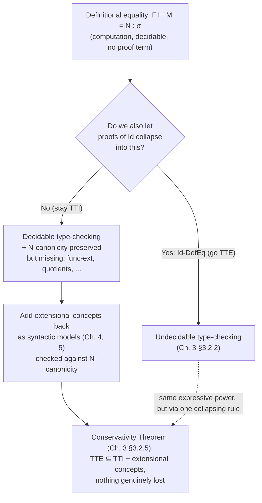

# Definitional Versus Propositional Equality

[[book-guidelines|↩ Back to guidelines]]

## Why bother distinguishing two notions of equality at all?

Suppose you're implementing a type checker for a dependently typed language. Somewhere deep in the elaborator you need to answer the question "is this type equal to that type?" — because a function expects an argument of type $\mathrm{Vec}(n)$ and you're handing it something the checker inferred as type $\mathrm{Vec}(2+2)$, and unless the checker can see that $2+2$ and $4$ denote the same thing, it will reject a program that is obviously correct.

There are two very different ways a checker could answer "are these equal":

1. **Just compute and compare.** Reduce both sides using the rules already built into the language (β-reduction, pattern matching on constructors, arithmetic on literals, etc.) and check if you land on syntactically identical terms. This is mechanical, requires no user input, and — crucially — is something the type checker can do *by itself*, with no proof term, no user annotation, nothing. Hofmann calls this **definitional equality**.
2. **Demand a certificate.** Require the programmer to supply an actual proof object — a term of some "equality type" — establishing that the two things are equal, and let the checker verify that proof the same way it verifies any other term. This is **propositional equality**: equality that has been turned into data, into something you can construct, pattern-match on, and pass around.

Hofmann opens the thesis with a deliberately provocative example (p. 2, §1.1): the constant-zero function on the naturals versus

$$f(n) = \begin{cases} 0 & \text{if there is no counterexample to Fermat's conjecture of size} < n \\ 1 & \text{otherwise} \end{cases}$$

These two functions are *extensionally* equal (in fact provably so, since Fermat's Last Theorem is a theorem — though at the time Hofmann wrote this, famously, it wasn't yet folklore-settled), but nothing about unfolding their definitions will ever make them collapse into the same normal form. If they're ever identified, it has to be via a proof, not via computation. Contrast this with $\mathtt{if\ true\ then}\ e\ \mathtt{else}\ e' = e$ — this holds *by definition* of `if`-`then`-`else`, no separate justification needed. That's the intuitive seam the whole chapter runs along: some equalities are "free" (built into how terms compute), and some equalities are "earned" (you have to construct evidence).

**What breaks if you don't separate them.** If you make *every* equality require a proof (no built-in computation rule at all), then trivial facts like $2+2=4$ stop being free — you'd need an explicit derivation every time you want the checker to see through arithmetic, which is absurd for a usable language. If instead you try to make *every* equality computational (build reduction rules powerful enough to decide everything you might ever want to identify, including facts equivalent to open mathematical conjectures), you run straight into undecidability — no terminating rewrite system can decide arbitrary mathematical truth. Keeping the two notions distinct, and pervasive-but-limited definitional equality decidable, is what keeps type-checking decidable at all. That's the tension the whole thesis is about reconciling.

## Definitional equality and conversion

Hofmann fixes notation immediately (§2.1.2.4, p. 18): definitional equality is expressed by three judgement forms,

$$\Gamma \vdash M = N : \sigma \qquad \Gamma \vdash \sigma = \tau \qquad \Gamma \vdash \Gamma_1 = \Gamma_2$$

for terms, types, and contexts respectively. These are defined as the **least congruence** closed under reflexivity (T-Refl), symmetry (T-Sym), transitivity (T-Trans), a congruence rule for *every* type and term former (e.g. C-Suc for successor, C-Π for the dependent product former, C-Abstr for λ-abstraction), and — this is the load-bearing part — closure under a fixed set of **computation rules**:

$$
\begin{aligned}
&\text{Π-Beta: } \Gamma \vdash \mathrm{App}_{x:\sigma.\tau}(\lambda x{:}\sigma.M,\,N) = M[x:=N] : \tau[x:=N] \\
&\text{Nat-Comp-Zero: } \Gamma \vdash R_{\mathbb N}(M_z, M_s, 0) = M_z : \ldots \\
&\text{Nat-Comp-Suc: } \Gamma \vdash R_{\mathbb N}(M_z, M_s, \mathrm{Suc}(N)) = M_s[x:=N][p:=R_{\mathbb N}(M_z,M_s,N)] : \ldots \\
&\text{Id-Comp: } \Gamma \vdash J_{\sigma,\Phi}(M, N, N, \mathrm{Refl}_\sigma(N)) = M[x:=N] : \ldots
\end{aligned}
$$

Two properties of this definition matter enormously and are easy to gloss over:

- **Pervasiveness.** If $M$ and $N$ are definitionally equal, then $P(M)$ is definitionally equal to $P(N)$ for *any* context $P$ you plug them into — that's exactly what "closed under all congruence rules" buys you. In particular (this is the sentence that does real work later, p. 4): the *proposition* stating $M \simeq N$ is definitionally equal to the proposition stating $M \simeq M$. Since the latter is always inhabited (by reflexivity), **definitional equality always entails propositional equality** — but never the reverse. That asymmetry is the entire reason the thesis has content.
- **No justification is ever attached.** Unlike a propositional-equality judgement $\Gamma \vdash P : \mathrm{Id}_\sigma(M,N)$, which carries a witness $P$, the equality judgement $\Gamma \vdash M = N : \sigma$ carries nothing — it's a bare, unannotated relation between two terms. There is deliberately no third notion ("judgemental equality" as a name distinct from definitional equality) — Hofmann collapses the terminology on purpose (footnote 3, p. 4) to avoid multiplying entities.

**Proposition 2.1.4 (Strong Normalisation, p. 24)** is what makes this whole apparatus usable in practice: orienting the computation rules left-to-right gives a strongly normalising, confluent rewrite system, which yields a decision procedure for definitional equality (Prop. 2.1.5, Decidability). This is the property extensional type theory will later sacrifice.

**Grounding — Lean's `isDefEq` and `whnf`.** This is the single most literal correspondence in the whole topic. When Lean's elaborator needs to check $\Gamma \vdash M = N : \sigma$, it does not search for a proof term — it runs `isDefEq`, which repeatedly calls `whnf` (weak-head-normal-form reduction) on both sides and compares the resulting heads structurally, recursing into subterms, unfolding `let`s, δ-reducing definitions, and applying ι-reduction (pattern-matching/recursor computation) exactly the way Nat-Comp-Suc does above. `rfl : a = a` in Lean is accepted by the kernel precisely when `isDefEq a a` succeeds by this reduction process — `rfl` is Lean's `Refl`, and the kernel's acceptance of a `rfl`-proof *is* an appeal to definitional equality, not to some separate logical argument. When you write `example : 2 + 2 = 4 := rfl`, you are relying on Nat's `Nat.add` computation rules being exactly the kind of oriented rewrite system Prop. 2.1.4 talks about.

```lean
-- Lean: this typechecks purely by computation — no propositional proof needed.
example : (2 : Nat) + 2 = 4 := rfl

-- Lean: this does NOT typecheck by rfl, because no reduction sequence
-- connects the two sides — it needs an actual inductive proof (Fermat's
-- Last Theorem, if you insist on Hofmann's example).
-- example : constFn 0 = fermatSearch := rfl   -- fails: not defeq
```

**Grounding — Rust's const evaluation as a weak analogue.** Rust has no identity types, but its `const fn` evaluator plays a small, non-dependent version of the same role: the compiler can normalize `2 + 2` to `4` at compile time (for `[T; 2+2]` vs `[T; 4]` to unify as the same array type) purely through evaluation — no proof obligation, no trait bound. That's definitional-equality-flavored. But Rust has no mechanism at all for the propositional side: there is no way to *construct evidence* that two arbitrary types are equal and have the compiler check it (short of the unsafe, coarse `std::mem::transmute` escape hatch, which is not type-directed reasoning at all). This is exactly the gap subset (2) below is designed to fill.

## The identity type and Leibniz equality

Definitional equality alone can't express "the checker doesn't yet know these are equal, but here is a proof that lets it know." For that, Hofmann introduces (or rather, recalls from Martin-Löf) propositional equality as an actual **type**, so that equality proofs become first-class data:

$$\Gamma \vdash P : \mathrm{Id}_\sigma(M,N)$$

with a single constructor,

$$\dfrac{\Gamma \vdash M : \sigma}{\Gamma \vdash \mathrm{Refl}_\sigma(M) : \mathrm{Id}_\sigma(M,M)} \quad \text{Id-Intro}$$

and an eliminator that is a dependently-typed Leibniz substitution principle (§2.1.2.3, p. 20):

$$
\begin{aligned}
&\Gamma, x{:}\sigma, y{:}\sigma, p{:}\mathrm{Id}_\sigma(x,y) \vdash \Phi \\
&\Gamma, x{:}\sigma \vdash M : \Phi[x:=x][y:=x][p:=\mathrm{Refl}_\sigma(x)] \\
&\Gamma \vdash N_1 : \sigma \qquad \Gamma \vdash N_2 : \sigma \qquad \Gamma \vdash P : \mathrm{Id}_\sigma(N_1,N_2) \\
\hline
&\Gamma \vdash J_{\sigma,\Phi}(M, N_1, N_2, P) : \Phi[x:=N_1][y:=N_2][p:=P]
\end{aligned}
\quad \text{Id-Elim-J}
$$

with computation rule $J_{\sigma,\Phi}(M, N, N, \mathrm{Refl}_\sigma(N)) = M[x:=N]$ (Id-Comp) — $J$ only knows how to reduce when it's fed a literal `Refl`. Read informally: $J$ says that to transport a family $\Phi$ depending on a pair of equal elements from the reflexivity case to the general case, it suffices to have handled the reflexivity case. This is exactly **Leibniz's principle**, restated model-theoretically at p. 3: a proof that $M$ equals $N$ is a proof that every definable property $P : \sigma \to \mathrm{Prop}$ holding of $M$ also holds of $N$ — which is what $J$ computes given a $\mathrm{Prop}$-valued family.

Two structural facts about $\mathrm{Id}$ matter for everything that follows in the thesis (and are the crux of why the thesis needs to exist at all):

- $\mathrm{Id}$ is *weakly* intensional (footnote 4, p. 4), not fully extensional: if you have a proof $P : \Pi x{:}\sigma.\mathrm{Id}_\tau(f\,x, g\,x)$ that two functions agree pointwise, there is in general **no way to build** an element of $\mathrm{Id}_{\sigma\to\tau}(f,g)$ from it inside pure intensional type theory. Functional extensionality — collapsing pointwise-propositional-equality into equality-of-functions — is simply not derivable from $J$ alone. (This is subtopic 3 in the thesis's Topic List — "functional extensionality" — and this is exactly where it becomes an open problem the rest of the thesis exists to solve.)
- Conversely, for *inductive* types, $\mathrm{Id}$-proofs really can be built by structural induction even when the two sides aren't definitionally equal — so it's not that $\mathrm{Id}$ never bridges the gap, it's that it bridges it unevenly, well at inductively-generated types, badly at function types.

**Grounding — Lean's `Eq` inductive and `Eq.mpr`.** Lean's `Eq` is literally this: `inductive Eq : α → α → Prop | refl (a : α) : Eq a a`, and `Eq.mpr`/`Eq.rec` are exactly $J$ — Lean's kernel-level `Eq.rec` reduction rule *is* Id-Comp, firing only when the equality proof is (after whnf) `Eq.refl`. The failure mode above is completely visible in Lean: `funext` is *not* a kernel-level reduction of `Eq.rec`, it's a separately-proved theorem (in Lean's case, provable because Lean's kernel has *quotient types* baked in as a primitive, which secretly buys function extensionality — a fact Hofmann's own thesis anticipates almost exactly, since "quotient types imply functional extensionality" is one of the thesis's own results, §3.2.7).

```lean
-- Eq.refl is Refl; Eq.rec (Lean's eliminator) is J.
-- Lean's kernel reduces `Eq.rec` only against `Eq.refl`, exactly Id-Comp.
theorem leibniz {α : Type} {a b : α} (h : a = b) (P : α → Prop) (hp : P a) : P b :=
  h ▸ hp   -- `▸` desugars to Eq.rec / Eq.mpr — this is literally J
```

```rust
// Rust: there is no built-in propositional-equality *type* you construct
// proofs of and let the compiler check by reduction. The closest thing,
// std::any::TypeId equality, is a runtime boolean, not a checked proof term —
// it cannot be pattern-matched to unlock type-level substitution the way
// `Eq.rec`/J can. This absence is precisely why refinement-type and
// verification tooling built on top of Rust needs an external checker.
```

## The equality reflection rule

Here's the natural next question a language designer asks: if I already have proof-carrying propositional equality $\mathrm{Id}$, why keep definitional equality as a separate, weaker notion at all? Why not just say: whenever you *have* a proof of $\mathrm{Id}_\sigma(M,N)$, the checker is entitled to treat $M$ and $N$ as fully interchangeable — i.e., definitionally equal — from then on? That's precisely the **equality reflection rule** of extensional type theory (§1.1, p. 5):

$$\dfrac{\Gamma \vdash P : \mathrm{Id}_\sigma(M,N)}{\Gamma \vdash M = N : \sigma} \quad \text{Id-DefEq}$$

It looks harmless — even elegant, since it eliminates the awkward asymmetry from the previous section. But Hofmann is explicit that it is exactly this rule that collapses the whole edifice: with Id-DefEq in force, **definitional equality becomes as hard as propositional equality**, and since checking whether *any* term is well-typed can require checking arbitrary definitional equalities of index terms (dependent types make this unavoidable — think $\mathrm{Vec}(n)$ where $n$ is an arbitrary computed expression), **type-checking itself becomes undecidable**, not merely equality-checking. Concretely (Thm., detailed in Ch. 3 §3.2.2, previewed here): $\mathrm{Refl}_\sigma(M) : \mathrm{Id}_\sigma(M,N)$ holds exactly when $M$ and $N$ are already definitionally equal — so *deciding whether a term type-checks* now requires deciding an equality that, via reflection, can encode arbitrary computation, up to and including the halting problem (Hofmann's actual undecidability proof in Ch. 3 encodes a self-halting Turing machine predicate this way).

This is the crux of the intensional/extensional split that structures the entire thesis: **extensional type theory (TTE)** adopts Id-DefEq and gets full expressive strength but loses decidability; **intensional type theory (TTI)** keeps the two equalities separate, keeps decidability, but is missing exactly the extensional concepts (functional extensionality, quotients, etc.) that TTE gets "for free" by identifying the two notions. Hofmann's stated aim (and the entire remaining ~250 pages of the thesis) is to recover TTE's expressive power inside TTI *without* Id-DefEq, by building categorical models where extensional concepts become long, decidable intensional derivations rather than a single undecidable rule.

**Grounding — this is a live design question in dependently-typed proof assistants today.** Lean, Coq/Rocq, and Agda are all, in this precise sense, intensional (no Id-DefEq in the kernel) — this is exactly why they need `rfl`-provable lemmas to be stated and *proved*, rather than automatically discharged, whenever the equality isn't syntactically/computationally obvious; and why they need `simp`, `decide`, or explicit tactics rather than the kernel silently reflecting propositional proofs into the conversion check. NuPRL, historically, took the opposite, extensional route. If you were building the Rust-based dependent/refinement checker described in the learning-goals framing for this vault, this section is the single most consequential design decision you'll face: an `isDefEq`-style decidable conversion check (intensional, decidable, TTI-flavored) versus letting SMT-discharged verification-condition proofs get silently folded back into the type checker's notion of equality (which would make your checker's core type-checking judgement as undecidable as the underlying VC-solving problem — exactly Hofmann's undecidability argument, transplanted).

## N-canonicity as a sanity check for adding new rules

Once you've decided to stay intensional and start adding extensional concepts back in as new rules or axioms, how do you know you haven't accidentally reintroduced the extensional theory's pathology through the back door? Hofmann's answer is a single, checkable meta-theoretic property:

> **Definition 2.1.9 (N-canonicity), p. 24.** A type theory with natural numbers is *N-canonical* if whenever $\emptyset \vdash M : \mathbb{N}$, then $\emptyset \vdash M = \underbrace{\mathrm{Suc}(\cdots\mathrm{Suc}}_{n\text{ times}}(0)\cdots)$ for some $n \in \omega$.

In words: **every closed natural-number term reduces, by definitional equality alone, to a literal numeral.** This is a direct corollary of strong normalisation (Prop. 2.1.4) and Remark 2.1.6 for the bare core calculus. Why single out this specific, seemingly narrow property as *the* test? Two reasons Hofmann gives explicitly:

1. It's a proxy for "definitional equality is still well-behaved and computational," without requiring you to re-run the full strong-normalisation argument for every extension. $\mathbb N$ is chosen arbitrarily (footnote 5, p. 6) — a non-canonical element anywhere induces one at $\mathbb N$ via $R_{\mathbb N}$, so checking it at one type suffices as a canary for the whole system.
2. It cleanly diagnoses the standard failure mode of "let's just axiomatize the extensional concept we want." If you add, say, functional extensionality as a bare constant

$$\mathrm{Ext}_{\sigma,\tau} : \Pi f, g{:}\sigma\to\tau.\ (\Pi x{:}\sigma.\mathrm{Id}_\tau(f\,x,g\,x)) \to \mathrm{Id}_{\sigma\to\tau}(f,g)$$

with no accompanying reduction rule, N-canonicity breaks immediately: a closed $\mathbb N$-term that happens to contain an unreducible instance of $\mathrm{Ext}$ buried inside it (e.g. transported through an $R_{\mathbb N}$ using an $\mathrm{Ext}$-proof) has literally no rule telling the rewrite system what to do with it, so it gets stuck — a genuinely non-canonical, "junk" element of the naturals that is only *propositionally*, not *definitionally*, equal to a numeral. The one documented exception is **uniqueness of identity proofs**: Streicher showed it can be added axiomatically *and* endowed with a matching reduction rule, so no junk terms arise — which is precisely why UIP gets treated differently from the other five extensional concepts throughout the thesis (it reappears in Ch. 3 as the one extensional concept addable "for free").

So N-canonicity functions exactly like a regression test suite for conservativity of extension: every time the thesis's later chapters construct a new syntactic model validating some extensional concept, one of the first things checked (e.g. explicitly as Prop. 4.5.3 in [[The-Deliverables-Model|the deliverables model]], and again in [[The-Setoid-Model|the setoid model]] of Ch. 5) is that N-canonicity survives.

**Grounding — this is exactly progress-and-canonical-forms testing in a real compiler.** If you're implementing a language and add a new elaborated construct (a coercion, an implicit cast inserted by unification, a proof-carrying refinement obligation), the equivalent sanity check is: does every closed term of a base inductive type (an `enum`, in Rust terms) still reduce all the way to a constructor application under your evaluator, or can it get "stuck" holding an un-reduced instance of your new construct? In Rust terms, this is asking whether your interpreter's `eval` function is still total-on-values for every closed term of, say, `enum Nat { Zero, Succ(Box<Nat>) }` after you've added a new IR node — if `eval` can return something that is neither `Zero` nor `Succ(_)`, canonicity has broken, exactly the way an un-reducible `Ext`-instance breaks it here.

```rust
// A toy "N-canonicity" check: does every closed Nat-typed term evaluate
// all the way down to a canonical constructor?
enum Term {
    Zero,
    Succ(Box<Term>),
    // ...core language...
    Ext(/* a bare, axiomatic extensionality witness with no eval rule */),
}

fn eval(t: Term) -> Term {
    match t {
        Term::Zero => Term::Zero,
        Term::Succ(inner) => Term::Succ(Box::new(eval(*inner))),
        Term::Ext(_) => panic!("stuck: no reduction rule for Ext — N-canonicity fails"),
    }
}
```

```lean
-- Lean sanity-checks N-canonicity implicitly every time `decide`/`rfl` on
-- Nat succeeds for a closed term: it is relying on the kernel's evaluator
-- being total on Nat's two constructors with no "axiom-shaped" stuck states.
#eval (2 : Nat) + 2   -- reduces to a literal numeral: canonicity in action
```

## Where this leads

This topic is the load-bearing foundation for the entire thesis, not just background:

- **Chapter 2, §2.1.4** immediately builds on this by proving strong normalisation, decidability, and unicity of typing for the core calculus — the meta-theoretic package that only holds because definitional equality was kept separate from propositional equality.
- **Chapter 3** is the direct continuation of the equality-reflection discussion: it makes precise, and proves, the undecidability of TTE's type-checking (§3.2.2) and — the thesis's central technical payoff — the **conservativity theorem** (§3.2.5) showing TTE is conservative over TTI-plus-extensional-concepts, i.e. nothing inhabits a type in TTE that doesn't also inhabit it in the intensional theory once you're willing to add back functional extensionality and UIP as *rules with reduction behavior* rather than reflecting them wholesale.
- **Chapters 4 and 5** are exactly the promised payoff of "add extensional concepts back without Id-DefEq": the deliverables model (proof irrelevance, subset types) and the setoid/groupoid/dependent-setoid models (functional extensionality, quotients) are all judged successful or not by whether they preserve N-canonicity — this section's sanity check is the recurring acceptance test for every model in the thesis.

For the standing project of building a Rust-based dependent/refinement-type checker with an embedded prover: this is precisely the fork in the road between "definitional equality decided by a terminating `isDefEq`-style kernel reduction" (keeps the trusted core small and decidable) and "propositional/verification-condition equality discharged by an external solver and then silently trusted back into the conversion check" (Id-DefEq's undecidability risk, transplanted onto SMT). Hofmann's whole method — treat extensional facts as *macros that unfold into longer intensional derivations*, never as a reflection rule — is the template for how a proof-producing SMT/CHC backend should interface with a trusted, decidable kernel: certificates get *checked*, never reflected.


