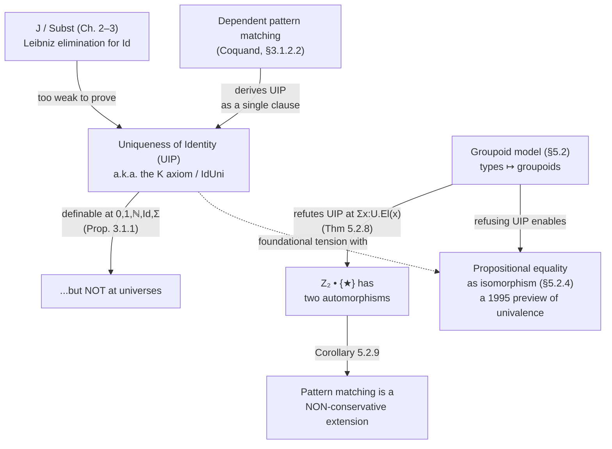

[[book-guidelines|↩ Back to guidelines]]

## Why this question has teeth

Suppose you have two proofs $P, Q : \mathrm{Id}_A(M,N)$ that $M$ and $N$ are propositionally equal. Are $P$ and $Q$ themselves equal? It's tempting to say "obviously — there's only one way for two things to be equal." That intuition is exactly what this section of Hofmann's thesis demolishes, and the demolition matters for anyone building a type checker.

Here's why it matters mechanically, not just philosophically. Every dependently typed kernel eventually needs to rewrite a type along a proof of equality — Lean's `▸`, Coq's `rewrite`, the `Subst` operator you'll meet below. If you rewrite along $P$ you get one term; if you rewrite along $Q$ you get, in principle, a *different* term, even though $P$ and $Q$ prove the "same" fact. If proofs of equality were always unique, this could never bite you: any two rewrites along any two proofs would land on definitionally — or at least propositionally — identical results, and a whole class of "why did my proof state look different after this tactic" bugs would be impossible by construction. The question of whether that's actually true is not a curiosity; it determines how much a type-checker's elaborator is allowed to *not care* about which proof term it produced.

Martin-Löf's identity type, as given by the elimination rule $J$ (Chapter 2), does **not** settle this question. Hofmann's thesis proves, via an actual model, that $J$ is simply too weak to derive it — and that the question has a name with real consequences: it decides whether pattern matching on dependent types is a conservative extension of type theory, and it is the reason a flag called `--without-K` exists in Agda today.

## Constituent idea 1: What $J$ can and can't prove

Recall from Chapter 2 that the identity type's elimination rule is Leibniz-style: given a family $\Phi$ depending on a proof of $\mathrm{Id}_\sigma(x,y)$, and given a proof of $\Phi$ at the reflexivity case, $J$ produces a proof of $\Phi$ for *any* $x, y$ and any proof between them. The derived operator used constantly in this thesis is $\mathrm{Subst}$ — "if $P : \mathrm{Id}_\sigma(M,N)$ and you have an $L$ of type $\Phi[M]$, you get $\mathrm{Subst}(P, L)$ of type $\Phi[N]$." Symmetry and transitivity of equality (`Sym`, `Trans`) are themselves just instances of `Subst` (§3.1.1).

The book states the open wound plainly (p. 80, §3.1.2):

> "The conversion functions from $\Phi[M]$ to $\Phi[N]$, if $P : \mathrm{Id}(M,N)$, obtained from $\mathrm{Subst}$ depend on the proof supplied. That is, if $\vdash P, Q : \mathrm{Id}_\sigma(M,N)$ and $\vdash L : \Phi[M]$ then in general the type $\vdash \mathrm{Id}_{\Phi[N]}(\mathrm{Subst}(P,L), \mathrm{Subst}(Q,L))$ is not inhabited."

Equivalently: $\mathrm{Id}_{\mathrm{Id}_\sigma(M,N)}(P,Q)$ need not be inhabited. Hofmann names this **uniqueness of identity** (what the wider literature, following Streicher, calls **UIP**): for every $P, Q : \mathrm{Id}_\sigma(M,N)$, the type of equalities between them is inhabited.

**What breaks without it.** If UIP fails, a proof `Subst(P, L)` and a proof `Subst(Q, L)` for two different `P`, `Q` are not interchangeable — your elaborator cannot silently pick "the" proof of an equality and move on; it has to track *which* proof was used, because different proofs can produce observably different results downstream (this is exactly the phenomenon exploited in §5.2.4 below). A checker built assuming UIP holds everywhere will unify two goals that a checker respecting proof-relevant equality must keep apart.

### The K axiom

Since $J$ alone doesn't give UIP, several authors (Hofmann cites Streicher [101], among others) proposed adding it as a primitive. The trick — attributed to Streicher — is that you only need to postulate UIP when *one* of the two proofs is literally `Refl`; the general case for arbitrary $P,Q$ then follows by applying $J$ itself (using UIP-at-reflexivity as the motive). Concretely, the thesis introduces a family of constants:

$$
\dfrac{\vdash M : \sigma \qquad \vdash P : \mathrm{Id}_\sigma(M,M)}{\vdash \mathrm{IdUni}_\sigma(M,P) : \mathrm{Id}_{\mathrm{Id}_\sigma(M,M)}(P, \mathrm{Refl}_\sigma(M))} \quad \textsf{Id-Uni-I}
$$

with a computation rule collapsing $\mathrm{IdUni}$ applied to `Refl` back to `Refl`:

$$
\mathrm{IdUni}_\sigma(M, \mathrm{Refl}_\sigma(M)) = \mathrm{Refl}_{\mathrm{Refl}_\sigma(M)} : \mathrm{Id}_{\mathrm{Id}_\sigma(M,M)}(\mathrm{Refl}_\sigma(M), \mathrm{Refl}_\sigma(M)) \quad \textsf{Id-Uni-Comp}
$$

This is the rule the literature calls **the K axiom** — Streicher's η-rule for the identity type (thesis [101], recapped in §3.3) says exactly this: an elimination principle for `Id` whose motive only needs to be checked at reflexivity, entailing that `J` applied to `Refl` as motive and any proof `p` collapses definitionally to the base case. Hofmann does not use the name "K" in the main text, but the technical content is identical, and the thesis's related-work section explicitly credits Streicher with first identifying UIP as a *necessary additional principle*, not a derivable one.

**Why "K" is dangerous for canonicity, and why it's usually fine.** Adding `IdUni` as a bare axiom (no computation rule) would wreck N-canonicity the same way `Ext` does (§3.1.3) — it would introduce non-canonical inhabitants of every type. But because `Id-Uni-Comp` gives `IdUni` a genuine reduction behavior when its argument is canonical, the thesis observes that a theory extended with `Id-Uni-I`/`Id-Uni-Comp` *should* remain strongly normalizing (no full proof is given in the literature at the time, but it's judged to plausibly carry over from existing normalization proofs).

Proposition 3.1.1 shows UIP is actually *definable* — no axiom needed — at $0$, $1$, $\mathbb{N}$, at any $\mathrm{Id}$-type (recursively), and at $\Sigma$-types, given a universe to internalize the recursive argument (e.g., for $\mathbb{N}$ you build a decidable equality code `EqNat : ℕ → ℕ → U` and show it's logically equivalent to `Id`, then argue uniqueness of *that* proof by induction). What Proposition 3.1.1 conspicuously does **not** cover is universes themselves — and that gap is exactly where the independence result in §5.2.3 will strike.

**Lean/Coq grounding.** This is precisely the design fork that gives Agda its `--without-K` flag and gives Coq its distinction between `Prop`-based proof irrelevance and axiom-free "predicative" identity types. In Lean 4's core theory, `Eq` elimination (`Eq.rec`, which powers the `▸` notation and the `subst` tactic) *is* defined so that it only needs to be checked at `rfl` — Lean's kernel treats `Eq` essentially like a K-style singleton eliminator. That's a deliberate, load-bearing design decision, not an accident: it is exactly the axiom this section names. It is why Lean's `Eq` is not a good stand-in for Homotopy Type Theory's path types, and it is why Agda — which is meant to support both styles — makes K opt-in/opt-out via a compiler flag rather than baking it in:

```haskell
-- Agda, illustrating the flag this section is really about
{-# OPTIONS --without-K #-}

data _≡_ {A : Set} (x : A) : A → Set where
  refl : x ≡ x

-- With --without-K, Agda's pattern-matching compiler REFUSES to accept
-- a definition like this one, because it implicitly assumes UIP:
uip : {A : Set} {x y : A} (p q : x ≡ y) → p ≡ q
uip refl refl = refl   -- rejected: pattern-matches p and q against refl
                        -- simultaneously, which only works if the *shape*
                        -- of the proof is forced to be unique
```

That rejection is not a technicality — it is Agda's type-checker enforcing, at the level of what pattern-matching clauses are even legal, the exact independence result Hofmann proves semantically in §5.2.3.

## Constituent idea 2: Pattern matching secretly assumes UIP

Section 3.1.2.2 makes an observation that looks almost too easy, and that's the point — it's meant to be almost too easy, so that the reader feels the trap before it's sprung.

Coquand's dependent pattern matching lets you define a function on an inductive family by giving its value at canonical constructors directly, rather than going through a parametrized eliminator like $J$. Applied to the identity type, whose only canonical inhabitant (of $\mathrm{Id}_\sigma(M,M)$) is $\mathrm{Refl}_\sigma(M)$, you can define:

$$
\mathrm{IdUni}_\sigma(M, \mathrm{Refl}_\sigma(M)) = \mathrm{Refl}_{\mathrm{Id}_\sigma(M,M)}(\mathrm{Refl}_\sigma(M))
$$

as a *single pattern clause* — the same $\mathrm{IdUni}$ as above, but obtained "for free" by pattern matching, with no separate axiom needed. Hofmann flags the subtlety immediately: $R_\mathbb{N}$, $J$, and friends also reduce to canonical cases, but their patterns are given in a *parametrized* way (the motive is universally quantified over the index before you plug in reflexivity). Coquand-style pattern matching lets you match on the index and the proof simultaneously and unconditionally — and that extra freedom is precisely what smuggles UIP in.

**Why this matters for an elaborator.** If your dependently typed language compiles surface-level pattern matches into calls to a small trusted eliminator (the standard "elaborate pattern matching into eliminators" architecture used by Coq, Agda, and Lean's `match` compiler), then the elaborator is not a neutral desugaring step — it is silently choosing whether the *kernel* (the trusted computing base) gets to assume UIP or not. Get this wrong and your "safe, elaborated-down-to-a-small-kernel" story is a lie: the kernel ends up proving things ($J$ alone cannot) because the elaborator's pattern-compilation algorithm added expressive power on the way down.

This is exactly why the corollary below is stated the way it is.

## Constituent idea 3: The groupoid counterexample

To *prove* $J$ can't derive UIP, Hofmann needs an actual model of type theory in which some identity type has two distinct, non-identified inhabitants — a model that validates every rule of intensional type theory (so it's a legitimate semantics of `TT`) yet refutes UIP. This is the **groupoid model**, and it is the technical heart of Chapter 5.

**The idea, before the notation.** [[The-Setoid-Model|The setoid model]] $S_0$ from earlier in Chapter 5 interprets types as a bare *type-plus-equivalence-relation*, where the relation is a mere $\mathrm{Prop}$ (proof-irrelevant). That's too weak to get real type dependency: you can't build a family of types varying over the natural numbers, because the "set part" of a family in $S_0$ never depends on anything but the ambient context's set part, only its relation does. To fix this, the *proof of relatedness* has to be usable *computationally* — you need a function $\mathrm{reindex}(p, x)$ that actually transports an element $x$ along a proof $p$ that its index is related to another. But once $p$ is used computationally like that, it can no longer live in a proof-irrelevant $\mathrm{Prop}$: two different proofs $p, p'$ of the same relatedness fact might reindex differently. The relation has to become a genuine, proof-*relevant* type.

That's a **groupoid**: a set $X_{\mathrm{set}}$ together with, for every $x,y$, a *set* (not just a proposition) $X_{\mathrm{rel}}(x,y)$ of "morphisms" between them, closed under identity ($\mathrm{refl}$), inverse ($\mathrm{sym}$), and composition ($\mathrm{trans}$) obeying the category-with-all-isos equations. Every type $\sigma$ in plain intensional type theory induces a groupoid $G(\sigma)$: objects are terms $M : \sigma$, morphisms $G(\sigma)_{\mathrm{rel}}(M,N)$ are proofs $P : \mathrm{Id}_\sigma(M,N)$ *quotiented by propositional equality of proofs* — i.e. two proofs of the same fact are identified in $G(\sigma)$ exactly when there's a proof that they're equal. This is the sense in which groupoids are "the semantics of identity types done properly": the morphisms of $G(\sigma)$ are, definitionally, what $\mathrm{Id}_\sigma$ is *supposed* to classify.

Building the full model — families of groupoids over a groupoid, dependent products, and, crucially, an **identity groupoid** $\mathrm{Id}(\Phi)$ where $\mathrm{Id}(\Phi)(\Gamma, s, s')$ is the *discrete* groupoid on $\Phi_{\mathrm{rel}}(\Gamma, s, s')$ — gives an interpretation of $J$/$\mathrm{Subst}$ inside ordinary, extensional set theory (Prop. 5.2.7). Because the identity groupoid is discrete, propositional and definitional equality on identity types *coincide* in the model: two proofs of the same equality are equal in the model exactly when they're the same set-theoretic element. That's the lever the counterexample pulls.

**The counterexample itself (Theorem 5.2.8).** If UIP held at every type, the soundness theorem would force *every* groupoid arising as an interpretation $[\![\sigma]\!](\Gamma)$ to be a **pre-order** — every hom-set $X_{\mathrm{rel}}(x,x')$ has at most one element, because $\mathrm{Id}(\Phi)$'s hom-sets are always discrete singletons-or-empty. But the model contains a type that isn't a pre-order: interpreting $\Sigma x{:}U.\mathrm{El}(x)$ (a universe code paired with an element of the type it names) produces the object $(\mathbb{Z}_2 \bullet \{\star\}, \star)$ — the singleton set $\{\star\}$ equipped with the group $\mathbb{Z}_2$ acting on it as its "morphism structure" — and this object has **two distinct automorphisms** (the identity, and the nontrivial swap coming from $\mathbb{Z}_2$'s non-identity element). Two different proofs that this object equals itself. UIP fails, at a type that's just "a universe code together with an element" — nothing exotic.

$$
\textbf{Theorem 5.2.8: } \text{UIP is not uniformly definable at all types; it fails at } \Sigma x{:}U.\mathrm{El}(x).
$$

**Corollary 5.2.9** is the payoff: since UIP *is* definable using dependent pattern matching (constituent idea 2), and the groupoid model refutes UIP at $\Sigma x{:}U.\mathrm{El}(x)$, **pattern matching is a non-conservative extension of Martin-Löf type theory** — it proves strictly more equalities than $J$ does. This isn't a minor implementation detail: it means a language whose elaborator compiles surface pattern-matching straight down to $J$ is *lying* about what its kernel can prove, unless it explicitly restricts or flags the pattern-matching compiler (exactly what `--without-K` does).

**Rust grounding — why this doesn't (and can't) show up as a Rust example.** Rust's type system has no dependent identity type, no user-extensible notion of "two proofs of equality," and no pattern-matching-generates-new-axioms phenomenon — `PartialEq`/`Eq` are proof-irrelevant boolean predicates by construction, not proof-carrying types with their own internal structure. This is a case the style guide's escape hatch is meant for: forcing a Rust analogy here (e.g., "it's like two different `impl`s of a marker trait") would understate what's actually at stake — that *provable equalities can carry distinguishable evidence*. The honest Rust-shaped takeaway is structural instead: if you were writing a Rust-hosted proof kernel for a dependent type theory (the target of this whole learning project), the routine that implements `Subst`/rewriting *must* carry the specific proof term as data, and your conversion/unification checker cannot special-case-away "which proof" without first deciding, as a global design choice, whether your theory validates K.

```rust
// Sketch of a trusted-kernel `Subst` (rewrite) operation.
// The critical design fork this section is about: does the kernel get to
// assume any two `proof: EqProof` of the same equality are interchangeable?
enum EqProof {
    Refl(Term),
    // ... other constructors witnessing derived equalities (Sym, Trans, congruence, ...)
}

fn subst(motive: &Type, proof: &EqProof, term: &Term) -> Term {
    match proof {
        // Only the Refl case is *forced* to reduce computationally (J's real behavior).
        EqProof::Refl(_) => term.clone(),
        // Anything else requires genuinely dispatching on proof structure —
        // there is no way to normalize this away without assuming K,
        // and assuming K is exactly what the groupoid model shows is unsound
        // to assume *uniformly*, e.g. at types built from a universe.
        _ => unreachable!("no uniform reduction without further axioms"),
    }
}
```

## Constituent idea 4: Propositional equality as isomorphism

Section 5.2.4 turns the "bug" of the previous section into a feature. If UIP genuinely fails in a sound model, then *deliberately* refusing to assume it lets you interpret a strictly more expressive notion of propositional equality *on a universe*: equality of two codes $X, Y : U$ as **isomorphism** between the types they name.

Define, inside a theory with functional extensionality and $\mathrm{Subst}$ (both available in this thesis without further axioms — see the earlier extensional-concepts topic):

$$
\mathrm{Iso}[X,Y] := \Sigma f{:}\mathrm{El}(X)\to\mathrm{El}(Y).\, \Sigma f'{:}\mathrm{El}(Y)\to\mathrm{El}(X).\; \mathrm{Id}_{\mathrm{El}(X)\to\mathrm{El}(X)}(f'\circ f, \mathrm{id}) \times \mathrm{Id}_{\mathrm{El}(Y)\to\mathrm{El}(Y)}(f\circ f', \mathrm{id})
$$

and add a new introduction rule and a new definitional-equality rule for `Subst`'s behavior on it:

$$
\dfrac{\vdash X, Y : U \qquad \vdash F : \mathrm{Iso}[X,Y]}{\vdash \mathrm{UnivId}(X,Y,F) : \mathrm{Id}_U(X,Y)} \quad \textsf{Univ-Id}
$$

$$
\dfrac{\vdash F : \mathrm{Iso}[X,Y] \qquad \vdash M : \mathrm{El}(X)}{\vdash \mathrm{Subst}_{U,\mathrm{El}}(X,Y,\mathrm{UnivId}(F),M) = F\,M : \mathrm{El}(Y)} \quad \textsf{Univ-Id-Eq}
$$

In words: rewriting a term along a proof that two universe codes are equal *because* they're isomorphic acts exactly by applying the isomorphism. This makes `UnivId` **injective** — different isomorphisms give different, non-identified proofs of the same equality $\mathrm{Id}_U(X,Y)$ — which is a flat contradiction with UIP as soon as $U$ contains any type with a nontrivial automorphism (e.g. $\mathbb{N}$, or the two-element type). And yet Hofmann proves this extension is **sound**, precisely because the groupoid model interprets $\mathrm{Id}_U$'s hom-sets as actual isomorphism-groups rather than discrete singletons — the model built to *refute* UIP is exactly the semantics that makes "equality as isomorphism" consistent (Theorem 5.2.10).

**Why to care, if you're building a compiler.** This single rule is the thesis's own 1995-era preview of univalence: identifying propositional equality of types with the type of isomorphisms between them, years before Voevodsky's univalence axiom made the same identification the foundation of Homotopy Type Theory (with $\mathrm{Iso}$ generalized to a homotopy-coherent equivalence). Hofmann is explicit that he considers this "a promising but only lightly explored direction" and flags (Chapter 7) that a fully coherent version — one stable under functor/slice constructions — needs a further *proof-relevant* quotient type former that the thesis doesn't fully construct. If your compiler project ever needs subtyping-by-isomorphism between refinement-type codes, or wants to treat "these two type-level representations are interchangeable because there's a canonical bijection between their models" as a first-class propositional fact rather than an ad hoc coercion, this rule (and its cost — giving up UIP) is the relevant piece of prior art.

## Synthesis: where this sits in the thesis, and why it matters for the compiler project



This topic is the thesis's load-bearing negative result: it is what makes the earlier claim "$\mathrm{Ext}$ and $\mathrm{IdUni}$ are the two extensional concepts you must add by hand, everything else is definable" (Chapter 3's conservativity theorem) non-vacuous — if UIP *were* derivable from $J$ alone, half of the thesis's Chapter 3 apparatus (the `IdUni` constant, the conservativity proof's careful bookkeeping around it) would be unnecessary. It also directly motivates the **groupoid model**'s existence as a distinct construction from the earlier, simpler setoid model $S_0$ (§5.1) — $S_0$ is too proof-irrelevant to even *state* this counterexample, let alone prove it, which is exactly why Chapter 5 builds three progressively more refined models instead of stopping at the first one.

**For the compiler/elaborator project specifically:** this is a direct prerequisite for any design decision about whether your kernel's `isDefEq`/conversion checker gets to assume proof-irrelevance for `Id`-typed arguments, and it's the formal justification behind a very concrete engineering choice — Agda's `--without-K`, Coq's separate treatment of `Prop` (proof-irrelevant by fiat) versus `Type`-valued equality, and Lean's choice to bake K-like behavior into `Eq.rec` itself. If your compiler's elaborator ever compiles user-level dependent pattern matches into calls to a trusted eliminator, this section is the precise reason that translation is not "just sugar" — it is a place where the elaborator can silently hand the kernel more proving power than the kernel's stated eliminator rules justify, unless the compilation is explicitly restricted the way Agda's flag restricts it.

## Where this leads

The independence result licenses the rest of Chapter 5: because $S_0$ can't validate real type dependency and the groupoid model (which can) refutes UIP, Hofmann builds a third model, the **dependent setoid model $S_1$** (§5.3), that sacrifices definitional computation rules in exchange for validating both UIP *and* functional extensionality syntactically inside intensional type theory — the practical compromise the rest of the thesis's applications (Chapter 6) actually build on.
