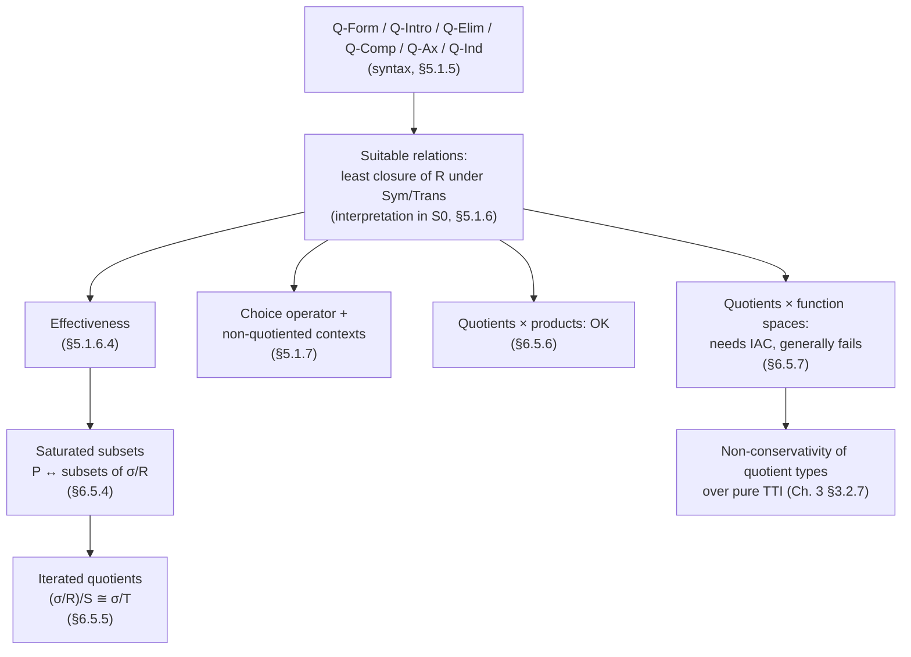

[[book-guidelines|↩ Back to guidelines]]

## The problem quotient types solve

Suppose you want to build the integers out of the naturals, the way every algebra textbook does: a pair $(a, b) : \mathbb{N} \times \mathbb{N}$ standing for $a - b$. The catch is that infinitely many pairs denote the same integer — $(0,1)$, $(1,2)$, $(5,6)$ all mean $-1$ — and you want your type theory to *know* they're equal, not merely to know that some external mathematician says they're equal.

In set theory this is free: you take the set of pairs, quotient by the relation $R[(a,b),(a',b')] :\equiv a+b' = a'+b$, and the resulting integer *is* an equivalence class, a genuinely new object with its old representatives erased. But a type theory with only $\Pi$, $\Sigma$, $\mathbb{N}$ and $\mathrm{Id}$ has no operation that does this. You can build $\mathbb{N} \times \mathbb{N}$, and you can build a proposition $R[(a,b),(a',b')]$, but nothing in the calculus lets you declare "and now identify these." Definitional equality is fixed by the reduction rules of the calculus and cannot be extended per-type; propositional equality (the identity type $\mathrm{Id}$) is *finer* than $R$ in general — you'd need a way to freely make $R$-related elements propositionally equal, without disturbing anything else.

That is exactly what a quotient type former does: given a type $\Gamma$ and a relation $R$ on $\Gamma$ (not even required to be an equivalence relation — reflexivity, symmetry and transitivity get added automatically, as you'll see below), it produces a new type $\Gamma/R$ whose elements behave like $\Gamma$'s elements but whose propositional equality has been enlarged to include $R$.

**What breaks without it.** Without quotient types you're stuck either (a) carrying the "is this really an integer" proof around everywhere as an extra $\Sigma$-component — the refinement-type style Hofmann rejects elsewhere in the thesis for exactly this bookkeeping cost — or (b) working with $\mathbb{N} \times \mathbb{N}$ directly and manually re-proving, at every single use site, that your functions respect $R$. Quotient types let you prove "respects $R$" *once*, at definition time, and never think about it again.

The twist that makes this chapter belong to the thesis's larger arc: naively adding quotient types as a bare rule set to intensional type theory (TTI) breaks N-canonicity — a closed term of type $\mathbb{N}$ built by combining quotient operations need not reduce to a numeral, because $[\,\cdot\,]_R$ introduces new "class" terms with no computation rule attached to them the way $\mathrm{Suc}$ does. So Hofmann does here exactly what he does for the other five extensional concepts: give quotient types *syntax* first (this article's first section), then justify that syntax by *interpreting* it inside [[The-Setoid-Model|the setoid model]] $S_0$ (built from nothing but pure intensional type theory), so that "forming a quotient" unfolds to a genuine, canonicity-preserving intensional construction rather than a new primitive you have to trust axiomatically.

## Quotient formation, introduction, and elimination

Given $\Gamma \vdash \sigma$ and a $\mathrm{Prop}$-valued relation $\Gamma, s, s':\sigma \vdash R[s,s'] : \mathrm{Prop}$, the rules are:

$$
\frac{\Gamma \vdash \sigma \qquad \Gamma, s, s':\sigma \vdash R[s,s'] : \mathrm{Prop}}{\Gamma \vdash \sigma/R} \ \text{Q-Form}
\qquad
\frac{\Gamma \vdash M : \sigma}{\Gamma \vdash [M]_R : \sigma/R} \ \text{Q-Intro}
$$

$$
\frac{\Gamma, s:\sigma \vdash M[s] : \tau \qquad \Gamma \vdash N : \sigma/R \qquad \Gamma, s,s':\sigma, p:\mathrm{Prf}(R[s,s']) \vdash H : \mathrm{Prf}(M[s] =_L M[s'])}{\Gamma \vdash \mathsf{plug}_R\ N\ \mathsf{in}\ M\ \mathsf{using}\ H : \tau} \ \text{Q-Elim}
$$

$$
\Gamma \vdash \mathsf{plug}_R\ [N]_R\ \mathsf{in}\ M\ \mathsf{using}\ H = M[N] : \tau \ \ \text{Q-Comp}
$$

$$
\frac{\Gamma \vdash M, N : \sigma \qquad \Gamma \vdash H : \mathrm{Prf}(R[M,N])}{\Gamma \vdash \mathsf{Qax}_R(H) : \mathrm{Prf}([M]_R =_L [N]_R)} \ \text{Q-Ax}
\qquad
\frac{\Gamma, x:\sigma/R \vdash P[x]:\mathrm{Prop} \qquad \Gamma, s:\sigma \vdash H : \mathrm{Prf}(P[[s]_R]) \qquad \Gamma \vdash M : \sigma/R}{\Gamma \vdash \mathsf{Qind}_R(H,M) : \mathrm{Prf}(P[M])} \ \text{Q-Ind}
$$

Read them as a package deal, each rule doing one job:

- **Q-Form** just says: any type plus any relation on it gives you a new type. Note the deliberate weakness — $R$ need not be reflexive, symmetric, or transitive. Hofmann builds the quotient of the *closure* of $R$, which is both more general (you can quotient by "generating" relations, the way group presentations quotient a free group by generators-as-relations) and syntactically simpler (no obligation to prove $R$ is an equivalence relation before you're allowed to form the type).
- **Q-Intro** builds a "class" $[M]_R$ from a representative $M:\sigma$ — the quotient map itself.
- **Q-Elim/Q-Comp** is how you *define functions out of* $\sigma/R$: give a function $M$ on representatives, plus a proof $H$ that $R$-related inputs give $Leibniz$-equal outputs ("$M$ respects $R$"), and you get a genuine function $\mathsf{plug}_R\,N\,\mathsf{in}\,M\,\mathsf{using}\,H$ on the quotient, which computes definitionally to $M[N]$ on introduced classes (Q-Comp). This is the whole payoff: you write $M$ once, prove respect once, and every future application is free.
- **Q-Ax** is the defining axiom of quotienting: related representatives *are* (propositionally) equal classes.
- **Q-Ind** says $\sigma/R$ has no elements besides classes — every property provable on all classes $[s]_R$ holds on all of $\sigma/R$. This is what lets you actually reason *about* the quotient type, not just compute with it.

**Worked example (from the thesis).** Define $\mathrm{Int} := \mathbb{N}\times\mathbb{N}/R_{\mathrm{Int}}$ with $R_{\mathrm{Int}}[u,v] :\equiv (u.1+v.2 =_L u.2+v.1)$. Q-Elim lets you define addition, negation, absolute value on $\mathrm{Int}$ by giving the obvious formulas on pairs and checking they respect $R_{\mathrm{Int}}$; Q-Ind then lets you prove ring laws about them by reducing to the corresponding facts about $\mathbb{N}\times\mathbb{N}$.

**What breaks without Q-Elim specifically.** If you only had Q-Form/Q-Intro/Q-Ax you could *build* the quotient but never compute *with* it — there'd be no way to define a total function out of $\mathrm{Int}$ short of somehow doing case analysis on an opaque class, which the theory gives you no tool for. Q-Elim is what turns "a type with extra proven-equal elements" into a genuinely usable data type.

### Grounding: Lean's `Quotient` is this, almost verbatim

Lean's kernel has quotient types as a primitive, and the correspondence to Hofmann's rules is closer than any analogy you'll see elsewhere in this thesis:

| Hofmann | Lean |
|---|---|
| Q-Form: $\sigma/R$ | `Quotient (s : Setoid α)` (or the more primitive `Quot r` for an arbitrary relation `r`) |
| Q-Intro: $[M]_R$ | `Quotient.mk s M` / `Quot.mk r M` |
| Q-Elim + Q-Comp | `Quotient.lift f h : Quotient s → β`, and `Quotient.lift f h (Quotient.mk s a) = f a` holds **by `rfl`** — exactly Q-Comp's definitional equality |
| Q-Ax | `Quotient.sound : r a b → Quotient.mk s a = Quotient.mk s b` (in `Quot`'s case, `Quot.sound`) — introduces a *propositional* equality axiomatically, matching Hofmann's $=_L$, not a definitional one |
| Q-Ind | `Quotient.ind : (∀ a, motive (Quotient.mk s a)) → ∀ q, motive q` |

This is not a coincidence dressed up as one: Lean's `Quot` is *exactly* Hofmann's Q-Form/Q-Intro/Q-Elim/Q-Comp/Q-Ax package, taken as a kernel primitive rather than derived, because deriving it (the way Hofmann does via the setoid model) is significant work. When you write `Quotient.lift`, you are supplying precisely the $H$ argument of Q-Elim; Lean's typechecker refuses to accept your `lift` call until you hand it a proof of respect, the same proof obligation Q-Elim's third premise demands.

```lean
-- Hofmann's Int example, in Lean
def RInt : (ℕ × ℕ) → (ℕ × ℕ) → Prop
  | (a, b), (a', b') => a + b' = a' + b

instance : Setoid (ℕ × ℕ) where
  r := RInt
  iseqv := ⟨fun _ => rfl, Eq.symm, Eq.trans⟩   -- symmetry/transitivity of `=` on ℕ do the work

def Int' := Quotient (inferInstance : Setoid (ℕ × ℕ))

def add' : Int' → Int' → Int' :=
  Quotient.lift₂ (fun (a,b) (c,d) => Quotient.mk _ (a+c, b+d))
    (by intro _ _ _ _ h1 h2; simp_all [Quotient.eq]; omega)
```

### Grounding: Rust — the shape without the primitive

Rust has no quotient-type former, but the *pattern* it forces you into when you don't have one is instructive, and mirrors exactly the "carry the respect proof by hand" cost Hofmann is trying to eliminate:

```rust
// A rational number as a pair, with equality defined by cross-multiplication —
// this is a quotient "by convention": two Rationals compare equal even when
// their internal representatives (num, den) differ.
#[derive(Clone, Copy, Debug)]
struct Rational { num: i64, den: i64 }

impl PartialEq for Rational {
    fn eq(&self, other: &Self) -> bool {
        self.num * other.den == other.num * self.den   // this is R, not definitional (field) equality
    }
}

// Every function you write on Rational must be checked, by hand, at every
// definition site, to respect this equality — the compiler gives you no
// help and no Q-Elim-style enforcement.
fn add(a: Rational, b: Rational) -> Rational {
    Rational { num: a.num * b.den + b.num * a.den, den: a.den * b.den }
    // you, the programmer, must separately convince yourself this respects `eq`
}
```

Rust's `#[derive(PartialEq)]` would instead compare `(num, den)` pairwise — that's *definitional-style* (structural) equality, the thing quotient types are explicitly overriding. The gap between what `derive` gives you for free and what `impl PartialEq` above hand-rolls is exactly the gap Q-Ax closes for you automatically once and for all inside the type theory.

## Interpreting quotients in the setoid model: suitable relations

Chapter 5's setoid model $S_0$ interprets every type $\sigma$ as a pair $(\sigma_{\mathrm{set}}, \sigma_{\mathrm{rel}})$: an ordinary (target-theory) type together with a partial equivalence relation on it. A term of $\sigma$ is modeled as an element of $\sigma_{\mathrm{set}}$ satisfying a "respects $\sigma_{\mathrm{rel}}$" proof obligation.

Given a family $\sigma$ and a relation $R$ over it, the quotient $\sigma/R$ keeps the *same* underlying set —

$$(\sigma/R)_{\mathrm{set}}[\gamma] = \sigma_{\mathrm{set}}[\gamma]$$

— and changes only the equivalence relation. But $R$ itself need not be symmetric or transitive, so the model can't use $R$ directly; it has to close $R$ up. Hofmann does this with a higher-order (impredicative) definition of the *least suitable relation*:

$$
(\sigma/R)_{\mathrm{rel}}[\gamma; s, s'] \;:=\; \forall R'.\ \mathrm{Sym}(R') \to \mathrm{Trans}(R') \to \big(\forall x,x'.\ \sigma_{\mathrm{rel}}[\gamma;x,x'] \to R'(x,x')\big) \to \big(\forall x,x'.\ R[\gamma;x,x'] \to \sigma_{\mathrm{rel}}[\gamma;x,x] \to \sigma_{\mathrm{rel}}[\gamma;x',x'] \to R'(x,x')\big) \to R'(s,s')
$$

This is exactly the Church-encoding trick for "smallest set closed under these constructors," applied to relations instead of data: $(\sigma/R)_{\mathrm{rel}}$ is defined as the intersection of *every* symmetric-transitive relation $R'$ that both contains $\sigma_{\mathrm{rel}}$ and contains $R$ (restricted to $\sigma_{\mathrm{rel}}$'s domain of definedness). Hofmann calls a relation satisfying those closure conditions **suitable**; the quotient's relation is the *least* suitable one. This single definition is then reused to interpret every quotient-type rule: Q-Intro, Q-Ax, Q-Elim, and Q-Ind are all proved sound by instantiating the universally-quantified $R'$ in this definition with a cleverly chosen witness relation (§5.1.6.1–5.1.6.3 walk through each).

**What breaks without closing under symmetry/transitivity.** If the model used raw $R$ as the quotient's relation, $\sigma/R$ would fail to be a setoid at all whenever $R$ isn't already an equivalence relation — and Q-Form deliberately allows *any* relation, including asymmetric generating relations, precisely so you can quotient by "generators" the way Hofmann's Bourbaki-style constructions in Chapter 6 do. The closure is what makes Q-Form's generality free of charge.

### Effective quotients

A natural question: does the converse of Q-Ax hold? I.e., if $[M]_R =_L [N]_R$, must $R[M,N]$ hold? In general no — Q-Ax plus a converse would force $R$ to *be* an equivalence relation, which Q-Form never assumed. Hofmann calls a quotient **effective** when this converse *does* hold, and proves (Prop. 5.1.10) that in $S_0$, every quotient by an actual equivalence relation is effective — a purely syntactic consequence of the quotient rules plus propositional extensionality (Bi-Imp, the rule identifying bi-implicative propositions). The proof is a slick use of Q-Elim itself: lift the predicate $M[y] := R[U,y]$ to the quotient via $H$ (built from symmetry/transitivity/Bi-Imp), evaluate the lifted predicate at both $[U]_R$ and $[V]_R$ — which are propositionally equal by hypothesis — and read off $R[U,V]$ from $R[U,U]$ (true by reflexivity) transported across that equality.

Effectiveness matters beyond this one proof — it is the load-bearing fact behind the saturated-subsets correspondence in §6.5.4 below.

## The choice operator: recovering a representative

Here's a genuinely strange-looking rule. If $M:\sigma/R$ is a quotient element, can you get back a representative $N:\sigma$ with $[N]_R = M$? Naively this sounds like it should be *impossible in general* (that's the whole point of quotienting — the class shouldn't remember which representative built it) and *dangerous if allowed unrestricted* (it looks like it would let you distinguish propositionally-equal classes, breaking Q-Ax).

Hofmann's answer: it's sound, but only under a syntactic restriction.

$$
\frac{\Gamma \vdash M : \sigma/R \quad \text{(certain proviso)}}{\Gamma \vdash \mathsf{choice}(M):\sigma} \ \text{Q-Choice}
\qquad
\mathsf{choice}([M]_R) = M \ \ \text{Q-Choice-Comp}
\qquad
[\mathsf{choice}(M)]_R = M \ \ \text{Q-Choice-Ax}
$$

The proviso: $\Gamma$ must be a **non-quotiented context**, meaning built only from inductive types (like $\mathbb{N}$) and proof types $\mathrm{Prf}(-)$ — never containing a quotient type itself. Formally (Def. 5.1.12), non-quotiented types are $\mathbb{N}$ and other inductive types, dependent function types $x_1{:}\rho_1 \dots x_n{:}\rho_n.\mathrm{Prf}(M)$ landing in a proposition, and $\Pi$-types between non-quotiented types. The actual rule closes this up under substitution and weakening: $\Gamma \vdash \mathsf{choice}(M):\sigma$ is admitted whenever $M$ is syntactically identical (not just propositionally equal — genuinely $\equiv$) to some $N[f]$ where $N:\tau$ is derived in a non-quotiented context and $f$ is a context morphism.

Why does non-quotiented-ness make this safe? In the setoid model, $S_0$'s relation on a non-quotiented context turns out to coincide with plain Leibniz equality (Prop. 5.1.13): if $\gamma \mathrel{\mathsf{rel}} \gamma'$ in a non-quotiented context, then $\gamma$ and $\gamma'$ are already Leibniz-equal, term-for-term. That collapses the gap between "related" and "equal" that quotienting exploits — so *reading off* a representative from an element built in such a context can't secretly depend on which representative you happened to pick, because in that context there's only ever one representative up to the equality that matters.

**What breaks without the restriction — and why it isn't a contradiction anyway.** Consider $\overline{1} := [(0,1)]_{R_{\mathrm{Int}}}$ and $\overline{1'} := [(2,3)]_{R_{\mathrm{Int}}}$. Since $0+3 =_L 1+2$, we have $R_{\mathrm{Int}}[(0,1),(2,3)]$ and hence $\overline{1} =_L \overline{1'}$. But $\mathsf{choice}(\overline{1}) = (0,1)$ while $\mathsf{choice}(\overline{1'}) = (2,3)$ — manifestly *different* pairs. It looks like Leibniz equality should let you substitute one for the other inside any predicate $P$, including $P := z{:}\mathrm{Int}.\ \mathsf{choice}(\overline{1}) =_L \mathsf{choice}(z)$, giving the contradiction $(0,1) =_L (2,3)$. The escape: that instantiation is **ill-typed**. $z:\mathrm{Int} \vdash \mathsf{choice}(z):\mathbb{N}\times\mathbb{N}$ is not derivable, because the context $z:\mathrm{Int}$ *contains a quotient type* and so is not non-quotiented — Q-Choice's side condition blocks exactly this instantiation. `choice` therefore quietly fails to respect Leibniz equality in general (it respects only definitional equality, like any other term former); it just happens that this failure never surfaces as an actual derivable contradiction, because the one substitution that would expose it is syntactically excluded.

**Why it's useful anyway.** Q-Choice lets you take a function $F:\mathrm{Int}\to\mathrm{Int}$ defined abstractly (in a non-quotiented context, so *not* just a bare variable) and recover its concrete implementation on representatives: $F' := u{:}\mathbb{N}\times\mathbb{N}.\ \mathsf{choice}(F[[u]_{R_{\mathrm{Int}}}]) : (\mathbb{N}\times\mathbb{N})\to(\mathbb{N}\times\mathbb{N})$. And it partially rescues constructive access to "non-constructive" quotients like the reals-as-Cauchy-sequences: given $R:\mathrm{Real}$ built in the empty context, $\mathsf{choice}(R):\mathbb{N}\to\mathbb{N}$ hands you back an actual decimal expansion you can read the first digit of — something you provably *cannot* get by any non-constant function $\mathrm{Real}\to\mathbb{N}$, since the target theory has no such function respecting the reals' "book"-equality. The choice operator doesn't grant you a function out of the quotient; it grants you a peek at one specific already-constructed element's representative.

## Saturated subsets and iterated quotients

§6.5.4–6.5.5 apply the machinery to reconstruct Bourbaki-style universal-algebra constructions internally. A predicate $P$ on $\sigma$ is **saturated** with respect to $R$ if it's closed under $R$-relatedness:

$$\forall x,y{:}\sigma.\ P[x] \to R[x,y] \to P[y]$$

Bourbaki's classical fact — saturated subsets of $\sigma$ correspond bijectively to arbitrary subsets of $\sigma/R$ — transfers to type theory, but the proof needs **effectiveness** (from earlier) plus **propositional extensionality**, not just the bare quotient rules. Given a saturated $P$, define $P'[z{:}\sigma/R] := \exists x{:}\sigma.\ P[x] \wedge [x]_R =_L z$; showing $x{:}\sigma \vdash P[x] =_L P'[[x]_R]$ requires effectiveness to turn "$z =_L [x]_R$" back into an actual $R$-relatedness fact usable with $P$'s closure property. Without effectiveness the correspondence fails even up to bi-implication.

**Iterated quotients**: given a further equivalence relation $S$ on $\sigma/R$, define $T[x,x'] := S[[x]_R,[x']_R]$ on $\sigma$ directly. Then $(\sigma/R)/S \cong \sigma/T$ — quotienting twice in sequence is the same as quotienting once by the composite relation. Conversely, any equivalence $T$ on $\sigma$ that's coarser than $R$ (i.e. $R[x,x'] \Rightarrow T[x,x']$) is automatically saturated in both arguments, so by the saturated-subsets correspondence it descends to a relation $S$ on $\sigma/R$ — Bourbaki's "quotient of $T$ by $R$," $T/R$ — recovering $(\sigma/R)/(T/R) \cong \sigma/T$. This is the type-theoretic mirror of the second isomorphism theorem you'd meet quotienting groups by nested normal subgroups.

## Quotients meeting products and function spaces

**Products behave well.** For equivalence relations $R$ on $\sigma$ and $S$ on $\tau$, define $R\times S$ componentwise on $\sigma\times\tau$. Then

$$(\sigma/R) \times (\tau/S) \;\cong\; (\sigma\times\tau)/(R\times S)$$

genuinely holds, constructed by iterated lifting (`plug`) in both directions — this is §6.5.6's template for defining any binary function on a quotient: define it on representative pairs, show it respects $R\times S$ componentwise, and you've defined a function on the product of quotients via this isomorphism.

**Function spaces do not, in general.** You might expect, by analogy, that $\rho \to \tau/S \;\cong\; (\rho\to\tau)/({\to}S)$, where $({\to}S)[u,v] := \forall x{:}\rho.\ S[u\,x, v\,x]$. §6.5.7 shows this is *not* derivable from the quotient-type rules alone. It turns out to be equivalent to every class map $x{:}\tau \mapsto [x]_S$ being **powerful** — meaning that whenever a surjection out of it exists internally, precomposing with it preserves surjectivity for every type $\rho$ — which in turn is equivalent to the full **internal axiom of choice** (IAC):

$$\mathrm{IAC} : \big(\forall x{:}\sigma.\exists y{:}\tau.\ P[x,y]\big) \to \exists f{:}\sigma\to\tau.\ \forall x{:}\sigma.\ P[x, f\,x]$$

Since $S_0$ does not validate IAC in general (Chapter 5 shows IAC together with functional extensionality and propositional extensionality entails excluded middle, so a constructive model can't have all three), the function-space isomorphism genuinely fails and would have to be added as a fresh primitive rather than derived. This is the same "quotients quietly encode choice-flavored strength" phenomenon Hofmann flags earlier (Ch. 3): even *forming* a quotient by pointwise equality on functions is already enough to derive a weak form of functional extensionality, which is why intensional quotient types turn out *not* to be conservative over plain intensional type theory — the one surprising negative result attached to this whole topic.

## Synthesis: where quotients sit in the thesis



Everything here is downstream of the setoid model $S_0$ from earlier in Chapter 5 — quotient types are simply another type former $S_0$ has to interpret, alongside $\Pi$, $\Sigma$, $\mathbb{N}$, and propositions, and the whole point is that this interpretation is built from *nothing but* pure intensional type theory, so "using a quotient type" is really shorthand for a specific, canonicity-preserving intensional construction rather than a trusted axiom. It also feeds forward: Chapter 6's applications (Bourbaki's algebra, the reals as Cauchy sequences, category theory's morphism spaces) all lean on the machinery built here, and the discovery that quotients aren't conservative over plain TTI (because a quotient by pointwise function equality smuggles in functional extensionality) is one of the thesis's sharper negative results, foreshadowed already in Chapter 3.

**[[Applications-Of-Extensional-Concepts#Where this leads|Where this leads]].** For a reader building a unification/elaboration engine or a verifier: quotient types are the formal ancestor of "canonical forms modulo an equational theory" — exactly what a metavariable unifier needs when two syntactically different terms (e.g. two proof terms, or two representations of the same rational) must be treated as interchangeable without collapsing your term representation itself. Lean's `Quot`/`Quotient` primitives, walked through above, are the closest thing to a production-grade implementation of precisely this chapter's rule set — worth reading its kernel source alongside these rules as a "what did they actually build" cross-check.
