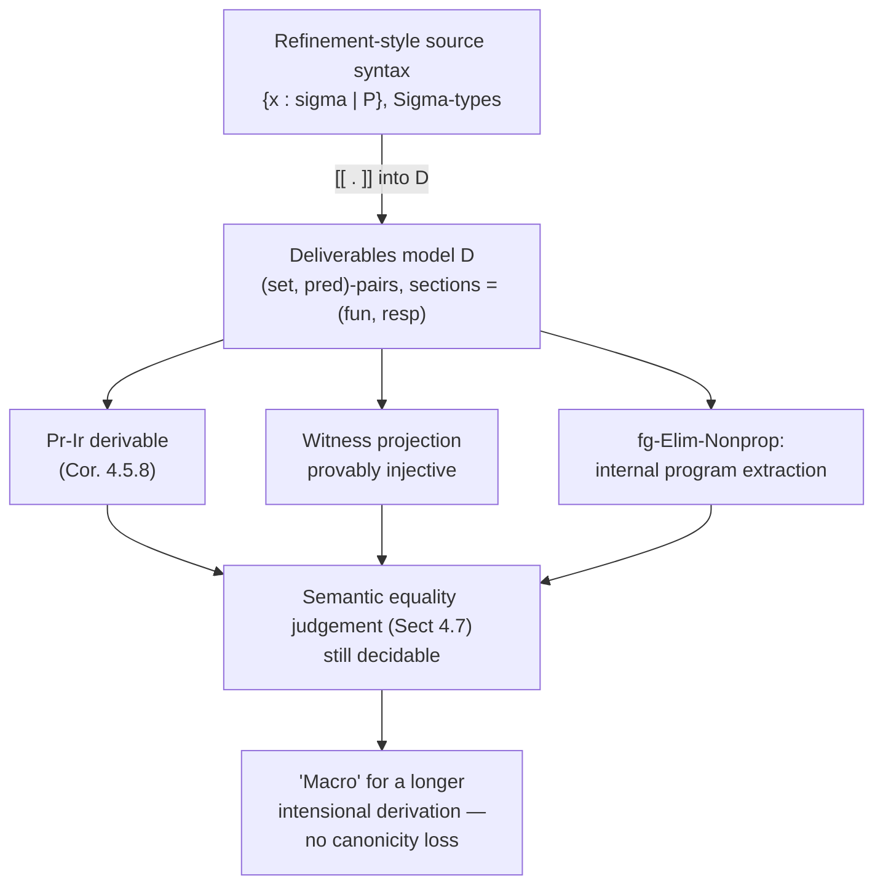

[[book-guidelines|↩ Back to guidelines]]

## Why you need this model at all

Say you want to certify a program in a dependently typed language. You write `Even := {n : ℕ | ∃m. n = 2m}`, and a function `f : Even → Even` type-checks. You feel good about this: it *looks* like the type carries the correctness proof for free. But Hofmann opens Chapter 4 by pointing out two things that quietly undermine that feeling — call them the **refinement problems**.

**Problem 1 — the witness isn't unique.** The projection `Even → ℕ` forgetting the proof is not injective *as a syntactic fact*: two elements of `Even` with the same underlying number can carry different, definitionally-inequal proofs of evenness. If you build `Even` as $\Sigma n{:}\mathbb{N}.\exists m{:}\mathbb{N}.n =_L 2m$, nothing in the raw type theory forces those two elements to be identified. You want them identified — a "verified even number" should just *be* an even number, full stop, not an even number tagged with a distinguishable certificate — but plain $\Sigma$-types don't give you that.

**Problem 2 — the algorithm secretly depends on the proof.** Write `f : Even → Even` as a $\Sigma$-type function. It decomposes into a pair $(f_1, f_2)$ where
$$f_1 : (n{:}\mathbb{N}) \to \mathrm{Prf}(\exists m.\,n =_L 2m) \to \mathbb{N}$$
$$f_2 : \dots \text{(a proof that $f_1$'s output is again even)}$$
Nothing stops $f_1$ from *syntactically* mentioning its proof argument. Even though Hofmann proves (Prop. 4.1.1) that by strong normalization, a closed term of type $\mathbb{N}$ built from a proof-typed free variable is *definitionally* forced to reduce independently of that variable's actual content — computing the numeral `f x` still, in the worst case, requires evaluating the proof component `x.2` before you can push the computation through. You can't "honestly" call the extracted algorithm proof-irrelevant even though it provably is, extensionally.

What breaks without a fix: any certified-programming discipline built on raw $\Sigma$-types either (a) has an unclean identity criterion on refined types, or (b) can't cleanly separate "the algorithm" from "the certificate" at the level of computation, even though the underlying mathematics says that separation is always possible. This is exactly the "checker vs. proof-search" seam you care about for your Rust verifier: you want a representation where extracting the compiled artifact and discarding the proof obligations is a *provably safe, structural* operation, not something you have to argue post hoc by normalization.

## Two existing disciplines, and Hofmann's synthesis

The thesis frames two pre-existing schools of certified programming (§4.1–4.2), then (§4.3 onward) builds a categorical model that unifies them.

1. **The refinement approach.** Specifications and code are freely mixed via $\Sigma$-types (the Ulm school, Martin-Löf / ECC style). Natural, but suffers exactly the two problems above.
2. **The deliverables approach** (McKinna's thesis). A **specification** is kept as a *separate* pair $(\sigma, P)$ — a type $\sigma$ together with a predicate $P : \sigma \to \mathrm{Prop}$. A morphism between specifications $(\sigma, P) \to (\sigma', P')$ is a pair $(f_1, f_2)$: a genuine function $f_1 : \sigma \to \sigma'$, plus a **respect proof** $f_2$ showing $f_1$ carries $P$-satisfying elements to $P'$-satisfying elements. This pair is a **deliverable**: "a program together with its verification," in Hofmann's phrase. Forgetting $f_2$ recovers a proof-free algorithm by construction — there's no proof-dependence to worry away, because $f_1$ was never allowed to see $f_2$'s content in the first place.

The catch: deliverables are heavy bookkeeping. Composing two deliverables means composing $f_1$'s and (separately) composing the two respect-proofs $f_2$. McKinna's fix was to show that specifications-and-deliverables form a *semi-cartesian-closed category* so you at least get composition, abstraction, and application combinators for free — but it stops there; it's a model of the simply typed λ-calculus, not full dependent type theory.

Hofmann's move in Chapter 4 is to push this all the way: organize deliverables into a **full syntactic categorical model of the Calculus of Constructions**, where specifications interpret *types* and deliverables interpret *terms*. This buys three things simultaneously, and the rest of the chapter is essentially cashing each one in:

- Refinement via a $\Sigma$-type over a `Prop`-valued predicate turns out, *in this model*, to leave the underlying algorithmic type completely unchanged — only the predicate component grows. So you can *use the refinement approach as source syntax* and get deliverables-discipline compilation for free.
- The type $\vdash p, q : \mathrm{Prf}(P).\, p =_L q$ becomes inhabited for every proposition $P$ — i.e. **proof irrelevance falls out as a theorem of the model**, not an axiom you bolt on (which, recall from Chapter 1, would destroy N-canonicity if added naively).
- The witness projection out of a subset type becomes **provably injective** — Problem 1, solved.

This is the recurring shape of the whole thesis: don't add an extensional concept as an axiom (which breaks canonicity); instead build a model where the concept is *derivable*, so "using" it just means unfolding a longer intensional derivation.

## The model $\mathcal{D}$: specifications as type–predicate pairs

Concretely, $\mathcal{D}$ is a **syntactic category with attributes** (the abstract model notion from Chapter 2 — contexts + families + sections, all substitution-stable) in which every context, family, and term is literally a *pair*: an ordinary syntactic ingredient (called the **`set`-component**) and a proof-carrying ingredient (the **`pred`-component**). Think of `set` as "the compiled program" and `pred` as "the proof obligation attached to it," kept as separate fields of one bookkeeping structure rather than fused into one term.

**Contexts of specifications** (§4.3.1). A context of specifications is a pair $(\Gamma, \Phi)$ where $\Gamma$ is an ordinary context and $\Phi$ is a **propositional telescope** over $\Gamma$ — a telescope all of whose types have the form $\mathrm{Prf}(M)$. So $\Phi$ literally *is* a sequence of proof obligations layered over $\Gamma$. A morphism (deliverable) $(\Gamma,\Phi) \to (\Gamma',\Phi')$ is a pair $(f,g)$: an ordinary context morphism $f : \Gamma \to \Gamma'$, plus $g$, an element of the telescope $\Phi'[f]$ — i.e. a proof that $f$ respects every predicate in $\Phi'$. These compose component-wise and have identities, so contexts-of-specifications form a category $\mathcal{C}$ with terminal object $\top = (\diamond,\diamond)$.

Notation fixed for the rest of the chapter: $\Gamma_{\mathrm{set}}$ is the underlying type/context, $\Gamma_{\mathrm{pred}}$ the propositional telescope; for a morphism $f$, $f^{\mathrm{fun}}$ is the algorithm part and $f^{\mathrm{resp}}$ the respect-proof part.

**Families of specifications** (§4.3.2). Over $\Gamma$, a family is a pair $(\mathrm{set}, \mathrm{pred})$ with $\Gamma_{\mathrm{set}} \vdash \mathrm{set}$ (an ordinary type) and $\Gamma_{\mathrm{set}}, x{:}\mathrm{set} \vdash \mathrm{pred} : \mathrm{Prop}$ (a predicate on it). Comprehension, substitution, and the projection/pairing morphisms $p(\sigma)$, $q(f,\sigma)$ are all defined **component-wise**: the `set`-side is verbatim the ordinary term model (Example 2.4.2 from Chapter 2); the `pred`-side carries the respect-proofs along. This is the load-bearing design choice of the whole construction — the algorithmic content is *never touched* by anything happening on the proof side.

**Sections of specifications — the deliverables themselves** (§4.3.3). A section of a family $\sigma$ is exactly a deliverable: a pair $(M^{\mathrm{fun}}, M^{\mathrm{resp}})$ with
$$\Gamma_{\mathrm{set}} \vdash M^{\mathrm{fun}} : \sigma_{\mathrm{set}} \qquad \Gamma_{\mathrm{set}}, p{:}\mathrm{pred} \vdash M^{\mathrm{resp}}[p] : \mathrm{Prf}(\sigma_{\mathrm{pred}}[M^{\mathrm{fun}}])$$
Proposition 4.3.1 confirms all of this assembles into a genuine syntactic category with attributes; Hofmann names the whole structure $\mathcal{D}$.

**What "algorithm-plus-respect-proof pairs" buys you, mechanically.** Look at the definition of dependent product in $\mathcal{D}$ (§4.5.1): given families $\sigma \in \mathrm{Fam}(\Gamma)$ and $\tau \in \mathrm{Fam}(\Gamma.\sigma)$,
$$(\Pi\sigma.\tau)_{\mathrm{set}}[\gamma] = \Pi s{:}\sigma_{\mathrm{set}}[\gamma].\,\tau_{\mathrm{set}}[\gamma,s]$$
$$(\Pi\sigma.\tau)_{\mathrm{pred}}[\gamma,f] = \forall s{:}\sigma_{\mathrm{set}}[\gamma].\,\sigma_{\mathrm{pred}}[\gamma,s] \Rightarrow \tau_{\mathrm{pred}}[\gamma,s,(f\,s)]$$
The `set`-component is *exactly* the ordinary function space — no proof machinery anywhere in it. The `pred`-component states, purely propositionally, "this function sends predicate-respecting inputs to predicate-respecting outputs." This is the formal counterpart of your Rust verifier's ideal architecture: a compiled function pointer plus a *separate*, erasable soundness certificate over it, with the function pointer never depending on which certificate accompanies it.

```rust
// A deliverable, spelled out the way §4.3.3 spells it out
struct Deliverable<Fun, RespectProof> {
    fun: Fun,           // the actual compiled algorithm — no proof content
    resp: RespectProof, // proof obligation: fun respects the spec's predicate
}
// A specification: a Rust type plus a (ghost, non-runtime) predicate
struct Spec<T> {
    carrier: std::marker::PhantomData<T>,
    // pred : T -> Prop lives only at the verification level, never compiled
}
```
The `PhantomData` framing is deliberate: in the deliverables model, `pred` genuinely has no run-time trace in `fun`. That's the whole point Problem 2 was about.

### What breaks without keeping `set` and `pred` separate

If you instead fold the predicate into the type via a raw $\Sigma$-type (the refinement style of §4.1), you're back to Problem 2: the compiled representation of a `Sigma { value, proof }` pair *can* have its `value` field's computation route through `proof`, and only a global strong-normalization argument (Prop. 4.1.1) rescues you — a theorem *about* the calculus, not a property *built into* the representation. The deliverables model's component-wise definitions make the separation a structural invariant instead of a derived fact.

## The generic proof type `Prf` and consistency

The centerpiece of the chapter (§4.5.4) is the interpretation of `Prop` itself inside $\mathcal{D}$ — this is where proof irrelevance is actually manufactured, not just described.

Assume for now an **extensional unit type** $1_E$ (governed by $\vdash \star : 1_E$ and, crucially, the rule that *every* term of type $1_E$ is definitionally equal to $\star$ — `Unit-Eq`). Define:
$$\mathrm{Prop}_{\mathrm{set}} = \mathrm{Prop} \qquad \mathrm{Prop}_{\mathrm{pred}}[P{:}\mathrm{Prop}] = \mathrm{tt}$$
$$\mathrm{Prf}_{\mathrm{set}}[P{:}\mathrm{Prop}] = 1_E \qquad \mathrm{Prf}_{\mathrm{pred}}[P{:}\mathrm{Prop}, x{:}1_E] = P$$

Read this carefully — it's the whole trick in two lines. `Prop` itself is interpreted with a trivial predicate (any proposition is "trivially fine" as a piece of data). But `Prf`, the *generic proof-type family*, has `set`-component **always $1_E$, no matter which proposition $P$ you plug in**, while its `pred`-component *is* $P$ itself. So:

- **The `fun`-part of any proof is forced to be $\star$, the unique inhabitant of $1_E$**, definitionally, by `Unit-Eq`. Two proofs of the same proposition are computationally indistinguishable *by construction* — there is nothing left in the `fun`-component for them to differ on.
- **All the actual logical content lives in the `pred`-component**, which is exactly the classical existence-of-a-derivation fact and is never observed by anything downstream that only looks at `fun`.

This is exactly analogous to how a checker with a `Prop`-erased proof term works: the "runtime" value of a proof is a unit, and the only thing that survives compilation is whether the obligation was discharged, not *how*.

Universal quantification $\forall_\sigma(s)$ for $s : \sigma \to \mathrm{Prop}$ is defined with `fun`-component $\forall x{:}\sigma_{\mathrm{set}}.\,\sigma_{\mathrm{pred}}[x] \Rightarrow s[x]$ — the usual guarded universal — plus an evaluation morphism satisfying the expected β/η laws (Prop. 4.5.4: $\mathcal{D}$ is a **loose model** of CoC, in the sense of the "loose vs. strict generic family" distinction from Chapter 2 — natural models rarely satisfy the strict universe axioms literally).

**Consistency (Prop. 4.5.5)** falls out immediately as a sanity check: taking $\mathrm{ff} := \forall_{\mathrm{Prop}}(\mathrm{id}_{\mathrm{Prop}})$ (i.e. "$\forall P.\,P$", the impredicative encoding of falsehood), the family $\mathrm{Prf}\{\mathrm{ff}\}$ has *no sections* — because a section would need a term $\vdash \mathrm{Prf}(\forall p{:}\mathrm{Prop}.\,\mathrm{tt} \Rightarrow p)$, and no such term exists by consistency of the underlying syntax. So the model doesn't just happen to support proof irrelevance vacuously by being inconsistent — the whole point survives a genuine consistency check.

## Proof irrelevance as a *derived* rule, not an axiom

This is the payoff, and it's worth being precise about what's proved (§4.5.5). Hofmann first defines a **semantic Leibniz equality** $\mathrm{LEq}(M,N)$ for sections $M, N$ of any family $\sigma$ (Def. 4.5.6) — the model-level analogue of $\forall P.\,P(M) \Rightarrow P(N)$, built using the just-constructed `Prop`/`Prf` machinery of $\mathcal{D}$ itself (so this is "Leibniz equality one level up," expressed *inside* the model rather than assumed about it).

**Proposition 4.5.7.** For any $A : \Gamma \to \mathrm{Prop}$ and $M, N \in \mathrm{Sect}(\mathrm{Prf}\{A\})$, the type $\mathrm{Sect}(\mathrm{Prf}\{\mathrm{LEq}(M,N)\})$ is nonempty.

*Why:* since $\mathrm{Prf}\{A\}_{\mathrm{set}} = 1_E$, both $M^{\mathrm{fun}}$ and $N^{\mathrm{fun}}$ must be $\star$ — forced, as above. So the semantic Leibniz-equality statement, which only quantifies over predicates on the `set`-component, holds trivially since there's only one `set`-value to distinguish. The witness $\mathrm{PrIr}$ is constructed explicitly and shown stable under substitution.

**Corollary 4.5.8** packages this as a derivable typing rule, not a new axiom added to the syntax:
$$\dfrac{\vdash A : \mathrm{Prop} \qquad \vdash M, N : \mathrm{Prf}(A)}{\vdash \mathrm{PrIr}(A,M,N) : \mathrm{Prf}(M =_L N)}\ \mathrm{Pr\text{-}Ir}$$
This is the mechanism behind Chapter 1's promise that "extensional concepts become macros for longer intensional derivations": `Pr-Ir` isn't postulated — it's *compiled* into a term of the underlying intensional calculus via the semantic interpretation $[\![\,\cdot\,]\!]$ into $\mathcal{D}$. No canonicity-breaking axiom is ever added to the syntax; instead the *interpretation function* manufactures the term.

**One subtlety not to miss**: $M$ and $N$ needn't be *definitionally* equal, only propositionally so via `LEq`. Their `resp`-components (the actual derivations that they satisfy $A$) can genuinely differ — and Hofmann deliberately does *not* quotient them together, because doing so would break the module-signature application of §4.6.2.2 later in the chapter. This is a real design decision, not an oversight: proof irrelevance at the observable (`fun`-component) level, while keeping distinct derivations distinct at the bookkeeping (`resp`-component) level, so that "modules" (kind, type-component pairs) can still be told apart by their differing type-component even when their logical obligations coincide.

**What breaks without this.** If instead you naively add proof irrelevance as an axiom $\vdash \mathrm{PrIr}(A,M,N) : \mathrm{Id}(M,N)$ directly to the intensional syntax (as Chapter 1 warns for `Ext`), the axiom has no reduction behavior — it's an opaque constant — and N-canonicity dies: you get non-canonical closed terms of every type, because a proof-irrelevance-derived equality can be `Subst`-ed into any position. The deliverables construction sidesteps this entirely: `Pr-Ir` never enters the syntax as a primitive; it's a theorem about the *interpretation*, so canonicity of the underlying calculus is untouched.

## Subset types and injectivity of the witness projection

With `Pr-Ir` in hand, Hofmann defines subset types *inside* $\mathcal{D}$ (§4.6), and this is where Problem 1 from the opening gets formally closed off.

**Definition 4.6.1.** For $\sigma \in \mathrm{Fam}(\Gamma)$ and $P : \Gamma.\sigma \to \mathrm{Prop}$:
$$\{\sigma \mid P\}_{\mathrm{set}}[\gamma] = \sigma_{\mathrm{set}}[\gamma] \qquad \{\sigma \mid P\}_{\mathrm{pred}}[\gamma,x] = \sigma_{\mathrm{pred}}[\gamma,x] \wedge P^{\mathrm{fun}}[\gamma,x]$$

Look at the `set`-component: **it's identical to $\sigma$'s own `set`-component.** Refining a type by a predicate changes *only the pred-side of the bookkeeping* — the underlying algorithmic type is untouched. This is precisely the promise from the chapter's opening: refinement-style syntax (mix specs and code via $\{x{:}\sigma \mid P\}$) compiles, under this model, into pure deliverables discipline, because there's no extra `set`-level structure (no extra pairing, no extra projection cost) introduced by adding a predicate.

The associated rules (Prop. 4.6.2):
$$\dfrac{\Gamma \vdash \quad x{:}\sigma \vdash P : \mathrm{Prop}}{\Gamma \vdash \{x{:}\sigma \mid P\}}\ \mathrm{fg\text{-}Form} \qquad
\dfrac{\vdash M : \sigma \quad \vdash H : \mathrm{Prf}(P[M])}{\vdash (M)_H : \{x{:}\sigma\mid P\}}\ \mathrm{fg\text{-}Intro}$$
$$\dfrac{\vdash M : \{x{:}\sigma\mid P\}}{\vdash \mathrm{wit}(M) : \sigma}\ \mathrm{fg\text{-}Wit} \qquad
\dfrac{\vdash M : \{x{:}\sigma\mid P\}}{\vdash \mathrm{cor}(M) : \mathrm{Prf}(P[\mathrm{wit}(M)])}\ \mathrm{fg\text{-}Cor}$$
with `fg-Beta`: $\mathrm{wit}((M)_H) = M$ and $\mathrm{cor}((M)_H) = H$.

**Injectivity of the witness projection.** With $\mathrm{Pr\text{-}Ir}$ available, take $\pi := \lambda u{:}\{x{:}\sigma\mid P\}.\ \mathrm{wit}(u)$. The statement
$$u,v{:}\{x{:}\sigma \mid P\} \vdash \pi(u) =_L \pi(v) \Rightarrow u =_L v$$
is *provable* using $\Sigma$-elimination plus `Pr-Ir`: if the witnesses agree, the two elements can only differ in their correctness proofs, and `Pr-Ir` collapses any such difference propositionally. This is Problem 1, solved — precisely and unconditionally, for every predicate $P$, not just "stable" ones. (Contrast with related work: Martin-Löf's subset interpretation gets injectivity too, but by *definitionally* identifying morphisms with equal first components — which makes equality in that model undecidable. Salvesen–Smith's subset types only get $P[M]$ back for "stable" predicates. Hofmann's route via `Pr-Ir` needs no such restriction and keeps decidability, because equality in $\mathcal{D}$ reduces to decidable equality in the underlying Calculus of Constructions.)

```lean
-- Lean's own subtype is the literal descendant of this construction.
-- `Subtype.val` is exactly `wit`, and `Subtype.ext` (val-equality implies
-- element-equality) is exactly the injectivity result above — except
-- Lean gets it via `Prop`'s built-in proof irrelevance, which is
-- definitional at the *meta* level rather than derived per-model.
structure Subtype' (α : Type) (p : α → Prop) where
  val : α
  property : p val
-- Subtype.ext : s1.val = s2.val → s1 = s2   (uses Prop proof-irrelevance)
```
This is worth dwelling on: Lean's kernel treats `Prop` as definitionally proof-irrelevant *natively* — it doesn't derive it from a model construction, it's baked into `isDefEq`. Hofmann's deliverables model is the historical demonstration that you *can* get the same behavior starting from a calculus with no built-in proof irrelevance at all, purely by choosing the right semantic model. If you're implementing a kernel from scratch, this chapter is effectively the correctness argument for "why is it sound to make `Prop` proof-irrelevant in `isDefEq`" — the deliverables model is a completed soundness proof for exactly that design choice, worked out independently of any specific implementation.

## Internal program extraction

Subset types alone don't yet let you *extract* the compiled algorithm out of a verified function and forget the whole subset-type wrapper — for that Hofmann needs one more device: **non-propositional families** (§4.6.2), families with *no* `pred`-component at all (understood as trivially `tt` — $\mathbb{N}$ and `Prop` are the base cases; closed under $\Pi$/$\Sigma$).

This licenses a **non-standard elimination rule** (Prop. 4.6.6):
$$\dfrac{x{:}\sigma \vdash \tau[x]\ \mathrm{Nprop} \qquad x{:}\sigma \vdash P[x]:\mathrm{Prop} \qquad p{:}\{x{:}\sigma\mid P[x]\} \vdash M[p] : \tau[\mathrm{wit}(p)] \qquad \vdash N : \sigma}{\vdash \mathrm{extend}_{\sigma,P,\tau}(M,N) : \tau[M]}\ \mathrm{fg\text{-}Elim\text{-}Nonprop}$$
Read this as: *any function defined only on the subset* $\{x{:}\sigma \mid P[x]\}$, landing in a non-propositional (proof-irrelevant-target) type $\tau$, automatically extends to a function on the whole of $\sigma$. That's surprising until you notice why: since $\tau$ is non-propositional, $M$'s output can never actually depend on which correctness proof accompanies its input — so you can just feed `extend` a dummy input `N` and the "extension" is well-typed by construction, not by choice-of-default-value hand-waving.

The extraction application (§4.6.2.1) is the concrete payoff:
$$\hat f := \lambda n{:}\mathbb{N}.\ \mathrm{extend}\big([x{:}\mathrm{Even}]\ \mathrm{wit}(f\,x),\ n\big) \;:\; \mathbb{N} \to \mathbb{N}$$
for a verified $f : \mathrm{Even} \to \mathrm{Even}$. `fg-Elim-Nonprop-Comp` then gives $x{:}\mathrm{Even} \vdash \hat f(\mathrm{wit}(x)) = \mathrm{wit}(f\,x) : \mathbb{N}$ — i.e. $\hat f$ **is** the underlying algorithm of $f$, and this equation is a genuine theorem of the type theory, not a meta-level observation about the implementation. This is a fully internal, provable version of what "erase the proofs and keep the code" means informally.

```rust
// The Rust shadow of extend: a function proved only on a refined subtype
// can be "extended" to the base type whenever the codomain carries no
// obligations of its own — because the extension can never actually
// inspect the witness's correctness proof.
fn extend<T, U, P: Fn(&T) -> bool>(
    m: impl Fn(&T) -> U,   // defined "on {x: T | P(x)}" — proof erased at this boundary
    n: T,                  // any T, not necessarily P-satisfying
) -> U {
    m(&n) // sound exactly because U carries no proof obligations to falsify
}
```
This is the formal ancestor of "extract" in Coq/Lean-style extraction pipelines: what you're allowed to erase is governed precisely by which types are non-propositional, and `fg-Elim-Nonprop` is the internal theorem justifying that the erasure is safe rather than just "probably fine because the compiler says so."

§4.6.2.2 pushes the same machinery to model **modules**: a signature like `BIN := {X : Prop | X ⇒ X ⇒ X}` (a type equipped with a binary operation) splits any structure `S : BIN` into a type component `wit(S)` and an implementation component `cor(S)`, with the crucial property — again via `Pr-Ir` — that the *typing* of a functor over signatures can be checked without ever computing on the implementation component. This is a direct precursor of how a dependently typed elaborator separates "what type does this module ascribe to" (pure type-checking) from "what does this module compute" (a later, possibly-erased phase).

## Refinement types versus deliverables: reconciled, not chosen between

Return to the opening tension. Hofmann's closing move (§4.7, echoing the chapter's stated goal) is that the deliverables model doesn't force you to pick a camp:

- **Write in refinement style** — $\{x{:}\sigma \mid P\}$, mixing specs and code freely, the way most working formalizers actually want to program.
- **Get deliverables-style guarantees for free**, because the *interpretation* $[\![\,\cdot\,]\!]$ into $\mathcal{D}$ automatically factors every refined term into an algorithm-part and a respect-proof-part, with proof irrelevance and injective witness-projection as *derived*, checkable properties of that interpretation.

The mechanism that makes this precise is §4.7's **reinterpretation of the equality judgement**: instead of syntactic equality rules, define $\vdash M = N : \sigma$ to mean $[\![M]\!] = [\![N]\!] \in \mathrm{Sect}([\![\sigma]\!])$ (equality in $\mathcal{D}$) — and, because equality in $\mathcal{D}$ reduces component-wise to *decidable* equality in the underlying Calculus of Constructions, this semantically-defined type theory is still fully decidable. Awkward rules like `fg-Elim-Nonprop-Comp`, which look like they need "guessing" a proof to orient as a rewrite rule, become unproblematic special cases of this one semantic equality judgement (`Eq-Term`) rather than ad hoc syntactic additions.



So the two "certified-programming styles" from the chapter's title aren't competitors — refinement types are the *ergonomic front-end syntax*, and deliverables are the *back-end semantic model* that syntax compiles into. That's a pattern worth keeping in mind for your own elaborator design: a surface language doesn't need to match its core calculus's discipline one-to-one, provided you can prove — as Hofmann does here — that the elaboration/interpretation step is sound and, ideally, decidable.

## Where this leads

Chapter 4's central limitation, which Hofmann flags explicitly at the chapter's close, is that $\mathcal{D}$'s families have `set`-components that never genuinely *depend* on proof-relevant structure — type dependency in $\mathcal{D}$ arises only through the ordinary term-model machinery, never through anything proof-carrying. That's exactly the shape of limitation that motivates **Chapter 5's setoid model $S_0$** (Topic 8): types-with-partial-equivalence-relations generalize the deliverables' types-with-predicates, aiming to also recover functional extensionality and quotient types — concepts Chapter 4 deliberately leaves untouched. Indeed §4.8 notes explicitly that $S_0$ inherits the same restriction ($S_0$'s type-component doesn't depend on context either), so understanding *why* $\mathcal{D}$ has this limitation here is a direct prerequisite for understanding what $S_0$, the groupoid model, and $S_1$ are each independently trying to fix.

For your own project: this chapter is the cleanest worked example in the thesis of "prove a language feature sound by constructing a model where it's a theorem, rather than postulating it as an axiom and hoping canonicity survives" — which is exactly the discipline a trusted kernel needs when deciding what belongs in the kernel's primitive judgment forms versus what can be left to elaboration-time macro-expansion into more primitive derivations.
