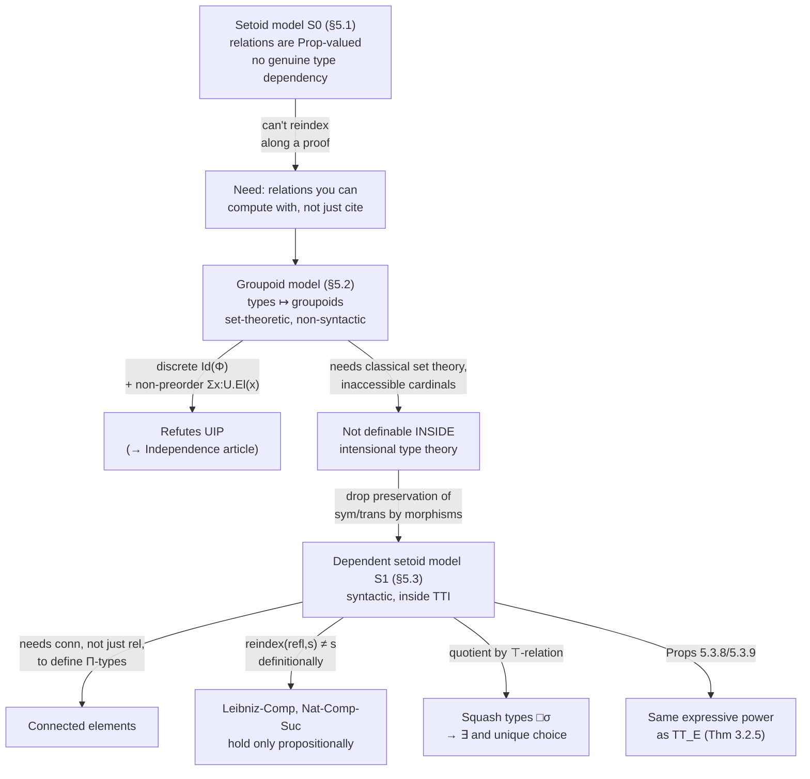

[[book-guidelines|↩ Back to guidelines]]

## Why $S_0$ wasn't the end of the story

[[The-Setoid-Model|The setoid model]] $S_0$ (Ch. 5 §5.1, Topic 8: *The Setoid Model*) interprets a type as a type paired with a proof-irrelevant equivalence relation — a `Prop`-valued `rel`. That gets you functional extensionality, propositional extensionality, and quotient types almost for free. But Hofmann is upfront about what it *can't* do (§5.1.8, and recapped at the top of §5.2): $S_0$ has no genuine type dependency beyond what propositions already give you. Concretely, you cannot build a family of types indexed by the natural numbers, varying by primitive recursion — the kind of thing you'd write in Rust as `fn family(n: usize) -> Type` where the *shape* of the type actually changes with `n`, not just a predicate riding along on top.

**What breaks without it.** In $S_0$, a family over a context $\Gamma$ is a pair (a "set"-part, a "rel"-part), but the set-part of a family over $\Gamma$ is only ever allowed to depend on the *set*-part of $\Gamma$ — never on the proof that two elements of $\Gamma$'s set-part are related. So if you have $\gamma, \gamma' : \Gamma_{\mathrm{set}}$ and a proof $p$ that they're related, there's no way to use $p$ to transport an element of the fiber over $\gamma$ into the fiber over $\gamma'$, because $p$ lives in `Prop` and `Prop` is proof-irrelevant by construction — you're not allowed to compute with *which* proof you got. Real dependent types need exactly that: a function

$$
\Gamma_{\mathrm{set}} \ni \gamma,\, \Gamma_{\mathrm{set}} \ni \gamma',\, p : \Gamma_{\mathrm{rel}}(\gamma,\gamma') \;\vdash\; \mathrm{reindex}[p, x] : \mathrm{set}[\gamma']
$$

that genuinely *uses* $p$ as data, not just as a certificate. And the instant a proof of relatedness is used computationally like that, it can no longer be a bare proposition — two different proofs $p, p' : \Gamma_{\mathrm{rel}}(\gamma,\gamma')$ might reindex differently, so `rel` itself has to become a proper *type*, not a `Prop`. That single move — relations become proof-relevant types you can pattern-match and compute with — is the entire idea of this chapter, and it's what turns "setoids" into **groupoids**.

Hofmann builds two models on this idea. The **groupoid model** (§5.2) does it cleanly, using genuine (classical, extensional) set theory as the metatheory — it's the "correct" definition, but it can't be formalized as a syntactic construction *inside* intensional type theory itself. The **dependent setoid model $S_1$** (§5.3) is the compromise: a version that *is* definable inside intensional type theory, at the cost of losing some definitional equalities (they become merely propositional).

## Constituent idea 1: Groupoids as coherent equality structures

**Definition 5.2.1** (p. 188): *a groupoid is a small category in which all morphisms are isomorphisms.*

Unpacked without the category-theory shorthand, a groupoid $X$ is:

- a set $X_{\mathrm{set}}$ of "objects" (elements of the type),
- for every $x, y \in X_{\mathrm{set}}$, a *set* (not a proposition!) $X_{\mathrm{rel}}(x,y)$ of "morphisms" — think of these as the proofs that $x$ and $y$ are equal, except now there can be more than one, and *which one you have matters*,
- operations $\mathrm{refl}$, $\mathrm{sym}$, $\mathrm{trans}$ witnessing that this proof-relevant relation behaves like an equivalence relation,
- and — this is the part that makes it a *groupoid* rather than just "a graph with some operations" — equations forcing those operations to behave coherently:

$$
\mathrm{trans}(p,\mathrm{trans}(q,r)) = \mathrm{trans}(\mathrm{trans}(p,q),r), \qquad
\mathrm{trans}(p,\mathrm{refl}) = p = \mathrm{trans}(\mathrm{refl},p),
$$
$$
\mathrm{trans}(p,\mathrm{sym}(p)) = \mathrm{refl}, \qquad \mathrm{trans}(\mathrm{sym}(p),p) = \mathrm{refl}.
$$

These are exactly the group-inverse laws, fiber-wise: composition is associative, `refl` is a two-sided unit, and every morphism has a genuine two-sided inverse. That last property — *every* morphism is invertible — is what distinguishes a groupoid from an arbitrary category, and it's the formal expression of "equality proofs should be reversible and composable," which is intuitively obvious for equality but, as we'll see in a moment, is *not* automatically "there's only one such proof."

**Examples the book gives (p. 188–189), and why each matters:**

1. **The discrete groupoid** $r(X)$ on a set $X$: $r(X)_{\mathrm{rel}}(x,y) = \{\star\}$ if $x = y$, empty otherwise. This is the groupoid where "being equal" has *at most one* proof — the classical, proof-irrelevant notion of equality, now recast as a degenerate special case rather than the default.
2. **$G \cdot X$**, a set $X$ acted on by a group $G$: $(G \cdot X)_{\mathrm{rel}}(x,y) = G$ if $x = y$, empty otherwise. Here self-equalities have as many proofs as $G$ has elements — this is the shape of the counterexample used later to refute uniqueness of identity ([[Independence-Of-Uniqueness-Of-Identity-Proofs|see that topic for the full argument]]).
3. **Topological spaces**: points as objects, paths-up-to-homotopy as morphisms. Two points are "propositionally equal" iff there's a path between them; two paths are themselves equal iff one continuously deforms into the other. This is the intuition Hofmann leans on throughout — and it is, in hindsight, exactly the intuition that Homotopy Type Theory would later formalize as "types are $\infty$-groupoids," a decade after this thesis.
4. **The syntactic groupoid $G(\sigma)$ induced by any type $\sigma$ of intensional type theory**: objects are terms $M : \sigma$, and $G(\sigma)_{\mathrm{rel}}(M,N)$ is the set of proofs $P : \mathrm{Id}_\sigma(M,N)$, *quotiented by propositional equality of proofs*. This is the bridge from the model back to the syntax: $J$/`Refl`/`Trans`/`Sym` from Chapters 2–3 give exactly the groupoid structure on `Id`, and proving the groupoid laws for $G(\sigma)$ is "a nice application of $J$" (p. 189) — nothing new is invented, it's the same elimination rule you already have, just read categorically.

**What breaks without the coherence equations.** Hofmann flags this explicitly (Remark 5.2.2, p. 189): you *can* write down the definition of a groupoid inside intensional type theory itself, using `type` in place of `set`. But almost no groupoids satisfy the equations *definitionally* — and as we'll see in §5.2.1's construction of the exponential (function groupoid), the construction that makes groupoids closed under function types is fundamentally a *classical set-theoretic* one, with no way to restrict the type-theoretic function space so that only "refl/trans-preserving" functions are included. This single obstruction is the reason the thesis needs *two* models (groupoid, then $S_1$) instead of one.

**Rust grounding.** A groupoid is naturally a trait with an associated "morphism" type and law-obligations you'd normally only get to assert in a comment (Rust has no propositional-equality proof obligations at the type level, so the laws below are documentation, not enforced — this is exactly the gap a real proof-carrying kernel has to close):

```rust
trait Groupoid {
    type Obj;
    // Hom(x, y) is a genuine *type* of evidence, not a bool.
    type Hom<const X: usize, const Y: usize>; // illustrative; real code would use a
                                               // dependent-type-shaped encoding, e.g. an index family

    fn refl(x: &Self::Obj) -> Self::Hom</* x, x */ 0, 0>;
    fn sym(p: /* Hom(x, y) */ ()) -> /* Hom(y, x) */ ();
    fn trans(p: /* Hom(x, y) */ (), q: /* Hom(y, z) */ ()) -> /* Hom(x, z) */ ();

    // Laws (not checkable by rustc without a real dependently-typed encoding —
    // this is precisely the gap a Rust-hosted proof kernel has to close):
    //   trans(p, trans(q, r)) == trans(trans(p, q), r)
    //   trans(p, refl)        == p == trans(refl, p)
    //   trans(p, sym(p))      == refl
    //   trans(sym(p), p)      == refl
}
```

**Lean grounding.** Lean's own `Eq` is (by design, via `Eq.rec`/K) the *discrete* groupoid — every `Hom(x,y)` is at most a singleton, so `Eq` alone can never witness case 2 above. What Hofmann's groupoid *does* correspond to, faithfully, is `Iso` / `Equiv` reasoning — or, closer still, a genuine `CategoryTheory.Groupoid` in Mathlib, whose `Hom`-sets are proper types with `id`, `comp`, and inverses, exactly mirroring `refl`/`trans`/`sym` and their coherence laws. The move from `Eq` (discrete) to `Groupoid.Hom` (proof-relevant) is, structurally, the exact move this section makes.

## Constituent idea 2: Families of groupoids and reindexing along proofs of relatedness

A single groupoid gives you a non-dependent type. To get dependent types you need a **family of groupoids indexed over a groupoid** (Def. 5.2.5, p. 195): a groupoid $\Phi(\gamma)$ for every $\gamma \in \Gamma_{\mathrm{set}}$, compatible across the base groupoid via

$$
\mathrm{reindex} \;\in\; \prod_{\gamma,\gamma' \in \Gamma_{\mathrm{set}}} \Gamma_{\mathrm{rel}}(\gamma,\gamma') \to \Phi(\gamma)_{\mathrm{set}} \to \Phi(\gamma')_{\mathrm{set}}
$$

together with a `resp` component saying `reindex` also respects the fiberwise relation, and — crucially — both must themselves respect the groupoid structure of the base:

$$
\mathrm{reindex}(\mathrm{refl}, u) = u, \qquad \mathrm{reindex}(p \cdot q, u) = \mathrm{reindex}(p, \mathrm{reindex}(q, u)).
$$

This is **reindexing along a proof of relatedness**, the thing $S_0$ structurally could not have: given a proof $p$ that $\gamma$ and $\gamma'$ are related, `reindex` *computes* an element of the $\gamma'$-fiber from an element of the $\gamma$-fiber, using $p$ as genuine input, not just as a side-condition. `reindex(refl, u) = u` says transporting along the "trivial" proof does nothing; `reindex(p·q, u) = reindex(p, reindex(q, u))` says transporting along a composite proof is the same as transporting twice — functoriality, spelled out.

The book immediately builds the machinery this needs to be a real categorical model:

- **Comprehension** $\Gamma \cdot \Phi$ (§5.2.1.1, p. 191): objects are dependent pairs $(\gamma, u)$; morphisms from $(\gamma,u)$ to $(\gamma',v)$ are pairs $(p,q)$ with $p \in \Gamma_{\mathrm{rel}}(\gamma,\gamma')$ and $q \in \Phi(\gamma')_{\mathrm{rel}}(p \cdot u, v)$ — you first reindex $u$ along $p$, *then* ask for a morphism to $v$ in the target fiber. This is literally the Grothendieck construction from category theory, appearing here because it's exactly what "comprehension" (turning a family into a context) has to mean once fibers are groupoids rather than sets.
- **Exponentials** (Prop. 5.2.4, p. 190–191): groupoids and their morphisms form a **cartesian closed category** — $(X \Rightarrow Y)_{\mathrm{set}}$ is the set of groupoid morphisms $X \to Y$, and $(X \Rightarrow Y)_{\mathrm{rel}}(f,g)$ is the set of *natural transformations* from $f$ to $g$. Function extensionality is baked in structurally here: two functors are "propositionally equal" iff there's a natural transformation between them, which is precisely functional extensionality's semantic content, arrived at with no separate axiom.
- **Dependent product** (§5.2.2.2, p. 199): the trickiest reindexing computation in the chapter. For $p \in \Gamma_{\mathrm{rel}}(\gamma,\gamma')$ and a section $M$ over $\gamma$, you define $(p \cdot M)(s) := (p,\ast) \cdot M(p^{-1} \cdot s)$ — reindex the *argument* backward along $p^{-1}$, apply $M$, then reindex the *result* forward. This inverse-sandwich pattern is the standard shape of "transport a function along an isomorphism": conjugate by the isomorphism on both sides. It's the same trick you'd use in Rust to adapt a `Fn(A) -> B` into a `Fn(A') -> B'` given isomorphisms `A ≅ A'` and `B ≅ B'`.

**Rust grounding — the "reindex" operation as a trait method.** This is precisely the shape of a coercion parametrized by *evidence*, not by a boolean flag:

```rust
trait Family {
    type Base;                       // Γ
    type Fiber<const G: usize>;      // Φ(γ)  — indexed by (a stand-in for) γ
    type Rel;                        // proof-relevant relatedness evidence, e.g. a path/witness type

    // The load-bearing operation: computes a new fiber element FROM the proof `p`,
    // not just gated behind it.
    fn reindex<const G: usize, const G2: usize>(
        p: Self::Rel,
        x: Self::Fiber<G>,
    ) -> Self::Fiber<G2>;

    // Functor laws reindex must satisfy:
    //   reindex(refl, x) == x
    //   reindex(compose(p, q), x) == reindex(p, reindex(q, x))
}
```

If you're designing the elaborator from the standing project's learning goals: this `reindex` is exactly what your kernel's `Subst`/rewrite routine has to implement once you allow proof-relevant equality evidence to matter (e.g. once type-level indices carry non-trivial automorphisms, as with the $\mathbb{Z}_2$ example in the sibling article). A checker that erases *which* proof it used and only tracks *that* a proof exists is implicitly assuming everything is a discrete groupoid — fine until it isn't.

## Constituent idea 3: The identity groupoid

The identity type itself is modeled as a specific, very simple family: the **identity groupoid** (§5.2.2.3, p. 200). Given a family $\Phi$ over $\Gamma$, form the context $\Gamma \cdot \Phi \cdot \Phi^+$ (Hofmann's shorthand for $\Gamma$ extended with two independent copies $s, s'$ of $\Phi$), and define, over that context,

$$
\mathrm{Id}(\Phi)(\gamma,s,s') := r\big(\Phi_{\mathrm{rel}}(\gamma,s,s')\big)
$$

— the **discrete** groupoid on the fiberwise relation. Concretely: an element of $\mathrm{Id}(\Phi)$ at $(\gamma,s,s')$ *is* a proof that $s$ and $s'$ are related, and two such proofs are related in $\mathrm{Id}(\Phi)$ **only if they're literally the same proof** (that's what "discrete" buys you). This is the formal expression of the topological-space intuition from earlier: two points of a space count as propositionally equal exactly when a path links them, and — because $\mathrm{Id}$ is built as the *discrete* groupoid on top of $\Phi_{\mathrm{rel}}$, not $\Phi_{\mathrm{rel}}$ itself — two proofs-of-equality-of-points (i.e. two paths) are propositionally equal only when they're the *same* path, definitionally.

The payoff stated on p. 200: *"propositional and definitional equality on identity types coincide in the groupoid model."* That's a clean, checkable sanity condition for the model — `Id` doesn't accidentally identify things `refl` shouldn't — and it's what lets $\mathrm{Re}_\sigma$ (reflexivity introduction) and $J$ (identity elimination) be defined by direct case analysis on the discrete structure (pp. 200–201), giving **Proposition 5.2.7**: the groupoid model supports intensional identity types, full stop — no compromises here, unlike $S_1$ below.

This is also the model in which uniqueness of identity provably *fails* — because the fibers of $\mathrm{Id}(\Phi)$ being discrete only forces the interpretations of types *built purely from* $N$, $\Sigma$, $\Pi$, $\mathrm{Id}$ to be preorders (in fact discrete); it says nothing about a type like $\Sigma x{:}U.\mathrm{El}(x)$, whose interpretation can and does have non-trivial automorphisms. That argument — and the related "propositional equality as isomorphism" extension it enables — is developed in full in [[Independence-Of-Uniqueness-Of-Identity-Proofs]]; this article won't re-derive it, but it's worth naming the load-bearing fact here: **the identity groupoid's discreteness is exactly the property whose failure at other types produces the UIP counterexample.** The mechanism (discreteness) lives in this topic; the exploitation of its limits lives in that one.

## Constituent idea 4: From groupoids to a syntactic model — connected elements in $S_1$

The groupoid model is mathematically clean but relies on classical set theory (an inaccessible cardinal, to interpret universes — §5.2.2.6) and cannot be presented as a syntactic construction *inside* intensional type theory. Section 5.3 asks: can you get most of the same power while staying syntactic?

**The obstruction, stated precisely (p. 217–218).** The reason the groupoid model needs full classical set theory is that context morphisms are required to preserve *symmetry and transitivity*, and once you have dependent products (function types), you cannot guarantee this preservation syntactically — Hofmann gives an explicit contrived counterexample type former `B` that fails stability under substitution unless `f.resp` happens to preserve a derived `sym`-based operation, which isn't guaranteed in general. So the fix is drastic: **drop the requirement that context morphisms preserve symmetry and transitivity altogether.** Only **reflexivity** preservation is kept — via a "trick" (§5.3.1.2) where sections automatically preserve reflexivity for free, just from the shape of their definition, with no extra proof obligation needed.

This has an immediate consequence for how relations on *families* have to be built: since `rel` on contexts is no longer guaranteed symmetric/transitive, you can't just say "reindex along a proof that $\gamma, \gamma'$ are related" — you need something stronger. Enter **connected elements**:

$$
\mathrm{conn}[\gamma_1, \ldots, \gamma_n] := \big(\Gamma_{\mathrm{rel}}[\gamma_i,\gamma_j]\big)_{i \neq j}
$$

— the context asserting that *all pairs* among $\gamma_1,\ldots,\gamma_n$ are related, in *both* directions (§5.3.1, p. 208). A family of setoids' `reindex` is then typed against `conn`, not bare `rel`:

$$
\gamma,\gamma' : \Gamma_{\mathrm{set}},\; p : \mathrm{conn}[\gamma,\gamma'],\; s : \Phi_{\mathrm{set}}[\gamma] \;\vdash\; \mathrm{reindex}[p,s,\bar{s}] : \Phi_{\mathrm{set}}[\gamma']
$$

(the reflexivity witness $\bar s : \Phi_{\mathrm{rel}}[s,s]$ tags along too, for the same "trick" reason).

**Why `conn` and not plain `rel` — the concrete failure it prevents.** §5.3.2's construction of the dependent product ($\Pi$-type) shows exactly where this bites. To prove transitivity for the function-family's relation — given $f$ related to $f'$ (at index $\gamma$ vs $\gamma'$) and $f'$ related to $f''$ (at $\gamma'$ vs $\gamma''$) — you need to combine two relatedness proofs whose "midpoint" argument is only *related* to the two endpoints, using `reindex` to move an argument from the $\gamma$-fiber into the $\gamma'$-fiber before you can even invoke transitivity of the target relation. That reindexing step needs $\gamma$ and $\gamma'$ to be **connected**, not just related in one specific direction — plain one-way `rel` isn't enough data to guarantee the midpoint exists where you need it. Hofmann states the conclusion directly: *"with a more general definition of transitivity that does not include the restriction to connected elements of the context it would not have been possible to define the $\Pi$-type"* (p. 211). This is a case where a seemingly bureaucratic-looking side condition (`conn` instead of `rel`) is load-bearing for the single most important type former in the whole system.

**Rust/Lean framing.** If you're designing a Rust proof kernel's context-relatedness machinery, this is the cautionary tale for "symmetric closure by convention": don't assume a one-directional relatedness witness gives you what you need to reindex in both directions when composing functions across related contexts — you may need to require (or separately derive and carry) the two-way witness explicitly, exactly as `conn` does here, rather than discovering the gap only when $\Pi$-types don't type-check.

## Constituent idea 5: Computation rules holding only propositionally

The price for making $S_1$ syntactic is that **reindexing along reflexivity need not be the identity function**: `reindex[refl(γ), s, s̄] = s` is *not* required to hold definitionally in $S_1$ — only propositionally (p. 217–218). This single gap cascades into several computation rules that the plain syntax expects to hold *definitionally*, but that $S_1$ can only validate up to a propositional witness.

**Concrete instance 1 — `Leibniz-Comp` (identity elimination, §5.3.3.2, p. 214).** The eliminator `Subst` for $S_1$'s identity type is defined using `reindex`:

$$
\mathrm{Subst}_\Phi(P,N)_{\mathrm{el}}[\gamma] = \Phi_{\mathrm{reindex}}\big[(\overline{\gamma}, P_{\mathrm{el}}[\gamma]),\, (\overline{\gamma}, \mathrm{sym}[\ldots]),\, N_{\mathrm{el}}[\gamma],\, N_{\mathrm{resp}}[\overline{\gamma}]\big]
$$

Because `reindex` at reflexivity isn't literally the identity, `Subst` applied to a `refl`-shaped proof does not definitionally reduce back to its input — the rule `Leibniz-Comp` (the syntactic analogue of "`Subst(refl, N) = N`") only holds up to a propositional witness, which the model *does* supply — it's inhabited, just not by `refl` on the nose. Hofmann's own words: *"this eliminator does not satisfy the rule Leibniz-Comp. The reason for this is that $\Phi_{\mathrm{reindex}}$ applied to a proof by reflexivity is not necessarily the identity function. However, by virtue of $\Phi_{\mathrm{ax}}$ the propositional companion to Leibniz-Comp is inhabited in the model"* (p. 214).

**Concrete instance 2 — `Nat-Comp-Suc` (§5.3.4, p. 215–216).** Interpreting the natural numbers in $S_1$ requires the type family to depend not just on the numeral `n` but also on a reflexivity-style proof `n̄ : Id_N(n,n)` — because comprehension for a context of setoids always tags a reflexivity witness alongside every element (§5.3.1.1). The successor case of the recursor `R_N` then has to invoke `Subst`/`IdUni` to line up a proof about `Suc(n)` obtained from `Refl_N(n)` with the proof it's actually asked for — and because that alignment is only propositional (instance 1's gap, propagated), the two sides of `Nat-Comp-Suc` genuinely differ at the level of the `el`-component, not merely up to some unobserved bookkeeping. Hofmann is explicit that the two sides "do not even hold for the el-parts" — they can be proved propositionally equal by induction in the target theory, so a *propositional* version of `Nat-Comp-Suc` survives, but the definitional one is gone (p. 216).

**Concrete instance 3 — the second $\Sigma$-projection (§5.3.4.1, p. 216).** The obvious $\Sigma$-type in $S_1$ supports pairing and the *first* projection strictly, giving you the **weak** $\Sigma$-elimination rule — but $(M,N).2 = N$ definitionally is out of reach for the same reindexing reason; only a propositional counterpart is interpretable.

**Why this is still worth having, not a defeat.** Losing definitional computation rules sounds like exactly the disaster Chapter 1 warns against (recall: adding `Ext` as a bare axiom wrecks N-canonicity). But $S_1$ doesn't lose canonicity — **Proposition 5.3.10** proves N-canonicity holds (every closed natural number reduces to a numeral) and **Proposition 5.3.11** proves consistency, exactly as required. What's lost is narrower and controlled: specific computation rules become propositional rather than definitional, which the thesis treats the same way it treats `Ext`/`IdUni` throughout — as constants with a governing *propositional* equation, not a silent axiom with no reduction behavior at all. And in exchange, $S_1$ gets **Proposition 5.3.8** (uniqueness of identity, *definable*, not just consistent to add) and **Proposition 5.3.9** (functional extensionality) — both syntactically, inside intensional type theory, which the groupoid model could never offer (it isn't syntactic at all) and $S_0$ could never offer (it isn't dependent enough to even state the interesting cases). Hofmann's own summary (p. 218): thanks to the conservativity theorem (Thm 3.2.5) $S_1$ ends up with "the same expressive power as $\mathrm{TT}_E$" — full extensional type theory — despite type-checking in $S_1$'s host theory remaining decidable.

**Lean grounding — why this should feel familiar.** This is structurally the same tradeoff Lean's own kernel makes at the boundary between `rfl`-reducible definitional equality and `Eq.mpr`/`▸`-mediated propositional rewriting: some equations you'd like to hold "on the nose" (definitionally) only hold up to a proof, and `simp`/`rfl` will fail on them even though `Eq.mpr (proof) x` type-checks. $S_1$'s propositional-only `Nat-Comp-Suc` is the thesis's own instance of exactly that gap, arising from a deliberate, well-understood structural cause (reindex-at-refl not being the identity) rather than an accident of tactic implementation.

## Constituent idea 6: Squash types and unique choice

$S_1$'s general [[Intensional-Quotient-Types|intensional quotient types]] (the syntax from §3.2.6.1) are *conjectured* definable but "too complicated to verify even with machine support" (p. 220). Rather than leave quotients entirely unaddressed, Hofmann constructs one clean, fully-checked special case: the **squash type** — the quotient of a type by the *everywhere-true* relation (Proposition 5.3.12, p. 220–221):

$$
\dfrac{\vdash \sigma}{\vdash \Box\sigma}\ \Box\text{-Form} \qquad
\dfrac{\vdash M : \sigma}{\vdash \Box M : \Box\sigma}\ \Box\text{-Intro} \qquad
\dfrac{\vdash M, N : \Box\sigma}{\vdash \Box_{\mathrm{ax}}(M,N) : \mathrm{Id}_{\Box\sigma}(M,N)}\ \Box\text{-Ax}
$$

$\Box\text{-Form}/\Box\text{-Intro}$ say $\Box\sigma$ has the same inhabitants as $\sigma$, and $\Box\text{-Ax}$ is the entire point: **any two elements of $\Box\sigma$ are propositionally equal**, no matter how many distinct elements $\sigma$ itself has. $\Box\sigma$ is $\sigma$ with all its distinctions crushed — a **subsingleton** (at most one element up to propositional equality). The elimination rule (§5.3.5) lets you extract from $\Box\sigma$ into a target type $\tau$ *only if* $\tau$ is itself already single-valued (any two of its elements are propositionally equal) — this restriction is unavoidable and structurally forced, for the same reindexing reason as the earlier propositional-only computation rules: `reindex` applied to `refl` isn't the identity, so `Box-Eq` (the elimination's computation rule) can also only be validated propositionally, not definitionally (p. 221, spelled out explicitly as parallel to the `Id-Comp` situation).

**Existential quantification as squashed $\Sigma$.** With squash in hand, Hofmann defines

$$
\exists x{:}\sigma.\,\Phi[x] \;:=\; \Box\big(\Sigma x{:}\sigma.\,\Phi[x]\big)
$$

— exactly Lean/Coq's own move of putting `Exists` in `Prop` while `Sigma` stays proof-relevant: you get a genuine witness *inside* the proof of $\exists$, but you're forbidden from projecting it back out except into another subsingleton type. The usual intuitionistic introduction/elimination rules for $\exists$ hold, with that single restriction on the elimination target.

**Unique choice.** This is the payoff the section is really building toward. For any type $\sigma$,

$$
\big(\exists x{:}\sigma.\, 1\big) \times \big(\forall x, x'{:}\sigma.\, \mathrm{Id}_\sigma(x,x')\big) \;\to\; \sigma
$$

is inhabited — read: *if $\sigma$ is inhabited and has at most one element up to propositional equality, you can recover an actual element of $\sigma$ from the mere existence-proof.* This is exactly the **unique choice** ($\mathrm{AC}^!$) principle discussed elsewhere in the thesis (§5.1.4.2, §6.5.2) as something that generally *fails* in $S_0$/topos-style models with functional-relation morphisms — but here it's *derivable*, not axiomatized, precisely because $\Box(\sigma)$'s elimination rule was deliberately built to only extract into subsingleton targets, and $\sigma$-with-at-most-one-element-up-to-$\mathrm{Id}$ is exactly the subsingleton case the restriction was designed to permit. The book also conjectures (without full proof, p. 221) that "countable choice" and "dependent choice" survive in the same $\exists$-based form.

**Why unique choice is safe here but dangerous in general.** The general axiom of choice, stated with existential quantification, lets you manufacture a *function* out of a mere *proof* that one exists — which is exactly the "blurring [of] the distinction between proofs and datatypes" the thesis worries about in $S_0$ (§5.4, p. 224, discussing why functional-relation-style morphisms were deliberately avoided). Squash-mediated unique choice sidesteps the danger because it only ever recovers an element when uniqueness has *already* collapsed $\sigma$ to at most one point — you're not choosing between alternatives, there's nothing left to choose from. This is the same reasoning behind Lean's own `Classical.choice`-free `Subsingleton.elim`-style reasoning, and behind treating `Squash α` (Lean's own primitive, directly descended from exactly this construction) as safe to eliminate into other subsingletons but not into arbitrary `Type`.

## Synthesis: where this sits in the thesis



The groupoid model's job in the thesis is almost entirely *diagnostic*: it exists to prove the negative result that $J$ alone can't derive uniqueness of identity (Thm 5.2.8), which is the mechanism [[Independence-Of-Uniqueness-Of-Identity-Proofs]] covers in depth. But it also hands $S_1$ its blueprint — connected elements, reindexing, the identity-groupoid-style treatment of `Id` — reworked to survive inside a syntactic, intensional host theory. $S_1$ is the model Chapter 6's applications (category theory in type theory, coproduct encodings) actually build on when they need both uniqueness of identity *and* functional extensionality simultaneously, at the acknowledged cost of a few definitional equalities becoming propositional.

**For the compiler/elaborator project:** the `conn`/`reindex` machinery here is the closest thing in this thesis to a worked design study for a proof-relevant substitution/rewrite engine — it's a concrete example of a kernel operation (`reindex`) that has to consume evidence as data, has functor-law obligations (`reindex(refl,x)=x`, `reindex(p·q,x)=reindex(p,reindex(q,x))`) that your `Subst`/`isDefEq` routine would need to satisfy or explicitly weaken, and a documented, load-bearing case (the $\Pi$-type transitivity proof) where a one-directional relatedness witness is provably insufficient and a symmetric `conn`-style witness is required instead. The squash-type construction is the cleanest source in the whole thesis for "how do I recover unique-choice-flavored reasoning without reintroducing full, dangerous choice" — directly relevant if your CSP/abstract-interpretation kernel ever needs to extract a canonical witness from a "this invariant has a unique fixed point" proof rather than an arbitrary one.
