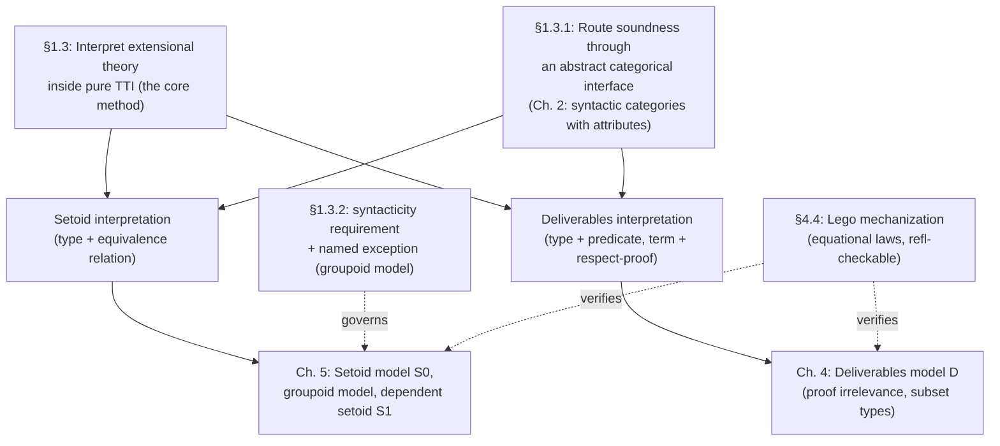

[[book-guidelines|↩ Back to guidelines]]

## The problem: extensional concepts wreck canonicity if you just bolt them on

By the time §1.3 opens, the thesis has already made its case (§1.2, see [[Definitional-Versus-Propositional-Equality]] and [[The-Six-Extensional-Concepts]]) that six "extensional concepts" — functional extensionality, uniqueness of identity proofs, proof irrelevance, subset types, propositional extensionality, quotient types — are genuinely needed for real formalized mathematics, but are not derivable in plain intensional type theory ($\mathrm{TT_I}$). The obvious fix is to just add them as new axioms/constants. For functional extensionality that would mean a family of constants

$$\mathrm{Ext}_{f,g:\Pi x{:}\sigma.\tau} : \left(\prod_{x:\sigma}\mathrm{Id}_\tau(fx,gx)\right) \to \mathrm{Id}_{\Pi x:\sigma.\tau}(f,g)$$

and this *works*, in the weak sense that it makes the desired propositions provable. But it breaks something the thesis treats as non-negotiable: **N-canonicity** (Def. 2.1.9) — the property that every closed term of type $\mathbb{N}$ reduces, by pure computation, to a numeral $\mathrm{Suc}(\cdots\mathrm{Suc}(0)\cdots)$. A term built using $\mathrm{Ext}$ can sit at type $\mathbb{N}$ in the empty context and simply never reduce to a numeral, because there is no reduction rule telling the kernel what $\mathrm{Ext}$ *computes to* — it's an opaque axiom, not a program. (The footnote is explicit that $\mathbb{N}$ is arbitrary here: a non-canonical element anywhere induces one at $\mathbb{N}$ via a suitable encoding, so this isn't a quirk of natural numbers specifically — it's a statement about the whole kernel's computational discipline.)

**What breaks concretely, in kernel terms:** N-canonicity is exactly the property a type-checker needs to guarantee that "closed, well-typed, first-order data" behaves like data — that if your elaborator hands back a `Nat`-typed closed term, you can actually run it and get a numeral out, rather than getting stuck on an inert axiom application. Losing N-canonicity is losing the thing that makes a kernel a *computation* engine and not just a *proof* checker. This is the stake §1.3 is playing for.

There is exactly one documented exception: **uniqueness of identity proofs (UIP)** can be added axiomatically *and* be given a genuine reduction rule (Streicher's observation) — $\mathrm{IdUni}_\sigma(M,\mathrm{Refl}(M))$ reduces to $\mathrm{Refl}(\mathrm{Refl}(M))$ — so no non-canonical elements arise from it. UIP is the odd one out precisely because its natural axiomatization already comes with computational content; the other five concepts don't, and that's exactly the gap the method of syntactic models is built to close.

## The core method: interpret the extensional theory *inside* the plain one

The strategy (§1.3, opening paragraph) is not to add rules to the syntax at all. Instead: **define a translation $[\![-]\!]$ from the extensional theory into pure $\mathrm{TT_I}$**, such that a type or term with an extensional concept in it gets mapped to a genuinely intensional type or term — one built entirely from $\Pi$, $\mathbb{N}$, $\mathrm{Id}$, and ordinary derivations. Two objects of the extensional theory are then declared definitionally equal *exactly when their interpretations are definitionally equal in $\mathrm{TT_I}$*. Since the interpretations live in a kernel with intact N-canonicity, this definition automatically inherits N-canonicity for the extended theory — there is no separate proof needed, because "equal" was *defined* to mean "interpretations are equal," and interpretations already live somewhere N-canonicity holds.

This is the single idea the whole method rests on, so it is worth stating as an equation-shaped slogan: extensional concepts don't get new *reduction rules*; they get **erased into ordinary $\mathrm{TT_I}$ derivations by translation**, and using them just means writing a longer intensional term than you'd otherwise have had to write by hand.

The thesis names two concrete translations by the vocabulary they use to package the interpreted objects:

### The setoid interpretation

For functional extensionality and quotient types, every type $\sigma$ is translated into a **type-with-an-internal-equivalence-relation**: a pair $(\sigma_{\mathrm{set}}, \sigma_{\mathrm{rel}})$, and propositional equality *at* $\sigma$ is reinterpreted as membership in $\sigma_{\mathrm{rel}}$ rather than as the raw identity type on $\sigma_{\mathrm{set}}$. The name comes from Bishop's constructive-mathematics convention of defining a set by simultaneously specifying its members *and* its equality relation — you don't get to ask "are these two elements equal?" independent of the set's own notion of equality, the way naive set theory implicitly assumes. Working inside the setoid interpretation, per the thesis's own framing, "can be viewed as using a high-level language for working with equivalence relations instead of equality and functions together with proofs that they respect these relations instead of mere functions" — i.e. a function $f : \sigma \to \tau$ in the source theory becomes, after interpretation, a pair of an ordinary function *plus a proof it respects $\sigma_{\mathrm{rel}}$ and lands in $\tau_{\mathrm{rel}}$*. (The full construction — contexts of setoids, the target-vs-source-theory distinction, and what it does and doesn't validate — is Chapter 5's model $S_0$; see the note on [[The-Six-Extensional-Concepts]] for what it buys and what it can't.)

### The deliverables interpretation

For subset types and proof irrelevance, every type is translated into a **type-with-a-unary-predicate**, and every term into a pair of an ordinary algorithm plus a proof that the algorithm respects the predicate. The name and the framing are borrowed directly from Burstall and McKinna's "deliverables": you're not writing a value that's *entangled* with its own correctness proof (the way a naive $\Sigma$-type refinement $\{n{:}\mathbb{N} \mid \mathrm{Even}(n)\}$ mixes code and proof in one term, so a downstream function might accidentally case on the proof component), you're *delivering* a pair of a plain computation and a separately-carried certificate. (Full construction: Chapter 4's model $\mathcal{D}$, see [[Independence-Of-Uniqueness-Of-Identity-Proofs]]'s sibling chapter or the dedicated deliverables note if generated.)

**Rust grounding.** The deliverables interpretation is exactly the shape of a verified-computation API that keeps the algorithm and the proof-of-correctness as visibly separate fields, rather than encoding correctness into the return type in a way that forces every caller to unpack a dependent pair:

```rust
// Naive "refinement" style — entangles the value and its proof:
struct Refined<T, P: Fn(&T) -> bool> { value: T, _proof: PhantomData<P> }
// vs. the deliverables style the thesis names — value and respect-proof kept apart:
struct Deliverable<T> {
    fun: T,                       // the actual algorithm — this is what you *run*
    resp: CorrectnessWitness,     // a separate, ignorable-at-runtime respect proof
}
```
This distinction is not cosmetic: it's exactly why deliverables support **[[The-Deliverables-Model#Internal program extraction|internal program extraction]]** (§4.6.2.1) — you can project out `fun` alone and get a genuine runnable program, forgetting `resp` entirely, which is precisely what you want from a verified compiler's back end.

**Lean grounding.** The setoid interpretation's "function plus respect-proof" pattern is structurally identical to a `Setoid`-and-`Quotient.lift`-based development in Lean: `Quotient.lift (f : α → β) (h : ∀ a b, a ≈ b → f a = f b) : Quotient s → β` *is* the setoid interpretation's translation of a function into (ordinary function, respect-proof) applied at the point of actually using it. Where Hofmann's thesis differs from Lean's built-in quotients is that Lean's `Quotient` uses genuine (extensional, `Prop`-classified) equality baked into the kernel via a special axiom, whereas the setoid interpretation constructs the analogous behavior entirely from $\mathrm{Id}$, $\Sigma$, and ordinary derivations — no new axiom, no kernel special-casing, which is exactly the point: it shows you *could* build `Quotient` this way if you didn't want to trust an extra axiom.

## Why go through categorical models at all — the CCC analogy

Directly proving "this translation validates all the rules of type theory" turns out to be hard, precisely *because* of type dependency: a translation has to respect substitution everywhere, and checking that by brute force, rule by rule, for every one of several translations, means redoing the same substitution-coherence bookkeeping many times over. §1.3.1 makes the fix explicit by analogy:

> "This may be compared to the situation in the simply typed lambda calculus. Instead of directly giving an interpretation of typed lambda terms in some mathematical structure one can alternatively show that this structure forms a cartesian closed category and then appeal to the general interpretation function mapping lambda terms to morphisms in an arbitrary cartesian closed category."

The dependent-type analogue of "cartesian closed category" is **syntactic categories with attributes** (the abstract model notion from Chapter 2, see [[Categorical-Semantics-Of-Dependent-Type-Theory]]). The soundness of the interpretation function $[\![-]\!] : \text{syntax} \to \text{model}$ is proved **once, abstractly**, against this interface (Theorem 2.5.6). After that, validating a *specific* translation — the setoid interpretation, the deliverables interpretation, later the groupoid model and the dependent setoid model — reduces to the much smaller task of checking that the specific construction is an *instance* of the abstract interface: exhibiting contexts, families, sections, and verifying the finitely many substitution-stability equations from Chapter 2's Definitions 2.4.1/2.4.14/2.4.20/2.4.24/2.4.26. Soundness of the translation then follows for free by instantiating the one general theorem, rather than being re-derived per translation.

This is precisely the "verified compiler" discipline described in the previous note's closing section, applied here to its actual first use case in the thesis: **prove your general theorem against an abstract interface exactly once; make every concrete construction's correctness proof a matter of satisfying that interface's finitely many equations, not a bespoke argument.** It is also why the models being *equational* — no conditional equations, per Chapter 2's Def. 2.4.1 design — matters practically, not just aesthetically: it's what makes the "check the interface is satisfied" step machine-checkable by normalization (the next section).

## What makes a model "syntactic" — and the one deliberate non-syntactic exception

§1.3.2 tightens the requirements on which categorical models are actually admissible for this method, and it's worth separating three distinct conditions the thesis names:

1. **Decidable semantic equality.** If semantically-defined definitional equality (equality of interpretations) is going to be *the* new notion of definitional equality for the extended theory, it had better be decidable — otherwise you've traded "extensional type theory is undecidable" for "our syntactic model of extensional type theory is undecidable," which defeats the entire purpose stated back in Chapter 1's opening tension (see [[Intensional-And-Extensional-Type-Theory]]).
2. **N-canonicity of the model**, i.e. the type of natural numbers in the model must consist of numerals only — this is condition 1 restated as the concrete litmus test from the opening section above.
3. **Syntacticity**: beyond the first two (which any adequate model, syntactic or not, must satisfy), the thesis additionally wants the model's *objects themselves to be syntactical*, and its equality to be *induced by the definitional equality of the underlying (extension-free) type theory* — not, say, an independently-invented set-theoretic notion of equality that happens to coincide extensionally.

Condition 3 is the one that earns the label "syntactic model," and it's what licenses the thesis's central rhetorical move: because the model's objects and equality *are* the underlying syntax's objects and equality, using an extensional concept doesn't introduce new logical content at all — it's literally an abbreviation. In the thesis's own words: "Extensional concepts may therefore be seen as abbreviations or 'macros' for longer derivations in the theory without them." Working with functional extensionality via the setoid interpretation is not "assuming something new" — it is using a high-level notation whose expansion is a longer, but entirely ordinary, $\mathrm{TT_I}$ derivation, the same way a macro in a compiler expands into more primitive instructions with no new semantics.

**One deliberate, named exception: the groupoid model.** The thesis is explicit that not every model it uses meets condition 3 — the **groupoid model** (Chapter 5, §5.2) is *not* syntactic; it's built from classical extensional set theory (small groupoids, an inaccessible cardinal). It's included anyway because it "is similar in spirit... and serves similar purposes": it can be seen as a *refinement* of the setoid interpretation, one in which the respect-proofs themselves are constrained by equations (a proof that a function respects equality must itself respect symmetry) — this finer structure is exactly what's needed to prove uniqueness of identity proofs is **not** derivable from $J$ alone (Theorem 5.2.8), and to make sense of "propositional equality of types as isomorphism" (§5.2.4). The thesis flags this exception rather than quietly stretching the definition, and closes the section with an honest limitation: it cannot rule out other non-syntactic models existing, it has simply not encountered any others in the course of the research.

## What syntactic models cost you: the trade-off is real, and the book is upfront about it

§1.3.2's closing paragraphs make a point that is easy to skate past but matters a great deal for anyone deciding whether to adopt this approach in a real kernel: **the syntactic models discriminate between features**, and the discrimination is not uniform across the six extensional concepts. Two concrete examples the thesis gives:

- The simplest quotient-type model does not support universes or genuine case-based type dependency (e.g. defining a family of types by cases on a Boolean). It *can* be extended to support universes, but then extensional concepts are only available for types *inside* the universe, not for the universe itself — and case-based type definitions remain unavailable even then. (This is the $S_0 \to$ "extended $S_0$ with a restricted universe" step sketched in §5.1.8.)
- In the more elaborate model that *does* support that richer type dependency (the dependent setoid model $S_1$, Chapter 5), some computation rules you'd expect to hold *definitionally* — e.g. certain instances of the natural-number recursor's computation rule — only hold **propositionally**, not definitionally. This is a genuinely different, and in some ways more subtle, cost than losing a feature outright: the model is expressively richer but its equality is *weaker* where you might not expect it.

The thesis is candid that some of these limitations trace to the actual meaning of the extensional concept in question (they're principled), while others — like the loss of specific definitional equalities — are "rather arbitrary but nevertheless seem unavoidable" given the construction. This is exactly the kind of finding worth carrying into a real design: **there is no free-lunch model that gives you every extensional concept, full type dependency, and definitional equality on every computation rule simultaneously** — Chapter 5's three different models ($S_0$, groupoid, $S_1$) are three different points on that trade-off frontier, not three attempts at the same target with the last one being "best."

## Two ways to actually deploy this in a proof assistant, and why the thesis picks the cheaper one

§1.4.1 works through the practical alternative for turning this method into something a proof assistant user can actually exploit:

**Option A — axiomatize on top of an ordinary kernel.** Add the extensional concepts as Lego constants/axioms (with definitional equalities added as rewrite rules where possible), *approximating* the syntactic model rather than implementing it. The thesis reports doing exactly this for the setoid interpretation (Appendix A). The cost is precisely the N-canonicity failure described at the top of this note — reintroduced by the back door, because the *axiomatized* version doesn't actually compute the translation, it just asserts the resulting propositions — plus a second, more specific cost: certain **non-standard operations** on subset types and quotient types (like the `fg-Elim-Nonprop` rule from Chapter 4, used for internal program extraction) genuinely can't be expressed as ordinary Lego constants at all, because they don't have the shape of an ordinary typing rule — they require the kernel itself to know about the translation.

**Option B — change the kernel to compute interpretations internally.** Modify the proof assistant so that during elaboration it computes, for every type and term the user writes, its interpretation in the chosen syntactic model, and uses *those* interpretations to decide definitional equality and typecheck. This restores true internal computation (N-canonicity intact, because you're now checking equality of the real intensional interpretations) and supports the non-standard operations, because the kernel has direct access to the translated objects rather than opaque axioms standing in for them. The thesis is explicit this is "a deeper application" and that it "involves substantial practical effort" — building it is out of scope for the thesis itself, which instead spends its effort proving the models are *sound*, leaving the engineering of Option B as future work (echoed again in Chapter 7's conclusions).

This is a genuinely load-bearing design decision for the standing elaborator project: **an elaborator that wants definitional-equality-transparent extensional reasoning (say, quotient types with a `Quotient.lift`-shaped API that still reduces internally) has to build the syntactic-model interpretation *into the kernel's own `isDefEq`/normalization pass*, not bolt it on as a library of axioms** — axiomatizing is strictly cheaper to build but strictly weaker in exactly the ways this section spells out.

## Machine-assisted verification of the models themselves — the Lego mechanization

Once a syntactic model is defined, proving it actually satisfies Def. 2.4.1's syntactic-category-with-attributes equations is "often elementary, but requires some bookkeeping effort due to the relatively complex syntax" (§4.4) — precisely the kind of routine-but-error-prone verification that benefits from a proof assistant's normalization machinery rather than hand-checking. The thesis mechanized this in **Lego** (Luo and Pollack's proof checker), and the concrete technique is worth studying because it generalizes directly to verifying a Rust/Lean kernel's own model-law proofs by computation.

**The core trick: turn structural equations into propositions provable by `refl`.** Because syntactic categories with attributes have *no conditional equations* (the whole design point of Chapter 2, see [[Categorical-Semantics-Of-Dependent-Type-Theory]]), an equation like associativity of morphism composition in [[The-Deliverables-Model|the deliverables model]] $\mathcal{D}$ can be stated as an ordinary propositional-equality goal and discharged by nothing more than `Refine Q refl` — i.e., the two sides are checked to have *identical normal forms*:

```
Goal {G,D,T,X:CON}{f:MOR G D}{g:MOR D T}{h:MOR T X}
     Q (Comp (Comp h g) f) (Comp h (Comp g f));
Intros G D T X f g h;
Refine Q refl;
(*** QED ***)
```

The thesis is explicit about what this buys you: "since we were able to prove it using reflexivity alone, we know that the two terms in question have identical normal forms and thus are definitionally equal as required" — i.e. Lego is being used here purely as a *normalizer with a proof-object receipt*, not for any genuinely non-trivial reasoning. That's precisely the payoff of the equational (no side-conditions) presentation: verification degenerates to computation.

**Two concrete workarounds the encoding needs, both instructive as caveats for anyone doing the same thing:**

1. **Lego has no native contexts/telescopes**, so both contexts-of-specifications and families/sections have to be encoded as $\Sigma$-types (`record` sugar over nested `<l:S>`-types) — e.g. a context of specifications becomes `CON = <<set:Type(0), pred:set->Prop>>`, morphisms become `MOR[G,D:CON] = <<fun:G.set->D.set, resp:...>>`. This is a genuine representation gap, not just a syntax inconvenience: the encoded $\Sigma$-type pairing does **not** have surjective pairing up to conversion the way an actual telescope does, so some equations that are true "on the nose" for real contexts require an explicit $\eta$-expansion (`x` replaced by `(x.1, x.2)`) before Lego's normalizer will see them as equal.
2. **Consequence for trust:** because the encoding is *weaker* than the true model, an equation checked in the Lego encoding only counts as verified for the actual deliverables model when the specific $\eta$-expansion performed is itself known to be an identity in that real model — the thesis checks this by hand for each case. So the mechanization is a genuine partial verification, honestly scoped: it catches routine bookkeeping errors (the actual purpose), but it is not, on its own, a full formal proof that $\mathcal{D}$ is a syntactic category with attributes — the full proof "is done by hand," with Lego checking the parts amenable to normalization.

**Rust/Lean grounding — this pattern transfers almost verbatim.** The Lego encoding trick — model laws stated as propositional equalities, discharged by `refl`/computation rather than by hand-written proof terms, with an explicit accounting of where the encoding is weaker than the true structure — is exactly the discipline you'd want for verifying a Rust kernel's own categorical-model laws (e.g. "substitution composition is associative on the actual `Context`/`Term` representation") using a Lean or Coq shadow model:

```lean
-- The Lean-side analogue of the Lego `refl` proof above: an equation about
-- the model's structure, discharged purely by kernel computation.
example (f : Mor G D) (g : Mor D T) (h : Mor T X) :
    (h.comp g).comp f = h.comp (g.comp f) := rfl
```
Just as in the thesis, `rfl` succeeding here is the whole point: it's a machine-checked receipt that the two sides genuinely compute to the same normal form, not merely that they're provably equal via some non-computational argument — exactly the distinction that matters when the same model is later meant to justify a kernel's own decidable definitional-equality check.

## Where this leads



This section is the thesis's methodological spine: everything from Chapter 4 onward is an *instance* of the method laid out here, and every later model's soundness proof leans on the abstract-interface move from §1.3.1 rather than being argued from scratch. For the standing compiler/elaborator project, the most directly transferable pieces are (1) the "macro, not axiom" framing — a target-language construct with no native reduction behavior should be *compiled away* by an interpretation into the trusted kernel's primitives, never merely postulated with an opaque respect-for-canonicity gap; (2) the syntacticity requirement itself, as the litmus test for whether a proposed semantic domain for verification conditions (an abstract-interpretation lattice, say) is trustworthy as a *definitional*-equality oracle versus merely a *propositional* one; and (3) the Lego mechanization pattern as the concrete template for machine-checking your own kernel's categorical-model laws by computation rather than by hand.
