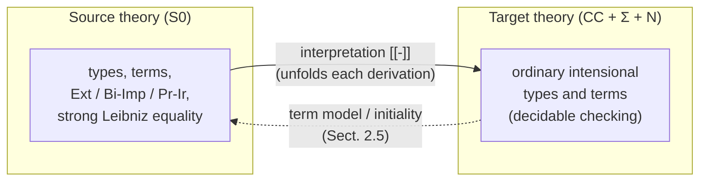
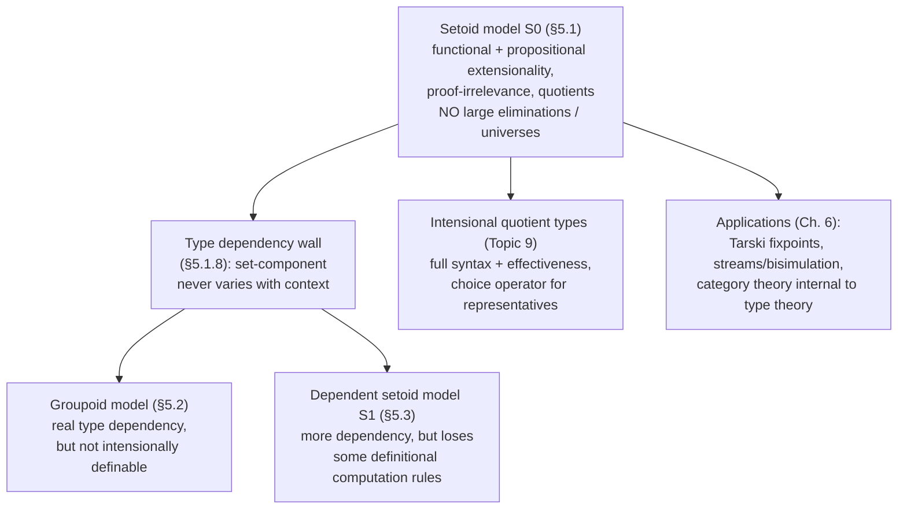

# The Setoid Model

[[book-guidelines|↩ Back to guidelines]]

## The problem: extensionality has to come from *somewhere*

By Chapter 5 the thesis has earned the right to ask a sharp question. Chapter 3 showed that adding functional extensionality and uniqueness-of-identity as bare axioms (`Ext`, `IdUni`) works, but wrecks N-canonicity — the new axioms have no reduction behavior, so a closed natural number can get stuck behind an unreducible `Ext`-term instead of evaluating to a numeral. Chapter 4 showed a better way for a *narrower* problem: proof-irrelevance and subset types can be obtained not as axioms but as theorems about a model — [[The-Deliverables-Model|the deliverables model]] $\mathcal{D}$, where every type is secretly a type-plus-predicate pair, and proof-irrelevance falls out because every proof's "algorithm" component is forced to be the trivial element of an extensional unit type.

Chapter 5 asks: can the same trick — recover an extensional concept as a *derived* fact about a model, rather than a *postulated* axiom — be pulled off for functional extensionality, propositional extensionality, and quotient types? The deliverables model can't do it, because it only tracks whether an element satisfies a predicate; it has no machinery for saying *which* elements of a type should count as equal to each other. What's needed is a model where every type comes bundled with its own private notion of equality — and that is exactly a **setoid**.

## Setoids: types with a partial equivalence relation

Hofmann's naming is a nod to Bishop: a **setoid** is a type together with a $\mathrm{Prop}$-valued equivalence relation on it, exactly the way constructive mathematicians build "sets" out of raw carriers plus an explicit equality. Formally, a setoid is a pair $\sigma = (\sigma_{\mathrm{set}}, \sigma_{\mathrm{rel}})$ where $\sigma_{\mathrm{set}}$ is an ordinary type and

$$x, x' : \sigma_{\mathrm{set}} \;\vdash\; \sigma_{\mathrm{rel}}[x,x'] : \mathrm{Prop}$$

satisfies **Sym** and **Trans** — but, pointedly, *not* reflexivity:

$$
x,x':\sigma_{\mathrm{set}},\ \mathrm{Prf}(\sigma_{\mathrm{rel}}[x,x']) \vdash \sigma_{\mathrm{rel}}[x',x] \;\text{true} \qquad \textbf{Sym}
$$
$$
x,x',x'':\sigma_{\mathrm{set}},\ \mathrm{Prf}(\sigma_{\mathrm{rel}}[x,x']),\ \mathrm{Prf}(\sigma_{\mathrm{rel}}[x',x'']) \vdash \sigma_{\mathrm{rel}}[x,x''] \;\text{true} \qquad \textbf{Trans}
$$

This is a **partial equivalence relation** (PER): symmetric and transitive, but possibly relating no element to itself. Dropping reflexivity is not laziness — it is load-bearing. Hofmann says outright that if $\sigma_{\mathrm{rel}}$ were required reflexive, the model could not interpret propositions (§5.1.4): the trick used there needs some setoid elements to simply have *no* well-defined relation-behavior — think of them as "junk" the model doesn't promise anything about, rather than "existing but unequal to everything, including itself." A PER lets a setoid carve out an *"existing" subset* — exactly the elements $x$ with $\mathrm{Prf}(\sigma_{\mathrm{rel}}[x,x])$ — and quietly ignore everything else. Every axiom in the model (Sym, Trans, and later Comp) is stated *relative to that existing subset*, not the raw carrier.

**What breaks without this relativization:** if Sym/Trans had to hold unconditionally over the whole carrier type, most of the later type formers (dependent products, quotient types in particular) simply wouldn't go through — you'd be forced to prove equivalence-relation laws about elements that were never meant to represent anything.

**Rust grounding.** A setoid is almost literally a type paired with a *fallible, non-total* equivalence check — closer to a hand-rolled `PartialEq`-like trait than `Eq`, except Rust's `PartialEq` is a total function `(Self, Self) -> bool` on all inhabitants, whereas Hofmann's relation is `Prop`-valued (proof-carrying, not boolean) and explicitly allowed to be meaningless — not just `false` — on some elements. A closer picture: a struct wrapping raw data plus a validity-and-comparison predicate that only certifies equivalence for values that pass some invariant, e.g. a `RawExpr` type where only *well-scoped* terms are comparable, and comparing an ill-scoped term is not "false", it's a type error you've chosen not to rule out syntactically.

**Lean grounding.** Lean/Mathlib's own `Setoid` structure —

```lean
structure Setoid (α : Type u) where
  r : α → α → Prop
  iseqv : Equivalence r
```

— is the totalized cousin of Hofmann's notion: Mathlib's `Equivalence` bundles reflexivity along with symmetry and transitivity. Hofmann's setoids are literally what you get by deleting the reflexivity field and reinterpreting "no proof of `r x x`" as "`x` isn't really a citizen of this type." That's worth sitting with, because it's the single design decision the rest of §5.1 hinges on.

**Worked example (from the text).** The integers as pairs of naturals: $\mathrm{Int}_{\mathrm{set}} := \mathbb{N}\times\mathbb{N}$ and $\mathrm{Int}_{\mathrm{rel}}[p,p'] := (p.1 + p'.2 =_L p.2 + p'.1)$ — the usual "difference" encoding, where $(3,0)$ and $(5,2)$ both represent $3$. Every element here is reflexively related to itself (this particular relation happens to be total), but the model doesn't require that in general.

## Target theory versus source theory

Two type theories are in play simultaneously, and keeping them apart is the whole point of building a *model* rather than just axiomatizing:

- The **target type theory** is the Calculus of Constructions the model is built *inside* — Σ-types, natural numbers, no extensional concepts, fully intensional, decidable type-checking. This is the theory you actually implement and trust.
- The **source type theory** is the theory the model *interprets* — it contains everything the target has, plus the extensional concepts (functional extensionality, propositional extensionality, a "strong" Leibniz equality with a substitution principle). Definitional equality in the source theory is defined *semantically*, by unfolding the interpretation $[\![-]\!]$ into the model (the general recipe from §4.7).

This is the categorical-semantics method from Chapter 2 doing real work: contexts/types/terms of the source theory are interpreted as contexts/families/sections of a syntactic category with attributes — here called $S_0$, "the setoid model." Using a source-theory extensional concept is, under the hood, running an *interpretation function* that unfolds it into a (longer) target-theory derivation containing no axioms at all. This is what "extensional concepts as macros" (Topic 6) cashes out to concretely: `Ext`, applied inside $S_0$, isn't a new primitive — it's notation for a specific target-theory term the interpretation function produces.



**Lean grounding.** This target/source split is the same shape as Lean's own trusted-kernel architecture: the *kernel* only ever checks target-theory-style intensional judgments (`isDefEq`, well-typedness by pure computation), while *tactics and the elaborator* can use much richer reasoning (`simp`, `omega`, `decide`) to *produce* a kernel term. Hofmann's interpretation function is playing the same role tactics play in Lean: a trusted translation from a rich surface language down to a small, decidable, fully-checked core — except here the "surface language" is a whole second type theory with genuinely more logical strength available (functional/propositional extensionality), not just more automation.

## Building the model: contexts, families, morphisms, sections

The construction follows Chapter 2's recipe for a syntactic category with attributes exactly, with every component now carrying a setoid's worth of extra bookkeeping.

- **Contexts of setoids** are pairs $\Gamma = (\Gamma_{\mathrm{set}}, \Gamma_{\mathrm{rel}})$: an ordinary context plus a PER on it. Two setoid-contexts are equal exactly when both components are *definitionally* equal in the target theory — the Sym/Trans witnesses themselves are never compared. (This detail matters: comparing witnesses would make context-equality undecidable, since it would drag propositional reasoning into what needs to stay a syntactic, decidable check.)
- **Morphisms** $f : \Gamma \to \Delta$ are ordinary context morphisms that respect the relation (**Resp**): $\Gamma_{\mathrm{rel}}[\gamma,\gamma'] \Rightarrow \Delta_{\mathrm{rel}}[f[\gamma],f[\gamma']]$. Morphisms are compared by target-theory definitional equality, *not* by "provable equality" (two morphisms that only *provably* agree everywhere are not identified) — Hofmann flags this explicitly as necessary for decidability of the model's own equality, and as the exact property the choice operator of §5.1.7 later depends on for soundness.
- **Families of setoids** $\sigma \in \mathrm{Fam}(\Gamma)$ are pairs $(\sigma_{\mathrm{set}}, \sigma_{\mathrm{rel}})$ where $\sigma_{\mathrm{set}}$ is a single type **not depending on $\Gamma$ at all**, and $\sigma_{\mathrm{rel}}$ is a $\Gamma$-indexed family of PERs on that one fixed type, subject to a **Comp** ("compatibility") law: related elements of $\Gamma$ induce equivalent relations on $\sigma_{\mathrm{set}}$.
- **Sections** of $\sigma \in \mathrm{Fam}(\Gamma)$ are terms $\Gamma_{\mathrm{set}} \vdash M : \sigma_{\mathrm{set}}$ that respect the relations (again a Resp condition), and section-equality is again target-theory definitional equality.

Proposition 5.1.2 packages all of this: contexts, families, and sections of setoids form a syntactic category with attributes — this structure *is* $S_0$.

The single most important design fact is buried in the middle of that list, and it's worth stating on its own because it explains everything that follows about this model's expressive limits:

> **A family's underlying type $\sigma_{\mathrm{set}}$ does not depend on the base context at all — only the relation does.**

Type dependency, in $S_0$, lives entirely at the level of *which elements are considered equal*, never at the level of *which type you're in*. That single restriction is what makes the model tractable, and it's also exactly what it can't do — see the closing section on type dependency below.

## Type formers: Π, Σ, ℕ — and why N-canonicity survives

Given $\sigma \in \mathrm{Fam}(\Gamma)$ and $\tau \in \mathrm{Fam}(\Gamma\cdot\sigma)$, the dependent product is interpreted the expected way:

$$(\Pi\sigma.\tau)_{\mathrm{set}} = \sigma_{\mathrm{set}} \to \tau_{\mathrm{set}}$$
$$(\Pi\sigma.\tau)_{\mathrm{rel}}[\gamma;u,v] = \forall s,s':\sigma_{\mathrm{set}}.\ \sigma_{\mathrm{rel}}[\gamma;s,s'] \Rightarrow \tau_{\mathrm{rel}}[(\gamma,s);\, u\,s,\, v\,s']$$

— two functions are related exactly when they send related arguments to related results (this quantified implication is where functional behavior gets its "extensional flavor" baked in structurally, before any extensionality axiom is even discussed). Σ-types and natural numbers are interpreted "almost forced" the same way; in particular $\mathbb{N}_{\mathrm{set}} = \mathbb{N}$ and $\mathbb{N}_{\mathrm{rel}}[x,x'] = (x =_L x')$ — Leibniz equality, nothing exotic.

**What this buys, concretely: N-canonicity survives.** Because $\mathbb{N}_{\mathrm{set}}$ is the *ordinary* target-theory $\mathbb{N}$ and every type former's `set`-component is defined by ordinary (intensional, reducing) target-theory constructs, a closed natural number in the empty context of $S_0$ still reduces to a bare numeral — exactly the property that the naive `Ext`-as-axiom approach in Chapter 3 destroyed. This is the payoff of the whole modeling strategy stated concretely: you get extensionality in the source theory without ever introducing a non-canonical natural number, because the *carrier* types were never touched — only the *relations* on top of them were extended.

**Rust grounding.** This is the compiler-pass shape of "add a semantic layer without touching the representation": think of a typed IR where you bolt an alias/equivalence analysis (a `union-find`-style relation over `ValueId`s) onto an existing SSA representation without changing what a `ValueId` *is*. The underlying data (`enum Instr { ... }`) never needs a new variant to support the richer equality; the equivalence classes live in a side table. $S_0$ is doing exactly this at the level of a whole type theory: the "side table" is $\sigma_{\mathrm{rel}}$, and it never has to touch $\sigma_{\mathrm{set}}$.

## Propositions, and why they need the unit-type trick

To actually *derive* the extensional concepts (rather than just describe how types compose), $S_0$ needs an internal type of propositions. This is where the model gets genuinely clever, and it directly reuses the "generic proof type" idea from the deliverables model (Chapter 4, §4.5.4).

- $\mathrm{Prop} \in \mathrm{Fam}(\top)$ has $\mathrm{Prop}_{\mathrm{set}} = \mathrm{Prop}$ (the target theory's own syntactic type of propositions) and $\mathrm{Prop}_{\mathrm{rel}}[p,q] = (p \Leftrightarrow q)$ — propositions are related exactly when they're **bi-implicative**. This is visibly symmetric and transitive, so it's a legitimate setoid relation.
- $\mathrm{Prf} \in \mathrm{Fam}(\top\cdot\mathrm{Prop})$ has $\mathrm{Prf}_{\mathrm{set}}[p] = \mathbf{1}_E$ (the **extensional unit type** — one canonical inhabitant $\star$, with the equation $M = \star : \mathbf{1}_E$ for *every* $M : \mathbf{1}_E$) and $\mathrm{Prf}_{\mathrm{rel}}[p; x, x'] = p$ itself.

Read that last line carefully: the relation on proofs of $p$ *is* $p$. Two "proofs" (both necessarily equal to $\star$, since that's the only inhabitant of $\mathbf{1}_E$) count as related exactly when the proposition they're proving is actually true. This is the mechanism, and it is the direct ancestor of proof-irrelevance: because the underlying carrier of *every* proof-type is the same trivial type $\mathbf{1}_E$, there is structurally nowhere for two proofs of the same proposition to differ.

Universal quantification $\forall(S)$, for $S : \sigma \to \mathrm{Prop}$, is defined relative to the "existing" elements only — $\forall(S)[\gamma] = \forall x{:}\sigma_{\mathrm{set}}.\ \sigma_{\mathrm{rel}}[\gamma;x,x] \Rightarrow S[\gamma;x]$ — again the PER-without-reflexivity trick doing its job: quantifying only over elements the model actually vouches for, not the raw carrier.

## Deriving the extensional concepts as theorems, not axioms

This is the chapter's central payoff, and it rests on one lemma about Leibniz equality inside $S_0$.

**Leibniz equality externalizes the relation (Lemma 5.1.6).** Unfolding the definition, two sections $M, N$ of a family $\sigma$ are Leibniz-equal in $S_0$ exactly when

$$\gamma:\Gamma_{\mathrm{set}},\ \mathrm{Prf}(\Gamma_{\mathrm{rel}}[\gamma,\gamma]) \;\vdash\; \sigma_{\mathrm{rel}}[\gamma; M[\gamma], N[\gamma]] \;\text{true}$$

In plain language: *inside the model*, "$M$ and $N$ are propositionally (Leibniz) equal" and "$M$ and $N$ are related by $\sigma_{\mathrm{rel}}$" are the same fact. Leibniz equality — normally an *observational* notion (indistinguishable under all predicates) — collapses onto the concrete, hand-built PER carried by the setoid. That's the hinge the whole derivation swings on.

From here, three rules fall out as *provable facts about the interpretation*, not new primitives:

$$
\dfrac{\vdash A:\mathrm{Prop} \quad \vdash M,N:\mathrm{Prf}(A)}{\vdash M = N : \mathrm{Prf}(A)}\ \textbf{Pr-Ir}
\qquad
\dfrac{\vdash P,Q:\mathrm{Prop} \quad \vdash H:\mathrm{Prf}(P\Leftrightarrow Q)}{\vdash \mathrm{BiImp}(P,Q,H):\mathrm{Prf}(P =_L Q)}\ \textbf{Bi-Imp}
$$
$$
\dfrac{\vdash U,V:\Pi x{:}\sigma.\tau \quad x{:}\sigma \vdash H:\mathrm{Prf}(Ux =_L Vx)}{\vdash \mathrm{Ext}(H):\mathrm{Prf}(U =_L V)}\ \textbf{Ext}
$$

**Pr-Ir** is immediate: $M$ and $N$ both denote $\star:\mathbf{1}_E$, full stop — there is nothing else they *could* be. **Bi-Imp** (propositional extensionality) follows because a bi-implication proof is precisely a proof that $P$ and $Q$ are $\mathrm{Prop}_{\mathrm{rel}}$-related, and by Lemma 5.1.6 that *is* Leibniz equality on $\mathrm{Prop}$. **Ext** (functional extensionality) follows the same way at $\Pi$-types, using the pointwise-implication shape baked into $(\Pi\sigma.\tau)_{\mathrm{rel}}$ above.

**Even sharper: Leibniz equality behaves like an identity type (Prop 5.1.8).** For $M, N \in \mathrm{Sect}(\sigma)$, a proof $P$ of their Leibniz equality, and $U \in \mathrm{Sect}(\sigma\{M\})$, there is a well-defined $\mathrm{Subst}_{\sigma,\tau}(P,U) \in \mathrm{Sect}(\tau\{N\})$ with $\mathrm{Subst}(\mathrm{Re}(M), U) = U$, stable under substitution. The proof is almost embarrassingly direct: **define $\mathrm{Subst}(P,U) := U$.** Lemma 5.1.6 plus the family's own Comp law is all that's needed to show this is still a legitimate section. Why does this matter so much? Because a substitution operator with these exact properties is precisely what §3.2.3.1 needs to *define* Martin-Löf's elimination rule $J$ from `Subst`+`IdUni`. So Leibniz equality in $S_0$ is not merely *an* equivalence relation with nice closure properties — it is, formally, as strong as an intensional identity type. That is the technical content behind the claim that **$S_0$ is conservative over extensional type theory ($\mathrm{TT}_E$)** via the Chapter 3 conservativity theorem (Thm. 3.2.5): everything $\mathrm{TT}_E$ can prove, $S_0$ (built purely inside intensional type theory) can already interpret.

**Lean grounding.** `Prf_rel[p; x, x'] = p` is the exact shape of Lean's kernel-level proof-irrelevance rule for `Prop` — any two terms of the same `Prop` are *definitionally* equal, no axiom required, because (in Lean's design, mirroring Hofmann's construction almost exactly) there is structurally nothing that could distinguish them. And Lean's `funext` axiom is precisely `Ext` as stated above, except Lean simply *postulates* it (accepting the loss of some definitional behavior involving `funext`-built terms), whereas $S_0$ *proves* it as a theorem about an interpretation — the theoretical high ground Hofmann is claiming for the model-based approach over Lean's axiomatic one.

## Two things extensionality costs you: choice, and Church's thesis

Hofmann doesn't just show what $S_0$ buys; §5.1.4.2–5.1.4.3 show what it *forecloses*, and both failures have the same shape: a witness that exists at the level of raw target-theory data need not *respect the relation*, so it cannot be transported into the source theory.

### The internal axiom of choice fails

$$\mathrm{IAC}:\quad (\forall x{:}\sigma.\,\exists y{:}\tau.\,R[x,y]) \to \exists f{:}\sigma\to\tau.\,\forall x{:}\sigma.\,R[x,f\,x]$$

Even if the target theory validates $\mathrm{IAC}$, the source theory need not: the witness function $f$ produced by choice in the target theory has no obligation to send $\sigma_{\mathrm{rel}}$-related inputs to $\tau_{\mathrm{rel}}$-related outputs, so it is not automatically a legitimate $S_0$-morphism. Worse: Hofmann shows (mimicking Diaconescu's classical argument) that $\mathrm{IAC}$ together with `Ext` and `Bi-Imp` together *imply excluded middle* — so a source theory with full choice, functional extensionality, and propositional extensionality all at once collapses toward classical logic, whether or not you wanted that. (A conjectured exception: when $\sigma = \mathbb{N}$ — "countable choice" — or more generally whenever $\sigma_{\mathrm{rel}}$ is Leibniz equality itself, the witness is automatically relation-preserving, so choice over $\mathbb{N}$ survives.)

### Church's thesis fails — and its negation is provable

$$\mathrm{CT} :\quad \exists F{:}(\mathbb{N}\to\mathbb{N})\to\mathbb{N}.\ \forall f{:}\mathbb{N}\to\mathbb{N}.\ \mathrm{computes}[F\,f,\,f]$$

— "there's a single functional that hands you a program-code for any given function." Even if $\mathrm{CT}$ holds in the target theory, in the source theory not only does it fail to transport, its **negation becomes provable**: functional extensionality forces $F$ to give the *same* output on extensionally-equal functions, but a code-extracting functional would then need to decide function-equality by comparing outputs — which is exactly what makes CT-plus-choice-plus-extensionality inconsistent (mirroring a known inconsistency result for Heyting Arithmetic in all finite types, $\mathrm{HA}^\omega$). A strictly weaker form, $\mathrm{CT}_0 := \forall f.\exists e.\,\mathrm{computes}[e,f]$ (no single uniform $F$, just a witness per $f$), *does* survive the translation — because it doesn't require a *function* $\sigma\to\tau$ that must itself respect the relation, only a per-instance existential.

**Why this matters for the compiler/elaborator project:** this is the sharpest concrete illustration in the whole thesis of the tension between *extensionality* and *computational content*. A system that wants both full functional extensionality *and* a decidable, effective realizer for every function is asking for something inconsistent, not just hard. This is the same tension you'll hit designing a trusted kernel: the more extensional your equality (the easier proofs are to write), the less you can assume about *how* a witness was computed — which is exactly why Lean keeps `funext` as a non-computing axiom rather than trying to derive it with computational content, and why a metaprogramming elaborator that needs both extensional reasoning *and* executable proof terms has to draw a careful line about where each is allowed.

## The limit: no genuine type dependency in $S_0$

Everything above works because $S_0$ made one restriction from the outset: a family's `set`-component never depends on the base context, only its `rel`-component does. §5.1.8 proves this isn't a missed opportunity but a hard wall.

**The argument.** Suppose the target theory has an empty type $\mathbf{0}$ with the usual eliminator $\bot_\sigma : \mathbf{0}\to\sigma$, and suppose $S_0$ had a universe closed under $\mathbb{N}$ and $\mathbf{0}$. Then you could define a family of *types* varying over $\mathbb{N}$: $n{:}\mathbb{N}\vdash\tau[n]$ with $\tau[0] = \mathbf{0}$ and $\tau[\mathrm{Suc}(n)] = \mathbb{N}$ — a "large elimination." But since a family's `set`-component is *frozen*, independent of the index, this single family would have to supply a function $\bot : \tau_{\mathrm{set}} \to \sigma$ for *every* type $\sigma$ (forced by the $\tau[0]=\mathbf{0}$ case) while *also* being $\mathbb{N}$-shaped (forced by the $\tau[\mathrm{Suc}(n)]=\mathbb{N}$ case) — a contradiction. So: **no universes, no large eliminations, in $S_0$.** Peano's fourth axiom ($0 \neq \mathrm{Suc}(0)$) still survives at the level of *propositions* ($\mathrm{Prf}(\mathrm{ff})$ is weaker than an actually-empty type — every proposition follows from a proof of falsity, but not every *type* is inhabited), so consistency isn't threatened; it's expressiveness at the type-former level that's capped.

Hofmann sketches (not fully develops) a fix that anticipates the topics coming next in the book: split types into a `type` component (which type-family you're in, e.g. the universe code) and a `set` component (the actual carrier at that code), and only allow *quotienting* for "small" types of the form $\mathrm{El}(M)$ for $M : U$ — never for the universe itself. This buys back a restricted universe closed under the type formers already present, plus quotients, at the cost of still not supporting fully general large eliminations (you still can't define $\tau$ above, since that needs primitive recursion with a *universe-valued* result type).

**Lean grounding.** This limitation is the formal reason Lean's own inductive-family machinery (`Nat.rec` with a `Sort`-valued motive, or a genuine `Type`-indexed family) needs a real dependent product at the level of *types*, not just of *terms and relations* — exactly the ingredient $S_0$ deliberately doesn't have. It is also the precise motivation for the **groupoid model** in §5.2 (Topic 4 territory): to get real type-level dependency, the model needs to let $\sigma_{\mathrm{set}}$ itself vary along a *proof-relevant* structure (an isomorphism, not just a Prop-valued relatedness fact) — which is why the groupoid model replaces PERs with groupoids and pays for it by losing definability inside intensional type theory.

## Where this leads



$S_0$ is the thesis's "cheapest" extensional model — the one requiring the least extra machinery (a Prop-valued relation, no proof-relevant structure) — and it is exactly this cheapness that both makes it fully definable inside intensional type theory *and* caps what it can express. Everything downstream in Chapter 5 is a response to that cap: the groupoid model (§5.2) removes it by going proof-relevant and non-syntactic; the dependent setoid model $S_1$ (§5.3) tries to claw back some dependency while staying intensionally definable, at the price of definitional equalities that only hold propositionally. And the two failure results here — no internal choice, no Church's thesis — are not footnotes: they are the standing warning, for anyone building a verifier that wants both extensional convenience and computational/proof-search content, that you cannot have unrestricted choice, full functional extensionality, and an effective "give me a program for this function" operator all at once. Any Hoare-triple-style verification pipeline that leans on functional extensionality to simplify obligations should expect exactly this tradeoff to show up as "some witnesses exist non-constructively" the moment choice enters the picture.
