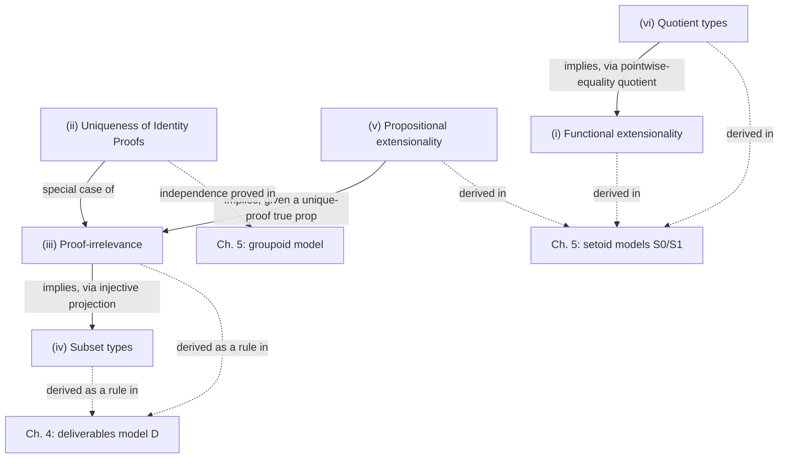

# The Six Extensional Concepts

[[book-guidelines|↩ Back to guidelines]]

## The problem this list is answering

Martin-Löf's identity type $\mathrm{Id}_\sigma(M,N)$ is supposed to *be* equality-as-a-first-class-object: a type whose inhabitants are proofs that $M$ and $N$ are equal, with a single constructor $\mathrm{Refl}_\sigma(M) : \mathrm{Id}_\sigma(M,M)$. That is an elegant idea — you can pattern-match on a proof of equality, you can compute with it, and a type checker can decide whether a candidate proof has the right type. But by the end of §1.1 of the thesis, Hofmann has already shown you the crack in it: the identity type, defined this way, is *too weak*. There is no way, using only $\mathrm{Refl}$ and its eliminator $J$, to prove that two pointwise-equal functions are equal, even though this feels like it should obviously be true. The type theory can express the *statement* "$f$ and $g$ agree everywhere" but cannot turn that into a proof living in $\mathrm{Id}_{\sigma\to\tau}(f,g)$.

This is not a one-off gap. §1.2 is Hofmann's inventory of every place this same failure recurs — every place where propositional equality (formalized, checkable equality-as-a-proof) falls short of the equality mathematicians actually reason with informally. He calls each gap an **extensional concept**: a desirable property of equality that the bare identity type doesn't hand you for free. There are six of them, and understanding why the list has exactly these six items — no more, no fewer — is the payoff of this section. It is also the section that sets up the entire thesis: every later model (deliverables in Ch. 4, the setoid/groupoid models in Ch. 5) exists solely to manufacture some subset of these six inside pure intensional type theory, without cheating.

## Why "propositions" need their own type

Before the list makes sense you need one piece of scaffolding that Hofmann introduces almost in passing: the distinction between **types** and **propositions**. Three of the six concepts (proof-irrelevance, propositional extensionality, subset types) are only meaningful if propositions are somehow special — distinguishable from types in general, like `bool` versus an arbitrary struct in Rust. Hofmann's device is a type of propositions $\mathrm{Prop}$, together with, for every $P : \mathrm{Prop}$, a type $\mathrm{Prf}(P)$ of its proofs. A "proposition" in this technical sense just means: a type of the form $\mathrm{Prf}(P)$.

This is exactly the shape of Lean's `Prop` universe: `Prop : Type`, and for `p : Prop`, terms of type `p` are its proofs — `Prf(P)` is literally `P` itself viewed as a type, once you're inside a universe with this convention. Rust has no analog at all here, because Rust types don't carry the "this classifies proofs of a logical statement" reading — a `bool` is just data, not a proposition being inhabited by evidence. That asymmetry is worth sitting with: it's precisely the asymmetry that lets $\mathrm{Prop}$-specific extensional concepts (proof-irrelevance, in particular) exist without collapsing all of type theory into triviality.

## The six concepts

### (i) Functional extensionality

> Two functions that are point-wise propositionally equal are propositionally equal.

Formally: given $P : \Pi x{:}\sigma.\, \mathrm{Id}_\tau(fx, gx)$, produce an element of $\mathrm{Id}_{\sigma\to\tau}(f,g)$. The bare identity type cannot do this — $J$ only lets you eliminate a proof of $\mathrm{Id}$ into another proof about the *same two objects*, it gives you no leverage to build a *new* function-level identity proof out of infinitely many pointwise ones (a genuine induction over all of $\sigma$, which $J$'s single-constructor structure just isn't shaped to do).

- **Lean.** Lean does not derive this either — it assumes it as the axiom `funext : (∀ x, f x = g x) → f = g`. That is Hofmann's exact point from a page later in §1.2, played out in a real system: adding it as a bare axiom (rather than deriving it from a model) is possible, but it comes at a cost discussed below.
- **Rust.** There's no propositional equality to speak of, so there's nothing to extend — but the *intuition* transfers: `PartialEq` for `fn(i32) -> i32` isn't even implemented, because Rust (correctly) refuses to claim function equality is decidable or even meaningful without more structure. The type theory's difficulty here is a formal mirror of that same intuition: equality-of-functions is not "for free" the way equality-of-data is.

### (ii) Uniqueness of identity proofs (UIP)

> Any two proofs of the same propositional equality are themselves propositionally equal.

Formally: for $P, Q : \mathrm{Id}_\sigma(M,N)$, produce an element of $\mathrm{Id}_{\mathrm{Id}_\sigma(M,N)}(P,Q)$. This says equality proofs have no "extra information" beyond the fact that the equality holds — there's only one way to be equal. It sounds obviously true (surely $M = N$ "in only one way"?), and indeed $J$ alone can already establish it *when one of $P, Q$ is literally $\mathrm{Refl}$* — but not in general, and Hofmann flags here (returning to it fully in Chapter 4's groupoid model) that this is genuinely independent of intensional type theory: there are consistent models where distinct proofs of the same equality are *not* identified, and this is exactly what makes pattern-matching on dependent types a non-conservative extension (the topic of the thesis's fourth chapter).

- **Lean.** UIP for a type is captured by the `Subsingleton` idea specialized to identity types, and is *not* assumed globally — Lean's core type theory is deliberately UIP-agnostic (it's consistent to add `Axiom K`/UIP, and also consistent to refute it, which is exactly what Hofmann is foreshadowing here and proves outright in Ch. 5 via a groupoid counter-model). This is the thesis's most consequential result and this section is where the reader is first warned it's coming.
- **Rust.** No direct analog (no propositional equality), but the closest structural cousin is: two different `unsafe` proofs/derivations that a pointer is valid needn't carry the same runtime representation even if both type-check — "two proofs of the same fact" being distinguishable data is a familiar shape from certificate-carrying code.

### (iii) Proof-irrelevance

> Any two proofs of a proposition are propositionally equal.

This looks like a special case of UIP (same-equality proofs collapse) but it's a strictly stronger, orthogonal statement: for $M, N : \mathrm{Prf}(P)$ — *any* $P$, not just an identity type — produce $\mathrm{Id}_{\mathrm{Prf}(P)}(M,N)$. UIP is the special case where $P$ is itself an $\mathrm{Id}$-type; proof-irrelevance covers every proposition. Hofmann notes explicitly: UIP "only makes sense in the absence of" proof-irrelevance, since once you have full proof-irrelevance, UIP is automatic (equality proofs are themselves proofs of a proposition).

- **Lean.** This one is not an add-on axiom at all — it's baked directly into Lean's kernel as a *definitional* equality rule: any two terms of the same `Prop` are judgmentally (not just propositionally) equal. This is the strongest possible reading of the concept and it is directly relevant to the elaborator/unifier work this thesis notebook is tracking toward: because proof terms are irrelevant to `isDefEq`, the unifier never needs to compare proof subterms for equality during elaboration — it can erase them. That's a genuine efficiency and simplicity gain for a bidirectional elaborator: proof obligations become "found or not found," never "found but do the two candidate proofs actually match."
- **Rust.** The nearest shape is a `PhantomData`-style zero-sized marker type that exists purely to carry a compile-time guarantee and is erased at runtime — the "proof" (the marker) carries no distinguishing information, so any two instances are interchangeable by construction.

### (iv) Subset types

> A type former that lets you form the type of elements of $A$ satisfying a predicate $P$.

Written informally $\{x : A \mid P(x)\}$. Hofmann is explicit that proof-irrelevance (iii) *implies* this is well-behaved (iii $\Rightarrow$ iv): once two proofs of $P(x)$ are guaranteed equal, the first projection out of $\{x:A\mid P(x)\}$ is *injective* — two elements of the subset type with the same underlying witness must be the same element, since the only place they could differ (the proof component) is provably irrelevant. Without proof-irrelevance, a naive encoding as $\Sigma x{:}A.\, \mathrm{Prf}(P(x))$ can carry two "different" elements that project to the same $A$-value but disagree in their (visible, distinguishable) proof component — an accounting nuisance the thesis returns to at length in Chapter 4.

- **Lean.** `Subtype` (`{x : α // p x}`), backed by exactly this reasoning — because `p x : Prop` is proof-irrelevant, `Subtype.ext` (equality of subtypes reduces to equality of the underlying values) is provable, matching Hofmann's injectivity claim precisely.
- **Rust.** The natural analog is the *smart-constructor / newtype* pattern: `struct PositiveInt(i32)` with a private field and a validating constructor `fn new(n: i32) -> Option<Self>`. Rust has no propositional layer to state "this wraps a proof that `n > 0`," so the invariant lives only in the *type's API surface*, not in the type itself — this is exactly the gap that motivates refinement types as a research target, since a refinement-typed language would let you write the subset-type invariant as data the compiler checks, not as documentation enforced by constructor discipline.
- **Python** doesn't have a natural fit here beyond a runtime-checked `NamedTuple` with an `__post_init__` assertion — worth noting as a case where the analogy is present but not illuminating; the interesting content is in the Rust/Lean comparison.

### (v) Propositional extensionality

> Propositions that mutually imply each other are propositionally equal.

Formally: given $P \Rightarrow Q$ and $Q \Rightarrow P$, produce $\mathrm{Id}_{\mathrm{Prop}}(P,Q)$. Hofmann notes v $\Rightarrow$ iii, *given* a distinguished proposition with exactly one proof (a "true" proposition $\top$ with unique inhabitant): if $P$ has two proofs $M, N$, both $P$ and $\top$ imply each other (since $P$ is inhabited), so $P = \top$ propositionally, and any two proofs of $P$ transport to the unique proof of $\top$ — hence they're equal too. This is a genuinely pleasant derivation and it's a first taste of the thesis's core method: extensional concepts are not independent facts to be assumed one by one, they entail each other once you fix enough structure.

- **Lean.** `propext : (p ↔ q) → p = q` — an axiom, matching functional extensionality's status as "assumed, not derived," and for the same underlying reason (no amount of case analysis on the *syntax* of $P$ and $Q$ can produce this).
- **Rust/Python** have no propositional layer to extend, so there's genuinely no code analog worth forcing here — this is a concept that lives entirely on the logic side of the fence.

### (vi) Quotient types

> A type former permitting arbitrary redefinition of propositional equality on some underlying type via a chosen relation.

This is the most operationally different of the six: rather than proving two *existing* elements equal, a quotient type $\Gamma/R$ *manufactures* a new type whose propositional equality is stipulated to be (the equivalence closure of) $R$, directly — you get $[M]_R =_L [N]_R$ whenever $R(M,N)$ holds, by fiat rather than by derivation. Hofmann notes vi $\Rightarrow$ i (quotient types imply functional extensionality): quotienting the function space by pointwise equality gives you a type whose equality *is* pointwise equality, which is enough to derive a (weak) form of extensionality — a fact he flags here and proves properly in §3.2.7, and one of the thesis's more surprising results (it shows [[Intensional-Quotient-Types|intensional quotient types]] are *not* conservative over pure intensional type theory, unlike the other concepts studied on their own).

- **Lean.** `Quot` (with `Quot.sound : r a b → Quot.mk r a = Quot.mk r b`) is a *primitive* type former in Lean's kernel, built exactly for this purpose — Lean did not derive quotients from anything more basic; it added them as Hofmann-style "extensional concept," with `Quot.sound` playing the role of the axiom that manufactures equalities the constructor discipline alone wouldn't give you.
- **Rust.** The closest analog is a `HashSet`/canonical-form pattern: representing equivalence classes by picking a canonical representative and comparing those (e.g. normalizing a fraction to lowest terms before comparing `Fraction` values) — this recovers the *decidable, computable* content of a quotient without any propositional-equality machinery, which is exactly the "deliverables"-style trick (Ch. 4) of encoding an extensional idea using only ordinary intensional ingredients.
- **Lean** again, more precisely: this is the concept whose Lean encoding is most literally a transcription of Hofmann's syntactic-model method — `Quot.lift` (define a function on the quotient by giving a function on representatives, subject to a proof that it respects $R$) is definitionally exactly the deliverables-style "algorithm plus respect-proof" pairing that Chapter 4 formalizes as a general model construction.

## Why not just assume all six as axioms?

Hofmann closes §1.2 by pre-empting the obvious shortcut: why not simply add all six as axiomatic constants, justified by an informal set-theoretic argument that they're consistent? He shows concretely why this move is a trap, using functional extensionality as the worked example. Add a bare constant

$$\mathrm{Ext}_{\sigma,\tau} : \Pi f,g{:}\sigma\to\tau.\, \left(\Pi x{:}\sigma.\, \mathrm{Id}_\tau(fx,gx)\right) \to \mathrm{Id}_{\sigma\to\tau}(f,g)$$

and you destroy **N-canonicity** — the property (Def. 2.1.9, previewed here) that every closed term of type $\mathbb{N}$ reduces, by pure computation, to an actual numeral $\underline{n} = \mathrm{Suc}(\cdots(\mathrm{Suc}(0))\cdots)$. A term that mentions `Ext` internally has no reduction rule to fall back on — there is no equation telling the evaluator what `Ext` "computes to" — so you can construct a perfectly well-typed natural number that never reduces to a numeral, even though it's *propositionally* equal to one. This is exactly the failure mode you get in Lean today from using `funext`, `propext`, or `Quot.sound` inside a term you then try to `#eval` or `decide` — the term gets stuck on the axiom and refuses to compute, which is the modern, load-bearing instance of the phenomenon Hofmann is describing here in 1995.

There's exactly one exception in the list, and Hofmann is careful to flag it: uniqueness of identity proofs (ii) *can* be added as a bare axiom safely, because — as Streicher showed — you can equip it with a genuine reduction rule (the axiom reduces to $\mathrm{Refl}$ when applied to two proofs that are already syntactically $\mathrm{Refl}$), so it doesn't introduce stuck, non-canonical terms the way the other five do if added carelessly. This is precisely why the thesis's headline non-conservativity result (independence of UIP, Ch. 5) has teeth: UIP is the one concept that's "cheap" to axiomatize honestly, so showing it's independent of plain intensional type theory is a genuinely informative, non-trivial theorem — not a foregone conclusion from a canonicity argument the way the other five would have been.

## Where this leads

Nothing here is proved yet — §1.2 is a map, not a construction — but the map fixes the thesis's whole trajectory: Chapter 4 builds a categorical model ($\mathcal{D}$, the "deliverables" model) whose entire purpose is to derive proof-irrelevance and subset types *as theorems*, not axioms, closing off the canonicity trap above for exactly those two concepts. Chapter 5 then does the harder work for the remaining four — functional extensionality, propositional extensionality, and quotient types (with uniqueness of identity handled separately via the groupoid model, which is also where it's shown to be independent, settling the question raised in passing here).

For the standing goal of designing a Rust-based dependent/refinement-type elaborator: this section is a checklist of *exactly which axioms a real system like Lean chooses to bolt on* (`funext`, `propext`, `Quot.sound`) versus *which behavior it bakes into the kernel's definitional-equality judgment* (`Prop` proof-irrelevance). Hofmann's canonicity argument is the theoretical reason those two categories must stay separate — an elaborator that let `isDefEq` reduce through an un-computable axiom would either loop, get stuck, or silently equate things it shouldn't. Any refinement-type or Hoare-style checker built on this foundation inherits the same fork in the road: decide, for each extensional feature you want, whether it's cheap enough (like proof-irrelevance) to fold into judgmental equality directly, or whether it must stay a propositional, non-computing axiom that the checker treats as opaque during unification.
