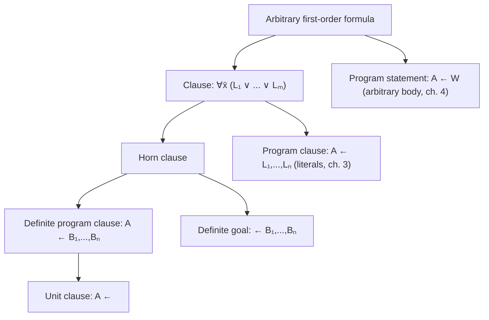

[[book-guidelines|↩ Back to guidelines]]

## Why a programming language needs a model theory

Before Lloyd can say anything about what a PROLOG program *means*, he has to answer a much older question: what does it mean for **any** formula of logic to be true? This is not a detour — it is the entire point. A logic program is going to be a set of formulas (clauses), and running the program is going to be a proof search over those formulas. If we don't first pin down what "true" means for a formula, we have no way to state — let alone prove — that the proof search is *sound* (it only derives true things) or *complete* (it derives everything true that it should).

This is the same problem a compiler-writer faces when specifying a type system: you need a **semantics** (what a well-typed program *means*, e.g. as a mathematical function) before you can prove a type checker (the **syntax**-level algorithm) sound and complete with respect to it. First-order logic here plays exactly the role that denotational semantics plays for a type system. The clausal syntax is the "surface language"; interpretations and models are the semantic domain; and SLD-resolution (covered in [[SLD-Resolution]]) is the "type-checking algorithm" whose soundness/completeness will be proved against this semantics.

## Syntax first: alphabets, terms, formulas

An **alphabet** fixes seven kinds of symbols: variables, constants, function symbols, predicate symbols, connectives ($\lnot, \land, \lor, \to, \leftrightarrow$), quantifiers ($\exists, \forall$), and punctuation. Only constants and function symbols are allowed to be empty — you can write a language with no constants (Lloyd's convention is to silently add one, so the semantics never has to deal with an empty domain), but variables and predicate symbols are non-negotiable: without a predicate symbol you have no way to say anything at all.

Terms and formulas are then built by the textbook inductive definitions — a variable or constant is a term, $f(t_1,\ldots,t_n)$ is a term if $f$ has arity $n$; $p(t_1,\ldots,t_n)$ is an atomic formula ("atom"); and formulas close under the connectives and quantifiers. Nothing here is unusual for first-order logic. What *is* worth pausing on is the precedence convention Lloyd fixes (highest to lowest: $\lnot, \forall, \exists$; then $\land$; then $\lor$; then $\to, \leftrightarrow$) — this is exactly the kind of grammar-disambiguation decision a parser needs, and it is why $\forall x \exists y\, (p(x,y) \to q(x))$ can be written without a thicket of parentheses.

**What breaks without a formal grammar:** without this, "AND-body of a clause" and "a formula in general" would be indistinguishable strings, and every soundness proof later in the book would have to smuggle in an informal reading of what a program clause *means*. The formal grammar is what lets Lloyd later say precisely "a definite program clause is a clause of the form $A \leftarrow B_1,\ldots,B_n$" and have that be an unambiguous syntactic category.

### Clausal notation — the syntax PROLOG actually runs on

A **clause** is $\forall x_1\ldots\forall x_s\,(L_1 \lor \cdots \lor L_m)$, a disjunction of literals, universally closed. Lloyd immediately specializes this into the notation every PROLOG programmer recognizes:

$$A_1,\ldots,A_k \leftarrow B_1,\ldots,B_n$$

standing for $\forall \vec x\,(A_1 \lor \cdots \lor A_k \leftarrow B_1 \land \cdots \land B_n)$ — commas on the left of $\leftarrow$ mean disjunction, commas on the right mean conjunction. A **definite program clause** restricts this to exactly one atom on the left ($A \leftarrow B_1,\ldots,B_n$); a **unit clause** further drops the body ($A \leftarrow$); a **definite goal** is $\leftarrow B_1,\ldots,B_n$ (empty head — this is what you type at the PROLOG prompt); and a **Horn clause** is either a definite program clause or a definite goal.

This is worth internalizing as a type hierarchy, because the rest of the book is organized as successive relaxations of it:



Chapters 2–4 of the book are, structurally, just this diagram walked top-down in reverse: start at definite program clauses (simplest, chapter 2), then allow negative literals in the body (chapter 3, [[Negation-in-Logic-Programs]]), then allow *any* first-order formula in the body (chapter 4).

## Semantics: interpretations, models, logical consequence

Here is the crux move. Given a formula, we cannot ask "is it true?" in a vacuum — truth depends on what the symbols *mean*. An **interpretation** fixes: a non-empty domain $D$; an element of $D$ for each constant; a function $D^n \to D$ for each $n$-ary function symbol; and a relation on $D^n$ (equivalently $D^n \to \{\text{true}, \text{false}\}$) for each $n$-ary predicate symbol. Lloyd factors this into a **pre-interpretation** $J$ (domain + constants + functions) and then an interpretation $I$ *based on* $J$ (adds the predicate assignments) — this split matters later, because Herbrand pre-interpretations fix $J$ once and for all and let only the predicate assignments vary.

A **model** of a formula $F$ is an interpretation in which $F$ evaluates to true (under every variable assignment, if $F$ has free variables — formally via the *universal closure* $\forall(F)$). **Logical consequence** — $F$ follows from a set $S$ — means every model of $S$ is a model of $F$. Proposition 3.1 gives the refutation-theorem-prover's founding identity:

$$F \text{ is a logical consequence of } S \iff S \cup \{\lnot F\} \text{ is unsatisfiable}$$

This is *why* PROLOG negates your goal and tries to derive a contradiction: proving "$\exists \vec y\,(B_1 \land \cdots \land B_n)$ follows from program $P$" is turned into "$P \cup \{\leftarrow B_1,\ldots,B_n\}$ is unsatisfiable," and refutation search (SLD-resolution) is a *search for that contradiction* — deriving the empty clause $\square$.

**What breaks without this:** without Proposition 3.1, there is no bridge between "the declarative reading of a program" (a set of true facts about the world) and "the procedural behavior of a resolution theorem prover" (a search for a contradiction). Every soundness/completeness theorem in chapters 2–5 is, at bottom, an elaboration of this one equivalence.

## Herbrand interpretations: why the search space is tractable at all

The definition of logical consequence quantifies over *all* interpretations of a language — including interpretations over the reals, over graphs, over anything. That's an intractable search space for an algorithm. Lloyd's resolution of this (Propositions 3.2–3.3, building toward Herbrand's theorem) is the single most important semantic fact underlying automated deduction: **for a set of clauses, unsatisfiability can be checked using only Herbrand interpretations** — interpretations built purely syntactically out of the program's own constants and function symbols.

Concretely: the **Herbrand universe** $U_L$ is the set of all ground (variable-free) terms buildable from $L$'s constants and functions. The **Herbrand base** $B_L$ is the set of all ground atoms over $U_L$. The **Herbrand pre-interpretation** assigns each constant/function symbol to *itself* syntactically (constants map to themselves, $f$ maps $(t_1,\ldots,t_n) \mapsto f(t_1,\ldots,t_n)$) — the domain literally *is* the syntax. Since the pre-interpretation is fixed this way, an **Herbrand interpretation** is fully determined by which predicate assignments hold, and this can be identified with a subset of $B_L$: the set of ground atoms it makes true.

This identification — *interpretation = subset of the Herbrand base* — is what makes $T_P$ (the immediate-consequence operator you'll meet in [[Fixpoint-Theory]] and [[Declarative-Semantics-of-Definite-Programs]]) a set-to-set mapping instead of an abstract functional on arbitrary domains, and it's what makes the least Herbrand model computable as a fixpoint rather than merely *known to exist* by a compactness argument.

**Crucial caveat, and it matters for chapters 3–5:** Propositions 3.2–3.3 hold *only for sets of clauses*. The moment you allow arbitrary formulas (as chapter 4 does), the restriction to Herbrand interpretations breaks — Lloyd gives the counterexample $S = \{p(a), \exists x\, \lnot p(x)\}$, which is satisfiable (domain $\{0,1\}$, $p$ true only at 0) but has *no* Herbrand model, because the only two Herbrand interpretations of the one-constant language are $\varnothing$ and $\{p(a)\}$, and neither satisfies both formulas. This is exactly why chapters 3–5 need the machinery of *program completion* (turning "if" into "iff") rather than just reasoning within Herbrand models directly.

### Grounding: Herbrand universes as term algebras

If you've built an AST-based interpreter or a compiler IR, the Herbrand universe is a familiar object wearing a formal name: it's the **free term algebra** generated by your constructors, with no equations imposed beyond syntactic identity.

```rust
// The Herbrand universe for a signature is exactly your AST's set of
// well-formed, ground (ClosedTerm) values — no evaluation, no semantics,
// just syntax closed under the constructors.
enum Term {
    Const(&'static str),                 // 0-ary function symbol
    App(&'static str, Vec<Term>),         // n-ary function symbol applied
}

// A ground atom is a predicate symbol applied to Herbrand-universe terms —
// this is your "fact" representation in a Datalog/Prolog-style engine.
struct GroundAtom {
    predicate: &'static str,
    args: Vec<Term>,
}

// An Herbrand interpretation IS a set of ground atoms — nothing more.
// This is literally the "facts" table of a bottom-up Datalog evaluator.
type HerbrandInterpretation = std::collections::HashSet<GroundAtom>;
```

If you have ever implemented a Datalog engine, the "facts" relation you compute *is* a subset of the Herbrand base of the program, and semi-naive evaluation is computing successive elements of $T_P{\uparrow}n$ (see [[Fixpoint-Theory]]). This is not an analogy — it is the same mathematical object under a different name.

In **Lean**, the Herbrand universe corresponds to the free term model you get from an inductive type with no computation rules attached — think of `Expr` in Lean's own metaprogramming framework, or a hand-rolled `inductive Term where | const : String → Term | app : String → List Term → Term`. The crucial semantic point — that Herbrand interpretations are exactly functions `GroundAtom → Prop` (or `→ Bool` for decidable predicates) over this free term type, with *no* constraint relating them to each other except what's imposed by the clauses — is the syntactic-model construction Lean's own `Decidable` and classical-model arguments echo when proving completeness theorems.

## Typed (many-sorted) logic — a preview with a purpose

Lloyd closes §3 by introducing **typed first-order theories**: variables, constants, predicate and function symbols now each carry a type (from a finite set of Greek-letter-named sorts), quantifiers become type-indexed ($\forall_\tau x$, written $\forall x/\tau$), and every construction (terms, formulas, pre-interpretations, interpretations) gets a typed analogue with domains $D_\tau$ instead of one global $D$. He flags upfront that this machinery is a *setup* for chapter 5 (deductive databases), where types capture the "domain" concept of a relational schema (customer names live in one sort, city names in another — a query shouldn't be able to accidentally compare them).

The one substantive fact he states here and cashes in later is that typed logic is **eliminable**: there is a systematic transformation of typed formulas into type-free formulas (replacing $\forall x/\tau\, F$ with $\forall x\,(\tau(x) \to F)$, using a fresh unary predicate $\tau$ per sort) that preserves logical consequence. So the extra expressiveness of types is a *convenience*, not a *strengthening* of the logic — exactly analogous to how a type-erasure compilation strategy for a simply-typed language proves the type system is a well-formedness discipline superimposed on an untyped operational semantics, not a change to what programs *compute*.

**Connection to your elaborator project:** this type-elaimination transformation is the crude ancestor of what a bidirectional elaborator does when it inserts explicit type-membership/coercion obligations during elaboration — the type predicate $\tau(x)$ here is playing the same *role* (a proof obligation that a term inhabits its stated domain) that a refinement-type checker's generated verification condition plays, just without the machinery (no dependent types, no $\Sigma$/$\Pi$, no definitional equality) to make the obligation anything richer than set membership. It is worth noticing this now because chapter 5's domain-closure axioms (an axiom scheme enumerating "every element of type $\tau$ is one of these known constants or a known function application") are doing, crudely, what an inductive type's constructors do in Lean: they *close* the domain so induction/case-analysis is licensed.

## Where this leads

- [[Unification]] needs the term/atom syntax defined here as the objects being unified.
- [[Fixpoint-Theory]] needs complete lattices; the lattice used throughout the book is $2^{B_P}$ — subsets of the Herbrand base defined here, ordered by inclusion.
- [[Declarative-Semantics-of-Definite-Programs]] defines the least Herbrand model using exactly the Herbrand-interpretation machinery from this article, and Theorem 6.2 (the atoms in it are precisely the logical consequences of $P$) is a direct descendant of Proposition 3.1.
- The Herbrand-model restriction failing for arbitrary formulas is the reason [[Negation-in-Logic-Programs]] needs *program completion* — turning definitional "if" into "iff" — to recover a workable model theory for negation.
