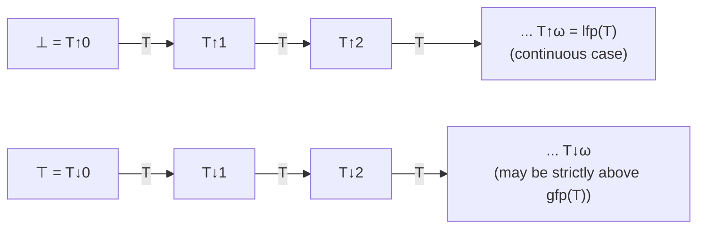

[[book-guidelines|↩ Back to guidelines]]

## Why a logic program needs a lattice

A recursive definite program like `sorted`, `perm`, or `path` doesn't come with an obvious "meaning" the way a non-recursive one does — you can't just unfold the recursion in your head and stop. What *is* the meaning of

```prolog
path(X, Y) :- edge(X, Y).
path(X, Y) :- edge(X, Z), path(Z, Y).
```

The declarative answer chapter 2 will give ([[Declarative-Semantics-of-Definite-Programs]]) is "the smallest relation closed under these two rules" — and *smallest closed-under-rules set* is precisely what fixpoint theory is built to characterize. This section is Lloyd's toolbox for that: complete lattices, monotonic/continuous mappings, and the Knaster–Tarski theorem guaranteeing least and greatest fixpoints exist and giving a constructive recipe (ordinal iteration) for building them.

If you've ever written an **abstract interpreter**, you have already used this machinery, whether or not you named it: the standard fixpoint-iteration loop for computing an abstract invariant ($\mathrm{lfp}$ of the abstract transfer function over an abstract domain lattice) is *literally* an instance of the theorem proved in this section, with $T_P$ replaced by an abstract transformer and the Herbrand-base powerset replaced by an abstract domain like intervals or polyhedra.

## Complete lattices: the shape of "smallest closed-under-rules"

A **partial order** $\leq$ on a set $S$ is the usual reflexive/antisymmetric/transitive relation. $L$ is a **complete lattice** if *every* subset $X \subseteq L$ (not just finite ones) has a least upper bound $\mathrm{lub}(X)$ and greatest lower bound $\mathrm{glb}(X)$. This gives $L$ a top element $\top = \mathrm{lub}(L)$ and bottom $\bot = \mathrm{glb}(L)$.

The lattice that matters throughout this book is $2^{B_P}$ — the powerset of the Herbrand base (see [[First-Order-Logic-as-a-Foundation-for-Logic-Programming]]), ordered by set inclusion. Here $\mathrm{lub}$ is union, $\mathrm{glb}$ is intersection, $\top = B_P$, $\bot = \varnothing$. This is a complete lattice *even for infinite $B_P$* — union and intersection of arbitrary (not just finite) families are always defined — and that unrestricted completeness is exactly what licenses reasoning about programs whose least model or success set is infinite.

## Monotonic and continuous mappings

A mapping $T : L \to L$ is **monotonic** if $x \leq y \implies T(x) \leq T(y)$: more input, no less output — the transformer never "loses" consequences you already had. $T$ is **continuous** if $T(\mathrm{lub}(X)) = \mathrm{lub}(T(X))$ for every **directed** set $X$ (every finite subset of $X$ has an upper bound in $X$ — think of $X$ as an increasing chain, possibly transfinite). Every continuous mapping is monotonic (take $X = \{x,y\}$), but the converse fails — Lloyd leaves the counterexample as an exercise, and it's worth constructing one yourself: monotonicity alone doesn't prevent $T$ from "jumping" at a limit stage in a way that isn't the limit of the earlier jumps.

**What breaks without continuity:** continuity is exactly the hypothesis that makes the fixpoint *computable by iteration in $\omega$ steps* rather than merely *known to exist* by an abstract argument. This is the crux of the difference between a knowledge that a static analysis's fixpoint exists (any monotonic transformer on a complete lattice has one, by Knaster–Tarski) and knowing you can *compute* it by finite (or $\omega$-length) iteration from the bottom.

## The Knaster–Tarski theorem and ordinal iteration

**Proposition 5.1** (a weak Tarski/Knaster–Tarski form): if $L$ is a complete lattice and $T : L \to L$ is monotonic, $T$ has a least fixpoint $\mathrm{lfp}(T)$ and a greatest fixpoint $\mathrm{gfp}(T)$, characterized two ways each:

$$\mathrm{lfp}(T) = \mathrm{glb}\{x : T(x) = x\} = \mathrm{glb}\{x : T(x) \leq x\}$$
$$\mathrm{gfp}(T) = \mathrm{lub}\{x : T(x) = x\} = \mathrm{lub}\{x : T(x) \geq x\}$$

The proof is a beautiful two-line argument (take $g = \mathrm{glb}\{x : T(x) \leq x\}$; show $g$ is itself in that set by monotonicity; show $g \leq T(g)$ follows too, hence $g$ is a fixpoint) — it's worth working through by hand once, because the same argument pattern (fixpoint-as-glb-of-a-"pre-fixpoint" set) reappears constantly in denotational semantics and abstract interpretation textbooks.

To make the fixpoint *constructive*, Lloyd defines **ordinal powers**:

$$T{\uparrow}0 = \bot,\qquad T{\uparrow}\alpha = T(T{\uparrow}(\alpha{-}1)) \text{ for successor } \alpha,\qquad T{\uparrow}\alpha = \mathrm{lub}\{T{\uparrow}\beta : \beta < \alpha\} \text{ for limit } \alpha$$

(dually $T{\downarrow}\alpha$ using $\top$ and $\mathrm{glb}$). **Proposition 5.3** shows $T{\uparrow}\alpha \leq \mathrm{lfp}(T)$ for every ordinal $\alpha$, and that iteration *does* eventually reach $\mathrm{lfp}(T)$ at some ordinal (bounded by a cardinality argument — an injective ordinal-indexed sequence into $L$ can't exceed $|L|^+$). The **closure ordinal** is the least $\alpha$ where $T{\uparrow}\alpha = \mathrm{lfp}(T)$.

**Kleene's theorem (Proposition 5.4)** is the payoff: if $T$ is *continuous* (not just monotonic), the closure ordinal is $\leq \omega$ — you reach $\mathrm{lfp}(T)$ after countably many (in fact, for finite-branching $T_P$, literally $\omega$-many) ordinary iterations from the bottom, no transfinite reasoning required in practice. This is *the* theorem that turns "least fixpoint exists" into "here is an algorithm (semi-naive bottom-up evaluation) that computes it."

The dual fact — that $\mathrm{gfp}(T)$ need **not** equal $T{\downarrow}\omega$ even for continuous $T$ — is flagged explicitly and becomes a running theme: chapter 2 exhibits $\mathrm{gfp}(T_P) \ne T_P{\downarrow}\omega$ for an ordinary (finite-term) program, while chapter 6 ([[Semantics-of-Perpetual-Processes]]) proves the equality *is* recovered once you pass to the *compact* space of possibly-infinite terms — compactness is exactly the missing ingredient that continuity alone doesn't supply for the descending direction.



## Grounding: this loop is your abstract interpreter's core

```rust
// A monotonic transformer over a lattice — the exact shape of an abstract
// interpretation's transfer function, or a Datalog/CHC solver's step function.
trait CompleteLattice: PartialOrd + Clone {
    fn bottom() -> Self;
    fn lub(a: &Self, b: &Self) -> Self;
}

// Kleene iteration: this loop IS Prop. 5.4 (continuous ⇒ closure ordinal ≤ ω),
// executed. It terminates iff the ascending chain condition holds for L
// restricted to the reachable sub-lattice — which is why abstract domains
// like "intervals" need widening operators when they lack finite height.
fn least_fixpoint<L: CompleteLattice>(t: impl Fn(&L) -> L) -> L {
    let mut current = L::bottom();
    loop {
        let next = t(&current);
        let joined = L::lub(&current, &next);
        if joined == current {
            return current; // T↑n = T↑(n+1): reached lfp(T)
        }
        current = joined;
    }
}
```

The connection to your CSP/abstract-interpretation project is direct and not merely thematic: a **Horn-clause-constrained-invariant solver** (a CHC solver, which you name explicitly in your standing goals) computes exactly $\mathrm{lfp}(T_P)$ for $T_P$ built from the Horn clauses encoding a program's control-flow-graph transitions — this *is* $T_P$ from [[Declarative-Semantics-of-Definite-Programs]], just with the Herbrand base replaced by an *abstract* domain of program-state predicates. Widening operators (needed when the abstract lattice has infinite ascending chains, e.g. intervals over the integers) are precisely a hack to force convergence when Kleene's $\omega$-bound (Proposition 5.4) doesn't apply because the lattice fails the ascending chain condition — you are trading *exactness* of the fixpoint for *guaranteed termination*, which Lloyd's clean finite-signature setting never has to worry about because $B_P$, while possibly infinite, has $T_P$ continuous by construction (Proposition 6.3, proved using exactly the directed-set definition from this section).

**In Lean**, the closest kernel-level analogue is well-founded recursion and its associated fixpoint combinators (`WellFounded.fix`): proving a recursive definition terminates is, semantically, exhibiting that its intended meaning is the *least* fixpoint of a monotone functional on a suitable domain (often the "partial function" domain ordered by graph inclusion, a complete lattice for essentially this reason) — the same Knaster–Tarski argument underlies why `WellFounded.fix` is well-defined at all, just phrased in dependent-type-theoretic terms with an explicit accessibility proof standing in for "this iteration process terminates."

## Where this leads

- [[Declarative-Semantics-of-Definite-Programs]] is the first real application: $T_P$ on $2^{B_P}$ is shown continuous (Proposition 6.3), so by Kleene's theorem $M_P = \mathrm{lfp}(T_P) = T_P{\uparrow}\omega$ — the least Herbrand model is *computable* by iterating the immediate-consequence operator from $\varnothing$.
- The asymmetry between $\mathrm{lfp}$ (reached at $\omega$ for continuous $T$) and $\mathrm{gfp}$ (not generally reached at $\omega$, even for continuous $T$) is a recurring theme all the way to [[Semantics-of-Perpetual-Processes]], where compactness of the infinite-term Herbrand universe is exactly what's needed to restore the symmetric result $\mathrm{gfp}(T'_P) = T'_P{\downarrow}\omega$.
- **Load-bearing for your CSP/abstract-interpretation kernel:** this section *is* the mathematical content of "fixpoint iteration with widening" before widening is even necessary — understand Kleene's theorem's continuity hypothesis precisely, because every place your future solver needs a widening/narrowing operator is a place where the underlying abstract domain has failed one of this section's hypotheses (either non-continuity or an infinite ascending chain with no directed-lub shortcut).
