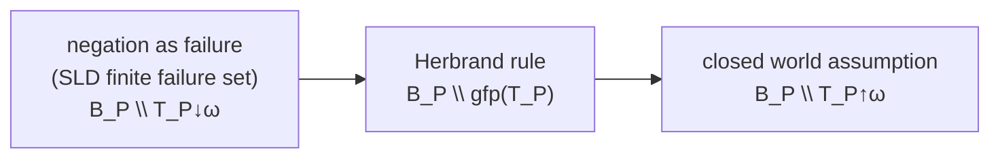

[[book-guidelines|↩ Back to guidelines]]

## The problem: definite programs can't say "no"

[[Declarative-Semantics-of-Definite-Programs]] and [[SLD-Resolution]] give a complete, sound, and complete story for *positive* facts: $A$ is derivable iff $A \in M_P$. But definite programs are structurally incapable of deriving *negative* facts. Given
```prolog
student(joe).  student(bill).  student(jim).  teacher(mary).
```
`¬student(mary)` is **not** a logical consequence of this program — because $P \cup \{\texttt{student(mary)}\}$ is perfectly satisfiable ($B_P$ itself is a model). Yet no PROLOG programmer wants a database where you must exhaustively list every false fact. This chapter is about the machinery needed to responsibly derive negative conclusions from what is, formally, an incomplete theory (a program only states its "if" halves) — and it is a chapter that any refinement-type checker or CHC-based verifier needs to internalize, because "assume unprovable ⟹ false" is exactly the move a verifier makes whenever it treats a failed proof search as a counterexample.

## Two non-monotonic rules for inferring negation

**The Closed World Assumption (CWA, Reiter):** if ground atom $A$ is *not* a logical consequence of $P$, infer $\lnot A$. This is a **non-monotonic** inference rule — a genuinely novel kind of inference beyond ordinary first-order deduction, because *adding axioms can retract previously-derived conclusions* (if you later add a clause letting you derive `student(mary)`, the CWA no longer licenses `¬student(mary)`). This non-monotonicity is worth sitting with: it's the same phenomenon underlying default reasoning and closed-world database semantics generally, and it is the precise formal shape of "if my prover can't find a counterexample, assume the property holds" — a heuristic every practical verifier leans on somewhere, and one whose soundness depends entirely on the search being *complete*, which the CWA's undecidability immediately calls into question.

**The catch:** the CWA is uncomputable in general — there's no algorithm that decides, for arbitrary $A$, whether $A$ is a logical consequence of $P$ (undecidability of first-order validity). So Lloyd restricts to a computable approximation: the **negation as failure rule** — if $A$ is in the **SLD finite failure set** (some SLD-tree for $\leftarrow A$ is finite with no success branch), infer $\lnot A$. This rule is strictly *weaker* than the CWA (finite failure is a proper subset of "not a logical consequence" — a query can fail to be a consequence while every SLD-tree for it still has an infinite branch, in which case negation as failure simply never terminates rather than returning an answer either way).

This gives you the crucial engineering lesson upfront: **negation as failure is implemented by literally re-running SLD-resolution "in reverse"** — try to prove `A`; if it finitely fails, `¬A` succeeds; if it succeeds, `¬A` fails; and negation never *binds* variables, it only tests.

## Characterizing finite failure precisely (§13)

Lloyd proves the finite failure set $F_P$ (defined syntactically, by depth-indexed sets $F_P^d$) coincides with $B_P \setminus T_P{\downarrow}\omega$ — the complement of the *greatest*-fixpoint-adjacent descending iteration of $T_P$ from the top (see [[Fixpoint-Theory]]). **Theorem 13.6** assembles four equivalent characterizations of $A \in F_P$: syntactic finite-failure, $A \notin T_P{\downarrow}\omega$, "the SLD finite failure set," and — the operationally crucial one — *every fair* SLD-tree for $\leftarrow A$ is finitely failed. That last equivalence needs **fairness** (every atom eventually gets selected, ruling out a computation rule that perpetually postpones one branch) — exactly the same fairness concept from [[SLD-Resolution]]'s §10 discussion of depth-first-search incompleteness, now recruited to guarantee negation as failure actually *terminates* when it logically should.

## Program completion: making "if" into "iff"

The declarative repair for negation's incompleteness is **Clark's completion**: replace each program clause's "if" with a genuine biconditional, so the definition of a predicate becomes *exactly* its cases, no more, no less. For
```prolog
p(Y) :- q(Y), \+ r(a, Y).
p(a) :- \+ q(a).
p(b).
```
the completion is (informally) "$p(x)$ holds *iff* one of these clause bodies holds for some instantiation" — formally $\forall x\,(p(x) \leftrightarrow E_1 \lor E_2 \lor E_3)$ where each $E_i$ is the existential closure of (equality-augmented) clause body $i$. Predicates with no defining clauses get $\forall \vec x\, \lnot q(\vec x)$ — an explicit "always false" completion. This machinery needs an explicit **equality theory** (axioms 1–8: distinct constructors are unequal, terms are equal iff their outermost symbols and all arguments match, $=$ is a congruence) because the completion introduces genuine equality reasoning ($x = t_i$) that wasn't present in the original clause syntax.

**Why this matters, precisely:** $\mathrm{comp}(P)$ is now a theory strong enough that $\lnot A$ *can* be a genuine logical consequence — Theorem 15.4 (soundness of negation as failure, below) is exactly the theorem making the negation-as-failure rule's output line up with $\mathrm{comp}(P)$'s logical consequences, not $P$'s. This is the same conceptual move as replacing an *inductively defined* relation with its *completed, biconditional* characterization to license negative/exhaustiveness reasoning about it — precisely what a dependently-typed language's `match`-exhaustiveness checker or an inductive predicate's "inversion" principle is doing: turning "here are some ways to derive $P$" into "these are *all* the ways."

## Stratification: keeping the completion consistent

Not every completion is even *consistent* — self-referential negation like `p :- ¬p.` completes to $p \leftrightarrow \lnot p$, an outright contradiction. Lloyd's fix (Apt–Blair–Walker) is **stratification**: a level mapping on predicates such that every clause's positive-body predicates have level $\leq$ the head's level, and every negative-body predicate has level *strictly less*. Intuitively: **you may recurse through positive calls, but negation must only ever look "downward" at an already-fully-defined, lower stratum.** Corollary 14.8 proves $\mathrm{comp}(P)$ has a minimal Herbrand model for stratified $P$, built by induction on strata — compute the least fixpoint at level 0 (an honest definite-program fixpoint, per [[Fixpoint-Theory]]), *freeze* it, then compute level 1's fixpoint treating level 0 as settled background facts, and so on.

**This stratification discipline is the direct ancestor of well-founded / positivity restrictions on inductive-recursive or mutual-recursion definitions in a dependently-typed kernel** — the same "negative occurrences must not be self-referential across an undefined boundary" concern that makes an inductive type's constructors reject a `data T = T -> T`-shaped strictly-negative occurrence. Stratification is essentially a *value-level, whole-program* analogue of positivity checking, phased by explicit numeric levels rather than syntactic occurrence-checking within a single definition.

## SLDNF-resolution: soundness always, completeness only sometimes

**SLDNF-resolution** augments SLD-resolution: when the selected literal is a *ground* negative literal $\lnot A$, recursively attempt to build a finitely failed SLDNF-tree for $\leftarrow A$; success there makes $\lnot A$ succeed (no bindings made — negation is purely a test), failure there makes $\lnot A$ fail. The **safeness condition** — only *ground* negative literals may ever be selected — is essential and non-negotiable: Lloyd's counterexample (`p :- ¬q(X). q(a).`) shows that selecting a non-ground negative literal can "prove" `¬p` even though it is *not* a logical consequence of $\mathrm{comp}(P)$, because the negative subgoal only ever tests *one* instantiation, not the universally-quantified claim the negation actually asserts. Practically, this is why MU-PROLOG/NU-PROLOG *delay* negative subgoals until their arguments are sufficiently ground rather than simply calling them left-to-right.

- **Soundness (Theorems 15.4, 15.6) holds unconditionally** for normal programs: every finitely-failed SLDNF-tree really does certify $G$ a logical consequence of $\mathrm{comp}(P)$, and every SLDNF-computed answer really is correct wrt $\mathrm{comp}(P)$.
- **Completeness is hard-won and narrow.** Theorem 16.1 (completeness of negation as failure) needs a genuinely clever non-Herbrand model construction (building a term model out of the *derivation itself*, quotiented by an equivalence relation induced by the unifications performed along a fair, non-failed SLD-branch) — proof by exhibiting a model is the standard move whenever you need to show something is *not* provable, the semantic mirror image of proof search. Full **completeness of SLDNF-resolution** (Theorem 16.3) is proved *only* for **hierarchical** programs (stratification with *no recursion at all* through the level structure — every call, positive or negative, must strictly decrease level), using a multiset well-founded ordering to guarantee every derivation terminates. Two sharp counterexamples show this restriction is not cosmetic: a correct answer can require binding a variable that pure negation-as-failure (which only *tests*, never binds) has no mechanism to discover, and merely-stratified (non-hierarchical) programs can have correct negative goals with *no SLDNF-tree at all*.

Figure 6's three-rule hierarchy is worth memorizing as a picture of exactly how much you give up at each approximation step:
$$\text{negation as failure} \;\subsetneq\; \text{Herbrand rule} \;\subsetneq\; \text{CWA}$$
(weakest/most-computable to strongest/least-computable), where the **Herbrand rule** ($\mathrm{comp}(P) \cup \{A\}$ has no Herbrand model $\Rightarrow$ infer $\lnot A$) sits in between, corresponding to $B_P \setminus \mathrm{gfp}(T_P)$ — genuinely distinct from both endpoints in general, per the very $\mathrm{gfp}(T_P) \ne T_P{\downarrow}\omega$ gap flagged in [[Fixpoint-Theory]] and [[Declarative-Semantics-of-Definite-Programs]].



## Grounding: this is exactly stratified Datalog with negation

```rust
// Stratification as a compile-time well-formedness check — this is
// literally what a stratified-Datalog / answer-set-programming frontend
// validates before allowing bottom-up evaluation to proceed.
struct Predicate { level: u32 }

fn check_stratified(clauses: &[Clause], levels: &HashMap<String, u32>) -> Result<(), String> {
    for c in clauses {
        let head_lvl = levels[&c.head.predicate];
        for lit in &c.body {
            let body_lvl = levels[&lit.predicate];
            match lit.polarity {
                Polarity::Positive if body_lvl > head_lvl =>
                    return Err(format!("{} recurses upward through positive call to {}", c.head.predicate, lit.predicate)),
                Polarity::Negative if body_lvl >= head_lvl =>
                    return Err(format!("{} negates {} at same/higher level — not stratified", c.head.predicate, lit.predicate)),
                _ => {}
            }
        }
    }
    Ok(())
}

// Evaluate stratum-by-stratum: compute lfp(T_P) restricted to each level
// in turn, freezing lower strata as EDB-like fixed background facts —
// this is Corollary 14.8's induction, executed.
fn evaluate_stratified(strata: &[Vec<Clause>], facts: &mut HashSet<GroundAtom>) {
    for stratum in strata {
        loop {
            let next = t_p_step(facts, stratum); // per Declarative-Semantics-of-Definite-Programs
            if next.is_subset(facts) { break; }
            facts.extend(next);
        }
    }
}
```

**In Lean**, the completion's biconditional reading — "$p$ holds *iff* one of these constructor cases applies" — is precisely what an inductive type's **inversion/case-analysis principle** gives you automatically (Lean derives, for every `inductive`, an eliminator that *is* this completion, phrased as a dependent eliminator instead of a first-order biconditional). The chapter's central tension — *positive* recursion through an inductive definition is unproblematic, but *negative* self-reference is dangerous — is exactly the **strict positivity** condition Lean's kernel enforces on every inductive/recursive definition, just applied at the level of a single type's constructors rather than a whole stratified program. If you ever wondered why Lean rejects `inductive Bad where | mk : (Bad → Bad) → Bad`, you are looking at the type-theoretic sibling of why an unstratified `p :- ¬p.` completes to a contradiction.

## Where this leads

- [[Programs-and-Goals-with-Arbitrary-First-Order-Bodies]] (chapter 4) generalizes everything here from *literal*-bodied clauses to *arbitrary formula*-bodied program statements, by proving every such program reduces to a normal program via a terminating rewrite process — this chapter's soundness/completeness theorems are then lifted wholesale rather than re-proved from scratch.
- **Directly load-bearing:** stratification is your cleanest available template for a *decidable, syntactic* well-formedness discipline that licenses treating "not derivable in this fragment" as "false" — the exact reasoning your verifier needs whenever it turns "SMT/CHC solver returned unsat/no-proof-found" into "the property is refuted," and the Herbrand-rule/CWA/negation-as-failure hierarchy is a template for auditing *how strong* an unprovability-based inference your solver is licensed to make.
- The safeness condition (only ground negative literals selected) is the direct forerunner of why your bidirectional elaborator needs an analogous discipline around when it's sound to fail-and-backtrack versus when a subgoal must be *delayed* until enough metavariables are resolved — the same non-ground-negation trap reappears as "committing to failure before a metavariable is sufficiently constrained."
