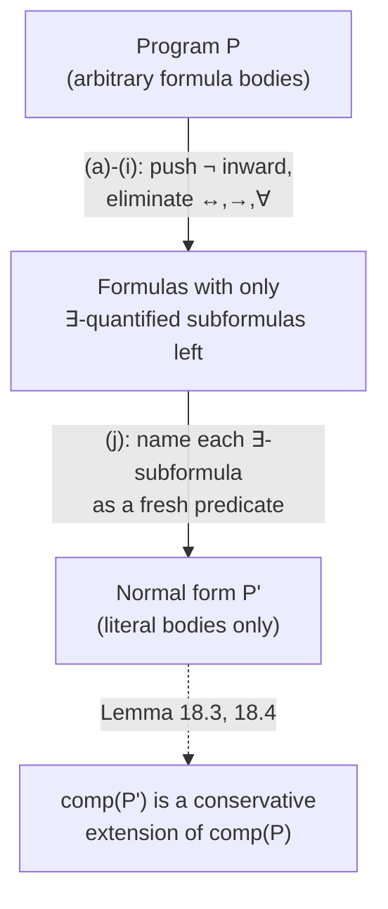

[[book-guidelines|↩ Back to guidelines]]

## Why stop at literals?

[[Negation-in-Logic-Programs]] extended definite programs to allow *literals* (atoms and negated atoms) in a clause body. But once you've accepted negation in bodies at all, restricting bodies to a flat conjunction of literals starts to look arbitrary — why not allow a clause body to be *any* first-order formula, with quantifiers and arbitrary boolean structure? Lloyd's answer in this chapter is that there's no good theoretical or practical reason not to, and this generalization is exactly the one a real specification language (contracts, invariants) needs: nobody wants to hand-flatten `∀z (member(z,y) ← member(z,x))` into clausal normal form by hand every time they write a `subset` predicate.

```prolog
well_ordered(X) :- ∀Z (hasleastelt(Z) :- set(Z) ∧ Z⊆X ∧ nonempty(Z)).
nonempty(Z) :- ∃U U∈Z.
hasleastelt(Z) :- ∃U (U∈Z ∧ ∀V (U≤V :- V∈Z)).
```
This is the level of expressiveness a `requires`/`ensures` contract language *needs* — Hoare-style specifications routinely involve exactly this shape of nested quantifiers over auxiliary predicates, and a system that could only accept flat literal conjunctions would force the specification writer to manually pre-Skolemize and pre-clausify every contract before the tool could even parse it.

## Program statements and their completion

A **program statement** is $A \leftarrow W$ where $A$ is an atom and $W$ any first-order formula (possibly absent); a **program** is a finite set of these; a **goal** is $\leftarrow W$. The **completion** construction from [[Negation-in-Logic-Programs]] generalizes verbatim — replace "conjunction of literals" with "arbitrary $W_i$" in each definition's disjunct, still existentially closing over the clause's own local variables. **Level mappings, hierarchical, and stratified** programs generalize the same way (predicate levels compared via positive/negative *occurrence* in the arbitrary body $W$, rather than literal-by-literal), and **Proposition 17.3 / Corollary 17.4** re-derive monotonicity-per-stratum and the minimal-model existence result exactly as before. Nothing conceptually new happens here — the payoff of this section is that it shows the whole apparatus of chapter 3 was never really about *literals specifically*; literals were just the simplest case of "formula in a clause body," and the theory scales up cleanly.

## The real content: every program reduces to a normal program

The technical heart of this chapter is **Proposition 18.2**: any program can be mechanically rewritten, via ten local transformations (a)–(j), into a **normal form** — an ordinary literal-bodied normal program — that is *logically equivalent*, clause by clause, to the original. The transformations are De Morgan-style pushdown rules plus one genuinely new move for existential quantifiers:

- (a)–(i): push negation inward through $\land, \lor, \to, \leftrightarrow, \forall, \exists$, and eliminate double negation and universal quantification (turning $\forall x\, W$ into $\lnot\exists x\, \lnot W$, so only $\exists$ survives explicitly) — routine, but essential to get every formula into a shape where only $\exists$-quantified, literal-headed subformulas remain.
- (j), the interesting one: replace $A \leftarrow \cdots \land \lnot\exists x_1\ldots\exists x_n W \land \cdots$ by
  ```
  A :- ..., \+ p(y1,...,yk), ...
  p(y1,...,yk) :- ∃x1...∃xn W
  ```
  introducing a **fresh predicate symbol** $p$ named by the free variables $\vec y$ of the existential subformula. This is *exactly* Skolemization-adjacent naming, except it names the whole quantified subformula as a callable auxiliary predicate rather than eliminating the quantifier via a Skolem function — the existential simply becomes "solve $p$'s own clause and see if it succeeds," deferring the actual search to a fresh recursive call instead of trying to eliminate it syntactically.

**Termination is proved by a well-founded multiset ordering** on formula complexity (Lloyd defines $\mu(\text{atom}) = 1$, $\mu(\lnot V) = \mu(\exists x\, V) = \mu(V) + 1$, $\mu(V \land W) = \mu(V) + \mu(W)$, etc., and shows every transformation strictly decreases the resulting multiset under the well-founded ordering from [[SLD-Resolution]]'s §16 hierarchical-completeness proof). **This is the same proof technique as proving a term-rewriting system terminates via a well-founded measure/reduction order** — if you've proved strong normalization for a small calculus by exhibiting a measure that strictly decreases with each reduction step, you've already done the proof-theoretic move Proposition 18.2 makes here, just for a rewrite system whose "terms" are formulas and whose "reductions" are the ten transformations (a)–(j).



## Why "conservative extension," not "logically equivalent," is the precise claim

The subtlety Lloyd is careful about (Lemmas 18.1, 18.3, 18.4) is that the transformed program $P'$ is *not* literally the same theory as $P$ — it has extra predicate symbols ($p, q, \ldots$ from transformation (j)) that don't appear in $P$ at all. What's actually proved is that $\mathrm{comp}(P')$ is a **conservative extension** of $\mathrm{comp}(P)$: any closed formula built only from $P$'s *original* predicate symbols is a logical consequence of $\mathrm{comp}(P')$ iff it's a logical consequence of $\mathrm{comp}(P)$. This is precisely the standard of correctness you want for a compiler pass that introduces fresh intermediate names (auxiliary predicates, SSA temporaries, ANF-introduced let-bindings): *the extension must not change what's provable/observable about the original vocabulary*, even though it's free to add new internal machinery. Theorem 18.6/18.7 (soundness of negation-as-failure and SLDNF-resolution *for programs*) and Theorem 18.9 (hierarchical completeness, generalized) are then proved by literally *running the machinery of chapter 3 on the normal form* and pulling the result back through the conservative-extension lemma — a clean, general instance of "prove a property for a rich language by compiling to a simpler language you've already verified, then transport the result back."

## Grounding: this is a CNF/Skolemization compiler pass

```rust
// Transformation (j) as an actual compiler pass — this IS how a Horn-clause
// verification-condition generator handles a nested-quantifier contract:
// name the quantified subformula, emit it as its own clause, replace the
// occurrence with a call.
enum Formula {
    Atom(Atom),
    Not(Box<Formula>),
    And(Box<Formula>, Box<Formula>),
    Or(Box<Formula>, Box<Formula>),
    Exists(Vec<Var>, Box<Formula>),
    Forall(Vec<Var>, Box<Formula>),
}

// Transformation (j): lift a negated-existential subformula out into a
// fresh named predicate, exactly as a CPS/ANF transform lifts a nested
// expression into a fresh let-binding.
fn skolemize_named(neg_exists: &Formula, fresh: &mut impl FnMut() -> String) -> (Atom, Clause) {
    if let Formula::Not(inner) = neg_exists {
        if let Formula::Exists(vars, body) = inner.as_ref() {
            let free_vars = free_variables(body, vars);
            let name = fresh();
            let call = Atom { pred: name.clone(), args: free_vars.clone() };
            let aux_clause = Clause { head: call.clone(), body: (**body).clone() };
            return (call, aux_clause);
        }
    }
    unreachable!()
}
```

**In Lean**, transformation (j)'s "name the existential as a fresh predicate, defer to a recursive call" move is structurally the same trick as introducing an **auxiliary lemma or a local `have`/`let` binding** to name a witness-search subgoal instead of inlining an existential proof obligation directly — and more precisely, it's the propositional-logic shadow of what a **tactic-mode `obtain`/Skolem-witness extraction** does: turn "$\exists x, P\ x$" from something you must directly exhibit into something you can *name and reason about abstractly*, deferring the actual construction. The conservative-extension guarantee (Lemma 18.4) is exactly the property Lean's own elaborator needs whenever it introduces a fresh auxiliary definition during elaboration (an `axiom`-free helper lemma, an autogenerated match-compiler auxiliary function) — the new artifact must not change what's provable in the original signature, only add internal scaffolding.

## Where this leads

- **Directly load-bearing:** this transformation is the closest thing in the book to your compiler's own **verification-condition generation** pass — taking a rich contract language (arbitrary quantifier nesting) and lowering it to the flat literal-bodied Horn-clause form your CHC solver actually consumes, while proving (via a conservative-extension argument, not naive syntactic equivalence) that the lowering doesn't change what's provable about the source-level predicates.
- [[Declarative-Error-Diagnosis]] is built directly on top of this chapter's machinery — the error diagnoser's "connected positively/negatively" reachability analysis and its soundness/completeness proofs are stated for arbitrary programs precisely because this chapter already established that arbitrary programs behave exactly like normal programs, once you go through the transformation.
- The well-founded-multiset termination proof for the ten transformations is a template worth remembering any time your own compiler needs to prove a rewrite-to-normal-form pass terminates — measure formula/term complexity, show every rule strictly decreases it under a well-founded order, done.
