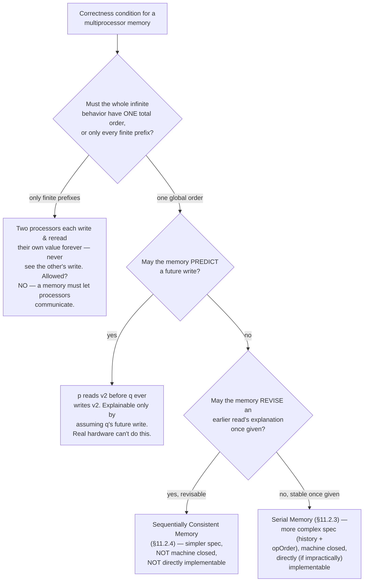

# Advanced Specification Examples

[[book-guidelines|↩ Back to guidelines]]

Chapter 11 is Lamport's demonstration chapter: having spent ten chapters teaching the *mechanics* of TLA+, he now shows what happens when you point the same small toolkit — sets, functions, records, `choose`, actions, fairness — at problems that look like they need something fancier. The chapter has two genuinely separate halves, and it's worth keeping them separate in your head:

1. **Data-structure modules with no variables** (§11.1) — graphs, differential equations, BNF grammars. These are *pure mathematics*, reusable across any specification, and their difficulty is entirely in finding the right representation, not in modeling a system.
2. **A high-level system-correctness problem** (§11.2) — what does it even *mean* for a multiprocessor memory to be correct? This is where the chapter earns the name "advanced": getting the *statement* of correctness right turns out to be harder than implementing anything.

Both halves share a moral: TLA+ has no library of pre-built data types, so every "advanced" example is really an exercise in *representation design* — deciding what a graph, a derivative, a grammar, or a memory's history *is*, as a set-theoretic value — after which the definitions tend to fall out almost mechanically. That decision is where the real intellectual work lives, and it's the thread running through all five subtopics below.

---

## 1. Local definitions: keeping a module's plumbing invisible

Before building any of these modules, Lamport addresses a hygiene problem you'll hit the moment you write a reusable module: auxiliary helper operators leak.

**What breaks without this.** Suppose you write a `DifferentialEquations` module whose only operator anyone should call is `Integrate`. Internally, `Integrate` needs helpers like `Nbhd` (a neighborhood of a point) and `IsDeriv` (an inductively-defined "is the $n$th derivative of" predicate). If another module does `EXTENDS DifferentialEquations` and *also* happens to define its own `Nbhd` for something unrelated, TLA+'s "no redeclaration in scope" rule collides — the module fails to parse, for a reason that has nothing to do with anyone's actual specification.

The fix is the `local` modifier: `LOCAL Foo(x) == ...` makes `Foo` usable inside the defining module but invisible to anything that `EXTENDS` or `INSTANCE`s it. It applies to definitions and to `INSTANCE` statements (`LOCAL INSTANCE Naturals` pulls in `+`, `-`, etc. for internal use only) but *not* to `CONSTANT`/`VARIABLE` declarations or to bare `EXTENDS` — those always propagate. The discipline Lamport recommends: in a module of general-purpose operators, make everything local except what a caller would actually expect to find. `Sequences` exports `Append`; it doesn't export the arithmetic it borrowed from `Naturals` to define `Append` — that's `LOCAL INSTANCE Naturals` under the hood.

This is a small point mechanically, but it is exactly the reason the three data-structure modules below (`Graphs`, `DifferentialEquations`, `BNFGrammars`) can each be dropped into an arbitrary specification via `EXTENDS` without namespace collisions — every name inside them except the one or two operators you actually want (`Integrate`, `LeastGrammar`, the graph predicates) is `local`.

---

## 2. Specifying data structures: graphs

### The representation decision comes first

TLA+ gives you sets, functions, records, and tuples — full stop. There is no built-in graph type, so "specify a graph" really means: *pick a set-theoretic encoding, then define everything else in terms of it.* This is the recurring shape of §11.1, and graphs are the cleanest illustration.

Lamport's decisions, in order:
- **Directed, not undirected, as the primitive.** Define undirected graphs *as* directed graphs with symmetric edges — an undirected graph is a directed graph $G$ such that $\langle m,n\rangle \in G.edge \Rightarrow \langle n,m\rangle \in G.edge$. One representation, one family of operators; undirectedness becomes a predicate, not a separate type.
- **A graph as a record**, not an ordered pair. A mathematician writes $G = \langle N, E\rangle$; Lamport writes $G$ as $[\,node \mapsto N,\, edge \mapsto E\,]$, because `G.node` reads better than `G[1]`. This is a recurring style point in the book: prefer named fields to positional tuples whenever a value has fixed, meaningful components.
- **"Is-a-graph" predicates, not "the set of all graphs."** You might expect a set `Graph` such that `G \in Graph` means "$G$ is a graph." But Section 6.1's Russell's-paradox discussion rules this out for anything with unbounded structure — there is no set of *all* directed graphs (over all possible node sets), for the same reason there's no set of all sets. So instead of a membership test against a universal collection, you get a predicate:

$$
\mathit{IsDirectedGraph}(G) \;\triangleq\; \bigl(G = [\,node \mapsto G.node,\, edge \mapsto G.edge\,]\bigr) \;\wedge\; \bigl(G.edge \subseteq G.node \times G.node\bigr)
$$

The first conjunct is a type-shape check (does $G$ have exactly these two fields?); the second says edges only connect declared nodes.

### The reusable predicate vocabulary

Once `IsDirectedGraph` exists, everything else is built compositionally:

| Operator | Meaning |
|---|---|
| `DirectedSubgraph(G)` | the set of all subgraphs of `G` |
| `IsUndirectedGraph(G)` | `IsDirectedGraph(G)` plus edge-symmetry |
| `Path(G)` | all node-sequences obtainable by following edges (a single node counts as a length-1 path) |
| `AreConnectedIn(m, n, G)` | $\exists$ a path in `Path(G)` from `m` to `n` |
| `IsStronglyConnected(G)` | every node reaches every other node |
| `IsTreeWithRoot(G, r)` | `G` is directed, every edge points child→parent, no node has two parents, every node reaches `r` |

Notice the design pattern: `DirectedSubgraph` (a *set-valued* operator) is defined directly, and then `IsDirectedSubgraph(H, G) \triangleq H \in DirectedSubgraph(G)` would be nearly free — but the reverse direction is awkward, because turning a predicate into "the set of things satisfying it" requires a `CHOOSE` over an unbounded quantification (`CHOOSE S : ∀ H : (H ∈ S) ≡ IsDirectedSubgraph(H,G)`), which TLA+'s "no set of all graphs" restriction makes suspect. **Lesson: when a family (subgraphs, subtrees, sublanguages) can be defined directly as a set-builder expression, do that — don't define the predicate first and try to derive the set from it.** This exact tension resurfaces, sharpened, in the BNF grammar section below.

`Path(G)` is worth a second look because it shows the "represent a sequence as a function" machinery from earlier chapters doing real work:

$$
\mathit{Path}(G) \;\triangleq\; \{\, p \in \mathit{Seq}(G.node) : p \neq \langle\rangle \;\wedge\; \forall i \in 1\,..\,(\mathit{Len}(p)-1) : \langle p[i], p[i+1]\rangle \in G.edge \,\}
$$

A path is a nonempty sequence of nodes where consecutive elements are joined by an edge — nothing here needed a "path" primitive, because sequences (themselves functions with domain $1\,..\,n$) already carry the ordering structure a path needs.

### Grounding: graphs as data, predicates as functions

The record-of-sets representation and its predicates translate almost verbatim into Rust, and the exercise is a good one for calibrating how much TLA+'s untypedness is doing for it versus how much a real type system would do for you instead:

```rust
use std::collections::HashSet;

#[derive(Clone)]
struct DirectedGraph<N: Eq + std::hash::Hash + Clone> {
    node: HashSet<N>,
    edge: HashSet<(N, N)>,
}

impl<N: Eq + std::hash::Hash + Clone> DirectedGraph<N> {
    // In TLA+, IsDirectedGraph(G) is a runtime-checkable predicate because
    // TLA+ has no static types. In Rust, the struct's field types already
    // rule out "edges pointing to non-nodes" being expressible at all —
    // the only residual check is the *set-membership* half.
    fn is_well_formed(&self) -> bool {
        self.edge.iter().all(|(m, n)| self.node.contains(m) && self.node.contains(n))
    }

    fn is_undirected(&self) -> bool {
        self.is_well_formed()
            && self.edge.iter().all(|(m, n)| self.edge.contains(&(n.clone(), m.clone())))
    }

    fn are_connected(&self, m: &N, n: &N) -> bool {
        // AreConnectedIn as reachability search — TLA+'s Path(G) existential
        // becomes an actual BFS, because we want an algorithm, not just a
        // truth value pulled out of an unbounded quantifier.
        let mut frontier = vec![m.clone()];
        let mut seen: HashSet<N> = frontier.iter().cloned().collect();
        while let Some(cur) = frontier.pop() {
            if &cur == n { return true; }
            for (a, b) in &self.edge {
                if a == &cur && !seen.contains(b) {
                    seen.insert(b.clone());
                    frontier.push(b.clone());
                }
            }
        }
        false
    }
}
```

This is the difference between a *specification* and an *implementation* in miniature: `AreConnectedIn(m, n, G)` in TLA+ is a **statement about the existence** of a path — `∃ p ∈ Path(G) : ...` — with no computational content whatsoever. TLC (the model checker) will happily enumerate `Path(G)` to evaluate it on finite state spaces, but the mathematical *meaning* of the operator doesn't care whether that's tractable. The Rust version has to actually *compute* connectivity, which is why it's a graph-search algorithm rather than a one-line existential. This gap — between "true because such a `p` exists" and "true because I found `p`" — is precisely the gap between a spec's correctness condition and an implementation's algorithm, which is the master theme of §11.2 below.

**Lean angle:** `IsStronglyConnected` and `IsTreeWithRoot` are exactly the kind of set-theoretic predicate that, ported into Lean, becomes a `Prop`-valued function rather than a computable `Bool` — `AreConnectedIn` as stated (`∃ p, ...`) is non-constructive/classical unless you separately prove decidability or exhibit an algorithm, which mirrors TLA+'s own indifference to computability. If your compiler's abstract-interpretation layer ever needs a "does an over-approximated points-to graph stay acyclic" or "is this control-flow graph reducible" check, this is the right mental model: state the property as a `Prop` first (as TLA+ does), and only afterward ask whether you need a decision procedure for it — this is also the split between the **static-analysis** focus area's abstract lattices (which need efficiently *computable* joins) and its soundness *arguments* (which are allowed to be existential, `Prop`-shaped statements about what the analysis is supposed to approximate).

---

## 3. Solving differential equations in TLA+

### Why this section exists at all

This subtopic already made a cameo in [[Real-Time-Specification|Real-Time Specification]] as the payoff for hybrid-system modeling — `Integrate` is what lets a real-time spec describe a continuously-varying physical quantity (e.g. a thermostat's temperature) rather than only discrete events. Here we treat it as what it actually is on its own terms: a case study in expressing nontrivial real-analysis inside a language whose only primitives are sets, functions, and quantifiers.

**What breaks without this.** TLA+ has no calculus. There is no `d/dt` operator, no built-in notion of "solution to a differential equation." If Lamport wants `Integrate(D, t0, t1, ⟨x0,...,xn-1⟩)` — "the value at time $t_1$ of the solution to $D[t, x, x', \ldots, x^{(n)}] = 0$ whose derivatives at $t_0$ are $x_0,\ldots,x_{n-1}$" — to be a legitimate TLA+ expression, he needs to build the entire apparatus (derivative, $n$th derivative, existence-and-uniqueness assumption) out of `CHOOSE` and quantifiers over functions.

### Building "derivative" from nothing

The construction is bottom-up:

1. **`Nbhd(r, e)`** — the open interval $(r-e, r+e)$, defined via `OpenInterval` and the `Real` set from the standard `Reals` module.
2. **`IsFirstDeriv(df, f)`** — the classical $\varepsilon$-$\delta$ definition of the derivative, transcribed almost line-for-line into predicate logic:

$$
\forall \varepsilon \in \mathit{PosReal} : \exists \delta \in \mathit{PosReal} : \forall s \in \mathit{Nbhd}(r,\delta)\setminus\{r\} : \frac{f[s]-f[r]}{s-r} \in \mathit{Nbhd}(df[r], \varepsilon)
$$

   quantified over all $r$ in the (assumed open) domain of $f$. Notice this is a *relation between two functions* `df` and `f`, not a computation — TLA+ never computes a derivative, it only ever checks (existentially, over all $\varepsilon,\delta$) whether one function *is* the derivative of another.
3. **`IsDeriv(n, df, f)`** — the $n$th derivative, defined by ordinary (non-mutual) recursion on $n$ using a local `LET`-bound helper `IsD`: the base case `IsD[0, g] = (g = f)`, the step case existentially quantifies an intermediate function `gg` that is the $(n-1)$th derivative while `g` is `gg`'s first derivative.
4. **`Integrate` itself** — `CHOOSE`s a function `g` (packaging $f$ and its first $n$ derivatives together as `g[0], g[1], ..., g[n]`) satisfying: (a) each `g[i]` really is the $i$th derivative of `g[0]`, (b) the differential equation $D[\,\cdot\,] = 0$ holds pointwise on some open interval around $[a,b]$, and (c) the initial derivative values at `a` match `InitVals`. The result is $[i \in 1\,..\,n \mapsto g[i-1][b]]$ — the tuple of derivative values at `b`.

The subtlest engineering move is in step 4's third bullet: rather than writing the differential equation as "$D$ applied to $t, f(t), f'(t), \ldots$" (which would need the informal "…" the way an $n$-ary function application does), Lamport builds the argument tuple explicitly as a function: `⟨r⟩ ∘ [i ∈ 1..(n+1) ↦ g[i-1][r]]`, a sequence concatenation. This is the same "tuples are functions, concatenation is defined on functions" machinery from Chapter 5 (§5.4) resolving what looks like new syntax into an instance of something already defined.

### Grounding: existence without an algorithm

This is a topic where forcing a direct Rust translation would be misleading — Rust code that "solves" a differential equation is a numerical approximation algorithm (Runge–Kutta, Euler's method), which is a *completely different mathematical object* from `Integrate`. `Integrate` doesn't compute anything; it names the unique value that a `CHOOSE` over an existence-and-uniqueness assumption picks out. The honest Rust [[Elementary-Mathematical-Foundations-for-Specification#Grounding|grounding]] is to show *why* the gap exists:

```rust
// This is NOT a translation of Integrate — it's what you'd write if you
// actually needed a *computable* stand-in. Integrate's specification says
// nothing about step size, numerical error, or termination; a real
// implementation has to commit to all three.
fn euler_step(f: impl Fn(f64, f64) -> f64, t: f64, x: f64, h: f64) -> f64 {
    x + h * f(t, x) // one step of x' = f(t, x)
}
```

Comparing the two makes the point precisely: `Integrate` is *underspecified relative to any implementation* on purpose — it fixes the mathematical answer and leaves every algorithmic question (which numerical method, what tolerance) unaddressed, because those are implementation choices a correctness specification for a hybrid system shouldn't have to make.

**Lean angle — this is the load-bearing connection.** `Integrate`'s `CHOOSE` is doing exactly what Lean's `Classical.choose` does when you write `noncomputable def solution := Classical.choose (exists_unique_solution D a b InitVals)`: both are Hilbert's $\varepsilon$-operator, picking a witness out of a nonempty (here, existence-and-uniqueness-assumed) set without providing a construction. If your refinement-type compiler ever needs to admit a specification that asserts "there exists a value satisfying property $P$" as a *type-checked but non-computable* term — e.g. a postcondition stated via an existential over real analysis, or a Hoare-style `ensures` clause too complex to discharge automatically — this is the precedent: TLA+ and Lean converge on the same move (a description operator over an assumed-nonempty set) for exactly the same reason, namely that *stating* a property correctly and *computing* a witness for it are genuinely separate problems, and a trusted kernel is allowed to accept the former without demanding the latter.

---

## 4. BNF grammars as TLA+ modules

### The mathematization problem

BNF is normally *metasyntax* — a notation for describing other languages, sitting one level above the object language, itself informally defined. Lamport's exercise (motivated by wanting to use TLA+ to specify TLA+'s own grammar, in Chapter 15) is to give BNF an honest set-theoretic meaning *inside* TLA+, so that a grammar becomes an ordinary mathematical value rather than a piece of notation you reason about only informally.

**What breaks without this.** Without a formal semantics, "the grammar generates the language" is just an intuition pump — fine for a human reading a BNF block, useless for a tool. If Chapter 15 wants to formally state "this parser accepts exactly the strings the grammar generates," "the grammar" needs to *be* something — a value with a determinate identity — not a diagram.

### The representation: a grammar as a function from strings to languages

The key move, and the one worth internalizing: **the meaning of a nonterminal is the language it generates.** So a grammar is a function $G$ where $G[\text{"expr"}]$ *is* the set of all sentences the `expr` production generates. Since TLA+ functions need a fixed domain, and we don't want to enumerate every nonterminal name in advance, $G$'s domain is the entire set `STRING`, with $G[s] = \{\}$ for any $s$ that isn't an actual nonterminal of this grammar:

$$
\mathit{Grammar} \;\triangleq\; [\mathit{STRING} \to \mathit{SUBSET}\ \mathit{Seq}(\mathit{STRING})]
$$

A *sentence* is a sequence of lexemes (strings); a *language* is a set of sentences; a *token* is a one-lexeme sentence. Terminals are built with $\mathit{tok}(s) \triangleq \{\langle s\rangle\}$ (the single-token set containing just the token made from `s`) and $\mathit{Tok}(S) \triangleq \{\langle s\rangle : s \in S\}$ (a whole set of terminals at once). Two operators do the heavy lifting for productions:

$$
L \mathbin{\&} M \;\triangleq\; \{s \circ t : s \in L,\ t \in M\} \qquad L \mid M \;\triangleq\; L \cup M
$$

— concatenation of languages and union of languages, respectively (`|` reuses BNF's own alternation symbol). With these, a production like `def ::= ident == expr` becomes the TLA+ formula

$$
G.def \;=\; \mathit{ident} \mathbin{\&} \mathit{tok}(\text{"=="}) \mathbin{\&} G.expr
$$

— a genuine equation between two sets, not a rewriting rule.

### The hard part: what does the grammar's own "smallest" mean?

Here's where the section becomes a real exercise in mathematization rather than transcription. A recursive production like

$$
\mathit{expr} ::= \mathit{ident} \mid \mathit{expr}\ op\ \mathit{expr} \mid (\ \mathit{expr}\ ) \mid \mathtt{LET}\ \mathit{def}\ \mathtt{IN}\ \mathit{expr}
$$

translated directly gives you a formula $P(G)$ that $G$ must satisfy — but $P(G)$ typically has *many* solutions. (Take any grammar satisfying $P$ and throw in extra garbage sentences for `expr`; if consistent, it still satisfies the equation.) The grammar you actually want is the **smallest** $G$ satisfying $P$ — the one containing exactly the sentences forced by the productions and nothing else. This is precisely the least-fixed-point construction familiar from denotational semantics and Datalog/Constrained-Horn-Clause solving: a monotone operator (here, "apply the productions once") has a least fixed point, and that fixed point is "the" grammar.

Lamport expresses this directly with `CHOOSE` over an explicit minimality condition, rather than via an explicit fixed-point operator:

$$
\mathit{LeastGrammar}(P(\underline{\ \ })) \;\triangleq\; \mathrm{CHOOSE}\ G \in \mathit{Grammar} : P(G) \;\wedge\; \bigl(\forall H \in \mathit{Grammar} : P(H) \Rightarrow \forall s \in \mathit{STRING} : G[s] \subseteq H[s]\bigr)
$$

"the $G$ satisfying $P$ that is a subset (pointwise, on every nonterminal) of every other grammar satisfying $P$." This sidesteps ever computing the fixed point iteratively (which TLA+, being a specification language, has no obligation to do) — it just asserts the least element exists and names it.

### Grounding: least fixed points, computed for real

This is the single strongest connection in the chapter to the reader's CSP/CHC project, because `LeastGrammar` *is* the specification of what a Datalog engine or CHC solver computes operationally by monotone fixpoint iteration:

```rust
use std::collections::{HashMap, HashSet};

type Sentence = Vec<String>;
type Language = HashSet<Sentence>;

// A grammar as an *actual* finite map, standing in for TLA+'s
// [STRING -> SUBSET Seq(STRING)] restricted to the nonterminals that matter.
type Grammar = HashMap<String, Language>;

// One application of the productions: given the current (under-)approximation
// of each nonterminal's language, compute what each production would add.
// This is exactly the "immediate consequence operator" T_P of Datalog/CHC
// least-model semantics — apply P once, monotonically grow every G[s].
fn apply_productions(g: &Grammar, productions: &dyn Fn(&Grammar) -> Grammar) -> Grammar {
    let mut next = g.clone();
    let delta = productions(g);
    for (nonterminal, sentences) in delta {
        next.entry(nonterminal).or_default().extend(sentences);
    }
    next
}

// LeastGrammar(P) computed operationally: iterate the monotone operator
// from the empty grammar until it stops growing (a fixpoint — guaranteed
// to terminate on finite languages by the Knaster–Tarski theorem, the same
// theorem underwriting CHC solvers' least-model computation).
fn least_grammar(productions: &dyn Fn(&Grammar) -> Grammar) -> Grammar {
    let mut g: Grammar = HashMap::new();
    loop {
        let next = apply_productions(&g, productions);
        if next == g { return g; }
        g = next;
    }
}
```

The direct payoff for the standing project: your CSP kernel's abstract-data-structure domains (described in the workbench learning goals as "automata/DFA-like" domains) and your abstract interpreter's invariant-generation loop are *both* instances of this same pattern — start from the empty (or top) approximation, apply a monotone step operator, iterate to a fixed point. `LeastGrammar` is the cleanest possible illustration of that pattern with all the abstract-interpretation machinery (widening, lattices) stripped away, because a language's subset lattice under $\subseteq$ has no infinite ascending chains to worry about here (finite grammars, no widening needed) — it's the "hello world" of least-fixed-point construction, directly relevant to the **SAT/SMT/CSP** focus area's Constrained Horn Clauses and to the **static-analysis** focus area's Galois-connection/lattice reasoning.

**Lean angle:** `LeastGrammar` as a `CHOOSE` over a minimality predicate is one more `Classical.choose`-shaped construction, but it's also expressible *constructively* in Lean via an inductive definition (`inductive Generates : String → Sentence → Prop`) whose introduction rules mirror the productions directly — worth noting as a contrast: TLA+ reaches for `CHOOSE`-over-minimality because it has no native notion of "inductively defined set," while Lean's `inductive` keyword *is* exactly a least-fixed-point definition, built into the kernel rather than assembled by hand. Seeing the TLA+ version spelled out this explicitly is a good way to appreciate what `inductive` is quietly doing for you.

---

## 5. Multiprocessor memory correctness conditions

This is the chapter's centerpiece, and the one with the deepest payoff for the automated-reasoning side of the standing project: it's a worked example of *how hard it is to correctly state a high-level correctness property*, using nothing but history variables, invariants, and fairness — the exact toolkit Hoare-logic-style verification-condition generation depends on.

### 5.1 The interface: multiple outstanding requests

Chapter 5's linearizable-memory example (§5.3) let each processor have at most one outstanding request — realistic for a textbook example, unrealistic for an actual out-of-order multiprocessor, which issues several memory operations before any of them complete. Chapter 11 redoes the interface to allow this. Each processor `p` gets a set `Reg` of registers; a register holds a record with `adr` (address), `val` (value), and `op` (`"Rd"`, `"Wr"`, or `"Free"`) fields. To issue a request, a processor sets a free register's `op`/`adr`(/`val`, for writes); the memory responds by resetting `op` to `"Free"` (and, for reads, filling in `val`). The state is `regFile : [Proc → [Reg → RegValue]]`, and `RegFileTypeInvariant` is exactly the "type as invariant" idiom from Chapter 3, applied to this richer record shape.

### 5.2 Three independent design decisions

Section 5.3's correctness condition — "the result is as if all operations executed in some sequential order, each between its request and response, respecting each processor's own issue order" — turns out to hide three genuinely independent modeling choices, each with a scenario that forces the decision:



Working through these scenario-by-scenario (rather than trying to nail the definition down in one shot) is itself the methodological point of §11.2.2: **high-level correctness conditions are validated by adversarial scenario analysis, not by writing a formula that "looks right."** This is the same discipline a Hoare-triple postcondition needs — you don't trust a `requires`/`ensures` pair until you've tried to construct a program that satisfies the syntax of the contract while violating its intent.

### 5.3 The serial memory: history variables as a general technique

Once "no prediction, no revision" is chosen, Lamport introduces a technique that generalizes far beyond memory specs: **encode the entire history of what's happened as an internal variable, then state safety as an invariant over that history.**

Concretely: `opQ[p]` is a sequence recording every operation processor `p` has ever issued, tagged with its request, completion status, and (for a completed read) a `source` field naming *which write explained its value* (or the special value `InitWr` for "read the initial memory contents"). A second variable `opOrder` — a relation on operation identifiers — accumulates the ordering commitments the memory has made so far, and can only grow monotonically (`opOrder ⊆ opOrder'`).

The state predicate `Serializable` is the crux:

$$
\mathit{Serializable} \;\triangleq\; \exists R \in \mathit{totalOpOrder} : \; \mathit{opOrder} \subseteq R \;\wedge\; (\text{per-processor order respected}) \;\wedge\; (\text{every read's source is the latest preceding write to its address})
$$

— "there exists *some* total order extending what we've committed to so far that would correctly explain everything." This is asserted as an invariant of every reachable state (via a general trick: make every action's definition conjoin an `UpdateOpOrder` clause requiring `Serializable'` to hold in the successor state, which is the $\mathit{Init} \Rightarrow \mathit{Inv}$, $\mathit{Inv} \wedge [\mathit{Next}]_v \Rightarrow \mathit{Inv}'$ inductive-invariant proof pattern from Chapter 5 §5.7, applied here as a *specification-construction* technique rather than a *proof-obligation* it — build the spec so the invariant is true by inspection of each action, instead of writing an unconstrained spec and separately proving an invariant about it).

Liveness needs two separate fairness conditions, and getting the second one right is a genuine landmine the text calls out explicitly: a naive `∀ oi, oj ∈ opId : (oi ≠ oj) ⇒ WF(...)` is *vacuously true*, because `∀ x ∈ S : F` unfolds to `∀x : (x ∈ S) ⇒ F`, and a bare (non-temporal) predicate inside a temporal formula is evaluated only in the *initial* state — where `opId` is empty, so the implication is trivially satisfied and the fairness condition never actually constrains anything. The fix is to fold the membership test *inside* the fairness-guarded action itself:

$$
\forall oi, oj \in [\mathit{proc} : \mathit{Proc}, \mathit{idx} : \mathit{Nat}] : (oi \neq oj) \Rightarrow WF_{\langle\ldots\rangle}\bigl(oi \in \mathit{opId} \wedge oj \in \mathit{opId} \wedge \mathit{Internal} \wedge (\langle oi,oj\rangle \in \mathit{opOrder}' \vee \langle oj,oi\rangle \in \mathit{opOrder}')\bigr)
$$

This is a sharp, easy-to-miss bug pattern worth internalizing on its own: **quantifying a fairness condition over a state-dependent set is not the same as quantifying it over a fixed constant set**, because the quantifier's bounding predicate gets evaluated at the *wrong time* (the initial state) unless you push it inside the temporal operator.

### 5.4 The sequentially consistent memory: a simpler, non-implementable spec

Dropping the "no revision" requirement — allowing the memory to change its mind about which write explained a given read, so long as it's still consistent with everything currently known — produces a *much* simpler specification (module `InnerSequential`): `opQ` again records issued operations, but a `RespondToRd` action can return **any** value from `Val` whatsoever, with no `source`/`goodSource` bookkeeping at all. The catch is entirely pushed into liveness: an `Internal` action can only remove a completed read from `opQ` once the value it returned actually matches the internal `mem` at that point, and weak fairness on `RemoveOp` forces this to eventually happen for every operation.

This specification is *not machine closed* (§8.9.2's notion, revisited here): a direct implementation can "paint itself into a corner" — return an arbitrary value for a read, only to discover no consistent explanation for it will ever materialize, at which point the specification's safety and liveness requirements become jointly unsatisfiable from that point on. The reason is structural: the liveness condition (`WF` on `RemoveOp`) is not a fairness condition on a *subaction of `Next`* — `RemoveOp` is more restrictive than what `Next` allows, since `Next` permits removing a read regardless of whether its returned value was later validated. **A specification is only guaranteed machine closed when its liveness conjuncts are fairness on genuine subactions of the next-state relation** — violate that (as here, deliberately) and you get a specification that is correct as a *description of the desired behavior set* but useless as a *target for an implementer to build toward directly*.

### 5.5 Comparing the three memories

| | Correctness condition | Machine closed? | Directly implementable? |
|---|---|---|---|
| **Linearizable** (Ch. 5, §5.3) | Each op's effect occurs at some instant between its request and response | Yes | Yes — trivially, with one central memory |
| **Serial** (§11.2.3) | Serializable per-processor total order; no prediction, no revision; history-tracked via `opQ`/`opOrder` | Yes | Yes, in principle — but requires an infeasible search over total orderings |
| **Sequentially consistent** (§11.2.4) | Same total-order requirement, but the memory *may* revise which write explains a past read | **No** | **No** — would require guessing correct values in advance |

This table is really a map of a single underlying tradeoff: **the more "generous" a correctness condition is about how the memory may reach its explanation, the simpler the specification can be — but generosity about *how* can silently smuggle in an assumption about *when*, and a spec that says "eventually consistent with *something*" without committing early enough is a spec no algorithm can satisfy online.** Lamport's own gloss (§11.2.5) is blunt about the moral for the working spec-writer: "a non-machine-closed specification can occasionally be the simplest way to express what you want to say" — simplicity of the formula and implementability of the formula are not the same virtue, and a high-level correctness spec is allowed to prioritize the former while a lower-level implementation spec must never sacrifice the latter.

These three conditions are also the textbook trio from the concurrency literature, and it's worth naming the standard vocabulary explicitly since Lamport's own terms don't always match: his **linearizable memory** is *Herlihy & Wing's linearizability* (real-time order preserved, single global order); his **serial memory** matches **serializability** in the database sense (a total order consistent with per-transaction/per-processor order exists, but not required to respect real time across processors); and his **sequentially consistent memory** is exactly **Lamport's own 1979 sequential consistency** (a total order consistent with each processor's program order, full stop — no real-time constraint at all), here given a from-scratch TLA+ specification decades after he first defined the property informally.

### Grounding: verification conditions and trusted-kernel discipline

The `Serializable`/history-variable technique is not just a TLA+ trick — it's the same discipline underlying runtime linearizability checkers (e.g. the Wing–Gong / Lowe-style algorithms Jepsen-adjacent tools implement): record a history of operations with timestamps, then search for *some* consistent total order. In Rust terms, the "does a consistent explanation exist" check is a constraint-satisfaction search over a partial order's linear extensions — precisely CSP-kernel territory:

```rust
// A completed operation in the history — the Rust analog of an opQ entry.
struct Op { proc: usize, addr: u64, is_write: bool, value: u64 }

// Checking "Serializable" for a finite history is: does there exist a total
// order extending opOrder (partial, from real-time non-overlap) such that
// every read's value equals the most recent preceding write to its address?
// This is exactly a constraint-satisfaction search over linear extensions
// of a partial order — the same shape of problem your CSP kernel's
// counterexample search needs to solve, just specialized to one domain.
fn is_serializable(history: &[Op], partial_order: &[(usize, usize)]) -> bool {
    // A real checker performs a backtracking search (or reduces to SAT) over
    // permutations respecting `partial_order`; sketched here as a search stub.
    unimplemented!("linear-extension search — the CSP-style backtracking core")
}
```

**Automated-reasoning connection, named explicitly.** The proof obligation Lamport builds into every action of `InnerSerial` — "assume `Serializable` holds now; show the action's successor state still satisfies `Serializable'`" — is the *inductive invariant* discipline (Chapter 5 §5.7, `Init ⇒ Inv`, `Inv ∧ [Next]_v ⇒ Inv'`) doing double duty as a **verification-condition generator**: each action's definition *is* a hand-discharged VC for the property it's meant to preserve. This is the load-bearing precedent for your compiler's Hoare-contract / Horn-clause invariant generation — the difference is only that your abstract interpreter will need to *discover* an inductive invariant like `Serializable` automatically (via widening/narrowing over an abstract domain) rather than have a human hand-derive it the way Lamport does here. The machine-closure distinction (§5.4 above) is the corresponding **trusted-kernel** lesson: a specification (or a Horn-clause system) can be *sound as a description* while being *underivable as a proof obligation an automated procedure can actually discharge* — recognizing that gap early, the way Lamport does explicitly for the sequentially-consistent memory, is exactly the discipline that separates a specification your solver can act on from one it can only state.

---

## Where this leads

Chapter 11's two halves feed different parts of the book (and of the standing project) going forward:

- The **data-structure modules** (graphs, `Integrate`, `BNFGrammars`) are infrastructure: `BNFGrammars` in particular is reused wholesale in Chapter 15 to give TLA+'s own concrete syntax a formal semantics — a nice closing loop where the language specifies itself using techniques it teaches for specifying anything else. The `LeastGrammar`/least-fixed-point pattern is the cleanest available bridge in this book to CHC solving and Datalog-style invariant generation, worth returning to whenever the CSP kernel's fixed-point iteration needs a clean textbook antecedent.
- The **multiprocessor memory case study** is the book's fullest demonstration that *getting a high-level correctness condition right is a research problem, not a formalization exercise* — and it sets up exactly the vocabulary (machine closure, history variables, inductive invariants used as a spec-construction discipline) that the rest of the book leans on whenever it needs to argue a specification is trustworthy rather than merely well-typed. For the automated-reasoning and SAT/SMT/CSP focus areas specifically, this section is the strongest direct precedent in the whole book for what an automatically-discovered inductive invariant needs to look like, and for why a solver's underlying logic must be checked for machine closure (can every proof obligation actually be discharged online?) before its "soundness" claim means anything operationally.
