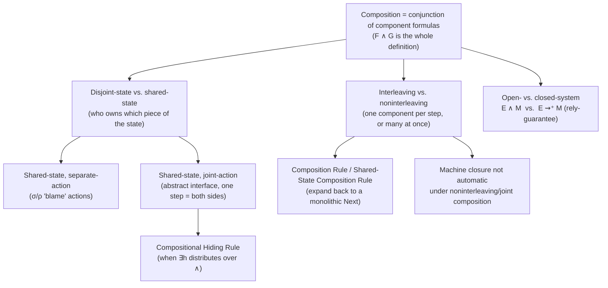

[[book-guidelines|↩ Back to guidelines]]

# Composing Specifications

## The problem: a specification is a formula about the whole universe

Every specification you've written so far — the hour clock, the channel, the FIFO, the caching memory — has been one monolithic next-state action: a single disjunction where each disjunct is, informally, "the sender does something" or "the buffer does something" or "the receiver does something." Nothing in the *language* forced that shape on you. It's just been convenient to write the components' behavior as branches of one formula rather than as separate formulas glued together afterward.

This chapter asks: what if you wrote the components as genuinely separate specifications — separate modules, separate formulas, possibly written by different people or reused off the shelf — and then combined them into a system spec afterward? To answer that you first need to pin down what "combining specifications" even *means* mathematically, because until now you've never had to.

Here's the move that makes everything in this chapter fall out cleanly. Section 2.3 already established that a behavior is not really "the system's history" — it's a history of the *entire universe*, of which the system you care about is a small, causally-isolated part. A specification $F$ doesn't say "the system behaves like this"; it says "the universe is one in which the system behaves correctly," i.e. $F$ carves out the set of universe-histories in which your system is well-behaved. Building a system that satisfies $F$ means constructing the tiny part of the universe the specification actually constrains — the rest of the universe just has to go on existing.

Now: what does it mean to compose two systems, one specified by $F$ and the other by $G$? It means constructing a universe that satisfies *both* — which is precisely the universe satisfying $F \land G$. That's the entire definition:

$$\textbf{Composing specifications } F \text{ and } G \text{ means forming } F \land G.$$

**What breaks without this framing.** If you tried to define composition operationally — "run the components' transition systems in parallel, merging their state spaces" — you'd need a whole new semantic apparatus on top of TLA, and you'd have to re-derive, case by case, whether that operational merge actually respects stuttering-invariance, hiding, and liveness. Because TLA specifications are just formulas of ordinary logic, "compose" is *already defined*: it's $\land$. Every subtlety in this chapter — interleaving, shared state, joint actions, hiding, open systems — is really just "what does conjunction of two of these particular formula-shapes look like once you expand it out," not a new primitive operation.

Lamport is upfront that most of the time, composing is not worth doing: the composed and monolithic versions of a spec differ by a handful of lines out of what might be a thousand-line specification. This chapter is about the situations — reusing an existing module, or writing a genuine open-system contract — where it *is* worth it, and about the vocabulary you need to reason precisely about the tradeoffs once you do it.

## 10.1 — Composing two specifications, and the interleaving/noninterleaving axis

### Worked example: two independent hour clocks

Take the plain hour-clock specification from Chapter 2, with next-state action $HCN(h) \triangleq h' = (h \bmod 12) + 1$, so a single clock is $(hr \in 1\,..\,12) \land \Box[HCN(hr)]_{hr}$. Now specify a system of *two* independent, unsynchronized clocks, displayed by variables $x$ and $y$, simply by conjoining two copies:

$$\mathit{TwoClocks} \;\triangleq\; \big[(x \in 1\,..\,12) \land \Box[HCN(x)]_x\big] \;\land\; \big[(y \in 1\,..\,12) \land \Box[HCN(y)]_y\big]$$

The book carries out the algebra of pushing this into the ordinary "one monolithic next-state action" shape you're used to, using the tautology $\Box(F \land G) \equiv \Box F \land \Box G$ and the definition of the bracket notation $[N]_v \triangleq N \lor v' = v$. The result:

$$\mathit{TwoClocks} \;\equiv\; (x \in 1\,..\,12) \land (y \in 1\,..\,12) \;\land\; \Box\big[\; HCN(x) \land HCN(y) \;\lor\; HCN(x)\land(y'=y) \;\lor\; HCN(y)\land(x'=x)\;\big]_{\langle x,y\rangle}$$

Look at the first disjunct: $HCN(x) \land HCN(y)$ — **both clocks advancing in the same step.** Nothing in the conjunction $TwoClocks$ forbids this; each conjunct individually only says "if $x$ changes, it changes via $HCN$," not "$x$ changes and $y$ doesn't." This is the crucial discovery of the section, and it's worth sitting with because it's counter-intuitive if you're coming from an interleaving-only mental model of concurrency (the kind most programmers default to): **plain conjunction of two component specs, with no extra glue, gives you a specification that allows simultaneous multi-component steps** — a step is a mathematical abstraction, not a claim about physical exclusivity.

### Naming the axis: interleaving vs. noninterleaving

Every specification you'd written up to this chapter — the FIFO's Sender/Buffer/Receiver disjunction, for instance — happened to be **interleaving**: each nonstuttering step is an action of exactly one component, never two at once. $\mathit{TwoClocks}$, as derived above, is **noninterleaving**: it permits a step that's simultaneously an action of both clocks.

$$\textbf{Interleaving: } \forall \text{ nonstuttering steps, exactly one component acts.} \qquad \textbf{Noninterleaving: allows simultaneous multi-component steps.}$$

**What breaks if you conflate these.** If you're building a lower-level implementation of an interleaving spec, and your implementation's composed formula turns out noninterleaving (because you forgot to rule out the simultaneous-step disjunct), your implementation formula will *not* imply the higher-level spec — it permits behaviors the abstract spec disallows. Implementation is logical implication (see [[Refinement-and-Implementation]]), and $\mathit{Impl} \Rightarrow \mathit{Spec}$ fails the moment $\mathit{Impl}$'s behavior set isn't a subset of $\mathit{Spec}$'s. So this classification isn't academic bookkeeping — it directly determines whether a composition can serve as an implementation.

To *force* an interleaving composition, you have two options, both used constantly in practice:

1. **Make each component's next-state action assert the other components' variables don't change.** For the two clocks: define $HCN_x \triangleq HCN(x) \land (y' = y)$ and $HCN_y \triangleq HCN(y) \land (x' = x)$, then compose $(x \in 1\,..\,12) \land \Box[HCN_x]_x$ with $(y \in 1\,..\,12) \land \Box[HCN_y]_y$. Re-running the same expansion shows the simultaneous-step disjunct $HCN_x \land HCN_y$ is now subsumed by (implied to be impossible alongside) the separate disjuncts, because $HCN_x \land HCN_y$ would force both $x'=x$ and $y'=y$ — contradicting $HCN(x)$'s requirement that $x$ actually change. This is the *general* recipe: give component $k$'s next-state action $N_k$ the extra conjunct "every other component's variables are unchanged."
2. **Conjoin an explicit global interleaving assumption** rather than baking it into each component: $\mathit{TwoClocks} \land \Box[(x'=x) \lor (y'=y)]_{\langle x,y\rangle}$ — "every step leaves $x$ or $y$ (or both) unchanged." This is weaker coupling: the components' own specifications stay ignorant of each other, and a single external conjunct enforces interleaving.

Both routes generalize to any pair of components with variable tuples $v_1, v_2$ (and disjoint state, i.e. $v$ is exactly $v_1$ concatenated with $v_2$):

$$\big(I_1 \land \Box[N_1]_{v_1}\big) \land \big(I_2 \land \Box[N_2]_{v_2}\big) \;\equiv\; I_1 \land I_2 \;\land\; \Box\Big[\, N_1 \land N_2 \;\lor\; N_1 \land (v_2'=v_2) \;\lor\; N_2 \land (v_1'=v_1) \,\Big]_v$$

This is the general shape underlying $(10.1)$ in the book — a two-component instance of the Composition Rule that follows below.

**[[Elementary-Mathematical-Foundations-for-Specification#Grounding|Grounding]] (Rust).** The cleanest way to internalize this is to think of each component spec as a *predicate over pairs of states* (a step relation), not a state-machine object. Composing two independently-typed step-relation predicates via logical AND is exactly what you'd write if you modeled `type StepRelation<S> = Fn(&S, &S) -> bool` and combined two of them with a closure `|s, s2| n1(s, s2) && n2(s, s2)`: the AND admits any pair of states related by *both* predicates, including one where both changed. To force interleaving in Rust terms, you'd have each predicate explicitly check that the *other* component's slice of the state is unchanged — precisely option 1 above, and precisely the shape you'd want if you were building an LTL/TLA-style model checker's transition-relation combinator.

**Grounding (Python).** A five-line illustration for a model-checker sketch: if `step_x(s, s2)` and `step_y(s, s2)` are boolean-valued Python predicates over `(state, next_state)` pairs, `compose = lambda s, s2: step_x(s, s2) and step_y(s, s2)` is already the noninterleaving composition; `interleaved = lambda s, s2: compose(s, s2) and (s.x == s2.x or s.y == s2.y)` layers on the global interleaving constraint from option 2, in code that maps almost line-for-line onto the TLA+.

## 10.2 — Composing many specifications: the Composition Rule

The two-component case generalizes to any index set $C$ of components. Since $\forall$ generalizes $\land$, the natural generalization of the two-clock calculation is:

> **Composition Rule.** For any set $C$, if $(\forall k \in C : v_k' = v_k) \equiv (v' = v)$ — i.e. $v$ is unchanged exactly when every component's private state $v_k$ is unchanged — then
> $$\big(\forall k \in C : I_k \land \Box[N_k]_{v_k}\big) \;\equiv\; \Big(\forall k \in C : I_k\Big) \land \Box\Big[\; \big(\exists k \in C: N_k \land \forall i \ne k : v_i'=v_i\big) \;\lor\; \big(\exists i,j \in C : i\ne j \land N_i \land N_j \land F_{ij}\big)\;\Big]_v$$
> for some actions $F_{ij}$ (which describe what happens when components $i$ and $j$ act simultaneously).

The second disjunct — the simultaneous-action term — is redundant (and can be dropped, yielding an interleaving spec) precisely when each $N_i$ *implies* $v_j$ is unchanged for every $j \ne i$. Note the price: for $N_i$ to imply that, $N_i$'s formula must actually *mention* $v_j$ — every component's action has to talk about every other component's variables staying put. If that feels philosophically wrong (a component's spec shouldn't need to know about its siblings) or just verbose, the alternative is the same escape hatch as before: drop the interleaving requirement from every $N_i$ and instead conjoin one global assumption

$$\Box\big[\exists k \in C : \forall i \in C\setminus\{k\} : v_i' = v_i\big]_v$$

— "some component acts alone" — as a free-standing structural conjunct, not attached to any one component's spec.

### Worked example: an array of clocks, and the $IsFcnOn$ subtlety

Suppose the system is a set $\mathit{Clock}$ of independent clocks whose displays live in a single array-valued variable $hr$, so clock $k$'s state is $hr[k]$:

$$\mathit{ClockArray} \;\triangleq\; \forall k \in \mathit{Clock} : (hr[k] \in 1\,..\,12) \land \Box[HCN(hr[k])]_{hr[k]}$$

This is already noninterleaving (different clocks can tick simultaneously) — nothing rules that out. Now try to apply the Composition Rule to turn this into a monolithic spec over the single variable $hr$. The rule's hypothesis needs "$hr$ unchanged iff every $hr[k]$ unchanged" — but this is *false* as stated, for a subtle and important reason: specifying every $hr[k]'$ pointwise does not pin down $hr'$ as a value. It doesn't even guarantee $hr$ *is a function* at all. (This is the same gap flagged in §6.5: constraining a function pointwise is strictly weaker than defining its value directly.) The fix is to substitute for $v$ not $hr$ itself but the derived state function

$$\mathit{hrfcn} \;\triangleq\; [k \in \mathit{Clock} \mapsto hr[k]]$$

which equals $hr$ *exactly when* $hr$ happens to be a function with domain $\mathit{Clock}$ — a fact that has to be asserted separately, e.g. by conjoining $\Box\,\mathit{IsFcnOn}(hr, \mathit{Clock})$ where $\mathit{IsFcnOn}(f,S) \triangleq f = [x \in S \mapsto f[x]]$, treated as a *global constraint*, not belonging to any one component.

**What breaks without this care.** Without the $IsFcnOn$ conjunct (or the $\mathit{hrfcn}$ substitution), $\mathit{ClockArray}$ permits behaviors where every $hr[k]$ ticks correctly but $hr$ *itself* does something arbitrary between steps — a stuttering step for every clock could coincide with $hr$ silently mutating into a non-function value. This is a genuinely easy trap: you can write down each component's local behavior perfectly and still have said nothing about the shape of the variable that's supposed to aggregate them, because TLA+ never assumes a variable is a function just because you index into it with `[k]`.

To make $\mathit{ClockArray}$ *interleaving*, define $N_k$ using `EXCEPT`, again requiring $hr$ (or $\mathit{hrfcn}$) to actually be a function:

$$N_k \;\triangleq\; hr' = [hr \;\texttt{EXCEPT}\; ![k] = (hr[k] \bmod 12) + 1]$$

**Grounding (Lean).** $\mathit{IsFcnOn}(f, S) \triangleq (f = [x \in S \mapsto f[x]])$ is the TLA+ untyped-set-theory version of a much more familiar Lean fact: a `Finset`-indexed family `f : α → β` is *automatically* total and function-shaped by its very type — Lean's type system enforces `IsFcnOn` for free at the level of `Function` values, whereas TLA+, being untyped set theory where a "function" is just a set of ordered pairs satisfying a property, has to assert function-ness as an ordinary invariant. This is a recurring theme worth internalizing for a dependently-typed compiler: *the properties a type system gives you as a static, structural guarantee, an untyped logic must instead state and prove as an ordinary reachable-state invariant* — the exact same distinction that will resurface when you decide which invariants your refinement-type elaborator can discharge purely from well-formedness versus which need a real proof obligation.

## 10.3 — The FIFO: a worked noninterleaving composite spec

The book now composes the Chapter 4 FIFO — Sender, Buffer, Receiver — from three genuinely separate component specifications, rather than reusing the old monolithic `InnerFIFO` module (which can't be reused directly, since its actions all mention the Buffer's hidden internal variable $q$, which must not leak into the Sender's or Receiver's specs).

The state is partitioned by component:

- **Sender:** $\langle in.val, in.rdy \rangle$
- **Buffer:** $\langle in.ack, q, out.val, out.rdy \rangle$
- **Receiver:** $\langle out.ack \rangle$

Each component's next-state action reuses `Send`/`Rcv` actions instantiated from the `Channel` module, which apply `EXCEPT` to the channel record — and `EXCEPT` only ever applies to functions, so the spec needs a global structural conjunct

$$\Box\big(\mathit{IsChannel}(in) \land \mathit{IsChannel}(out)\big), \qquad \mathit{IsChannel}(c) \triangleq c = [ack \mapsto c.ack,\, val \mapsto c.val,\, rdy \mapsto c.rdy]$$

asserting the channels are always well-formed records — the exact same $IsFcnOn$-flavored discipline from §10.2, now applied to records (which, recall, *are* functions whose domain is a fixed set of field-name strings).

The internal Buffer variable $q$ is hidden using the by-now-familiar wrapping-submodule idiom (§4.3): $q$ is declared in a submodule, instantiated with a parametrized instance $\mathit{Buf}(q)$, and existentially quantified away — $\mathit{Buffer} \triangleq \exists q : \mathit{Buf}(q)!\mathit{InnerBuffer}$.

### Where do cross-component initial conditions go?

The original `InnerFIFO` initial predicate required $in.ack = in.rdy$ and $out.ack = out.rdy$ — but each of these mixes fields that "belong" to different components (the Sender writes $in.val/in.rdy$, the Buffer reads $in.ack$; symmetrically for $out$). The book identifies three legitimate ways to handle a requirement spanning multiple components' initial states:

1. **Assert it redundantly in every relevant component's initial predicate** — symmetric, but wasteful.
2. **Arbitrarily assign it to one component** — implicitly makes that component "responsible" for the requirement holding.
3. **State it as a free-standing conjunct belonging to neither component** — implicitly frames it as an assumption about how the pieces are wired together, not a requirement either side must independently satisfy.

Lamport picks option 3 for the FIFO, adding $(in.ack = in.rdy) \land (out.ack = out.rdy)$ as a bare conjunct. This choice isn't cosmetic — §10.7 shows that once you move to an *open-system* (contractual) specification, options 2 and 3 become formally different: assigning a requirement to a component makes that component's contract responsible for it, while a free conjunct sits outside anyone's contract.

The resulting `CompositeFIFO.Spec` is explicitly **noninterleaving**: it permits a single step that is simultaneously an $InChan!Send$ step (Sender acts) and an $OutChan!Rcv$ step (Receiver acts) — so it is *not* equivalent to the interleaving `FIFO.Spec` from Chapter 4, which forbids such simultaneous steps. This is a concrete, worked instance of the interleaving/noninterleaving distinction from §10.1 actually biting: two specifications of "the same" FIFO buffer, differing only in this one axis, are logically inequivalent formulas.

## 10.4 — Composition with shared state

Everything above was **disjoint-state**: each component owns a distinct slice of the total state, and only that component's action ever changes it. Section 10.4 addresses what happens when a piece of state can't be partitioned that way.

$$\textbf{Disjoint-state: the state partitions into per-component pieces, each changed only by its owner.} \qquad \textbf{Shared-state: some state piece can be changed by more than one component's steps.}$$

### 10.4.1 — Explicit state changes: blaming a shared variable on "not me"

Simplify the FIFO picture to a Sender and Receiver communicating through a shared sequence-valued variable $\mathit{buf}$ directly (no separate Buffer component object): Sender appends, Receiver removes from the head. In a monolithic spec, $Next \triangleq \mathit{Sndr} \lor \mathit{Rcvr}$, where

$$\mathit{Sndr} \triangleq \big[\mathit{buf}' = \mathrm{Append}(\mathit{buf}, \dots) \land \mathit{SComm} \land \mathrm{UNCHANGED}\ r\big] \lor \big[\mathit{SCompute} \land \mathrm{UNCHANGED}\ \langle \mathit{buf}, r\rangle\big]$$

and symmetrically for $\mathit{Rcvr}$ with $\mathrm{Tail}$, $\mathit{RComm}$, $r$. The trick for splitting this into two component specs, each with a next-state action over just its own private state plus the shared $\mathit{buf}$, is:

$$N_S \triangleq \mathit{Sndr} \lor (\sigma \land s'=s) \qquad\qquad N_R \triangleq \mathit{Rcvr} \lor (\rho \land r'=r)$$

Read $\sigma$ as "a change to $\mathit{buf}$ not caused by the Sender" and $\rho$ as "a change to $\mathit{buf}$ not caused by the Receiver" — i.e. each component's spec must explicitly account for the *other* component's legitimate changes to the shared variable by naming them and asserting its own private state is unaffected by them. This works — the conjunction $\Box[N_S]_{\langle buf,s\rangle} \land \Box[N_R]_{\langle buf,r\rangle}$ collapses back to $\Box[\mathit{Sndr}\lor\mathit{Rcvr}]_{\langle buf,s,r\rangle}$ — provided $\sigma, \rho$ satisfy three obligations:

1. Any append to $\mathit{buf}$ is not caused by the Receiver ($\forall d : \mathit{buf}'=\mathrm{Append}(\mathit{buf},d) \Rightarrow \rho$).
2. Any removal from the head of $\mathit{buf}$ is not caused by the Sender ($\mathit{buf} \ne \langle\rangle \land \mathit{buf}'=\mathrm{Tail}(\mathit{buf}) \Rightarrow \sigma$).
3. A step caused by neither leaves $\mathit{buf}$ unchanged ($\sigma \land \rho \Rightarrow \mathit{buf}'=\mathit{buf}$).

The strongest (most specific) choice makes $\sigma, \rho$ describe *exactly* the other component's legal moves: $\sigma \triangleq \mathit{buf}\ne\langle\rangle \land \mathit{buf}'=\mathrm{Tail}(\mathit{buf})$, $\rho \triangleq \exists d : \mathit{buf}'=\mathrm{Append}(\mathit{buf},d)$ — but any weakening consistent with obligation 3 (e.g. $\rho \triangleq \lnot\sigma$) also works; the choice is stylistic, not semantic.

**What breaks without naming $\sigma$/$\rho$ explicitly.** If a component's next-state action only ever describes its *own* changes to $\mathit{buf}$ and stays silent about the other's, then — under the bracket-action semantics $[N]_v \triangleq N \lor v'=v$ — the *silence itself* asserts $\mathit{buf}$ doesn't change on that component's turn, which directly contradicts the fact that the other component legitimately does change it. You'd get an inconsistent (unsatisfiable, or wrongly restrictive) composition. This is the shared-state analogue of the disjoint-state requirement that each $N_k$ assert other components' variables are unchanged — except now, since the variable genuinely *is* touched by others, the assertion has to be "here's exactly what those other legitimate changes look like" rather than a flat "unchanged."

This generalizes to the **Shared-State Composition Rule** for a set $C$ sharing a variable $w$ (with $\mu_k$ meaning "a change to $w$ attributable to some component other than $k$", $v_k$ the private state of $k$, $v$ their concatenation):

> Given (1) $v$ unchanged iff every $v_k$ unchanged, (2) $N_k$ (for $k\ne i$) leaves $v_i$ unchanged, (3) any $w$-changing $N_k$ step is a $\mu_i$ step for every other $i$, and (4) $w$ is unchanged iff every $\mu_k$ holds — then
> $$\Big(\forall k\in C : I_k \land \Box[N_k \lor (\mu_k \land v_k'=v_k)]_{\langle w,v_k\rangle}\Big) \;\equiv\; \Big(\forall k\in C: I_k\Big) \land \Box\big[\exists k\in C : N_k\big]_{\langle w,v\rangle}$$

Condition (2) is precisely what makes this an *interleaving* composition; drop it and the equivalence can fail — but the left side, if each $N_k$ correctly pins down its own private state, remains a *sensible* (if noninterleaving) specification even then.

### 10.4.2 — Joint actions: when the shared piece can't be blamed on anyone

Sometimes the shared variable isn't a concrete data structure like a queue — it's an abstract interface variable whose meaning is deliberately left unspecified, and the previous technique breaks down entirely. The linearizable memory of Chapter 5 is exactly this case: communication over $\mathit{memInt}$ happens via unspecified operators $\mathrm{Send}(p,d,\mathit{memInt},\mathit{memInt}')$/$\mathrm{Reply}(\dots)$ declared as constant parameters. You have no idea what $\mathit{memInt}$ even looks like as a value, so you can't write "$\sigma$ describes exactly the environment's legal changes to it" — you don't know what those changes look like syntactically.

The resolution is a **joint action**: a single step counted as belonging to *both* components at once, rather than assigned to one and merely tolerated by the other.

$$\textbf{Joint action: one step, attributed simultaneously to two (or more) components — the fundamental unit is shared, not split.}$$

Concretely, the environment (processors) and memory each get a next-state action mentioning the *same* $\mathrm{Send}/\mathrm{Reply}$ calls:

$$N_M \triangleq \exists p \in \mathit{Proc} : \mathit{MRqst}(p) \lor \mathit{MRsp}(p) \lor \mathit{MInternal}(p) \qquad\qquad N_E \triangleq \exists p \in \mathit{Proc} : \mathit{ERqst}(p) \lor \mathit{ERsp}(p)$$

A processor sending a request is represented as one step that is *both* an $\mathit{MRqst}(p)$ step (from the memory's perspective) *and* an $\mathit{ERqst}(p)$ step (from the environment's perspective) — the same $\mathrm{Send}$ call appears verbatim in both actions' definitions. Since $\mathit{ctl}$ (the memory's ready/busy bookkeeping) is an internal memory variable that the environment isn't allowed to see, the environment needs its *own* variable $\mathit{rdy}[p]$ to track whether $p$ may issue a new request — a genuinely new piece of state introduced *purely because* the joint-action decomposition needs each side to independently track that the shared communication happened.

**What breaks without the extra `rdy` variable.** If the environment tried to reuse the memory's internal `ctl[p] = "rdy"` as its own enabling condition, it would be referring to a variable that, once you hide the memory's internals, no longer exists in the environment's own specification — the environment's action must be self-contained in terms of variables it's actually allowed to mention. This is the general cost of joint actions the book flags explicitly: decomposing via joint actions can force you to introduce bookkeeping variables that wouldn't be needed in a monolithic or disjoint-state spec, purely to let each side independently "remember" that the shared event occurred.

**Grounding (Rust).** A joint action is structurally the same idea as a **rendezvous / synchronous channel handshake** (à la CSP or Go's unbuffered channels): neither side's local transition alone determines whether the communication happens — the step only exists in the composed system when *both* sides' guards line up simultaneously. If you were modeling this as a product of two labeled transition systems, a joint action is a *synchronized* transition (shared label, both automata must have an outgoing edge on that label and take it together), in contrast to an *interleaved* transition (unshared label, only one automaton moves per step) — exactly the vocabulary used in classical process-algebra composition (CSP/CCS-style parallel composition with synchronization sets).

## 10.5 — A brief review: three independent classification axes

Having built up all three composition styles concretely, the book pins down the taxonomy explicitly. There are **three separate axes**, and (with one exception) they vary independently:

| Axis | One extreme | Other extreme |
|---|---|---|
| **Interleaving** | Every nonstuttering step is exactly one component's action | Simultaneous multi-component steps allowed |
| **State partitioning** | Disjoint-state: state splits cleanly, each piece owned by one component | Shared-state: some state piece changeable by more than one component |
| **Action structure** | Separate-action: no step is required to be a joint step | Joint-action: some step is *required* to be simultaneous across components |

The one dependency: **a joint-action specification is necessarily noninterleaving** (a required simultaneous step is, by definition, not "exactly one component acting"). Every other combination is free — you can have shared-state, interleaving, separate-action specs (§10.4.1's Sender/Receiver, forced interleaving); disjoint-state, noninterleaving specs ($\mathit{TwoClocks}$); and so on.

Two practical takeaways the book draws out:

- **Interleaving vs. noninterleaving is mostly a matter of taste** — with one real constraint: if you want a lower-level spec to *implement* a higher-level interleaving one, the lower-level spec must itself be interleaving, because a noninterleaving spec's simultaneous-step behaviors are never a subset of an interleaving spec's behaviors (a noninterleaving formula permits strictly more behaviors along this axis, so implication can fail purely on this ground, independent of anything else about the specs). Converting noninterleaving into interleaving is mechanical — conjoin the global "only one component acts" assumption from §10.1/§10.2.
- **Joint actions arise almost exclusively from abstracting away two-step communication into one.** Real communication takes two physical events (one side writes, the other later reads); an abstract interface variable like $\mathit{memInt}$ collapses that into a single instantaneous mathematical step — "a fiction that does not exist in the real world," in the book's own words — and because both sides must remember the fiction occurred, the fictional single step has to touch both sides' private state at once. This is exactly the diagnostic to use when deciding whether you *need* joint actions: ask whether your interface variable represents an instantaneously-collapsed two-step interaction. If yes, joint actions are probably unavoidable without adding an explicit intermediate "in transit" state to the interface itself.

## 10.6 — Liveness, machine closure, and hiding under composition

### 10.6.1 — Composition doesn't preserve machine closure for free

For an interleaving composition — where each component contributes $S_k \land L_k$ ($S_k$ safety, $L_k$ liveness, both machine closed) — machine closure of the whole (§8.9.2's requirement that fairness be stated only on subactions of the overall next-state action) usually survives, because each component's action $N_k$, under the standard interleaving discipline (implying other components' variables unchanged), is automatically also a subaction of the composed next-state action.

That guarantee **evaporates for noninterleaving, and especially joint-action, compositions.** The book's worked counterexample reuses the Zeno hour-clock pathology from Chapter 9 — $HC \land \mathit{RTBound}(hr'=hr{-}1, hr, 0, 3600) \land \mathit{RTnow}(hr)$ — reread here as a *three-component joint-action composition*: (1) the clock $HC$, (2) a hidden timer, joined to the clock via actions changing both $hr$ and the timer simultaneously, and (3) real time $\mathit{RTnow}(hr)$, joined to the timer via actions changing both the timer and $\mathit{now}$ simultaneously. Each of the three, considered alone, is trivially machine closed (the first two assert no liveness at all; the third's safety part can always be extended to satisfy its own liveness). But the *composite* is Zeno — not machine closed — precisely because the joint actions couple the timer's ticking to $hr$'s ticking to $now$'s advance in a way that lets an adversarial scheduling of "legal" component-level choices starve real time from ever crossing certain thresholds. **The moral: machine closure is not compositional in general — it has to be checked at the level of the whole composed formula whenever joint actions are involved, not assumed from the components' individual good behavior.**

### 10.6.2 — Compositional Hiding Rule

Recall from §4.3/§9.1 that hiding an internal variable uses temporal $\exists$: $\exists h : S$. The natural question here: if $S \equiv S_1 \land S_2$, can $\exists h : S$ *itself* be re-expressed as a conjunction of two separately-hidden component specs?

**If $h$ is genuinely shared state** — accessed by both $S_1$ and $S_2$ in a way that couples them — the answer is flatly **no**: two components communicating through $h$ cannot each internalize $h$ independently, because doing so would sever the very channel they use to coordinate. This is the intuitive core of the rule, worth internalizing before the algebra: **hiding distributes over conjunction only when there was never any real coupling through the hidden variable in the first place.**

The trivial case: if $h$ occurs only in $S_2$, then $\exists h : (S_1 \land S_2) \equiv S_1 \land (\exists h : S_2)$ — ordinary quantifier scoping, since $h$ is vacuous in $S_1$.

The more interesting case: $h$ occurs in *both*, but as genuinely separate, non-interacting "parts" — say $h$ is a record and $S_1$ only ever mentions $h.c1$ while $S_2$ only ever mentions $h.c2$. Then

$$\exists h : (S_1 \land S_2) \;\equiv\; (\exists h_1 : T_1) \land (\exists h_2 : T_2)$$

where $T_1$ is $S_1$ with $h_1$ substituted for $h.c1$ (and analogously $T_2$). This generalizes to any finite index set $C$:

> **Compositional Hiding Rule.** If $h$ does not occur in $T_i$, and $S_i$ is obtained from $T_i$ by substituting $h[i]$ for $q$, then
> $$\big(\exists h : \forall i \in C : S_i\big) \;\equiv\; \big(\forall i \in C : \exists q : T_i\big)$$
> for any finite $C$ (this fails for infinite $C$ in pathological, practically-irrelevant cases).

The hypothesis — "$h$ occurs in $S_i$ only via $h[i]$" — means the composition $\forall i \in C : S_i$ never determines $h$ as a whole function, only its individual components $h[i]$ (the exact $IsFcnOn$ situation from §10.2 again: you'd typically add $\Box\,IsFcnOn(h,C)$ separately if you wanted $h$ pinned down as a function).

There's a genuinely subtle refinement here worth flagging: even an *interleaving* composition where $S_i$ mentions $h$ via an `EXCEPT`-style update like $h' = [h\ \texttt{EXCEPT}\ ![i] = exp]$ (which syntactically mentions the *whole* $h$, not just $h[i]$) doesn't literally satisfy the rule's hypothesis — but you can rewrite $S_i$ into a version $\widehat{S_i}$ that only asserts $h'[i] = exp$ (and correspondingly weakens "unchanged" claims to "$h[i]$ unchanged"), producing a *noninterleaving* reformulation of the same components. That reformulation applies the rule cleanly, and — this is the nontrivial claim — **hiding erases the interleaving/noninterleaving distinction here**: once $h$ is quantified away, you can no longer tell from the outside whether two components' changes to $h$ happened in the same step or different steps, so $\forall i : S_i$ and $\forall i : \widehat{S_i}$ become equivalent *after* hiding even though they weren't before. This is a small but important lesson about hiding in general: **existential quantification over a variable doesn't just remove that variable from view — it can also erase distinctions (like step-granularity) that were only ever observable through that variable.**

## 10.7 — Open-system specifications: contracts under a misbehaving environment

Every specification written so far in the book is a **complete-system (closed-system) specification**: a behavior satisfies it only if *both* the system and its environment behave correctly. Written as a composition $E \land M$ (environment spec $E$, system/module spec $M$), this is satisfying only when both conjuncts hold.

### Why plain implication doesn't work as a contract

An **open-system specification** should instead serve as a genuine *contract* between an implementer (who builds $M$) and a user (who is expected, but not guaranteed, to behave like $E$): "if you, the environment, hold up your end, I, the system, will hold up mine." The system-alone spec $M$ can't be the contract — $M$ typically asserts the system behaves correctly *no matter what the environment does*, which is unimplementable in general (a FIFO buffer can't guarantee correct output if the sender scribbles a new value mid-acknowledgment; a real buffer would produce garbage, and rightly so, since the fault is the environment's).

The obvious next guess is $E \Rightarrow M$: "if the environment behaves, the system behaves." This is **too weak**, for a genuinely subtle reason worth sitting with. Consider a behavior where the *system itself* misbehaves first (say the buffer sends an unacknowledged value early), which then causes the environment (the receiver) to also misbehave in response. In this behavior, both $E$ and $M$ are false. But $E \Rightarrow M$ is *vacuously true* whenever $E$ is false — so this bad behavior, caused by the system's own fault, satisfies $E \Rightarrow M$ anyway. **A correctness contract should never certify a behavior as acceptable when the system was the one who broke it first.** Plain implication has no way to distinguish "environment broke the contract, so I owe nothing" from "I broke the contract, then blamed the environment's resulting confusion."

### The rely-guarantee operator $E \overset{+}{\leadsto} M$

The fix is a new temporal operator, informally: **$M$ must remain true at least one step longer than $E$ does — and forever, if $E$ never breaks.**

$$E \overset{+}{\leadsto} M$$

More precisely (the rigorous version is in §16.2.4):

1. $E$ implies $M$ (the ordinary case: if the environment behaves throughout, so must the system).
2. If $E$'s safety property has not yet been violated by the first $n$ states of a behavior, $M$'s safety property has not yet been violated by the first $n{+}1$ states, for every natural number $n$.

Condition (2) is the load-bearing one: it gives the system exactly **one extra step of grace** after the environment's first violation — enough to account for the fact that a violation is only *observed* one step after it's committed (the offending step is the transition *into* state $n$, so the system can only react starting at state $n{+}1$) — but no more. This is precisely the "system must behave correctly at least as long as the environment does" reading, made precise enough to rule out the earlier pathological behavior: if the system misbehaves *before* the environment does, $M$'s safety is violated at some point $n{+}1$ while $E$'s safety was already intact through $n$, which directly violates condition (2) — so that behavior no longer satisfies $E \overset{+}{\leadsto} M$. This operator is also called a **rely-guarantee** or **assume-guarantee** specification in the wider formal-methods literature — the system *relies* on $E$ and *guarantees* $M$ in return, and the "+one step" grace period is exactly what makes the guarantee causally honest about who broke the contract first.

### Turning a composite closed-system spec into an open one

Once you already have separate component specs (from earlier in the chapter), converting a complete-system spec into an open-system contract is mostly bookkeeping: decide which conjunct belongs to the environment, which to the system, and which belongs to neither — then replace the top-level $\land$ between the environment side and the system side with $\overset{+}{\leadsto}$.

Worked on the `CompositeFIFO` spec (buffer = system, sender+receiver = environment):

- $\mathit{Sender} \land \mathit{Receiver}$ — clearly environment.
- $\mathit{Buffer}$ — clearly system.
- $(in.ack{=}in.rdy) \land (out.ack{=}out.rdy)$ — split by "whoever sends on that channel is responsible for the channel starting well-formed": $in.ack{=}in.rdy$ assigned to the environment (the Sender writes on $in$), $out.ack{=}out.rdy$ assigned to the system (the Buffer writes on $out$).
- $\Box(\mathit{IsChannel}(in) \land \mathit{IsChannel}(out))$ — belongs to *neither*; it's a structural fact about how the model represents channels as records, not a behavioral obligation of either party, so it stays a bare conjunct outside the $\overset{+}{\leadsto}$.

Giving:

$$\Box(\mathit{IsChannel}(in)\land \mathit{IsChannel}(out)) \;\land\; \Big[(in.ack{=}in.rdy) \land \mathit{Sender} \land \mathit{Receiver}\Big] \overset{+}{\leadsto} \Big[(out.ack{=}out.rdy) \land \mathit{Buffer}\Big]$$

**The practical upshot the book stresses**: writing an open-system spec, once you've already decomposed into components, costs almost nothing extra over writing the closed-system composite — you do the same decomposition work either way, and the two specs differ only in the very last step of assembly (plain $\land$ versus $\overset{+}{\leadsto}$, plus the one-time decision of which initial conjuncts belong to which side). This is a genuinely different design goal from everything else in the chapter, though: interleaving/shared-state/joint-action choices are about how to *factor* a spec you already know the meaning of; open- vs. closed-system is about what kind of *promise* the resulting formula is allowed to make, and it only bites once you actually need the spec to serve as a contract that survives a badly-behaved environment.

*(A related but distinct problem — refining the interface variables themselves, e.g. turning a value-carrying channel into a bit-serial one — is §10.8's "interface refinement," covered in [[Refinement-and-Implementation]] rather than here, since it's really a refinement-mapping technique that happens to use the same existential-hiding idiom as composition.)*

## Where this leads

Composing specifications is, structurally, the same move you already know from ordinary logic — but this chapter shows how much precision is hiding underneath "just conjoin them": you must be explicit about simultaneity (interleaving), about who owns what state (disjoint vs. shared), about whether an interface event genuinely belongs to two components at once (joint actions), about whether machine closure survives the composition, about whether hiding can be pushed inward, and — if the spec is meant to be a contract rather than a description — about the causal asymmetry a plain $\Rightarrow$ can't express, which is exactly what $\overset{+}{\leadsto}$ fixes.

For the goals behind this vault (`automated-reasoning`): the Shared-State and Compositional Hiding Rules are a concrete, worked instance of *modular verification* — proving a global safety/liveness property by combining independently-established local properties of components, which is precisely the discipline a Hoare-logic-based verifier needs for procedure-modular reasoning (verify each function against its own contract, then compose contracts at call sites without re-verifying callees). The open-system operator $E \overset{+}{\leadsto} M$ is the temporal-logic ancestor of the same rely-guarantee idea that shows up in separation logic and in any verifier that needs to reason about a component under adversarial or under-specified callers — exactly the shape of contract a refinement-type checker's `requires`/`ensures` pair is meant to formalize, except stated over infinite behaviors rather than single procedure calls. And the recurring $IsFcnOn$/"pointwise constraint isn't the same as defining the value" trap is the same lesson your elaborator will hit whenever it needs to decide whether a set of constraints on a metavariable's *projections* actually pins down the metavariable itself.
