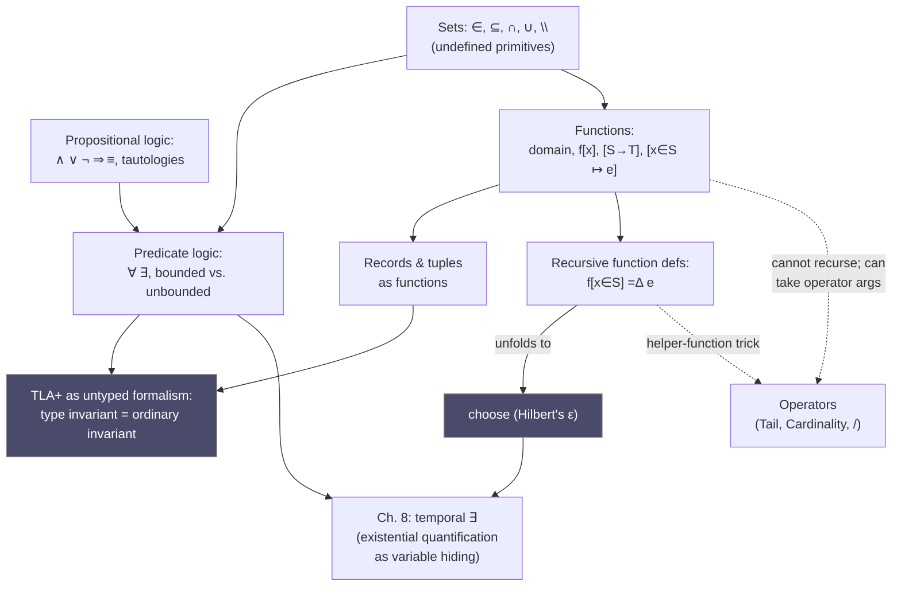

# Elementary Mathematical Foundations for Specification

[[book-guidelines|↩ Back to guidelines]]

## Why Lamport starts here

Most formal-methods languages invent new syntax to keep you honest — a type system, a resource calculus, a modal operator you've never seen. TLA+ makes the opposite bet: it uses almost nothing but the ordinary mathematics of logic, sets, and functions that any engineer half-remembers from a discrete-math course, plus one genuinely new ingredient (temporal logic, covered elsewhere) for describing *change over time*. Chapter 1 and Chapter 6 exist to make that bet cash out — to nail down precisely which fragment of "ordinary math" you actually need, since informal familiarity ("I know what a function is") hides exactly the corner cases (what's the domain of `/`? can you define two functions in terms of each other? what does `choose` return?) that a machine-checked specification cannot leave fuzzy.

This matters for more than TLA+. Everything in this article is the untyped, classical, ZF-flavored ancestor of ideas you'll meet again, sharpened, in a dependently-typed setting: functions with explicit domains prefigure `Π`-types; records-as-functions prefigure `Σ`-types (without the enforcement); recursive function definitions via `choose` are Hilbert's ε doing the job that a termination checker and a fixed-point operator jointly do in Lean; the function/operator split is the untyped shadow of the term/tactic (object-language/meta-language) split in any LCF-style kernel. Reading this chapter as "just review" would miss the point — read it as the *simplest possible setting* in which these distinctions must be made explicit.

## Propositional logic: the two-valued algebra

### First principles

Elementary algebra is the algebra of real numbers under `+`, `-`, `*`, `/`. Propositional logic is exactly analogous, except its universe of values has exactly two elements, `true` and `false`, and its operators are $\land$ (and), $\lor$ (or), $\lnot$ (not), $\Rightarrow$ (implies), and $\equiv$ (Boolean equality). Because there are only two values, the entire operator table is small enough to memorize outright — Lamport's point in opening the book this way is that propositional logic should feel *easier* than arithmetic, not harder, once you stop looking for hidden subtlety.

The one operator that reliably confuses people is $\Rightarrow$: why is $\mathit{false} \Rightarrow \mathit{true}$ and $\mathit{false} \Rightarrow \mathit{false}$ both defined to be `true`? The book's justification is semantic, not just definitional: we want $(n > 3) \Rightarrow (n > 1)$ to be true for *every* natural number $n$, including $n = 0$, where the antecedent is false. Vacuous truth isn't a technicality bolted onto material implication — it's forced by wanting implication to mean what "if...then" means when substituted with concrete values.

$$
\begin{array}{c|c|c}
F & G & F \Rightarrow G \\\hline
\text{true} & \text{true} & \text{true} \\
\text{true} & \text{false} & \text{false} \\
\text{false} & \text{true} & \text{true} \\
\text{false} & \text{false} & \text{true}
\end{array}
$$

A **tautology** is a propositional formula true under every assignment of truth values to its identifiers — e.g. $F \Rightarrow F \lor G$. The **truth table** is the decision procedure: enumerate all $2^n$ assignments for $n$ identifiers, evaluate the formula (and its subformulas) at each one, and check that the result column is all-true. This is exhaustive case analysis, nothing more — but it is also, not incidentally, the textbook-simplest instance of the decision problem that SAT solvers generalize: SAT asks for *some* satisfying assignment, tautology-checking asks whether *every* assignment satisfies (equivalently, whether the negation is unsatisfiable). Lamport even notes in passing that TLC (the model checker covered later in the book) can be pressed into service to verify tautologies mechanically — a two-line preview of "formal verification via exhaustive search," the theme the rest of the book develops at scale.

Precedence follows the pattern you'd expect from algebra: $\lnot$ binds tighter than $\land, \lor$, which bind tighter than $\Rightarrow, \equiv$; ordinary operators like `>` bind tighter than all of them. $\land$ and $\lor$ are associative and commutative, exactly like `+` and `*`, which licenses writing $F \land G \land H$ without parentheses.

### Grounding

In Rust, propositional logic *is* `bool` algebra — `&&`, `||`, `!` — but the useful correspondence is to a truth-table checker, since that's the actual algorithm the book is describing:

```rust
fn is_tautology(vars: usize, f: impl Fn(&[bool]) -> bool) -> bool {
    (0..1u32 << vars).all(|mask| {
        let assignment: Vec<bool> = (0..vars).map(|i| (mask >> i) & 1 == 1).collect();
        f(&assignment)
    })
}

// F => F || G, encoded as assignment[0] and assignment[1]
let f_implies_f_or_g = |a: &[bool]| !a[0] || (a[0] || a[1]);
assert!(is_tautology(2, f_implies_f_or_g));
```

That `.all(...)` over all $2^n$ bitmasks *is* the truth table, mechanized — brute-force enumeration standing in for the "understanding" a mathematician builds up to shortcut it.

In Lean, propositional formulas over `Bool` are decidable by construction, so a tautology is something you can literally ask the kernel to check with `decide`, or prove intensionally as a `Prop`:

```lean
example (F G : Bool) : (F → (F || G)) := by decide
-- or, staying in classical Prop-land:
example (F G : Prop) : F → F ∨ G := fun hF => Or.inl hF
```

The Lean example is worth lingering on because it exposes a distinction the book itself doesn't need yet but you will: `Bool` tautology-checking by `decide` is exactly the truth-table method (finite case exhaustion), while the `Prop` proof `fun hF => Or.inl hF` is a *proof term* — a witness, not a search. TLA+ lives entirely on the `Bool`/truth-table side of this line; it has no proof terms, no judgments, no trusted kernel checking derivations. Section 6.6 below (on `choose`) is where this absence becomes philosophically interesting.

## Sets: the undefined primitives

Set theory, in this book, is deliberately anti-foundational in presentation: **set** and the membership relation $\in$ are taken as *undefined primitives* — Lamport doesn't derive them from anything more basic, because in ZF-style foundations nothing is more basic. A set is determined completely by its elements (**extensionality**): $\{0,1,2\}$, $\{2,1,0\}$, and $\{0,0,1,2,2\}$ all denote the same set. The empty set $\{\}$ is the unique set with no elements.

The four workhorse operators:

$$
\begin{aligned}
S \cap T &= \{x : x \in S \land x \in T\} && \text{intersection} \\
S \cup T &= \{x : x \in S \lor x \in T\} && \text{union} \\
S \subseteq T &\equiv \forall x \in S : x \in T && \text{subset} \\
S \setminus T &= \{x \in S : x \notin T\} && \text{difference}
\end{aligned}
$$

Chapter 1 deliberately stops here — no power set, no generalized union, no set-builder notation beyond what's already implicit. Those wait for Chapter 6 (§6.1) precisely because you don't need them to specify most systems, and front-loading them would obscure how little math the everyday TLA+ user actually needs.

**Grounding.** A `HashSet<T>` in Rust gives you `intersection`, `union`, `is_subset`, and `difference` directly — but the honest correspondence is closer than "similar API": TLA+ sets, like Rust's `HashSet`, require their elements to support equality (extensionality is exactly `PartialEq` + no duplicates). What Rust's type system adds — and TLA+ deliberately omits — is that `HashSet<T>` fixes one element type `T` up front; a TLA+ set can mix a number, a string, and a function in the same set, because TLA+ has no types constraining what belongs in it. Lean's `Set α` (as a predicate `α → Prop`) or `Finset α` is the closer analogue to the *undefined-primitive* framing: `Set` doesn't commit to decidable membership or finiteness the way `HashSet` silently does, which is closer to how TLA+ treats sets as a genuinely primitive, unconstrained notion (subject only to the ZF axioms it inherits, not stated in the book).

## Predicate logic: quantification, bounded and unbounded

### First principles

Once you have sets, "true for all elements of a set" and "true for some element of a set" are the natural next things to want to say. Predicate logic adds $\forall$ and $\exists$ to propositional logic's vocabulary. Two forms matter, and the book is emphatic about preferring one over the other:

- **Bounded quantification**: $\forall x \in S : F$ and $\exists x \in S : F$ — the assertion ranges only over elements of a specific set $S$.
- **Unbounded quantification**: $\forall x : F$ and $\exists x : F$ — the assertion ranges over *all values whatsoever*, with no restricting set.

They're related by definitional identities:

$$
(\forall x \in S : F) \equiv (\forall x : (x \in S) \Rightarrow F), \qquad (\exists x \in S : F) \equiv (\exists x : (x \in S) \land F)
$$

and duality holds in both forms:

$$
(\exists x \in S : F) \equiv \lnot(\forall x \in S : \lnot F), \qquad (\exists x : F) \equiv \lnot(\forall x : \lnot F)
$$

**What breaks without bounded quantification.** The book's stated reason for preferring bounded quantification in specifications is not aesthetic — it's that $\forall x : F$ ranges over the entire (untyped, unbounded) universe of TLA+ values, which includes every set, every function, every record that could ever be constructed. A tool like TLC (the model checker) can enumerate $\forall x \in S : F$ by iterating over the finite set $S$; it has no way to enumerate "every value in the universe" for $\forall x : F$. Unbounded quantification is mathematically fine but *operationally opaque*: it's a formula a human can reason about but a tool generally cannot decide by search. This is the book's first quiet appearance of a theme that recurs constantly in automated reasoning: a logically equivalent reformulation can differ enormously in how tractable it is to check mechanically. Quantifier elimination and the restriction to bounded/guarded quantifiers in SMT-friendly fragments (array theories, EPR) are the direct professional descendants of this same instinct.

$\forall$ generalizes conjunction and $\exists$ generalizes disjunction — literally, when $S$ is finite: $\forall x \in \{2,3,7\} : x < y_x$ unfolds to $(2 < y_2) \land (3 < y_3) \land (7 < y_7)$. This licenses reasoning about quantifiers using the same associativity/commutativity/distributivity intuitions you already have for $\land$/$\lor$:

$$
(\forall x \in S : F) \land (\forall x \in S : G) \equiv (\forall x \in S : F \land G)
$$

**Bound vs. free variables.** In $\exists x \in S : F$, $x$ is *bound* — occurrences of $x$ inside $F$ are bound occurrences, and $\alpha$-renaming ($\exists n \in \mathit{Nat} : n+1 > n$ vs. $\exists x \in \mathit{Nat} : x+1 > x$) doesn't change the formula's meaning. A variable that isn't bound anywhere in a formula is *free*. This is exactly the substitution/capture machinery that reappears, with much higher stakes, when TLA+ modules get instantiated (Chapter 4) and when Lean's elaborator manages metavariable contexts — the naming discipline is the same discipline, just with lower consequences for getting it wrong at this stage.

### Grounding

Bounded quantification over a finite set is precisely what Rust's iterator combinators express:

```rust
fn forall<T>(s: &[T], f: impl Fn(&T) -> bool) -> bool { s.iter().all(f) }
fn exists<T>(s: &[T], f: impl Fn(&T) -> bool) -> bool { s.iter().any(f) }

// ∀ n ∈ {0,1,2,3} : n + 1 > n
assert!(forall(&[0,1,2,3], |&n| n + 1 > n));
```

`Iterator::all` and `Iterator::any` *are* $\forall x \in S$ and $\exists x \in S$, decidably, because `S` is a concrete finite collection you can walk. There is no Rust equivalent of unbounded $\forall x : F$ that terminates — which is the same operational gap the book is pointing at, made unavoidable by the type system rather than merely inconvenient.

In Lean, bounded quantification over a `Finset` is `∀ x ∈ s, p x` / `∃ x ∈ s, p x`, decidable when `p` is decidable — literally the same tractability boundary, now enforced by the `Decidable` typeclass rather than left implicit:

```lean
example : ∀ n ∈ Finset.range 4, n + 1 > n := by decide
```

Unbounded quantification `∀ x : α, p x` over an infinite `α` is a `Prop` you can only settle by proof, never by `decide` — Lean forces you to confront exactly the tractability line Lamport is gesturing at informally.

## Formulas as nouns, not statements

A small but consequential point closes Chapter 1: in ordinary usage, $2 * x > x$ reads as the *statement* "2 times x is greater than x." In the logic Lamport is building toward, a formula is a *noun* — an expression that denotes `true` or `false` depending on $x$, not itself an assertion. Writing "$2*x > x$ is true" is the pedantically correct way to assert it; writing "$2*x > x$" as though it were a sentence is a convenient abuse of notation that both Lamport and every working mathematician indulges in.

The book's disambiguation heuristic — substitute a name for the formula and check whether the resulting sentence is grammatical — is a cute piece of applied linguistics, but the underlying distinction is exactly **propositions-as-types**: a formula-as-noun is a term of type `Prop` (or `Bool`); asserting it is true is producing a proof (a term whose type *is* that proposition) or, in the decidable/`Bool` case, evaluating it to `true`. TLA+, being untyped and proof-free, never reifies this distinction formally — a TLA+ formula is always "just a value that happens to be `true` or `false`," and *asserting* it (as a `theorem`, or as one of the conjuncts making up a specification) is a purely informal, outside-the-language act. This is one of the sharpest contrasts between TLA+'s world and Lean's: Lean's kernel has to *know*, as a matter of typing, whether a given term is a proposition being asserted (has a proof) or merely an inhabitable value; TLA+ never needs to know this because it has no kernel checking anything — meaning lives entirely in the semantics, not in any trusted, mechanically-verified derivation.

## Functions: domain, application, and construction

### First principles

A memory maps addresses to values; a program counter maps to instructions; a substitution maps variables to terms. All of these are the same mathematical object — a **function** — and Section 5.2 is where the book finally needs to pin the concept down precisely, because "informally it's like an array" stops being good enough once you need to *construct* function-valued expressions, not just apply already-given ones.

A function $f$ has a **domain**, written $\operatorname{domain} f$, and assigns to each $x \in \operatorname{domain} f$ the value $f[x]$ (TLA+ deliberately uses array-style square brackets, not $f(x)$, to keep functions visually distinct from operator application). Two functions are equal iff they have the same domain and agree pointwise. For sets $S, T$, the set of *all* functions with domain exactly $S$ and range a subset of $T$ is written $[S \to T]$ — this is the function-type-as-a-set-of-values, TLA+'s untyped stand-in for what a dependently-typed system would spell as $\Pi x{:}S.\,T$ (non-dependent here, since $T$ doesn't vary with $x$).

Since ordinary mathematics has no convenient notation for a function-valued *expression*, TLA+ introduces its own: $[x \in S \mapsto e]$ is the function with domain $S$ mapping each $x$ to $e$. For example:

$$
\mathit{succ} \stackrel{\Delta}{=} [n \in \mathit{Nat} \mapsto n + 1]
$$

The **`except`** construct updates a function at a point without needing to name a whole new function: $[f \text{ except } ![c] = e]$ is the function $\hat f$ identical to $f$ except $\hat f[c] = e$, definable non-primitively as

$$
[x \in \operatorname{domain} f \mapsto \text{if } x = c \text{ then } e \text{ else } f[x]]
$$

and $e$ may reference $@$, meaning $f[c]$ (the *old* value at that point) — so $[\mathit{succ} \text{ except } ![42] = 2 * @]$ rebinds index 42 to twice its old value. Multiple simultaneous updates $[f \text{ except } ![c_1] = e_1, \ldots, ![c_n] = e_n]$ desugar to nested single updates, and nested-index updates $[f \text{ except } ![c][d] = e]$ desugar the same way `[f except ![c] = [@ except ![d] = e]]` does. This is a purely functional update — it produces a *new* function value, exactly like Rust's `im::HashMap::update` or Lean's `Function.update`, never mutating $f$ in place (there is no "in place" in this mathematics — functions are values).

Functions of multiple arguments are functions whose domain is a set of tuples: $f[5,3,1]$ abbreviates $f[\langle 5,3,1\rangle]$, and $[n \in \mathit{Nat}, r \in \mathit{Real} \mapsto n * r]$ is genuinely a function on pairs, not a curried function of two arguments — a distinction that matters once you start reasoning about domains, since $\operatorname{domain}$ of that function is $\mathit{Nat} \times \mathit{Real}$, a single set of pairs, not "two separate arguments."

### Grounding

The closest Rust structure to a TLA+ function-as-value with an explicit, checkable domain is a `HashMap` paired with an assertion that its key set equals the intended domain — because unlike a Rust `fn`, a TLA+ function is a *first-class value* with a finite (or at least well-defined) domain you can inspect, not an opaque callable:

```rust
use std::collections::HashMap;

fn succ_on(dom: &[i64]) -> HashMap<i64, i64> {
    dom.iter().map(|&n| (n, n + 1)).collect()
}

// the `except` construct: purely functional update
fn except(f: &HashMap<i64, i64>, key: i64, val: i64) -> HashMap<i64, i64> {
    let mut g = f.clone();
    g.insert(key, val);
    g
}
```

`f: &HashMap<i64,i64>` is exactly $f \in [\mathit{Nat} \to \mathit{Nat}]$ restricted to a finite domain; `except` is $[f \text{ except } ![c]=e]$, spelled out as clone-then-update because Rust has no native purely-functional map literal the way TLA+ has `[x ∈ S ↦ e]`.

Lean is the more faithful mirror, because `Finset`/`Finsupp`-style total functions and `Function.update` are exactly this construction, dependently typed:

```lean
def succ_on (s : Finset ℕ) : ℕ → ℕ := fun n => n + 1

-- the `except` construct
example (f : ℕ → ℕ) (c v : ℕ) : ℕ → ℕ := Function.update f c v
```

`Function.update f c v` is defined, in Lean's core library, by exactly the case split TLA+ spells out longhand: `fun x => if x = c then v else f x`. Seeing the definitions side by side is the point — TLA+'s `except` isn't a special primitive needing new semantics, it's the same `if`-based override you'd write by hand, just given convenient notation. The one thing Lean's version has that TLA+'s doesn't is a domain *enforced by the type* `ℕ → ℕ`; TLA+'s $[S \to T]$ is a *set you can reason about*, not a type the kernel checks membership against.

## Records and tuples: structure without a struct

Section 5.2 makes an observation with real teeth: **a record is a function whose domain is a finite set of strings.** A record with `val`, `ack`, `rdy` fields is a function with domain $\{\text{"val"}, \text{"ack"}, \text{"rdy"}\}$, and field access $r.\mathit{ack}$ is literally sugar for $r[\text{"ack"}]$. There is no separate record *type* — records are ordinary functions that happen to have a string-shaped domain, so every function operator (including `except`) applies to records for free: `$[r$ except $!.d = e]$` is just `$[r$ except $![\text{"d"}] = e]$`.

Section 5.4 pushes the same reduction one step further: **an $n$-tuple is a function with domain $\{1, \ldots, n\}$.** So $\langle a,b,c\rangle[2] = b$ by definition, not by analogy, and a sequence of length $n$ (from the `Sequences` module) is simply a function with domain $1\,..\,n$ — meaning `Head`, `Tail`, and concatenation $\circ$ can all be written as *ordinary, nonrecursive* function constructions:

$$
\mathit{Head}(s) \stackrel{\Delta}{=} s[1], \qquad
\mathit{Tail}(s) \stackrel{\Delta}{=} [i \in 1\,..\,(\mathit{Len}(s)-1) \mapsto s[i+1]]
$$

despite the fact that a programmer reflexively reaches for recursion to define exactly these operators. This is a genuinely instructive moment: what looks structurally recursive at the *data* level (a sequence built by consing) is not automatically recursive at the *definitional* level, once you have a rich enough set-builder vocabulary to describe the whole result at once.

**Type-theory correspondence.** Records-as-functions-with-string-domains is the untyped shadow of a $\Sigma$-type (dependent record): a Lean `structure` with fields `val : Val`, `ack : Bool`, `rdy : Bool` *is* a record, but with the field names and field types both fixed and checked at compile time — where TLA+ leaves the field set and the value types both to run free, checked (if at all) by a hand-written invariant. This is a direct preview of the book's later distinction (Ch. 3, §3.3, and again in §6.2 below) between an *invariant used as a type* and an *actual type system*.

```lean
structure Channel (Val : Type) where
  val : Val
  ack : Bool
  rdy : Bool

-- vs. the TLA+ view: a Channel is a function {"val","ack","rdy"} → (Val ∪ Bool),
-- and "being a Channel" is a run-time-checkable predicate, not a static guarantee.
```

Tuples-as-functions matter concretely for anyone building a term representation: a `Vec<Term>` argument list *is*, mathematically, exactly what TLA+ calls a function with domain $1\,..\,n$ — the same object, once you strip away Rust's contiguous-array implementation detail.

## Recursive function definitions: what `f[x ∈ S] = e` actually means

### First principles — why the obvious definition is illegal

The classic factorial definition,

$$
\mathit{fact}[n] = \text{if } n = 0 \text{ then } 1 \text{ else } n * \mathit{fact}[n-1], \quad \text{for all } n \in \mathit{Nat}
$$

looks like it should translate directly into TLA+'s function-constructor notation as $\mathit{fact} \stackrel{\Delta}{=} [n \in \mathit{Nat} \mapsto \text{if } n = 0 \text{ then } 1 \text{ else } n * \mathit{fact}[n-1]]$ — but this is illegal, because $\mathit{fact}$ appears on the right of its own $\stackrel{\Delta}{=}$ before being defined. TLA+ instead grants a special, dedicated recursive syntax:

$$
\mathit{fact}[n \in \mathit{Nat}] \stackrel{\Delta}{=} \text{if } n = 0 \text{ then } 1 \text{ else } n * \mathit{fact}[n-1]
$$

**Semantics via `choose`.** Chapter 6 (§6.3) cashes this out precisely: $f[x \in S] \stackrel{\Delta}{=} e$ is *defined to mean*

$$
f \stackrel{\Delta}{=} \operatorname{choose} f : f = [x \in S \mapsto e]
$$

That is, $\mathit{fact}$ is defined as *the* value satisfying "I am the function that computes factorial" — using `choose` (Hilbert's $\varepsilon$, covered fully below) to name whichever function satisfies that self-referential equation, since by the time the `choose` expression is being evaluated, the *bound* $f$ inside it is a fresh, legally-scoped identifier distinct from the $f$ being defined outside.

**What breaks without a soundness check.** This is where TLA+ diverges sharply from any typed, terminating functional language, and the book is unflinching about it: nothing in this definitional scheme *guarantees* that a unique, sensible $f$ exists. Consider:

$$
\mathit{circ}[n \in \mathit{Nat}] \stackrel{\Delta}{=} \operatorname{choose} y : y \neq \mathit{circ}[n]
$$

This appears to demand $\mathit{circ}[n] \neq \mathit{circ}[n]$ — unsatisfiable, so no such function exists. The definition doesn't fail to typecheck (there is no type system to fail); it simply defines $\mathit{circ}$ to be *some unspecified value*, because `choose` over an empty/unsatisfiable set of witnesses is, by its own semantics, an arbitrary, unspecified — but still fixed — value. **TLA+ has no termination checker and no well-foundedness check on recursive function definitions.** The burden of proving that $f[x \in S] \stackrel{\Delta}{=} e$ actually pins down a unique, sensible function is left entirely to the specifier's proof obligations outside the language — Lamport says plainly "I won't describe how to prove it," because the book isn't a proof theory text.

This is the single sharpest contrast to hold onto for anyone building a dependently-typed kernel: Lean's equation compiler and termination checker exist *precisely* to discharge, mechanically and as a proof obligation the kernel enforces, the burden that TLA+ leaves entirely informal. A structurally-recursive Lean definition is accepted only after the kernel verifies (or a well-founded relation proof establishes) that recursive calls are on strictly smaller arguments — i.e., that the `choose`-style fixed point actually exists and is unique. TLA+'s `circ` is exactly the kind of definition Lean's termination checker is built to reject at definition time rather than let silently evaluate to "some unspecified value."

```lean
-- Lean requires (and checks) a termination argument:
def fact : Nat → Nat
  | 0 => 1
  | (n+1) => (n+1) * fact n
-- accepted: the kernel sees `n < n+1`, a well-founded decrease.

-- def circ (n : Nat) : Nat := if circ n = 0 then 1 else 0  -- rejected: no decreasing argument
```

**Mutual recursion, and the record-valued-function trick.** TLA+ disallows mutually recursive definitions outright — you cannot write $f[n \in \mathit{Nat}] \stackrel{\Delta}{=} \ldots g[n] \ldots$ and $g[n \in \mathit{Nat}] \stackrel{\Delta}{=} \ldots f[n-1] \ldots$ as two separate definitions. The book's standard workaround packages both functions as fields of a single record-valued recursive function:

$$
\mathit{mr}[n \in \mathit{Nat}] \stackrel{\Delta}{=} [f \mapsto \ldots \mathit{mr}[n-1].f \ldots,\ g \mapsto \ldots \mathit{mr}[n-1].g \ldots]
$$

then $f[n \in \mathit{Nat}] \stackrel{\Delta}{=} \mathit{mr}[n].f$ and $g[n \in \mathit{Nat}] \stackrel{\Delta}{=} \mathit{mr}[n].g$ recover the two functions. This is a direct, if unglamorous, forerunner of how mutual recursion is compiled in systems that (like early TLA+) support only single-function recursion: bundle the mutually-dependent components into one product/record-shaped state and recurse on the bundle. Rust's mutual recursion needs no such trick (the compiler handles a mutual call graph directly), but the *encoding* is exactly what you reach for the moment you need to memoize or existentially package mutually recursive state — e.g. a single `enum State { F(u64), G(u64) }`-driven step function instead of two separate recursive `fn`s.

## Functions versus operators — TLA+'s function/operator split

This is, in Lamport's own words, the subtlest distinction in the chapter, and it's worth taking at face value because it's a distinction almost every mathematician uses without noticing.

$\mathit{fact}$ (a function) and $\mathit{Tail}$ (an operator) look superficially alike — both take an argument and produce a value — but they differ in several load-bearing ways:

1. **A function is a value; an operator is not.** $\mathit{fact}$ alone is a complete expression denoting a value; $\mathit{fact} \in S$ is syntactically legal. $\mathit{Tail}$ alone denotes nothing; $\mathit{Tail} \in S$ is meaningless gibberish, on par with `x + > 0`. An operator applied to zero arguments isn't an expression at all.
2. **A function must have a domain that is a set; an operator need not.** You cannot define a function $\mathit{Tail}$ whose domain is "all nonempty sequences," because the collection of all sequences is provably too big to be a set (Russell's-paradox-style: the operator $\operatorname{SMap}(S) \stackrel{\Delta}{=} \langle S \rangle$ injects every set into "sequences," so "all sequences" is at least as big as "all sets," which is not itself a set). An *operator*, not being a value with a domain, has no such restriction — $\mathit{Tail}$ can be defined for every sequence, full stop, because operator definitions aren't required to name a bounding set the way $[x \in S \mapsto e]$ is.
3. **Only functions can be defined recursively.** $\mathit{Tail}$ (an operator) *cannot* be defined recursively in TLA+ — but the workaround is to define a recursive *helper function* and wrap it in a nonrecursive operator definition. The book's worked example is `Cardinality`: the naive recursive operator definition

$$
\mathit{Cardinality}(S) \stackrel{\Delta}{=} \text{if } S = \{\} \text{ then } 0 \text{ else } 1 + \mathit{Cardinality}(S \setminus \{\operatorname{choose} x : x \in S\})
$$

   is illegal (circular operator definition), so it's rewritten using a recursive function $C_S$ indexed over $\operatorname{subset} S$ (the power set of $S$, from §6.1):

$$
\mathit{Cardinality}(S) \stackrel{\Delta}{=} \textbf{let } C_S[T \in \operatorname{subset} S] \stackrel{\Delta}{=} \text{if } T = \{\} \text{ then } 0 \text{ else } 1 + C_S[T \setminus \{\operatorname{choose} x : x \in T\}] \textbf{ in } C_S[S]
$$

   Since $S \subseteq S$, $C_S[S]$ computes exactly $\mathit{Cardinality}(S)$ — the trick is *localizing* the recursion to a legally-boundable function domain ($\operatorname{subset} S$, which is a genuine set), then wrapping it in a nonrecursive `let`-scoped operator so the recursion never has to escape into operator-land.

4. **Operators can take operators as arguments; functions cannot.** $\mathit{IsPartialOrder}(R(\cdot,\cdot), S)$ takes a two-argument *operator* $R$ as a parameter — this is genuinely higher-order (an operator quantified over operators), something no function-domain formalism (which requires domains to be sets of *values*) can express, since operators aren't values. Lamport notes this is why TLA+, despite superficially looking like it supports higher-order constructs, is formally a **first-order logic**: the operator/value split is exactly what keeps quantification from ranging over operators the way it ranges over values.
5. **No infix functions.** A purely syntactic quirk, but a real one: `/` must be an operator in TLA+, because TLA+ syntax doesn't permit defining infix *functions*, only infix *operators*.

**Why this matters for a compiler/elaborator project.** This function/operator split is the untyped, first-order precursor of the object-language/meta-language separation that shows up, sharpened, in every proof assistant kernel: a **function** (TLA+ sense) is analogous to an object-level term — a value the kernel can type-check, substitute, and reduce; an **operator** (TLA+ sense) is analogous to a meta-level construct — a notation-producing macro, an elaboration-time abbreviation, something that expands *before* kernel-level reasoning ever sees it, and which (like a macro, and unlike a term) can take other meta-level things (other operators, other macros) as arguments without itself being a value the type theory has to account for. The `Cardinality`/`C_S` trick — push the actual recursion down into a function over a legally bounded domain, then wrap a nonrecursive operator around it — is structurally the same move as implementing a recursive *tactic* or *elaboration procedure* (which your language may not let you define directly by structural recursion at the meta-level) in terms of a recursively defined, well-founded *object-level* fixpoint operator that the tactic merely invokes.

## Choose: Hilbert's $\varepsilon$, made concrete

### First principles

$\operatorname{choose} x : F$ denotes *some* value $x$ satisfying $F$, chosen deterministically but (usually) unspecifiably — the book's own first use is $\mathit{NoVal} \stackrel{\Delta}{=} \operatorname{choose} v : v \notin \mathit{Val}$, defining a memory-response sentinel about which "we have no idea what its value is; we just know what it isn't." The bounded idiom $\operatorname{choose} x \in S : p$ abbreviates $\operatorname{choose} x : (x \in S) \land p$, and if no $x$ satisfies $F$ at all, the whole expression still denotes *some* completely arbitrary but fixed value — `choose` never "fails" or "throws," because TLA+ has no notion of failure; every syntactically legal expression denotes something.

The most important clarification the book insists on, twice, is: **`choose` is not nondeterministic.** Once $a$ and $b$ are fixed real numbers with $b \neq 0$, $a/b \stackrel{\Delta}{=} \operatorname{choose} c \in \mathit{Real} : a = b * c$ denotes one specific number, forever — "if some expression equals 42 today, it will equal 42 tomorrow, and a million years from tomorrow." The specification

$$
(x = \operatorname{choose} n : n \in \mathit{Nat}) \land \Box[x' = \operatorname{choose} n : n \in \mathit{Nat}]_x
$$

pins $x$ to one particular (if unknown) natural number for the entire behavior — utterly different from

$$
(x \in \mathit{Nat}) \land \Box[x' \in \mathit{Nat}]_x
$$

which allows $x$ to vary freely, possibly differently, in every state. Confusing `choose` with `∈`-style nondeterminism is exactly the mistake a programmer coming from a language with a genuine `choose-any-of` or random-selection primitive is primed to make; the book's insistence on this point is aimed squarely at that audience.

**Connection to §6.3's recursion semantics.** `choose` isn't just one more operator among many — it's the *load-bearing primitive* that makes recursive function definitions meaningful at all: recall $f[x \in S] \stackrel{\Delta}{=} e$ unfolds to $f \stackrel{\Delta}{=} \operatorname{choose} f : f = [x \in S \mapsto e]$. Every recursive function definition in TLA+ is secretly a `choose` expression — which is also exactly why an unsatisfiable recursive definition (like `circ`) doesn't error out: it just falls back to `choose`'s "arbitrary value if no witness exists" clause.

### Connection to automated reasoning and elaboration

`choose` is textbook Hilbert's $\varepsilon$-calculus: $\varepsilon x.\,\phi(x)$ denotes a term satisfying $\phi$ if one exists, and is otherwise unconstrained — classically, $\varepsilon$-terms are exactly how you eliminate existential quantifiers while staying inside first-order logic (Hilbert's original motivation), and Lean's own `Classical.choice`/`Classical.choose` are the direct descendants of this same idea, invoked whenever a Lean proof needs a witness without an algorithm to construct one:

```lean
noncomputable def a_div_b (a b : ℝ) (hb : b ≠ 0) : ℝ :=
  Classical.choose (exists_unique_div a b hb)  -- schematic: witness with no algorithm
```

The `noncomputable` annotation is the tell: Lean is being honest that, exactly as in TLA+, this value is *specified* but not *computed* — there is no algorithm attached to the definition, only a proof that a satisfying value exists (or, in TLA+'s more permissive setting, no proof at all, with the value simply left unspecified when it doesn't).

The sharper, more load-bearing analogy for an elaborator/unifier project is to **metavariables**: a metavariable `?m` standing for an implicit argument that hasn't yet been solved is, semantically, extremely close to a `choose`-bound variable — "some as-yet-unspecified value satisfying the constraints accumulated so far." The crucial difference is architectural, not semantic: `choose` in TLA+ is a *terminal* description (there is no subsequent phase that goes looking for the witness — the specification just lives with an unspecified value forever), whereas a metavariable in a bidirectional elaborator is a *provisional* placeholder that a unification pass (Miller's pattern-unification fragment, in the tractable case) is expected to later resolve to a concrete term, at which point the placeholder is eliminated by substitution. `choose` is what's left over once you strip away the "and later I'll solve it" expectation that makes a metavariable useful for elaboration rather than just a way of naming an unknown.

## TLA+ as an untyped formalism

### First principles

The chapter's other running theme is now easy to state precisely: TLA+ has **no type system**. Every syntactically well-formed expression denotes *some* value — even $3/\text{“abc”}$, even $3/0$ — because TLA+ inherits its foundations from the way mathematicians actually write mathematics, and mathematicians write $3/0$-shaped "silly" subexpressions constantly without anyone flagging an error, so long as the formula's *truth* never depends on the silly subexpression's actual (unspecified) value:

$$
\forall x \in \mathit{Real} : (x \neq 0) \Rightarrow (x * (3/x) = 3)
$$

is true, including at $x = 0$, where it reduces to $(0 \neq 0) \Rightarrow \ldots$, a vacuously-true implication whose consequent (containing the silly $3/0$) is never actually evaluated for truth. A "silly" expression only becomes a problem if a formula's truth *does* depend on its value — and then the formula's truth is itself unknown, not wrong.

**The explicit cost/benefit argument.** Lamport doesn't dismiss types as a bad idea generally — he makes a direct trade-off argument specific to specification languages: in programming languages, static types buy you compiler-checked error detection *and* better-optimized code generation, benefits that (in his judgment) outweigh the expressiveness lost. In a specification language, there's no code generation to optimize, and — this is the sharper claim — the expressiveness cost of a type system is disproportionately high, because it would rule out exactly the kind of untyped, structurally uniform manipulation Section 5.2's record-editing operator $R(r,s)$ demonstrates (an operator merging two records' fields, quantifying over `domain r` regardless of what "type" the fields hold), which "couldn't be written in a typed programming language" at all.

**What this looks like downstream, already in the book.** TLA+'s substitute for a type system, introduced earlier (Ch. 3, §3.3) and reiterated here, is the **type invariant**: a variable's "type" is nothing but the name given to a particular provable invariant of the specification ($v \in T$ is an invariant), checked (if at all) by proof or by TLC's exhaustive state exploration — never enforced syntactically, never preventing you from *writing* an ill-typed expression, only from having a *behavior* that violates it. This is precisely the design point that **refinement types** occupy in a typed language: a refinement type `{x : T | P x}` reintroduces exactly this "extra invariant beyond the base type" idea, but re-admits it into the static discipline TLA+ deliberately declines — checked at compile time (by an SMT-backed refinement checker) rather than left to runtime behavior or a separate, hand-written invariance proof. Reading TLA+'s "type invariant is just an invariant" stance side by side with a refinement-type system makes the design space legible: the same *content* (a predicate constraining a variable's possible values) can be treated either as ordinary specification content to be proved like any other property (TLA+'s choice) or as a first-class, statically-checked type-system extension (the refinement-types choice) — and the entire cost of the latter is the machinery (an SMT solver, a soundness argument for the checker, a trusted-kernel boundary) needed to make "checked" mean something stronger than "provable if you bother."

## Where this leads



Every later chapter leans on this vocabulary without re-deriving it. Records-as-functions and the `except` construct are what makes the Chapter 3 asynchronous-channel specification ($[chan \text{ except } !.val = d, !.rdy = 1-@]$) and the Chapter 5 caching-memory specification readable at all. Recursive function definitions and `choose` reappear as soon as the book needs genuinely inductive structures — grammars-as-least-fixed-points and differential-equation solving in Chapter 11 are both `choose`-over-a-satisfying-witness in exactly the pattern established here. The bounded/unbounded quantifier distinction resurfaces, raised to temporal logic, when Chapter 8 defines the *temporal* existential quantifier used to hide internal variables — a different operator from the one in this chapter, but motivated by the same instinct (existential quantification names an unconstrained "there is some value" rather than committing to which one). And the untyped-formalism stance taken here is the direct setup for Chapter 5's "Silly Expressions in an Untyped Language" (Topic List 5) and for the entire engineering-practice discussion in Chapter 7 about type invariants being derived properties rather than assumptions.

For the standing project this vault is built around: this topic is squarely **Automated Reasoning** (`automated-reasoning`) territory, and it earns that tag on mechanism, not just vocabulary. The `choose`/Hilbert's-ε machinery is the direct ancestor of how a metavariable-based elaborator represents "a value the unifier hasn't solved for yet" — the difference between a terminal `choose` and a resolvable metavariable is precisely the architectural distinction between *specifying* an unknown and *elaborating* one away. The function/operator split previews the object-language/meta-language boundary that any trusted kernel has to maintain, and the `Cardinality`/`C_S` trick — replace an illegal recursive operator with a legal recursive function over a provably bounded domain, then wrap it — is the same move you reach for whenever a meta-level procedure (a tactic, an elaboration pass) needs to be backed by a well-founded, kernel-checkable fixed point rather than left as an unverified recursive macro. And TLA+'s complete absence of a termination checker on recursive function definitions is the cleanest possible negative example for why Lean's is load-bearing: `circ` shows exactly what a recursive definition scheme looks like *without* the soundness guarantee a termination checker (or, for mutual recursion, the record-bundling trick this chapter demonstrates by hand) is designed to provide.
