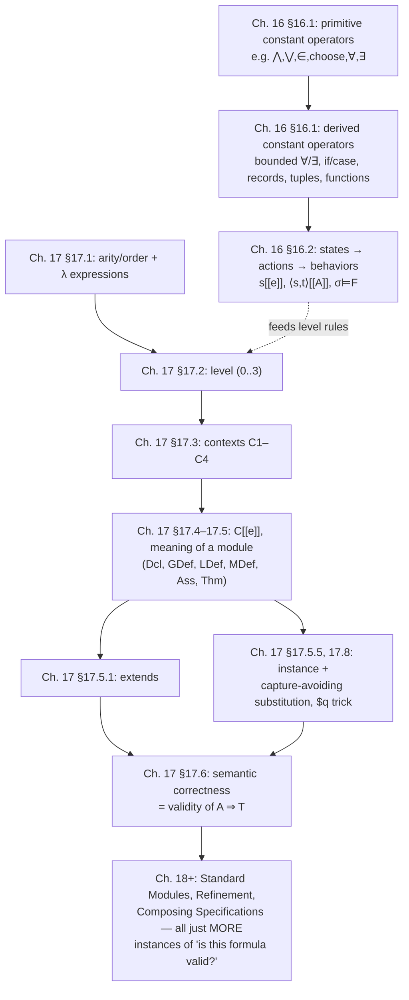

# Formal Semantics of the TLA+ Language

[[book-guidelines|↩ Back to guidelines]]

## Why a specification language needs a semantics chapter at all

Everything up to this point in the book teaches you to *read and write* TLA+. Chapters 16 and 17 answer a harder question: what does a TLA+ specification actually **mean**, precisely enough that a machine (or a proof) could check whether one formula follows from another? This matters because TLA+'s whole selling point is that a specification is a mathematical object you can reason about — refine, compose, model-check, prove theorems about. None of that is trustworthy unless "meaning" is nailed down independently of any particular tool's implementation. If you've ever wondered why a type checker's rules feel like they came from somewhere more fundamental than "whatever the compiler happens to do" — this is the analogous move for a specification language: define meaning first, let tools be judged against it.

Lamport does this in two layers, matching the two chapters:

1. **Chapter 16** gives meaning to *expressions* — assuming you already know what operators like `∪`, `enabled`, or `□` mean in isolation.
2. **Chapter 17** gives meaning to a *module* — the layer where operators get arities, get defined in terms of each other, get imported via `extends`, and get parameterized and re-instantiated via `instance`. This is also where the sharpest engineering problem in the whole formalism shows up: substitution that doesn't secretly break the thing it's substituting into.

Read together, they answer: what is the meaning of one TLA+ operator applied to arguments, and what is the meaning of an entire specification built by composing thousands of such applications across many files?

---

## 1. The meaning of an expression: $[[e]]$ and primitive operators

### The problem

Take `e1 ∪ e2`. What *is* $\cup$? You could say "it's the union operator," but that's circular unless you already have a mathematics to bottom out in. Lamport's answer: **use TLA+ itself as its own metalanguage**, but be honest that only a small *primitive* subset of its operators is taken as given; everything else is *defined* in terms of those primitives.

Formally: for an expression $e$, we define its **meaning** $[[e]]$ inductively. For example:

$$[[e_1 \cup e_2]] \stackrel{\Delta}{=} [[e_1]] \cup [[e_2]]$$

This looks tautological — the same symbol $\cup$ appears on both sides — and that's exactly Lamport's point: rather than juggling "the TLA+ symbol $\cup$" versus "the set-theory operator $\cup$" as two different things needing a translation, he just declares set union itself as *primitive*, so the semantic equation for it really is that trivial. The interesting content is elsewhere: **which** operators get to be primitive, and how everything else reduces to them.

Primitives chosen in Chapter 16 include: propositional connectives, unbounded $\forall x : p$ / $\exists x : p$ (single identifier only), `choose x : p`, set membership $\in$, and a handful of others like `IsAFcn`. Everything else — bounded quantifiers, multi-variable quantifiers, `if/then/else`, `case`, records, tuples, `except`, numbers — is *defined* in terms of these, the way a small kernel language defines a larger surface language via desugaring.

**What breaks without this discipline:** if every operator were independently "explained in English," you'd have no way to mechanically check that two specifications using different operators actually agree, and no way to build a trusted proof system — you'd be trusting an unbounded number of informal definitions instead of a small, auditable core. This is precisely the "trusted computing base" problem from kernel design: a proof assistant's kernel is small and audited *because* everything else reduces to it through explicit, checked rules — TLA+'s primitive-operator core plays the same role for specification semantics.

**[[Elementary-Mathematical-Foundations-for-Specification#Grounding|Grounding]] (Rust):** this is the same move as normalizing a large AST to a small core IR before running an interpreter or type checker.

```rust
// Surface syntax has many constructs...
enum SurfaceExpr {
    BoundedForall { var: String, set: Box<SurfaceExpr>, body: Box<SurfaceExpr> },
    Union(Box<SurfaceExpr>, Box<SurfaceExpr>),
    IfThenElse(Box<SurfaceExpr>, Box<SurfaceExpr>, Box<SurfaceExpr>),
    // ... dozens more
}

// ...but they all desugar into a tiny primitive core, exactly as
// Lamport reduces bounded ∀ to unbounded ∀ plus ⇒ and ∈.
enum CoreExpr {
    ForallUnbounded(String, Box<CoreExpr>), // primitive
    Implies(Box<CoreExpr>, Box<CoreExpr>),  // primitive
    In(Box<CoreExpr>, Box<CoreExpr>),       // primitive
    Choose(String, Box<CoreExpr>),          // primitive
    // The interpreter/checker only needs to know CoreExpr.
}

fn desugar(e: &SurfaceExpr) -> CoreExpr {
    match e {
        // ∀x ∈ S : p  ≜  ∀x : (x ∈ S) ⇒ p     — Lamport's (16.1)-style rule
        SurfaceExpr::BoundedForall { var, set, body } => CoreExpr::ForallUnbounded(
            var.clone(),
            Box::new(CoreExpr::Implies(
                Box::new(CoreExpr::In(Box::new(CoreExpr::var(var)), Box::new(desugar(set)))),
                Box::new(desugar(body)),
            )),
        ),
        _ => todo!(),
    }
}
```

**Grounding (Lean):** Lean's own elaborator does exactly this — surface notation (`∀ x ∈ s, p x`, anonymous-constructor syntax, `do`-notation) elaborates down to a tiny core calculus of `Expr` terms (`forallE`, `app`, `lam`, ...). The kernel's `isDefEq` and type checker never see the surface sugar — only the fully elaborated core. Chapter 16's $[[\cdot]]$ is the specification-language analogue of Lean's elaboration-to-core-`Expr` pass.

---

## 2. Boolean operators on non-Boolean values: conservative, liberal, moderate

### The problem

TLA+ is **untyped**. There's nothing stopping you from writing `2 ∧ ⟨5⟩` — a conjunction of a number and a tuple. A typed language would simply reject this at compile time. TLA+ must instead *decide what such an expression means*, because refusing to define it isn't an option once the syntax admits it.

Three candidate semantics, in increasing strength of commitment:

- **Conservative:** the value of `2 ∧ ⟨5⟩` is *completely unspecified*. Standard logic laws (like commutativity of $\land$) are guaranteed to hold only when the operands really are Booleans.
- **Liberal:** the value is *guaranteed to be a Boolean* (unspecified which one), and *every* propositional/predicate tautology holds unconditionally, treating any non-Boolean as effectively `false`.
- **Moderate:** a middle ground — only expressions that literally involve `true`/`false` are guaranteed to behave sensibly (e.g. `false ∧ x` is `false`, `false ⇒ x` is `true`, no matter what silly value `x` is), but general tautologies like commutativity require both operands to actually be Booleans.

**What breaks without picking one:** the book's own example is instructive. Define $tnat[n] \stackrel{\Delta}{=} true$ for all $n \in \mathrm{Nat}$. Consider

$$\forall n \in \mathrm{Nat} : tnat[n]$$

which desugars (per §1) to $\forall n : (n \in \mathrm{Nat}) \Rightarrow tnat[n]$. Plugging in $n = 1/2$ gives $(1/2 \in \mathrm{Nat}) \Rightarrow tnat[1/2]$, i.e. $\text{false} \Rightarrow tnat[1/2]$ — and $tnat[1/2]$ is *unspecified* (division outside its domain, see §3's `choose`-based semantics). Under **conservative** semantics, `false ⇒ (anything)` is itself unspecified, so the whole quantified formula's truth value is unspecified — even though intuitively "for all naturals, $tnat$ holds" is obviously true and should need no defensive `= true` rewriting. Under **moderate** semantics, `false ⇒ anything` is guaranteed `true` regardless of what the right side is, so the formula comes out `true`, matching intuition, without forcing you to write the defensively verbose $\forall n \in \mathrm{Nat} : (tnat[n] = true)$ everywhere.

TLA+'s official semantics: **moderate interpretation is asserted valid; liberal is permitted but not required; conservative reasoning alone is not guaranteed sound.** In practice this means: when you reason about a TLA+ specification, you're allowed to assume `false ∧ x ≡ false` and `false ⇒ x ≡ true` unconditionally, but you must check operands are genuinely Boolean before invoking commutativity or other general tautologies.

**Grounding (Rust):** think of this as choosing a policy for what a checker does with an ill-typed subterm instead of statically rejecting it — like a "poison"/undefined-value lattice in an abstract interpreter, where certain operators (short-circuiting `&&`/`||` on one known-false/true operand) still propagate the definite result regardless of the other operand's garbage state, but general algebraic identities are only sound once both sides are known-good.

```rust
#[derive(Clone, Copy, PartialEq)]
enum BoolLike { True, False, Unknown } // Unknown = "silly", untyped value

fn and(a: BoolLike, b: BoolLike) -> BoolLike {
    match (a, b) {
        // Moderate interpretation: literal false short-circuits, no matter what b is.
        (BoolLike::False, _) | (_, BoolLike::False) => BoolLike::False,
        (BoolLike::True, BoolLike::True) => BoolLike::True,
        // Anything touching Unknown (without a literal false) stays unspecified —
        // you may NOT assume and(a,b) == and(b,a) here without first proving
        // both sides are BoolLike::True/False.
        _ => BoolLike::Unknown,
    }
}
```

This is a genuinely TLA+-specific design point with no clean Lean analogue (Lean is strongly typed, so `2 ∧ ⟨5⟩` is a type error, not a semantic question) — worth noting as a case where the "what breaks without types" intuition runs the *opposite* direction from usual: TLA+ deliberately gives up static typing to keep the language uniform and lightweight for specification, and pays for it with this three-way semantic choice.

---

## 3. `choose` as Hilbert's $\varepsilon$, and the moderate interpretation's most disquieting consequence

`choose x : p` returns *some* value satisfying $p$ if one exists, and a completely arbitrary (but fixed) value otherwise. This is exactly **Hilbert's epsilon operator** $\varepsilon$, taken as primitive, governed by two axioms:

$$(\exists x : P(x)) \equiv P(\text{choose } x : P(x))$$
$$(\forall x : P(x) = Q(x)) \Rightarrow ((\text{choose } x : P(x)) = (\text{choose } x : Q(x)))$$

The second rule has a striking consequence. If the `Reals` module defines division as

$$a / b \stackrel{\Delta}{=} \text{choose } c \in \mathrm{Real} : a = b * c$$

then for any nonzero $a$, there's no $c$ with $a = 0 * c$, so $a/0$ equals `choose c : false` for *every* nonzero $a$ — meaning $1/0 = 2/0$ is **provable**. This isn't a bug tolerated for convenience; it's a direct, checkable theorem of the semantics as given. If this bothers you, the book shows the fix: define a `Choice(v, P)` operator that falls back to a value *depending on* the extra parameter `v` (rather than a single global arbitrary value) when $P$ has no witness, breaking the forced identification of all "empty `choose`" instances.

This is a genuinely useful lesson about semantics design in general: **choosing your primitives has downstream consequences you must be willing to accept or explicitly patch** — you don't get to have an elegant, uniform `choose` semantics *and* "sensible" behavior at every edge case for free.

**Grounding (Lean):** `choose` is structurally identical to `Classical.choice`/`Classical.choose` in Lean — given a proof of `∃ x, p x`, `Classical.choose` extracts *some* witness, non-constructively, with the analogous property that two calls to `choose` with propositionally-equal predicates yield the same witness (`Classical.choose_spec`, and proof irrelevance doing the work that TLA+'s second `choose` axiom does). If you've ever used `Classical.choice` to discharge an existential without caring which witness you get, you've already used exactly this primitive.

---

## 4. From expressions to states, actions, behaviors: level and what the "meaning" actually is

Chapter 16's second half extends $[[\cdot]]$ from timeless "constant" expressions to expressions that talk about *change*. This is where TLA+ stops being "just math" and becomes a temporal logic. Four categories, forming a strict hierarchy (**this is a preview of the "level" concept made precise in Chapter 17 §17.2**):

| Level | Name | Contains | Meaning is a function... |
|---|---|---|---|
| 0 | constant | constants, constant operators | ...that's just a value |
| 1 | state | + unprimed variables | $s[[e]]$ : states → values |
| 2 | transition (action) | + priming (`'`) | $\langle s,t\rangle[[e]]$ : state-pairs → values |
| 3 | temporal | + `□`, `◇`, `WF`, `SF`, ... | $\sigma \models F$ : behaviors → Booleans |

Concretely:

- A **state** is formalized as a function from variable names to values: $s[[x]]$ is the value $s$ assigns to $x$. (Lamport is explicit that formally there's *no set of all states* — a Russell's-paradox-style argument, since for every set $S$ there's a state assigning $S$ to some variable, so "the states" would have to be a proper-class-sized collection. The book calls this a place where full formality is sacrificed for a workable "semi-formal" treatment — an honest admission that ZF-style foundations strain under an untyped, unbounded specification language.)
- A **transition function** interprets priming: $\langle s,t \rangle [[x']] = t[[x]]$ — an *unprimed* occurrence reads the old state, a *primed* one reads the new state. An **action** is a Boolean-valued transition function.
- The "sugar" action operators reduce to priming plus ordinary logic:
$$[A]_e \stackrel{\Delta}{=} A \lor (e' = e) \qquad \langle A \rangle_e \stackrel{\Delta}{=} A \land (e' \neq e) \qquad \texttt{unchanged}\ e \stackrel{\Delta}{=} e' = e$$
$$\texttt{enabled } A: \quad s[[\texttt{enabled } A]] \stackrel{\Delta}{=} \exists\, \texttt{state}\ t : \langle s,t\rangle[[A]]$$
$$A \cdot B: \quad \langle s,t\rangle[[A \cdot B]] \stackrel{\Delta}{=} \exists\, \texttt{state}\ u : \langle s,u\rangle[[A]] \land \langle u,t\rangle[[B]]$$
- A **behavior** is formalized as a function $\sigma : \mathrm{Nat} \to \mathrm{State}$ (an infinite sequence of states). A **temporal formula**'s meaning is a predicate on behaviors, $\sigma \models F$. `□F` ("always F") is defined by universally quantifying over all suffixes:
$$\sigma \models \Box F \stackrel{\Delta}{=} \forall n \in \mathrm{Nat} : \sigma^{+n} \models F$$
  and essentially everything else in temporal logic — `◇`, `WF`, `SF`, leads-to (`⤳`) — reduces to `□` plus negation, exactly mirroring how Chapter 16's constant-operator layer reduces everything to a handful of primitives. `enabled` reappears inside the definitions of weak/strong fairness: $WF_e(A) \stackrel{\Delta}{=} \Diamond\Box\lnot(\texttt{enabled}\langle A\rangle_e) \lor \Box\Diamond\langle A\rangle_e$.
- The temporal **existential quantifier** $\exists x : F$ is the subtlest construct here: it's a *hiding* operator, not ordinary quantification. It's defined via a stuttering-equivalence relation $\sigma \sim_x \tau$ ("$\sigma$ and $\tau$ agree once you strip stuttering steps and ignore what they assign to $x$"), and $\exists x : F$ holds of $\sigma$ iff *some* $\tau$ stuttering-equivalent-modulo-$x$ to $\sigma$ satisfies $F$. This is the formal machinery underneath refinement mappings and existential hiding of internal variables — you'll want to remember this the moment a spec "hides" an implementation variable behind `∃`.

**What breaks without the level hierarchy:** without a notion of level, nonsensical constructs like double-priming $(x' + y)'$ would be syntactically well-formed but semantically undefined — priming is only meaningful on a *state* function (level ≤ 1), producing a *transition* function (level 2); priming a transition function again has nothing to prime against, since there's no "third state." Levels are exactly what rules this out — and they get formalized properly in Chapter 17.

**Grounding (Rust):** state/action/behavior stratification is precisely the state-machine layering used in model checkers and interpreters — a `State` (variable environment), a `Step`/`Transition` (pair of states, i.e., an edge), and a `Trace`/`Behavior` (a path through the state graph) are exactly the levels 1, 2, 3 above.

```rust
struct State(HashMap<String, Value>);          // level 1
struct Step { pre: State, post: State };       // level 2 — an "action" is a predicate on Step
struct Behavior(Vec<State>);                   // level 3 (idealized: infinite in TLA+)

trait Action { fn holds(&self, step: &Step) -> bool; }          // e.g. x' = x + 1
trait TemporalFormula { fn holds(&self, behavior: &Behavior, from: usize) -> bool; } // □F, ◇F, ...
```

This is the exact shape of the trace/state representation an explicit-state or bounded model checker (or your own CSP/CEGAR engine reasoning about reachability) needs internally — `enabled A` is literally "does this state have any successor satisfying A," the same query a symbolic-execution engine asks when deciding if a branch is feasible.

---

## 5. Arity, order, and level of an operator

Chapter 17 turns from *expressions* to *operators themselves* as first-class citizens of the semantics, and the first job is nailing down what shape an operator can have.

### Arity and order — a proto type system for operators

Every TLA+ operator is **0th-, 1st-, or 2nd-order**, and TLA+ deliberately caps it there:

- **0th-order**: takes no arguments — it *is* an ordinary expression. Arity written `_`.
  $$E \stackrel{\Delta}{=} x' + y$$
- **1st-order**: takes expressions as arguments. Arity is a tuple of `_`'s, one per argument.
  $$F(x, y) \stackrel{\Delta}{=} x \cup \{z, y\} \qquad \text{arity } \langle \_, \_ \rangle$$
- **2nd-order**: some arguments may themselves be 1st-order operators.
  $$G(f(\_,\_), x, y) \stackrel{\Delta}{=} f(x, \{x,y\}) \qquad \text{arity } \langle \langle \_,\_\rangle, \_, \_ \rangle$$

Here $G$'s first argument slot demands "a 1st-order operator taking two expression arguments" — not an expression. TLA+ stops at 2nd-order by design: allowing 3rd-order (operators parameterized by 2nd-order operators, and so on) would make **level-correctness checking** (below) intractably complex, for essentially no expressive gain in a specification language. And despite allowing 2nd-order operators, TLA+ remains, in the logician's technical sense, a **first-order logic** — because *quantification* (`∀`, `∃`) only ever ranges over 0th-order operators (ordinary values). You cannot write $\exists f(\ ) : \ldots$ quantifying over functions/operators themselves; that would be genuine higher-order logic.

This is, functionally, a tiny **kind system** — arity plays the role that a kind plays for type constructors (`Type`, `Type → Type`, `(Type → Type) → Type → Type`, ...), classifying "what shape of thing can go here" one level up from ordinary values, and TLA+'s order-2 cap is exactly analogous to a language deciding to support type-constructor polymorphism but stop short of full higher-kinded generality.

**Grounding (Rust):** an operator's arity is like a function-pointer's *signature shape*, and TLA+'s order hierarchy resembles the distinction between a plain closure argument and a higher-order closure argument (a closure that itself takes a closure):

```rust
// 0th-order: a value
let e: i64 = 5;

// 1st-order: a function taking values, arity <_, _>
fn f(x: i64, y: i64) -> i64 { x + y }

// 2nd-order: a function taking a 1st-order function as an argument, arity <<_,_>, _, _>
fn g(op: impl Fn(i64, i64) -> i64, x: i64, y: i64) -> i64 { op(x, y) }
// Rust *does* allow 3rd-order and beyond (fn(fn(fn(...)))) — TLA+ deliberately
// refuses to, precisely to keep its level-checking algorithm simple.
```

**Grounding (Lean):** arity/order is the untyped cousin of Lean's `Sort`/kind hierarchy — a 1st-order TLA+ operator is shaped like a term of type `α → β`, a 2nd-order one like `(α → β) → γ → δ`, i.e., taking a function as an argument. TLA+ just never lets the argument-taking-a-function-argument recursion go past one level.

### Level — the "type system" that TLA+ *does* enforce

Where order/arity governs *what can be applied to what*, **level** governs *how much temporal content* an expression carries, and TLA+ does enforce this one rigorously via a level-correctness judgment. The four levels are exactly §4's hierarchy, now made precise as a syntactic property computed by structural rules such as:

- a declared constant has level 0; a declared variable has level 1;
- if $Op$ is a 1st-order constant operator, $Op(e_1,\ldots,e_n)$'s level is the *max* of its arguments' levels;
- $e'$ is level-correct (level 2) **iff** $e$ is level-correct with level $\le 1$ — this is exactly the rule that rejects $(x' + y)'$: the inner $x'+y$ already has level 2, so priming it again is a level-correctness violation, not merely "weird";
- `enabled e` is level-correct (level 1) iff $e$ is level-correct with level $\le 2$ — note `enabled` "resets" the level down to 1 (a state predicate), since knowing *whether a successor exists* is itself just a fact about the current state.

A genuinely subtle and important fact: **level-correctness of an expression does not depend on whether a free identifier is declared `constant` or `variable`** — only the resulting *level* does. This is precisely what makes it valid to `instance`-substitute a variable for what was originally a constant (or vice versa) without the *syntax* suddenly becoming ill-formed — only the *semantics* (validity) is put at risk, which is exactly the subject of §8 below.

**What breaks without level-checking:** without it, the type-incorrect-in-spirit expressions above wouldn't be systematically caught — you'd only discover, e.g., that $2[c'=c]_c$ silently stops meaning what you think after an instantiation, by running a model checker and getting confused, rather than by a static check telling you exactly why.

**This is your project's bidirectional-typing / judgment-form connection, made explicit:** level-checking is structurally a **typing judgment** — `Γ ⊢ e : level` — over a very small lattice (`{0,1,2,3}` totally ordered by "temporal-content strength") instead of a rich type universe. It is *inference*, not *checking*, in the bidirectional sense (the level is a synthesized output, not a checked-against target), but the shape — inductive rules keyed on syntax, contexts recording declared identifiers' arities, a monotone combination rule for compound expressions — is the exact shared ancestor your compiler's typing-rule judgments and TLA+'s level rules both descend from.

---

## 6. Lambda expressions as metalanguage

### The problem this solves

You can *define* a 1st- or 2nd-order operator ($F(x,y) \stackrel{\Delta}{=} x \cup \{z,y\}$), but TLA+ gives you **no syntax to write down the value that $F$ equals** as a standalone expression — only 0th-order operators are ordinary expressions. So how do you *talk about* what $F$ *is*, e.g., to state that two different operator definitions define the same operator, or to give a uniform account of "substituting an operator for a formal parameter"?

Lamport's answer: introduce **λ expressions purely as a metalanguage device** — never legal TLA+ syntax, used only in the semantics itself:

$$F \text{ equals the } \lambda \text{ expression } \lambda x, y : x \cup \{z, y\}$$
$$G \text{ equals } \lambda f(\_,\_), x, y : f(y, \{x, z\})$$

General form: $\lambda p_1, \ldots, p_n : exp$, where each parameter $p_i$ is either a plain identifier or has the "takes arguments" form $id_i(\_,\ldots,\_)$ — mirroring the arity distinction from §5 exactly. The $n=0$ case, $\lambda : exp$, is just $exp$ — so every ordinary expression is trivially a degenerate λ expression, making λ expressions a strict generalization rather than a separate concept bolted on.

Two standard rules govern them, borrowed wholesale from the lambda calculus:

- **α-conversion**: renaming bound parameter identifiers doesn't change meaning — $\lambda f(\_,\_), x, y : f(y,\{x,z\})$ is the *same* operator as $\lambda abc(\_,\_), qq, m : abc(m, \{qq, z\})$.
- **β-reduction**: applying a λ expression substitutes arguments for parameters —
$$(\lambda x, y : x \cup \{z, y\})(TT, w+z) = TT \cup \{z, (w+z)\}$$

**What this buys you:** every syntactic sugar in TLA+ — infix operators, variable-arity constructs like $\{e_1,\ldots,e_n\}$, bound-variable constructs like $\exists x \in S : p$, `M(x)!Op(y,z)` from instantiation — can be uniformly normalized to the single canonical form $Op(e_1,\ldots,e_n)$, with bound-variable constructs specifically becoming applications of a 2nd-order operator to a λ expression: e.g. $\exists x \in S : x+z > y$ becomes $\text{ExistsIn}(S, \lambda x : x+z>y)$. This single normal form is what lets Chapter 17 give *one* recursive definition of "the meaning of an expression" ($C[[e]]$, §7 below) instead of a rule per surface syntax form.

**Grounding (Rust/Lean, this one is unusually direct):** this is *literally* the untyped lambda calculus used as an internal representation, exactly as a compiler desugars every surface binding form (`match`, `if let`, list comprehensions, `for`) down to a small core of `lambda`/`apply`/`let`.

```rust
enum CoreExpr {
    Lambda(Vec<Param>, Box<CoreExpr>), // metalanguage only — never user syntax
    App(Box<CoreExpr>, Vec<CoreExpr>),
    Var(String),
}
// β-reduction, exactly Lamport's rule:
fn beta_reduce(params: &[String], body: &CoreExpr, args: &[CoreExpr]) -> CoreExpr {
    // substitute args[i] for params[i] in body — capture-avoiding! (see §8)
    substitute(body, &params.iter().cloned().zip(args.iter().cloned()).collect())
}
```

In **Lean**, this is exactly `Expr.lam` and `Expr.app` in the kernel, with β-reduction (`Expr.betaReduce` / `whnf`) doing precisely this job, and α-equivalence handled via de Bruijn indices so that "renaming bound variables doesn't change meaning" is true *by construction* rather than needing to be separately proved. If you're designing your own elaborator's core IR, Lamport's λ-expressions-as-pure-metalanguage design is a strong argument for keeping your *own* core representation (post-elaboration) similarly minimal and never exposed as user-facing syntax.

---

## 7. Contexts and the meaning of a module

### Contexts: the missing piece that makes "meaning" well-defined at all

An expression's syntactic correctness and meaning depend on things not visible in the expression itself: is `Foo` a variable (arity `_`) or a constant operator (arity `⟨_⟩`)? Is `x` a declared identifier at all? This external, implicit information is captured formally as a **context**: a set of

- **declarations** (name ↦ arity + level),
- **definitions** (name ↦ a let-free λ expression),
- **module definitions** (name ↦ the meaning of a whole module),

subject to four consistency conditions that look exactly like the well-formedness side-conditions you'd write for a typing context in a metatheory paper:

- **C1**: an operator name is declared or defined **at most once** (never both).
- **C2**: no operator already declared/defined in the context may be **shadowed** by a λ parameter identifier inside some definition's body — this is what makes "no accidental capture from the ambient context" a *context well-formedness invariant* rather than something checked ad hoc at each use site.
- **C3**: every free operator name appearing in a definition's body is either a λ parameter or is **declared** (not defined — definitions must bottom out, transitively, in declared/primitive names) by the context.
- **C4**: no module name is defined by two different module definitions.

Given a context $C$, a **$C$-basic λ expression** is one built only from symbols $C$ declares (plus λ parameters) — this is the formal notion that Chapter 16's "basic expression" (built only from built-ins, declared constants, declared variables) generalizes to once user-defined operators enter the picture.

**This maps directly onto typing contexts $\Gamma$ in a dependent type theory.** C1–C4 are exactly the kind of well-formedness conditions ("`Γ` is well-formed", no duplicate bindings, every free variable in a term is bound in `Γ`) you state before you can even ask "is this term well-typed in `Γ`" — the context has to be a coherent object *before* judgments relative to it are meaningful. If you're building an elaborator, this section is a direct rehearsal of the invariants your `Context`/`LocalContext` type needs to maintain.

### The meaning of a λ expression relative to a context: $C[[e]]$

With contexts pinned down, Chapter 17 defines $C[[e]]$ — the meaning of a λ expression $e$ in context $C$ — inductively:

- a declared symbol maps to itself; a **defined** symbol maps to its λ-expression definition (unfolding);
- $Op(e_1,\ldots,e_n)$ with $Op$ *declared* recurses structurally: $C[[Op(e_1,\ldots,e_n)]] = Op(C[[e_1]],\ldots,C[[e_n]])$;
- $Op(e_1,\ldots,e_n)$ with $Op$ *defined* as λ-expression $d$ performs **unfold-then-β-reduce**: $C[[e]] = $ the β-reduction of $\overline{d}(C[[e_1]],\ldots,C[[e_n]])$, where $\overline{d}$ is $d$ after α-conversion chosen so no λ-parameter identifier in $d$ collides with anything free in the $C[[e_i]]$ — capture-avoidance is baked directly into this rule, not bolted on afterward;
- and crucially, **`let` is defined here, not in Chapter 16** — a `let` expression's meaning reduces to exactly the same unfold-and-β-reduce machinery, since `let Op(p) ≜ d in exp` is just sugar for "apply the λ-expression $\lambda p : d$'s definition inline." This closes the one gap Chapter 16 explicitly left open.

This is the precise, general-purpose analogue of what a **normalizer / definitional-unfolding pass** does in a proof kernel: repeatedly unfold defined names to their definitions and β-reduce until you reach a form built only from primitives (declared/built-in symbols) — this *is* what "the meaning" cashes out to, operationally.

### The meaning of a module: six sets computed by a left-to-right algorithm

A module's meaning, relative to a context $C$, is **six sets**, built up by processing the module's statements top to bottom, threading a growing **current context** `CC` (the union of $C$ and everything accumulated so far):

| Set | Populated by |
|---|---|
| `Dcl` | `constant`/`variable` declarations, plus declarations from `extends`-ed modules |
| `GDef` | non-`local` definitions, plus global definitions pulled in via `extends`/`instance` |
| `LDef` | `local` definitions and `local instance`s — invisible to modules that later extend/instantiate this one |
| `MDef` | submodule definitions |
| `Ass` | `assume` statements (plus assumptions pulled in via `extends`) |
| `Thm` | `theorem` statements, plus theorems pulled in via `extends`/`instance` |

Each statement type has a precise legality rule and effect — e.g. a `constant`/`variable` declaration is legal iff none of the names are already declared/defined in `CC`; an operator definition $Op(p_1,\ldots,p_n) \stackrel{\Delta}{=} exp$ is legal iff $Op$ isn't already taken and $\lambda p_1,\ldots,p_n : exp$ is a legal `CC`-basic λ expression, and it's added to `GDef` as $CC[[\lambda p_1,\ldots,p_n : exp]]$ — the definition-processing step *is* an application of §7's $C[[\cdot]]$ machinery. A function definition $Op[fcnargs] \stackrel{\Delta}{=} exp$ is even reduced to an *ordinary* operator definition via `choose`:
$$Op \stackrel{\Delta}{=} \texttt{choose } Op : Op = [fcnargs \mapsto exp]$$
— a nice example of Chapter 16's `choose` machinery (§3) doing real semantic work: it's what lets a self-referential-looking recursive function definition be given a non-circular meaning as "the unique function satisfying this defining equation."

---

## 8. Module extension (`extends`)

`extends M_1, \ldots, M_n` must be the *first* statement in a module. It sets `Dcl, GDef, MDef, Ass, Thm` to the **union** of the corresponding sets from each $M_i$'s meaning (as already computed in $C$). Legality requires no genuine name clash: if two extended modules both define/declare the same symbol, that's only legal if both definitions trace back through a (possibly empty) chain of `extends` statements to the **same original definition** — i.e. "diamond" extension of a shared ancestor module is fine, but two *independent* modules that happen to define `Foo` differently is a conflict. This is exactly the diamond-inheritance problem familiar from multiple-inheritance/trait systems, solved the same way: same ultimate source, no conflict; different sources defining the same name, conflict.

**Grounding (Rust):** this is structurally identical to Rust's rule for multiple trait `use`/inheritance — re-exporting the same underlying item through two paths is fine; two *different* items with the same name colliding is an error requiring disambiguation.

---

## 9. Instantiation and capture-avoiding substitution

This is the technical heart of Chapter 17, and the single most load-bearing mechanism in this entire topic for anyone building an elaborator or a verifier: **how do you formally substitute one set of names for another without silently breaking the thing you substituted into?**

### The basic instantiation rule

$$I(p_1,\ldots,p_m) \stackrel{\Delta}{=} \texttt{INSTANCE } N \texttt{ WITH } q_1 \leftarrow e_1, \ldots, q_n \leftarrow e_n$$

For each definition $Op \stackrel{\Delta}{=} \lambda r_1,\ldots,r_p : e$ inside $N$, instantiation adds to the current module:

$$I!Op \stackrel{\Delta}{=} \lambda p_1,\ldots,p_m, r_1,\ldots,r_p : \overline{e}$$

where $\overline{e}$ is $e$ with each $e_i$ substituted for $q_i$. The **entire point** of this machinery, stated as a design goal up front: *substitution must preserve validity* — if $Op$ (or a theorem about it) was valid in $N$, then $I!Op$ (or the corresponding imported theorem) must be valid in the instantiating module. This single sentence is the specification that everything below is built to satisfy.

### Failure mode 1: instantiating a nonconstant module's constants with variables

Suppose $N$ declares $c$ as a **constant** and defines $F \stackrel{\Delta}{=} \Box[c'=c]_c$ — "$c$ never changes," trivially true since constants are, well, constant across a behavior. Now instantiate with $c \leftarrow x$ where $x$ is a **variable**. Naive substitution gives $I!F = \Box[x'=x]_x$ — which is **false** for any behavior in which $x$ actually changes. Validity is destroyed by an entirely "legal-looking" substitution.

The fix is a **level-correctness side-condition** on instantiation, not a special case for this example: define $N$ to be a **constant module** iff every declaration and every operator used in `NDef` has constant level. If $N$ is *not* constant, then for each substitution $q_i \leftarrow e_i$: if $q_i$ is a constant, $e_i$ must have constant level; if $q_i$ is a variable, $e_i$ must have level 0 or 1 (i.e., mustn't itself be an action or temporal expression). This is precisely why level-correctness (§5) not depending on constant-vs-variable declaration, while the *level itself* does, is load-bearing: the side-condition can be stated purely in terms of levels, uniformly, without a special rule per construct.

### Failure mode 2: classic variable capture

Ordinary math has this problem already. Take the valid formula
$$(n \in \mathrm{Nat}) \Rightarrow (\exists m \in \mathrm{Nat} : m \geq n) \tag{17.6}$$
and naively substitute $m+1$ for $n$:
$$(m+1 \in \mathrm{Nat}) \Rightarrow (\exists m \in \mathrm{Nat} : m \geq m+1) \tag{17.7}$$
The inner $\exists m$ now *captures* the substituted $m$, and (17.7) is not valid ($\exists m \in \mathrm{Nat} : m \geq m+1$ is equivalent to `false`). The standard fix — never substitute for *bound* occurrences, α-convert bound names out of the way first — is exactly what TLA+'s syntactic rules enforce automatically: (17.7) as literally written is **illegal TLA+** in the first place, because the subexpression `m + 1 ∈ Nat` can only appear in a context where `m` is already declared/defined, and *that* makes `m` unusable as a fresh bound identifier in the same scope — so the capturing rewrite simply can't be expressed as legal syntax. Ordinary syntactic capture is a non-issue in TLA+ *by construction* of the legality rules, not by a special substitution algorithm.

### Failure mode 3 (the genuinely hard one): implicit binding inside `enabled` and `·`

`enabled A`'s primed variables are **implicitly existentially bound** — `enabled A` really means "$\exists$ a next state making $A$ true," but nothing in the *syntax* marks those primed occurrences as bound the way `∃m` visibly marks `m` as bound. So the ordinary capture-avoidance machinery (which only looks at explicit binders) doesn't see the danger.

Concrete failure: let $N$ declare variables $x, y$ and define
$$F \stackrel{\Delta}{=} \texttt{enabled}\,(x'=0 \land y'=1)$$
$F$ is valid (trivially true — some next state always sets $x=0, y=1$). Now instantiate `WITH x ← z, y ← z` — mapping *both* variables to the *same* target `z`. Naive substitution gives $\texttt{enabled}\,(z'=0 \land z'=1)$ — **unsatisfiable**, hence `false`. Validity destroyed again, and this time the ordinary "don't substitute for bound identifiers" rule doesn't even fire, because `x'` and `y'` were never syntactically bound in the first place.

**The `$q` fix:** before performing the substitution, for every `enabled A` subexpression and every declared variable $q$ of $N$, replace every *primed* occurrence of $q$ inside $A$ with a fresh symbol `$q` (not appearing anywhere else) — effectively making the implicit binding *explicit* just long enough to substitute safely, then leaving the renamed symbol as a permanent marker of "this was bound here, don't conflate it with the substituted target." Applying this to the example:

$$I!F \stackrel{\Delta}{=} \texttt{enabled}\,(\$x{}'=0 \land \$y{}'=1)$$
— which is still satisfiable (equivalent to `true`), correctly preserving validity, because the two primed occurrences no longer alias to the same substituted variable `z`. The book's fuller worked example (module $N$ with $G(v,A) \stackrel{\Delta}{=} \texttt{enabled}(A \lor (\{u,v\}'=\{u,v\}))$ and $H \stackrel{\Delta}{=} (u'=u) \land G(u, u' \neq u)$, instantiated with $u \leftarrow x$) demonstrates something even sharper: **$I!H$ is *not* equal to $(x'=x) \land I!G(x, x'\neq x)$**, even though $H$ literally equals $(u'=u)\land G(u,u'\neq u)$ pre-instantiation. Substituting into $G$'s *definition* once (producing `I!G`) and then applying it to arguments gives a different (and wrong) result than substituting into $H$'s *expanded* body directly — because the `$q` renaming has to happen fresh, relative to each `enabled`'s actual argument expression, not relative to some already-abstracted operator definition. **Instantiation and β-reduction/unfolding do not commute** once implicit binders are involved. This is a subtlety a naive "just substitute textually into definitions and cache the results" implementation would get wrong.

The same problem, and the same `$q`-style fix, applies to the **action composition operator `·`** (which implicitly binds primed occurrences in its left argument and unprimed occurrences in its right argument) and to the real-time leads-to operator $\stackrel{+}{\leadsto}$ (handled by first rewriting it into an equivalent fully-explicit-quantifier form, then applying the same primed-variable renaming).

### The general vocabulary: distributes over

An operator $Op$ is said to have **instantiation distribute over** it if $\overline{Op(e_1,\ldots,e_n)} = Op(\overline{e_1},\ldots,\overline{e_n})$ — i.e., you can push the substitution inside and instantiate the arguments independently, then reapply $Op$. **All constant operators distribute** (and so does `∃`, precisely *because* TLA+'s ordinary syntactic rules already forbid capture when substituting into λ expressions — recall failure mode 2 is a non-issue). Priming and `□` also distribute. **`enabled`, `WF`, `SF`, `·`, and $\stackrel{+}{\leadsto}$ do not** — these are exactly the operators with *implicit* binding, and "does not distribute" is the formal, checkable signature of "this operator needs the `$q` treatment."

**Why this is the single most transferable idea in this whole topic for your project:** this is *substitution under a binder*, the exact mechanism underlying capture-avoiding substitution in lambda calculus, β-reduction in a proof kernel, and — directly on point for your compiler — **Hoare-logic soundness proofs**, where substituting a program variable's value into a postcondition (`wp` computation) has precisely this same capture hazard whenever quantifiers or fresh auxiliary variables are involved, and **metavariable instantiation during elaboration**, where substituting a solved metavariable's value into a term containing binders (`fun x => ?m x`) requires exactly this discipline. TLA+'s twist — *implicit*, syntactically invisible binders inside `enabled`/`·` that the naive substitution algorithm can't even see coming — is a sharp cautionary case study: **a "distributes over" audit of every operator in your own IR, done once and for all up front, is exactly the kind of check that prevents a class of substitution bugs from ever needing to be rediscovered ad hoc.** Any custom operator you add to an elaborator's core language that implicitly quantifies over something (a fresh Skolem constant, an auxiliary metavariable scope) needs this same audit.

**Grounding (Rust):** implementing a substitution function correctly here means threading a "currently-under-binder" set and refusing to substitute names inside it, *and* separately tracking operators (analogous to `enabled`) whose implicit binders aren't visible as an explicit parameter list in your AST:

```rust
fn substitute(e: &Expr, subst: &HashMap<String, Expr>) -> Expr {
    match e {
        Expr::Var(x) => subst.get(x).cloned().unwrap_or_else(|| e.clone()),
        Expr::Lambda(params, body) => {
            // Standard capture avoidance: params shadow the substitution (§7's C2-like invariant).
            let mut inner = subst.clone();
            for p in params { inner.remove(p); }
            Expr::Lambda(params.clone(), Box::new(substitute(body, &inner)))
        }
        // The TLA+-specific hazard: `enabled A` implicitly binds every *primed*
        // occurrence of every variable being substituted, even though no
        // Lambda node is visible here in the AST.
        Expr::Enabled(a) => {
            let renamed = rename_primed_occurrences(a, subst.keys()); // the "$q" trick
            Expr::Enabled(Box::new(substitute(&renamed, subst)))
        }
        Expr::App(op, args) => Expr::App(
            Box::new(substitute(op, subst)),
            args.iter().map(|a| substitute(a, subst)).collect(),
        ),
        _ => e.clone(),
    }
}
```

**Grounding (Lean):** Lean's kernel sidesteps ordinary capture entirely via de Bruijn indices — there are no *names* to accidentally collide, so β-reduction/substitution is always capture-safe by construction. TLA+'s `$q` trick is the "named-variable representation" equivalent of what de Bruijn indices give you for free — a good illustration of *why* proof assistants pay the de Bruijn representational cost: it eliminates an entire category of hand-written renaming logic like the one above.

---

## 10. Semantic correctness as formula validity

Chapter 17 closes by collapsing everything above into one sentence: a module's meaning is the six sets `Dcl, GDef, LDef, MDef, Ass, Thm`, and the module **asserts** that every theorem follows from the conjoined assumptions. Formally, letting $A$ be the conjunction of all assumptions in `Ass`:

$$\text{the module is semantically correct} \iff \text{for every } T \in \texttt{Thm},\ A \Rightarrow T \text{ is a valid formula}$$

This is the payoff of the entire two-chapter apparatus: **every meaningful question you could ask about a TLA+ specification — does this refinement mapping work, does this implementation satisfy this spec, is this invariant actually invariant — reduces to a question of formula validity**, which Chapter 16 already gave a precise (if occasionally semi-formal) meaning to. There is no separate, ad hoc notion of "the spec is correct" floating outside this — correctness of an entire multi-module TLA+ specification *is* validity of finitely many $A \Rightarrow T$ formulas, nothing more and nothing less.

**Why this matters for a trusted-kernel design:** this is the TLA+ analogue of a proof assistant's soundness statement — "a term type-checks iff the kernel's judgment derives it" — reducing an entire rich surface language's correctness notion down to one small, auditable criterion. It's also exactly the shape of a **verification condition**: your compiler's Hoare-triple discharge is going to bottom out the same way — "this Hoare triple holds" reduces to "this generated first-order (or SMT) formula is valid," and the entire elaborate machinery upstream (weakest-precondition computation, invariant generation, abstract interpretation) exists purely to *produce* that formula. Chapter 17 §17.6 is a small, self-contained rehearsal of that same architecture: rich structured input (a module, or a program) → mechanical reduction → one clean validity question.

---

## Where this leads



Everything downstream in the book — [[The-Standard-Modules|the standard modules]] (built as ordinary TLA+ modules, now that you know precisely what "module" means), refinement mappings (existential hiding, §4's temporal `∃`, now made rigorous), [[Composing-Specifications|composing specifications]] via `∧` of modules, and even what the model checker TLC is actually approximating — is built on top of this chapter pair. When later chapters wave their hands and say "this refinement is valid" or "these two specs are equivalent," they are always, underneath, invoking exactly the $A \Rightarrow T$ validity criterion and the capture-avoiding instantiation semantics defined here.

**For the compiler/elaborator project (`automated-reasoning`, `type-theory`):** three threads from this topic are directly load-bearing, not just analogous:

- **Substitution and context management** (this vault's standing thread) gets its sharpest illustration yet in the `$q` mechanism — a worked example of a binder that's invisible in an AST's syntax tree but must still be respected by any substitution routine, exactly the failure mode that shows up in Hoare-logic soundness proofs when auxiliary/fresh variables are introduced mid-proof, and in metavariable instantiation when a solved metavariable's value contains bound variables from the ambient context.
- **Judgment forms and typing rules**: level-correctness (§5) is a genuine, minimal-worked-example typing judgment — `Γ ⊢ e : level` over the tiny lattice `{0,1,2,3}` — worth keeping in mind as the smallest possible instance of the pattern your elaborator's much richer typing judgment will scale up from.
- **Trusted kernels**: §10's collapse of "specification correctness" to "formula validity" is the TLA+-scale version of the soundness argument your kernel's `isDefEq`/type-checking core will need to state and (eventually) prove — a rich surface system is only as trustworthy as the small, auditable criterion everything reduces to.
