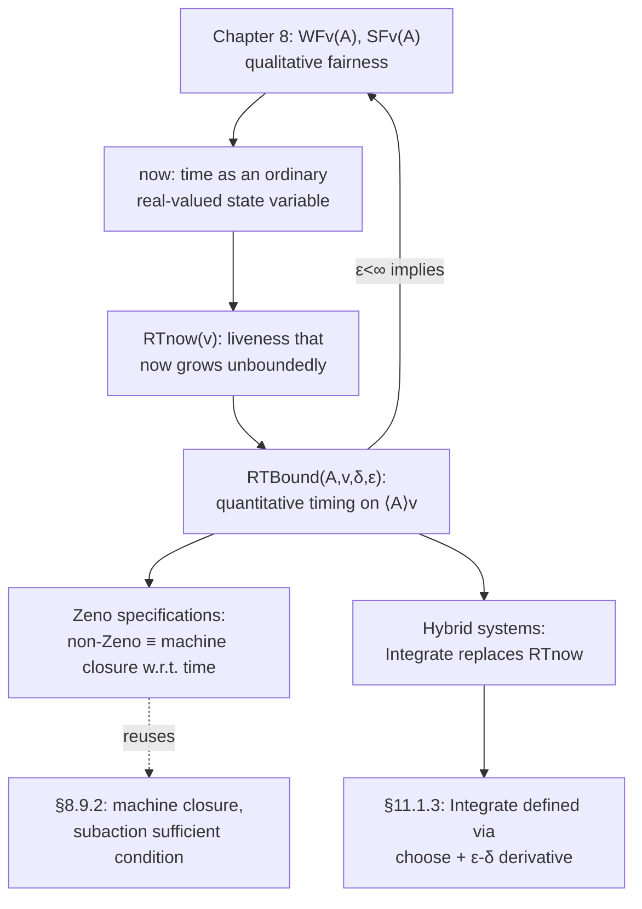

# Real-Time Specification

[[book-guidelines|↩ Back to guidelines]]

## Why liveness alone isn't enough

Chapter 8 gave TLA+ a way to say a system *must eventually* respond. But "eventually" is a hopelessly weak promise for anything you'd actually deploy: a system that waits 100 years before answering satisfies every liveness property in the book. If you want to specify "the memory controller must respond within 50 microseconds" or "the clock must tick once an hour, give or take a few seconds," you need a quantitative notion of time inside the formalism itself, not just an ordering of events.

What breaks without this: weak fairness ($WF_v(A)$, from Chapter 8) says "if $A$ stays enabled forever, an $A$-step eventually happens." It has no numeric handle — you cannot ask *how long* "forever" is allowed to take before it counts as a violation. Real-time specification is the minimal extension that adds that handle back in, while trying to disturb the rest of TLA+ as little as possible.

Lamport's approach is characteristically frugal: don't invent a new time-indexed semantics or a metric temporal logic. Instead, model time as *just another variable* — call it `now` — governed by ordinary TLA+ actions, and build the timing vocabulary ($RTBound$, non-Zenoness, hybrid dynamics) entirely out of machinery you already have: actions, invariants, `WF`, and hiding via temporal $\exists$.

## The `now` variable: time as state, not as metalanguage

### The core idea

A "state" in TLA+ is an assignment of values to all variables (Chapter 2). If time is just another quantity the system's behavior depends on, the obvious move is to add a variable — Lamport calls it `now` — whose value is a real number representing elapsed time. A step that leaves `now` unchanged is an "instantaneous" discrete transition (e.g. the clock face flipping from 12 to 1); a step that only advances `now` represents "time passing" with nothing else happening.

This is a deliberate simplification: physically, a clock display doesn't change in zero seconds, and time doesn't literally advance in a countable sequence of jumps. But TLA+'s whole model of a system is a discrete sequence of states, so continuous time gets the same treatment continuous physical quantities always get in this book — approximate by an unboundedly fine sequence of discrete jumps, and don't commit to any particular granularity.

Concretely, the hour clock's real-time version (revisiting `HourClock` from Chapter 2) allows a step like

$$
\begin{bmatrix} hr = 12 \\ now = 2.47\end{bmatrix} \;\rightarrow\; \begin{bmatrix} hr = 1 \\ now = 2.47 \end{bmatrix}
$$

— `hr` changes, `now` doesn't — interleaved with steps that only advance `now`. The two kinds of change are cleanly separated: an action that changes the "discrete" variables must leave `now` unchanged, and vice versa. This separation is what makes it possible to reason about timing constraints purely in terms of *how much `now` is allowed to advance between discrete steps*, independent of what those discrete steps do.

**What `now` changing needs to satisfy.** Just introducing `now` as a real number isn't enough — you also need a *liveness* condition that time actually progresses, or the specification could get stuck forever at, say, `now = 5`. But naively applying weak fairness to "the action that advances `now`" doesn't work:

$$
[now = 0.9] \to [now = 0.99] \to [now = 0.999] \to [now = 0.9999] \to \cdots
$$

satisfies weak fairness of the "advance `now`" action at every step (a step always occurs), yet `now` never passes 1. This converging-but-bounded pattern is exactly Zeno's paradox, and TLA+ specifications that admit it are called **Zeno specifications** (§9.4, below). The fix: require, for *every* real number $r$, weak fairness of "advance `now`, and make the new value exceed $r$":

$$
\forall r \in \mathit{Real} : WF_{now}(\mathit{NowNext} \land (now' > r))
$$

Since this holds for arbitrarily large $r$, `now` must eventually exceed every real number — i.e., it grows without bound. This packaging of "infinitely many, arbitrarily strong" fairness conditions into one universally-quantified formula is a recurring TLA+ trick worth internalizing on its own.

### Grounding: `now` as explicit simulation state

If you've built a discrete-event simulator, this is a familiar pattern: a scheduler variable `now: f64` that only advances between "events," with events themselves modeled as zero-duration transitions. Rust makes the two-mode split explicit as a sum type:

```rust
enum Step {
    Discrete(Transition),      // now unchanged
    TimeAdvance { new_now: f64 }, // only now changes; new_now > now
}

struct State {
    now: f64,
    hr: u8, // 1..=12
}

fn is_valid_step(pre: &State, post: &State, step: &Step) -> bool {
    match step {
        Step::Discrete(_) => post.now == pre.now, // discrete steps are instantaneous
        Step::TimeAdvance { new_now } => {
            post.now == *new_now && *new_now > pre.now && post.hr == pre.hr
        }
    }
}
```

The Rust type system can't express "and time advances without bound" as a static property (that's a liveness property, checkable only over full behaviors, not single steps) — this is a good illustration of where TLA+'s temporal layer is doing work a type checker fundamentally cannot: liveness is a property of infinite traces, not of any single transition.

In Lean, the honest analogue is a coinductive stream of states with a monotonicity side-condition, since `now` unboundedly increasing is itself an infinitary claim:

```lean
structure ClockState where
  now : ℝ
  hr  : Fin 12

-- A behavior is an infinite stream; the "grows without bound" liveness
-- property is a statement about the stream, not about any prefix.
def growsUnbounded (σ : ℕ → ClockState) : Prop :=
  ∀ r : ℝ, ∃ n : ℕ, (σ n).now > r
```

This is precisely the shape of `RTnow`'s liveness conjunct, stated as a Lean proposition instead of a TLA+ formula — useful to notice, since it means TLA+'s $\forall r : WF_{now}(\cdots)$ is not a special trick, just a temporal-logic idiom for an ordinary "unbounded" statement.

## Real-time bounds on actions: `RTBound(A, v, δ, ε)`

### Motivation: generalizing weak fairness with numbers

The hour clock's real requirement — "tick every hour, plus or minus $\rho$ seconds" — decomposes into two separate numeric constraints:

- **Upper bound:** the clock must tick within $3600 + \rho$ seconds of its last tick (an *upper bound* on how long the tick-enabling condition can persist without firing).
- **Lower bound:** the clock must *not* tick before $3600 - \rho$ seconds have elapsed since the last tick (a *lower bound* — the action can't fire too eagerly).

Both bounds are stated in terms of "how long has the tick action been continuously enabled," measured with a hidden timer variable $t$. The general recipe (worked out fully in §9.2, after the hour-clock warm-up in §9.1) packages this into a single reusable operator, $RTBound(A, v, \delta, \varepsilon)$, standing for "the action $A$ (restricted to non-stuttering steps on tuple $v$) cannot fire before it's been continuously enabled for $\delta$ time units, and must fire before it's been continuously enabled for $\varepsilon$ time units."

Note the *why* behind restricting to $\langle A \rangle_v \triangleq A \land (v' \neq v)$ rather than bare $A$: exactly as with $WF_v(A)$ in Chapter 8, a meaningful formula can't depend on whether stuttering steps are present, so any real-time condition — like any fairness condition — must be phrased on the non-stuttering wrapper $\langle A \rangle_v$, never on $A$ alone.

### The formal definition

The book builds $RTBound$ compositionally, exactly the way you'd factor a piece of code into named local helpers — worth reading as such:

$$
\begin{aligned}
RTBound(A, v, D, E) \;\triangleq\; &\textbf{let } \mathit{Timer}(t) \triangleq (t = 0) \land \Box[\mathit{TNext}(t)]_{\langle t, v, now\rangle} \\
&\phantom{\textbf{let }} \mathit{TNext}(t) \triangleq t' = \textbf{if } \langle A\rangle_v \lor \lnot(\mathit{enabled}\,\langle A\rangle_v)' \textbf{ then } 0 \textbf{ else } t + (now' - now) \\
&\phantom{\textbf{let }} \mathit{MaxTime}(t) \triangleq \Box(t \le E) \\
&\phantom{\textbf{let }} \mathit{MinTime}(t) \triangleq \Box[A \Rightarrow (t \ge D)]_v \\
&\textbf{in } \exists t : \mathit{Timer}(t) \land \mathit{MaxTime}(t) \land \mathit{MinTime}(t)
\end{aligned}
$$

Walking through what each piece is doing, in the same first-principles order the book uses:

- **`Timer(t)`** maintains a hidden variable $t$ that always equals "elapsed time since $\langle A \rangle_v$ was last enabled or last fired." `TNext(t)` resets $t$ to $0$ whenever an $\langle A \rangle_v$ step occurs *or* the action becomes disabled; otherwise, whenever `now` advances, $t$ advances by the same amount.
- **`MaxTime(t)`** — the upper-bound half — says $t$ never exceeds $\varepsilon$. Since $t$ is reset whenever $A$ fires or becomes disabled, this forces $A$ to fire (or become disabled) before $\varepsilon$ time units of continuous enablement elapse.
- **`MinTime(t)`** — the lower-bound half — says any actual $A$-step must have $t \ge \delta$ at that point, i.e., the action must have been enabled for at least $\delta$ time units before it's allowed to fire.
- The whole thing is existentially quantified over $t$ (temporal hiding, same idiom as hiding an internal variable in Chapter 4/5) so that the caller of $RTBound$ never has to know a timer variable exists.

Two boundary cases matter, and each has a clean interpretation:

- $\varepsilon = \mathit{Infinity}$ (a value the `Reals` module defines as exceeding every real) makes the upper-bound condition vacuous — no deadline at all.
- $\delta = 0$ makes the lower-bound condition vacuous — the action may fire the instant it becomes enabled.

**Relation to weak fairness.** This is one of the chapter's sharpest conceptual payoffs: if $\varepsilon < \mathit{Infinity}$, then $RTBound(A, v, \delta, \varepsilon)$ together with $RTnow(v)$ *implies* $WF_v(A)$. Intuitively: a finite upper bound forces $A$ to eventually fire whenever continuously enabled, which is exactly what weak fairness demands — real-time bounding is a strictly stronger, quantitative refinement of a qualitative fairness property, not an unrelated concept bolted on next to it. The book also notes the tempting analogue $SRTBound$ (a real-time strengthening of *strong* fairness) does **not** imply strong fairness — an action can be enabled for $\varepsilon/2$ seconds, then disabled, then enabled for $\varepsilon/4$ seconds, disabled again, forever, without ever exceeding any single bound $\varepsilon$ — and Lamport judges it not practically useful enough to formalize. This is a good discipline lesson: not every mechanically-possible generalization is worth building.

### Worked example: real-time bounds on shared resources

Section 9.3 applies $RTBound$ twice, and the contrast between the two applications is the real teaching point.

**Applying it to an abstract action is easy.** For the linearizable memory (Chapter 5), you just need *a* new action `Respond(p)` — "some pending request for $p$ just got answered" — and assert

$$
\forall p \in \mathit{Proc} : RTBound(\mathit{Respond}(p), ctl, 0, \mathit{Rho})
$$

i.e., every response happens within $\mathit{Rho}$ seconds, no minimum delay. Straightforward, because `Respond(p)` is a single, cleanly-enabled action.

**Applying it to a concrete implementation is not.** The write-through cache's subactions (`DoWr`, `RdMiss`, …) *compete* for a shared, finite queue `memQ`. Naively bounding `DoWr(p)`'s enabled-time doesn't work: `DoWr(p)` can be legitimately, repeatedly disabled by other processors' `DoWr`/`RdMiss` actions monopolizing the queue — recall from Chapter 8 that this is exactly why *strong* fairness (not weak) was needed there for plain liveness. A real-time bound on `DoWr(p)` alone would force an *upper limit* on how long other processors can be served, contradicting the point of sharing a resource in the first place.

The resolution — and this is a genuinely reusable systems idea, not just a TLA+ trick — is to add an explicit **scheduling discipline**. The book adds round-robin fairness among processors via a `lastP` variable and a derived `position(p)` (how many processors ahead of `lastP` in the ring `p` sits), then defines `canGoNext(p)` to gate any queue-enqueuing action on nobody with a smaller `position` currently wanting the queue:

$$
canGoNext(p) \triangleq \forall q \in \mathit{Proc} : (position(q) < position(p)) \Rightarrow \lnot\, \mathit{enabled}(\mathit{RdMiss}(q) \lor \mathit{DoWr}(q))
$$

Only *after* adding this scheduler do individual per-processor $RTBound$ constraints become satisfiable and meaningful — the moral being that "no fair scheduler, no per-actor real-time bound" is not a TLA+ artifact but a fact about shared resources in general (this is exactly the sort of insight that transfers directly to reasoning about a scheduler or arbiter in a hardware or OS design).

### Grounding: `RTBound` as a monitored timeout invariant

`RTBound`'s two halves map almost mechanically onto a watchdog-timer pattern used in real embedded/verification code:

```rust
struct RtBound {
    delta: Duration,   // lower bound: minimum time enabled before firing
    epsilon: Duration, // upper bound: maximum time enabled before firing
}

struct Timer {
    enabled_since: Option<Instant>, // None = not currently enabled
}

impl Timer {
    /// Call whenever the action's enabling condition is (re)computed.
    fn on_enabled_change(&mut self, now: Instant, is_enabled: bool) {
        match (is_enabled, self.enabled_since) {
            (true, None) => self.enabled_since = Some(now),
            (false, Some(_)) => self.enabled_since = None, // reset, like TNext's disable case
            _ => {}
        }
    }

    /// Call right before actually firing the action.
    fn check_min_delay(&self, now: Instant, bound: &RtBound) -> bool {
        self.enabled_since.map_or(true, |t0| now - t0 >= bound.delta)
    }

    /// Call periodically (e.g. every scheduler tick) to detect a bound violation.
    fn check_deadline(&self, now: Instant, bound: &RtBound) -> bool {
        self.enabled_since.map_or(true, |t0| now - t0 <= bound.epsilon)
    }
}
```

This is intentionally close to a runtime monitor you'd write to *check* an $RTBound$-shaped property against a trace, rather than an implementation of the specification itself — which is the honest relationship: $RTBound$ is a specification-level predicate over infinite behaviors, and a `Timer` struct like this is one *finite, executable approximation* used for testing or runtime verification, not a proof.

## Zeno specifications: when the timing constraints eat the behaviors

### The failure mode this section names

$RTBound(A, v, \delta, \varepsilon)$ says "an $A$-step must occur within $\varepsilon$ seconds of enablement" — but read literally, it says nothing about *why* that condition holds. It's satisfied equally by "the system dutifully executes $A$" and by "time itself stalls out before $\varepsilon$ seconds actually pass." The formula alone can't distinguish the two, because there's no causal arrow built into temporal logic — only a constraint on the relationship between state values.

Concretely, this behavior technically satisfies $RTBound(\mathit{HCnxt}, hr, \delta, \varepsilon)$ forever:

$$
[hr = 11, now = 0] \to [hr=11, now = \varepsilon/2] \to [hr=11, now = 3\varepsilon/4] \to [hr=11, now = 7\varepsilon/8] \to \cdots
$$

`now` creeps toward $\varepsilon$ but never reaches it, so `HCnxt`'s "must fire within $\varepsilon$ seconds" obligation is never technically triggered — echoing Zeno's arrow, which travels half the remaining distance, then a quarter, forever approaching but (per the paradox) never arriving. Lamport calls behaviors like this **Zeno behaviors**, and a specification is called **Zeno** if some finite prefix satisfying its safety part *cannot* be extended to an infinite behavior satisfying both the safety part and time's unboundedness (the $NZ$, "Non-Zeno," conjunct — the very liveness clause of $RTnow$ from earlier: $\forall r : WF_{now}(\mathit{Next} \land (now' > r))$).

**Why this matters and isn't just a curiosity.** Once you conjoin $NZ$ (which any sane real-time spec should — you always want to rule out time literally stopping), a Zeno specification collapses to `false` — it becomes unsatisfiable, allowing *no* behaviors at all. That's a strong signal something is wrong with the model, not a legitimate abstraction choice. The book's minimal example makes the mechanism vivid: conjoin $RTBound(\mathit{HCnxt}, hr, \delta, \varepsilon)$ to the plain hour clock with $\delta > \varepsilon$ — "wait at least $\delta$ seconds, but fire within the shorter $\varepsilon$." That's a direct contradiction the clock can only "satisfy" by never ticking (which requires $NZ$ to fail, i.e. time to stall) — so with $NZ$ conjoined, the whole thing is `false`.

### Non-Zeno as machine closure, again

Section 8.9.2 already introduced **machine closure**: a specification is machine closed when its liveness conjunct doesn't rule out states or steps the safety part alone would allow — i.e., liveness only ever "picks a fair schedule" among safety-legal continuations, never invalidates a legal prefix outright. The chapter's central theorem is that **non-Zeno is exactly machine closure with respect to time**: a real-time specification is non-Zeno iff the pair (safety part, $NZ$) is machine closed.

And exactly as in Chapter 8, there's a syntactic sufficient condition that guarantees it, so you rarely need to check machine closure directly. A specification

$$
\mathit{Init} \land \Box[\mathit{Next}]_{\mathit{vars}} \;\land\; RTnow(\mathit{vars}) \;\land\; \bigwedge_i RTBound(A_i, \mathit{vars}, \delta_i, \varepsilon_i)
$$

is guaranteed non-Zeno whenever, for every $i$: (1) $0 \le \delta_i \le \varepsilon_i \le \mathit{Infinity}$, (2) each $A_i$ is a **subaction** of $\mathit{Next}$ (every $A_i$-step is also a $\mathit{Next}$-step — defined back on p. 111), and (3) no step is simultaneously an $A_i$-step and an $A_j$-step for $i \ne j$ (the bounded actions are pairwise disjoint). This is precisely why `RTWriteThroughCache`'s bounds — stated on genuine subactions like `RTRdMiss(p)`, `RTDoWr(p)`, `MemQWr`/`MemQRd` — are automatically safe, while a naive bound on `Respond(p)` (which is *not* a subaction of the memory's `INext` — it's a derived, higher-level action) needs a separate, semantic argument: any finite behavior can always be extended by "answer every pending request in zero time, then just let `now` advance," which trivially satisfies both the bound and $NZ$.

**The practical lesson, stated as the book states it:** bounding subactions of `Next` directly is the natural shape for *implementation-level* specifications (they map onto real code paths, one bound per real timeout in the system) — and it comes with a syntactic non-Zenoness guarantee for free. Bounding an abstract, derived action is natural for *high-level/interface* specifications, but non-Zenoness there has to be argued semantically each time. This mirrors exactly the abstract-vs-concrete tension the book keeps returning to (Chapter 5's memory-vs-cache, Chapter 8's abstract-vs-implementable fairness): abstraction buys you simplicity at the cost of having to re-derive properties syntax alone would otherwise have handed you.

### Grounding: Zeno-detection as a model-checking obligation

There is no static syntactic check that rules out Zeno specifications in general (machine closure is a semantic, not syntactic, property outside the sufficient condition above) — this is inherently a liveness-checking concern, the same category of problem TLC (the model checker, covered elsewhere in the book) struggles with on infinite-state or infinite-time systems. A Rust sketch of *detecting* a Zeno-shaped counterexample trace — as a bounded-model-checking style diagnostic, not a decision procedure — looks like:

```rust
/// A behavior is "suspiciously Zeno" up to horizon H if `now` never
/// crosses H within `max_steps`, despite max_steps ≫ what any single
/// RTBound(_, _, _, epsilon) should require to reach H.
fn looks_zeno(trace: &[State], horizon: f64, max_steps: usize) -> bool {
    trace.iter().take(max_steps).all(|s| s.now < horizon)
        && trace.len() >= max_steps
}
```

This is deliberately a heuristic, not a soundness-preserving check — real non-Zenoness is a statement about *every* infinite extension of a finite prefix, which no finite computation can decide in general. That gap — a semantic property with only a partial/heuristic executable proxy — is worth flagging explicitly for a verifier-building reader: it is the same gap that separates a type checker's static guarantees from a model checker's bounded, incomplete ones (`static-analysis` territory), and the exact reason machine-closure-style syntactic sufficient conditions (subactions, pairwise disjointness) are so valuable — they convert an undecidable semantic question into a linear syntactic check.

## Hybrid system specifications: beyond time as the only continuous quantity

### Motivation

Once you've accepted `now` as a real-valued variable evolving continuously (in the abstract, even though behaviors sample it discretely), the natural next question is: why stop at time? Air-traffic-control systems have continuously varying aircraft positions and velocities; a reactor-control system has continuously varying physical parameters. A specification that models such quantities alongside discrete control logic is a **hybrid system specification** — "hybrid" because it mixes discrete state transitions with continuous physical dynamics.

### The mechanism: replacing `RTnow` with `Integrate`

The move is structurally identical to what `RTnow(v)` did for `now` — bound a next-state action that updates the continuous quantity purely as a function of the time elapsed — except that instead of simple linear advancement, the new value is obtained by solving a differential equation. Consider an object whose position $p$ obeys, depending on a switch:

$$
\frac{d^2p}{dt^2} + c\frac{dp}{dt} + f[t] = 0 \qquad\text{or}\qquad \frac{d^2p}{dt^2} + c\frac{dp}{dt} + f[t] + k \cdot p = 0
$$

State is $(p, w)$ with $w = dp/dt$ the velocity. The hybrid-system next-state action for the continuous part is:

$$
\land\; now' \in \{r \in \mathit{Real} : r > now\} \qquad \land\; \langle p', w' \rangle = \mathit{Integrate}(D, now, now', \langle p, w\rangle) \qquad \land\; \mathit{unchanged}\ v
$$

where $v$ is the tuple of discrete variables (left alone — they change only via separate, instantaneous discrete actions, exactly as in the plain real-time case) and $D$ encodes the differential equation as a single algebraic condition:

$$
D[t, p_0, p_1, p_2 \in \mathit{Real}] \;\triangleq\; p_2 + c \cdot p_1 + f[t] + (\textbf{if } \mathit{switchOn} \textbf{ then } k \cdot p_0 \textbf{ else } 0)
$$

so that "$D[t, p, dp/dt, d^2p/dt^2] = 0$" is exactly the physical law. `switchOn` is an ordinary Boolean state variable, so the differential equation itself is state-dependent — this is precisely what makes the system "hybrid": which continuous dynamics apply depends on the discrete mode.

### `Integrate`, defined from first principles (§11.1.3)

$\mathit{Integrate}(D, a, b, \mathit{InitVals})$ is meant to compute: given the ODE $D[t, x, dx/dt, \ldots, d^nx/dt^n] = 0$ and initial derivatives $\mathit{InitVals}$ at time $a$, return the tuple of $x$ and its first $n-1$ derivatives at time $b$. The definition is a genuinely elegant piece of "specify a mathematical object via `choose`, don't compute it" — worth walking through because it's the clearest illustration in the whole book of TLA+ handling real analysis:

1. **Derivative, defined via the classical $\varepsilon$-$\delta$ limit**, with no calculus machinery beyond ordinary predicate logic:
$$
\mathit{IsFirstDeriv}(df, f) \;\triangleq\; df \in [\mathit{domain}\ f \to \mathit{Real}] \;\land\; \forall r \in \mathit{domain}\ f:\; \forall \varepsilon \in \mathit{PosReal}:\; \exists \delta \in \mathit{PosReal}:\; \forall s \in \mathit{Nbhd}(r,\delta)\setminus\{r\}: \frac{f[s]-f[r]}{s-r} \in \mathit{Nbhd}(df[r], \varepsilon)
$$
2. **$n$th derivative, defined inductively** on top of the first-derivative case: $IsDeriv(n, df, f)$ holds either because $n=0$ and $df = f$ directly, or there's an intermediate function that's the first derivative of $f$ and whose $(n{-}1)$th derivative is $df$.
3. **`Integrate` itself, defined by `choose`-ing the entire solution at once** — not $f$ alone but a function $g$ packaging $f$ together with all its needed derivatives ($g[i] = f^{(i)}$ for $i \in 0..n$), subject to three conditions: $g[i]$ really is the $i$th derivative of $g[0]$; $g$ satisfies the ODE pointwise on some open interval around $[a,b]$; and $g$'s values at $a$ match $\mathit{InitVals}$. `Integrate(D,a,b,InitVals)` is then just $\langle g[0][b], \ldots, g[n-1][b]\rangle$.

The definition **assumes existence and uniqueness of a solution** — it never proves either, and `choose` is happy to return an unspecified value if no such $g$ exists (recall from Chapter 6: `choose` is deterministic-but-unspecified, not nondeterministic — the same "silly expression" tolerance that lets $3/0$ appear in an untyped formalism without invalidating anything that doesn't depend on its value). This is the single cleanest demonstration in the book that TLA+'s expressive power comes from `choose` plus predicate logic being enough to *state* essentially any classically-defined mathematical object, whether or not you can compute it — specification and computability are cleanly decoupled.

**Where this leaves the reader:** Lamport is candid that hybrid-system specifications were, in his experience, "of only academic interest" (§9.5's closing line) — the tool is presented for completeness, not because it sees heavy practical use. The chapter closes (§9.6) noting that real deployed real-time specifications tend to be simple: `RTnow`/`RTBound` cover essentially every case the author encountered, and real-time constraints are best understood as *a strong form of liveness* — not a separate logic, just liveness with a clock attached.

### Grounding: `Integrate` as an ODE solver contract, not an implementation

The gap between "defined via `choose` over an existence claim" and "actually computable" is exactly the gap between a *specification* and an *implementation* — a distinction worth making explicit for a verifier-building reader, since it's the same gap between a Hoare-triple postcondition and the code that satisfies it.

```rust
/// Specification-level contract: exists a solution `g` to the ODE with the
/// given initial derivatives; Integrate returns its value (and derivatives)
/// at `b`. An implementation only APPROXIMATES this (e.g. Runge-Kutta) --
/// it never decides the existence/uniqueness side conditions TLA+ assumes.
trait OdeSpec {
    /// D[t, x_0, x_1, ..., x_n] = 0, encoded as a closure.
    fn integrate(
        &self,
        d: impl Fn(f64, &[f64]) -> f64,
        a: f64,
        b: f64,
        init_vals: &[f64],
    ) -> Vec<f64>; // length n, matching InitVals
}

/// A concrete numerical approximation -- NOT a proof it matches the
/// abstract Integrate; that gap is exactly what a refinement-mapping
/// argument (Chapter 5's Section 5.8 machinery) would have to close.
struct RungeKutta4;
impl OdeSpec for RungeKutta4 {
    fn integrate(&self, d: impl Fn(f64, &[f64]) -> f64, a: f64, b: f64, init_vals: &[f64]) -> Vec<f64> {
        // ... numerical stepping from a to b ...
        unimplemented!("numerical scheme, deliberately not TLA+'s existence claim")
    }
}
```

The `choose`-based TLA+ definition and the Runge-Kutta implementation are related exactly the way an abstract specification and its refinement are related everywhere else in the book (§5.8): proving the concrete integrator "implements" the abstract `Integrate` operator is a genuine (numerical-analysis) verification obligation — TLA+ gives you the *statement* of correctness, not a free pass on proving it.

## Where this leads



$RTBound$ is real-time specification's central operator, and everything else in the chapter either builds toward it (the `now` variable, `RTnow`'s liveness clause) or reasons about its consequences (Zeno specifications as a machine-closure failure mode, hybrid systems as `RTnow`'s dynamics-aware generalization via `Integrate`). Chapter 10 ([[Composing-Specifications|Composing Specifications]]) later revisits the Zeno hour-clock example as a case study in how *noninterleaving, joint-action* composition can break machine closure even when each component alone is machine closed — so the "add real-time bounds only to subactions" discipline this chapter establishes turns out to matter again once specifications get composed rather than written monolithically.

For the standing goal of building a Rust-based verifier with an embedded automated theorem prover: this chapter is a strong illustration of the **`static-analysis`** thread — $RTBound$'s syntactic sufficient condition for non-Zenoness (subactions, pairwise disjointness) is structurally the same move as a soundness argument for an over-approximating analysis: replace an undecidable semantic property (machine closure / non-Zenoness, in general) with a decidable syntactic criterion that implies it. It also feeds `automated-reasoning` more subtly: $Integrate$'s `choose`-based definition is a clean worked example of stating a property via pure existence-and-uniqueness (an *implicit* specification) versus stating an algorithm that computes it (an *explicit* implementation) — exactly the discipline your elaborator and CSP kernel will need when distinguishing "this refinement type has a value satisfying these constraints" (an existence claim, discharged by the constraint solver) from "here is the concrete value" (a witness the solver actually produces). Real-time bounds themselves are less directly load-bearing for a compiler/verifier project — Lamport's own assessment that hybrid systems are of mostly academic interest applies doubly to a language toolchain not targeting cyber-physical systems — so treat this chapter primarily as a case study in disciplined operator design (`RTBound`'s compositional definition, the subaction sufficient condition) rather than as infrastructure you'll port directly.
