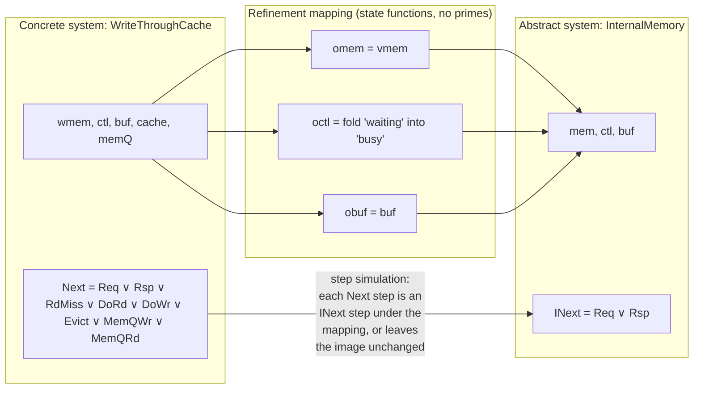
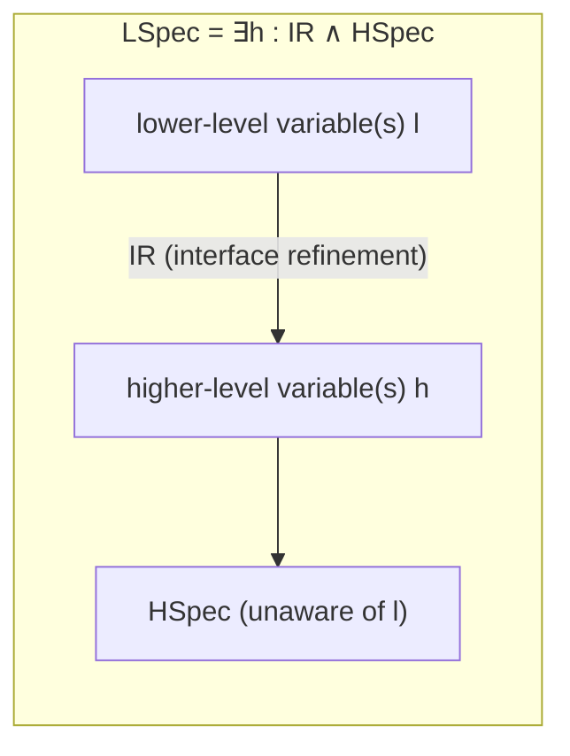

# Refinement and Implementation

[[book-guidelines|↩ Back to guidelines]]

## The problem: what does it even mean for one spec to "implement" another?

Every real system is described at more than one level of detail. A cache-coherent multiprocessor memory, at the level a client program cares about, just looks like a single shared array that reads and writes go through in some sensible order. At the level a hardware engineer cares about, it's per-processor caches, a shared bus, a write queue, and eviction policies. A "value being sent" over a wire, to an application, is one atomic event; to the link layer, it's four bits going out one at a time with per-bit handshaking.

You want to say, formally, "the detailed description is correct" — meaning: anything the detailed system can actually do is something the abstract description already permitted. That's the whole content of the word "implementation" here. TLA+'s answer to what this means is disarmingly simple, and it's worth sitting with before looking at the notation: **a system implements a specification exactly when the system's formula logically implies the specification's formula.** There is no separate proof theory for "conformance" or "refinement" as opposed to "theoremhood" — they are the same relation, because in TLA a system description and a specification are both just temporal-logic formulas over behaviors (infinite sequences of states). If every behavior admitted by $Sys$ is also a behavior admitted by $Spec$, and "behaviors admitted by $F$" is nothing other than "$F$ evaluates to true on," then $Sys \Rightarrow Spec$ *is* the statement "$Sys$'s behaviors are a subset of $Spec$'s behaviors" — which is exactly the informal idea of "the concrete system's behavior is one of the abstract spec's allowed behaviors."

This reframing does real work. It means you don't need a bespoke "refinement calculus" with its own inference rules bolted onto your logic — refinement is checked with the same implication machinery you already use to prove invariants. It also immediately tells you the two things that make implementation proofs hard in practice: (1) the concrete and abstract specs almost never share the same variables, so you need a way to say what the abstract variables *mean* in terms of the concrete state, and (2) you need to show that every step the concrete system can take is consistent with what the abstract spec allows its own steps to do. Those two problems are exactly what **refinement mappings** and **step simulation** solve — the subject of §5.8. The complementary problem — refining the *external interface itself*, not just implementing a fixed one — is what §10.8's **interface refinement** and **data refinement** solve.

## Part 1: Implementation as implication, worked through a cache

### Setup: the two levels

Chapter 5 builds this vocabulary on a concrete example rather than stating it abstractly. There's a high-level `Memory` module specifying a **linearizable memory**: reads and writes from several processors, whose effects on a hidden variable `mem` may take place at some point between request and response — indistinguishable, externally, from an ordinary array with atomic accesses. That module exposes only a public `Spec` (obtained by existentially quantifying away the internal bookkeeping variables `mem`, `ctl`, `buf`), following the hiding idiom used throughout the book.

Then §5.6 specifies a `WriteThroughCache`: each processor $p$ has a local cache `cache[p]`, a shared bus, a shared queue `memQ` of pending writes to the "real" memory `wmem`, and eviction. A write updates the writer's cache immediately, propagates to any other cache holding a copy, and enqueues the write to `wmem`; a read either hits the local cache or, on a miss, enqueues a fetch. Its own **type invariant** and a genuinely new invariant, **`Coherence`** ("any two processors' cached copies of the same address, if both present, must be equal"), are proved of it in §5.7. Notably, `Coherence` is an invariant of the whole specification `Spec` but *not* of the bare next-state action `Next` — a single `Next` step (e.g., a `MemQRd` that installs a stale value into one cache while another still holds the old value from before an intervening write hits main memory) can visibly violate it in isolation. The property only holds across *reachable* states because the [[States-Actions-and-Behaviors#Enabling conditions|enabling conditions]] of the actions rule out ever reaching the bad predecessor state via the disallowed path. This is the standard "invariant of a specification vs. inductive invariant of the next-state action" distinction, and it foreshadows why proving the cache is coherent — let alone that it *implements* the memory — needs an auxiliary invariant `Inv`, found by the specifier, satisfying:

$$\mathit{Init} \Rightarrow \mathit{Inv}, \qquad \mathit{Inv} \wedge [\mathit{Next}]_v \Rightarrow \mathit{Inv}', \qquad \mathit{Inv} \Rightarrow P$$

**What breaks without this distinction:** if you conflated "invariant of $Spec$" with "invariant of $Next$," you'd try to prove `Coherence` by direct induction over single `Next` steps and fail — not because `Coherence` is false, but because your induction hypothesis is too weak. This is the same gap that trips up naive inductive-invariant search in any model checker or abstract interpreter: the property you care about is rarely itself inductive, and you have to *strengthen* it with auxiliary state facts until it is.

### Implementation as implication

The `WriteThroughCache` module ends with exactly the theorem this section is about:

$$\mathit{Spec} \Rightarrow LM\,!\mathit{Spec}$$

where `LM` is an instance of the `Memory` module and `LM!Spec` is its (hidden-variable) linearizable-memory specification. Read literally: every behavior satisfying the cache's `Spec` also satisfies the memory's `Spec`. That is the entire definition of "the cache implements the memory." Lamport states the general principle plainly: *a system described by a formula $Sys$ implements a specification $Spec$ iff $Sys \Rightarrow Spec$ is a theorem.* TLA+ makes no syntactic distinction between "a system" and "a specification" — both are formulas, so "implementation" is not a new primitive, it's an instance of implication you already have machinery for.

**What breaks without collapsing implementation to implication:** if implementation required matching variable names or matching internal structure, you could never implement one design with a wildly different internal representation (a cache with a bus and a queue) against a spec that has none of those things. Reducing implementation to pure logical implication over *behaviors* — sequences of abstract states, unconcerned with what machinery produced them — is precisely what lets a linearizable-memory client be indifferent to whether it's talking to a single array or a whole cache-coherence protocol.

### Refinement mappings: substituting for the hidden variables

Here's the catch. `LM!Spec` is not stated over `mem`, `ctl`, `buf` directly — those are hidden. Unfolding the `exists` in `Memory`'s definition, the theorem becomes:

$$\mathit{Spec} \Rightarrow \exists\, mem, ctl, buf : LM\,!\mathit{Inner}(mem, ctl, buf)\,!\mathit{ISpec}$$

Proving an existentially-quantified goal means exhibiting **witnesses** for the bound variables. The witnesses here aren't ordinary values — they're *state functions*: unprimed TLA+ expressions (no `'`) built from the cache's own variables, that at every point in time stand in for what the abstract variables `mem`, `ctl`, `buf` "would be" if you were watching the cache's execution and trying to describe it at the memory's level of abstraction. Call these witnesses $\mathit{omem}, \mathit{octl}, \mathit{obuf}$. The tuple $\langle \mathit{omem}, \mathit{octl}, \mathit{obuf} \rangle$ is called a **refinement mapping**, and it turns the existential goal into a plain implication with the witnesses substituted in for the bound variables:

$$(5.2)\qquad \mathit{Spec} \Rightarrow LM\,!\mathit{Inner}(\mathit{omem}, \mathit{octl}, \mathit{obuf})\,!\mathit{ISpec}$$

For the memory/cache pair, the book gives explicit witnesses:

$$\mathit{omem} \stackrel{\Delta}{=} \mathit{vmem}, \qquad \mathit{octl} \stackrel{\Delta}{=} [p \in \mathit{Proc} \mapsto \mathbf{if}\ ctl[p] = \text{“waiting”}\ \mathbf{then}\ \text{“busy”}\ \mathbf{else}\ ctl[p]], \qquad \mathit{obuf} \stackrel{\Delta}{=} \mathit{buf}$$

Each of these is worth reading concretely, because refinement mappings are always doing this same job — "given the concrete state, compute what the abstract observer would perceive":

- $\mathit{obuf} = \mathit{buf}$ is trivial: the request/response buffer means the same thing at both levels, so the witness is the identity.
- $\mathit{octl}$ folds an extra concrete-only control state (`"waiting"`, which only exists because the cache has to wait on a memory fetch) back onto the abstract vocabulary (`"busy"`) — the abstract memory has no notion of a cache miss in progress, so from its point of view that's indistinguishable from an ordinary pending request.
- $\mathit{omem}$ is the most interesting: it's `vmem`, a *previously defined, recursively computed* state function ("the value `wmem` will have after every write currently queued in `memQ` finishes") — not `wmem` itself. This is the crux of linearizability: the abstract memory's contents at any instant is not literally today's `wmem`, but the memory state you'd get by "fast-forwarding" the write queue. The refinement mapping is where that entire subtlety gets pinned down formally, in one line.

**What breaks without an explicit refinement mapping:** without $\mathit{omem} = \mathit{vmem}$ specifically (as opposed to $\mathit{omem} = \mathit{wmem}$), the "implementation" claim would be straightforwardly false — a read that gets served from `memQ` before the corresponding write reaches `wmem` would look, from the abstract memory's perspective, like it read a stale value, which the linearizable-memory spec forbids. Finding the *right* witness is exactly where the engineering difficulty of refinement proofs lives; the logic once you have it is routine.

### Step simulation

To actually discharge (5.2), Lamport introduces a shorthand: for any formula $F$ of the internal memory module, write $\overline{F}$ for $F$ with $\mathit{omem}, \mathit{octl}, \mathit{obuf}$ substituted for $\mathit{mem}, \mathit{ctl}, \mathit{buf}$. Then (5.2) reads simply $\mathit{Spec} \Rightarrow \overline{\mathit{ISpec}}$, i.e.

$$(5.3)\qquad \mathit{Init} \wedge \Box[\mathit{Next}]_{\langle \mathit{memInt}, \mathit{wmem}, \mathit{buf}, \mathit{ctl}, \mathit{cache}, \mathit{memQ}\rangle} \;\Rightarrow\; \overline{\mathit{IInit}} \wedge \Box[\overline{\mathit{INext}}]_{\langle \mathit{memInt}, \overline{\mathit{mem}}, \overline{\mathit{ctl}}, \overline{\mathit{buf}}\rangle}$$

This is proved, as with any invariance property, by finding an auxiliary invariant $\mathit{Inv}$ of $\mathit{Spec}$ such that:

$$\mathit{Init} \Rightarrow \overline{\mathit{IInit}}, \qquad \mathit{Inv} \wedge \mathit{Next} \Rightarrow \big(\overline{\mathit{INext}} \vee \mathit{unchanged}\langle \mathit{memInt}, \overline{\mathit{mem}}, \overline{\mathit{ctl}}, \overline{\mathit{buf}}\rangle\big)$$

The second conjunct is **step simulation**: every concrete `Next` step, from a state satisfying the invariant, must either (a) look — through the lens of the refinement mapping — exactly like a legal abstract `INext` step, or (b) leave the abstract-level image $\langle \mathit{memInt}, \overline{\mathit{mem}}, \overline{\mathit{ctl}}, \overline{\mathit{buf}}\rangle$ completely unchanged (a "stuttering" step at the abstract level). This disjunction is what makes finer-grained implementations legal at all: the cache takes many more kinds of steps than the abstract memory (`DoRd`, `DoWr`, `MemQWr`, `MemQRd`, `Evict` — five action shapes at the concrete level versus `Req`/`Rsp` at the abstract one), and most of those concrete steps are "internal bookkeeping" that must map to *no* change abstractly (option (b)), while only the ones that actually complete a request need to map to a genuine abstract step (option (a)).

**What breaks without the stuttering disjunct:** without permitting "unchanged" as one of the two simulation outcomes, a lower-level implementation could never take more steps than its specification — you'd be forced into strict step-for-step correspondence, ruling out virtually every real refinement (a cache genuinely does more internal work per externally-visible request than the abstract memory does). This is exactly the same mechanism as TLA's use of stuttering-insensitivity for the next-state action itself (recall $[\mathit{Next}]_v$ permits `unchanged v`) — refinement mappings just apply that same idea one level up, at the granularity of "does this step matter to the abstraction."

Lamport is candid that the mathematics here is simple but the *engineering* of actually finding $\mathit{Inv}$ and the witness functions for a real system is hard, and treats it as out of scope — the practical payoff for a working engineer, he says, is understanding refinement mappings and step simulation well enough to have TLC (the model checker) check an implementation claim for you (covered in Chapter 14), rather than hand-proving it.



### Grounding: what this looks like as code

**Rust — a trait boundary is a refinement mapping.** If you've ever implemented a trait, you've built a refinement mapping without calling it that. Say you have an abstract `LinearizableMemory` trait and a concrete `WriteThroughCache` struct:

```rust
trait LinearizableMemory {
    fn read(&self, addr: Addr) -> Val;
    fn write(&mut self, addr: Addr, val: Val);
}

struct WriteThroughCache {
    wmem: HashMap<Addr, Val>,
    mem_q: VecDeque<(ProcId, Request)>,
    caches: HashMap<ProcId, HashMap<Addr, Option<Val>>>,
    // ...
}

impl WriteThroughCache {
    // This is exactly `omem`/vmem: a *derived* view, not a stored field —
    // the abstract memory value as of "after every queued write completes."
    fn abstract_mem(&self) -> HashMap<Addr, Val> {
        let mut m = self.wmem.clone();
        for (_, req) in &self.mem_q {
            if let Request::Write(a, v) = req { m.insert(*a, *v); }
        }
        m
    }
}
```

The proof obligation "`WriteThroughCache` implements `LinearizableMemory`" is exactly the claim `Sys ⇒ Spec`; `abstract_mem` *is* the refinement mapping's witness function, computed rather than stored, precisely because the abstract quantity `mem` doesn't correspond to any single physical field. Property-based testing (`proptest`/`quickcheck`) checking that `abstract_mem()` after any interleaving of `read`/`write` calls behaves like a plain `HashMap` is the engineering-grade analogue of proving step simulation — it can't prove the implication, but it can falsify it the same way TLC does, by hunting concrete counterexample traces.

**Lean — refinement as a proved function between state spaces.** In a Lean development this is a function `absState : ConcreteState → AbstractState` (the refinement mapping) plus a theorem that concrete-step transitions commute with it up to stuttering:

```lean
def absState (c : ConcreteState) : AbstractState :=
  { mem := vmem c, ctl := fun p => if c.ctl p = .waiting then .busy else c.ctl p, buf := c.buf }

theorem step_simulation (c c' : ConcreteState) (h : Inv c) (hstep : ConcreteNext c c') :
    AbstractNext (absState c) (absState c') ∨ absState c = absState c' := by
  sorry
```

This is structurally identical to a forward-simulation proof in any operational-semantics development — the same shape you'd use to prove a compiler pass preserves semantics (source step simulates, or is a no-op at, the target level). If you're building the refinement-type compiler described in your learning goals, this is the same proof obligation you'll eventually discharge when arguing that a lowering pass (e.g., surface syntax → an intermediate representation with explicit evidence terms) preserves the meaning your type checker relies on — `absState` there is essentially an erasure/elaboration map, and step simulation is "elaboration commutes with reduction."

**Python — a quick simulation harness.** For intuition rather than proof:

```python
def abstract_mem(wmem, mem_q):
    m = dict(wmem)
    for (_, req) in mem_q:
        if req.op == "Wr":
            m[req.adr] = req.val
    return m
```

Running the concrete cache simulator and re-checking, after every step, that `abstract_mem` only ever changes on steps that correspond to a genuine `Req`/`Rsp` pair (and is otherwise frozen) is literally step simulation, executed rather than proved.

## Part 2: Interface refinement — refining what the system talks about, not just how it works

### The problem §5.8 doesn't cover

Everything above assumes the higher-level and lower-level specs already **agree on their interface** — both talk about "reads and writes to addresses," just at different granularities of internal machinery. But sometimes the thing that changes between levels is the *interface itself*: an hour clock display represented as an integer $hr \in 1..12$ versus the same display as four physical bits; a channel that sends whole numbers versus one that sends them bit-by-bit with per-bit handshaking. Chapter 10's §10.8 develops the machinery for this distinct, complementary problem, built on the composition-by-conjunction ideas developed earlier in the chapter (specs of separate components are just conjoined; hiding is existential quantification — the same idiom used to hide `mem, ctl, buf` in Chapter 5).

### Worked example 1: the binary hour clock

Take the ordinary hour clock spec `HC`, whose variable `hr` ranges over $1..12$. You want to describe a binary hour clock with a four-bit register `bits` displaying the same time. The naive approach — literally substitute an expression for `hr` — almost works via TLA+'s `instance ... with` construct:

$$B \stackrel{\Delta}{=} \texttt{instance HourClock with } hr \leftarrow \mathit{BitArrayVal}(\mathit{bits})$$

but it's unsound as written: $\mathit{BitArrayVal}(b)$, defined by

$$\mathit{BitArrayVal}(b) \stackrel{\Delta}{=} \mathbf{let}\ n = \mathbf{choose}\ i \in \mathit{Nat} : \mathrm{domain}\, b = 0\,..\,i;\quad val[i \in 0\,..\,n] = \ldots\ \mathbf{in}\ val[n]$$

is only meaningful when $b$ is a well-formed bit array — for anything else (e.g. `bits = {"abc"}`) it's an unconstrained `choose` that could evaluate to anything, including a "valid" hour value like 7. That would let `B!HC` silently accept a behavior where `bits` starts out as garbage. The fix is to sanitize the substituted expression itself, replacing it with a total function that maps ill-formed input to a value *outside* the valid range so the surrounding spec's own constraints reject it:

$$\mathit{HourVal}(b) \stackrel{\Delta}{=} \mathbf{if}\ b \in [(0\,..\,3) \to \{0,1\}]\ \mathbf{then}\ \mathit{BitArrayVal}(b)\ \mathbf{else}\ 99$$

**What breaks without the sentinel value:** this is a small but sharp lesson about substitution-based refinement generally — a state function you plug in for a hidden/abstract variable must be *total and safe on all reachable concrete states*, including the malformed ones your own spec doesn't rule out syntactically. Skipping this is exactly the kind of soundness gap a hand-written elaborator's implicit-argument substitution can fall into if it doesn't account for ill-typed intermediate states during unification.

The more general, and ultimately preferred, formulation doesn't substitute at all — it **composes and hides**, exactly like Chapter 5's `exists mem, ctl, buf : ...`:

$$(10.7)\qquad \exists\, hr : \mathit{IR} \wedge \mathit{HC}, \qquad \mathit{IR} \stackrel{\Delta}{=} \Box\,(hr = \mathit{HourVal}(\mathit{bits}))$$

Here $\mathit{IR}$ — the **interface refinement** — is itself a small standalone spec-like formula relating the lower-level variable ($\mathit{bits}$) to the higher-level one ($hr$), and the whole binary-clock spec is "some hour-clock behavior exists whose display is exactly what $\mathit{bits}$ encodes at every instant." (Because `hr` needs to be a fresh bound variable but is already declared as `HourClock`'s free variable, this needs parametrized instantiation — `H(hr) ≜ instance HourClock`, then quantify over the parameter — a purely syntactic wrinkle, not a conceptual one.)

### Worked example 2: refining a value channel to a bit-serial channel

The richer example: a higher-level channel `h` sends whole numbers $1..12$; a lower-level channel `l` sends the same number as four bits, most-significant first, each individually acknowledged (reusing the `Channel` handshake protocol from Chapter 3). The general shape is the same as (10.7):

$$(10.8)\qquad \exists\, h : \mathit{IR} \wedge \mathit{HSpec}$$

but now $\mathit{IR}$ needs genuine **internal state** to do its job — an auxiliary variable $\mathit{bitsSent}$ tracking the (reverse-order) bits accumulated so far for the number in flight — because whether a given bit-send/ack on `l` corresponds to *anything* happening on `h` depends on history, not just the current state of `l`. This is the key structural difference from example 1: there, `hr` was a *pure function of the current* `bits`; here, `h`'s value depends on a whole sequence of prior `l`-level events. The internal spec (module `Inner`, with $\mathit{bitsSent}$ visible) defines three actions:

- **`SendBit`**: sending one of the first three bits appends it to $\mathit{bitsSent}$ and leaves `h` unchanged; sending the fourth resets $\mathit{bitsSent}$ and sends the assembled number on `h` via `H!Send(BitSeqToNat[...])`.
- **`RcvBit`**: an ack on `l` triggers an ack on `h` iff it's acking the fourth bit ($\mathit{bitsSent} = \langle\rangle$ at that point).
- **`Error`**: any change to `l` that isn't a legal `Send`/`Rcv` forces `h` to an explicit `ErrorVal` outside the legal value set — the same "poison malformed input" move as `HourVal`'s `99`, generalized to full protocol violations rather than just type mismatches.

Then $\mathit{bitsSent}$ is hidden ($\mathit{IR} \stackrel{\Delta}{=} \exists\, \mathit{bitsSent} : \mathit{InnerIR}$) exactly as `mem`/`ctl`/`buf` were hidden in Chapter 5 and `hr` was exposed-then-reused in example 1. Composing this with a higher-level spec is then routine instantiation-and-conjunction:

$$LSpec \stackrel{\Delta}{=} \exists\, h : CR(h)\,!\mathit{IR} \wedge HS(h)\,!\mathit{HSpec}$$

### Interface refinement in general, and data refinement as its degenerate case

Both examples share the shape

$$(10.9)\qquad LSpec \stackrel{\Delta}{=} \exists\, h : IR \wedge HSpec$$

which the book draws as a small pipeline — think of $IR$ as a standalone component sitting between the lower-level wire and the higher-level abstraction it presents:



Generalized to multiple variables on each side, $LSpec \stackrel{\Delta}{=} \exists\, h_1, \ldots, h_n : IR \wedge HSpec$. Two structural conditions matter:

1. **Interface independence.** A well-formed $IR$ should depend only on how the interface is represented, not on the particular system using it — the same $IR$ (channel or clock refinement) should work for *any* $HSpec$ built on that interface. Formally: $\exists\, h : IR$ should be **valid** (true of every behavior of $l$) — every legal (or illegal!) lower-level trace must be assigned *some* higher-level interpretation, even if that interpretation is "the interface broke" (`ErrorVal`).
2. **Data refinement as the degenerate, simplest case.** When $IR$ has the special shape $IR = \Box P$ for a *state predicate* $P$ — i.e., the higher-level variables are a pure, memoryless function of the *current* lower-level state, with no auxiliary history variable needed — this is called **data refinement**. The binary clock is exactly this: $P \equiv (hr = \mathit{HourVal}(\mathit{bits}))$. The bit-serial channel is emphatically *not* a data refinement — $h$'s value depends on a whole subsequence of `l`'s history (which is exactly why $IR$ needed the internal variable $\mathit{bitsSent}$ and a next-state action, not just a predicate).

A further worked pair of data refinements: Chapter 3's two equivalent channel interfaces — `Channel` (variable `chan`, a record) and `AsynchInterface` (separate variables `val`, `rdy`, `ack`) — are each a data refinement of the other. Going record→separate-fields is the easy direction, $P \equiv (chan = [val \mapsto val, rdy \mapsto rdy, ack \mapsto ack])$. Going the other way is subtler: the naive predicate `GoodVals` ($val = chan.val \wedge \ldots$) doesn't rule out `chan` holding a structurally illegal value (extra fields, etc.), so it has to be guarded: $P \equiv \mathbf{if}\ chan \in [val: Data, rdy: \{0,1\}, ack: \{0,1\}]\ \mathbf{then}\ \mathit{GoodVals}\ \mathbf{else}\ \mathit{BadVals}$ — the same "sentinel-for-malformed-input" discipline seen twice already, now applied to structural well-formedness of a whole record rather than a numeric range.

**What breaks without distinguishing data refinement from general interface refinement:** if you always reached for a bare state predicate $P$, you'd have no way to express interfaces whose abstraction genuinely depends on history — like message reassembly, framing, or (in a compiler setting) any elaboration step where the surface-level meaning of a token depends on tokens already consumed. Recognizing when $IR$ collapses to $\Box P$ versus when it needs its own internal variables and actions is the practical skill this section is teaching.

### Interface refinement meets open-system liveness

The subtlest part of §10.8 (§10.8.4) is what happens when $HSpec$ has liveness requirements and the refinement is layered on top of an **open-system** spec (recall §10.7's convention: attribute every interface change either to the system or to the environment, since neither side alone can guarantee both wants; the FIFO example there used $E \overset{+}{\leadsto} M$ to state "if the environment behaves, the machine does"). Suppose $HSpec$ requires the system to *eventually* send some number on `h`. Now consider a lower-level behavior where the system sends the first bit on `l`, but the environment simply never acknowledges it — forever. Under $IR$, this is interpreted at the `h` level as "`h` never changes," which violates $HSpec$'s liveness requirement, and by (10.9) makes $LSpec$ false. That's exactly backwards: the *system* did nothing wrong, and yet plain $(10.9)$ blames it.

**What problem this solves that plain implication doesn't:** the fix generalizes the open-system attribution trick — put a `Liveness` guard in front:

$$(10.11)\qquad LSpec \stackrel{\Delta}{=} \mathit{Liveness} \Rightarrow \big(\exists\, h : IR \wedge HSpec\big)$$

where `Liveness` states that the environment must eventually acknowledge any non-final bit ($\mathrm{WF}_{\langle l,h,\mathit{bitsSent}\rangle}(\mathit{RcvBit} \wedge (\mathit{bitsSent} \ne \langle\rangle))$), *or* the interface has already gone to `ErrorVal` ($\Diamond(h = \mathit{ErrorVal})$) — in which case blame is already assigned by the safety part and `Liveness` should just be true so it doesn't interfere. If instead the environment is the one *sending* over `h` and the system must acknowledge, the direction of the guard flips to a plain conjunction, $LSpec \stackrel{\Delta}{=} \mathit{Liveness} \wedge (\exists\, h : IR \wedge HSpec)$ — equivalent, since $h$ is not free in `Liveness`, to folding `Liveness` directly into the interface refinement itself: $LSpec \stackrel{\Delta}{=} \exists\, h : (\mathit{Liveness} \wedge IR) \wedge HSpec$. Either way, the moral is the same one from §10.7 generalized one level: **an interface refinement composed with a liveness-bearing higher-level spec must itself take a position on who is blamed for stalls introduced purely by the lower-level protocol's extra handshaking steps** — otherwise the refined spec silently inherits liveness failures that have nothing to do with the system's actual behavior.

### Grounding: interface refinement as encoding/decoding, not implementation

This is a genuinely different mechanism from Part 1's refinement mapping, and the [[Elementary-Mathematical-Foundations-for-Specification#Grounding|grounding]] should reflect that: a refinement mapping is "how do I *view* an existing lower-level system's state at a higher level of abstraction to check it against a fixed spec"; an interface refinement is "how do I *build* a genuinely different, lower-level interface out of a higher-level one, and prove the translation faithful" — closer to a wire-protocol codec with a correctness proof than to a simulation relation.

**Rust — data refinement as a codec with a totality/soundness argument.**

```rust
// Data refinement: h is a pure function of current l -- IR = []P
fn hour_val(bits: [Option<bool>; 4]) -> u8 {
    match bits {
        [Some(b3), Some(b2), Some(b1), Some(b0)] => {
            let n = (b3 as u8) << 3 | (b2 as u8) << 2 | (b1 as u8) << 1 | (b0 as u8);
            if (1..=12).contains(&n) { n } else { 99 } // sentinel: outside HourClock's legal range
        }
        _ => 99, // malformed input -> also poisoned, never a legal hour
    }
}
```

The bit-serial channel, by contrast, is *not* a pure function — it's a small state machine, which is the honest Rust shape for a non-data interface refinement:

```rust
enum ChannelRefineState { Collecting(Vec<bool>), Idle }

struct ChannelRefiner { state: ChannelRefineState, h_value: Option<u8> }

impl ChannelRefiner {
    // Mirrors SendBit/RcvBit/Error exactly: most transitions leave h_value alone;
    // only completing the 4th bit (or an illegal l-event) updates it.
    fn on_send_bit(&mut self, bit: bool) {
        if let ChannelRefineState::Collecting(bits) = &mut self.state {
            bits.push(bit);
            if bits.len() == 4 {
                self.h_value = Some(bits_to_num(bits));
                self.state = ChannelRefineState::Collecting(Vec::new());
            }
        }
    }
}
```

This is the same shape as a lexer's DFA feeding a parser's higher-level token stream — each low-level character event mostly leaves the "current token" abstraction unchanged, until the delimiter event fires and a token is emitted. Recognizing "my low-level protocol handler is an interface refinement of my high-level protocol spec" is directly useful in verifying wire-format codecs, and is a natural target for property-based fuzzing against `IR`'s stated invariant (every `l`-trace maps to *some* well-defined `h`-trace, never an unconstrained one).

**Lean.** An interface refinement is literally a relation (or, in the data-refinement case, a function) between two state types plus a proof it's total and history-consistent — in Lean terms, exactly the shape of a bisimulation-style refinement relation used in verified-compiler work (e.g. CompCert-style `match_states` relations), except here it only needs to go one direction (lower state determines higher state's next value) rather than a full two-sided simulation.

## Where this leads, and how it connects to the standing project

Structurally, these two mechanisms are the complete TLA+ answer to "how do abstraction levels relate to each other," and they cover the two directions that answer needs:

- **§5.8 (refinement mapping + step simulation)** answers: *given a fixed abstract interface, does this concrete implementation behave consistently with it?* This is a **verification** question — checking one system against an existing spec.
- **§10.8 (interface refinement, including data refinement as its simplest case)** answers: *how do I derive a new, lower-level interface from an existing higher-level one, and under what conditions is the derivation faithful (including under liveness)?* This is closer to a **construction/design** question — building the lower-level contract itself, with a built-in correctness argument.

Both reduce, ultimately, to the same core idea as §5.8: a witness/mapping between two state spaces, plus a proof obligation that transitions (or, for data refinement, values) correspond correctly — existential quantification and hiding doing the "forget the extra bookkeeping" work in both directions.

For the standing project (a Rust-based dependent/refinement-type compiler with an embedded verifier): refinement mappings and step simulation are the direct ancestor of the correctness argument you'll need for **any lowering pass that changes representation but must preserve semantics** — e.g., elaborating surface syntax with implicit metavariables into a fully explicit core term, or compiling a refinement-typed IR into an SMT verification-condition representation. The witness-function-plus-simulation pattern here is the untyped, state-machine-level version of what a **trusted kernel**'s `isDefEq` check does at the term level: both are "show that stepping at the low level, when viewed through a projection, never contradicts what the high level allows." Interface refinement, meanwhile, especially data refinement's guarded-predicate discipline (`if wellFormed then GoodVals else BadVals`), is a direct, load-bearing analogue of how a **refinement-type subtyping check** or a **CSP domain-abstraction map** must handle representation invariants: a value at the concrete/lattice level is only meaningful once you've established it's well-formed, and anything else must be routed to an explicit "poisoned"/bottom outcome rather than silently misinterpreted — precisely the discipline your abstract-interpretation domains and CHC-based invariant generation will need when abstracting concrete program states into abstract lattice elements.
