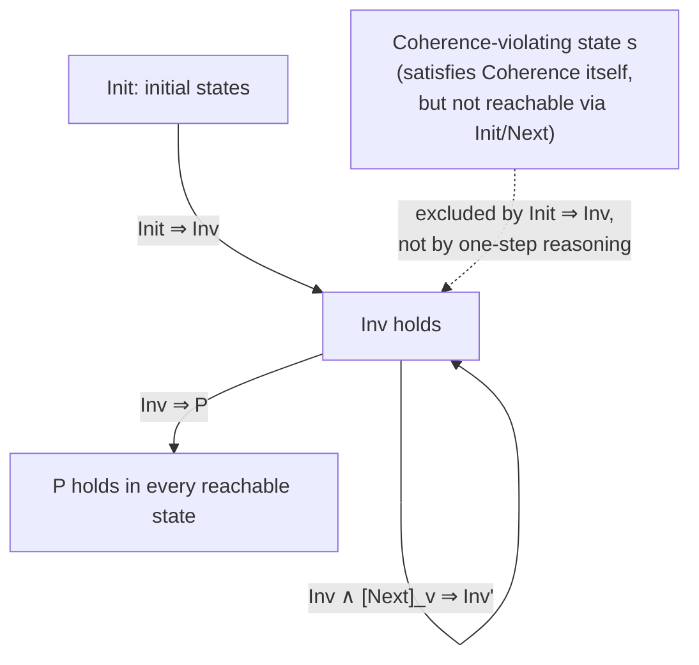

[[book-guidelines|↩ Back to guidelines]]

# Specifying Safety Properties

A safety property says "nothing bad ever happens." In TLA+ this is not a
special syntactic category — it is just an ordinary predicate over states that
you assert holds forever. This article works through the machinery Lamport
builds for that assertion: what a specification's canonical shape is, what an
*invariant* means precisely, why "type checking" in TLA+ is nothing but a
particular invariant with no privileged status, why some invariants are easy
to prove and others are not, and why none of this breaks even though TLA+ has
no type system to stop you from writing nonsense expressions.

## 1. The canonical specification form

Every TLA+ specification you'll write has the same skeleton:

$$Spec \;\stackrel{\Delta}{=}\; Init \land \Box[Next]_v$$

- $Init$ is a state predicate: it describes which states are allowed to start a
  behavior.
- $Next$ is an *action* — a formula relating a state to its successor, written
  with both unprimed variables (old values) and primed variables (new values,
  $v'$).
- $[Next]_v$ is shorthand for $Next \lor (v' = v)$: either a real $Next$ step
  happens, or nothing changes (a *stuttering step*). $v$ here is the tuple of
  all the specification's variables.
- $\Box$ ("always") says the bracketed thing holds at every step of the
  behavior, forever.

So a specification is a conjunction of "start here" and "every step is either
a legal transition or a no-op, forever." This is the entire "canonical form"
— everything you will build in this book (fairness conditions, real-time
bounds, composed specifications) gets conjoined onto this skeleton, never
replaces it. Concretely, in the asynchronous-interface example (Ch. 3), with
three variables `val`, `rdy`, `ack`:

```
Next  ≜ Send ∨ Rcv
Spec  ≜ Init ∧ □[Next]⟨val, rdy, ack⟩
```

**What breaks without stuttering.** If you wrote $Init \land \Box Next$
instead (no bracket, no stuttering disjunct), you would be asserting that a
$Next$ step occurs at *every single point* in the behavior, forever — the
system could never idle. Worse, it would make the specification impossible to
compose with anything: a bigger system built from `AsynchInterface` and other
components needs some steps in which *this* component does nothing while
another component acts. Without an explicit stuttering allowance, that
"other component moves, I don't" step wouldn't satisfy $Spec$ at all. This is
why $[Next]_v$, not bare $Next$, is the form you always use — it's not a
cosmetic convenience, it's what makes safety specifications composable and
what makes "termination" expressible as infinite stuttering rather than as a
special end-of-behavior construct.

A Rust intuition for this shape: think of $Init$ as the constructor's
postcondition and $[Next]_v$ as a `step(&mut self)` method's precondition/
postcondition pair, except that the "postcondition" here is checked against
*every possible* mutation the type could ever undergo, including the identity
mutation. TLA+ is asserting a transition-system invariant over an
unboundedly long trace, not a single call.

## 2. State predicates, state functions, and what an invariant actually is

Before defining "invariant," Lamport nails down three terms precisely
(Ch. 3 §3.1, p. 25):

- **State function**: an ordinary expression — no primes, no $\Box$ — built
  from variables and constants. It denotes a value *of* a single state.
- **State predicate**: a Boolean-valued state function.
- **Invariant of a specification $Spec$**: a state predicate $Inv$ such that

$$Spec \Rightarrow \Box Inv$$

is a theorem.

Read that implication carefully — it is the entire definition, and it is
weaker than it sounds. It does *not* say "$Inv$ holds after every action";
it says "every complete behavior satisfying $Spec$ has $Inv$ true in every
one of its states." Those turn out to be two different claims (Section 3
below is entirely about the gap between them).

In Rust terms, a state predicate is a pure function `fn p(s: &State) -> bool`
with no dependence on history — it can't see the previous state, only the
current one. "Invariant of `Spec`" is a claim about the *whole trace* your
model-checker or type-checker would need to walk: `∀ s ∈ reachable_states(Spec), p(s)`. This is exactly the informal content of a **safety invariant** as
used in program verification and in abstract interpretation: a property that
holds at every reachable program point. TLA+ gives you the precise logical
statement of that claim rather than leaving it as folklore.

## 3. Type invariants: not a type system, just an invariant with a name

Chapter 3 introduces `TypeInvariant` for the asynchronous interface:

$$TypeInvariant \;\stackrel{\Delta}{=}\; (val \in Data) \land (rdy \in \{0,1\}) \land (ack \in \{0,1\})$$

and then gives the definition that the whole section has been building
toward:

> A variable $v$ has *type* $T$ in a specification $Spec$ iff $v \in T$ is an
> invariant of $Spec$.

That's it. "Type" is not a primitive notion in TLA+; it is *defined in terms
of* invariant, which is itself just an ordinary temporal implication. Lamport
is explicit that this buys you nothing structurally: giving a formula the
name `TypeInvariant` "gives it no special status" (Ch. 3 §3.3, p. 30). The
specification doesn't *assume* `TypeInvariant`; if you want it to hold, you
state and separately prove

$$\text{theorem } Spec \Rightarrow \Box\,TypeInvariant$$

exactly like you'd state and prove any other invariance property.

**What this buys, and what it costs.** In a language with a real type
system, `rdy: {0, 1}` (or, closer to a real type, `rdy: bool`) is a syntactic
constraint enforced by construction — you literally cannot form a term that
violates it. In TLA+, `rdy` is an ordinary mathematical variable that can be
assigned any value in the universe of ZF sets — Lamport says outright that
there exist states where `rdy` equals $-\tfrac12$ (Ch. 3 §3.3, p. 30). What
`TypeInvariant` gives you is a *semantic* guarantee, proved after the fact,
that no *reachable* state (one occurring in a behavior actually satisfying
$Spec$) ever exhibits that value. The type system's job — ruling out
ill-typed terms before they can even be written down — is entirely absent;
its *outcome* — "well-typed values only, in practice" — is recovered as a
theorem about the specification's reachable states.

**Rust [[Elementary-Mathematical-Foundations-for-Specification#Grounding|grounding]].** Rust's type checker rejects `let rdy: bool = -0.5;` at
compile time — a *syntactic*, closed-world guarantee that holds for every
possible run of the program, checked once, statically. TLA+'s `TypeInvariant`
is closer to a Rust `debug_assert!(matches!(rdy, 0 | 1))` inserted at the top
of every state-transition function, *combined with a proof obligation* that
the assertion can never fire — except TLA+ gives you the actual logical
content of that proof obligation as a first-class formula you can manipulate,
rather than leaving it as an assertion you hope never trips. If you are
building a refinement-type checker, this is a genuinely useful reframing:
your refinement predicate ($x : \{v : \text{Int} \mid v > 0\}$) *is*, at the
semantic level, exactly a TLA+-style invariant on your language's states —
the "type" is the human-facing name attached to an invariant your verifier
must separately establish, not a different kind of object from any other
invariant you might want to prove (e.g. `Coherence` below). Refinement typing
is, in this sense, the special case of invariant-checking where the invariant
happens to be attached syntactically to a variable's declaration site instead
of stated as a free-standing theorem.

**Lean grounding.** Lean's dependent types *do* let you attach `rdy : Fin 2`
and get the "cannot construct an ill-typed value" guarantee syntactically —
but note that Lean *also* has a large space of properties that live outside
the type and must instead be proved as separate lemmas about a value that
already type-checks (e.g. a sortedness invariant on a `List Nat` that is not
baked into the `List` type itself). TLA+'s point is that *everything* — what
Lean would call a "type" (finite membership) and what Lean would call a
"lemma" (`Coherence`, below) — sits in that second, undifferentiated
bucket. TLA+ has no analogue of Lean's `Fin 2 : Type`; it only has
predicates and the single mechanism of proving them invariant.

## 4. Inductive invariants versus invariants of a specification

This is the sharpest and most useful distinction in the whole topic, and
Lamport draws it using the write-through cache's `Coherence` property
(Ch. 5 §5.7, pp. 61–62).

The module asserts

$$\text{theorem } Spec \Rightarrow \Box(TypeInvariant \land Coherence)$$

Since $\Box(P \land Q) \equiv \Box P \land \Box Q$, this is equivalent to two
separate invariance theorems — one for `TypeInvariant`, one for `Coherence`.
Both are, by the Section 2 definition, invariants of `Spec`. But they behave
completely differently with respect to the bare next-state action `Next`:

**`TypeInvariant` is preserved by every individual `Next` step.** Formally,

$$TypeInvariant \land Next \Rightarrow TypeInvariant'$$

is a theorem. Given *any* state satisfying `TypeInvariant`, taking *any*
`Next` step lands you in a state that again satisfies it — no matter what
came before that state, no matter how it was reached. When a predicate $P$
satisfies $P \land N \Rightarrow P'$ for the next-state action $N$, Lamport
calls $P$ an **inductive invariant** of $N$. It's called "inductive" for the
obvious reason: it's exactly the induction step of a proof that $P$ holds at
every point of every behavior, with $Init \Rightarrow P$ supplying the base
case.

**`Coherence` is *not* an inductive invariant of `Next`.** Lamport constructs
an explicit counterexample state $s$: two processors $p_1, p_2$, with
`cache[p1][a] = 1`, all other cache entries empty, `wmem[a] = 2`, and a
pending read from `p2` for address `a` sitting in the memory queue.
`Coherence` is true in $s$. But $s$ is *reachable only from other states that
already violate the invariant you'd need to rule it out* — more precisely,
taking a single legal `Next` step (`MemQRd`) from $s$ lands in a state $t$
where `cache[p2][a] = 2` while `cache[p1][a] = 1`, and `Coherence` is now
false in $t$. So `Coherence ∧ Next ⇒ Coherence'` is simply not a theorem —
you can find a state satisfying the hypothesis and violating the conclusion.

And yet `Coherence` genuinely *is* an invariant of the full specification
`Spec` — the state $s$ above, despite satisfying `Coherence` itself, is
simply never reached by any behavior that starts in `Init` and only takes
`Next` steps; the specification's history rules it out even though the
one-step transition relation alone does not. This is the crux: **"invariant
of a next-state action" and "invariant of a specification" are genuinely
different claims**, and the second is strictly weaker to state but far harder
to prove, because you can no longer reason about a single step in isolation
— you need information about *how the state was reached*.

**The general proof obligation.** To prove that some property $P$ is an
invariant of $Spec = Init \land \Box[Next]_v$ — i.e. to prove
$Init \land \Box[Next]_v \Rightarrow \Box P$ — when $P$ itself isn't
inductive, the standard technique is to manufacture a *stronger*, genuinely
inductive predicate $Inv$ that implies $P$, and discharge three separate,
purely first-order (non-temporal!) proof obligations:

$$Init \Rightarrow Inv \qquad\qquad Inv \land [Next]_v \Rightarrow Inv' \qquad\qquad Inv \Rightarrow P$$

Read left to right: $Inv$ holds initially; $Inv$ is preserved by every step
(this is the actual induction step, over the *bracketed* action so stuttering
steps are included too); and $Inv$ is strong enough to imply the property you
actually care about. All the temporal reasoning about infinite behaviors has
been compiled away into three ordinary (non-temporal) implications you can
check state-by-state. Lamport doesn't show how `Inv` was found for
`Coherence` — "since our subject is specification, not proof, I won't
discuss how to find $Inv$" (p. 63) — but the *shape* of the proof obligation
is exactly what any invariant-generation tool has to produce.

**Why this is the load-bearing idea for automated invariant generation.**
This three-part obligation is *literally* the Hoare-logic / abstract-
interpretation invariant-checking recipe, stated in TLA's vocabulary instead
of a program-logic's:

| TLA+ | Program verification |
|---|---|
| $Init$ | precondition at entry |
| $[Next]_v$ | the (possibly nondeterministic) transition relation / loop body |
| $Inv$ | a candidate loop/transition invariant |
| $Init \Rightarrow Inv$ | base case |
| $Inv \land [Next]_v \Rightarrow Inv'$ | inductive step |
| $Inv \Rightarrow P$ | the invariant is strong enough to imply the safety goal |

If you are building an abstract interpreter that automatically synthesizes
Hoare-style loop invariants (widening on an abstract lattice, Horn-clause
solving, etc.), this is precisely the object it is searching for: `Coherence`
is a property that is true of every reachable state but *false* as a bare
one-step inductive fact, so any sound invariant-generation procedure that
only ever tries "is $P$ itself inductive?" will fail on it and must instead
search the space of *strengthenings* of $P$ — exactly the widening/narrowing
or CEGAR-refinement loop that automated tools implement to escape local,
one-step-only reasoning. The book gives you, in miniature and without
automation, the exact obligation your CSP/abstract-interpretation kernel
needs to discharge mechanically: find *some* $Inv$ satisfying those three
implications, where $P$ alone might not satisfy the middle one.



## 5. Silly expressions: why an untyped language doesn't fall apart

A natural objection at this point: if `TypeInvariant` is just an ordinary
invariant with no enforcement mechanism, what stops you from writing
nonsense — dividing by zero, indexing a function outside its domain — and
having your specification's meaning become garbage? Chapter 6 §6.2 answers
this directly.

TLA+, following the standard set-theoretic formalization mathematicians
already use, is **untyped**: *every syntactically well-formed expression has
some meaning*, even a silly one like $3/0$ or $3/\text{"abc"}$. There is no
notion of "ill-typed, therefore rejected." The definitions of `/` and `*` in
the standard `Reals` module simply don't pin down what $0 * (3/0)$ equals —
its value is some unspecified element of the universe, but *some* value
exists, because TLA+ never asks "is this well-typed" in the first place.

The key move is Lamport's example:

$$\forall x \in Real : (x \neq 0) \Rightarrow (x * (3/x) = 3)$$

This is a true formula. Substitute $x = 0$: you get
$(0 \neq 0) \Rightarrow (0 * (3/0) = 3)$, which contains the silly subterm
$3/0$ — and the *whole formula is still true*, vacuously, because
$0 \neq 0$ is `false`, and `false ⇒ P` is true regardless of what $P$ says.
**A correct formula can contain silly expressions, as long as the formula's
truth doesn't actually depend on their (unspecified) value.** $3/0 = 3/0$ is
another example: trivially true because everything equals itself, no matter
how meaningless $3/0$ is.

This is the general safety net: no sound syntactic rule can rule out "silly"
expressions like $3/0$ without also ruling out perfectly good ones (you
cannot, in general, statically decide whether a divisor is provably
nonzero at the point of use) — so TLA+ doesn't try. Instead it accepts that
undefined-looking subexpressions can appear, and relies on the *logic*
guaranteeing that a well-formed theorem's truth never actually leans on an
unspecified value. This is exactly why `TypeInvariant` is safe to treat as
"just an invariant" rather than a load-bearing guard: nothing catastrophic
happens if you write an expression outside its intended domain, because
TLA+'s semantics were designed (via total, if partially unspecified,
operators) to make that harmless rather than to make it inexpressible.

**The explicit cost-benefit trade Lamport draws.** For *programming
languages*, a type system earns its keep: it lets a compiler generate more
efficient code and it catches real errors before runtime, and those benefits
outweigh the expressiveness lost. For *writing specifications*, Lamport says
plainly that in his experience the costs outweigh the benefits — the
constraints imposed by a real type system would make certain useful
specification idioms hard or impossible to write (he cites an operator
`ℛ` from the memory specification, defined in a way that couldn't be typed
in a conventional programming language). Whether or not you accept the
trade for specifications, notice that the *engineering* trade-off he's
describing is a familiar one: static guarantees vs. expressiveness, paid for
either at write-time (types) or at proof-time (invariants proved after the
fact, as in Section 4).

**Rust/Lean grounding.** Rust's `Option<T>` and `Result<T, E>` are exactly
the mechanism TLA+ deliberately does *without*: instead of a
`3/0`-can't-typecheck story, Rust forces `1 / 0` for integers to panic at
runtime (a *dynamic*, checked failure) and forces floating-point division to
route through IEEE `NaN`/`Infinity` — a genuine "silly but total" value,
structurally identical in spirit to TLA+'s unspecified-but-existing
$3/0$. Rust's choice for floats is, in miniature, TLA+'s choice for
*everything*: make every operation total (always return *something*), and
push the burden of correctness onto proving that the silly cases never
influence anything you actually depend on. Lean, being built on a genuine
type theory, takes the opposite tack for its core operators: `Nat.div` is
defined so `n / 0 = 0` by convention — again totalizing the function rather
than making it partial — but Lean additionally *lets you* refine that away
with a `Nat` subtraction/division proof obligation (`Nat.div_lt`, `h : n ≠
0` hypotheses) when you need division's usual algebraic laws to actually
hold. That subtlety — a totalized "junk value" convention *underneath* the
type system, with real algebraic guarantees only available once you supply
side-conditions — is precisely TLA+'s $3/0$ story, minus the type system:
both approaches admit meaningless terms and both rely on you never letting a
theorem's truth hinge on the meaningless case.

## Synthesis: how this fits the book, and the compiler project

Structurally, this topic is the hinge between "how do I write a
specification" (Chapters 2–4) and "how do I *know* it's correct"
(Chapter 5 onward and, more heavily, temporal liveness in Chapter 8). The
canonical form $Init \land \Box[Next]_v$ is the object every later chapter
augments (with fairness, with real-time bounds, with composition) but never
replaces. The type-invariant/inductive-invariant distinction is what makes
Chapter 5's refinement-mapping proof (`step simulation`, §5.8) legible: a
refinement mapping's correctness is itself proved via exactly the three-part
$Init \Rightarrow Inv$, $Inv \land Next \Rightarrow Inv'$ obligation
introduced here. And the untyped-language discussion in §6.2 is the
book's explicit justification for something you will otherwise find odd
throughout the rest of the book: TLA+ never stops you from writing an
expression, it only ever *proves things about* the expressions you write.

For the `static-analysis` focus area specifically: the $Init \Rightarrow Inv$,
$Inv \land [Next]_v \Rightarrow Inv'$, $Inv \Rightarrow P$ triple is the
textbook shape of the safety-invariant proof obligation that a Hoare-logic-
based or Constrained-Horn-Clause-based verifier must automatically discharge
— your compiler's abstract interpreter will be *synthesizing* candidate
`Inv`s (via widening on an abstract lattice) that satisfy exactly this
triple, and `Coherence` is a worked, human-legible example of a property
that is true of every reachable state but requires strengthening before it
becomes inductive — the same phenomenon that forces real abstract
interpreters into widening/narrowing or CEGAR loops rather than a single
one-step inductiveness check. The `TypeInvariant`-is-just-an-invariant
framing also bears directly on `type-theory`: it's a clean argument that
refinement typing and general invariant-checking are the *same* verification
problem viewed from two angles — one where the predicate is attached to a
binder's syntax and discharged by an elaborator, and one where it's a
free-standing theorem discharged by a separate invariance proof — which is
worth keeping in mind when you design how your refinement-type checker's
proof obligations get generated and handed off to the underlying solver.

## Where this leads

The invariant machinery here is reused almost unchanged for
refinement-mapping proofs in Chapter 5 §5.8 (an implementation proof *is* an
invariant proof, just phrased over two specifications' combined state) and
resurfaces as the *safety half* of every liveness specification from
Chapter 8 onward, where $Init \land \Box[Next]_v$ gets conjoined with
fairness conditions rather than replaced. The untyped-language discussion in
§6.2 is also the direct setup for §6.3–6.4 (recursive definitions and the
functions-versus-operators distinction), where the same "some syntactically
valid things denote unspecified values" idea reappears for self-referential
function definitions like `circ[n] ≜ choose y : y ≠ circ[n]`.
