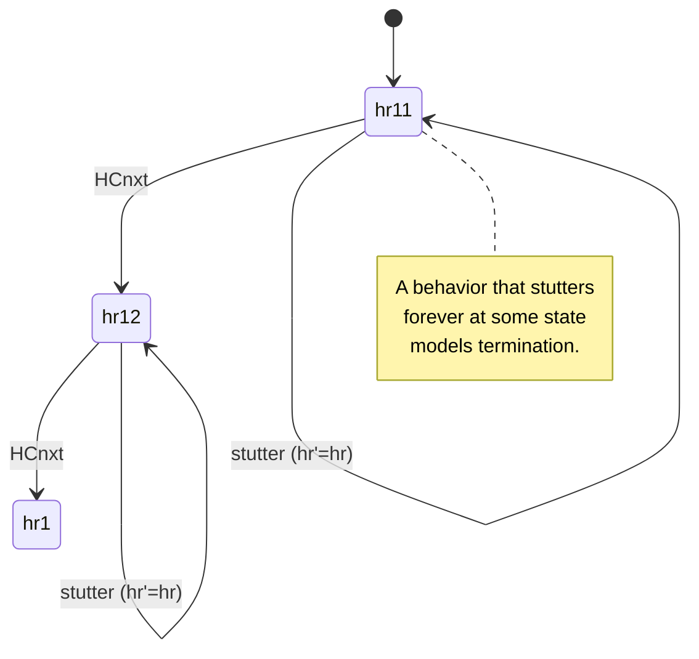
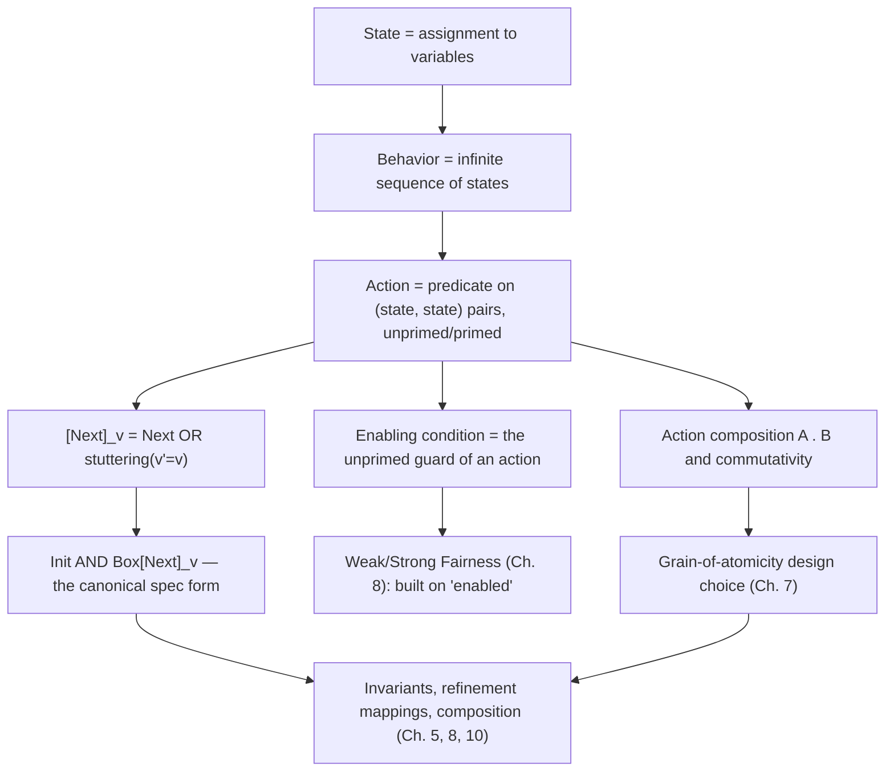

# States, Actions, and Behaviors

[[book-guidelines|↩ Back to guidelines]]

## Why TLA+ starts here, before any logic at all

Before Lamport gives you a single temporal operator, he gives you a physicist's habit: describe a system the way scientists describe the earth-moon system — as a *state* that evolves, where the state is nothing more than "the values of some variables." A computer system's execution then becomes a sequence of these states, one after another, each pair of consecutive states called a **step**. This is the entire ontology TLA+ needs. There is no built-in notion of "process," "message," "thread," or "event" — those are things you *build* out of states and steps when your specification calls for them. This matters for a compiler/verifier project: it means the semantic domain you eventually need for a specification language can be as thin as "sequences of variable assignments plus a relation on consecutive pairs" — everything else (control flow, concurrency, protocols) is macro-expressible on top of that, not baked into the kernel.

What follows is the vocabulary built directly on that ontology: states, actions, behaviors, stuttering, enabling conditions, action composition, and the grain-of-atomicity judgment call that ties all of it together. The book's running example — an hour clock that cycles `1..12` — is deliberately trivial, precisely so the concepts show up unobstructed by domain complexity. We'll ground it there, then extend to the asynchronous handshake interface (Chapter 3) where enabling conditions start doing real work, and Chapter 7's more theoretical treatment of atomicity.

## States as assignments to variables

A **state** is an assignment of values to variables. Not "the variables you care about" — *all* variables in the universe. This is a subtle but load-bearing point the book insists on: a state that assigns `hr = 1` to the hour clock's display variable is compatible with infinitely many different states of everything else (the moon's position, a temperature sensor, whatever). When you write a specification of the clock alone, you're really writing an assertion about the projection of the universe's state onto the variable `hr` — and this is exactly why composing two specifications later (Chapter 10) is just conjoining formulas: each specification already implicitly quantifies over "everything else," so intersecting the sets of allowed behaviors is the right operation.

A **behavior** is an infinite sequence of states:

$$
\sigma = s_0 \to s_1 \to s_2 \to \cdots
$$

For the hour clock, a typical behavior looks like

$$
[hr = 11] \to [hr = 12] \to [hr = 1] \to [hr = 2] \to \cdots
$$

A system is specified by specifying the *set* of behaviors that represent correct executions. That's it — a specification is a predicate on infinite sequences of states, nothing more exotic.

**What breaks without this generality:** if a state only recorded the variables "of interest," you couldn't meaningfully ask whether a formula is a theorem (true of *every* behavior) — because "every behavior" would be ill-defined without fixing what a state ranges over. Treating a state as an assignment to *all* variables is what makes the universal-quantification-over-behaviors machinery (theorems, invariants, $\Box$) coherent.

**Rust framing.** If you were building an interpreter/checker over a TLA-like language, a state is naturally `HashMap<VarId, Value>` (or, if you want it total over an implicit universe, a function `VarId -> Value` with a default/unconstrained case for unmentioned variables). A behavior is an (in principle infinite, in practice a lazily-generated or bounded) `impl Iterator<Item = State>`. This is precisely the representation TLC — the model checker discussed elsewhere in the book — has to implement concretely: a `State` as a mapping, and behaviors as a graph of states you search rather than an actual materialized infinite sequence.

**Lean framing.** A state is just a function type `State := Var → Value` (or a dependent record if variables carry different types). A behavior is `Behavior := Nat → State`. There's no need for a special coinductive "trace" type — `Nat → State` already *is* an infinite sequence, exactly mirroring the book's informal definition. This is worth noticing precisely *because* it's so unglamorous: TLA's foundational objects are plain set-theoretic functions, which is the whole point of Lamport's "TLA+ needs no new theory of computation" argument.

## Actions and next-state relations

To specify *which* behaviors are allowed, you don't write down infinite sequences directly — you write two things:

1. An **initial predicate**, constraining the first state.
2. A **next-state relation** (an **action**), constraining every step.

An action is an ordinary formula that may contain both **unprimed** variables (denoting the value in the *old* state of a step) and **primed** variables (denoting the value in the *new* state). For the hour clock:

$$
HCini \;\stackrel{\Delta}{=}\; hr \in \{1,\dots,12\}
$$

$$
HCnxt \;\stackrel{\Delta}{=}\; hr' = \text{if } hr \neq 12 \text{ then } hr+1 \text{ else } 1
$$

The crucial semantic move: **an action is a formula, and formulas aren't executed.** It's tempting to say "when an `HCnxt` step occurs, `HCnxt` is executed" — the book explicitly warns against taking that seriously. `HCnxt` is a *predicate on pairs of states* $(s,t)$; a step $s \to t$ either satisfies it or doesn't. There is no operational "firing" semantics underneath — the operational reading is something *you* project onto the formula, not something the formula intrinsically has.

**What breaks without this discipline:** if actions were secretly imperative statements, you couldn't freely combine them with ordinary logical connectives ($\lor$, $\land$, $\Rightarrow$) and expect the result to mean what it looks like it means. Because `HCnxt` really is just a two-state predicate, `Send ∨ Rcv` (Chapter 3) really is just the disjunction of two predicates, and TLA's entire compositional algebra (conjoining specs, disjoining actions, existentially hiding variables) is ordinary first-order/set-theoretic reasoning, not some bespoke process calculus with its own equational theory you'd need to establish soundness for from scratch.

**Rust framing.** An action is a checkable relation `fn(&State, &State) -> bool` — the natural shape for a symbolic-execution/model-checking backend: given a candidate successor state, decide membership. This is the "operational semantics as a relation, not a function" pattern that shows up again when you formalize a language's small-step semantics as `Step : State → State → Prop` rather than `Step : State → State` — actions are already nondeterministic relations, not (necessarily) functions, which is exactly the shape you want for a spec that says "the new value can be *any* element of `Data`" (see `Send`, below) rather than pinning a single successor.

**Lean framing.** `Action := State → State → Prop`. The unprimed/primed convention is literally curried arguments: `HCnxt (hr : Nat) (hr' : Nat) : Prop := hr' = if hr ≠ 12 then hr + 1 else 1`. If you've worked with big-step/small-step operational semantics encoded as inductive relations, this is the same idea minus the inductive constructors — TLA doesn't need `Step` to be inductively generated from syntax, because the state space is just "assignments to a fixed variable set," so a single non-recursive predicate suffices per action.

## The $\Box[Next]_v$ bracket idiom and the canonical spec form

We want one formula, not a pair. TLA's temporal operator $\Box$ ("box," always) lets us say: $\Box HCnxt$ asserts every step in the behavior satisfies $HCnxt$. Combined with the initial predicate:

$$
HCini \land \Box HCnxt
$$

This looks right — until you consider composing the clock with anything else. If the hour clock is one display on a weather station that also shows temperature, a step that only changes the temperature (leaving `hr` fixed) is a perfectly legitimate step of the *combined* system, but it's not an `HCnxt` step, so $\Box HCnxt$ rejects it. **A specification of a component, in isolation, must tolerate steps taken by everything else it will eventually be composed with** — and it can't know in advance what those steps will look like. The fix: explicitly allow steps that leave the component's own variables unchanged.

$$
hr' = hr \qquad \text{(a stuttering step)}
$$

$$
[HCnxt]_{hr} \;\stackrel{\Delta}{=}\; HCnxt \lor (hr' = hr)
$$

giving the **canonical specification form**:

$$
HC \;\stackrel{\Delta}{=}\; HCini \land \Box[HCnxt]_{hr}
$$

This shape — $Init \land \Box[Next]_v$, where $v$ is the tuple of all the spec's variables — recurs for essentially every specification in the book (it reappears verbatim as the asynchronous interface's `Spec == Init /\ [][Next]_<<val,rdy,ack>>` and is the backbone of every later chapter). It is worth memorizing as *the* shape of a TLA+ spec, the way $\lambda x.\,e$ is *the* shape of a function in the lambda calculus.

## Stuttering steps and invariance under stuttering

A stuttering step of the clock (`hr' = hr`) does not correspond to some real system event — it's a bookkeeping device with two jobs:

1. **Compositionality.** It's exactly what makes $HCini \land \Box[HCnxt]_{hr}$ tolerant of a bigger system taking steps that don't touch `hr`. Without it, "hour clock inside a weather station" wouldn't even satisfy the hour clock's own spec, which is absurd — a correct component of a correct system should satisfy its own component-level spec.
2. **Modeling termination without finite behaviors.** TLA+ never has finite behaviors. A "terminating" execution is instead represented as a behavior that settles into an infinite tail of nothing but stuttering steps — e.g. a clock that stops at `11`:

$$
[hr=10] \to [hr=11] \to [hr=11] \to [hr=11] \to \cdots
$$

This is a genuinely elegant trick worth sitting with: it lets one uniform semantic category (infinite behavior) cover both nonterminating and terminating systems, at the price of every formula in the logic needing to be **invariant under stuttering** — inserting or deleting finitely many stuttering steps anywhere in a behavior must never change whether a formula holds of it. TLA is deliberately restricted to only the temporal operators that preserve this property (this becomes explicit machinery in Chapter 8, but the constraint is already baked in here by construction: $[Next]_v$ syntactically absorbs stuttering into every next-state formula, so nothing built from it can accidentally distinguish "one stutter" from "five stutters").

**What breaks without stuttering-invariance:** refinement and composition (Chapters 8–10) both rely on being able to freely interleave one component's steps with another's stuttering steps and vice versa, without disturbing either spec's truth value. If your temporal logic could distinguish behaviors that differ only in *how many* stutters sit between real steps, "component $C$ implements spec $S$" would depend on an operationally meaningless artifact — the granularity at which you happened to record the composite system's steps — rather than on the actual sequence of real state changes. Building a verifier that reasons about program traces under interleaving concurrency runs into exactly this issue if you don't bake in a stuttering-equivalence from the start.



## Enabling conditions

Chapter 3's asynchronous handshake interface (`val`/`rdy`/`ack` between a sender and receiver) is where enabling conditions stop being a footnote and become the organizing principle of action definitions. An action is **enabled** in a state if it's possible to take a step satisfying it from that state — i.e. $\mathrm{enabled}\ A$ (formalized later, in Chapter 8, as $\exists$ over primed variables) holds at $s$ iff some $t$ makes $s \to t$ an $A$-step.

The book's own methodological advice: *"Usually, the first question we ask about an action is, when is it enabled? So, the definition of an action usually begins with its enabling condition."* Concretely:

$$
Send \;\stackrel{\Delta}{=}\; \land\; rdy = ack
$$
$$
\qquad \land\; val' \in Data
$$
$$
\qquad \land\; rdy' = 1 - rdy
$$
$$
\qquad \land\; \text{unchanged}\ ack
$$

$$
Rcv \;\stackrel{\Delta}{=}\; \land\; rdy \neq ack
$$
$$
\qquad \land\; ack' = 1 - ack
$$
$$
\qquad \land\; \text{unchanged}\ \langle val, rdy \rangle
$$

The first conjunct of each — `rdy = ack` for `Send`, `rdy ≠ ack` for `Rcv` — is the enabling condition: a purely *unprimed* condition (no primes at all) that gates whether a step of that shape can happen here. Everything after it says what the successor state looks like, conditioned on the gate having passed. `unchanged v` is sugar for `v' = v` (with `v` possibly a tuple, primed componentwise), used here to state explicitly which parts of the state a given action leaves alone.

**Why this decomposition matters beyond style:** an enabling condition is precisely the predicate a scheduler (or, later, a fairness condition $WF/SF$) needs to test to know whether a given transition is even a candidate right now. Separating "can this happen" from "what happens if it does" is what makes it possible to state fairness ("if `Send` is *enabled* forever, a `Send` step must eventually occur") without re-deriving the gate condition from the whole action body.

**Rust framing.** This is the difference between "guard" and "effect" in a state-machine/rule-engine implementation:

```rust
struct Send;
impl Action for Send {
    fn enabled(&self, s: &State) -> bool {
        s.rdy == s.ack
    }
    fn successors(&self, s: &State) -> Box<dyn Iterator<Item = State> + '_> {
        // val' ranges nondeterministically over Data
        Box::new(DATA.iter().map(move |&d| {
            let mut t = s.clone();
            t.val = d;
            t.rdy = 1 - s.rdy;
            // ack unchanged
            t
        }))
    }
}
```
Any symbolic-execution or CSP-style backend you build will want exactly this `enabled`/`successors` split: `enabled` is the cheap early-exit guard (often expressible as a simple constraint the solver can propagate on), `successors` (or, better, a *relation* the solver searches over rather than enumerates) is where the nondeterministic choice — `val' ∈ Data` — lives.

**Lean framing.** An enabling condition is the hypothesis half of an inference-rule-shaped definition of a step relation — the same shape as a typing judgment's premises. If you're building a bidirectional-typing-flavored elaborator, notice the family resemblance: `enabled A s` is structurally a *side condition* the way a typing rule's premises are side conditions gating whether the conclusion is derivable, and `unchanged` is the TLA analogue of "frame conditions" in separation-logic-style Hoare triples — both exist to let you state *only* what a rule/step changes, leaving everything else implicitly preserved. This is a genuinely load-bearing connection for the compiler project: your Hoare-triple `requires`/`ensures` machinery needs the same explicit unchanged/frame discipline to avoid the same silent-underdetermination bug the book warns about below.

## Action composition and the grain of atomicity

Chapter 7 makes precise something Chapter 3 already gestures at informally: choosing what counts as "one step" is a *design decision*, not something derivable from the system itself. The book's own example: representing the sending of `val` and the toggling of `rdy` as a *single* step is already a granularity choice — physically, voltages on separate wires don't change at exactly the same instant, and a more faithful specification would split it into two steps.

The formal tool for reasoning about this choice is the **action-composition operator** $A \cdot B$: execute $A$ then $B$ as a single step.

$$
s \to t \text{ is an } A\cdot B \text{ step} \iff \exists u.\; (s \to u \text{ is an } A\text{ step}) \land (u \to t \text{ is a } B\text{ step})
$$

Given two suboperations $R$ (which enables $L$ and disables itself) and $L$, you get two candidate specifications:

- **Fine-grained** $S_2$: the operation is $R \lor L$ — two separate steps in the behavior.
- **Coarse-grained** $S_1$: the operation is $R \cdot L$ — one step.

$S_1$ is *strictly stronger* than $S_2$ (it allows strictly fewer behaviors): $S_1$ requires the $L$ step to follow the $R$ step *immediately*, with nothing interleaved, while $S_2$ tolerates other components' steps landing in between. So the real question when choosing atomicity is: **do those interleaved behaviors that $S_2$ additionally allows actually correspond to distinct, meaningful system executions — or are they spurious?**

The book's answer is **commutativity**. Two actions $A$ and $B$ **commute** iff $A \cdot B \equiv B \cdot A$. A convenient sufficient condition: they commute if (i) each leaves unchanged any variable the other might change, and (ii) neither enables or disables the other. If every action $A_i$ that could get interleaved between $R$ and $L$ commutes with (say) $R$, you can always slide the intervening steps out of the way and reconstruct an equivalent behavior in which $R$ and $L$ sit adjacent — meaning the fine-grained specification's behaviors correspond, up to reordering of independent steps, to the coarse-grained one's. This generalizes to an $m$-step operation $O_1 \lor \cdots \lor O_m$ versus $O_1 \cdot O_2 \cdots O_m$: the collapse is justified when all but one of the $O_i$ commute with every other system action.

Two sharp caveats the book insists on, which are easy to miss if you only remember the slogan "commuting actions can be merged":

- Commutativity licenses a *transformation of behaviors*, not a proof that the two specs are interchangeable for every purpose. $S_1$ and $S_2$ still differ in what they assert — whether that difference matters depends on what you're using the specification *for* (design communication? error-catching? a scheduling assumption downstream?).
- The operator "$\cdot$" is a reasoning tool, almost never something you actually write in a real specification — the book explicitly recommends looking for a better formulation (typically: just write the composite action directly as one formula) if you find yourself reaching for it.

**What breaks without a deliberate atomicity choice:** too fine-grained, and the specification becomes needlessly complicated by interleavings nobody cares about (the value/ready-line stabilization detail is a real *implementation* concern the book explicitly chooses to hide). Too coarse-grained, and you can silently specify away a real bug class — the book's companion example (§7.6) is `KeyStroke` as one atomic action versus separate `Press`/`Release` actions: only the finer grain can even *express* "two keys held down simultaneously," a scenario the coarse abstraction makes literally inexpressible, not just unlikely.

**Rust/CSP framing.** This is precisely the interleaving-vs-atomic-block tension a concurrency verifier has to resolve when choosing its transition granularity: model each instruction as its own step (maximal precision, state-space blowup, but able to detect data races an atomic-block model would hide by fiat), or coarsen adjacent instructions into one transition using a commutativity/independence check — this is the same "partial-order/independence reduction" idea used in stateless model checkers to prune interleavings that provably can't affect the outcome. If you're building the CSP kernel described in the standing project, the sufficient condition given here (disjoint footprints + no mutual enable/disable) is essentially an *independence relation* over actions, the same notion partial-order reduction and Mazurkiewicz trace theory formalize for verifying concurrent programs without exploring every interleaving.

**Lean/proof-theory framing.** Action composition $A \cdot B$ is a relational (Kleisli-style) composition: if you model an action as `State → Set State` (a nondeterministic transformer), $A \cdot B$ is literally $\lambda s.\ \bigcup_{u \in A(s)} B(u)$ — the same composition law that composes nondeterministic-choice monads. Commutativity of independent actions is the semantic content behind confluence/diamond-property arguments you'll want when proving that a coarse-grained abstract machine and a fine-grained concrete one define the same observable behavior — exactly the shape of a step-simulation refinement proof (Chapter 5's refinement-mapping machinery, which this topic is a direct prerequisite for).

## Synthesis: what this topic supports



Everything downstream in the book leans on this vocabulary: type invariants (Chapter 3, next topic) are just ordinary invariants of $[Next]_v$; liveness and fairness (Chapter 8) are defined directly in terms of `enabled` on subactions of `Next`; refinement mappings and step-simulation proofs (Chapter 5) are arguments about whether one action's steps can be replayed by another's — a question that only makes sense once you have this precise, non-operational notion of "action" as a state-pair predicate; and [[Composing-Specifications|composing specifications]] (Chapter 10) works at all because component specs, thanks to stuttering, tolerate arbitrary interleaved steps from the rest of the system.

For the standing project, this topic (tagged `static-analysis`, per this book's learning-goals file) is where the "trace/transition-system" semantic model that grounds abstract interpretation gets its cleanest possible statement. An abstract interpreter's collecting semantics is, underneath the lattice machinery, exactly $Init \land \Box[Next]_v$ read as "the set of reachable states is the least fixed point closing `Init` under `Next`" — and the enabling-condition/guard discipline here is the same discipline your Hoare-triple `requires` clauses and your CSP kernel's transition guards need, right down to the "don't confuse a defined invariant with an assumption usable inside an action" warning (§7.6), which is precisely the soundness trap of assuming your abstract domain's invariant holds *before* you've proven the transition preserves it.
