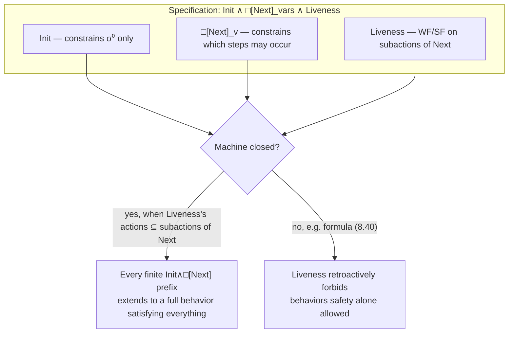

[[book-guidelines|↩ Back to guidelines]]

# Temporal Logic and Liveness

## Why safety alone is a lie of omission

Every specification you've built so far in this book — the hour clock, the channel, the FIFO, the caching memory — has the shape $Init \land \Box[Next]_v$. That formula is a *safety* specification: it says what's allowed to happen, state by state. But a safety specification has a dirty secret: it is always satisfied by a system that does absolutely nothing. $Init \land \Box[Next]_v$ permits a behavior that reaches an initial state and then stutters forever. Nothing in "every step satisfies $Next$ or leaves $v$ unchanged" rules that out — a system that refuses to serve any request never violates a next-state relation.

That's fine for a lot of what you want to prove ("the cache is never incoherent"), but it says nothing about what a system *must* eventually do. Nothing here rules out a channel that receives a value and then simply hangs forever without ever delivering it. To say "every request eventually gets a response" you need a fundamentally different kind of assertion — one that talks about what happens across the *entire infinite future* of a behavior, not just what one step is allowed to do. That's what temporal logic is for, and this chapter is Lamport building the minimum temporal machinery TLA+ needs: two operators ($\Box$, $\Diamond$), one derived idiom (leads-to), a fairness vocabulary (weak/strong fairness) precise enough to be provable, and a discipline (machine closure) that keeps you from writing something that quietly outlaws valid behaviors of $Next$ by accident.

This is the densest chapter in Part I, and Lamport says so directly: "many readers will find that this chapter taxes their mathematical ability." The payoff is that once you have $\Box$, $\Diamond$, $WF$, and $SF$, essentially every liveness property you'll ever want to write reduces to a fixed idiom you plug values into, rather than an ad hoc temporal formula you have to re-derive the meaning of each time.

## 8.1 — What a temporal formula actually is

A *state* is an assignment of values to all variables (you know this already). A *behavior* $\sigma$ is an infinite sequence of states $\sigma^0 \to \sigma^1 \to \sigma^2 \to \cdots$. A **temporal formula** $F$ is a function from behaviors to booleans — written $\sigma \models F$ ("$\sigma$ satisfies $F$"), read as "$F$ is true of $\sigma$." This is the key conceptual jump from the rest of the book: an ordinary state predicate is evaluated against *one* state; a temporal formula is evaluated against a whole infinite behavior.

**[[Elementary-Mathematical-Foundations-for-Specification#Grounding|Grounding]] (Rust).** The cleanest mental model, and one that maps almost literally onto how you'd build an LTL evaluator: a behavior is a (potentially infinite) stream of states, and a temporal formula is a predicate over *suffixes* of that stream.

```rust
/// A behavior: conceptually infinite, so we model it as anything that can
/// hand us the state at any index and any suffix starting at that index.
trait Behavior {
    type State;
    fn state(&self, n: usize) -> Self::State;
    /// sigma^{+n}: the suffix starting at state n.
    fn suffix(&self, n: usize) -> Self where Self: Sized;
}

/// A temporal formula is anything that can be checked against a behavior.
trait TemporalFormula<B: Behavior> {
    fn holds(&self, sigma: &B) -> bool;
}

/// Box (always): true of sigma iff every suffix satisfies the inner formula.
struct Always<F>(F);
impl<B: Behavior, F: TemporalFormula<B>> TemporalFormula<B> for Always<F> {
    fn holds(&self, sigma: &B) -> bool {
        // In reality this is a universal over an infinite Nat -- a real
        // checker (like TLC) only decides this over a *finite* state graph,
        // by looking for cycles. This is the honest, infinite-behavior spec.
        (0..).all(|n| self.0.holds(&sigma.suffix(n)))
    }
}

/// Diamond (eventually): true of sigma iff *some* suffix satisfies F.
struct Eventually<F>(F);
impl<B: Behavior, F: TemporalFormula<B>> TemporalFormula<B> for Eventually<F> {
    fn holds(&self, sigma: &B) -> bool {
        (0..).any(|n| self.0.holds(&sigma.suffix(n)))
    }
}
```

This code obviously can't *run* to completion — `(0..).all(...)` never terminates on an infinite range unless it finds a counterexample early — and that's the point: it's a specification of the semantics, not an algorithm. The actual algorithm (what TLC does) works because it checks *finite* state graphs and reduces $\Box$/$\Diamond$ properties to cycle-detection (Büchi-automaton emptiness), which is a `static-analysis` idea worth flagging now: liveness checking over an infinite behavior becomes a *reachability-and-cycle* question over a finite automaton, exactly the machinery behind model checkers and behind CEGAR-style abstraction refinement loops in program analysis.

Formally, Lamport builds up the definitions exactly the way the Rust sketch does. Let $\sigma^{+n}$ denote the suffix of $\sigma$ obtained by deleting its first $n$ states. Then:

$$\sigma \models \Box F \;\triangleq\; \forall n \in \mathit{Nat} : \sigma^{+n} \models F$$

A state predicate $P$, viewed as a temporal formula, is true of $\sigma$ iff $P$ holds in $\sigma^0$; and $\sigma \models \Box[N]_v$ holds iff every step $\sigma^n \to \sigma^{n+1}$ is an $[N]_v$ step. Boolean connectives and quantifiers on temporal formulas are defined pointwise: $\sigma \models (F \land G) \triangleq (\sigma \models F) \land (\sigma \models G)$, and similarly for $\lnot$, $\forall$, $\exists$ over constants.

**Stuttering invariance, again, but now as a closure property.** A formula $F$ is *invariant under stuttering* iff adding or deleting a stuttering step from a behavior never changes whether the behavior satisfies $F$. TLA+ only lets you *write* formulas with this property — not because the meta-theory can't assign meaning to others (Lamport explicitly defines the meaning of the non-stuttering-invariant formula $\Box(x' = x+1)$ to make a pedagogical point), but because a formula that isn't stuttering-invariant is nonsensical for describing a system whose granularity of observation is a modeling choice, not a physical fact. State predicates are automatically stuttering-invariant (they only look at $\sigma^0$). $\Box[A]_v$ is always stuttering-invariant. $\Box A$ for a bare action $A$ generally is *not* — $\Box(x' = x+1)$ is falsified by inserting a stuttering step, which is exactly why TLA+ forces you to write $\Box[A]_v$, never $\Box A$.

This closure property — $\Box$, $\land$, $\lnot$, and quantification all *preserve* stuttering-invariance — is what lets you build arbitrarily complex temporal formulas out of state predicates and $[N]_v$-shaped actions and stay guaranteed inside the well-formed fragment.

**Grounding (Lean).** If you've spent time in Lean's `Prop`-land, stuttering invariance is best understood as a *quotient*: a behavior modulo the equivalence relation "differs only by inserted/deleted stuttering steps." A stuttering-invariant temporal formula is exactly a predicate that factors through that quotient — it's well-defined on equivalence classes, the same way a definition on `Quotient.mk` must respect the setoid relation to typecheck. TLA's restriction to stuttering-invariant formulas is the semantic analogue of Lean refusing to accept a function out of a quotient type unless you prove it respects the equivalence.

Two derived, non-primitive actions matter for everything that follows:

$$\langle A \rangle_v \;\triangleq\; A \land (v' \neq v)$$

— an "$A$-step-that-actually-changes-$v$." You'll see this angle-bracket notation (pronounced "angle $A$ sub $v$") constantly from here on; it's the dual of the bracket notation $[A]_v = A \lor (v'=v)$ you already know from safety specs. Where $[A]_v$ *permits* stuttering, $\langle A \rangle_v$ *forbids* it — which is exactly what you need to say "an $A$ step really occurred," since asserting "eventually a stuttering step occurs" would itself violate stuttering-invariance.

## 8.2 — Tautologies: truths that don't depend on what you plug in

A **temporal theorem** is a formula true of every behavior for a *specific* choice of the formulas inside it — e.g., $HC \Rightarrow \Box HCini$ is a theorem about the hour clock specifically. A **temporal tautology** is stronger: true under *any* substitution for its identifiers, the temporal analogue of a propositional tautology like $F \lor \lnot F$. $\Box HCini \Rightarrow HCini$ is a tautology (substitute anything for $HCini$, even something absurd like $x>7$, and it stays true) — which also tells you it says *nothing specific* about the hour clock; it's a fact about $\Box$, not about $HCini$.

The core tautologies worth internalizing (proved directly from the $\sigma \models \cdots$ definitions by unfolding, exactly the calculational style used throughout the chapter):

$$\Box F \Rightarrow F \qquad\qquad \lnot \Box F \equiv \Diamond \lnot F \qquad\qquad \Box(F \land G) \equiv \Box F \land \Box G \qquad\qquad \Diamond(F \lor G) \equiv \Diamond F \lor \Diamond G$$

where $\Diamond F \triangleq \lnot \Box \lnot F$ ("eventually," read as "not always not" — $F$ is true at *some* time, including now). $\Box$ distributes over $\land$ (universal quantification distributes over conjunction — this is literally $(\forall n : P(n) \land Q(n)) \equiv (\forall n : P(n)) \land (\forall n: Q(n))$ transported through the definition of $\Box$), and dually $\Diamond$ distributes over $\lor$. Neither distributes the other way: $\Box((n{\ge}0) \lor (n{<}0))$ is a tautology of arithmetic, but $\Box(n{\ge}0) \lor \Box(n{<}0)$ is false for any behavior where $n$ takes both signs over time — you only get the weaker $\Box F \lor \Box G \Rightarrow \Box(F \lor G)$.

**The duality principle.** From any temporal tautology you get a second, "dual" tautology for free by swapping $\Box \leftrightarrow \Diamond$, $\land \leftrightarrow \lor$, and reversing every $\Rightarrow$ (leaving $\equiv$ and $\lnot$ untouched). This isn't a coincidence — it falls straight out of $\Diamond F \triangleq \lnot\Box\lnot F$ and de Morgan's laws, the same way $\forall$/$\exists$ duality falls out of $\exists x : F \equiv \lnot \forall x : \lnot F$. The two idioms Lamport singles out as important enough to name are:

$$\Box\Diamond F \quad\text{("infinitely often $F$")} \qquad\qquad \Diamond\Box F \quad\text{("eventually always $F$")}$$

with $\Box\Diamond(F \lor G) \equiv \Box\Diamond F \lor \Box\Diamond G$ and its dual $\Diamond\Box(F \land G) \equiv \Diamond\Box F \land \Diamond\Box G$ — both provable by introducing the shorthand $\exists^{\infty} i \in S : P(i)$ ("there exist infinitely many $i$ such that $P(i)$") and reducing to the ordinary predicate-logic fact $(\exists^{\infty} i : P(i) \lor Q(i)) \equiv (\exists^{\infty} i : P(i)) \lor (\exists^{\infty} i : Q(i))$.

**Leads-to**, the operator this chapter is arguably building toward, is defined as an abbreviation:

$$F \leadsto G \;\triangleq\; \Box(F \Rightarrow \Diamond G)$$

Read as "$F$ leads to $G$": whenever $F$ becomes true, $G$ is true then or at some point afterward. This is the operator you reach for whenever a liveness property has the shape "if condition $X$ ever holds, response $Y$ eventually follows" — which turns out to be nearly every liveness property you'll ever write. It's not a new primitive; it's sugar over $\Box$, $\Rightarrow$, $\Diamond$, chosen because that shape is so common it deserves its own name and precedence (lower than $\land$/$\lor$, so $F \land G \leadsto H$ parses as $(F\land G)\leadsto H$).

**Grounding (Python — quick sketch, not load-bearing).** For finite traces (the kind a bounded model checker or a test harness actually produces), leads-to and eventually reduce to straightforward scans:

```python
def eventually(trace, pred, n=0):
    return any(pred(trace[m]) for m in range(n, len(trace)))

def leads_to(trace, F, G):
    # F ~> G holds on this finite trace iff at every index n where F holds,
    # G holds at n or later. This is a *finite approximation* -- it says
    # nothing about what happens past the end of the trace.
    return all(not F(trace[n]) or eventually(trace, G, n)
               for n in range(len(trace)))
```

This is exactly the kind of check a bounded-liveness pass in a testing tool performs, and exactly why such checks are unsound in general for the true infinite-behavior semantics — a trace that looks fine up to its horizon can still violate $F \leadsto G$ if $G$ never shows up after the horizon. Genuine liveness checking needs either full temporal-logic model checking (Büchi automaton emptiness over a finite *state graph*, not a finite trace) or a fairness assumption that rules out the bad infinite extensions — which is precisely §8.4's problem.

## 8.3 — Proof rules are not tautologies (and confusing them is a real bug)

This is a genuinely subtle epistemological point and Lamport devotes an entire (short) section to it because getting it wrong causes real errors. In propositional logic, every proof rule corresponds to a tautology: Modus Ponens (from $F$ and $F\Rightarrow G$, infer $G$) corresponds to the tautology $F \land (F\Rightarrow G) \Rightarrow G$. You might expect temporal proof rules to work the same way. They don't.

The **Generalization Rule**: from $F$, infer $\Box F$. This is a legitimate rule of inference — if $F$ is a *theorem* (true of every behavior), then $\Box F$ is too. The proof is immediate: if $\sigma \models F$ for all $\sigma$, then in particular $\sigma^{+n} \models F$ for all $n$ and all $\sigma$, which is exactly $\sigma \models \Box F$.

But — and this is the trap — this does **not** mean $F \Rightarrow \Box F$ is a tautology. That formula is *false* in general: take $F$ to be a state predicate true in $\sigma^0$ but false somewhere later in $\sigma$; then $\sigma \models (F \Rightarrow \Box F)$ is false for that $\sigma$. The rule is a statement about the *meta-level* ("if $F$ holds universally across all behaviors, so does $\Box F$"); the false formula would be a statement at the *object level* about one behavior implying its own perpetuation. Conflating "$F$ is a theorem, therefore $\Box F$ is a theorem" with "$F \Rightarrow \Box F$ is a theorem" is the single most common way people get temporal reasoning wrong.

**This is directly your trusted-kernel distinction, restated.** If you're building an elaborator or a proof checker, this is *exactly* the line between an **admissible/derivable inference rule** of a calculus and a **validity (tautology)** of the underlying semantics. A sequent calculus's structural rules (weakening, cut) are facts about what derivations you're allowed to build, not propositions the object logic itself asserts — the same way the Generalization Rule is a fact about what *you* (the reasoner) may conclude from a theorem, not a formula that behaviors themselves satisfy. A kernel that silently treated "rule $R$ is admissible" as "the formula corresponding to $R$ is derivable" would be unsound in precisely the way Lamport is warning against here — this is worth keeping in your pocket for whenever your own theorem prover distinguishes its meta-rules from its object-level judgments.

The companion rule, **Implies Generalization**: from $F \Rightarrow G$, infer $\Box F \Rightarrow \Box G$ (this is how you get $\Box$ to act as a *monotone* operator across implications, and the Generalization Rule falls out of it as a special case by substituting $\mathrm{true}$ for $F$).

## 8.4 — Weak fairness: the idiom that makes liveness practical

Here's the motivating problem. You want the hour clock to never stop — infinitely many $HCnxt$ steps. The naive formula $\Box\Diamond HCnxt$ isn't even legal TLA+, because $HCnxt$ is an action (has primed variables), not a temporal formula — you can't apply $\Box$ or $\Diamond$ directly to it. You have to route through the $\langle \cdot \rangle_v$ construction: since every genuine $HCnxt$ step changes $hr$, "infinitely many $HCnxt$ steps" becomes $\Box\Diamond\langle HCnxt\rangle_{hr}$.

Generalizing this to any action $A$ gives an obvious first attempt at a fairness condition:

$$\Box(\mathrm{enabled}\langle A\rangle_v \Rightarrow \Diamond \langle A\rangle_v)$$

— "if $A$ ever becomes enabled, an $A$-step eventually occurs." But this is *too strong* to be a realistic engineering requirement: it demands a response even if $A$ is enabled for a picosecond and never again. No real scheduler can promise that. Weakening the hypothesis to "*forever* enabled" gives the actual definition:

$$WF_v(A) \;\triangleq\; \Box(\Box\,\mathrm{enabled}\langle A\rangle_v \Rightarrow \Diamond\langle A\rangle_v) \tag{8.7}$$

**Weak fairness of $A$: if $A$ ever becomes continuously enabled forever, an $A$-step must eventually occur.** Two other formulations turn out equivalent (proved by straightforward tautology-chasing through $\lnot\Box F \equiv \Diamond\lnot F$ and the $\Box\Diamond$/$\Diamond\Box$ distributivity laws from §8.2):

$$\Box\Diamond(\lnot\,\mathrm{enabled}\langle A\rangle_v) \lor \Box\Diamond\langle A\rangle_v \tag{8.8}$$
$$\Diamond\Box(\mathrm{enabled}\langle A\rangle_v) \Rightarrow \Box\Diamond\langle A\rangle_v \tag{8.9}$$

Read informally: (8.8) "$A$ is infinitely often disabled, or infinitely many $A$-steps occur"; (8.9) "if $A$ is eventually enabled forever, then infinitely many $A$-steps occur." All three are the same fact stated three ways — worth sitting with, because engineers reach for whichever phrasing matches their intuition in the moment, and being able to translate between them fluently is what makes the rest of the chapter tractable.

**What breaks without this.** Consider the channel from Chapter 3/4: you want every sent value eventually received. The naive $\Box\Diamond \langle Rcv \rangle_{chan}$ over-specifies — it would force infinitely many values to be *sent* too (you can't receive infinitely often if nothing is sent), which isn't what you want (a behavior where nothing is ever sent, so nothing is ever received, should be fine). The fix is to condition on enabledness: $\Box(\mathrm{enabled}\langle Rcv\rangle_{chan} \Rightarrow \Diamond\langle Rcv\rangle_{chan})$ — and then Lamport proves (via a genuinely nontrivial temporal derivation, (8.11)–(8.15) in the text) that this is *equivalent*, given the channel's safety spec, to the much simpler $WF_{chan}(Rcv)$. The safety spec guarantees that once $Rcv$ becomes enabled it can only be disabled by a $Rcv$ step itself — so "continuously enabled forever" and "enabled at all" coincide here, and the weak-fairness idiom captures exactly the liveness property you wanted without you having to reconstruct that derivation by hand every time. This is the whole point of having $WF$ as a named, pre-proved idiom: you get to *reuse* a hard piece of temporal reasoning instead of redoing it per specification.

**Conjunction and Quantifier Rules.** A recurring simplification: is $WF_v(A) \land WF_v(B)$ the same as $WF_v(A \lor B)$? Not in general — but it *is*, provided $A$ and $B$ satisfy a mutual-non-preemption condition:

> **DR($i,j$).** Whenever $\langle A_i\rangle_v$ is enabled, $\langle A_j\rangle_v$ cannot become enabled unless an $\langle A_i\rangle_v$ step occurs first.

Formally $DR(i,j) \triangleq \Box(\mathrm{enabled}\langle A_i\rangle_v \Rightarrow \Box\lnot\,\mathrm{enabled}\langle A_j\rangle_v \lor \Diamond\langle A_i\rangle_v)$. When this holds pairwise for all distinct $i,j$ in a family of actions:

$$\textbf{WF Conjunction/Quantifier Rule:}\quad WF_v(A_1) \land \cdots \land WF_v(A_n) \;\equiv\; WF_v(A_1 \lor \cdots \lor A_n)$$

The memory example makes this concrete: a processor's request enables $Do(p)$, whose completion enables $Rsp(p)$, whose completion re-enables the *next* $Do(p)$ — each stage's enabledness is gated by the previous stage's completion, which is exactly the non-preemption condition. So $\forall p : WF_{vars}(Do(p)) \land WF_{vars}(Rsp(p))$ collapses to $\forall p : WF_{vars}(Do(p) \lor Rsp(p))$ — one fairness condition instead of two, with no loss of meaning.

## 8.6 — Strong fairness: for when "eventually stops interrupting" isn't guaranteed

Weak fairness requires *continuous* (uninterrupted) enabledness before demanding a step. Sometimes that's not available — an action can be repeatedly, but not continuously, enabled, and you still want to require it eventually fires. That's **strong fairness**:

$$SF_v(A) \;\triangleq\; \Box\Diamond\,\mathrm{enabled}\langle A\rangle_v \Rightarrow \Box\Diamond\langle A\rangle_v \tag{8.33}$$

equivalently $\Diamond\Box(\lnot\,\mathrm{enabled}\langle A\rangle_v) \lor \Box\Diamond\langle A\rangle_v$ (8.32) — "$A$ eventually becomes disabled forever, or infinitely many $A$-steps occur." The precise wording Lamport gives is worth memorizing verbatim because the two words are easy to conflate:

- **Weak fairness**: an $A$-step must occur if $A$ is **continuously** enabled (without interruption).
- **Strong fairness**: an $A$-step must occur if $A$ is **continually** enabled (repeatedly, possibly with interruptions).

Since $\Diamond\Box F$ implies $\Box\Diamond F$ for any $F$ (eventually-always is stronger than infinitely-often), $SF_v(A)$ is at least as strong as $WF_v(A)$ — strong fairness is a strictly harder engineering commitment to implement, and Lamport recommends reaching for it only when weak fairness genuinely isn't enough. The two coincide exactly when an enabled $A$ can only be disabled by an $A$-step itself (the channel's $Rcv$ case above) — in general, they diverge precisely when some *other* action can repeatedly toggle $A$'s enabledness without $A$ ever firing, which is the write-through cache's actual failure mode: $RdMiss(p)$ and $DoWr(p)$ append to a shared queue `memQ`, so another processor's request can repeatedly fill the queue and disable yours right when you were about to go — weak fairness on those two actions would let that starvation persist forever; only strong fairness rules it out. (Rsp(p), $DoRd(p)$, and the queue-service actions, by contrast, only get *disabled* by their own occurrence, so weak fairness suffices for them.) The analogous SF Conjunction/Quantifier Rules hold, letting the cache's six fairness conjuncts collapse the same way the memory's two did.

**Grounding (Lean/Rust — the mechanism, not just the definition).** If you ever implement a liveness checker, $WF$ vs. $SF$ is the difference between two shapes of Büchi-automaton acceptance conditions layered on top of a state graph: $WF_v(A)$'s complement (a *violation*) is "eventually $\langle A\rangle_v$ is enabled forever and never taken" — a single eventually-always condition, checkable by finding a reachable cycle in which `enabled(A)` holds at every node and no `A`-step edge is ever taken. $SF_v(A)$'s complement is "$A$ is enabled infinitely often along the cycle but taken only finitely often" — a *fairness-constrained* Büchi condition (a Streett/Rabin-style pair), strictly more expensive to check because you need "infinitely often enabled" (a cycle visits an enabled state) combined with "finitely often taken" (an accepting-set-avoidance condition), rather than a single "stays enabled forever" predicate. This is exactly why TLC's liveness checking (Chapter 14) is more expensive and more limited for strong fairness than for weak fairness — the algorithmic cost tracks the logical complexity you just derived by hand.

## 8.8 — Quantification and hiding: what $\exists$ is doing to a temporal formula

Two very different things are both called "quantification" here and it's essential to keep them apart.

**Rigid (bound) quantification**, $\forall r : F$ / $\exists r \in S : F$, quantifies over *constants* — values that don't change across the behavior, defined pointwise: $\sigma \models (\exists r : F) \triangleq \exists r : (\sigma \models F)$. This is the ordinary predicate-logic quantifier, just lifted to the temporal setting; nothing new happens here.

**The temporal existential quantifier $\exists x : F$** is different in kind: $x$ is declared a *flexible variable* inside $F$, meaning it's allowed a (potentially different) value in *every* state of the behavior. $\exists x : F$ asserts there's *some* assignment of values to $x$ across the states of the behavior making $F$ true — not one fixed value, but a whole trajectory for $x$. This is the mechanism the book has been calling "hiding" since Chapter 4: $\exists q : Spec$ says "$Spec$ holds for *some* way of filling in the internal variable $q$," which is precisely what it means to say $q$ is an implementation detail that shouldn't be visible to a client of the specification.

The temporal $\forall$ is defined dually and rarely used: $\forall x : F \triangleq \lnot \exists x : \lnot F$. TLA+ disallows bounded forms of temporal $\exists$/$\forall$ (no $\exists x \in S : F$) — there's no sensible way to constrain a *trajectory* to lie in a constant set the way you constrain a single value.

Why is this called "hiding," concretely? Because $\exists x : F$ makes the *specific values* $x$ takes on unobservable — any two behaviors that agree on the free (visible) variables and merely relabel or reassign $x$ satisfy $\exists x: F$ identically. This is what licenses implementation-as-implication (§5.8) to actually work: a lower-level spec $LSpec$ can imply a higher-level $\exists h : HSpec$ using a completely different internal variable than $h$, because $\exists h$ erases $h$'s specific identity from what's being asserted.

## 8.9 — Machine closure: the discipline that keeps liveness honest

Put the pieces together and every specification in this book has (or should have) the shape:

$$Init \land \Box[Next]_{vars} \land Liveness \tag{8.39}$$

where $Liveness$ is a conjunction of $WF_v(A)$/$SF_v(A)$ terms. The natural expectation is a clean separation of concerns: $Init$ constrains the start, $Next$ constrains what steps are *allowed*, and $Liveness$ only constrains what must *eventually* happen — it shouldn't retroactively forbid behaviors that $Init \land \Box[Next]_v$ alone would have allowed.

Here's the cautionary example that shows this separation can silently fail:

$$(x=0) \land \Box[x' = x+1]_x \land WF_x\big((x>99) \land (x'=x-1)\big) \tag{8.40}$$

The safety part says $x$ starts at 0 and only ever increments. So if $x$ ever exceeds 99, it stays above 99 forever. But the fairness conjunct demands that once $(x>99)\land(x'=x-1)$ becomes forever enabled, a step of that action eventually occurs — which would *decrement* $x$, contradicting the safety part's monotonicity. The only way to satisfy both is for $x$ to never exceed 99 in the first place — meaning (8.40) is secretly equivalent to $(x=0) \land \Box[(x<99) \land (x'=x+1)]_x$. **The liveness conjunct silently amputated behaviors that the safety conjunct alone would have permitted.** That's the bug machine closure exists to catch.

**Definition.** A finite behavior $\sigma$ *satisfies a safety property* $S$ iff appending infinitely many stuttering steps to $\sigma$ satisfies $S$. The pair $\langle S, L\rangle$ is **machine closed** iff every finite behavior satisfying $S$ can be *extended* to an infinite behavior satisfying $S \land L$. Intuitively: the liveness conjunct never boxes you into a corner that the safety spec alone wouldn't have already boxed you into.

**The guarantee that makes this tractable in practice**: $Init \land \Box[Next]_v \land Liveness$ is guaranteed machine closed whenever $Liveness$ is a conjunction of weak/strong fairness properties **on subactions of $Next$** — where $A$ is a *subaction* of $Next$ iff every $A$-step is a $Next$-step (equivalently, $A \Rightarrow Next$). Formula (8.40) violates exactly this: $(x>99)\land(x'=x-1)$ is *not* a subaction of $x'=x+1$ (it decrements where $Next$ only increments) — that mismatch is the mechanical fingerprint of the bug.

This is why every worked liveness example in this chapter — the clock, the channel, the memory, the cache — picks its fairness actions *from the disjuncts that already make up $Next$*. It's not a stylistic habit; it's the load-bearing condition that guarantees you haven't accidentally strengthened your safety property through the back door. Lamport explicitly flags the tempting alternative — writing liveness directly and intuitively, e.g. $\forall p \in Proc : \Box((ctl[p]="rdy") \Rightarrow \Diamond\langle Rsp(p)\rangle_{vars})$ for the cache — as "appealing" but "dangerous," precisely because nothing about that formula's *shape* guarantees machine closure the way the fairness-on-subactions idiom does automatically.



**Machine closure as a possibility condition.** There's a reading of machine closure that connects directly to reachability analysis: machine closure of $\langle S, \Box\Diamond\langle A\rangle_v\rangle$ says that in *any* reachable partial execution, it always remains *possible* to eventually take infinitely many $A$-steps — the door to $A$ firing again is never permanently and irrevocably slammed shut by the safety spec's own structure. TLA specifications don't have a primitive "possibility" operator (Lamport is explicit: "we are never interested in specifying that something *might* happen" — you specify what must happen, or what can't), but machine closure lets you *derive* a possibility guarantee as a side effect of a well-formed liveness/safety pair, which is often exactly the sanity check you want when auditing whether a spec has quietly overconstrained itself.

**Refinement mappings and fairness don't commute for free.** One sharp edge worth flagging for anyone planning to mechanize refinement proofs: substitution (the overbar $\overline{F}$ notation for a refinement mapping) distributes over $\land$, $\Box$, and $\langle\cdot\rangle_v$, but **not** over $\mathrm{enabled}$, and therefore not over $WF$ or $SF$ in general. If you're checking $Spec \Rightarrow \overline{ISpec}$ where $ISpec$ carries fairness conjuncts, you can't just push the refinement mapping through the $WF$/$SF$ symbolically — you have to expand $WF_v(A)$ to its $\Box\Diamond$/$\Diamond\Box$ definition first, compute $\mathrm{enabled}\,\overline{\langle A \rangle_v}$ "by hand" using rules like $\mathrm{enabled}(A\lor B) \equiv \mathrm{enabled}\,A \lor \mathrm{enabled}\,B$ and $\mathrm{enabled}(x'=\mathit{exp}) \equiv \mathrm{true}$, and only then compare. In practice it usually works out to "just substitute inside the $WF$/$SF$ as if it did distribute," but that's an empirical observation about the specifications people write, not a theorem — a mechanized refinement checker cannot take the shortcut for granted.

## Where this leads

Within the book: Chapter 9 (Real Time) generalizes $WF$ to quantitative timing bounds ($RTBound$), and reuses machine closure verbatim as "non-Zeno-ness" — a Zeno specification is exactly a failure of machine closure with respect to the `now` variable. Chapter 10 ([[Composing-Specifications|Composing Specifications]]) shows that machine closure is *not* automatically preserved when you compose specifications with joint actions, reusing this chapter's Zeno-clock cautionary pattern. Chapter 11's sequentially-consistent-memory example deliberately writes a *non*-machine-closed specification as an illustration that the discipline is a strong default, not an absolute law.

For the broader project: this chapter is a compact case study in exactly the `automated-reasoning` distinction between **derivability** and **validity** that a trusted kernel has to keep straight — the Generalization Rule (§8.3) is a meta-level inference rule, not an object-level tautology, the same separation your own proof checker needs between "this tactic is admissible" and "this formula is a theorem of the object logic." The $WF$/$SF$-as-fairness-idiom pattern is also a direct preview of `static-analysis` machinery you'll meet again in model checking and abstraction-refinement: liveness-under-fairness reduces to Büchi-automaton acceptance over a *finite* reachability graph, the same reduction that underlies whether a CEGAR loop's abstract counterexample is spurious. And machine closure itself is worth keeping as a template for a soundness sanity check in your own compiler: whenever you add a "must eventually" obligation to a static analysis or a synthesis procedure (a progress condition, a termination-guarantee inference), ask the machine-closure question — does this added obligation ever retroactively forbid a program behavior that the underlying operational semantics alone would have allowed? That's precisely the bug Lamport catches with formula (8.40), transplanted into a compiler-correctness setting.
