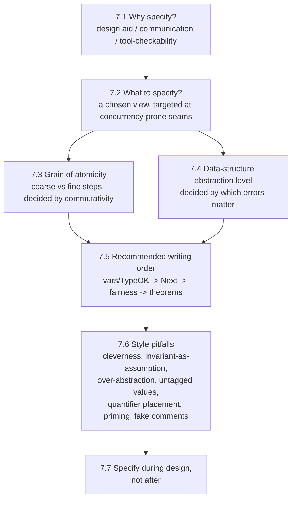

# Writing Specifications: Engineering Practice

[[book-guidelines|↩ Back to guidelines]]

## Why this chapter exists at all

Every other chapter up to this point hands you a piece of machinery: predicate logic, the syntax, the state/action/behavior ontology. Chapter 7 hands you nothing new formally — no operator, no theorem, not even a definition worth memorizing (with one small exception, the composition operator $\cdot$, which you've already met). Lamport opens by saying exactly this: "You have now learned all you need to know about TLA+ to write your own specifications." What follows is judgment, not machinery — the kind of thing that separates a syntactically valid specification from a *useful* one.

This matters for the same reason a style guide matters after you've learned a programming language's grammar: knowing that `for` loops and `match` expressions exist doesn't tell you when to reach for one, how coarse to make a function's contract, or when a "clean abstraction" is actually hiding the bug you're trying to catch. A type checker will happily accept a specification with the wrong grain of atomicity, the wrong abstraction level, or a needlessly clever formula — none of these are *type errors*, they're *judgment errors*, and the whole chapter is about developing the judgment.

## 7.1–7.2: Why specify, and what to specify

**Why.** Lamport is unusually candid that specification isn't a moral obligation — it's a tool with a cost, and the cost must be justified by a benefit. He gives three:

1. It helps the *design* process — writing something down precisely surfaces corner cases before they're built.
2. It communicates a design *unambiguously* to other engineers.
3. It's *machine-checkable* — a TLA+ specification can be handed to TLC (the model checker) to search for errors automatically.

**What breaks without this framing:** without a stated purpose, "let's formally specify it" becomes an aesthetic exercise, and every downstream decision in this chapter (how coarse-grained, how abstract, how much to spell out) becomes unanswerable — there's no yardstick to measure a choice against. Every subsequent section in the chapter is really just "how do you serve one of these three goals well."

**What.** The next-sharpest point: "we talk about specifying a system, but that's not what we do." A specification is a model of *a chosen view of part of* a system — never the whole thing, never every property of the part you did choose. Lamport's illustration is a cache-coherence protocol that's "intimately connected with how the processors execute instructions" — finding a clean interface boundary between the two, one that may not even correspond to a boundary in the real hardware, is itself specification work, done before a single TLA+ symbol is written.

He then gives a concrete targeting heuristic: TLA+'s comparative advantage is catching *concurrency* errors — bugs from the interaction of asynchronous components. So spend your specification effort where such errors are likely, and "if that's not where you should be concentrating your efforts, then you probably shouldn't be using TLA+." This is advice about tool selection disguised as advice about scoping.

**Code-analogy [[Elementary-Mathematical-Foundations-for-Specification#Grounding|grounding]].** This is exactly the discipline behind choosing a *trust boundary* or an *interface* in a Rust codebase. You don't write a formal contract for every function — you write one at the seams where independent components (a client and a server, two threads sharing a lock, a compiler pass and its caller) can disagree about what's guaranteed. In the compiler/verifier project this vault is oriented around, this is the same judgment call as choosing which functions get full refinement-type contracts (`requires`/`ensures`) versus which are left as ordinary, unverified helper code: verification effort, like specification effort, should go where interaction complexity — not raw code volume — creates the errors you actually care about catching.

## 7.3: Choosing the grain of atomicity — the engineering decision, not the mechanics

The formal machinery here — the action-composition operator $A \cdot B$, the commutativity condition $A \cdot B \equiv B \cdot A$, and the argument for when a coarse-grained specification's behaviors correspond to a fine-grained one's — is covered in depth in [[States-Actions-and-Behaviors]]. This section instead asks: as an engineer, *how do you actually decide*, and what are you trading off?

Lamport's framing is refreshingly free of a formula: "there is no simple rule for deciding on the grain of atomicity." What he offers instead is a way to *think* about the decision, structured as a genuine trade-off with a name on each side:

- **Coarser-grained** representations (e.g. "send a message" as one atomic step, even though it's really several suboperations in the real system) are *almost always simpler* to write and reason about — shorter behaviors, fewer named actions, fewer interleavings to consider.
- **Finer-grained** representations (e.g. "send" and "receive" as two separate steps) *more accurately describe the real system* — and can reveal interleavings and interactions a coarser model would silently erase.

The engineering question is: does the coarser model erase behaviors that matter, or only behaviors that don't? Lamport's own worked criterion: a coarse-grained specification $S_1$ (treating $R \cdot L$ as one step) is a *safe* substitute for a fine-grained one $S_2$ (treating $R$ and $L$ as separate, interleavable steps) exactly when $R$ or $L$ *commutes* with every action that could otherwise interleave between them — because then any interleaved execution can be reshuffled into an equivalent one where $R$ and $L$ happen back-to-back, without changing anything the specification actually asserts. When that commutativity fails — when some other action's ordering *relative to* $R$ and $L$ is itself observable and consequential — collapsing them into one step throws away a real system behavior, and a bug that only manifests in the interleaved order becomes invisible to your specification (and to TLC checking it).

So the *decision procedure*, stripped of formalism, is: identify what could happen concurrently with the operation you're modeling; ask whether that concurrent activity can affect, or be affected by, the operation's two halves independently; if yes, keep them as separate steps; if genuinely no, collapse them and simplify your life. This is a judgment call about the *system*, not a fact deducible from TLA+ syntax — the same specification decision could go either way for the same operation in two different systems, or even in the same system specified for two different purposes.

**Code-analogy grounding.** This is the granularity decision every concurrency-verification tool designer faces when choosing a memory model or an interleaving semantics: do you model each machine instruction as its own atomic step (maximal fidelity, but state-space explosion — the "fine-grained" choice), or coarsen sequences of instructions with no externally-observable side effects into one atomic block (the "coarse-grained" choice, valid exactly when nothing else in the system can observe the intermediate states — an independence argument identical in spirit to Lamport's commutativity condition)? This is precisely the reasoning behind partial-order reduction in stateless model checkers, and it is the same reasoning a Rust developer uses informally when deciding whether a `Mutex`-guarded critical section can be widened or must stay narrow: widen it only if nothing outside the lock can distinguish the wider critical section's intermediate states from the narrower one's.

## 7.4: Choosing a data-structure abstraction level

The same coarse/fine trade-off resurfaces for *data*, not just *steps*. Should a specification of a procedure interface describe the literal memory layout of its arguments, or represent them abstractly? Lamport's answer is the same yardstick as before: **the purpose of the specification decides**. A precise data-structure model catches errors caused by misunderstanding *that* structure — but it adds specification complexity that is wasted effort if the specification's actual job is catching concurrency errors, which usually don't care about data layout at all.

His illustration: to specify a procedure-call interface aimed at catching asynchronous-interaction bugs, you don't model argument layout — you introduce abstract constant parameters standing for "call" and "return" actions (the same move as the `Send`/`Reply` interface from the memory specification earlier in the book). The data structure is represented at exactly the resolution the specification's *purpose* requires, and no finer.

**Code-analogy grounding.** This is the same decision as choosing how much of a value's internal representation to expose through a Rust `trait` versus hiding it behind an opaque associated type. If client code (or, here, a verifier) only ever needs to reason about a queue's FIFO ordering behavior, model it as an abstract sequence with `push`/`pop` semantics — not as a ring buffer with an index and capacity field, even though that's the real implementation. Exposing the concrete representation only pays off if you're specifically trying to catch bugs *about* that representation (index overflow, off-by-one wraparound) — otherwise it's surface area a reader (or a solver, if this is feeding constraint generation) has to wade through for no verification benefit. In refinement-type terms: the abstraction level of a data structure's *specification* (its refinement predicate) should match the class of invariant you're actually trying to prove, not the class of invariant that happens to be easiest to state formally.

## 7.5: The recommended order of writing steps

Lamport gives an explicit, ordered recipe — useful less as a rulebook than as a checklist for "what have I forgotten":

1. **Pick the variables**, and write the type invariant and the initial predicate. This is also where you discover which constant parameters and assumptions you actually need.
2. **Write the next-state action** as a disjunction of named sub-actions, each describing one kind of system operation — this is "the bulk of the specification." Sketching sample behaviors by hand first helps find the right decomposition. Shared state predicates/functions used across several actions should be factored out to keep each action definition compact.
3. **Add the temporal part** — fairness conditions (Chapter 8) if liveness matters — combining `Init`, `Next`, and fairness into one formula.
4. **Assert theorems** — at minimum, a type-correctness theorem, stated as a claim *about* the specification rather than baked into it (see the next section for why that distinction matters).

**Code-analogy grounding.** This ordering mirrors a disciplined way to write a state machine or an interpreter in Rust: define the `enum State` (or struct of fields) and its invariant first, then define the `enum Event`/transition function as a `match` over named variants (the disjunction of actions), *then* layer on liveness-style properties (e.g. "the event loop always eventually processes a queued event" — not enforceable by the type system, but checkable by a model checker or a runtime assertion), and only at the end write down the properties you intend to test or prove about the whole thing. Writing the properties first, before the state machine exists, tends to produce properties that don't actually correspond to the shape the implementation will take.

## 7.6: Style pitfalls — do this, not that

This is the most concretely actionable section of the chapter: six specific traps, each with a wrong way and a right way straight from the book.

**Don't be too clever.** The book's own counterexample: writing $q = \langle h' \rangle \circ q'$ as a "short" way of saying $(h' = \mathrm{Head}(q)) \wedge (q' = \mathrm{Tail}(q))$. It looks equivalent — but it *isn't*, because $\circ$ (sequence concatenation) is undefined when its arguments aren't sequences, so the clever formula is satisfied by extra, unintended values of $h'$ and $q'$ that aren't sequences at all. The general rule: specify a variable's new value with $v' = exp$ or $v' \in exp$, where $exp$ contains no primes — resist the urge to encode the same constraint indirectly through an equation that "happens" to imply it under the intended reading, because TLA+ won't enforce your intended reading, only the literal one.

**Code-analogy grounding.** This is the specification-language analog of writing `unsafe` Rust that "happens to work" because of an implementation detail of the current allocator, instead of writing code whose correctness follows from the type system's actual guarantees. A refinement-type predicate that's *cleverly* equivalent to the property you want, under some unstated side condition, is a predicate that will silently admit garbage the moment that side condition is violated — exactly like $q = \langle h' \rangle \circ q'$ admitting non-sequence values.

**A type invariant is not an assumption.** This is a genuinely subtle and easy-to-misuse point, and Lamport is blunt about it: defining a type invariant `TypeOK` that asserts $n \in \mathrm{Nat}$ does **not** mean a later conjunct $n' > 7$ inside some action gets to assume $n'$ is a natural number. The formula $n' > 7$ means exactly and only $n' > 7$ — it's satisfied by $n' = \sqrt{96}$, and (since $\text{"abc"} > 7$'s truth value is simply unspecified rather than false) it might even be satisfied by $n' = \text{"abc"}$. A definition is not an axiom; TLA+'s untyped semantics (recall from the [[Elementary-Mathematical-Foundations-for-Specification]] article) never retroactively narrows a formula's meaning because you separately asserted a type invariant holds. If you want $n'$ actually constrained to be a natural number, you must say so explicitly — e.g. by conjoining $n' \in \mathrm{Nat}$ into `Next` itself, as in

$$
\mathit{Next} \;\triangleq\; (n' \in \mathrm{Nat}) \wedge (\mathit{Action}_1 \vee \mathit{Action}_2)
$$

**Why this belongs in the automated-reasoning / trusted-kernel thread:** this is precisely the distinction between a *derived lemma* and a *hypothesis available to the prover*. In a bidirectionally-typed elaborator, proving that a term has type `Nat` as a *theorem* about the term (something the kernel checks after the fact) is completely different from *assuming* `Nat`-ness as a fact usable mid-derivation without re-deriving it — conflating the two is exactly the kind of unsoundness a trusted kernel exists to rule out. If your compiler's Hoare-style verification condition generator ever treats "the type invariant holds" as a free hypothesis inside a branch instead of something to actually discharge, you've reintroduced Lamport's exact bug in a different notation.

**Don't be too abstract.** This is the chapter's centerpiece example, and it's worth walking through in full because it's a genuinely persuasive cautionary tale.

Consider modeling a user typing on a keyboard. The *abstract* approach: a variable `typ` and an operator `KeyStroke("a", typ, typ')` representing "the user typed an a" as one atomic step (this is the approach used for `MemoryInterface` earlier in the book). The *concrete* approach: a variable `kbd` recording which keys are currently depressed (`kbd = {}` means nothing pressed), with two separate actions

$$
\mathit{Press}(k) \;\triangleq\; kbd' = kbd \cup \{k\} \qquad\qquad \mathit{Release}(k) \;\triangleq\; kbd' = kbd \setminus \{k\}
$$

The abstract model is strictly simpler — one step per keystroke instead of two. But the concrete model *naturally raises a question the abstract model cannot even ask*: what if the user presses `a` and, before releasing it, presses `b`? In the concrete model this is just the state $kbd = \{\text{"a"}, \text{"b"}\}$ — nothing special. In the abstract model, this behavior *cannot be expressed at all* without decomposing `KeyStroke` into separate `PressKey`/`ReleaseKey` parameters and then bolting on an explicit well-formedness constraint (a key can't be released before it's pressed) — at which point the "simpler" abstraction has become *more* complicated than the concrete model it was meant to simplify.

Lamport's conclusion is the sharpest sentence in the chapter: choosing to ignore two-keys-depressed might be the right call — but "that should be a *conscious* decision," not an accident of having reached for the tidier-looking abstraction first. "When in doubt, it's safer to use a concrete representation... you are less likely to overlook real problems."

**Why this is the chapter's most load-bearing lesson for a verifier-builder.** This is exactly the failure mode of an over-eager abstract-interpretation domain: an abstraction chosen for its *elegance* (a small lattice, a compact join operation) can silently make certain real program behaviors *inexpressible* rather than merely *harder to prove* — and the difference matters enormously, because the first kind of abstraction can never produce a false "no bug" verdict for a class of bug it structurally cannot represent, while it's actually worse than that: it produces a specification/analysis that is *unsound with respect to the real system* without ever raising an error, because nothing in the formalism flags the missing case. If you're designing the abstract domains for the CSP/abstract-interpretation kernel this vault is building toward — say, an interval or automaton-shaped domain for a data structure — Lamport's `KeyStroke` example is the concrete argument for why every abstraction choice needs an explicit sign-off, and why "we don't model interleaved partial mutations of this structure" should be a documented decision, not a silent consequence of picking the abstract domain that was easiest to implement.

**Don't assume differently-shaped values are automatically unequal.** TLA+'s untyped semantics genuinely leaves $1 \neq \text{"a"}$ unspecified rather than true. If a system can send either a string or a number, don't rely on "obviously" different-looking values being distinguishable — tag them explicitly with a record field:

$$
[\mathit{type} \mapsto \text{"String"}, \mathit{value} \mapsto \text{"a"}] \quad\text{vs.}\quad [\mathit{type} \mapsto \text{"Nat"}, \mathit{value} \mapsto 1]
$$

Now the two are provably different, because their `type` fields differ — a fact that *is* derivable from the semantics, unlike the earlier case. This is the same discipline as a Rust `enum` with explicit variants (`Value::Str(String)` vs. `Value::Nat(i64)`) instead of trying to distinguish an untagged union by structural inspection — tagging makes distinctness a *definitional* fact rather than an accident of representation you're hoping holds.

**Move quantifiers to the outside.** Prefer

$$
\mathit{Up}(e) \triangleq \ldots \qquad \mathit{Down}(e) \triangleq \ldots \qquad \mathit{Move} \triangleq \exists\, e \in \mathit{Elevator} : \mathit{Up}(e) \vee \mathit{Down}(e)
$$

over separately existentially-quantifying inside `Up` and `Down` and then disjoining them. This is a pure readability rule, but it has a code analog worth naming: it's the same instinct behind hoisting a loop-invariant condition out of a branch inside the loop body, in either direction — pull the shared quantifier/loop structure to the outside, keep the per-case logic minimal and parallel in shape.

**Prime only what you mean to prime.** A genuinely sharp gotcha: $f[e]' $ equals $f'[e']$ — *not* $f'[e]$, unless $e' = e$ happens to hold (which it need not, if $e$ itself contains variables). Worse, if `op(a)` is defined as $x + a$ for some variable $x$, then $\mathrm{op}(y)'$ equals $(x+y)' = x' + y'$, while $\mathrm{op}(y')$ equals $x + y'$ — two different expressions, easily confused, and there is *no* way to write $x' + y$ using `op` and priming at all (priming an operator itself, `op'(y)`, is simply illegal — you can only prime an expression). This is a warning about macro/substitution hygiene: priming is a *syntactic* transformation applied after expansion, so where you place the prime relative to a definition's expansion boundary changes the meaning, exactly the way careless macro hygiene in a Rust `macro_rules!` or a Lean `notation` definition can silently capture or fail to capture a variable depending on expansion order.

**Write comments as comments.** The book's example of what *not* to do:

$$
A \;\triangleq\; (\wedge\, x \geq 0 \wedge \ldots) \;\vee\; (\wedge\, x < 0 \wedge \mathrm{false})
$$

— where the second disjunct is meant to document "and $A$ is not enabled when $x<0$," but is logically inert (anything $\wedge\, \mathrm{false}$ is just $\mathrm{false}$, and $F \vee \mathrm{false} \equiv F$), so it's really a comment smuggled into the logic as a vacuous disjunct. Just write the comment as a comment. The underlying principle — don't let something that has no logical effect *pretend* to be part of the logic — generalizes: a specification (or a proof term, or a piece of code) should not contain dead branches whose only purpose is documentation, because a reader (or an automated tool) has no way to distinguish "dead but harmless" from "dead due to a bug," and every one of those branches is something a checker still has to process for no semantic benefit.

## 7.7: Writing specifications during design, not after

Lamport closes the chapter arguing against the natural instinct to defer specification until a design is "finished" and has become complex enough to need help. His counter: writing a specification is itself a *design activity*, and postponing it means postponing the benefit (surfacing corner cases) until it's more expensive to act on.

His prescription: write the specification incrementally, *while* the design is still being decided, deliberately incomplete and even provisionally wrong at first. His worked sketch — an early-stage `RdMiss` action for the write-through cache from Chapter 5 — literally contains a comment marking a missing enabling condition ("Some enabling condition must be conjoined here") and a `ctl` field set to a placeholder `"?"` value ("to be determined later"). Missing functionality gets filled in later by adding new disjuncts to `Next`; the specification grows *with* the design instead of trailing behind it, and TLC can already be run against the partial specification to catch design errors before the design is even complete.

**Code-analogy grounding.** This is exactly the discipline of writing type signatures and `todo!()`-stubbed function bodies (or, in a proof assistant, `sorry`-marked holes) *before* the implementation is filled in, rather than writing the implementation first and reverse-engineering a signature afterward. The signature/specification-first discipline forces you to commit to an interface early, when changing your mind is cheap, and it gives you something a tool (a type checker, TLC, a proof assistant's elaborator) can already check partially — a hole is not an error, it's a deferred obligation the tool tracks for you.

## Synthesis: how this chapter fits the larger project

This chapter is Lamport stepping back from TLA+-the-formalism to TLA+-the-*practice*, and it's the one chapter in Part I whose lessons transfer almost unchanged to any formal-methods tool, not just TLA+. Two threads are worth naming explicitly for the standing project in this vault:

- The **grain-of-atomicity** and **data-structure abstraction** sections (7.3–7.4) are the specification-side version of the abstraction-design problem your `static-analysis` / `sat-smt-csp` kernel will face repeatedly: every abstract domain, every choice of what a CSP variable ranges over, every decision about whether to model a data structure as an automaton/DFA-shaped domain or a flat lattice, is exactly this trade-off — precision versus tractability, decided by *which errors you're trying to prove absent or present*, never decided in the abstract.
- The **"don't be too abstract"** `KeyStroke`/`Press`/`Release` example is the single clearest cautionary tale in the book for why an abstraction must be a *conscious, documented* choice rather than a default reached for because it's easiest to formalize — directly relevant to the soundness argument your abstract interpreter will eventually need to make about its own over-approximations (`static-analysis`), and to the completeness argument your CSP counterexample search will need to make about the concrete-value space it's actually allowed to explore (`sat-smt-csp`).

**[[Advanced-Specification-Examples#Where this leads|Where this leads]]:** Chapter 8 (Liveness and Fairness) is where the "assert theorems" step of 7.5 gets its full temporal-logic vocabulary — the fairness conditions Lamport gestures at here ($WF$, $SF$) are developed rigorously there. The style hints of 7.6, especially "a type invariant is not an assumption," resurface implicitly every time a later chapter states an invariant as a *theorem to be proved*, never as a hypothesis to be assumed mid-specification.
