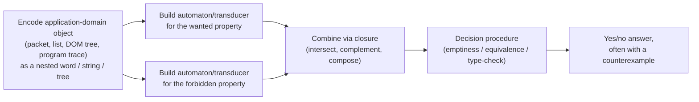

[[book-guidelines|↩ Back to guidelines]]

# Program Analysis [[Symbolic-Visibly-Pushdown-Automata-for-Hierarchical-Data#Applications|Applications]] of Transducer-Based Languages

## Why this article is cross-chapter

Every other article in this vault covers one chapter's *model*. This one covers a different axis entirely: the thesis's recurring applications that aren't tied to a single formalism — deep packet inspection, functional-program verification, CSS/augmented-reality analysis, and the SVPAlib implementation library — each of which shows up as an "and by the way, here's a real system this also helps with" section attached to a foundational chapter. Reading them together (rather than folded silently into [[String-Coder-Verification-with-BEX]], [[Symbolic-Tree-Transducers-and-the-FAST-Language]], and [[Symbolic-Visibly-Pushdown-Automata-for-Hierarchical-Data]]) surfaces a pattern the thesis never states explicitly but consistently relies on: **the same closure-and-decidability toolkit, applied to genuinely different domains, keeps solving the same shape of problem** — "build two automata/transducers, one for what's wanted and one for what's forbidden, and let a decision procedure adjudicate between them."

## Deep packet inspection (§2.7.2, using Chapter 2's S-EFAs)

Deep packet inspection (DPI) — identifying network traffic patterns in a single pass, for routing, firewalling, and intrusion detection — has a hard constraint the thesis's models are built for: it *must* run in one pass over the input, ruling out anything that needs backtracking or multiple traversals. Classical **DFAs/NFAs** are the traditional tool, but they're either too large (DFA) or not directly streamable without extra bookkeeping (NFA). **Extended Finite Automata (XFAs)**, from prior networking-security work, add registers to shrink the state space while preserving determinism and streamability.

The thesis's observation: **deterministic S-EFAs are naturally positioned as a subclass of XFAs that additionally support finite look-ahead**, and — because they represent the alphabet *symbolically* rather than concretely — can achieve a further level of succinctness XFAs alone don't reach. A concrete illustration: the DPI pattern `^/\ncmd[^\n]{200}$` (match a `\ncmd` header followed by exactly 200 non-newline characters) — a pattern that would otherwise require enumerating transitions for every possible byte value across 200 positions — collapses to **a single transition** in a deterministic S-EFA, because the guard "any of 200 non-newline bytes" is one predicate, not 200 concrete edges. The thesis further notes that S-EFAs compile down to Symbolic Transducers with registers (§2.6.2.1, see [[String-Coder-Verification-with-BEX]]), which is exactly the representation efficient streaming DPI implementations already want.

**What this application demonstrates that the pure-theory sections don't:** succinctness isn't a side benefit of symbolic predicates, it's frequently the *entire* practical payoff — a property that never shows up in a decidability proof but is precisely what determines whether a technique is deployable at network line-rate.

## Functional-program verification via S-EFTs (§2.7.3)

Prior work by the same authors used plain S-FTs to verify pre/post conditions of list-manipulating programs, but S-FTs are limited to transformations where each *output* node depends on at most *one* input node — ruling out any function that does genuine pattern matching across several list elements at once. **S-EFTs remove this limitation directly**, because look-ahead is exactly "read several adjacent elements before deciding the output" — precisely what a multi-element pattern match needs. The thesis works this concretely: two OCaml-style functions

```
f2: x1::x2::xs -> (x1+x2)::(f2 xs)
f3: x1::x2::x3::xs -> (x1+x2+x3)::(f3 xs)
```

are each modeled directly as S-EFT transitions (arity-2 and arity-3 look-ahead respectively), and the **one-equality algorithm from Chapter 2** proves the commutation law $\forall l.\ f_3(f_2(l)) \overset{1}{=} f_2(f_3(l))$ — a genuine compiler-optimization-relevant refactoring law — **in under a millisecond**. The point isn't the specific law; it's that a property a programmer might otherwise verify by induction on paper is instead discharged by the same decision procedure built for string-coder correctness, with zero additional theory.

## CSS and augmented-reality tagger analysis (§3.5.2, §3.5.5, using Chapter 3's FAST)

**Augmented reality tagger conflicts** (§3.5.2): an AR "tagger" attaches metadata (tags) to elements of the physical world, represented as a list of elements each carrying a tag-tree. Two AR applications (e.g. two different taggers both wanting to annotate the same city with different, conflicting information) can be checked for interference using the same machinery as HTML sanitizer verification: model each tagger as an FAST transducer over the shared tree representation, and use domain-intersection / composition to check whether their outputs could ever collide on the same node. This is a *direct reuse* of the sanitizer-verification recipe from §3.2 (see [[Symbolic-Tree-Transducers-and-the-FAST-Language]]) applied to an entirely unrelated problem domain — the thesis doesn't need new theory here, only a new *encoding* of the application domain into trees.

**CSS analysis** (§3.5.5) is presented more as a capability sketch than a full case study: CSS selector matching over a DOM tree is naturally tree-shaped, and the thesis's point is specifically that FAST's *symbolic* alphabet avoids the state-space blow-up that a finite-alphabet tree-logic approach to the same problem would suffer — because CSS attribute values (class names, IDs) range over an unbounded string domain that a concrete-alphabet automaton would have to either truncate or explode over.

## XML validation, HTML filtering, and program monitoring (§4.5, using Chapter 4's S-VPAs)

These three, already detailed structurally in [[Symbolic-Visibly-Pushdown-Automata-for-Hierarchical-Data]], are worth re-surfacing here specifically for the *methodological* pattern they share with the DPI and AR cases above:

- **XML validation**: states carry tree-shape constraints, predicates carry leaf-content constraints — a *separation of concerns* baked into the automaton's structure that mirrors how a real streaming (SAX) XML parser already emits events.
- **HTML filtering**: build the "forbidden" automaton and the "well-formed" automaton *independently*, then combine via intersection/complement — a direct application of Boolean closure to make specification *modular*, letting each concern (script-tag rejection, malicious-attribute rejection, well-formedness) be authored and verified in isolation before being composed into one deployable filter.
- **Program monitoring**: a recursive function's call/return trace is literally a nested word over its own argument/return-value domain, so pre/post-condition properties ("output ≥ input," "negative output implies exactly one call, with negative input") become ordinary S-VPA membership questions, and several such properties combine into **one single-pass linear-time monitor** via intersection.

The experimental evaluation (§4.5.4) measured the combined HTML filter $F = A \cap \bar B \cap W$ against real documents (8–1293 KB, up to 84,242 tokens), reporting sub-few-second processing dominated by the underlying theory-solver's satisfiability calls rather than by the automaton machinery itself — a recurring empirical finding across the thesis's evaluations (also seen in Chapter 2's Base64/UTF8 timing table): **the symbolic automata layer's overhead is small; solver calls are where the time actually goes.**

## SVPAlib: from theory to a reusable library

**SVPAlib** (introduced alongside Chapter 4, but usable independently) is the thesis's concrete infrastructure contribution: an open-source library implementing S-VPA (and related) operations — intersection, complementation, determinization, emptiness — over infinite alphabets, backed by an SMT solver for the underlying label-theory decision procedures. Its existence is what makes every application in this article *actually runnable* rather than a paper construction: BEX and FAST both compile down to structures SVPAlib (or its Chapter-2/3 analogues) can execute, and the HTML-filter and XML-validation experiments above are measurements of SVPAlib's actual performance, not asymptotic estimates.

## The pattern underlying all of these



Every application in this article — DPI pattern matching, list-function commutation, AR tagger conflict, CSS analysis, XML/HTML filtering, program monitoring — reduces to this same five-step shape. What changes each time is only the domain-specific *encoding* step (how you turn a packet, a list, a DOM tree, or a call trace into a nested word) and *which* theoretical chapter's closure/decidability guarantees you're relying on. None of these applications required new theorems; they required recognizing that an existing problem was already, structurally, a membership/equivalence/emptiness question the earlier chapters had already made decidable.

## Where this leads

This article is best read as evidence for a specific claim the thesis makes implicitly throughout: that investing in closure properties and decidable equivalence *up front*, even at real cost to expressiveness (Cartesian restrictions, regular look-ahead, call/return-only binary predicates), pays for itself many times over in how *easily* new applications attach afterward. Every application here was a relatively short section precisely because the hard work — proving decidability, proving closure — had already been done in the model's home chapter.

For `static-analysis` and `sat-smt-csp`: this article is the clearest evidence in the whole thesis that **investment in decidable closure properties is what makes verification-condition generation compositional** — once you have closed, decidable automaton classes for "the input shape I care about," checking a new property is a matter of encoding it as another automaton in the same class and composing, rather than inventing new solver machinery per property. This is exactly the design discipline worth carrying into your own refinement-type compiler's verification-condition layer: prefer extending the *vocabulary* of properties expressible in an already-decidable fragment over reaching for a strictly more expressive but harder-to-automate logic each time a new property shows up.
