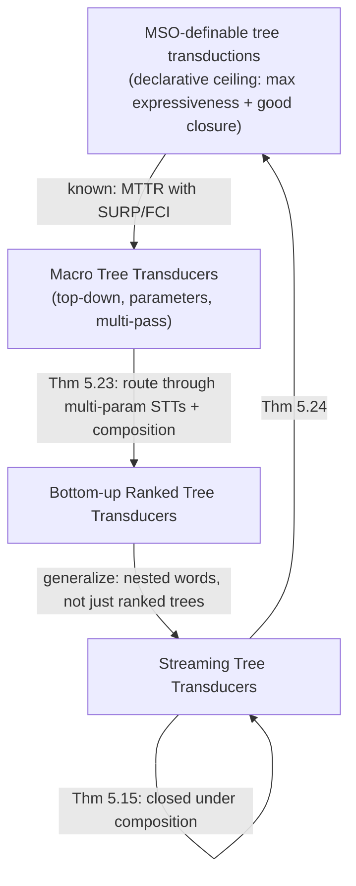

[[book-guidelines|↩ Back to guidelines]]

# Streaming Tree Transducers

## The five-way tension this chapter finally resolves

Every prior model in the thesis traded something away. Chapter 3's S-TTRs (see [[Symbolic-Tree-Transducers-and-the-FAST-Language]]) needed *two passes* because regular look-ahead requires checking a subtree's shape before deciding what to output for it. Executable tree-transducer models — bottom-up transducers, visibly pushdown transducers — run in one pass but can't compute every MSO-definable transformation. Macro Tree Transducers (MTTs) with regular look-ahead *can* compute every MSO-definable ranked-tree transformation, but the look-ahead cannot be eliminated without losing expressiveness, so they too need multiple passes. And almost nothing generalizes cleanly to *unranked* trees (arbitrary numbers of children, as in real XML/HTML).

The thesis states the wish-list explicitly — an ideal tree transducer should:

1. capture a large class of transformations,
2. enjoy decidable equivalence and type-checking,
3. be closed under composition and regular look-ahead,
4. operate over strings, ranked trees, *and* unranked trees,
5. compute the output in a single linear-time left-to-right pass.

**Monadic Second-Order (MSO) logic** is the accepted answer to "what's the largest class with good properties" (property 1 and 2, expressible via graph transformations over nodes and edges) — but MSO is a *declarative* specification, not an algorithm; nothing about an MSO formula tells you how to execute it efficiently. The entire chapter is the construction of a model — the **Streaming Tree Transducer (STT)** — that is simultaneously exactly as expressive as MSO *and* executable in a single linear pass. No prior model achieved both.

## Nested words with holes: the data structure that makes streaming possible

STTs process a tree the same way Chapter 4's S-VPAs process hierarchical data: as a **nested word** — $a(b, c(d,d))$ becomes $\langle a \langle b\, b\rangle \langle c \langle d\, d\rangle \langle d\, d\rangle c\rangle a\rangle$, an inorder traversal with call/return brackets marking descent and ascent. This single choice is what makes "single left-to-right pass" a coherent goal at all: a tree that's already linearized has an obvious left-to-right order to stream through.

**But streaming a tree transformation raises a new problem plain streaming string transducers don't have:** what if the transducer wants to build a fragment of output *now* that a later-computed subtree needs to be spliced into? A **type-1 nested word** — one containing exactly one **hole**, written `?` — solves this: it's an incomplete output fragment, literally a unary function from nested words to nested words (`W1 := ? | ⟨a W1 b⟩ | W1 W0 | W0 W1`). Writing $y[v]$ substitutes $v$ for the hole in $y$. This is the mechanism that lets an STT commit to *shape* before it has finished computing *content* — precisely what a single top-down-then-bottom-up pass over a swap or reorder transformation needs.

```rust
// A hole is a first-class placeholder: emit the shape now, plug the value
// in once it's known. This is exactly how you'd build an output tree in a
// single streaming pass without ever needing to backtrack over already-
// emitted output.
enum NestedWord<Sym> {
    Empty,
    Symbol(Sym),
    Call(Sym, Box<NestedWord<Sym>>, Sym), // <a  W  a>
    Concat(Box<NestedWord<Sym>>, Box<NestedWord<Sym>>),
    Hole, // type-1 only: exactly one per value
}
```

## The single-use restriction: copylessness, generalized

**What breaks without a restriction on variable reuse.** An assignment like $x := xx$ doubles the length of $x$ at every step — iterate it and the output grows exponentially in the number of symbols processed, which immediately destroys any hope of linear-time, constant-work-per-symbol execution. The naive fix — forbid *any* variable from appearing twice, ever — is called **copyless**, but it's needlessly strict: an assignment like $(x, y) := (z, z)$ *duplicates* $z$ into two variables, yet is perfectly safe **if you can guarantee $x$ and $y$ will never both end up contributing to the final output.**

The thesis's actual mechanism is more refined: a reflexive, symmetric **conflict relation** $\eta$ over variables. If $\eta(x, y)$ holds, $x$ and $y$ are *not allowed to occur together* in any single right-hand-side expression or in the output. The **single-use restriction** requires that every assignment is *consistent* with $\eta$ (no variable repeated within one expression; no two $\eta$-conflicting variables co-occurring) and that the conflict structure is *preserved* by substitution (if $\eta(x,y)$ and some new variable's assignment mentions $x$ while another's mentions $y$, those two new variables must themselves be $\eta$-related). This is precisely what licenses $(x,y) := (z,z)$ when $\eta(x,y)$ holds — the two copies of $z$ are tracked as mutually exclusive from that point on, so at most one of them can ever reach the output. **Copyless is the special case where $\eta$ is the purely-reflexive relation** — no variable may ever appear more than once anywhere, full stop.

**What this buys, precisely (Proposition 5.1):** STT outputs are **linearly bounded** — output length is within a constant factor of input length — a direct, mechanical consequence of the single-use restriction guaranteeing the total size of live variable values can only grow additively, never multiplicatively, at each step.

```lean
-- The conflict relation as the compile-time discipline a linear/affine
-- type system enforces on resource usage: η(x, y) says "x and y are the
-- same underlying resource, spend it at most once total." This is the
-- streaming-transducer analogue of linear types tracking single-use values.
structure ConflictRelation (Var : Type) where
  conflicts : Var → Var → Prop
  refl : ∀ x, conflicts x x
  symm : ∀ x y, conflicts x y → conflicts y x
```

## The transducer: states, stack, variables, holes

An STT is a *deterministic* machine $(Q, P, q_0, X, \eta, F, \delta_i, \delta_c, \delta_r, \rho_i, \rho_c, \rho_r)$ processing a nested word symbol by symbol:

- **Internal symbol**: update the state ($\delta_i$) and the variables in parallel ($\rho_i$) — an ordinary streaming-string-transducer step.
- **Call symbol** ($\langle a$): push a stack symbol *together with the current variable valuation*, update the state, and **reset** all variables to their identity value ($\varepsilon$ for type-0, `?` for type-1) — the transducer starts fresh inside the subtree it's descending into.
- **Return symbol** ($a\rangle$): pop the stack, and compute the new variable values from *both* the current variables and the popped ("parent-context") variables $X_p$ — this is where a completed subtree's contribution gets folded back into its parent's ongoing computation, exactly the moment a hole gets filled.

This structure is a direct generalization of a streaming string transducer's register-update discipline, with the stack handling exactly the "descend into a subtree, do something, and fold the result back at the matching return" pattern Chapter 4's S-VPAs already established for pure acceptance — now carrying full variable *valuations* instead of just automaton state.

**Worked example — subtree swap.** The chapter's running motivating example (§5.2) swaps the first two $b$-rooted subtrees in inorder traversal. The construction is genuinely instructive: state $q_0$ accumulates the first candidate subtree into variable $x$; on finding it complete, the transducer stashes a *hole-carrying* copy `y := xₚ?` and switches to state $q_1$, searching for the second $b$-subtree while continuing to extend $y$'s surrounding context; once found, the final update `x := yₚ[⟨b x b⟩] xₚ` splices the second subtree into the hole left for the first, and vice versa — accomplishing the swap without ever holding both subtrees' final positions open simultaneously. This is precisely why the hole mechanism exists: the transducer commits to "there will be a subtree *here*" before it has read enough of the input to know what that subtree actually is.

## Key structural results

**Bottom-up normal form (Theorem 5.7).** Every STT-definable transduction is also definable by a transducer that processes strictly bottom-up (children before parent, no interleaving). This isn't just a curiosity — it's the technical linchpin several later proofs (regular look-ahead elimination, composition) build on, because reasoning about "the transducer's state depends only on the subtree just finished" is far easier when bottom-up order is guaranteed.

**Regular look-ahead is eliminable without loss (Theorem 5.8, and the sharper Theorem 5.9).** Adding regular look-ahead — letting a transition depend on which regular language the *upcoming* subtree belongs to — doesn't add expressiveness: any STT-with-RLA can be simulated by a plain STT. The construction pays for this by having the new transducer's states track, for *every possible* look-ahead automaton state, what the underlying transducer would do — a "simulate all guesses in parallel" technique structurally similar to determinizing an NFA, generalized to the streaming setting. **Theorem 5.9 sharpens this**: with regular look-ahead available, *copylessness alone* (the strictest form of the single-use restriction) suffices for full expressiveness — the look-ahead automaton can pre-compute exactly which variables will actually contribute to the final output, letting the transducer skip updating (and thus never duplicate) anything that's dead. This is the precise sense in which "regular look-ahead lets you get away with the strictest single-use discipline": look-ahead information substitutes for the flexibility a general conflict relation would otherwise need to provide.

**Closure under composition (Theorem 5.15) — the second pillar.** Building on the bottom-up form and copyless-with-RLA normal form, two STT-definable transductions compose into another STT-definable transduction. This closure property is what makes STTs usable as verification building blocks the same way S-EFT composition (when it works) and S-TTR composition (Theorem 3.25, conditionally) do elsewhere in the thesis — except here it's **unconditional**, no single-valued-or-linear caveat required.

**Multi-parameter variables add nothing (Theorem 5.11, 5.14).** Allowing variables to carry several holes rather than one doesn't increase expressiveness — a technical simplification lemma the chapter uses to keep later proofs modular, letting harder results be proven for a richer-looking intermediate model and then transferred back down.

## Restricting inputs or outputs: strings and ranked trees fall out for free

The general STT model specializes cleanly at both ends:

- **Output restricted to strings**: allow only concatenation in variable updates (no tree insertion) — this recovers (a symbolic-flavored analogue of) Alur–Černý streaming string transducers.
- **Output restricted to ranked trees**: allow only tree-insertion updates — recovers a **bottom-up ranked-tree transducer (BRTT)**.
- **Input restricted to ranked trees**: gives exactly the BRTT model above, which the thesis identifies (Theorem 5.17) as *the only known bottom-up transducer model that computes every MSO-definable ranked-tree transformation* — a genuinely novel positive result, not just a specialization.
- **Both restricted (string-to-string)**: coincides with the Alur–Černý model exactly when both input and output are plain strings.

This modularity — one general model, four faithful specializations recovered by turning capabilities off — is a strong sign the abstraction is at the right level: it isn't "trees, with strings as an awkward edge case," it's one uniform mechanism where strings genuinely are trees of a particular shallow shape.

## The capstone: STT-definable = MSO-definable

**Theorem 5.24** is the technical peak of the chapter, threading through Chapter 3's tree-automata machinery, Macro Tree Transducers, and a chain of intermediate equivalences:

1. A known result (Theorem 5.22, from Engelfriet–Maneth) establishes MSO-definability of *ranked-tree* transductions coincides with **Macro Tree Transducers with regular look-ahead, restricted to SURP (single-use restricted in parameters) and FCI (finite-copying in the input)** — MTTs are top-down transducers with *parameters* (extra accumulator-like arguments threaded through recursive calls), and SURP/FCI are exactly MTT-flavored analogues of this chapter's single-use restriction.
2. **Theorem 5.23** shows every such MTTR is expressible as a BRTT — routed *through* the multi-parameter STT equivalence (Theorem 5.17) and STT composition (Theorem 5.15): the MTT's parameter-passing discipline gets compiled into a chain of composed bottom-up tree transducers.
3. Chaining these equivalences: MSO-definable $\Leftrightarrow$ MTTR-with-SURP/FCI-definable $\Leftrightarrow$ BRTT-definable $\Leftrightarrow$ (via the ranked/general correspondence) STT-definable.

The takeaway worth holding onto: **this proof doesn't invent expressiveness from scratch — it shows STTs sit at exactly the same expressiveness ceiling a prior top-down model (MTTs) already occupied, but reached via a bottom-up, single-pass-executable route instead of a multi-pass one.** The value added is entirely on the "analyzable and executable" axis, not the "how much can be expressed" axis.

## Decision problems: the first elementary equivalence bound for this expressiveness class

- **Output computation** (Proposition 5.25): $O(k|w|)$ — linear in input size and variable count, via a pointer/linked-list representation where each update touches only $O(k)$ pointers, never re-copies data. This is the concrete payoff of linear-boundedness: the *implementation* can be as cheap as the theorem promises.
- **Type-checking** (Theorem 5.26): given $S$ and automata $A$ (input language), $B$ (allowed-output language), deciding $[\![S]\!](L(A)) \subseteq L(B)$ is in **EXPTIME**, via a product construction whose states track, for every variable, a *summary function* describing how $B$ would process that variable's eventual value from any entry state to any exit state — an automaton-composition trick reminiscent of Chapter 4's state-pair summaries for S-VPA determinization, now applied to compose an automaton with a transducer's variable semantics instead of with itself.
- **Pre-image computation** (Theorem 5.27): the *same* construction, read differently (final states flipped), computes an automaton for the exact input language mapping into a target output language — importantly, **the pre-image of a regular language is always regular even though the image of an STT is not** (Proposition 5.2) — an asymmetry worth internalizing: STTs can produce non-regular output-language shapes, but never lose regularity when reasoning *backward* from a regular target.
- **Functional equivalence** (Theorem 5.28) — **the chapter's headline decidability result**: deciding $[\![S_1]\!] \ne [\![S_2]\!]$ is in **NEXPTIME**, the first *elementary* (as opposed to non-elementary, tower-of-exponentials) bound for equivalence of any model at MSO-transduction expressiveness. The proof is a three-way case split (domain mismatch — solvable in PTIME by known automata results; length mismatch — reduced to checking an *affine relation* over a pushdown automaton, solvable in PTIME via Müller–Olm–Seidl's algorithm; a genuine content mismatch at some aligned position — reduced to a pushdown-automaton reachability question with a **Parikh-image** constraint, i.e., "does some accepted string have equal counts of two designated symbols," itself decidable via known results). Notably, this route goes through **arithmetic reasoning about counts along a pushdown automaton's runs**, not a direct product-automaton construction the way, say, S-VPA equivalence (Chapter 4) does — a genuinely different proof technology, needed precisely because STTs' variable-valued state space has no direct finite-state analogue to build a product over.

## Where this leads



This chapter is the thesis's proof that the five-way tension named at the very start (expressiveness, decidable equivalence/type-checking, closure under composition/look-ahead, string/ranked/unranked flexibility, single-pass linear time) is not fundamental — it was an artifact of every *prior* model's specific design choices, not of the underlying transformation class. Every earlier chapter's restriction pattern (Cartesian guards for S-EFTs, regular look-ahead for S-TTRs, call/return-only binary predicates for S-VPAs) recovers *some* subset of good properties at the cost of expressiveness or executability; STTs are the chapter where the thesis shows you don't have to choose, provided the restriction is placed on the *right* structural feature — variable reuse discipline, rather than on the guards or the alphabet.

For `automated-reasoning` and `sat-smt-csp`: Theorem 5.28's proof structure — split an equivalence question into cases each reducible to a *different* known decidable sub-problem (automata language inclusion, affine-relation checking over pushdown systems, Parikh-image emptiness) — is a template worth having on hand for your own theorem-prover's proof-search architecture, where a single monolithic decision procedure is often less tractable than a well-chosen case split into several independently-decidable sub-goals. And the single-use/conflict-relation discipline is a strikingly direct real-world instance of **linear typing enforced as a side-condition on a term-rewriting system** rather than baked into the type system itself — worth comparing against how your compiler's own borrow/ownership tracking (if it needs one) might be phrased as a side-condition on assignment consistency rather than a full linear type theory.
