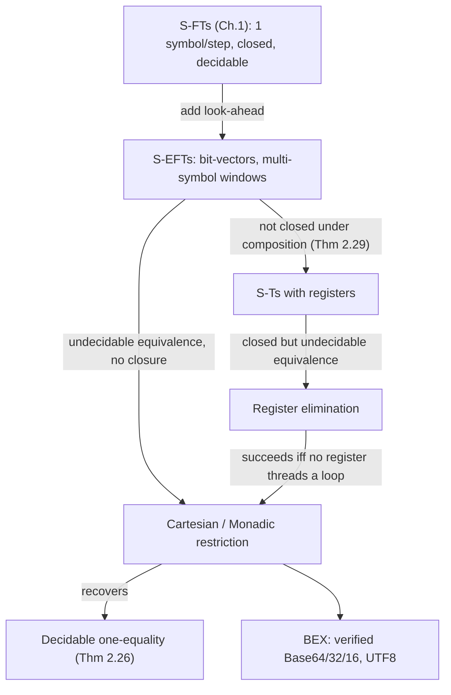

[[book-guidelines|↩ Back to guidelines]]

# String Coder Verification with BEX

## The problem: string coders defeat finite-state transducers

A string coder is any pair of functions that translate between formats — Base64 encode/decode, UTF-8/UTF-16 conversion, URL-encoding. They look like textbook regular-language territory: read a bounded window, spit out some bytes, repeat. Historically you'd model them with **finite state transducers (FSTs)** — automata with an output tape — and lean on the two facts that make FSTs a good static-analysis substrate: they're **closed under composition**, and **functional equivalence is decidable**. That combination is exactly what you need to state and check the coder's correctness contract:

$$E \circ D \equiv I \;\wedge\; D \circ E \equiv I$$

read encode-then-decode and decode-then-encode both collapse to the identity $I$. If a decoder inverts its encoder, there's exactly one way to encode any given input — which is precisely the property that real-world encoding attacks violate. The chapter opens with a live one: an invalid UTF-8 byte sequence `[0xC0, 0xAF]` decodes to `/`, and by feeding it disguised as `..%C0%AF../` to an unpatched IIS server, attackers bypassed a literal `../../ ` path-traversal check. If the codec's encode/decode pair were a verified bijection, this ambiguity couldn't exist.

**What breaks without a better model.** Try modeling Base64 with a plain FST. Base64 reads 3 bytes (24 bits) at a time and repackages them into 4 six-bit output characters — so output character 2, say, depends on the *last two bits* of input byte 1 and the *first four bits* of input byte 2. An FST transition consumes one symbol and emits based on it; to remember "the last four bits of the byte I just read" until the next step, you have to encode that fragment into the *state*. Multiply that by an alphabet of $2^8$ (or, for Unicode coders, up to $2^{32}$) symbols and you get a state-space explosion — the naive product of "control state" and "possible bit leftovers." FSTs simply don't have a slot for *symbolic* reasoning over bits; every transition is committed to one concrete symbol.

Three concrete obstacles, all present even in Base64:
- **Large alphabets** — up to $2^{32}$ symbols for Unicode.
- **Bit-vector semantics** — real coders manipulate bits (`bits`, shifts, `or`), not atomic symbols.
- **Look-ahead** — one output symbol can depend on several adjacent input symbols.

This chapter's fix is the **Symbolic Extended Finite Transducer (S-EFT)**: a transducer whose transitions are *predicates and functions over multiple input symbols at once*, rather than single concrete-symbol edges. Chapter 1 already introduced Symbolic Finite Transducers (S-FTs) — one-symbol-at-a-time transitions guarded by predicates over an infinite alphabet. S-EFTs generalize this along the orthogonal axis of *look-ahead*.

## S-EFTs: predicates with multi-symbol look-ahead

### Definition and semantics

An **S-EFT** is a tuple $A = (Q, q_0, R)$ where $R = \Delta \cup F$:

- $\Delta$ is a set of **transitions** $p \xrightarrow[\ell]{\varphi/f} q$ — from state $p$ to state $q$, reading $\ell \geq 1$ symbols, guarded by a $\sigma^\ell$-predicate $\varphi$ (a Boolean formula over $\ell$ symbols of the input sort), with output function $f: \sigma^\ell \to \gamma^*$.
- $F$ is a set of **finalizers** $p \xrightarrow[\ell]{\varphi/f} \bullet$ — like a transition but ending the run instead of continuing to another state; $\ell$ may be $0$ (matching end-of-input with no remaining symbols).

An S-EFT whose every output is $\varepsilon$ is a **Symbolic Extended Finite Automaton (S-EFA)** — the acceptor-only counterpart, used throughout the chapter to isolate closure/decidability questions from output semantics.

Compare this to an ordinary automaton: a rule doesn't fire per-symbol, it fires per-*window*. The transduction relation $T_A(u)$ is the set of outputs reachable by chaining rule [[Symbolic-Visibly-Pushdown-Automata-for-Hierarchical-Data#Applications|applications]] that jointly consume all of $u$ down to a finalizer. **Finalizers are a generalization of final states**: in the non-symbolic setting you'd normally mark acceptance with a special end-of-string sentinel, but when the input sort is something like `Int`, there is no symbol "outside" the type you can safely reserve — so acceptance has to be a first-class rule shape instead of a sentinel hack.

```rust
// A direct structural transcription of Definition 2.1.
// The book's `l` (look-ahead) becomes a compile-time-ish arity here;
// in practice a real implementation would need dynamic arity per rule.
enum Rule<State, Guard, Output> {
    Transition { from: State, lookahead: usize, guard: Guard, output: Output, to: State },
    Finalizer  { from: State, lookahead: usize, guard: Guard, output: Output },
}

struct SEFT<State, Guard, Output> {
    states: Vec<State>,
    initial: State,
    rules: Vec<Rule<State, Guard, Output>>,
}
```

**Determinism and single-valuedness.** A transduction $f$ is **single-valued** if $|f(x)| \le 1$ for every $x$ — it behaves like a partial function, not a relation. Determinism (Definition 2.6: overlapping guards must agree on continuation state, look-ahead, and output) is a *sufficient* condition for single-valuedness, mirroring how a DFA is a sufficient — not necessary — condition for a deterministic *language*.

**Worked example — Base64.** `Base64encode` is a *one-state* S-EFT with a look-ahead-3 loop rule (read 3 bytes, emit 4 six-bit characters via bit-extraction functions like $\lfloor x \rfloor$, defined as the standard Base64 character map) plus two finalizers handling the tail-padding cases (1 or 2 leftover bytes, padded with `=`). `Base64decode` mirrors it at look-ahead 4. This is the payoff of the model: the state count stays at *one*, because look-ahead — not state — carries the "memory" of adjacent bytes. Every worked construction in the chapter builds on this same shape.

### The BEX language

BEX programs compile directly into S-EFTs: an integer state variable `q`, and `repeat { guard, q=v1 ⇒ update[q=v2]; ... }` blocks whose guards are regular expressions over a fixed window and whose right-hand sides are bit-vector-arithmetic terms over the read symbols `#0, #1, ...`. The Base64 example from the introduction *is* real BEX source:

```
function em(x) := ite(x<=25, x+65, ite(x<=51, x+71, ite(x<=61, x-4, ite(x==62, '+', '/'))))
program base64encode := repeat {
   [\0-\xFF]{3} => [em(bits(7,2,#0)), em((bits(1,0,#0)<<4)|bits(7,4,#1)),
                    em((bits(3,0,#1)<<2)|bits(7,6,#2)), em(bits(5,0,#2))];
   [\0-\xFF]{2}$ => [ ... , '=' ];
   [\0-\xFF]{1}$ => [ ... , '=', '=' ];
}
assert-true (comp(base64encode, base64decode), eq(identity));
```

That `assert-true` line is the whole point of the model: it's a *program*, checkable by the same equivalence and composition machinery this article covers next, not just a specification you read and trust.

## Cartesian and monadic restrictions — recovering decidability

General S-EFAs turn out to behave like **context-free grammars**, not regular languages — a steep price for the extra expressiveness:

- **Domain intersection is undecidable** (Theorem 2.11) — via a reduction from Minsky-machine halting: encode a machine configuration as a symbolic triple $(pc, r_1, r_2)$, build one S-EFA accepting "valid odd steps" and another accepting "valid even steps," and their domain intersection is nonempty iff the machine halts.
- **Emptiness is decidable** (Theorem 2.12) — strip unsatisfiable-guard transitions, check reachability to $\bullet$.
- **Closed under union, not under intersection or complement** (Theorem 2.13) — union is a straightforward "new start state, keep both rule sets" construction; complement would let you derive intersection (contradiction with 2.11), and closure under complement would let you decide universality (contradicting 2.14).
- **Universality and equivalence are undecidable** (Theorem 2.14).
- **Longer look-ahead is strictly more expressive** (Theorem 2.15) — an equality guard over $k+1$ adjacent positions cannot be split into any conjunction of guards over $\le k$ positions, because equality is inherently a relation between all $k+1$ variables at once.

**What breaks without a restriction:** none of the closure properties that made FSTs a usable verification substrate survive unrestricted S-EFAs. You need a syntactic condition on guards that's decidable to check and expressive enough for real coders — that's the **Cartesian** restriction.

**Definition (Cartesian).** A predicate $\varphi(\bar x)$ over $\sigma^n$ is Cartesian if it decomposes as a conjunction of independent unary predicates — equivalently, $\varphi$ equals the Cartesian product $R_1 \times \cdots \times R_n$ of $n$ single-variable relations. Checkable via one satisfiability query per predicate (`IsCartesian`, Definition/§2.3.4): witness a satisfying tuple $\bar a = W(\varphi)$, then verify $\varphi(\bar x) \Leftrightarrow \bigwedge_i \varphi(a_0, \dots, x_i, \dots, a_{n-1})$.

**Theorem 2.8.** Cartesian S-EFAs are exactly as expressive as ordinary S-FAs (single-symbol-at-a-time symbolic automata) — every multi-symbol Cartesian rule can be split into a chain of single-symbol rules through fresh intermediate states, because Cartesian-ness is precisely "no cross-position constraint," so nothing is lost by processing one position at a time. Consequently Cartesian S-EFAs inherit full Boolean closure and decidable equivalence — for free, by falling back to the S-FA theory.

Is Cartesian too restrictive to model real coders? No: `Base64encode`'s guard is trivially Cartesian (it's just `true`), and `Base64decode`'s guards are conjunctions of independent per-symbol range checks. A slightly more general, semantically-equivalent notion is **monadic**: a formula with an equivalent Monadic Normal Form (a Boolean combination of unary sub-formulas) — e.g. $x < y \bmod 2$ isn't literally Cartesian as written, but has an MNF, so it's monadic. **Theorem 2.10** shows monadic and Cartesian S-EFTs are effectively inter-convertible (given a decidable label theory), which matters practically: it lets BEX programmers write guards in whatever shape is natural and get automatic normalization to the tractable class rather than hand-deriving a Cartesian form.

```lean
-- The Cartesian restriction is exactly what your elaborator's `isDefEq`
-- machinery needs when a guard "doesn't relate two metavariables to each
-- other": a decomposable conjunction of independent unary constraints is
-- solvable position-by-position, just like an S-FA transition.
-- Sketch, not a literal Mathlib definition:
def IsCartesian {n : Nat} (φ : (Fin n → σ) → Prop) : Prop :=
  ∃ (R : Fin n → σ → Prop), ∀ x, φ x ↔ ∀ i, R i (x i)
```

## Equivalence: one-equality vs. domain-equivalence

Checking $E \circ D \equiv I$ needs a precise notion of "these two transductions agree." The chapter separates two notions that a naive reading of "equivalence" conflates:

- **One-equality** ($f \overset{1}{=} g$): $f$ and $g$ agree wherever *both* are defined. Formally, $f \sqcup g$ (their union-merge, undefined where they disagree or where only one is defined outside the intersection... precisely: $f \sqcup g(x) = f(x) \cup g(x)$ if $x \in D(f) \cap D(g)$, else $\emptyset$) is single-valued. This is a weaker, more permissive notion than full agreement — it doesn't care about domain mismatches, only about conflicts on the shared domain.
- **Domain-equivalence**: $D(f) = D(g)$ — same domain, output values not compared at all.

For single-valued, domain-equivalent transducers, one-equality *implies* true equivalence $T_A = T_B$. This split matters because it isolates *which* property a given algorithm can actually decide — you might have a decidable procedure for one-equality on a class where domain-equivalence (or full equivalence) still isn't decidable, and BEX's practical verification recipe is exactly to establish domain-equivalence and one-equality separately.

**Undecidable in general (Theorem 2.19).** One-equality of S-EFTs, even at look-ahead 2, is undecidable — reduced from domain intersection (2.11) via a construction that turns each S-EFA's domain membership into an output tag; two such transducers' merge is single-valued exactly when the original domains are disjoint. The chapter also uses the same technique to correct a published error: Botinčan et al. had claimed decidable equivalence for a related model, **symbolic finite transducers with look-back (*k*-SLTs)** — look-back means "reference up to $k-1$ *previous* characters" rather than reading $k$ *new* ones. The claimed proof used a cross-product-and-check-emptiness argument, which silently assumes each transition's applicability is independent of history — false for look-back, since which transition fired last constrains what can fire next. D'Antoni shows the same Minsky-machine encoding breaks that claim too.

**Decidable for Cartesian S-EFTs (Theorem 2.26) — the chapter's central positive result.** The proof is a genuinely instructive chain of reductions:

1. **Product construction** ($A \times B$): pair-state automaton over $(p,q) \in Q_A \times Q_B$, splitting every multi-symbol Cartesian transition into single-symbol steps first (§2.5.2's split-transition trick), so the product can be built one symbol at a time; $D(A \times B) = D(A) \cap D(B)$, and $A \overset{1}{\neq} B$ exactly when some run of the product outputs a mismatched pair $(v, w)$, $v \neq w$.
2. **Alignment** (Lemma 2.23): pair-states where $A$ and $B$'s current look-aheads don't line up get algorithmically merged or split until every reachable pair-state consumes input in lockstep — a delicate case analysis (the chapter's proof runs several pages) showing this always terminates in an aligned equivalent, or definitively finds a witness of inequality.
3. **Grouping** (Lemma 2.24): once aligned, lift the whole product to work over the σ\* (nested-sequence) type, reducing to a *single-symbol* alignment problem.
4. **Reduce to known S-FT decidability** (Lemma 2.25, from Veanes et al.): once you're down to a product where transitions read one grouped symbol at a time, one-equality is exactly the S-FT one-equality result the chapter is extending — a decidable check over a decidable label theory.

The takeaway: Cartesian-ness isn't just a closure-property nicety, it's precisely what makes step 1 (single-symbol splitting) possible, which cascades into every subsequent step. Extending to monadic S-EFTs (Corollary 2.27) comes for free via Theorem 2.10's normalization.

## Composition: not closed, and worse than that — not even effectively constructible

Even Cartesian S-EFTs are **not closed under composition** (Theorem 2.29). The counterexample composes two adjacent-swap transducers ($A$ swaps positions $(0,1), (2,3), \dots$; $B$ swaps $(1,2), (3,4), \dots$) and shows the composed transformation shuffles element $a_i$ to a position that depends on the *total length* of the input in an unbounded way — no fixed look-ahead window can express it, by a case-split argument over what the minimal witnessing look-ahead would have to be (each case reaches a contradiction about which symbols would need to be visible before they've been read).

Worse: **even when a composition happens to be S-EFT-definable, you cannot always effectively construct it** (Theorem 2.31) — proved by simulating Minsky-machine intersection through composition itself, so deciding whether the composed S-EFT exists in constructible form would let you decide machine halting.

**What breaks without a workaround:** if composition isn't closed *and* isn't always constructible, then "compose two verified components and re-verify the composite" — the whole point of wanting closure in the first place — is simply unavailable as a general algorithm. The chapter's answer is a **sound-but-incomplete practical algorithm**:

1. Convert each S-EFT into a **Symbolic Transducer with registers (S-T)** — a model that trades look-ahead for an explicit register that remembers previously-seen symbols (Definition 2.32). Registers make S-Ts closed under composition (a known prior result), at the cost of undecidable equivalence in general.
2. Compose in S-T form — always possible, since S-Ts *are* closed under composition.
3. Run a **register-elimination** procedure that tries to fold the register back into finite look-ahead, recovering an S-EFT.

Step 3 succeeds exactly when *no register value has to persist across a loop iteration* — i.e., when the "memory" the composition needs is bounded, which is exactly the structural condition an S-EFT's finite look-ahead can express. When a register value would need to survive an unbounded number of loop iterations (as in the swap-composition counterexample), elimination necessarily fails — this is Theorem 2.29's obstruction resurfacing as an algorithmic failure mode rather than an abstract non-definability proof.

```rust
// The register-elimination success condition, as a design pattern:
// "does any register write from inside a loop body get read outside
// a bounded number of loop iterations?" If yes -> stuck with S-T form.
// If no -> the register content is boundable by finite look-ahead,
// and register elimination can synthesize an equivalent S-EFT.
enum CompositionResult<T> {
    ReducedToSEFT(T),          // register elimination succeeded
    StuckAsRegisterTransducer, // register value threads through a loop
}
```

## Verifying real coders

BEX-modeled Base64, Base32, Base16, and UTF-8 encoders/decoders were checked for $E \circ D \overset{1}{=} I$ and $D \circ E \overset{1}{=} I$ in single-digit-to-low-double-digit milliseconds (Table 2.1) — contrasted against finite-alphabet FST modeling, where the authors note most of these compositions would take over an hour. A scaling experiment chained up to 9 consecutive UTF-8 encode/decode round-trips; composing "encode-first" chains scaled cleanly (look-ahead stays bounded at 2 regardless of chain length), while "decode-first" chains blew up combinatorially — look-ahead grew *exponentially* with chain length, reaching 16 by the third composition, because decoding first means each successive encode step has to symbolically track an ever-larger window of already-decoded context. The chapter also sketches S-EFAs as a succinct alternative to Extended Finite Automata for deep packet inspection, and shows the one-equality/composition machinery proving a real functional-program refactoring law ($f_3(f_2(l)) \overset{1}{=} f_2(f_3(l))$ for two CAML pattern-matching functions) in under a millisecond.

## Where this leads



This chapter is the thesis's proof-of-concept for its central three-way tension (expressiveness / closure-decidability / executability): S-EFTs buy real expressiveness over S-FTs (multi-symbol windows, bit-vector semantics) but pay for it in closure and decidability, and the entire chapter is the search for *how much of that price can be clawed back* via a syntactic restriction (Cartesian/monadic). Every later chapter repeats this pattern on a different axis — Chapter 3 does the same move for trees (regular look-ahead recovers closure under composition for S-TTRs), Chapter 4 does it for nested/hierarchical data (restricting binary predicates to matching call/return pairs, rather than S-EFA-style adjacent positions, is what lets S-VPAs keep full Boolean closure), and Chapter 5's [[Streaming-Tree-Transducers|streaming tree transducers]] are the chapter that finally achieves all three properties simultaneously via the single-use/copyless restriction.

For the `sat-smt-csp` and `static-analysis` focus areas specifically: the Cartesian-decomposition technique here is a concrete, hands-on instance of a recurring idea in constraint solving — a satisfiability problem that superficially looks like it needs joint reasoning over several variables, but is actually *equivalent* to independent per-variable reasoning once you find the right syntactic normal form (compare: how a CSP solver detects and exploits variable-independence to decompose search). And the register-elimination algorithm's success condition — "does state have to persist across an unbounded loop" — is exactly the kind of finiteness/boundedness question your abstract-interpretation passes will need to answer when deciding whether a program's data-flow facts can be summarized by a finite abstract domain versus requiring widening.
