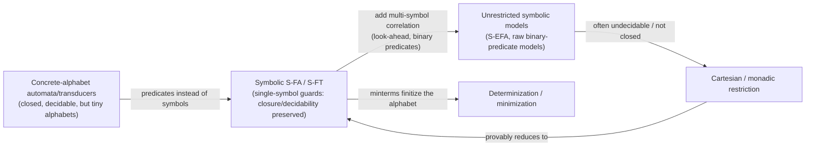

[[book-guidelines|↩ Back to guidelines]]

# Symbolic Automata and Transducers over Infinite Alphabets

## Why automata at all, and why "symbolic"

Before this thesis extends anything, it's worth re-deriving why automata are a program-analysis tool in the first place — the introduction (Chapter 1) makes this case explicitly, because everything downstream depends on it surviving the coming generalizations.

**Automata as programs.** A finite automaton is a labeled graph — states as nodes, an input alphabet on the edges — whose language is the set of strings with a path from an initial to a final state. That's a description; the thesis's actual point is that this description *is* a Boolean-valued program. The example: `all_TG(l)` — "every element of list `l` is `T` or `G`" — is literally the automaton `all_TG` in Figure 1.1. **Transducers as programs** extend this to list-to-list functions by attaching an output sequence to each edge; `map_base` (swap each DNA base for its pair) is a two-state transducer with `A/T`, `T/A`, `G/C`, `C/G` edges.

**Why bother re-encoding an OCaml function as a graph?** Because the graph representation is closed under operations the source language doesn't give you for free:

- Automata: complement, intersection, determinization, minimization, and **decidable language equivalence**.
- Transducers: **closed under sequential composition**, decidable **functional equivalence**, and **regular type-checking** — given a transducer $T$ and automata $I, O$, it's decidable whether every $I$-accepted input produces a $T$-output accepted by $O$.

Concretely: to prove `all_TG` and `all_AC` (all-T-or-G vs. all-A-or-C) accept disjoint inputs, you don't reason about the OCaml recursion at all — you build the product automaton and check its language is empty. To prove that filtering-then-mapping a DNA sequence, then filtering again, always yields the empty list on already-DNA input, you compose the corresponding transducers into one single-pass transducer and run regular type-checking against `is_empty`'s automaton. **This is the entire methodology of the dissertation**: turn a program property into an automaton-theoretic question that a decision procedure can answer, rather than reasoning about source code directly.

**What breaks without closure and decidability.** If automata could not be intersected, "these two programs behave disjointly" would have no static check — you'd be back to testing. If transducer equivalence were undecidable outright (as it is for *unrestricted* — non-single-valued — finite transducers, a classical result the thesis cites), composing transducers to fuse multiple passes into one wouldn't be trustworthy, because you couldn't verify the fusion preserved behavior. Every result in this thesis is a variation on "how much of this closure/decidability toolkit survives a given generalization."

## Three named limitations of the classical models

Classical (concrete-alphabet) automata and transducers are limited in three independent ways the thesis names explicitly (§1.4), and each becomes a chapter's organizing problem:

| Limitation | What it means | Addressed by |
|---|---|---|
| **Alphabet expressiveness** | Only finite, small alphabets; can't naturally express "any byte $> 127$" without $2^8$ separate edges, let alone `Int` or `Unicode` | Symbolic transitions (predicates instead of concrete symbols) — this article, Chapters 2–5 |
| **Executable models** | The most expressive prior extensions require *multiple passes* over the input | [[Streaming-Tree-Transducers|Streaming Tree Transducers]], Chapter 5 |
| **Usability** | Automata/transducers are unpleasant to hand-write and poorly integrated with real languages | BEX, FAST — Chapters 2–3 |

This article is about the fix for the *first* limitation: making the alphabet itself symbolic.

## Predicate-based transitions: what "symbolic" buys you

The core move, common to every model in the thesis, is to replace *"this edge fires on symbol `a`"* with *"this edge fires on any symbol satisfying predicate $\varphi$."* A **label theory** is a recursively enumerable set of formulas $\Psi$, closed under Boolean connectives, substitution, equality, and if-then-else, used as the vocabulary for these predicates; it is **decidable** when satisfiability ($\mathrm{IsSat}$) of any $\varphi \in \Psi$ is decidable. The universe $U$ is multityped, with $\Sigma = U^\sigma$ standing for the input sort. An **effective witness function** $W$ produces, for any satisfiable $\varphi$, some concrete value $W(\varphi) \in \llbracket \varphi \rrbracket$ satisfying it — a small but load-bearing assumption, since several later algorithms (e.g. Cartesian-splitting in the BEX chapter) work by picking *a* witness and reasoning generically about it.

A **Symbolic Finite Automaton (S-FA)** is exactly a finite automaton where each edge carries such a predicate $\varphi$ over $\sigma$ instead of a literal symbol; a **Symbolic Finite Transducer (S-FT)** adds an output function $f$ per edge, giving a pair $\varphi/f$. This is the baseline symbolic model the whole thesis builds on (originated by Veanes et al.; the thesis's own S-EFTs, S-TTRs, S-VPAs, and STTs are all elaborations of this same idea in different dimensions — multi-symbol look-ahead, tree shape, nested/hierarchical shape, streaming discipline).

**What breaks without predicates.** Represent "accept any byte $\ge 128$" concretely and you need 128 separate transitions — one per symbol — and the automaton's size scales with alphabet size, not with the *complexity of the property*. For an alphabet like 32-bit Unicode codepoints ($2^{32}$ symbols), this isn't just inelegant, it's computationally impossible to even write down. A predicate makes the transition's size proportional to the *formula*, independent of how large (or infinite) the underlying domain is.

```rust
// A predicate-labeled transition, directly transcribing the S-FA idea.
// `Guard` stands in for a term in some label theory (e.g. an SMT formula);
// checking whether a concrete symbol satisfies it is a solver call, not
// a table lookup, which is the entire point.
struct SymbolicTransition<State, Guard> {
    from: State,
    guard: Guard,   // e.g. "x >= 128" instead of enumerating 128 edges
    to: State,
}
```

```lean
-- The predicate-as-transition idea is structurally identical to how a
-- type-checker's guard on a dependent match arm is a *decidable proposition*
-- over the scrutinee, not an enumeration of constructors — an S-FA guard is
-- doing the same job an inductive-type discriminant would, but over an
-- open, possibly infinite domain rather than a closed set of constructors.
structure SymbolicTransition (State Sym : Type) where
  from : State
  guard : Sym → Prop
  to : State
```

## Cartesian and monadic restrictions on predicates

Symbolic automata alone don't yet raise a decidability problem — S-FAs (single-symbol guards) already retain full Boolean closure and decidable equivalence, because a guard only ever talks about *one* symbol at a time, so intersecting two S-FAs' languages reduces to conjoining guards pairwise, exactly as in the finite-alphabet case. The trouble starts once transitions are allowed to look at *several* symbols in one guard — which the thesis needs for look-ahead (Chapter 2) and for cross-position constraints (Chapters 3–4). A guard like $\lambda(x_0, x_1).\, x_0 = x_1$ genuinely couples two positions, and once guards can do that, satisfiability-preserving operations like intersection stop composing as cleanly, and — as later chapters show for unrestricted multi-symbol models — closure and decidability can fail outright.

The **Cartesian restriction** is the standard fix, reused across the thesis: a predicate $\varphi$ over $\sigma^n$ is Cartesian if it factors into a conjunction of $n$ independent unary predicates — i.e., it never actually correlates two positions, even though it's syntactically written over several. Checking this is a single validity query against a witness tuple (`IsCartesian`, detailed in the BEX chapter). The payoff, proved concretely for S-EFTs but conceptually general: **a Cartesian multi-symbol guard can always be split into a chain of ordinary single-symbol S-FA transitions**, which means a Cartesian symbolic model is exactly as expressive as — and inherits all the closure/decidability properties of — the plain single-symbol S-FA/S-FT theory this section opened with.

A slightly more permissive, semantically equivalent notion is **monadic**: a formula that merely *has* an equivalent Monadic Normal Form (a Boolean combination of unary sub-formulas), even if not written that way. Monadic and Cartesian predicates are effectively inter-convertible whenever the label theory is decidable, which is a genuinely useful looseness for a language implementer — a user's guard doesn't have to be *syntactically* Cartesian, just semantically reducible to it, and the compiler can do the reduction.

**What breaks without this restriction:** every one of the thesis's positive decidability results — decidable one-equality for BEX's S-EFTs, decidable emptiness/equivalence for S-VPAs, MSO-equivalence and NEXPTIME functional equivalence for streaming tree transducers — is preceded by an analogous "here is the unrestricted version, and here is exactly why it's undecidable or non-closed" result. The Cartesian-style restriction is the thesis's one recurring answer to "how do we get the negative result to stop applying": don't allow guards to *relate* positions to each other, only to independently constrain each one.

## Minterms: making an infinite alphabet finite where it matters

Symbolic transitions solve the *representation* problem (a formula instead of $2^{32}$ edges), but several algorithms — determinization chief among them — still conceptually need to reason about "the set of symbols an automaton can read next," which is now an infinite set. The **minterm** is the device that makes this tractable.

Given a finite set of predicates $\Phi$ occurring in an automaton, a minterm is a minimal satisfiable Boolean combination of all of them — intuitively, an equivalence class of the underlying infinite alphabet with respect to how *this specific automaton* distinguishes symbols. For $\Phi = \{x > 2,\ x < 5\}$ over linear integer arithmetic, $\mathrm{Mt}(\Phi) = \{x{>}2 \wedge x{<}5,\ \neg x{>}2 \wedge x{<}5,\ x{>}2 \wedge \neg x{<}5\}$ — three classes covering (up to the excluded corner) all of $\mathbb{Z}$. Two input symbols in the same minterm are *indistinguishable* to the automaton: swap one for the other anywhere in an input and every run is unaffected. This is precisely how "the alphabet is infinite" and "the automaton only cares about finitely many things" coexist: **only the predicates actually written in the automaton matter, and their Boolean closure is always finite** (at most $2^p$ minterms for $p$ predicates), regardless of how large or infinite $\Sigma$ itself is.

Minterms are what let a **subset-construction-style determinization** go through symbolically at all. In the plain automata-theory version, determinizing means grouping concrete symbols into a transition table; symbolically, there's no way to enumerate the alphabet to build that table, so the algorithm instead partitions the *predicate space* into minterms first, and then runs an otherwise-familiar subset construction over minterms rather than raw symbols. (The thesis needs a *two-sorted* version of this — unary minterms $\mathrm{Mt}^1_A$ for single-position guards and binary minterms $\mathrm{Mt}^2_A$ for the call/return-matching guards — when it reaches S-VPAs in Chapter 4, precisely because that model has both kinds of predicate; see that chapter for the full construction. The concept introduced here is the same one, just simpler in the single-sort S-FA case this thesis builds on.)

**What breaks without minterms:** you cannot even *state* a determinization or minimization algorithm for a symbolic automaton without first cutting the infinite alphabet down to finitely many behaviorally-relevant classes — every later closure-property proof in the thesis (Boolean closure via determinize-complete-flip, decidable emptiness via reachability) implicitly assumes this reduction is available.

## Closure properties and decidable equivalence, as the standard to beat

Every subsequent chapter is graded against the same rubric this article has now assembled from the classical/S-FA baseline:

1. Is the model closed under union, intersection, complement (automata) or composition (transducers)?
2. Is equivalence decidable?
3. If (1)–(2) hold only for a restricted subclass, is membership in that subclass itself decidable to check?



Chapter 2's S-EFAs show the rubric's negative side starkly: multi-symbol look-ahead alone (no binary predicates even needed) is enough to push domain-intersection, universality, and equivalence into undecidability, and Cartesian-ness is exactly what claws decidability back. Chapter 4's S-VPAs show the positive side: restricting *where* binary predicates are allowed to point (only matching call/return pairs, never arbitrary positions) keeps full Boolean closure and decidable equivalence even though binary predicates are exactly the feature that breaks things elsewhere. Chapter 5's streaming tree transducers are the chapter that finally achieves closure under composition *and* decidable equivalence *and* full MSO-level expressiveness simultaneously, via a different kind of restriction (the single-use/copyless discipline) applied to the transducer's internal bookkeeping rather than to its guards.

## Where this leads

This article's vocabulary — predicates as transitions, label theories, decidable label theory, Cartesian/monadic restrictions, minterms — is the common substrate every later chapter assumes without re-deriving it. Concretely:
- Chapter 2 (see [[String-Coder-Verification-with-BEX]]) is this article's Cartesian-restriction story worked out in full for *multi-symbol look-ahead*, with the complete decidability proof for one-equality.
- Chapter 4's S-VPAs reuse minterms almost verbatim, just doubled into unary and binary flavors for call/return matching.
- Chapter 5's streaming tree transducers inherit the "symbolic alphabet via predicates" assumption throughout, layering a completely different (non-guard-based) restriction on top to get closure under composition.

For the `static-analysis` and `sat-smt-csp` focus areas: this is the clearest place in the thesis to see the *general pattern* — that a syntactic restriction on which relations a formalism is allowed to express (Cartesian-ness, monadic-ness, minterm-finiteness) is what turns an otherwise-undecidable static-analysis question into a decidable one, and that this restriction is itself effectively checkable rather than assumed. This is the same shape of argument you'll want when deciding what fragment of a refinement-type language's guards your own solver backend can afford to handle exactly versus needing to over-approximate — a Cartesian-style independence check is a cheap, syntactic first filter before reaching for a full SMT query.
