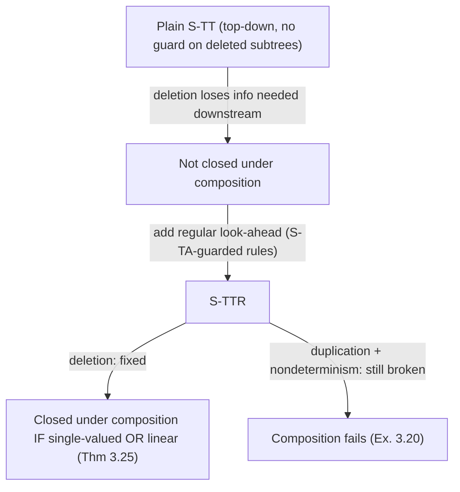

[[book-guidelines|↩ Back to guidelines]]

# Symbolic Tree Transducers and the FAST Language

## From strings to trees, and a new closure failure

Chapter 2's S-EFTs (see [[String-Coder-Verification-with-BEX]]) solved a string problem: multi-symbol look-ahead over symbolic alphabets. Trees are the natural next target — XML, HTML, JSON, and every compiler's AST are tree-shaped, and tree automata/transducers are the classical tool for reasoning about them. But moving from strings to trees isn't just "the same theory with an extra dimension": it reopens the closure question from scratch, in a genuinely different way.

**Symbolic tree automata (S-TAs)** — adding predicate-labeled transitions to classical tree automata — turn out fine: they retain Boolean closure and decidable emptiness/equivalence whenever the label theory forms a decidable Boolean algebra, essentially inheriting the good behavior of Chapter 2's single-symbol S-FAs (multi-symbol look-ahead was *string* automata's specific undecidability trigger, and it isn't present here). The trouble instead shows up on the *transducer* side: a plain **symbolic tree transducer (S-TT)** — one that walks the input tree top-down, node by node, and emits output — is **not closed under sequential composition**, even in fairly restricted cases, and this failure has nothing to do with symbolic alphabets at all — it's already a problem for classical, finite-alphabet top-down tree transducers whenever rules can delete or duplicate subtrees.

**What breaks concretely.** Take two transformations: $s_1$ copies its input tree unchanged if every node has attribute `true` (and is otherwise undefined — no rule fires past a `false` node), while $s_2$ ignores its input entirely and always emits `L[true]`. Composing them, $s = s_1 \circ s_2$, should output `L[true]` exactly when every node of the input is `true` — but no top-down S-TT can compute this. A top-down transducer commits to one output shape per input node *before* it has finished reading that node's subtrees; to decide whether $s_1$'s all-`true` precondition holds for the *whole* tree, the transducer would need to inspect both children of a binary node before continuing, but by the time it's read one child, it's already too late to change what it decided to output for the other. The transducer literally cannot "remember" a property of a subtree it hasn't looked at yet while it's producing output for the current node.

## Alternating symbolic tree automata: the guard machinery

Before defining the transducer, the thesis needs a richer *automaton* to serve as a look-ahead guard — one that can test "does this subtree satisfy property $P$" as a first-class predicate on transitions. This is the **alternating S-TA**.

**Definition.** An alternating S-TA is $A = (Q, T_\Sigma^\sigma, \delta)$ where $\delta$ is a finite set of rules $(q, f, \varphi, \bar\ell)$: from state $q$, on a node labeled $f$ (arity $k$) whose attribute satisfies guard $\varphi$, with a $k$-tuple of look-ahead sets $\bar\ell$ where $\ell_i \subseteq Q$ is a *set* of states, interpreted as a **conjunction**: subtree $i$ must be accepted by *every* state in $\ell_i$ simultaneously. This is the "alternating" part — a single rule can demand multiple independent properties of the same subtree at once, rather than committing to one automaton run per subtree. The language at state $q$ is defined compositionally: $t = f[a](\bar t) \in L_A^q$ iff some rule from $q$ has a satisfied guard and every subtree $t_i$ is in $\bigcap_{p \in \ell_i} L_A^p$.

**Why alternation, when it complicates the model?** Because it arises *naturally* when composing tree transducers — a composed transition frequently needs to check that a subtree satisfies several independently-defined conditions at once (e.g., "is well-formed *and* doesn't contain a `script` node"), and forcing that into a single non-alternating automaton up front would mean pre-computing a product automaton for every combination that might arise during composition. Keeping the guards as an unexpanded conjunction is what makes alternating S-TAs "succinct" enough to appear as *intermediate* artifacts of the composition algorithm (§3.4) without exploding.

**Normalization.** Alternation is convenient to construct but inconvenient to use directly — most classical tree-automaton algorithms (like the decision procedures reused for non-emptiness) assume singleton look-ahead sets. **Normalization** is a subset-construction: merge rules by taking conjunctions of guards and *unions* of activation-state sets, producing an equivalent non-alternating S-TA over $2^Q$. Theorem 3.7 proves this preserves language semantics; Proposition 3.8 then gets decidable non-emptiness "for free" by normalizing, discharging guard-unsatisfiability with the label theory's decision procedure, and falling back to classical tree-automaton emptiness. But this convenience isn't free: Proposition 3.9 proves non-emptiness of the *alternating* form is already **EXPTIME-complete** even *without* symbolic attributes — normalization can blow the automaton up exponentially, exactly mirroring the state-explosion classical alternating automata already exhibit. The symbolic layer adds nothing new to this particular cost; it was already there.

```rust
// A rule's look-ahead is a *conjunction of state sets per subtree slot* —
// this is precisely what makes an alternating S-TA a natural intermediate
// representation during composition: "this subtree must satisfy property A
// AND property B" doesn't need a pre-built product automaton for A-and-B,
// it's just two entries in the same look-ahead set.
struct AlternatingRule<State, Guard> {
    from: State,
    symbol: Symbol,
    guard: Guard,
    // one Vec<State> per child position; ALL states in each Vec must accept
    lookahead: Vec<Vec<State>>,
}
```

## S-TTRs: transducers guarded by regular look-ahead

A **Symbolic Tree Transducer with Regular look-ahead (S-TTR)** augments an S-TA-guarded rule with an *output term*: $(q, f, \varphi, \bar\ell, t)$, where $t$ is a **$k$-rank tree transformer** — an extended tree term that may embed recursive calls $\widetilde q(y_i)$ ("apply state $q$ to child $y_i$") anywhere in the output shape. This output-term formalism is exactly what lets a rule build an output tree whose shape doesn't mirror the input's, freely rearranging, duplicating, or dropping references to children.

Two structural properties matter throughout the rest of the chapter:

- **Linear**: a rule is linear if each variable $y_i$ occurs *at most once* in the output term $t$ — no subtree gets duplicated into the output. $T$ is linear if all its rules are.
- **Single-valued**: $|T_T^q(t)| \le 1$ for every input $t$ and state $q$ — the transduction behaves as a partial function. Determinism (no two rules simultaneously enabled on satisfiable, look-ahead-compatible conditions) is sufficient for single-valuedness and easy to check syntactically — but, notably, **deciding single-valuedness itself for S-TTRs is left as an open problem** (it's decidable in the classical, non-symbolic case).

**The domain automaton**, $d(T)$ — an S-TA built directly from $T$'s rules by folding each rule's look-ahead states together with the states referenced in its output — accepts exactly the trees on which $T$ is defined. This is the connective tissue between the transducer and the automaton theory of the previous section: every question about "what can $T$ consume" reduces to an S-TA emptiness/membership question.

**Worked example — `remScript` as an S-TTR.** Recall the HTML sanitizer from the chapter's introduction:

```
trans remScript:HtmlE → HtmlE {
    node(x1,x2,x3) where (tag != "script") to (node[tag] x1 (remScript x2) (remScript x3))
  | node(x1,x2,x3) where (tag == "script") to x3
  | nil() to (nil[tag])
}
```

In the underlying S-TTR: the "safe" rule recurses on $x_2, x_3$ (rebuilding the node), the "unsafe" rule *replaces the whole subtree with $x_3$* (dropping the `<script>` subtree entirely, continuing at the sibling), and the base case is the identity on `nil`. This program is genuinely simple to state as FAST source — but the important design decision is what it compiles *to*: an object with a domain automaton, decidable properties, and — critically for what's coming — a composition operation.

## Why regular look-ahead is not optional

Plain S-TTs (no look-ahead) are not closed under composition, and the reason is exactly the deletion/duplication example given above, sharpened: **when a rule can delete a subtree without reading it, information the *composed* transducer still needs gets lost**. Concretely (Example 3.18, `s1 ∘ s2` above): $s_1$'s decision to keep reading depends on *every* node in the tree being `true`, but a plain top-down transducer commits to output *before* fully exploring both children — it has no mechanism to hold that decision open until both subtrees have been checked.

**Regular look-ahead is the fix, at the cost of one further restriction.** A rule's guard can now demand — via the alternating-S-TA machinery above — that a subtree belongs to some regular tree language *before* the rule fires, even for subtrees the rule's output goes on to delete. The child-guard survives composition because it's now a first-class part of the rule, not an emergent property of "what the transducer happened to read." This handles **deletion**. **Duplication remains genuinely harder**: when duplication is combined with nondeterminism, S-TTRs are *still* not closed under composition (Example 3.20 — two independently-nondeterministic leaf-replacements, duplicated into a shared parent, produce "synchronized" outputs no S-TTR can express, because the two output copies would need to make the *same* nondeterministic choice, and nothing in the model lets one output position see what another chose).

## The central composition theorem

Composition proceeds via a **least-fixed-point construction over pair states** $p.q$ (one state from each source transducer $S, T$), built by symbolically rewriting: starting from $\widetilde q(\widetilde p(f[x](\bar y)))$ — "first run $S$'s rule for $p$, then feed its output into $T$ starting at $q$" — and reducing until an irreducible output term remains. Two mutually-recursive procedures carry this out:

- **`Look`** propagates guard/look-ahead constraints *top-down* through $T$'s domain automaton as the construction walks $S$'s output term, checking satisfiability at each step (this is where a cross-level attribute conflict, like requiring the same variable to be simultaneously odd and even at nested positions, gets caught and pruned — Example 3.22 shows this directly).
- **`Reduce`** rewrites the composed output term, substituting $T$'s rules in for state [[Symbolic-Visibly-Pushdown-Automata-for-Hierarchical-Data#Applications|applications]] until nothing more can be reduced.

**Theorem 3.25 (the chapter's central result).** For all reachable pair-states, $T_{S \circ T}(t) \supseteq T_T(T_S(t))$ always — the composed construction is at worst an **over-approximation** of true relational composition — and equality holds **exactly when $S$ is single-valued or $T$ is linear**. This is a precise structural explanation for the duplication problem above: the "$\subseteq$" direction of the proof needs to track, at a duplicated position, that both copies of a subtree produce the *same* result — which is automatic if $S$ can only produce one result per input (single-valued) or if $T$ never duplicates what it receives (linear). Neither condition is needed for `remScript`-style sanitizers, which are exactly the common case in practice — hence the chapter's claim that the algorithm "works for most practical scenarios."



## FAST: the language, and why closure under composition matters operationally

FAST (Functional Abstraction of Symbolic Transducers) compiles a small functional surface syntax directly into S-TAs (`lang` declarations) and S-TTRs (`trans` declarations), backed by Z3 for label-theory decision procedures over bit-vectors, integers, reals, and algebraic datatypes. The HTML sanitizer example threads through the whole chapter: unranked DOM trees are encoded as a ranked `HtmlE` type (first-child/next-sibling encoding — each node becomes a ternary `node(attrs, first-child, next-sibling)`), sanitization steps (`remScript`, `esc`) are written as independent, individually-simple `trans` blocks, and then **composed** (`compose remScript esc`) into a single-pass pipeline — this composition is only trustworthy as a single-pass optimization *because* Theorem 3.25 guarantees it preserves the intended relational semantics under the stated conditions.

The real payoff of a *correct*, checkable composition is **pre-image computation**: given the composed sanitizer `sani` and a language `badOutput` of trees containing a `script` node, `pre-image sani badOutput` computes exactly the inputs that could produce a bad output — and checking `is-empty` on that gives a *counterexample* when it fails. The chapter reports a real bug found this way: a missing recursive call in `remScript`'s `"script"`-tag case (line 17 forgot to recurse into `x3`), caught by FAST producing a concrete counterexample tree rather than a vague test failure.

**Evaluation, briefly.** FAST-generated sanitizers matched HTML Purifier's runtime while needing roughly 200 lines of FAST versus ~10,000 lines of PHP for a comparable tool — the claimed maintainability win is that FAST's `lang`/`trans` declarations directly express the high-level sanitization *semantics*, rather than an imperative rewrite procedure. The chapter also applies the same machinery to: detecting conflicts between augmented-reality "taggers" that might annotate the same physical-world node; deforestation (fusing chained functional-program transformations into one pass via composition, verified to have flat running time across up to 512 chained compositions, versus linear degradation without fusion); verifying pre/post-condition properties of tree-and-list-processing functional programs; and a sketch of CSS selector analysis, chosen specifically because it avoids the state blow-up that plagues finite-alphabet tree-logic approaches to the same problem.

## Where this leads

This chapter repeats Chapter 2's pattern one dimension over: a naive symbolic extension (plain S-TTs) loses a needed closure property, and a targeted restriction (regular look-ahead, itself built from the alternating-S-TA machinery) recovers it under an explicit, checkable structural condition (single-valued or linear) — rather than unconditionally, the way the string case never fully recovers closure at all. The open problem left dangling here — decidability of single-valuedness for S-TTRs — resurfaces as exactly the kind of gap Chapter 5's [[Streaming-Tree-Transducers|streaming tree transducers]] are built to close for a related but distinct model.

For the `static-analysis` and `automated-reasoning` focus areas: Theorem 3.25's "composition is sound but only complete under single-valued-or-linear" is a template worth internalizing directly — it's the same shape of soundness/completeness split your abstract interpreter's transfer-function composition will need to reason about (an over-approximating composed abstract transformer is always *sound*, but you need a structural argument, not a general theorem, to know when it's *exact*). The `Look`/`Reduce` mutual recursion, which threads a satisfiability check through a top-down constraint propagation, is also a small, concrete instance of constraint propagation feeding a rewriting procedure — the same shape you'll want for verification-condition generation that has to prune infeasible branches as it walks a program's structure rather than after the fact.
