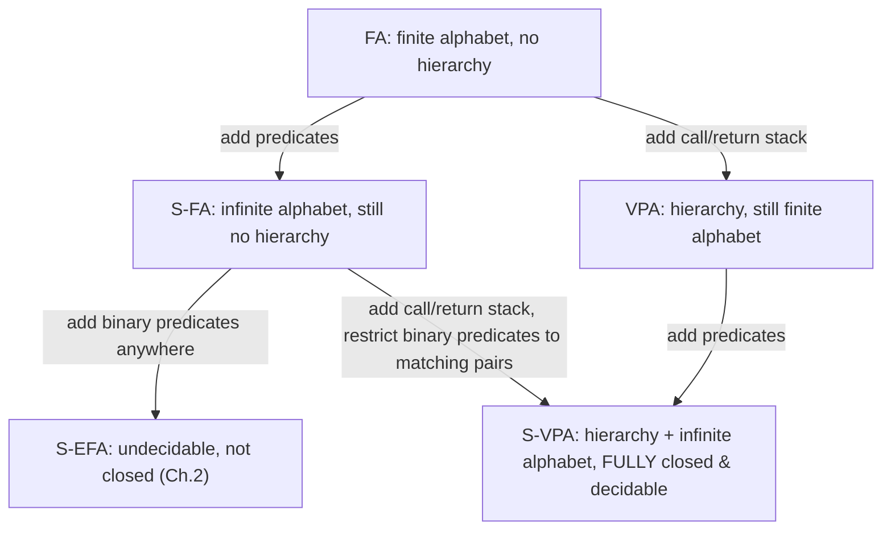

[[book-guidelines|↩ Back to guidelines]]

# Symbolic Visibly Pushdown Automata for Hierarchical Data

## The problem: infinite alphabets and hierarchy, together

Every model so far in the thesis has picked one axis to generalize. Chapter 2's S-EFAs (see [[String-Coder-Verification-with-BEX]]) push on multi-symbol look-ahead over a symbolic alphabet, and pay for it in undecidability. Chapter 3's S-TTRs push on tree shape. This chapter asks a third, independent question: what about **hierarchical but linear** data — a document (XML, JSON, a program execution trace) where positions have matching *open/close* pairs, but you still process it left-to-right as a single sequence, not as a pre-built tree? And crucially: what if the *content* at those positions ranges over an infinite domain?

**The motivating chain of examples (§4.2) is worth reconstructing in full, because each step isolates exactly one limitation:**

1. A boolean global variable `x` that must stay `true` throughout execution — a **finite automaton (FA)** suffices, since the alphabet is `{true, false}`.
2. `x` is an unbounded integer, and the property is "$x$ stays even" ($\varphi_{ev}$). No FA can express this — the alphabet is infinite. Predicate abstraction (map the alphabet down to `{even(x), ¬even(x)}`) works but forces you to *commit to an abstraction a priori*, and changes what alphabet you're even reasoning over. **Symbolic Finite Automata (S-FAs)** — predicate-labeled transitions over a decidable theory, from Chapter 1's foundations (see [[Symbolic-Automata-and-Transducers-over-Infinite-Alphabets]]) — solve this cleanly: one state, a self-loop guarded by `even(x)`, and crucially, S-FAs *compose*: intersecting the "even" automaton with a "positive" automaton just conjoins the guards.
3. Now add **call/return structure**: `x` is boolean, and property $\varphi_=$ says "whenever procedure `q` is called, `x` at the call equals `x` at the matching return." No FA or S-FA can express this — neither model has any notion of *which* call a given return matches, so there's no way to "remember" a value from far earlier in the input and compare it only against its specific partner. **Visibly Pushdown Automata (VPAs)** fix this by pushing the relevant value onto a stack at the call and popping it at the matching return — and, remarkably, VPAs still enjoy full Boolean closure and decidable equivalence (unlike general pushdown automata), because *calls and returns are visible in the input itself* — you always know from the current symbol alone whether you're pushing or popping, so the stack discipline can't get confused across different runs the way it can for context-free languages in general.
4. Finally, combine 2 and 3: `x` is an unbounded integer, and $\psi_<$ says "whenever `q` is called, `x` at the call is *less than* `x` at the matching return." **No existing model handles this** — VPAs have the call/return stack discipline but only finite alphabets; S-FAs have infinite-alphabet predicates but no stack. This is exactly the gap **S-VPAs** are built to fill.

**What breaks without a dedicated hierarchical model.** You could try to force this into Chapter 2's S-EFA machinery by treating "the value at the call" and "the value at the return" as two positions an S-EFA's binary predicate could relate — but §2.4 already proved that letting binary predicates relate *arbitrary* positions destroys closure and decidability (domain intersection becomes undecidable, equivalence becomes undecidable). The thesis's Table 4.1 lays the landscape out precisely:

| Model | Boolean closure / determinizable / decidable equiv. | Hierarchical | Infinite alphabets | Binary predicates |
|---|---|---|---|---|
| FA | ✓ | ✗ | ✗ | — |
| S-FA | ✓ | ✗ | ✓ | — |
| S-EFA | ✗ | ✗ | ✓ | adjacent positions |
| VPA | ✓ | ✓ | ✗ | — |
| **S-VPA** | **✓** | **✓** | **✓** | **calls/returns only** |

The headline surprise of the chapter: S-VPAs add binary predicates *and keep every good property* — something S-EFAs conspicuously could not do. The reason is the restriction's *shape*, covered below.

## Nested words: the data structure

A **nested word** encodes linear-plus-hierarchical structure directly in a tagged alphabet: given symbols $\Sigma$, the tagged alphabet $\hat\Sigma$ contains $a$ (internal), $\langle a$ (call/open), and $a \rangle$ (return/close), for each $a \in \Sigma$. Reading a nested word left to right, the call and return tags induce a **matching relation** between positions — exactly the open/close pairing you'd expect from XML tags or a program's call/return trace. Nested words strictly generalize both plain strings (no calls/returns) and ordered trees (a pre-order traversal with explicit open/close markers) — which is why the same formalism can validate XML documents *and* monitor recursive function calls.

```rust
// A nested word as a linear stream is exactly what a SAX-style XML parser
// or a program instrumentation trace already produces — that's the point:
// S-VPAs process this stream in one pass, no pre-built tree needed.
enum NestedSymbol<T> {
    Internal(T),
    Call(T),   // <a  — push
    Return(T), // a>  — pop, matched against the corresponding Call
}
```

## The model: predicates, plus a binary predicate exactly at matching call/return pairs

**Definition 4.1 (S-VPA).** A tuple $A = (Q, Q_0, P, \delta_i, \delta_c, \delta_r, \delta_b, F)$:

- $\delta_i \subseteq Q \times P_x(\Psi) \times Q$ — **internal** transitions, guarded by a *unary* predicate over the symbol read.
- $\delta_c \subseteq Q \times P_x(\Psi) \times Q \times P$ — **call** transitions: guarded unary predicate, and on firing, pushes a stack symbol $p \in P$ *paired with the actual input value read* onto the stack.
- $\delta_r \subseteq Q \times P_{x,y}(\Psi) \times P \times Q$ — **return** transitions: guarded by a **binary** predicate $\varphi(x,y)$ relating $x$ (the value stored at the matching call) and $y$ (the value being read at this return) — and only fires if the stack's top symbol matches the expected $p$.
- $\delta_b$ — **empty-stack return** transitions, handling an unmatched return (a close tag with no corresponding open).

This is the entire novelty, precisely stated: **the only place a binary predicate is ever allowed to appear is a return transition, relating the current value to the value recorded at its own matching call.** Not to any other position in the input, not to an arbitrary earlier value — only to the one value the stack discipline itself guarantees is "in scope." Determinism (Definition 4.2) is the expected condition — no two transitions from the same state with satisfiable overlapping guards may disagree on where they go (and, for calls, on what they push).

**Worked example.** The property $\psi_<$ from the motivation — "$x$ at call is less than $x$ at the matching return" — is now just: on a call, push the value of $x$; on the matching return, fire only if `IsSat(c < r)` where $c$ is the pushed value and $r$ the current one. Concretely, Figure 4.1's example S-VPA nests this with an additional internal-position constraint (`x > 5` partway through), showing internal, call, and return guards composing naturally in one small automaton.

## Why the restriction preserves everything

The chapter's central claim is that this specific restriction — binary predicates *only* at matching call/return pairs, never between arbitrary positions — is what makes the difference between S-EFA's collapse and S-VPA's success. The structural reason: **a binary predicate at a return is always evaluated against a value that the visibly-pushdown discipline has already uniquely identified** (the one on top of the stack, pushed by the matching call). There's no analogue of S-EFA's problem — where a $k$-symbol-lookahead guard could, in principle, need to relate values whose *positions relative to each other are unbounded* (recall Theorem 2.15: no fixed look-ahead window suffices for a relation over arbitrarily-separated positions). Here, the stack *is* the unbounded-distance bookkeeping mechanism, already solved by VPAs for the finite-alphabet case; S-VPAs only had to make what already sits on the stack participate symbolically in a predicate, not invent a new way to reach across arbitrary distances.

### Determinization via state-pair summaries — and why a plain subset construction isn't enough

**Theorem 4.5.** Every S-VPA has an equivalent deterministic S-VPA.

A naive subset construction (à la NFA→DFA) tracks "the set of states $A$ could currently be in." That's insufficient here for a specific reason: **at a return, which transition is enabled depends on the state $A$ was in *at the matching call* — not just on $A$'s current state set.** If the determinized automaton only tracked "current possible states," it would have thrown away exactly the information needed to know which call-time predicate to intersect against the return-time predicate.

The fix: track **pairs** of states $(q, q')$ — "some run started this well-matched sub-word in state $q$ and reaches state $q'$ by its end" — and **postpone** the effect of a call transition. At a call, the determinized automaton doesn't yet decide anything about the call's own outgoing edge; instead it pushes *the current subset-of-pairs summary, together with the minterm containing the call symbol* onto the stack, and defers simulating that call transition's effect until the matching return is actually reached — at which point it can finally intersect the call-time unary guard, the return-time binary guard, and the accumulated internal summary all together. This is exactly why "just do subset construction over states" fails and "subset construction over reachability *summaries*, deferred through the stack" succeeds — the stack becomes the mechanism that carries not just a *value* (as in the object-level S-VPA) but a *piece of the determinization's own bookkeeping* across the call/return gap.

**Minterms make this concrete construction finite.** Since guards range over a possibly-infinite alphabet, the construction can't enumerate concrete symbols — instead it computes finitely many **minterms** (see [[Symbolic-Automata-and-Transducers-over-Infinite-Alphabets]] for the general concept), separately for unary guards ($\mathrm{Mt}^1_A$) and — a genuine extension needed here — for **binary** guards ($\mathrm{Mt}^2_A$), since return transitions need equivalence classes of *pairs* of values, not single values. Two nested words are indistinguishable to $A$ exactly when their internal/call symbols fall in the same unary minterms and their call/return *pairs* fall in the same binary minterm — this is the formal statement of "only finitely many predicates are ever interesting," now doubled to handle the binary case.

```lean
-- The state-pair summary is the crux: a determinized S-VPA's "state" at any
-- point isn't a set of automaton states, it's a set of (start, end) pairs
-- describing what a well-matched sub-run could have done — precisely the
-- information a call needs to defer and a return needs to resolve.
structure Summary (Q : Type) where
  pairs : Set (Q × Q)

-- Pushed at a call: not a raw value, but the summary-so-far plus which
-- unary minterm classified the call symbol.
structure StackEntry (Q Minterm : Type) where
  summaryBeforeCall : Summary Q
  callMinterm : Minterm
```

Complexity, spelled out precisely in the proof: with $n$ states, $m$ stack symbols, and $p$ predicates of size at most $\ell$, minterm computation costs $O(2^p f(\ell p))$ (for solver cost $f$), and the resulting deterministic automaton has $O(2^{n^2})$ states and $O(2^p 2^{n^2})$ stack symbols — a real cost, but a *bounded, decidable* one, which is the entire point.

### Boolean closure, completeness, emptiness, equivalence

- **Completeness** (Theorem 4.6): add a sink state absorbing every guard-gap, mechanically — the standard move once determinism is available.
- **Boolean closure** (Theorem 4.7): complement via determinize + complete + flip final states (the classical recipe, now available because determinization succeeded); intersection via a product construction. Both are only possible *because* Theorem 4.5 went through — this is the direct payoff of the harder determinization proof.
- **Decidable emptiness** (Theorem 4.8): computed via three composed reachability relations — $R_{wm}$ (well-matched sub-words, built by matching a call's unary guard against a return's binary guard through a satisfiability check, then closing under internal transitions and transitivity), $R_c$ (allowing unmatched calls), and $R_r$ (allowing unmatched returns) — combined into a full reachability relation $R$; $A$ is empty iff $(Q_0 \times Q_F) \cap R = \emptyset$. This is a symbolic adaptation of the standard pushdown-automaton emptiness algorithm, with `IsSat` calls replacing table lookups wherever a guard needs checking.
- **Decidable equivalence** (Corollary 4.9): falls straight out of closure (complement + intersect to test symmetric difference) plus decidable emptiness (test the symmetric difference for emptiness) — the same two-step recipe used throughout the thesis wherever closure and emptiness are both available.

## What S-VPAs still cannot express

The chapter is explicit about the boundary: because a binary predicate can only relate a return to *its own matching call*, S-VPAs **cannot express whole-execution properties that relate arbitrary pairs of positions** — e.g., "the value of $x$ increases monotonically throughout the entire computation" is *not* expressible, since that constraint isn't anchored to any single call/return pair; it spans the whole trace. This is the direct flip side of why the restriction preserves decidability: the same narrowness that keeps binary predicates decidable also caps what kind of property a single S-VPA can state. In practice, this means S-VPAs are naturally suited to **pre/post-condition style properties of individual calls** (property 3 in the Fibonacci monitor example: "the output of `Fib` is $\ge$ its input"), not to properties that need to compare the state of the world at two unrelated points in time.

## Applications

- **XML validation** (§4.5.1): an XML Schema restricting leaf content to a regular expression (e.g. names matching `[A-Z][a-z]*`) is directly an S-VPA over the theory of strings — the automaton's *states* capture tree-shape constraints (which tag can nest inside which), while *predicates* capture leaf-content constraints, a clean separation the thesis credits with making the model both succinct and naturally aligned with how a streaming (SAX-style) XML parser already emits events.
- **HTML filtering / XSS defense** (§4.5.2): rather than writing one monolithic "is this document safe" automaton, build two independent automata — one that simply rejects `<script>` nodes, another that rejects `` tags with JavaScript-laced attributes — complement the second, and **intersect** the two into a single filter, then determinize for a single left-to-right executable pass. This modularity (specify what's *unsafe* separately from what's *well-formed*, then combine) is a direct exploitation of Boolean closure, and is precisely the same design pattern BEX's Base64 verification and FAST's sanitizer composition both lean on elsewhere in the thesis. The chapter also notes a genuinely useful trick: a single S-VPA can simultaneously check *well-formedness* (every open tag is closed by the same tag) via a binary equality predicate at returns, avoiding a separate well-formedness pre-pass that would otherwise force multiple traversals of performance-critical input.
- **Runtime program monitoring** (§4.5.3): treating a recursive function's calls and returns as a nested word over its argument/return-value domain turns properties like "output $\ge$ input" or "a negative output implies the function was called exactly once, with a negative input" into ordinary S-VPA membership checks — intersecting several such property-automata yields one combined, single-pass, linear-time monitor.

## Where this leads



S-VPAs complete the thesis's second axis of generalization (after S-EFTs' look-ahead axis): where Chapter 2 shows that unrestricted binary predicates destroy decidability for *strings*, this chapter shows the same feature is perfectly safe once confined to the *hierarchical* structure a visibly-pushdown discipline already provides — the restriction that saves the day isn't "fewer binary predicates," it's "binary predicates exactly where the automaton already has a canonical, unambiguous partner position to relate to." Chapter 5's [[Streaming-Tree-Transducers|streaming tree transducers]] pick up this same nested-word representation directly (a streaming tree transducer processes a tree exactly as a nested word, with holes generalizing the "postponed decision" idea this chapter's determinization introduced for the stack), making S-VPAs simultaneously an applications chapter in their own right and a structural rehearsal for the thesis's final, most ambitious model.

For `static-analysis` and `sat-smt-csp`: the determinization proof's "defer a decision by storing a summary on the stack, resolve it later against a satisfiability check" is a close analogue of how a CEGAR loop defers committing to an abstraction until a concrete counterexample check forces a refinement — both defer symbolic commitment until enough context is available to resolve it soundly. And the boundary result — S-VPAs *cannot* express whole-execution relational properties — is a good concrete data point for calibrating what your own Hoare-contract / Horn-clause invariant generator can express with a single-pass, stack-based analysis versus when it genuinely needs a more global (e.g. fixed-point / abstract-interpretation) pass instead.
