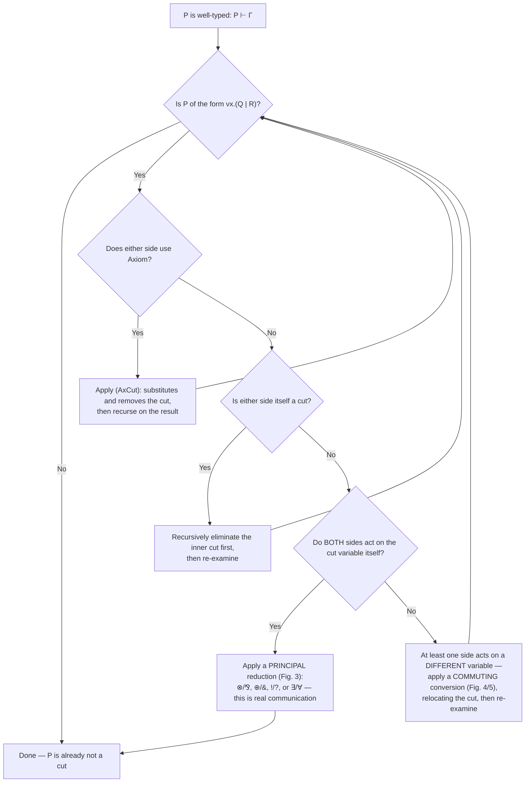

[[book-guidelines|↩ Back to guidelines]]

## The gap the principal reductions leave open

The companion articles on [[CP-a-Classical-Linear-Logic-Process-Calculus|CP]]'s connectives each gave you a *principal* cut reduction: cut a process built with $\otimes$ against a process built with $\parr$ on the very same channel, and you get communication ($\beta_{\otimes\parr}$); cut $\oplus$ against $\&$ and you get a selection ($\beta_{\oplus\&}$); and so on for $!/?$ and $\exists/\forall$. Each of these rules fires under one precondition: **both sides of the cut end in a rule whose conclusion is the cut variable itself.** The cut variable $x$ is exactly the thing each side just finished constructing.

But that precondition doesn't always hold. Consider a process like

$$
\nu z.\big(x[y].(P \mid Q) \;\big|\; R\big) \;\vdash\; \Gamma,\Delta,\Theta,x:A\otimes B
$$

where the cut is on $z$, not on $x$. The left side of the cut, $x[y].(P\mid Q)$, is built with $\otimes$ — but its *conclusion type is $A\otimes B$ on channel $x$*, while the cut itself pairs $z:C$ against $z:C^\perp$. The $\otimes$ rule here is a bystander: it's sitting in the derivation, but it isn't the connective the cut is actually eliminating. None of the principal reductions apply, because none of them were written for this shape.

If cut elimination stopped here, it would be incomplete — there would be well-typed processes containing a cut that no rule knows how to simplify. **Commuting conversions** are what plug this gap. A commuting conversion doesn't eliminate a cut; it *relocates* it, pushing it past the bystander rule and into whichever premise actually produced the cut variable. Do this enough times and eventually the cut variable's *real* producer meets the cut, at which point a principal reduction (or the axiom reduction) can fire. Commuting conversions are the plumbing that guarantees a principal reduction is always eventually reachable — without them, cut elimination is a partial function; with them, it's total.

This is the same problem that shows up in ordinary sequent calculus (where it's the original source of the term "commuting conversion") and, if you've seen a big-step vs. small-step evaluator for a language with `let`, it should feel structurally familiar: a `let`-bound computation sitting "in front of" a redex needs to be threaded through before the redex can fire.

## Two examples worth understanding in full

### Pushing a cut into a branch of $\otimes$ ($\kappa_{\otimes 1}$ and $\kappa_{\otimes 2}$)

Take the situation above concretely. Before conversion:

$$
\dfrac{\dfrac{P \vdash \Gamma,y{:}A,z{:}C \quad Q \vdash \Delta,x{:}B}{x[y].(P\mid Q) \vdash \Gamma,\Delta,x{:}A\otimes B,z{:}C}\ \otimes \qquad R \vdash \Theta,z{:}C^\perp}{\nu z.\big(x[y].(P\mid Q)\mid R\big) \vdash \Gamma,\Delta,\Theta,x{:}A\otimes B}\ \mathsf{Cut}
$$

The cut variable is $z$, and $z$ occurs free in $P$ (via $\Gamma,z{:}C$), not in $Q$. So the conversion $\kappa_{\otimes 1}$ pushes the cut into the $P$ branch specifically — $Q$ is untouched, since it has nothing to do with $z$:

$$
\dfrac{\dfrac{P \vdash \Gamma,y{:}A,z{:}C \quad R \vdash \Theta,z{:}C^\perp}{\nu z.(P\mid R) \vdash \Gamma,\Theta,y{:}A}\ \mathsf{Cut} \qquad Q \vdash \Delta,x{:}B}{x[y].\big(\nu z.(P\mid R)\mid Q\big) \vdash \Gamma,\Theta,\Delta,x{:}A\otimes B}\ \otimes
$$

Notice what happened structurally: the outer shape of the process — "output $y$ on $x$, then run two things in parallel" — is *preserved*. All that moved is which of the two parallel branches carries the leftover cut with $R$. If instead $z$ had occurred in $Q$'s environment, the symmetric conversion $\kappa_{\otimes 2}$ would push the cut into the $Q$ branch instead. Either way, the cut has moved one level closer to whatever rule really produces $z$, and the process's overall computational shape hasn't changed at all — only its typing derivation has been reshuffled.

**Rust framing.** This is exactly the kind of transformation a compiler does when it commutes a `let` binding inward past a constructor that doesn't mention the bound variable:

```rust
// before: outer let binds a temporary that only one branch needs
let tmp = expensive_setup();
Pair(consume_a(tmp), consume_b())   // tmp only flows into consume_a

// after: push the let into the branch that actually uses it
Pair(
    { let tmp = expensive_setup(); consume_a(tmp) },
    consume_b()
)
```

Nothing about *what* the program computes changed — you've just relocated a binding to make its scope tighter around its real use site. $\kappa_{\otimes 1}$/$\kappa_{\otimes 2}$ do the process-calculus version of this move, and the "cut variable" plays the role of `tmp`.

### Pushing a cut inside an input ($\kappa_\parr$) — the case the paper singles out

This one deserves special attention because Wadler explicitly stops to justify it. Before conversion:

$$
\dfrac{\dfrac{P \vdash \Gamma,y{:}A,x{:}B,z{:}C}{x(y).P \vdash \Gamma,x{:}A\parr B,z{:}C}\ \parr \qquad Q \vdash \Delta,z{:}C^\perp}{\nu z.\big(x(y).P \mid Q\big) \vdash \Gamma,\Delta,x{:}A\parr B}\ \mathsf{Cut}
$$

After:

$$
\dfrac{\dfrac{P \vdash \Gamma,y{:}A,x{:}B,z{:}C \qquad Q \vdash \Delta,z{:}C^\perp}{\nu z.(P\mid Q) \vdash \Gamma,\Delta,y{:}A,x{:}B}\ \mathsf{Cut}}{x(y).\nu z.(P\mid Q) \vdash \Gamma,\Delta,x{:}A\parr B}\ \parr
$$

Read as a process rewrite, this is:

$$
\nu z.\big(x(y).P \mid Q\big) \;\Longrightarrow\; x(y).\,\nu z.(P\mid Q)
$$

Here's the subtlety. **On the left-hand side**, $Q$ sits directly under the restriction $\nu z$, in parallel with $x(y).P$ — it's free to fire independently, communicating with the outside world along any channel in $\Delta$ the moment it's able to. **On the right-hand side**, $Q$ has been dragged *inside* the input prefix $x(y)$. It's now *guarded*: it cannot run at all until something sends a value along $x$ and the input fires. If you think of guardedness the way you'd think of code inside a closure that only runs when called, this looks like it should change behavior — you've apparently blocked $Q$ from proceeding until an unrelated event (input on $x$) happens.

Wadler's answer is that this is harmless in CP specifically, and the argument has two cases depending on what's on the other end of $x$:

- **If $x$ is itself bound by some outer cut**, then by construction there is guaranteed to be a matching output on $x$ waiting on the other side of that cut. The input on $x$ is not an arbitrary event Q must wait for — it's an event CP's own typing discipline guarantees *will* happen. So gating $Q$ behind it doesn't strand $Q$ forever; it just delays it by exactly one communication step, which is invisible to any external observer.
- **If $x$ is a free/external channel** (not bound by an outer cut), then the *whole process* — not just $Q$ — is already "halted," in the sense that it's waiting on external interaction along $x$. In that situation it makes no operational difference whether $Q$ is nominally guarded behind that same wait or not, because nothing in the process can make progress until the external communication on $x$ arrives anyway. (Wadler notes this matches how Caires and Pfenning handle the same situation using labeled transitions instead of a purely internal reduction relation.)

So the conversion is sound precisely *because* of a property CP enforces globally: every input a process is blocked on is either dischargeable by an internal cut (in which case it *will* resolve) or is genuinely external (in which case the whole process is stuck on it regardless of where $Q$ sits). There's no third case where $Q$ silently loses the ability to make progress it would otherwise have had.

**Rust framing.** The shape of "drag a computation inside something gated on a channel receive" is precisely what you get pushing work inside an `mpsc::Receiver::recv()` continuation:

```rust
// before: rx_handling and other_work run concurrently
let handle = thread::spawn(move || {
    let msg = rx.recv().unwrap();
    handle_message(msg)
});
other_work();

// after: other_work is now sequenced behind the recv
let handle = thread::spawn(move || {
    let msg = rx.recv().unwrap();
    let r = handle_message(msg);
    other_work();
    r
});
```

This transformation is only safe in general if `other_work` doesn't need to run *before* the message arrives, or if you don't care about the reordering — exactly analogous to CP's argument: it's safe here because CP's typing discipline guarantees the receive will eventually unblock (or the whole task was already blocked on external input regardless).

## The rest of the conversions, briefly

Every remaining connective gets essentially one conversion (pushing a cut on a non-conclusion variable into its single premise), with two exceptions matching the two exceptions you'd expect from the earlier connective articles:

| Connective | Conversion | Shape |
|---|---|---|
| $\otimes$ | $\kappa_{\otimes 1}, \kappa_{\otimes 2}$ | **two** conversions — one per branch (shown above) |
| $\parr$ | $\kappa_\parr$ | push into the single premise, inside the input (shown above) |
| $\&$ | $\kappa_\&$ | push into **both** branches at once (case-splits, so the cut is duplicated into each branch) |
| $\oplus$ | $\kappa_{\oplus}$ | **two** conversions (left/right injection), only left shown, right symmetric |
| $!$ | $\kappa_!$ | push into the server body |
| $?$ | $\kappa_?$ | push into the client body |
| $\exists$ | $\kappa_\exists$ | push into the premise (which has $B\{A/X\}$ substituted in) |
| $\forall$ | $\kappa_\forall$ | push into the premise (which binds a fresh type variable $X$) |
| $\bot$ | $\kappa_\bot$ | push into the (empty-input) premise |
| $\top$ | $\kappa_\top$ | no premise to push into — the choice is vacuous, so the whole cut just collapses to $x.\mathsf{case}()$ |
| $1$ | — | **no conversion** — $1$ has no premise at all ($x[\,].0$ is a leaf) |
| $0$ | — | **no conversion** — mirrors the fact that $0$ has no introduction rule in the first place |

The pattern: a conversion exists exactly where the connective's rule *has* a premise process for the cut to be pushed into. $1$ is a dead end ($x[\,].0$) and $0$ has no rule at all, so both are conversion-free for the same reason they were reduction-free in the principal-cut story.

One piece of bookkeeping threads through all of this silently: the **anti-Barendregt convention**. When a conversion (or a principal reduction) needs to line up a bound name from one side of a cut with a bound name from the other, CP's convention is to *deliberately* choose the same bound name on both sides rather than freshening them apart (the opposite of the usual "Barendregt convention" of always renaming bound variables to avoid collisions). This is what lets rules like $\kappa_\parr$ write "$y$" once and have it mean the same thing in both premise and conclusion, without a separate renaming step cluttering every rule statement.

## Cut elimination: the theorem that makes all of this add up to something

Commuting conversions and principal reductions are individually just rewrite rules. The point of collecting them together is to prove two theorems about *all processes*, not just the ones that happen to match a specific rule shape.

First, two closure rules are added on top of everything from the reduction figures: reduction is closed under the *structural equivalences* (if $P\equiv Q$, $Q\Longrightarrow R$, and $R\equiv S$, then $P\Longrightarrow S$), and reduction is a **congruence with respect to Cut**:

$$
\dfrac{P_1\Longrightarrow P_2}{\nu x.(P_1\mid Q)\Longrightarrow \nu x.(P_2\mid Q)}
\qquad\qquad
\dfrac{Q_1\Longrightarrow Q_2}{\nu x.(P\mid Q_1)\Longrightarrow \nu x.(P\mid Q_2)}
$$

Deliberately, **no other congruence rules are added** — there is no rule letting you reduce underneath an input prefix, a server, or any other binder. This is the process-calculus analogue of a $\lambda$-calculus evaluator that refuses to reduce under a $\lambda$: CP's notion of "computation" is cut elimination, and a redex that isn't a cut (or under one) simply isn't something the calculus considers itself obligated to simplify.

**Theorem 1 (Subject reduction / type preservation).** If $P\vdash\Gamma$ and $P\Longrightarrow Q$, then $Q\vdash\Gamma$. Every reduction rule in Figures 2–5 was constructed to preserve the typing judgment by inspection, so this is essentially "read the figures."

**Theorem 2 (Top-level cut elimination / progress).** If $P\vdash\Gamma$, there exists $Q$ such that $P\Longrightarrow Q$ and $Q$ is *not itself a cut* (recall: a process is "a cut" if it has the shape $\nu x.(Q\mid R)$). The proof is a case split on the structure of $P$:



Every branch either finishes (the process is no longer a cut) or strictly shrinks/relocates the problem, so the process eventually terminates at a non-cut. The one wrinkle: because CP supports **impredicative polymorphism** — a $\forall X.B$ can be instantiated with a type that is *itself* polymorphic — some care is needed in how the induction is formulated to guarantee it actually terminates (Wadler cites this as standard, following Gallier 1990, rather than novel to this paper).

This result is CP's version of the classical **Cut Elimination Theorem** (specifically, what Girard, Lafont, and Taylor call the *Principal Lemma of Cut Elimination*, which eliminates one "final" cut, possibly leaving smaller cuts behind for the induction to continue on) — reworked so that "eliminating a cut" is read as *executing a communication step* rather than *shortening a proof*.

## Why this is exactly "deadlock freedom"

Put the two theorems together and you get the whole payoff. **Preservation** (Theorem 1) says reduction never produces an ill-typed process — the session-typing discipline is an invariant of execution. **Progress** (Theorem 2) says that *as long as a process contains a cut*, it can always take a further step — a cut, remember, is exactly where two processes are connected on a shared internal channel with no way for the environment to observe that channel. So "stuck with an unremovable cut" — two internal processes deadlocked, each waiting on the other along a channel nothing else can touch — is precisely the state Theorem 2 proves *cannot happen*. A CP process only ever "stops" reducing when it has no cuts left, i.e., when whatever remains is entirely waiting on **external** communication — which is not deadlock, it's just I/O.

This is a direct structural echo of **progress + preservation = type safety** for a sequential language: preservation keeps you inside the well-typed processes, progress guarantees every well-typed non-final term can step. The difference is what "final" and "step" mean: here, "final" is "contains no cut" (waiting on the outside world) rather than "is a value," and "step" is a communication, not a $\beta$-reduction. If you've written a preservation/progress pair in Lean for a small-step operational semantics, Theorem 1 and Theorem 2 are literally that pair, specialized to a calculus where "well-typed" means "session-typed process" and "stuck" is redefined to mean "genuinely waiting on the outside," not "broken."

$$
\underbrace{P \vdash \Gamma \;\wedge\; P \Longrightarrow Q \;\Rightarrow\; Q\vdash\Gamma}_{\textbf{Preservation (Thm 1)}} \qquad\qquad \underbrace{P \vdash \Gamma \;\Rightarrow\; \exists Q.\ P\Longrightarrow Q \wedge Q \text{ is not a cut}}_{\textbf{Progress (Thm 2)}}
$$

## Where this leads

This pair of theorems is the article that everything else in the CP story cashes out through. The connective-specific principal reductions (output/input, selection/choice, servers/clients, polymorphism) are the *content* of communication; commuting conversions are the *plumbing* that guarantees you always eventually reach that content; and Theorem 2 is the formal statement that ties the two together into "well-typed CP processes never deadlock." Later in the paper, when [[GV-a-Session-Typed-Functional-Language|GV]] (the functional session-typed language) is translated into CP and shown to preserve types, deadlock-freedom for GV programs is obtained *entirely* by inheriting Theorem 2 through that translation — no separate deadlock argument is given, or needed, for GV itself.

This is the single most load-bearing result in the paper for anyone building a verifier: it is the shape of soundness proof you want for any linearly-typed system with a resource-discharge obligation — the same skeleton (preservation keeps you well-typed, progress rules out "stuck-but-not-done") is what you'd reach for to prove a Hoare-logic proof system sound against an operational semantics, or to prove a linear-resource type system in Rust-verifier style never leaves a resource half-consumed. The one thing worth carrying forward explicitly: Theorem 2's proof is a case split on *which rule the cut interacts with*, not on the term's syntax in the abstract — that's the general recipe for writing a progress proof over any inductively-defined typing judgment with an explicit "cut"/elimination rule in it.
