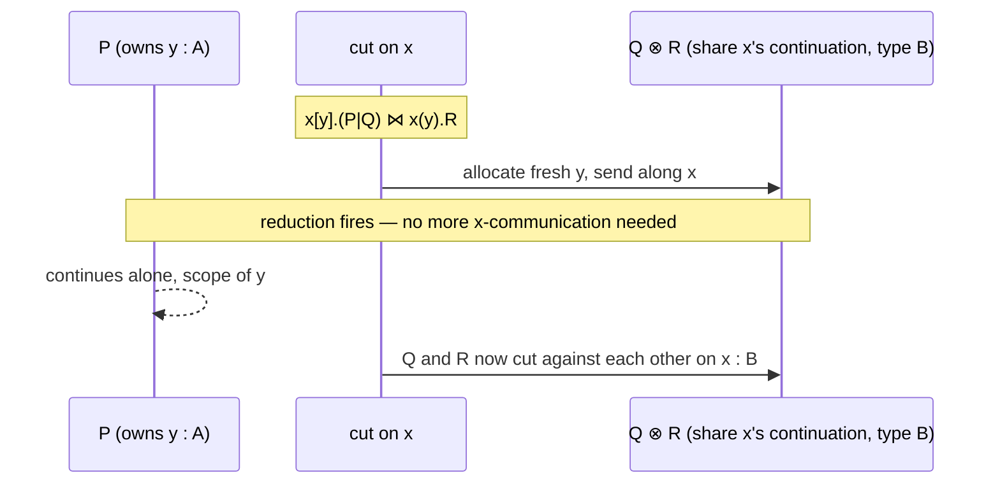

[[book-guidelines|↩ Back to guidelines]]

# Output and Input via the Multiplicatives

CP gives you a grammar of propositions, an Axiom, and a Cut — but so far that's just plumbing: names forwarded, processes glued together. Nothing has actually been *communicated*. The multiplicatives, $\otimes$ ("times") and $\parr$ ("par"), are where CP starts moving data. They are dual: $A\otimes B$ is a channel that **outputs** an $A$ and then behaves as $B$; $A \parr B$ is a channel that **inputs** an $A$ and then behaves as $B$.

## What problem this solves

Think about what a "channel" needs to support before you can build anything real on top of it: at minimum, sending a value and receiving a value. But in a *session*-typed setting, sending isn't just "push a value into a queue" — the type of the channel has to change afterward, because the protocol has moved on to its next phase. $\otimes$ and $\parr$ are the rules that make that state transition precise: they say not just "what gets sent" but "what the channel becomes next."

The genuinely interesting design decision is *what gets sent*. CP doesn't send raw values — it sends **channel names**. Sending value $A$ along $x$ is modeled as: allocate a brand new channel $y$ of type $A$, and send the *name* $y$ along $x$. The receiver gets a handle to a fresh channel that itself carries the $A$-shaped protocol. This is the same trick $\pi$-calculus uses (mobility — channels as first-class, transmittable values), specialized so that it respects linearity.

## The output rule

$$
\frac{P \vdash \Gamma, y:A \qquad Q \vdash \Delta, x:B}{x[y].(P \mid Q) \vdash \Gamma, \Delta, x : A\otimes B} \;\otimes
$$

Read bottom-up: to build a process of type $A \otimes B$ on channel $x$, you need **two independent processes**: $P$, which owns a fresh channel $y$ of type $A$, and $Q$, which owns $x$ at the *continuation* type $B$. The composite process $x[y].(P \mid Q)$:

1. allocates a fresh channel name $y$,
2. transmits $y$ along $x$,
3. and then runs $P$ and $Q$ **concurrently**, on **disjoint** channel sets ($\Gamma$ and $\Delta$ share no names).

That disjointness is not a bookkeeping nicety — it's the entire safety argument. $P$ and $Q$ can never touch each other's channels, so once $y$ is handed off, there is no way for $P$ (which owns $y$) and $Q$ (which continues on $x$) to race on it or deadlock waiting on each other. The paper states this directly: *"Disjointness of $P$ and $Q$ ensures there is no further entangling between $x$ and $y$, which guarantees freedom from races and deadlock."*

**What breaks without it.** Imagine relaxing the rule so $\Gamma$ and $\Delta$ could overlap — say both $P$ and $Q$ are allowed to use some channel $z$. Now $P$ might block waiting for a message on $z$ that only $Q$ can produce, while $Q$ is itself blocked on something $P$ was supposed to send first. That's a deadlock, and it's exactly the shape of bug linear typing is designed to make unrepresentable. The $\otimes$ rule's environment split is doing the same job a borrow checker does when it refuses to let two closures both capture the same `&mut` reference.

### Rust grounding: ownership as the enforcement mechanism

This is precisely the shape of Rust's ownership discipline. Sending a channel endpoint *through* another channel — an owned, non-`Clone` value — statically guarantees the old owner can no longer touch it:

```rust
use std::sync::mpsc::{channel, Sender, Receiver};

// x : A ⊗ B is modeled as: send a *fresh* channel endpoint (type A),
// then continue behaving as B on the outer channel.
fn output_example(x: Sender<Receiver<i32>>) {
    let (y_tx, y_rx) = channel::<i32>();   // allocate fresh channel y : A
    x.send(y_rx).unwrap();                  // transmit y along x — ownership moves
    // From this point P and Q run on *disjoint* resources:
    std::thread::spawn(move || {
        // Q: continues on x's "rest of the protocol" (type B) — never touches y_tx
        // ... behave as B ...
    });
    // P: owns y_tx here, sends into the fresh channel — never touches x again
    y_tx.send(42).unwrap();
}
```

`y_rx.send(...)` moving into the closure and `y_tx` staying in the outer scope aren't just two halves of a value — the compiler statically forbids either side from reaching across into the other's resources. That's `Γ, Δ` disjointness enforced for free by `move` closures and ownership, not by convention. The real-world Rust crate [`session_types`](https://github.com/Munksgaard/session-types) (following Pucella and Tov) reifies exactly this idea as a type-level protocol: `Send<T, P>` is a channel that sends a `T` and continues as protocol `P` — a direct, practical incarnation of $\otimes$.

## The input rule

$$
\frac{R \vdash \Theta, y:A, x:B}{x(y).R \vdash \Theta, x : A \parr B} \; \parr
$$

Here's the asymmetry that makes $\parr$ interesting: on the *input* side, there is only **one** process, $R$, and it's allowed to mention **both** $y$ and $x$ freely. Compare to $\otimes$, where $y$ and $x$ were forced into disjoint processes $P$ and $Q$.

Why is this safe? Because entangling happens on the *output* side, not the input side. $x(y).R$ receives a name $y$ along $x$ and then runs $R$, which is free to use $y$ and the continuation of $x$ together — but $R$ hasn't *sent* $y$ anywhere yet, so there's no second party for it to race against. The disentangling guarantee lives entirely in the $\otimes$ rule; $\parr$'s job is just to accept whatever fresh name arrives and hand it to a single, uncontested owner. This is the paper's point exactly: *"there is no further entangling of $x$ with $y$ on the output side, explaining the claim that disentangling $x$ from $y$ on output guarantees freedom from races and deadlock."*

Notice also that $x$'s type **changes** between hypothesis and conclusion: $R$ has $x:B$, but the composite process has $x : A \parr B$. This is Caires and Pfenning's central twist (see [[The-Twist-Reinterpreting-the-Linear-Connectives|The Twist]]): the *same* channel name is reused across the rule, with its type evolving to reflect how much of the protocol remains — literally a session type, a channel type that changes as communication proceeds.

```rust
// x : A ⅋ B — a single process receives a fresh endpoint and continues.
fn input_example(x: Receiver<Receiver<i32>>) {
    let y = x.recv().unwrap();   // receive fresh channel y : A along x
    // R is one process, free to use both y and the rest of x's protocol:
    let val = y.recv().unwrap();
    println!("got {val}");
    // ... continue behaving as B using resources from Θ ...
}
```

## The principal reduction: cut meets communication

The whole point of the typing rules is revealed when you cut an $\otimes$ against a $\parr$ — this is where the *logic* becomes *computation*:

$$
\nu x.\big(x[y].(P \mid Q) \;\mid\; x(y).R\big) \;\Longrightarrow\; \nu y.\big(P \mid \nu x.(Q \mid R)\big) \qquad (\beta_{\otimes\parr})
$$

Read the left side operationally: a process offering to output on $x$ is cut against a process waiting to input on $x$. The reduction says: just *do it*. The fresh name $y$ that the output side allocated becomes the binder on the right; $P$ (which owned $y$) is now paired off in its own scope, while $Q$ and $R$ — the two continuations, which both still refer to $x$ — get cut against each other to continue the protocol.

The rule quietly assumes $P$'s bound name and $R$'s received name are literally the same symbol $y$ — this is legal because $\alpha$-renaming lets you always arrange it, and Wadler calls this bookkeeping convention the **anti-Barendregt convention** (the opposite of the usual hygiene convention that keeps bound names *distinct*; here you deliberately make them coincide, because the rule is about identifying the transmitted name with the received name).

**This is not an analogy to communication — it *is* communication.** Recall that $x[y].P$ in CP's notation corresponds to $\nu y.\,x\langle y\rangle.P$ in ordinary $\pi$-calculus notation (allocate $y$, then send it). Under that correspondence, $(\beta_{\otimes\parr})$ is exactly the standard $\pi$-calculus communication rule:

$$
\nu x.\big(\nu y.\,x\langle y\rangle.(P\mid Q) \mid x(z).R\big) \;\Longrightarrow\; \nu y.\,P \mid \nu x.(Q \mid R\{z/y\})
$$

which follows from the primitive step $x\langle y\rangle.P \mid x(z).R \Longrightarrow P \mid R\{z/y\}$ (send-then-receive substitutes the sent name for the received placeholder) plus scope extrusion (since $x \notin \mathsf{fn}(P)$, the restriction on $y$ can float outward past $P$).



**Why the right-hand side is well-defined.** You might reasonably ask: why does the reduction pair $Q$ with $R$ (both leftover continuations) rather than, say, $P$ with $R$? It's forced by typing — $P$'s free names are all in $\Gamma$ (disjoint from $\Delta,\Theta$), so $P$ genuinely has nothing left to say to $R$. And you might separately wonder why the result is written $\nu y.(P \mid \nu x.(Q\mid R))$ rather than $\nu x.(Q \mid \nu y.(P\mid R))$ — but these are provably equivalent processes, via two applications of (Swap) and one of ([[CP-a-Classical-Linear-Logic-Process-Calculus#Structural equivalences: Swap and Assoc|Assoc]]) (the structural equivalences from [[CP-a-Classical-Linear-Logic-Process-Calculus|CP's structural rules]]):

$$
\nu x{:}A.(P \mid \nu y{:}B.(Q\mid R)) \equiv \nu x{:}A.(P \mid \nu y{:}B^\perp.(R\mid Q)) \equiv \nu y{:}B^\perp.(\nu x{:}A.(P\mid R) \mid Q) \equiv \nu y{:}B.(Q \mid \nu x{:}A.(P\mid R))
$$

so either grouping serves equally well as "the" right-hand side — a good early sanity check that CP's structural equivalences aren't decoration, they're load-bearing for even stating the reduction rules unambiguously.

## The asymmetry that isn't: $A\otimes B \cong B\otimes A$

$A\otimes B$ ("output $A$, then behave as $B$") and $B \otimes A$ ("output $B$, then behave as $A$") look like genuinely different protocols — order matters operationally. This can feel unsettling for a connective that's supposed to be commutative in the underlying logic. The resolution is the same one you'd give for Cartesian product: $A\times B \ne B\times A$ as *terms*, but there's a canonical isomorphism between them. CP exhibits this isomorphism as an actual derivable process, built from nothing but two Axioms:

$$
\frac{
  \dfrac{}{w{\leftrightarrow}z \vdash w:B^\perp, z:B}\;\mathsf{Ax}
  \qquad
  \dfrac{}{y{\leftrightarrow}x \vdash y:A^\perp, x:A}\;\mathsf{Ax}
}{
  x[z].(w{\leftrightarrow}z \mid y{\leftrightarrow}x) \vdash w:B^\perp, y:A^\perp, x:B\otimes A
} \;\otimes
$$

wrapped in one more $\parr$ to bind $w$ and $y$ together as the input side, giving a process $\mathsf{flip}_{wx} \vdash w : A^\perp \parr B^\perp,\; x: B\otimes A$. Cut this against any $P \vdash \Gamma, w:A\otimes B$ and you get a process that behaves exactly like $P$, just observed through channel $x$ at the reordered type $B\otimes A$:

$$
\frac{P \vdash \Gamma, w:A\otimes B \qquad \mathsf{flip}_{wx} \vdash w:A^\perp\parr B^\perp,\, x:B\otimes A}{\nu w.(P \mid \mathsf{flip}_{wx}) \vdash \Gamma, x:B\otimes A}\;\mathsf{Cut}
$$

`flip` is literally a [[CP-a-Classical-Linear-Logic-Process-Calculus#Axiom: forwarding|forwarding]] adapter — two links wired through one round of send/receive — the process-calculus analog of a zero-cost tuple-reordering wrapper. In Rust terms this is exactly `fn flip<A, B>(pair: (A, B)) -> (B, A)`, except here the "swap" is a runnable *process*, not a compile-time projection, because in a session-typed world the two fields genuinely arrive at different times.

## The units: $1$ and $\bot$ — protocols that say nothing

$\otimes$ and $\parr$ need identity elements for the cases where a protocol has *nothing left to send* or *nothing left to receive*:

- $1$ is the type of a channel whose only remaining action is an **empty output** — "I'm done sending."
- $\bot$ is the type of a channel whose only remaining action is an **empty input** — "I'm done receiving."
- They're dual: $1^\perp = \bot$.

Their rules (from Fig. 1) are trivial by design:

$$
\frac{}{x[\,].0 \vdash x:1}\;\mathbf{1} \qquad\qquad \frac{P\vdash \Gamma}{x().P \vdash \Gamma, x:\bot}\;\bot
$$

and cutting one against the other is the base case of communication — an empty handshake:

$$
\nu x.(x[\,].0 \mid x().P) \;\Longrightarrow\; P \qquad (\beta_{1\bot})
$$

This is the nilary case of the polyadic $\pi$-calculus communication rule — no payload, just a synchronization signal, after which the $\bot$-side process $P$ simply continues. In the worked example below, $\mathsf{Receipt}^\perp \parr \bot$ (buyer side) closing out against $\mathsf{Receipt}\otimes 1$ (seller side) is exactly this: the seller signals "no more values," and the buyer's `.get-receipt` continuation runs.

## How it actually runs: the buy/sell example

Wadler's running example threads $\otimes/\parr$ (and the unit pair $1/\bot$) through a two-party commerce protocol: a client sends a product name and a credit-card number; a server computes and returns a receipt.

$$
\begin{aligned}
\mathsf{Buy} &\triangleq \mathsf{Name}\otimes\big(\mathsf{Credit}\otimes(\mathsf{Receipt}^\perp \parr \bot)\big) \\
\mathsf{Sell} &\triangleq \mathsf{Name}^\perp\parr\big(\mathsf{Credit}^\perp\parr(\mathsf{Receipt}\otimes 1)\big)
\end{aligned}
$$

Note $\mathsf{Sell} = \mathsf{Buy}^\perp$ exactly, as it must be for the two ends of a channel to be cuttable together. The processes:

$$
\begin{aligned}
\mathsf{buy}_x &\triangleq x[u].\big(\mathsf{put\text{-}name}_u \mid x[v].(\mathsf{put\text{-}credit}_v \mid x(w).x().\mathsf{get\text{-}receipt}_w)\big) \\
\mathsf{sell}_x &\triangleq x(u).x(v).x[w].\big(\mathsf{compute}_{u,v,w} \mid x[\,].0\big)
\end{aligned}
$$

Cutting them together and firing three rounds of $(\beta_{\otimes\parr})$ plus one round of $(\beta_{1\bot})$ collapses the entire protocol scaffold down to the "business logic" underneath:

$$
\nu x.(\mathsf{buy}_x \mid \mathsf{sell}_x) \Longrightarrow \nu u.\big(\mathsf{put\text{-}name}_u \mid \nu v.(\mathsf{put\text{-}credit}_v \mid \nu w.(\mathsf{compute}_{u,v,w} \mid \mathsf{get\text{-}receipt}_w))\big)
$$

Every trace of the *protocol* (the $\otimes/\parr$ scaffolding, the $x$-channel bookkeeping) has vanished — what's left is three fresh channels $u,v,w$ directly wiring `put-name` to `compute`'s first argument, `put-credit` to its second, and `compute`'s result straight to `get-receipt`. This is the promise of [[Commuting-Conversions-and-Cut-Elimination|cut elimination]] made concrete: type-correct communication reduces, deterministically, to exactly the data flow the programmer intended, with the session machinery compiled away.

### Rust sketch: the protocol as types, the reduction as inlining

```rust
// Modeling the session-typed protocol shape (à la the `session_types` crate).
// Buy = !Name.!Credit.?Receipt.end   (three sequential sends/receives)
struct Buy; // phantom protocol marker: Name ⊗ (Credit ⊗ (Receipt⊥ ⅋ 1))

fn buy(name: String, credit: CardNumber, chan: Channel<Buy>) -> Receipt {
    let chan = chan.send(name);        // x[u]. ...
    let chan = chan.send(credit);      // x[v]. ...
    let (receipt, chan) = chan.recv(); // x(w). ...
    chan.close();                      // x(). — the ⊥/1 handshake
    receipt
}

fn sell(chan: Channel<Sell>) {        // Sell = Buy::Dual
    let (name, chan) = chan.recv();
    let (credit, chan) = chan.recv();
    let receipt = compute(name, credit);
    chan.send(receipt).close();
}
```

Just as $(\beta_{\otimes\parr})$ erases the $x$-scaffolding down to direct channels $u,v,w$, an optimizing compiler for a real session-typed language can inline `buy`/`sell` at a known call site and erase the `Channel<Buy>` protocol object entirely, leaving direct data movement — the type-level protocol was scaffolding for the *checker*, not something that has to survive at runtime.

## Where this leads

$\otimes/\parr$ give CP its multiplicative core: sequential, mandatory communication. The next connectives, $\oplus$ and $\&$ (see [[Selection-and-Choice-via-the-Additives|Selection and Choice via the Additives]]), add *branching* — a channel that offers or selects among alternatives rather than always sending exactly one thing. Structurally $\oplus/\&$ mirror $\otimes/\parr$ almost exactly (a principal reduction that "just does the thing," a pair of dual units), so everything learned here about environment-splitting-as-safety and cut-as-communication carries over directly.

There's also a payoff worth flagging for the mechanism-minded reader: when [[GV-a-Session-Typed-Functional-Language|GV]] (the surface functional language) gets translated into CP later in the paper (see [[Translating-GV-into-CP|Translating GV into CP]]), GV's *output* operation surprisingly translates to CP's $\parr$, not $\otimes$ — the inversion exists precisely because GV's `send` takes a channel as an *argument* (à la $\parr$, one process, two names in scope) while CP's $\otimes$ *constructs* a channel (two disjoint processes). Understanding the disjoint-vs-shared distinction here is exactly the prerequisite for that translation making sense rather than looking like a typo.
