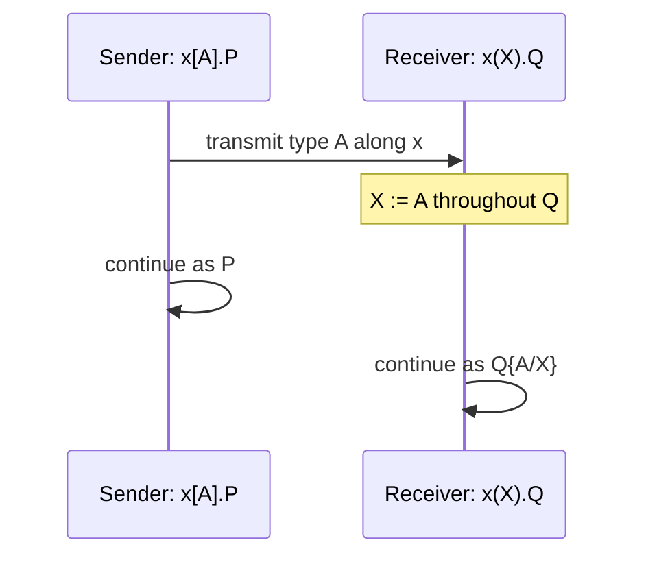

[[book-guidelines|↩ Back to guidelines]]

> Assumes you already know CP's basic grammar, the judgment form $P \vdash \Gamma$, and the Axiom/Cut rules — see [[CP-a-Classical-Linear-Logic-Process-Calculus]] if those aren't yet familiar. This article covers exactly one slice: the second-order quantifiers $\exists$ and $\forall$, and the Church-numeral example they unlock.

## The problem: protocols generic over a payload type

Every connective covered so far — $\otimes$, $\parr$, $\oplus$, $\&$, $!$, $?$ — describes a channel whose behavior is pinned down by *fixed* propositions. $A \otimes B$ means "output a value of exactly this $A$, then behave as exactly this $B$." That's fine for `Buy` or `Shop`, where the payload types (`Name`, `Credit`, `Price`) are known in advance. But plenty of genuinely useful protocols can't be pinned down that way — a generic "identity service" that receives a value of *some* type and echoes it back needs to be stated once, for all types, not copy-pasted per type.

This is exactly the problem System F (polymorphic $\lambda$-calculus) solves for functions: instead of writing a separate `id` for `Nat`, `Bool`, `String`, ..., you write one term that abstracts over the type itself, `$\Lambda X. \lambda x{:}X.\, x$`, and instantiate it per use-site. CP needs the session-typed analogue — a channel that can *receive a type* and then behave according to it, and a dual channel that can *send a type* to select which instance of a generic protocol it wants. That's what $\exists$ and $\forall$ give you.

## The two quantifiers

$\exists X.B$ and $\forall X.B$ are dual propositional-variable binders, interpreted as:

- $\exists X.B$ — the session type of a channel that **instantiates** $X$ to some chosen proposition $A$, then behaves as $B\{A/X\}$ (behaves as $B$ with every occurrence of $X$ replaced by $A$).
- $\forall X.B$ — the session type of a channel that **generalises** over $X$: it accepts *any* proposition for $X$ and then behaves as $B$ (with $X$ now bound to whatever was sent).

This is precisely type application and type abstraction, transposed from terms to channels — or, in Turner's (1995) polymorphic $\pi$-calculus, sending and receiving *types* instead of *values* along a channel.

### Instantiation ($\exists$)

$$
\dfrac{P \vdash \Gamma, x : B\{A/X\}}{x[A].P \vdash \Gamma, x : \exists X.B} \quad \exists
$$

Read bottom-up: to justify a channel $x$ of type $\exists X.B$, you commit to a specific witness proposition $A$, and the rest of the process $P$ must behave at type $B\{A/X\}$ — $B$ with $A$ substituted for $X$. Read top-down (as a program): the composite process $x[A].P$ transmits a *representation of the proposition $A$ itself* along $x$ — not a value, a type — and then continues as $P$.

### Generalisation ($\forall$)

$$
\dfrac{Q \vdash \Delta, x : B}{x(X).Q \vdash \Delta, x : \forall X.B} \quad \forall \; (X \notin \mathsf{fv}(\Delta))
$$

Process $Q$ is typed generically in $X$ — it doesn't know or care what proposition eventually fills $X$ in, and the side condition $X \notin \mathsf{fv}(\Delta)$ enforces that: no *other* channel in scope may already depend on $X$, or genuine parametricity would break. The composite process $x(X).Q$ receives a description of a proposition along $x$, binds it to $X$, and executes $Q$ — now specialized.

Notice the same "twist" from [[The-Twist-Reinterpreting-the-Linear-Connectives]] is at work here too: hypothesis and conclusion both use the channel name $x$, and its type evolves from $B\{A/X\}$ (or generic $B$) to the quantified form as the binder is discharged.

## The reduction: cut is literally a type-passing communication step

Cutting an $\exists$-typed process against a $\forall$-typed one is the principal reduction $(\beta_{\exists\forall})$:

$$
\nu x.\big(x[A].P \mid x(X).Q\big) \;\Longrightarrow\; \nu x.\big(P \mid Q\{A/X\}\big)
$$

The sender's chosen witness $A$ is substituted directly for the receiver's bound variable $X$ throughout $Q$, and both processes carry on. This is *exactly* $\beta$-reduction of a type abstraction against a type application in a polymorphic $\lambda$-calculus — $(\Lambda X. Q)\,[A] \longrightarrow Q\{A/X\}$ — re-read as a communication event instead of a substitution rule for terms. Nothing about "communication" here is metaphorical: sending a type and receiving a type genuinely is how a polymorphic call gets resolved, whether you're doing it via substitution in a proof term or via a message on a channel.



## Grounding: Lean's `∀`, and why Rust generics are a false friend

**Lean (primary grounding here).** Lean's own function space over `Type` *is* $\forall X.B$, directly. The polymorphic identity function

```lean
def id {α : Type} (x : α) : α := x
```

has type `{α : Type} → α → α` — a $\forall$-binder over a type, exactly like $x(X).Q$ accepting a type before proceeding. Calling `id (α := Nat) 5` is $\exists$-style instantiation: you (or Lean's elaborator, if the argument is left implicit) supply a witness type, and the generic body specializes. In fact, this *is* the load-bearing connection for a metaprogramming elaborator: when you write `id 5` with `α` implicit, Lean's elaborator creates a metavariable `?α`, unifies it against the type of `5` (namely `Nat`), and only then performs the substitution `α := Nat` — mechanically the same substitution $B\{A/X\}$ that $(\beta_{\exists\forall})$ performs, just discovered by unification instead of read off an explicit `x[A]`. CP's $\exists$/$\forall$ are **[[Related-Work-and-Extensions-to-CP#Polymorphism: Church-style versus Curry-style|Church-style]]**: the witness type is always sent explicitly, never inferred. A calculus with **Curry-style** (implicit) polymorphism for session types exists in the literature (Berger, Honda and Yoshida 2005, discussed in [[Related-Work-and-Extensions-to-CP]]) — the difference between "the type is always on the wire" and "the type is inferred by unification and never actually transmitted" is precisely the difference between this Church-style presentation and what your elaborator project needs to do at run time. Building intuition for the explicit case first (as CP does) is a reasonable on-ramp before tackling implicit-argument unification.

**Rust (secondary, with a caveat).** Rust generics are the wrong shape for a literal analogy, because Rust monomorphizes at *compile* time — by the time your program runs, there is no type being "sent" anywhere; the generic code has already been duplicated per instantiation. The honest Rust analogue of *runtime* type-passing is a trait object or an explicit type-tag enum:

```rust
enum TypeTag { NatT, BoolT /* ... */ }

// a "channel" that must receive a type description before it can proceed,
// mirroring x(X).Q — the tag *is* the runtime witness for X
fn generalise(tag: TypeTag) -> Box<dyn std::any::Any> {
    match tag {
        TypeTag::NatT => Box::new(0u64),
        TypeTag::BoolT => Box::new(false),
    }
}
```

This captures the *runtime-value-carrying-a-type* flavor of $\exists X.B$ reasonably well (a `Box<dyn Any>` genuinely does carry its type at runtime, unlike a monomorphized generic), but don't over-read it — CP's $A$ is a full proposition, not a closed set of tags, and substitution $B\{A/X\}$ has no real Rust counterpart at all. Treat this analogy as a nudge toward the right intuition, not a translation.

## Worked example: Church numerals as polymorphic processes

Section 3.5's payoff example encodes the Church numerals using nothing but $\forall$, $\otimes$, $\parr$, and $!/?$. Define:

$$
\mathsf{Church} \;\triangleq\; \forall X.\, {!}(X\otimes X^\perp) \parr (X^\perp \parr X)
$$

If you introduce the derived linear-implication connective $A \multimap B \triangleq A^\perp \parr B$ (used freely from [[Output-and-Input-via-the-Multiplicatives]] onward), this is exactly:

$$
\mathsf{Church} \;=\; \forall X.\, {!}(X \multimap X) \multimap (X \multimap X)
$$

which should look immediately familiar: it's the standard System F type of Church numerals, $\forall X. (X\to X) \to X \to X$, with the successor position marked unlimited ($!$) because a Church numeral applies its successor function *some number of times*, and only unlimited (server-typed) channels support being invoked repeatedly.

The numerals `zero_x`, `one_x`, and `two_x` are processes that accept a type $X$ along $x$, then a "successor" process $s$ of type $?(X\otimes X^\perp)$ (a *client* request against the unlimited successor server), then a "seed" value $z:X^\perp$ — and invoke $s$ zero, one, or two times on $z$ before returning a value of type $X$. Concretely:

- `zero_x` just forwards $z$ straight back out: it never touches $s$.
- `one_x` requests $s$ once, applying it to $z$.
- `two_x` requests $s$ twice, threading the result of the first application into the second.

To make the numerals *do* something observable, the paper defines two helper processes: $\mathsf{incr}_{a,b} \vdash a{:}\mathsf{Nat}^\perp, b{:}\mathsf{Nat}$, which accepts a natural along $a$ and transmits one greater along $b$, and $\mathsf{nought}_a \vdash a{:}\mathsf{Nat}$, which just transmits zero. Cutting a Church numeral against a process built from these unwinds — by repeated application of $(\beta_{\exists\forall})$, $(\beta_{!?})$, and the multiplicative reductions from [[Output-and-Input-via-the-Multiplicatives]] — into:

$$
\begin{aligned}
\nu x.(\mathsf{zero}_x \mid \mathsf{count}_{x,y}) &\;\Longrightarrow\; \mathsf{nought}_y \\
\nu x.(\mathsf{one}_x \mid \mathsf{count}_{x,y}) &\;\Longrightarrow\; \nu z.(\mathsf{nought}_z \mid \mathsf{incr}_{z,y}) \\
\nu x.(\mathsf{two}_x \mid \mathsf{count}_{x,y}) &\;\Longrightarrow\; \nu a.\big(\nu z.(\mathsf{nought}_z \mid \mathsf{incr}_{z,a}) \mid \mathsf{incr}_{a,y}\big)
\end{aligned}
$$

— three processes that transmit $0$, $1$, and $2$ respectively along $y$. A second example, $\mathsf{ping}_{x,y,w}$, does the same thing but produces its output as a literal *count of signals* fired along $y$ (followed by a termination signal on $w$) rather than a `Nat` value — a nice reminder that in a session-typed calculus, "the number 2" can be represented either as encoded data or as an observable communication pattern, and the Church encoding doesn't care which.

## Where this leads

$\exists$/$\forall$ close out CP's *proof-theoretic* connective inventory — after this, [[Commuting-Conversions-and-Cut-Elimination]] shows how *every* connective's principal reduction (including $\beta_{\exists\forall}$ above) fits into the general cut-elimination theorem that makes the whole calculus deadlock-free. Polymorphism itself doesn't get used again structurally elsewhere in the paper (GV, in [[GV-a-Session-Typed-Functional-Language]], is deliberately kept monomorphic for simplicity), but it's the piece of CP most directly relevant to your elaborator project: everything here about instantiation-by-substitution is the Church-style skeleton that a Curry-style, unification-driven elaborator has to reconstruct implicitly instead of reading off an explicit `x[A]`.
