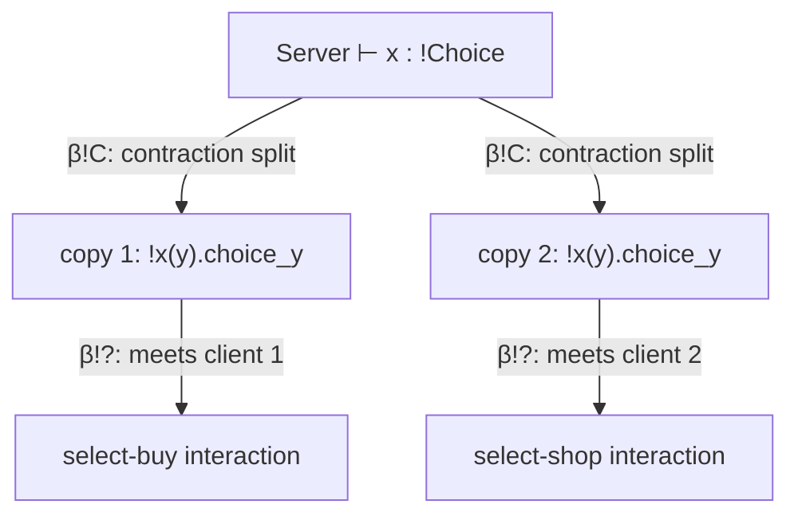

[[book-guidelines|↩ Back to guidelines]]

# Servers and Clients via the Exponentials

## The problem: everything else in CP is used exactly once

Every connective covered so far — $\otimes$, $\parr$, $\oplus$, $\&$ — is strictly linear. A channel typed $A \otimes B$ gets used *once*: you output along it, and it's gone (well, it continues as $B$, but the $\otimes$-shaped interaction happened exactly once). That's the whole point of linear logic doing the bookkeeping: no channel gets forgotten, and no channel gets used twice by accident. It's also why [[CP-a-Classical-Linear-Logic-Process-Calculus|CP]] is deadlock-free — every resource has a single, trackable consumer.

But that's not how real services work. A database doesn't get cut against exactly one client and then vanish. A web server handles requests indefinitely, and it hands out the *same* protocol to every caller, while each caller might be a completely different session running a completely different sequence of operations against it. You need a controlled way to say "this channel can be used arbitrarily many times, by arbitrarily many independent parties" without giving up linear tracking for everything else.

That's what the exponentials `!` and `?` are for. They're the one place in CP where linearity is deliberately broken — but broken in a disciplined, logically justified way, not just bolted on.

**What breaks without this:** without `!`/`?`, you'd have no way to write a server that outlives any single client interaction. Every session would need its own syntactically distinct copy of the server's code, decided in advance, with no way to spawn a fresh instance at runtime in response to an incoming request you didn't know about ahead of time.

## A naming gotcha worth flagging immediately

Confusingly, the symbols `!` and `?` show up in the session-types literature with **two unrelated meanings**. In Honda's original work and in Gay and Vasconcelos's session-typed language (which [[GV-a-Session-Typed-Functional-Language|GV]], covered in a later article, is based on), `!` and `?` are used to denote *output* and *input* operations on a channel — nothing to do with replication. Wadler calls this "an unfortunate historical accident."

In CP, by contrast, `!` and `?` mean exactly what they mean in linear logic proper: the *exponential* connectives, "of course!" and "why not?", governing replication. That's the sense used throughout this article and the rest of CP. If you go on to read Honda's or Gay–Vasconcelos's papers directly, mentally retag their `!`/`?` as send/receive — don't assume they line up with CP's.

## The core intuition: impartial servers, diverse clients

- $!A$ is the session type of a **server**: a process that will repeatedly accept requests of type $A$. Critically, it must be *impartial* — every request gets served according to the exact same protocol $A$. Uniform behavior.
- $?A$ is the session type of a **collection of clients**: any number of independent parties, each of which may request an $A$-interaction, and each of which may make a *different* request. Diverse behavior.

They're dual, as you'd expect: $(!A)^\perp = {?A^\perp}$ and $(?A)^\perp = {!A^\perp}$ — a server offering $!A$ is exactly what a population of $?A^\perp$-clients need on the other end of the channel.

## The `!` rule: spawning fresh copies

$$
\frac{P \vdash {?\Gamma}, y:A}{{!x(y).P} \vdash {?\Gamma}, x:{!A}} \; !
$$

Process $P$ communicates along $y$ obeying protocol $A$. The composite $!x(y).P$ communicates along $x$ obeying $!A$: it receives a name $y$ along $x$ (allocated by whoever wants to talk to it) and then *spawns a fresh copy of $P$* to run against that particular $y$.

The side condition is the whole story here: **every other channel $P$ touches must itself have type $?B$ for some $B$.** Why? Because $P$ is about to be duplicated an unbounded number of times. If $P$ captured some genuinely linear, one-shot resource from $\Gamma$, then the *second* spawned copy would try to consume that same one-shot resource again — but it's already gone. Requiring every captured channel to be of the form $?B$ (itself a replicable client population, safe to hand out repeatedly) is exactly what makes unbounded spawning sound. A replicable service may only be built out of other replicable services.

**Rust grounding.** This restriction has an exact analogue in Rust's closure traits. A closure that only captures `Clone`-able or `Arc`-shared state can implement `Fn` — callable arbitrarily many times via `&self`. A closure that captures an *owned* value it consumes on each call can only implement `FnOnce` — callable exactly once, because calling it again would mean using a moved-out value twice, which the borrow checker rejects outright.

```rust
// This can only be called once — it consumes `db_connection`.
let handler: Box<dyn FnOnce() -> Response> = Box::new(move || {
    db_connection.query(/* ... */)
});

// This can be called any number of times — it only captures a
// shared, cloneable handle.
let server: Arc<dyn Fn() -> Response + Send + Sync> = Arc::new(move || {
    shared_pool.get_connection().query(/* ... */)
});
```

`!x(y).P` is the `Fn` case. The $?\Gamma$ restriction is the type-system fact that makes "callable many times" sound — precisely mirroring why Rust's `Fn` bound forces you toward shared, not owned, captures.

## The three client rules

A server can have exactly one client, no clients, or many — and CP gives one rule for each, directly mirroring classical linear logic's structural rules for the exponential `?`: dereliction, weakening, and contraction.

### Dereliction — a single client

$$
\frac{Q \vdash \Delta, y:A}{{?x[y].Q} \vdash \Delta, x:{?A}} \; ?
$$

$Q$ communicates along $y$ obeying $A$. The composite $?x[y].Q$ communicates along $x$ obeying $?A$: it allocates a fresh channel $y$, transmits it along $x$ (this is the client *requesting* a session — handing the server a fresh name to talk to it on), and then runs $Q$.

Cutting a server against a single such client is the base case of interaction:

$$
\nu x.({!x(y).P} \mid {?x[y].Q}) \implies \nu y.(P \mid Q) \qquad (\beta_{!?})
$$

One copy of $P$ gets spawned, connected to $Q$ over the freshly shared $y$, and the server/client wrapper around both simply disappears. This is the "ordinary" case — a server meeting exactly one request looks just like an ordinary $\otimes/\parr$-style handoff underneath.

### Weakening — no clients

$$
\frac{Q \vdash \Delta}{Q \vdash \Delta, x:{?A}} \; \mathrm{Weaken}
$$

A process $Q$ that doesn't touch channel $x$ at all can still be typed as if it offered $?A$ — vacuously, there's just nobody there. Cutting a server against a client population of *zero* garbage-collects the server:

$$
\nu x.({!x(y).P} \mid Q) \implies Q, \quad \text{if } x \notin \mathrm{fn}(Q) \qquad (\beta_{!W})
$$

The server was never called, so it's simply deallocated — dead code elimination, essentially, licensed directly by a structural rule of the logic.

**Rust grounding.** This is what happens when an `Arc<Service>` is constructed and its clone count never rises above the holder that immediately drops it — the underlying resource is dropped without ever running. Structurally it's the same move as an unused generic parameter or an unused field: the type system permits "add a hypothesis nobody uses," and here that unused hypothesis is a server nobody called.

### Contraction — many clients

$$
\frac{Q \vdash \Delta, x:{?A}, x':{?A}}{Q\{x/x'\} \vdash \Delta, x:{?A}} \; \mathrm{Contract}
$$

$Q$ holds two independent handles, $x$ and $x'$, both to the *same* protocol $?A$. Contraction merges them into a single handle $x$ (renaming every occurrence of $x'$ to $x$ throughout $Q$). Cutting a server against a contracted client duplicates the server so each original handle still gets its own private copy to talk to:

$$
\nu x.({!x(y).P} \mid Q\{x/x'\}) \implies \nu x.({!x(y).P} \mid \nu x'.({!x'(y).P} \mid Q)) \qquad (\beta_{!C})
$$

The right-hand side's type derivation applies `Contract` once for each free name in $\Gamma$ (every other channel $P$ touches) — made precise by the **priming convention**: for each free name $z_i$ in $P$, associate a fresh partner name $z_i'$, and write $P'$ for $P$ with every $z_i$ replaced by $z_i'$. That's what lets the duplicated copy $!x'(y).P$ run alongside the original without its internal channel names colliding.

**Rust grounding.** This is `Arc::clone`. Two conceptually-separate handles to "the same service" get unified into one shared reference-counted pointer — exactly the move that's illegal for an owned, linear resource (you can't `Clone` a value the borrow checker considers moved-from-once-only) but is exactly the intended operation for a `?`-typed, unlimited resource.

## Worked example: a replicated shop, served to two clients at once

Recall the Select/Choice example from the multiplicatives/additives articles: a shop offering either `Buy` or `Shop` (via $\oplus$), served by something offering either `Sell` or `Quote` (via $\&$). Now make the server side genuinely replicable and hand it to two independent clients simultaneously:

```
Client  ≜ ?Select
Server  ≜ !Choice

client_x ≜ ?x(y).select-buy_y | ?x(y).select-shop_y      -- combined via Mix
server_x ≜ !x(y).choice_y
```

(assume every channel that `sell_x`, `quote_x`, and `choice_x` use besides the distinguished one is itself of the form $?\Theta$, so that they satisfy the replicability side condition of the `!` rule.)

$\mathsf{Client} = \mathsf{Server}^\perp$, and

$$
\frac{\mathsf{client}_x \vdash \Gamma,\Delta,x:\mathsf{Client} \quad \mathsf{server}_x \vdash {?\Theta}, x:\mathsf{Server}}{\nu x.(\mathsf{client}_x \mid \mathsf{server}_x) \vdash \Gamma,\Delta,{?\Theta}} \; \mathrm{Cut}
$$

By one application of $(\beta_{!C})$ (the client's two independent `select-buy`/`select-shop` requests are really two separate uses of $x$, so the server gets duplicated first) followed by two applications of $(\beta_{!?})$ (each duplicated server copy meets its one client):

$$
\nu x.(\mathsf{client}_y \mid \mathsf{server}_y) \implies (\nu y.\, \mathsf{select\text{-}buy}_y \mid \mathsf{choice}_y) \mid (\nu y'.\, \mathsf{select\text{-}shop}_{y'} \mid \mathsf{choice}_{y'})
$$

Two entirely independent sessions now run concurrently, each with its own private copy of the server, each free to pick a different branch (`buy` vs. `shop`) of the offered choice. This is the payoff: one replicable definition, served correctly and independently to as many callers as show up. (Mechanically, pushing the two `choice` instances inward past the `Mix`-combined client also needs the structural rule `Assoc` and a commuting conversion $\kappa_\otimes$ — those are covered fully in the commuting-conversions article; the shape of the result above is what matters here.)



## Where this leads

The exponentials are the last connective family CP needs — after this, polymorphism ($\exists$/$\forall$, next article) rounds out the type grammar, and the cut-elimination results (the commuting-conversions article) are what make reductions like $(\beta_{!C})$ above provably terminating and race/deadlock-free in general, not just in this one worked case.

`!`/`?` are also the piece of CP most directly relevant to anything resembling a real, long-running service architecture, which makes them worth remembering precisely: GV (the session-typed *functional* language covered later) deliberately **omits** a version of `!`/`?` for simplicity, though Wadler notes the extension "appears straightforward." If your own verifier or elaborator project ever needs to reason about a persistently-callable service rather than a strictly one-shot linear protocol, this — impartial servers typed `!`, diverse client populations typed `?`, with replicability gated by "only talk to other replicable things" — is the mechanism to generalize, and the Rust `Fn`/`FnOnce` split above is a genuinely load-bearing intuition for *why* the side condition on $\Gamma$ has to be there, not just decoration.
