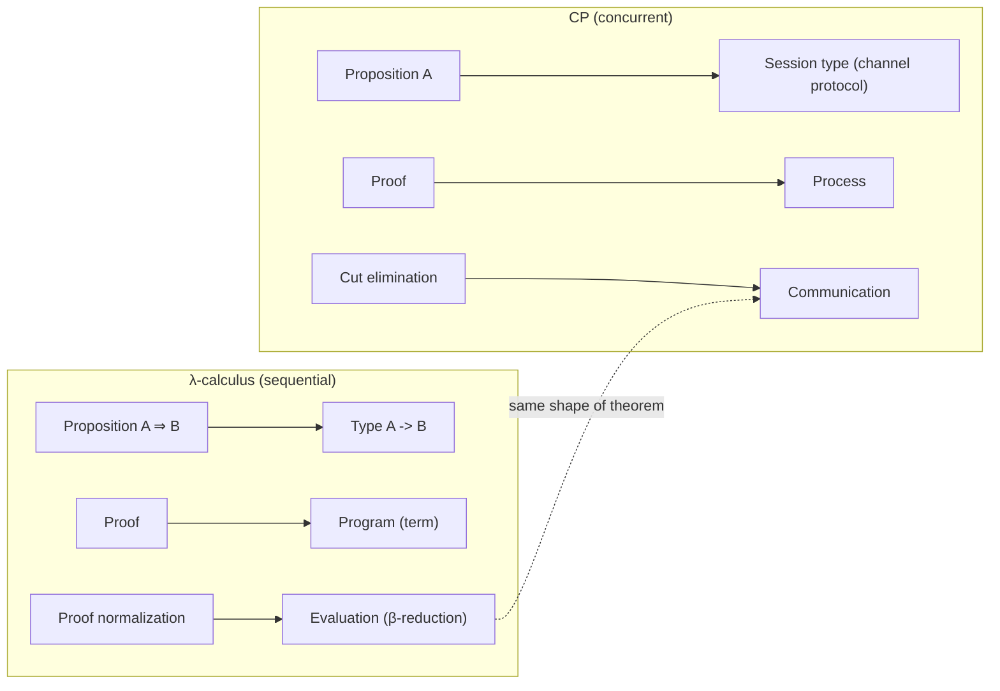

[[book-guidelines|↩ Back to guidelines]]

## The question this paper is answering

Functional programmers have a foundation myth, and it happens to be true. $\lambda$-calculus was independently discovered twice — once by Church as a model of computation, once by Gentzen as natural-deduction proof — and the two turned out to be *the same object* wearing different clothes. That coincidence is the Curry-Howard correspondence, and it's the reason functional programming feels principled rather than arbitrary: every type is a proposition, every well-typed program is a proof of that proposition, and running the program (reducing it to a value) is identical, term-for-term, to normalizing the proof.

Concurrent programming has no such myth. We have a zoo of process calculi — CSP, CCS, the $\pi$-calculus, join calculus, ambients, bigraphs — each useful, none canonical. This paper's project is to ask: is there a foundation for *concurrency* with the same "of course it's this one" inevitability that $\lambda$-calculus has for sequential computation? Wadler's answer is: yes, and it's already sitting inside linear logic — you just have to read the connectives the right way.

## First correspondence: proofs as programs

Start with what you already trust. In simply-typed $\lambda$-calculus:

$$
\text{propositions } \textit{as} \text{ types}, \qquad
\text{proofs } \textit{as} \text{ programs}, \qquad
\text{normalisation of proofs } \textit{as} \text{ evaluation of programs}.
$$

Concretely: the proposition $A \Rightarrow B$ is the type `A -> B`. A proof of it is a function. Modus ponens — from a proof of $A \Rightarrow B$ and a proof of $A$, derive a proof of $B$ — is function application. And *proof normalization* (the standard logician's procedure for simplifying a proof that detours through a lemma it didn't need) is *literally* beta-reduction.

```rust
// A ⇒ B, as a Rust function: given evidence of A, produce evidence of B.
fn modus_ponens<A, B>(proof_a_implies_b: impl Fn(A) -> B, proof_a: A) -> B {
    proof_a_implies_b(proof_a)
}
```

This isn't an analogy you're being asked to accept on faith — it's a theorem, and it recurs at every level of type theory: Hindley's type inference is Milner's Algorithm W; Girard's System F is Reynolds's polymorphic $\lambda$-calculus; Peirce's law in classical logic is Landin's `call/cc`. Every time someone finds a new correspondence like this, it's because a *logical* idea (a proof system, a specific rule) and a *computational* idea (a language feature, an operational behavior) were secretly the same thing, discovered from two directions.

**Why this matters for you as an implementer:** this is exactly the equation a type-checker or elaborator is built around. When Lean's kernel checks a term against a type, it is checking a proof against a proposition; when it reduces a term to head-normal form to check definitional equality, it is normalizing a proof. There is no separate "evaluation semantics" layered on top of "the logic" — for a total, well-behaved fragment, they're the same procedure viewed from two angles. Keep that identification in mind; it is about to be transplanted wholesale into a concurrent setting.

## The open question: a foundation for concurrency

Girard's 1987 paper on linear logic dropped a suggestive remark that sat mostly unexploited for years:

> "The new connectives of linear logic have obvious meanings in terms of parallel computation. [...] Linear logic is the first attempt to solve the problem of parallelism at the logical level, *i.e.*, by making the success of the communication process only dependent of the fact that the programs can be viewed as proofs of something, and are therefore sound." — Girard (1987)

Linear logic's proofs consume their hypotheses exactly once — no discarding (weakening), no duplicating (contraction), unless a proposition is explicitly marked as reusable with $!$/$?$. That "used exactly once" discipline is *obviously* the same discipline a channel obeys: a message sent on a channel is consumed exactly once by whoever receives it. The suggestive part is real. The hard part is building an actual correspondence as tight as the one $\lambda$-calculus has — not just an inspired analogy, but a translation where *reduction on one side is identical to reduction on the other*, the way beta-reduction is identical to proof normalization.

Two attempts preceded this paper:

- **Abramsky (1994) and Bellin and Scott (1994)** translated linear logic into the $\pi$-calculus. It works, but the match is loose: it only holds for the multiplicative connectives, it requires a nonstandard structural equivalence on $\pi$-calculus terms ("permuting two reads on the same channel," which is a strange thing to have to postulate), and it restricts the logical axiom to atomic propositions only — which, in a real programming language, means you can't use type variables without restructuring your program.
- **Caires and Pfenning (2010)** found a genuinely different interpretation — the "twist" this paper builds on (next section) — that reads much more naturally as *session types*, a concept concurrency researchers had already converged on independently since Honda (1993). But their calculus, $\pi$DILL, is built on *intuitionistic* linear logic with two-sided sequents, which (as you'll see) forces some awkward duplication, and their correspondence to cut elimination only holds if you *ignore commuting conversions* — which is hard to justify, since commuting conversions are not an optional extra of cut elimination, they're an essential part of it.

## Second correspondence: proofs as processes

This paper's core move is to take Caires and Pfenning's twist and push it into a *classical* linear logic, in one-sided sequents (their own term for this is CP — "Classical Processes"). The result is a second Curry-Howard correspondence, structurally identical in shape to the first one:

$$
\text{propositions } \textit{as} \text{ session types}, \qquad
\text{proofs } \textit{as} \text{ processes}, \qquad
\text{cut elimination } \textit{as} \text{ communication}.
$$

Read that middle line carefully, because it's doing real work, not just wordplay:

- A **proposition** $A$ becomes the *protocol* a channel obeys — e.g. "output a value of type $A$, then behave as protocol $B$."
- A **proof** that a channel obeys protocol $A$ becomes a **process** — a piece of running code that communicates along that channel exactly according to the protocol.
- The **cut rule** of sequent calculus — "if I can prove $A$, and you can prove $A$ implies falsity when composed together, we can eliminate $A$ and get a proof of the rest" — becomes **process composition**: two processes, each holding one end of a shared channel, running in parallel.
- **Cut elimination**, the rewriting procedure that simplifies a proof using cut into one that doesn't (or reduces to a smaller cut), becomes **communication itself** — one process's output literally consumed by the other's input, exactly the way beta-reduction consumes a redex.

This is the second half of the paper's title made literal: *propositions as sessions*. What functional programmers call a "type" (a specification of shape), concurrent programmers call a "session type" (a specification of a communication protocol) — and this correspondence says they can be made to be the same formal object, related by the same style of proof.

### Why deadlock-freedom is this correspondence's headline result

Here's the payoff, and it's worth being precise about what kind of guarantee it actually is.

For $\lambda$-calculus, Curry-Howard has a famous corollary: it identifies a *fragment* of the calculus (well-typed terms, without general recursion) for which the Halting Problem is trivially solved — every well-typed term terminates, because proof normalization always terminates (strong normalization is a metatheorem about the logic, and it transports directly across the correspondence). Untyped $\lambda$-calculus, or typed calculi with an added fixpoint operator, can still express arbitrary non-terminating computations; the *typed, cut-free-normalizing* fragment cannot.

For CP, the analogous metatheorem is **top-level cut elimination** (proved as Theorem 2, covered in the article on [[Commuting-Conversions-and-Cut-Elimination|Commuting Conversions and Cut Elimination]]): every well-typed CP process reduces to a process that is not a cut — i.e., it can always make progress, either by communicating internally or by being ready for external communication, and it can *never* get stuck waiting on a communication that will never happen. That stuck-forever state is exactly what "deadlock" means operationally. So:

$$
\text{strong normalization of cut elimination} \quad\Longleftrightarrow\quad \text{deadlock freedom of the corresponding process}
$$

is the concurrency-side echo of "strong normalization of proof reduction $\Longleftrightarrow$ termination of the corresponding program." Note the guarantee is about *progress*, not necessarily about the whole system eventually finishing — a server (`!A`) is allowed to run forever, servicing requests, and that's fine; what can't happen is a process that's simply wedged, mutually waiting. This distinction matters: it's a *safety* property (nothing bad — a deadlock — happens) transported from a *liveness/termination* property in the logic (cut elimination always succeeds), which is a subtler translation than it might first appear, and part of why getting the correspondence exactly right (rather than approximately right, as in Abramsky/Bellin-Scott) is the whole point of the paper.

Race-freedom comes along for free too, from a more mundane source: the Cut rule literally requires the two composed processes' channel environments to be *disjoint* (linearly, a name can't appear on both sides of a cut) — so there is structurally no way for two processes to race to communicate on the same channel. You get both guarantees not by bolting on a separate analysis, but because they are consequences of a proof system that was already known to be sound.

### Three contributions, one paper

With that motivation in hand, here's concretely what the paper builds, in the order later articles in this vault will cover them:

1. **CP** — a session-typed process calculus derived directly from *classical* linear logic with one-sided sequents (Girard's own original presentation style). Classical logic gives CP a symmetry $\pi$DILL doesn't have: one rule per connective instead of two, and the logical axiom works at *every* type (not just atomic ones), which is what makes polymorphism fall out cleanly later. See [[CP-a-Classical-Linear-Logic-Process-Calculus|CP: A Classical Linear Logic Process Calculus]].
2. **GV** — a linear *functional* language (in the ML/Haskell sense — terms, not raw processes) whose channel operations are typed with session types, translating down into CP. GV is the paper's demonstration that this isn't just proof-theoretic elegance; you can program in it. See [[GV-a-Session-Typed-Functional-Language|GV: A Session-Typed Functional Language]].
3. **A translation from GV into CP** that is *type-preserving* and, crucially, is the first time a *standard* presentation of session types (i.e., one that looks like what session-type researchers were already using, not a bespoke reformulation) has been shown to correspond this tightly to linear logic — including matching *all* the commuting conversions, which is exactly what Caires-Pfenning's own correspondence to $\pi$-calculus had to sacrifice. See [[Translating-GV-into-CP|Translating GV into CP]].

### The paper's central design bet

Here's the trade-off Wadler names explicitly, and it's worth internalizing because it explains every subsequent design decision in CP: **the paper lets logic dictate the process calculus, rather than trying to match a pre-existing process calculus.**

Prior work (Bellin-Scott, Caires-Pfenning) tried to keep a tight correspondence to *cut elimination* while *also* staying close to traditional $\pi$-calculus reduction — and both had to compromise to do it (nonstandard structural rules in one case, dropped commuting conversions in the other). This paper instead takes the traditional rules of cut elimination *as the specification* for what the process calculus's reduction rules must be, full stop. The pro: every commuting conversion is satisfied, the axiom works uniformly at every type, and polymorphism drops out for free. The con, stated candidly by the author: CP forgoes the reassurance of a *double* discovery — unlike Church/Gentzen or Hindley/Milner, CP wasn't independently invented by someone starting purely from process-calculus intuitions and arriving at the same place. It is logic, deliberately steering the design of the "right" process calculus, rather than logic and process theory meeting in the middle.

## Grounding the correspondence

**Rust — linearity as ownership.** The single biggest reason this correspondence is worth your attention as a systems programmer: *linear logic's core discipline — use each hypothesis exactly once — is exactly Rust's ownership discipline.* A channel endpoint of session type $A \otimes B$ ("send an $A$, then behave as $B$") is, operationally, a value that you consume-and-replace: you call `send`, and get back a *new* handle whose type has advanced to $B$. This is precisely the **typestate pattern**:

```rust
// A session type "output an i32, then behave as End" as an evolving Rust type.
struct Channel<S> { raw: RawSocket, _protocol: std::marker::PhantomData<S> }

struct SendInt<Next>(std::marker::PhantomData<Next>);
struct End;

impl<Next> Channel<SendInt<Next>> {
    // Consumes `self` (linear!) and returns a channel at the *next* protocol state.
    fn send(self, value: i32) -> Channel<Next> {
        self.raw.write_i32(value);
        Channel { raw: self.raw, _protocol: std::marker::PhantomData }
    }
}
```

Notice `send` takes `self` by value, not `&mut self` — the old, unsent-state channel is *gone* after the call, exactly as a linear hypothesis is gone after it's used in a proof, and exactly as `x` in the paper's rule $x[y].(P \mid Q)$ is a name that gets "used up" by the output and cannot be referred to again with its old type. The borrow checker is, without anyone having designed it this way on purpose, already enforcing something close to CP's linear discipline on ordinary Rust values. Session types just make that discipline apply to a value that happens to be a network or process channel instead of a `Vec` or a `File`.

**Lean — cut elimination as kernel reduction.** The "cut elimination as communication" slogan is *literally* what Lean's kernel does when it checks two terms for definitional equality: it reduces both sides (weak head normal form, unfolding definitions, beta-reducing) until it can compare them structurally — and that reduction procedure is required to terminate for the kernel to be trustworthy, for exactly the reason CP's cut elimination is required to terminate for CP to be deadlock-free. When you later see the paper's Theorem 2 (`If P ⊢ Γ then there exists a Q such that P ⟹ Q and Q is not a cut`), read it with the same eye you'd read a strong-normalization theorem for a kernel's reduction relation: it's the proof obligation that makes the whole system safe to trust.

```lean
-- Lean's `rfl`/defeq check is, informally, "normalize both proofs and compare" —
-- the same move CP makes when it reduces a cut against its dual until nothing's left to simplify.
example : (2 : Nat) + 2 = 4 := rfl
```

## The shape of the correspondence, side by side



## Where this leads

Everything downstream in this vault is an elaboration of the right-hand column above. [[The-Twist-Reinterpreting-the-Linear-Connectives|The Twist]] explains the one rule change (which channel name appears where) that makes $\otimes$ and $\parr$ read as session types instead of Abramsky/Bellin-Scott's pairing. [[CP-a-Classical-Linear-Logic-Process-Calculus|CP]] and the connective-by-connective articles that follow it build the actual proof system whose *proofs* are the *processes* this article has been gesturing at. [[Commuting-Conversions-and-Cut-Elimination|Commuting Conversions and Cut Elimination]] is where the deadlock-freedom claim made here gets its actual proof. And [[GV-a-Session-Typed-Functional-Language|GV]] and [[Translating-GV-into-CP|its translation into CP]] are where this correspondence stops being only about a proof calculus and becomes something you could plausibly compile a real program through — the same journey `Fn`, `FnOnce`, and typestate-checked builders take Rust's ownership discipline from a borrow-checker rule to a programming *pattern*.

This is also the load-bearing idea for judgment forms as the shared ancestor of type-checking and proof-checking: everything CP does under the hood is a sequent-calculus judgment $P \vdash \Gamma$, and every rule you'll read in the coming articles is simultaneously "a typing rule for a process" and "an inference rule of a logic" — there is no seam between the two readings, which is the entire point.
