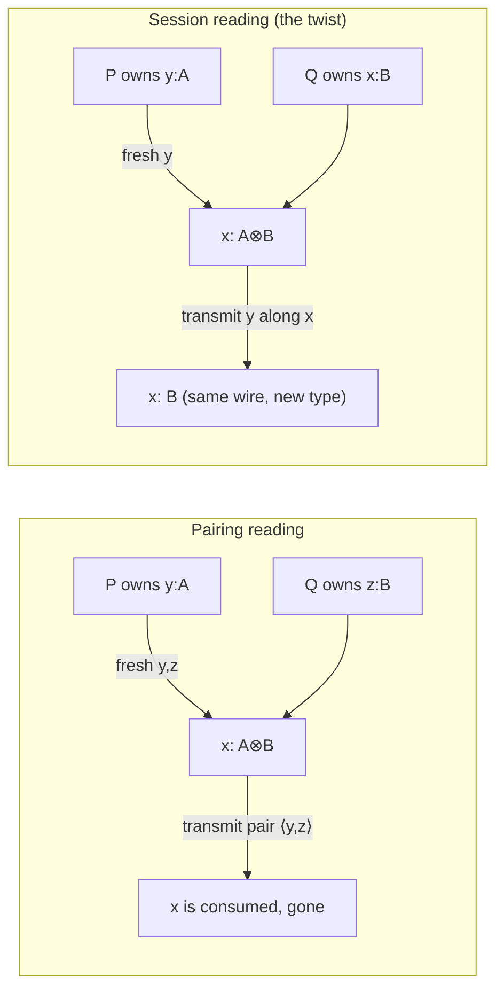

[[book-guidelines|↩ Back to guidelines]]

# The Twist: Reinterpreting the Linear Connectives

## Two people read the same rule and saw different protocols

By 1994, Abramsky and, independently, Bellin and Scott had already done the obvious-in-hindsight thing: translate linear logic proofs into $\pi$-calculus processes, so that [[Commuting-Conversions-and-Cut-Elimination|cut elimination]] (the logic's own notion of proof simplification) would correspond to process reduction (the calculus's own notion of computation). It worked. But it took *sixteen more years* — until Caires and Pfenning (2010) — for anyone to notice that a small variant of essentially the same translation gives you session types, the discipline programmers actually use to describe client/server communication protocols.

That's a strange gap. The connectives $\otimes$ and $\parr$ didn't change. Linear logic didn't change. What changed was a single, almost cosmetic-looking choice buried inside two inference rules: *which channel names get reused, and which get freshly allocated, between a rule's premises and its conclusion.* This article is about that one choice — Wadler calls it "the twist" — because everything else in this paper (CP, [[GV-a-Session-Typed-Functional-Language|GV]], the deadlock-freedom guarantee) is downstream of it.

If you've built a type checker before, you already have the right mental hook: this is a judgment-form design decision, exactly like deciding whether a typing rule's premises and conclusion refer to the *same* variable or to *fresh* ones. Get it wrong and you don't get an incorrect logic — linear logic is linear logic either way — you get a translation that happens to model something less useful than what you wanted.

## Reading 1: connectives as pairing (Abramsky, Bellin and Scott)

Here is how Abramsky, and separately Bellin and Scott, read the two multiplicative connectives $\otimes$ (tensor) and $\parr$ (par) as process-calculus types:

$$
\dfrac{P \vdash \Gamma, y:A \qquad Q \vdash \Delta, z:B}{\nu y,z.\, x\langle y,z\rangle.(P \mid Q) \;\vdash\; \Gamma,\Delta,\, x:A\otimes B} \;\otimes
$$

$$
\dfrac{R \vdash \Theta, y:A, z:B}{x(y,z).R \;\vdash\; \Theta,\, x:A\parr B} \;\parr
$$

Read the $\otimes$ rule as a recipe: to build a process of type $A\otimes B$ on channel $x$, take a process $P$ that owns a channel $y:A$ and a process $Q$ that owns a channel $z:B$, allocate *two brand-new* channel names $y$ and $z$, and have the combined process transmit the *pair* $\langle y, z\rangle$ along $x$ before running $P$ and $Q$ concurrently. Dually, $\parr$ describes a channel that *receives* a pair of names $y,z$ and then runs a single process $R$ that gets to use both.

Under this reading, $A \otimes B$ literally means "a channel that hands you a pair of channels, one obeying $A$, one obeying $B$." That's a completely reasonable reading of a tensor product — it's the process-calculus analogue of a Rust `(ChanA, ChanB)` tuple. Note the key structural fact: the names $y$ and $z$ appearing in the *premises* (as the tails of $\Gamma$ and $\Delta$) are entirely different from the name $x$ appearing in the *conclusion*. Three distinct names are in play. Nothing here suggests that $x$'s *type itself* is changing over time — $x$ is just consumed at the end and replaced by a fresh pair.

## Reading 2: connectives as a session evolving (the twist)

Here is Wadler's rule for the *same two connectives*, $\otimes$ and $\parr$:

$$
\dfrac{P \vdash \Gamma, y:A \qquad Q \vdash \Delta, x:B}{\nu y.\, x\langle y\rangle.(P \mid Q) \;\vdash\; \Gamma,\Delta,\, x:A\otimes B} \;\otimes
$$

$$
\dfrac{R \vdash \Theta, y:A, x:B}{x(y).R \;\vdash\; \Theta,\, x:A\parr B} \;\parr
$$

Stare at the difference until it's uncomfortable, because that discomfort *is* the content of this chapter. In the premises of the $\otimes$ rule, $Q$ no longer owns a fresh channel $z:B$ — it owns **$x:B$**, the *very same name* that shows up in the conclusion as $x:A\otimes B$. Only $y$ is freshly allocated (as the thing transmitted); $x$ persists across the inference, just with a different type attached to it at each stage.

That reuse is the entire twist. It changes the *meaning* of $A\otimes B$ from "a channel yielding a pair" to "a channel that outputs one value of type $A$, and *then continues to exist, under the name $x$, now behaving according to protocol $B$*." The type of a single, ongoing channel evolves: it starts as $A\otimes B$, and after the send happens, the same wire is now typed $B$. This is precisely what a *session type* is — not a static tag on a value, but a state machine describing a channel's whole future.

$\parr$ gets the dual reading: $x(y).R$ inputs one value $y:A$ along $x$, and the process $R$ that continues afterward still communicates on $x$, now at type $B$. A single process $R$ is allowed to touch both the received value and the channel's continuation — there's no artificial pair to deconstruct.

### The rule-level difference, side by side

| | Premises name | Conclusion names | What $x:A\otimes B$ means |
|---|---|---|---|
| Abramsky / Bellin–Scott | $y, z$ (both fresh) | $x$ (fresh, distinct from $y,z$) | "outputs a pair $(A, B)$" |
| Caires–Pfenning / Wadler | $y$ (fresh), $x$ (reused) | $x$ (same name as one premise) | "outputs $A$, then *becomes* $B$" |



## A Rust intuition: move semantics on a session handle

If you've ever modeled a protocol with Rust's typestate pattern, the twist is exactly the difference between "return a tuple of two independent handles" and "consume `self` and return `Self` at a new state." Consider:

```rust
// Pairing reading: x is destroyed, replaced by a genuinely new pair.
struct ChanAB; // channel of type A ⊗ B, pairing reading
fn split(x: ChanAB) -> (ChanA, ChanB) {
    // x is gone; two fresh, independent channels emerge
    todo!()
}

// Session reading: x survives, but its *type* changes across the call.
struct Chan<S>(std::marker::PhantomData<S>);
struct AThenB; // the type tag A⊗B
struct JustB;  // the type tag B

impl Chan<AThenB> {
    // consumes the A⊗B-typed handle, sends a value of type A,
    // and returns the *same underlying channel*, now typed B.
    fn send(self, value: A) -> Chan<JustB> {
        todo!()
    }
}
```

`send` takes `self` by value — the old typestate `Chan<AThenB>` cannot be used again — and hands back a *new type* wrapping what is operationally the same channel resource. That's the twist: linearity (Rust's move semantics, linear logic's exponential-free connectives) isn't just "used exactly once," it's "used exactly once, and its *type after use* is officially different from its type before." This is exactly the discipline a Rust session-typed channel library (or a state-machine-as-types design) already gives you — Wadler's contribution is showing this typestate-with-history idea is not an encoding trick on top of linear logic, it *is* what $\otimes$ and $\parr$ meant all along, once you pick the right variable-naming convention in the inference rule.

In Lean terms, this is the same move as reading a dependent judgment $\Gamma \vdash x : A \otimes B$ not as "$x$ has a fixed static type" but as a relation that a *later* judgment in the same derivation can restate with a different type for the same free variable $x$ — the judgment form itself is carrying an implicit notion of state transition, the same trick used when a kernel tracks how a metavariable's expected type narrows across unification steps.

## Why this looked wrong for sixteen years: the false asymmetry

Here's the objection anyone reading the $\otimes$ rule cold will raise: "this says $A\otimes B$ first sends $A$, *then* sends $B$ — so $A\otimes B$ and $B\otimes A$ should behave differently, sending things in a different order. But tensor product is supposed to be symmetric!" And indeed, at first glance the rule *looks* asymmetric — first obey protocol $A$, then obey protocol $B$, no mention of first obeying $B$ then $A$.

Wadler's answer is not to relax the rule but to prove the symmetry back, one level up: there is an isomorphism between $A\otimes B$ and $B\otimes A$ (and dually between $A\parr B$ and $B\parr A$), realized as an explicit process — a channel adapter that receives-and-relays in the swapped order. So $A \otimes B$ really is "essentially the same protocol" as $B \otimes A$, just not *syntactically* the same term — the same way `(A, B)` and `(B, A)` are isomorphic-but-not-identical Rust tuples, connected by an explicit swap function rather than being literally interchangeable. The apparent unnaturality of a first-do-$A$-then-do-$B$ reading is exactly what delayed this reinterpretation for sixteen years, per Wadler's own account.

## The tax you pay for getting this via intuitionistic logic

Caires and Pfenning discovered the twist first — but they built it on *intuitionistic* linear logic ($\pi$DILL), with two-sided sequents ($\Gamma;\Delta \vdash P :: x:A$, hypotheses on the left of $\vdash$, one conclusion on the right). That choice has a real cost, and it's worth understanding *why*, because CP (the calculus this paper builds next) exists specifically to avoid it.

Two-sided sequents force *output* to be split across two separate rules, depending on which connective is doing the outputting:

$$
\dfrac{\Gamma;\Delta \vdash P :: y:A \qquad \Gamma;\Delta' \vdash Q :: x:B}{\Gamma;\Delta,\Delta' \vdash \nu y.\,x\langle y\rangle.(P\mid Q) :: x:A\otimes B}\; \otimes\text{-R}
\qquad
\dfrac{\Gamma \vdash P :: y:A \qquad \Gamma;\Delta',x:B \vdash Q :: z:C}{\Gamma;\Delta,\Delta',x:A\multimap B \vdash \nu y.\,x\langle y\rangle.(P\mid Q) :: z:C}\; \multimap\text{-L}
$$

and dually, *input* needs both $\multimap$-R and $\otimes$-L. Four rules to say what the classical, one-sided version says in two. Wadler is blunt about the practical fallout: "if one user defines an output protocol with $A\otimes B$, and a second user defines an input protocol with $A\multimap B$, then these cannot be connected directly with a cut" — you need a *convention* (servers always use R-rules, clients always use L-rules) to avoid a mismatch, which is exactly the kind of ad hoc bookkeeping a type-system designer tries hard to eliminate. It's the same flavor of problem as a bidirectional type checker that needs an external convention for which occurrences are in inference-mode versus checking-mode instead of letting the judgment form settle it structurally.

CP's classical, one-sided sequents ($P \vdash \Gamma$, everything on the right, duals doing the work that "left vs. right" used to do) collapse this back down to one rule per connective — output is always $\otimes$, input is always $\parr$, full stop, no server/client naming convention required. That's not just an aesthetic win; it's the reason the classical presentation is "easier to use in practice," and it's why the rest of this paper commits to classical linear logic (CP) over the intuitionistic $\pi$DILL that discovered the twist first.

## Where this leads

The twist is the single design decision that makes everything downstream in this paper possible:

- **[[CP-a-Classical-Linear-Logic-Process-Calculus|CP]]** is built entirely on the session-reading of $\otimes$ and $\parr$ (plus the analogous reuse-the-name treatment extended to $\oplus$, $\&$, $!$, $?$, $\exists$, $\forall$) — every rule in CP's Figure 1 is a generalization of the pattern shown here.
- **[[Output-and-Input-via-the-Multiplicatives|Output and Input via the Multiplicatives]]** picks up exactly where this article stops, deriving the principal cut-reduction rule $(\beta_{\otimes\parr})$ that shows two processes built from these rules actually communicate when composed — the twist is what makes that reduction a genuine send/receive rather than an opaque pair-swap.
- The classical-versus-intuitionistic tradeoff described here (one rule per connective vs. a server/client naming convention) is the same tradeoff that recurs, in a proof-checker or elaborator, between a judgment form that carries state implicitly through variable reuse and one that needs an external side-convention to disambiguate modes — worth flagging explicitly if you're designing typing/judgment rules for a checker: reusing the "self" name across a rule's premise and conclusion, the way this rule reuses $x$, is often the cheaper design than splitting a single operation into left/right or in/out variants.
