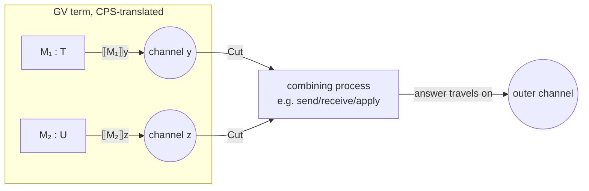

[[book-guidelines|↩ Back to guidelines]]

## Why a translation, and why it has to preserve types

You now know two calculi. GV is a functional language: you write `send`, `receive`, `select`, ordinary `let`-bindings, and channels are just linear values threaded through function calls like any other resource. CP is a process calculus: processes run concurrently, and a channel's type is a session — a protocol that literally changes as communication proceeds. They don't look like the same thing. GV has `λ`, application, pairs. CP has parallel composition, restriction, and a Cut rule that both invokes and *is* communication.

The whole payoff of this paper is that GV doesn't need its own deadlock-freedom proof. If you can translate every well-typed GV program into a well-typed CP process, and CP is deadlock-free (that's [[Commuting-Conversions-and-Cut-Elimination|Theorem 2, top-level cut elimination]]), then GV is deadlock-free too — for free, by inheritance. That's the entire argument of this section. The mechanism doing the inheriting is a **type-preserving translation**, and the theorem that makes the inheritance valid is:

$$
\text{Theorem 3.} \quad \text{If } \Phi \vdash M : T \text{ then } \llbracket M \rrbracket x \vdash \llbracket \Phi \rrbracket^\perp, x : \llbracket T \rrbracket.
$$

If you've built a compiler, or think about elaboration, this is a familiar shape: it's exactly a **type-preservation theorem for a lowering pass**. Every well-typed GV term becomes a well-typed CP process at a *predictable, computed* type. Nothing about this translation is allowed to guess — it's total, syntax-directed, and its correctness is checkable by induction on typing derivations. This is worth dwelling on because it's precisely the kind of theorem you'd want for a real compiler's IR-lowering pass, or for an elaborator's core-language output: "if the surface term type-checked, the compiled term type-checks at the translated type."

## The translation targets derivations, not terms

Here's a wrinkle the paper flags immediately: GV terms don't have unique types. A closed λ-abstraction whose free variables are all unlimited can be typed *either* as a linear function `T ⊸ U` *or* as an unlimited function `T → U` — GV doesn't force you to pick the tightest one (see [[GV-a-Session-Typed-Functional-Language]] for why). So "the translation of term `M`" is ambiguous if you only look at `M` as a bare piece of syntax — you also need to know *which derivation* typed it.

The fix is to define the translation on **type derivation trees**, not on terms. Concretely: instead of writing a function `translate(M)`, Wadler writes a function `translate(D)` where `D` is a proof that `Φ ⊢ M : T`. This has two benefits stated explicitly in the paper: it kills the ambiguity (a derivation always picks one specific typing), and it makes *proving* Theorem 3 nearly free — since the translation is defined by recursion on derivation rules, "preserves types" falls out of the definition rather than needing a separate induction.

If you've used Lean's elaborator, this should feel immediately familiar. Lean doesn't translate *surface syntax* into kernel terms directly — it elaborates against expected types, and the object it hands to the kernel is closer to a fully-annotated derivation than to the string you typed. The kernel's `Expr` already encodes which typing rule justified each subterm. Compiling *derivations* rather than *terms* is the standard move whenever the source language is ambiguous or under-annotated and the target language needs to be unambiguous — you resolve the ambiguity once, during elaboration/typing, and then compile the *resolved* artifact.

## Continuation-passing style: the answer travels on a channel

The other structural decision: term translation is **continuation-passing**. A GV term `M` of type `T` does not translate to "a CP process that behaves like `M`" in some vague sense — it translates to a specific process `⟦M⟧z`, where `z` is a *fresh channel name* standing for "the channel `M`'s result will be delivered on." The typing statement makes this precise:

$$
\Phi \vdash M : T \quad\Longrightarrow\quad \llbracket M \rrbracket z \;\vdash\; \llbracket \Phi \rrbracket^\perp,\, z : \llbracket T \rrbracket
$$

Read the environment translation carefully: GV's `Φ` sits on the *left* of the GV turnstile, but CP has only one-sided sequents, so it moves to the right — and it moves there **dualized**, `⟦Φ⟧⊥`. This is the same "erase the left/right distinction by dualizing" move that turns an intuitionistic two-sided sequent into a one-sided classical one, which you've already seen at the propositional level in [[The-Twist-Reinterpreting-the-Linear-Connectives]] and [[CP-a-Classical-Linear-Logic-Process-Calculus]].

Every clause of the translation, without exception, produces a process ending in a Cut that ultimately delivers something along `z`. This is the standard shape of a CPS translation from a λ-calculus into a process calculus: instead of "the function returns a value," you get "the function *sends* a value on the channel it was given as its continuation." A Rust reader can think of it as: every expression compiles not to "a value" but to a closure that, when run, pushes its result down a channel handed to it — the classic `fn(cont: Sender<T>)` shape rather than `fn() -> T`.

Every arrow into a "channel" bubble in that picture is a Cut. Composite GV terms — application, `send`, pair construction — translate to CP processes that Cut their subterms' translated processes together, wiring intermediate channels between them and threading the final answer out on the outer channel. This is why, mechanically, *every elimination rule in Figure 7 requires a use of Cut*: eliminating a connective in GV (applying a function, deconstructing a pair) is exactly where two independently-translated subprocesses need to be plugged into each other.

## The surprising duality in the session-type translation

Now the part the paper itself calls "surprising." Here is the translation of GV's session types into CP propositions:

$$
\begin{aligned}
\llbracket\, !T.S \,\rrbracket &= \llbracket T \rrbracket^\perp \parr \llbracket S \rrbracket \\
\llbracket\, ?T.S \,\rrbracket &= \llbracket T \rrbracket \otimes \llbracket S \rrbracket \\
\llbracket\, \oplus\{l_i : S_i\}_{i\in I} \,\rrbracket &= \llbracket S_1 \rrbracket \mathbin{\&} \cdots \mathbin{\&} \llbracket S_n \rrbracket \\
\llbracket\, \&\{l_i : S_i\}_{i\in I} \,\rrbracket &= \llbracket S_1 \rrbracket \oplus \cdots \oplus \llbracket S_n \rrbracket \\
\llbracket\, \mathsf{end}_! \,\rrbracket &= \bot \\
\llbracket\, \mathsf{end}_? \,\rrbracket &= 1
\end{aligned}
$$

Look closely at the first line. GV's `!T.S` is the session type for **output**: "send a `T`, then behave as `S`." You'd expect this to translate to CP's `⊗`, the connective [[Output-and-Input-via-the-Multiplicatives|introduced as CP's own output]]. Instead it translates to `⅋` — CP's *input* connective. Every single line does this: GV output (`!T.S`) → CP input-flavored `⅋`; GV input (`?T.S`) → CP output-flavored `⊗`; GV's select (`⊕`) → CP's choice (`&`); GV's offer-choice (`&`) → CP's select (`⊕`). Every operator lands on its *dual*, not its counterpart.

**Why.** The paper's own explanation is the cleanest way to see it, and it's worth internalizing because it's the kind of thing that looks like a notational accident until you trace it through carefully — it isn't. In GV, `send M N` takes the *channel* `N` as an **argument** and hands it a value `M`. In CP, a connective's rule describes what a channel *does as a result* of the process using it — an output rule describes a channel that *outputs* something, from the point of view of that channel's own behavior. Now line these up: `send M N` gives a value **to** `N` — from `N`'s own point of view, `N` is *receiving*, i.e. behaving as an input. So GV's send — which reads, lexically, like "output" — corresponds to the channel *inputting*, which is CP's `⅋`. Symmetrically, `receive M` takes a channel `M` and hands a value back *out* to the surrounding term — from `M`'s own point of view, it *output* that value, so GV's receive corresponds to CP's `⊗`.

The short version: **GV describes channels from the perspective of the caller** (send hands something to the channel; receive gets something from it), while **CP describes channels from the perspective of the channel itself** (an output-typed channel is one that emits). Those two perspectives are duals of each other by construction, so the translation inherits that duality mechanically — it isn't a special case, it's forced.

Reassuringly, duality itself survives the translation intact: session-type duality in GV, $\overline{S}$, corresponds exactly to logical duality in CP:

$$
\llbracket\, \overline{S} \,\rrbracket = \llbracket S \rrbracket^\perp
$$

Also worth noting: the translation dualizes the *sent* type but leaves the *received continuation* type alone — compare $\llbracket !T.S \rrbracket = \llbracket T \rrbracket^\perp \parr \llbracket S \rrbracket$ (only $T$ flips) against how GV's own duality $\overline{!T.S} = {?T.\overline S}$ leaves $T$ completely unchanged. Since $A \multimap B = A^\perp \parr B$ in classical linear logic, the first translation line can equally be written $\llbracket T \rrbracket \multimap \llbracket S \rrbracket$ — reinforcing that a GV output session is, under this translation, "a linear function from the sent value to the continuation."

## Translating types in general

Beyond session types, GV has ordinary function types, tensor products, and `Unit`:

$$
\begin{aligned}
\llbracket\, T \multimap U \,\rrbracket &= \llbracket T \rrbracket^\perp \parr \llbracket U \rrbracket \\
\llbracket\, T \to U \,\rrbracket &= \, !(\llbracket T \rrbracket^\perp \parr \llbracket U \rrbracket) \\
\llbracket\, T \otimes U \,\rrbracket &= \llbracket T \rrbracket \otimes \llbracket U \rrbracket \\
\llbracket\, \mathsf{Unit} \,\rrbracket &= \, !\top
\end{aligned}
$$

The linear-function line is the standard embedding — nothing surprising, $A \multimap B$ is definitionally $A^\perp \parr B$ in classical linear logic, so linear functions translate as you'd hope. The *unlimited*-function line is the interesting one: an unlimited function becomes `!` applied to the linear-function translation. This is one of two well-known ways to embed ordinary (intuitionistic) implication into classical linear logic:

- **Call-by-name** (Girard's original): $(A \to B)^\circ = {!A^\circ} \multimap B^\circ$ — bang the *argument*.
- **Call-by-value** (Benton–Wadler; used here): $(A \to B)^* = \,!(A^* \multimap B^*)$ — bang the whole *function*.

Wadler picks the call-by-value form. If you've studied the difference between CBN and CBV embeddings of intuitionistic logic into linear logic elsewhere, this is the same fork in the road, showing up again at the session-types layer — a nice example of how a seemingly orthogonal design decision (evaluation order) resurfaces as a concrete choice in the type translation. `Unit` translating to `!⊤` rather than the more obviously "empty" `1` is explained by a fact about classical linear logic itself: `1` and `!⊤` are logically bi-implicational (isomorphic in most models), so either choice is semantically sound; `!⊤` is picked here to match the general pattern that *every unlimited GV type translates to something of the form `!A`* — the invariant "$\mathsf{un}(T) \implies \llbracket T \rrbracket = \,!A$ for some $A$" holds uniformly this way.

## Walking the term translation

Figures 7 and 8 give one translation clause per GV typing rule. A handful are worth tracing by hand.

**Variable (`Id`) — the base case.** A GV variable `x : T ⊢ x : T` translates to nothing more than the CP Axiom:

$$
\llbracket\, \overline{x:T \vdash x:T} \,\rrbracket z \;=\; \overline{x \leftrightarrow z \vdash x : \llbracket T \rrbracket^\perp,\, z : \llbracket T \rrbracket} \; \mathsf{Ax}
$$

This is the cleanest possible illustration of "answer travels on a channel": a variable *is* [[CP-a-Classical-Linear-Logic-Process-Calculus#Axiom: forwarding|forwarding]] — whatever arrives on `x` gets retransmitted on `z`, which is exactly what CP's Axiom already means (see [[CP-a-Classical-Linear-Logic-Process-Calculus]]). No computation happens; the CPS shape degenerates to pure relabeling.

**Function abstraction — input.** $\lambda x.N$ translates by binding an input on the answer channel: the translated process for $\lambda x.N$ is $z(x).\llbracket N \rrbracket z$ — receive the argument along $z$ (this is why abstraction lands on `⅋`, CP's input rule), bind it to `x`, then run the (recursively translated) body, still answering on the same `z`. This matches the general pattern noted in the paper: *abstraction and pair-deconstruction both translate to input*, since both are "receive something, then continue."

**Application — the first real Cut.** $LM$ (apply `L` to `M`) needs to combine two independently-translated processes — `⟦L⟧y` (which will eventually offer a function on `y`) and `⟦M⟧x` (which computes the argument) — and connect them. The translation builds this by: taking `⟦M⟧x`, forwarding it via an auxiliary Axiom so it lines up at the right polarity, composing that with `⟦L⟧y` via `⊗` (output — supplying the argument down the function-channel), and then Cutting the whole thing against a `?` step that adapts an unlimited function to be callable linearly. This is denser than variable or abstraction, but the pattern to hold onto is: **wherever GV eliminates a connective (applies a function, deconstructs a pair), the CP translation needs a Cut**, because elimination is precisely the operation of plugging two separately-typed pieces together.

**Send and Receive — the promised payoff of the duality discussion.** Given the inversion explained above, you should now expect `send` to compile to something that behaves like *output* mechanically (even though its session type translated to the `⅋`-flavored side) and `receive` to be nearly trivial. That's exactly what happens:

- $\llbracket\, \mathsf{send}\ M\ N : S \,\rrbracket z$ Cuts `⟦M⟧`'s value together with `⟦N⟧` (the channel) via a CP **output** step ($x[y].(\ldots)$) — mechanically, the translated process really does transmit the value down the channel, using $\otimes$'s process-level output construct, at the type-level position that GV called "input" (`⅋`). The value being sent gets forwarded through an Axiom into the correct polarity first.
- $\llbracket\, \mathsf{receive}\ M : T \otimes S \,\rrbracket z = \llbracket M \rrbracket z$ — **literally unchanged**. Receive's translation is "entirely trivial," per the paper: since the channel $M$ was already typed to *output* a pair (`⟦?T.S⟧ = ⟦T⟧⊗⟦S⟧` in CP terms), receiving from it in GV is nothing more than relabeling — the real input-side process, `x(y).R`, only shows up later, in the translation of `⊗`-elimination (pair deconstruction), which is where a received pair actually gets taken apart.

This confirms the earlier claim concretely: despite the *type-level* dualization, the *process-level* translation of Send genuinely performs an output operation ($x[y].(P \mid Q)$), and the translation of Select genuinely performs a selection ($x[\mathsf{in}_j].P$), and Case genuinely performs a choice ($\mathsf{case}(Q_1,\ldots,Q_n)$). The duality lives entirely in how the *type* is stated, not in what the *process* does.

**Connect and Terminate — the units, and a genuine new Cut.** `with x connect M to N` creates a fresh channel and runs `M` and `N` concurrently at dual types — its translation is a Cut that introduces exactly that fresh channel, connecting `⟦M⟧`'s translation (ending in an empty output `y[].0`, since `M`'s channel side has type $\mathsf{end}_! \to \bot$) against `⟦N⟧`'s translation. `terminate M` deallocates an exhausted channel and returns `Unit`; its translation is a Cut against an empty input `x().P`, landing at the `!⊤`/`0`-flavored corner that makes `Unit`'s `!⊤` translation click into place.

## Theorem 3 and what it actually buys you

$$
\text{If } \Phi \vdash M : T \text{ then } \llbracket M \rrbracket x \;\vdash\; \llbracket \Phi \rrbracket^\perp,\, x : \llbracket T \rrbracket.
$$

The proof is by induction on the typing derivation — literally "read off Figures 7 and 8, rule by rule," because each clause was *designed* so that the translated process's typing follows immediately from the translated subprocesses' typings. This is the sense in which defining the translation on derivations rather than terms "makes it easy to validate that the translation preserves types": there's no separate inductive argument to construct after the fact, the induction *is* the definition.

What this buys, concretely: since $\llbracket M \rrbracket x$ is always a well-typed CP process, and every well-typed CP process is guaranteed race- and deadlock-free by [[Commuting-Conversions-and-Cut-Elimination|top-level cut elimination]], **every well-typed GV program compiles to a race- and deadlock-free CP process.** GV never needed its own progress/preservation proof — it inherits CP's, through the translation, for the price of checking that the translation is type-preserving (which is exactly Theorem 3). This is the general shape of "prove a property once on a core calculus, then get it for free on every surface language that compiles into it soundly" — the same strategy you'd use if you wanted a Rust-embedded DSL to inherit Rust's memory-safety guarantees by compiling into safe Rust rather than proving safety independently.

One honest caveat, stated by the paper itself: this only shows the translation preserves *typing*. GV's own *intended* operational semantics (Gay and Vasconcelos's original system uses **asynchronous buffered** communication, which is a strictly more permissive execution model than CP's synchronous rendezvous) isn't formally related to CP's semantics here — Wadler explicitly leaves a formal correspondence proof (i.e., that running a GV program directly gives "the same answers" as running its CP translation) to future work. Type preservation is airtight; full semantic correspondence is a conjecture, not yet a theorem.

## Where this leads

This translation is the paper's second Curry-Howard payoff, sitting right next to the first: [[The-Curry-Howard-Correspondence-for-Concurrency|CP's cut elimination gives deadlock freedom for CP itself]]; this translation transports that guarantee sideways into a *programming language* a working functional programmer would actually recognize. If you're thinking about the elaborator project — resolving implicit arguments via metavariable unification — the CPS-on-derivations technique here is a close cousin of what an elaborator does: both take an *ambiguous surface artifact* (a GV term with non-unique typing; a surface term with implicit holes) and produce an *unambiguous, fully-typed target* by working over the elaborated/derivation structure rather than the raw syntax, with a type-preservation theorem as the correctness contract. And if you ever need to lower a checked surface language into a smaller verified core for the Rust verifier project, this section is a fully worked example of exactly that move, including the honest discipline of stating precisely what the translation does and does not (yet) prove.
