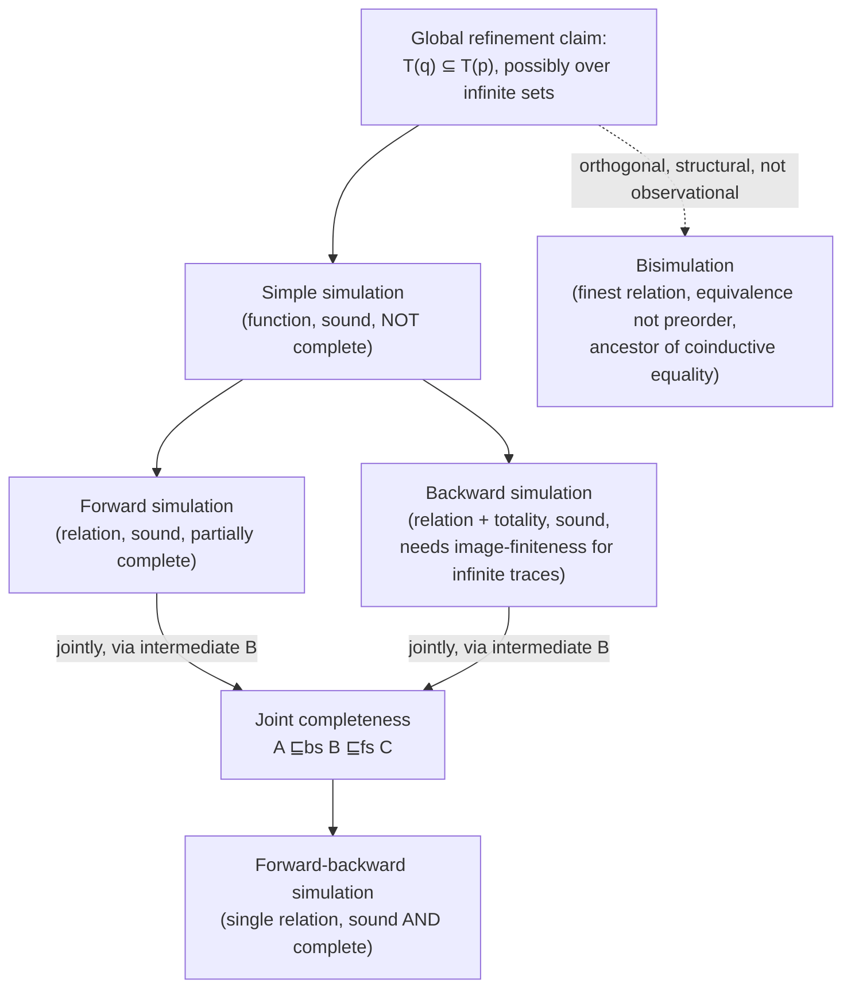

[[book-guidelines|↩ Back to guidelines]]

## From "define the relation" to "prove the relation holds"

Chapter 1 ([[Refinement-as-Reduction-of-Non-Determinism-and-Behavioural-Consistency|topic 1]], [[Labelled-Transition-Systems-and-the-Spectrum-of-Observational-Refinement|topic 2]]) gave you an entire spectrum of refinement relations, every one of them phrased as *set inclusion between observation sets*: $\mathcal{T}(q) \subseteq \mathcal{T}(p)$, $\mathcal{F}(q) \subseteq \mathcal{F}(p)$, and so on. That's a clean *definition*, but it's a terrible *proof obligation* whenever the observation sets are infinite (which they usually are — any system with a loop has infinitely many traces). You cannot enumerate two infinite sets and check inclusion by hand.

This chapter introduces the fix: **simulations**. A simulation is a relation between the states of the concrete and abstract systems — check it locally, state by state, transition by transition — and a *soundness theorem* tells you that if the local, finite check succeeds, the global, infinite-set inclusion holds automatically. This is the single most important proof technique in the entire book, and it's the direct ancestor of the technique you'll need to prove soundness of a type checker or an abstract interpreter against its semantics: **never verify a global property by enumerating an infinite set of behaviours; verify a local, inductive invariant and let an induction principle lift it to the whole (possibly infinite) execution space.**

## Automata: LTS plus multiple starts and an internal action

The chapter's semantic model is barely different from Chapter 1's LTS — deliberately so, to isolate what's new (simulations) from what's incidental (the underlying transition-system formalism):

$$A = (States, Act, T, Start)$$

Two differences from Definition 1.1's LTS: (1) $Start \subseteq States$ can have more than one initial state, and (2) $Act$ includes a distinguished silent action $\tau$ — a transition the environment cannot observe. Write $\hat{\rho}$ for a trace $\rho$ with all $\tau$'s deleted; observable trace refinement is stated in terms of $\hat{\rho}$, not $\rho$ directly.

```rust
struct Automaton<S, A> {
    states: Vec<S>,
    start: Vec<S>,               // multiple initial states allowed
    transitions: Vec<(S, Option<A>, S)>, // None == τ, the internal/silent action
}
```

The `τ` action is the formal seed of a distinction that becomes central starting in Chapter 5 ([[Perspicuity-Error-Behaviour-and-Divergence|later topic]]): internal, unobservable computation versus externally visible behaviour. It's the same distinction as a "step" relation in an operational semantics that includes both user-visible reductions and internal bookkeeping (garbage collection, thunk forcing) that a well-behaved semantics must let you *ignore* when comparing observable outcomes.

Because start states can now be infinite and states can branch infinitely, the book names the well-behavedness condition it needs explicitly: an automaton has **finite invisible non-determinism (`fin`)** if $Start$ is finite and every state is finitely branching. This is exactly **image-finiteness** from the previous topic, generalized to multiple start states, and it recurs as the hypothesis unlocking every "finite implies infinite" result in this chapter (Proposition 2.1: with `fin`, finite-trace refinement and full (finite+infinite) trace refinement coincide) — the same König's-lemma-flavored compactness argument as before.

## Simple simulation: the first, weakest local check

The most basic simulation reduces the "corresponding states" idea to its simplest form: a *function* from concrete states to abstract states.

$$R : States(C) \to States(A), \qquad \begin{cases} s \in Start(C) \Rightarrow R(s) \in Start(A) \\ s \xrightarrow{a}_C s' \Rightarrow R(s) \xRightarrow{a}_A R(s') \end{cases}$$

Written $A \sqsubseteq_{SS} C$. This is **sound**: $A \sqsubseteq_{SS} C \Rightarrow A \sqsubseteq_{tr} C$ — if you can exhibit such a function, trace refinement is guaranteed, full stop, no need to touch the (possibly infinite) trace sets directly. But it's **not complete**: Example 2.2 exhibits two automata with *identical* trace sets where a simple simulation exists in one direction but not the other. A function is too rigid a shape — real refinement proofs need a genuine *relation*, because one concrete state can legitimately correspond to several abstract states (or vice versa) depending on non-deterministic history.

```rust
// A simple simulation, as literally a Rust function — this is the
// weakest, most direct translation of Definition 2.4.
fn simple_simulation<SC, SA: PartialEq>(
    r: impl Fn(&SC) -> SA,
    concrete: &Automaton<SC, String>,
    abstract_: &Automaton<SA, String>,
) -> bool {
    let starts_ok = concrete.start.iter().all(|s| abstract_.start.contains(&r(s)));
    // + a check that every concrete transition (s,a,s') maps to a matching
    //   abstract transition (r(s), a, r(s')) — omitted here for brevity,
    //   this is the per-transition obligation the book calls "soundness by construction."
    starts_ok
}
```

## Forward and backward simulation: the real workhorses

Generalize the function $R$ to an arbitrary *relation* between concrete and abstract states — often called a **retrieve relation**, **abstraction relation**, or **coupling invariant** — and you get the two central techniques of the whole book.

**Forward simulation**: start with a related pair, step the *concrete* system forward, require a matching abstract step exists that keeps the *post*-states related.

$$\begin{cases} s \in Start(C) \Rightarrow R(\![\{s\}]\!) \cap Start(A) \neq \emptyset \\ s \xrightarrow{a}_C s',\ t \in R(\![\{s\}]\!) \Rightarrow \exists t' \in R(\![\{s'\}]\!).\; t \xRightarrow{a}_A t' \end{cases}$$

**Backward simulation**: dual — start with related *post*-states, step the concrete system *backward* one transition, require the corresponding abstract pre-states are also related, **and additionally require $R$ to be total on $States(C)$** — every concrete state must be related to *some* abstract state.

$$\begin{cases} s \in Start(C) \Rightarrow R(\![\{s\}]\!) \subseteq Start(A) \\ s \xrightarrow{a}_C s',\ t \in R(\![\{s'\}]\!) \Rightarrow \exists t \in R(\![\{s\}]\!).\; t \xRightarrow{a}_A t' \\ R \text{ is total on } States(C) \end{cases}$$

### Why the asymmetry: totality, and finite futures vs. finite pasts

This totality clause is not cosmetic. **Without it, the empty relation trivially "verifies" refinements that don't actually hold** — vacuous truth strikes if $R$ never relates anything, so backward simulation must force $R$ to actually say something about every concrete state to mean anything. Forward simulation needs no such clause because its obligations are only ever invoked *when* a concrete transition happens to exist — there's no equivalent vacuous escape hatch in the forward direction.

The second asymmetry is subtler and more interesting: **backward simulation additionally needs *image-finiteness* for soundness on infinite traces** ($A \sqsubseteq_{ibs} C \Rightarrow A \sqsubseteq_{tr} C$, using the image-finite variant `ibs`, vs. plain $A \sqsubseteq_{bs} C \Rightarrow A \sqsubseteq_{tr^*} C$ only for *finite* traces without it). The book's explanation is worth internalizing directly: **a future execution can genuinely be infinite, but any backward-looking argument only ever explores finite executions** — you're always reasoning about "how did we get here," and "here" was reached in finitely many steps. Lifting a backward argument to cover infinite futures needs the extra compactness that image-finiteness (a König's-lemma-shaped hypothesis) supplies; forward simulation gets this for free because it's already reasoning step-by-step *into* the future, infinite or not.

```lean
-- The retrieve relation, as a Lean-native binary relation between state
-- spaces — this is the shape you'd actually reuse for a compiler's
-- abstraction-relation-based soundness proof (concrete semantics vs.
-- abstract domain).
structure ForwardSim (SC SA Act : Type) (init : ForwardSim → Prop) where
  R : SC → SA → Prop
  step : Act → SC → SC → Prop
  stepA : Act → SA → SA → Prop
  init_ok : ∀ s, s ∈ startC → ∃ t, t ∈ startA ∧ R s t
  sim_ok  : ∀ s s' t a, step a s s' → R s t → ∃ t', stepA a t t' ∧ R s' t'

-- Backward simulation additionally demands totality of R:
structure BackwardSim (SC SA Act : Type) extends ForwardSim SC SA Act where
  total : ∀ s, ∃ t, R s t   -- the clause that rules out the vacuous ∅ relation
```

This is structurally *exactly* the soundness proof obligation for a **retrieve function in a refinement-type verifier**: your compiler's abstraction relation between concrete program states and abstract-interpretation domain elements needs precisely a forward-simulation-shaped inductive step (concrete transition ⟹ matching abstract transition preserving the relation) to be sound, and if your abstract domain ever needs to reason about "what pre-states could have led here" (e.g. backward analysis, weakest-precondition computation), you inherit backward simulation's totality-and-image-finiteness caveats verbatim.

## Neither is complete alone — and the fix is genuinely important

Example 2.6 is the chapter's centerpiece counterexample: $A$ admits "$\geq 1$ $a$'s then $b$ or $c$", $C$ admits "$\geq 2$ $a$'s then $b$ or $c$." Every trace of $C$ is a trace of $A$, so $A \sqsubseteq_{tr} C$ genuinely holds — but **no single forward simulation and no single backward simulation can witness it.** The proof needs *two* simulation steps through an intermediate specification $B$: $A \sqsubseteq_{bs} B \sqsubseteq_{fs} C$.

This generalizes into **Theorem 2.4 (Joint completeness)**: whenever $A \sqsubseteq_{tr^*} C$ holds, *some* intermediate $B$ exists making $A \sqsubseteq_{bs} B \sqsubseteq_{fs} C$ true (and with `fin`, the image-finite variant $A \sqsubseteq_{ibs} B \sqsubseteq_{fs} C$). Forward and backward simulation are jointly complete — together, with one intermediate step, they can verify *any* trace refinement — even though each is individually incomplete.

### Forward-backward simulation: folding the intermediate step into one relation

Rather than always constructing an intermediate specification by hand, **Definition 2.7** packages the two-step argument into a single relational shape: a relation $R$ from *sets* of abstract states (elements of $\mathcal{P}_1(States(A))$, sets of size at most 1 — a slight generalization admitting "no valid abstract state yet") to concrete states, with obligations that route through a set $T$ of abstract states rather than a single one. This single relation is proved both **sound** (Theorem 2.5) and, crucially, **complete** (Theorem 2.6): $A \sqsubseteq_{tr^*} C \Rightarrow A \sqsubseteq_{fb} C$ always, and with `fin`, $A \sqsubseteq_{tr} C \Rightarrow A \sqsubseteq_{ifb} C$.

**This is the completeness result you actually want as an implementor.** A verification technique that's sound but not complete means real, correct refinements exist that your checker will fail to certify — a serious usability problem for any proof-search or elaboration engine (you don't want your unifier declaring failure on definitionally-equal terms just because your algorithm's search strategy happened not to find the right relation). Forward-backward simulation is the book's way of saying: *this* technique, done right, never has that gap — it can verify literally every trace refinement that holds, given the right relation. The catch, as always with completeness theorems, is that it tells you such an $R$ *exists*, not how to *find* it — exactly the same gap between "a most general unifier exists" and "here's an algorithm that finds it" that Miller pattern unification closes for a *restricted* fragment of higher-order unification. Simulation-existence proofs and unification-existence proofs are, at this level of abstraction, the same kind of completeness claim.

## Bisimulation: the finest relation, defined structurally rather than observationally

Every relation up to this point — trace, failures, readiness, and now simple/forward/backward/forward-backward simulation — is fundamentally about *verifying an inclusion of observation sets*. **Bisimulation is different in kind**: it's not defined via any observation set at all, but directly as a *symmetric* simulation condition — both processes must be able to simulate each other **using the same relation $R$**:

$$\begin{cases} p\,R\,q \wedge p \xrightarrow{a} p' \Rightarrow \exists q'.\; q \xrightarrow{a} q' \wedge p'\,R\,q' \\ p\,R\,q \wedge q \xrightarrow{a} q' \Rightarrow \exists p'.\; p \xrightarrow{a} p' \wedge p'\,R\,q' \end{cases}$$

Two processes are **bisimilar**, $p \equiv q$, if such an $R$ relates them. Because the condition is symmetric by construction, bisimulation is an **equivalence relation**, not merely a preorder — it doesn't induce a separate refinement direction the way trace/failures/readiness do. It is also, provably, the **finest relation in the entire spectrum** (Proposition 2.3: bisimilarity implies every weaker relation, including trace refinement, in both directions simultaneously) — it can distinguish processes that trace refinement, failures refinement, and even ready-trace refinement all consider equivalent. Example 2.9 exhibits two trace-equivalent systems with *no* bisimulation relating them: bisimulation additionally cares about *when*, structurally, non-determinism resolves, not merely which final observation sequences are possible.

### Why this matters for your elaborator, directly

If you've internalized Lean's or any modern proof assistant's approach to definitional equality, **bisimulation is the closest concept in this book to what your kernel's `isDefEq`/reduction-based equality check is actually doing.** Definitional equality between two terms isn't "do they reduce to syntactically identical normal forms" in general (that's closer to trace equivalence — comparing a flattened observable outcome) — for equality *up to* unfolding of recursive definitions, coinductive types, or infinite/lazy structures, what you actually need is a **bisimulation-style co-inductive equality check**: two terms are equal if there's a relation containing the pair, closed under one step of unfolding on both sides, exactly Definition 2.8's shape. This is precisely how equality is defined for coinductive types (streams, infinite processes) in Lean/Coq/Agda — "greatest fixed point of a step-matching relation" is bisimulation by another name. Filing this connection now will save you real confusion later when you're implementing equality checking for any lazy or coinductive structure in your compiler's type theory.

## Where this leads



This chapter's proof technique — local, state-by-state relational checks that soundly (and, combined right, completely) certify a global inclusion of infinite observation sets — is the mechanism the rest of the book reuses relentlessly: Chapter 4's relational data-refinement simulations, Chapter 7's Z simulation rules, Chapter 8's Event-B guard-strengthening conditions, and Chapter 9's process-algebra-to-relational embeddings are all, structurally, forward and backward simulation dressed in a different domain's notation. For your own project, this is the *template* for how a soundness proof between your language's concrete operational semantics and its abstract-interpretation domain should be structured: define a retrieve/abstraction relation, discharge a forward-simulation-shaped local obligation (or a backward one, if you need totality and are willing to pay the image-finiteness price), and get a global soundness theorem for free rather than trying to reason about infinite trace sets directly.
