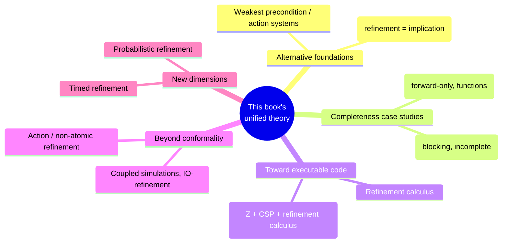

[[book-guidelines|↩ Back to guidelines]]

## The book's arc, in one paragraph

Before pointing outward, it's worth naming the shape of what you've actually built up across eleven chapters, because the survey in this final chapter only makes sense against that backdrop. Part I ([[Refinement-as-Reduction-of-Non-Determinism-and-Behavioural-Consistency|Ch. 1]]–[[Perspicuity-Error-Behaviour-and-Divergence|5]]) established two independent foundations — observation-set refinement over LTS/automata, and relational data refinement over ADTs — plus the machinery (simulations, divergence, perspicuity) needed to make either one checkable. Part II ([[Process-Algebras-CSP-LOTOS-and-CCS|6]]–[[Event-B-and-Abstract-State-Machines-ASM|8]]) showed both foundations *actually deployed* in real, industrially-used languages: CSP/LOTOS/CCS realizing the observational track, Z/B/Event-B/ASM realizing the relational track. Part III ([[Relating-Process-Algebraic-and-Relational-Refinement|9]]–[[Process-Data-Types-A-General-Model-of-Concurrent-Refinement|11]]) proved the two tracks are reconcilable — every process-algebra relation is data refinement under the right finalisation, and one general $(N,B,D)$-partitioned model subsumes every special case built along the way. **This closing chapter's job is to draw the boundary of that achievement precisely**: what does this unified theory *not* cover, and where would you go to learn the parts it deliberately left out?

For a reader building a refinement-type compiler, this chapter functions as a **curated pointer list to the next layer of literature** — treat it that way rather than as new theory to master in depth. What follows extracts the load-bearing distinctions and connects each to where they'll actually matter for your project.

## Weakest-precondition semantics: the alternative foundation you already touched

The book's relational semantics ([[State-Based-and-Relational-Models-of-Refinement|Ch. 4]] onward) is not the only possible foundation for state-based refinement — **predicate transformer (weakest precondition) semantics** is the other major tradition, and you already saw a slice of it directly: [[State-Based-Specification-Languages-Z-and-B|Chapter 7's]] B-Method proof obligations were stated *entirely* in `[S]P` terms, with no relational detour at all. The chapter names **action systems** (Back & Kurki-Suonio) as the paradigmatic notation built natively on this foundation, rather than translating into it as an afterthought.

The relationship between the two foundations is worth being precise about, since it directly answers a design question your own compiler will face: **a relation and a predicate transformer are two different encodings of the same underlying mathematical content** — a total relation $R \subseteq State \times State$ corresponds exactly to the predicate transformer $wp(S, P) = \{s \mid \forall s'.\, (s,s') \in R \Rightarrow s' \in P\}$ (demonic/universal reading) or its angelic dual (existential reading). Neither is more expressive than the other for the deterministic/total case; the *practical* difference is which one composes more conveniently with the proof style you're actually using — relational composition is algebraically cleaner for reasoning about simulations and data types as first-class objects (which is why this book, being about refinement *relations between specifications*, leans relational throughout); predicate-transformer composition is cleaner for reasoning about *programs* directly, statement by statement, which is why VC generators, B, and the refinement calculus (below) all lean WP-flavored. **For your compiler's internals, expect to want both**: a relational semantics as the specification-level ground truth for what a refinement-type contract *means*, and a WP-style predicate transformer as the practical VC-generation algorithm your checker actually runs, with a proven correspondence theorem between them playing the same role Chapters 9–11 played for process algebra vs. relational refinement.

## VDM and Object-Z: two data points on the completeness spectrum

Two named comparisons sharpen a lesson already seen twice in this book. **VDM** (Vienna Development Method) restricts its forward simulations to **total surjective functions** and has no backward simulation at all — the chapter states plainly that this combination is *incomplete*, echoing [[State-Based-Specification-Languages-Z-and-B|B's]] own forward-only gap from Chapter 7. **Object-Z**, by contrast, uses the full relational theory with the **blocking** interpretation — which you already know, from [[State-Based-Specification-Languages-Z-and-B|Chapter 7's]] Example 7.4, is provably *incomplete under standard simulation rules*, in contrast to standard Z's non-blocking completeness. **Two independent, real, deployed formalisms both ended up incomplete, for two structurally different reasons** — VDM by restricting the simulation *shape* (functions, no backward direction), Object-Z by choosing the *interpretation* (blocking) that the general theory proves loses joint completeness. Neither incompleteness was a mistake exactly — both were reasonable engineering trade-offs given each language's other design goals — but both are now documented, provable facts about those systems, not folklore. **When you eventually decide your own refinement-type checker's completeness posture, this is the reference class you're joining**: a real, useful, shippable formal method is not disqualified by being incomplete, as long as the incompleteness is *known, characterized, and deliberate* rather than accidental.

## The refinement calculus: refining specifications all the way down to code

This is the piece of the landscape most directly relevant to a compiler, because it's the one branch of the literature explicitly aimed at **stepwise refinement of a specification into executable code**, which every other formalism in this book treats as out of scope (Z and B stop at "implementation machine," a still-abstract artifact).

The refinement calculus's core unit is the **specification statement**: $w : [Pre, Post]$ — a frame $w$ (which variables may change), a precondition, and a postcondition, read as "begins in a state satisfying $Pre$, ends in a state satisfying $Post$, touching only variables in $w$." **This is, essentially verbatim, the Hoare-triple contract shape your compiler's core IR needs** — and the refinement calculus's contribution is a *calculus of laws* for mechanically transforming a specification statement into ordinary imperative code (sequencing, assignment, conditionals, loops), each law justified by a weakest-precondition soundness argument, so that "refine this contract into code" becomes a sequence of small, individually-checkable, syntax-directed rewriting steps rather than one large opaque verification obligation.

```lean
-- The refinement calculus's specification statement, directly as a
-- Lean structure — this is close to what your IR's "unelaborated
-- contract node" should look like before code-generation refines it away.
structure SpecStatement (State : Type) where
  frame : List String          -- which variables this statement may touch
  pre : State → Prop
  post : State → State → Prop  -- relates before/after, respecting the frame

-- A refinement law, e.g. "specification statement refines to an
-- assignment", is exactly a soundness theorem: the concrete code's
-- Hoare triple must imply the abstract specification statement's.
theorem assign_refines (x : String) (e : State → Nat) (spec : SpecStatement State) :
    (∀ s, spec.pre s → spec.post s (s.update x (e s))) →
    True := fun _ => trivial  -- schematic: the real law lives in your VC calculus
```

**Circus** (Cavalcanti, Woodcock, Sampaio) is named as the integration point that matters most for a reader interested in *both* state and concurrency in one refinement theory: it combines Z's state-based specification, CSP's process algebra, and the refinement calculus's code-level laws into one language, grounded in Hoare and He's Unifying Theories of Programming. **If your language ever needs to refine a concurrent, stateful contract all the way down to executable code in one coherent theory** (rather than treating the state-refinement and process-refinement halves as separately verified and hoping they compose), Circus is the direct precedent to study next — it is, in a real sense, the synthesis this entire book has been building toward, just outside its scope.

## TLA+: refinement as implication between temporal formulas

The book flags **TLA+** (Temporal Logic of Actions, Lamport) as a genuinely different foundational style worth knowing exists, even though this book doesn't develop it: rather than defining refinement via simulations or relational inclusion, TLA+ specifications are temporal-logic formulas, and **refinement is just logical implication between them** — a concrete system refines an abstract one exactly when the concrete formula implies the abstract formula, as ordinary logical entailment. This is worth flagging because it's a genuinely different *proof technology*, not just different notation: instead of constructing a retrieve relation and discharging simulation-shaped side conditions, you're doing implication-checking in a temporal logic, which brings a different toolchain (model checkers like TLC, theorem-provers for temporal logic) into play. **If your project's verification backend ever wants to reason about liveness/fairness properties directly** (rather than encoding them indirectly through the safety-flavored machinery this book builds throughout), TLA+'s style — refinement as formula implication in a logic that natively expresses "eventually" and "always" — is a structurally different, worth-knowing-exists alternative to everything built here.

## Action / non-atomic refinement: dropping conformality all the way

[[Event-B-and-Abstract-State-Machines-ASM|Chapter 8]] already showed Event-B and ASM dropping strict conformality (splitting, merging, $m$:$n$ steps). The chapter closes the loop by naming the fully general version of this idea: **action refinement**, where one abstract action refines into an arbitrary *process* (not just a sequence, potentially with internal concurrent structure of its own), and the central open research question the book flags is **finding a semantic equivalence that is a congruence with respect to action refinement** — recall from [[Process-Algebras-CSP-LOTOS-and-CCS|Chapter 6]] that even *ordinary* weak bisimulation famously fails to be a congruence for choice; action refinement raises the stakes on exactly that same congruence-preservation question.

For the **state-based** side, the chapter names two specific techniques worth remembering by name if you ever need them: the simplest approach requires all-but-one of the concrete operations in a refining sequence to **refine skip** (directly [[Perspicuity-Error-Behaviour-and-Divergence|Chapter 5's]] perspicuous-operation machinery, reused); the more general **coupled simulations** technique drops even that restriction, via **IO-refinement**, which allows the abstract operation's inputs and outputs to be *distributed* across several concrete operations in the decomposition rather than requiring one concrete operation to carry the whole input/output signature. **This distributed-IO idea is directly relevant if your compiler ever needs to refine one abstract API call into several concrete calls that jointly consume its inputs and jointly produce its outputs** — e.g., an abstract "transfer funds" operation refining into separate concrete "debit" and "credit" calls, where the abstract operation's two inputs (source amount, destination amount) get split one-to-each across the two concrete operations. Coupled simulations are the named, citable technique for proving that kind of decomposition sound.

## Timed and probabilistic refinement: two dimensions the whole book has left implicit

Two final generalizations, named without deep treatment, both worth flagging as things you will eventually need if your target system involves real-time guarantees or randomized algorithms:

**Timed refinement** extends the relational model with explicit time, and the chapter specifically contrasts two ways refusal information can be time-indexed: a **timed failure preorder** (refusals recorded only at the *end* of a trace, echoing this book's own end-of-trace failures refinement) versus richer models recording refusals **throughout** the trace (closer to failure-*trace* refinement) — the latter needed specifically because of how internal-event urgency (**maximal progress**: an internal action, once enabled, must fire immediately, no dawdling) interacts with hiding in timed process algebras. **If your compiler ever targets real-time or WCET-bounded code, this maximal-progress assumption is exactly the kind of subtle timing-semantics decision that needs to be made explicit and consistent** — precisely the same "decide the semantics before deriving refinement" discipline this entire book has modeled, just with an added time dimension.

**Probabilistic refinement** generalizes non-determinism to probability distributions over outcomes, with the chapter naming McIver and Morgan's calculus as the mature reference for combining non-determinism *and* probability in one refinement/abstraction theory (their work builds directly on the same demonic-predicate-transformer tradition as B's weakest preconditions, generalized to expected-value reasoning). **This is squarely relevant to your project's Constraint Satisfaction Programming kernel and any future probabilistic invariant-generation or randomized-testing component** — if your abstract interpretation ever needs to reason about *probabilistic* guarantees (e.g., "this randomized algorithm terminates with probability 1," or bounding failure probability of a randomized data structure), the McIver-Morgan framework is the established generalization of exactly the weakest-precondition machinery you already have from [[State-Based-Specification-Languages-Z-and-B|Chapter 7's]] B-Method, extended to handle expectation rather than just Boolean truth.

## Where this leads: closing the loop back to your project



Read as a whole, this book gives you a genuinely complete, load-bearing core: observation-based and relational refinement, proved reconcilable, with simulation as the universal verification technique, and blocking/non-blocking/refusal/divergence handling all unified into one general model by [[Process-Data-Types-A-General-Model-of-Concurrent-Refinement|Chapter 11]]. What this closing survey tells you, plainly, is **where the edges of that core are** — and for your compiler project specifically, the most load-bearing next readings named here are the **refinement calculus and Circus** (the direct bridge from contract to code that this book stops short of), **coupled simulations / IO-refinement** (for decomposing one abstract contract into several concrete operations, which any real optimizing or lowering compiler pass will eventually need), and **McIver-Morgan's probabilistic calculus** (the natural extension of the weakest-precondition machinery you've now seen twice — in B, and in the refinement calculus — to the probabilistic reasoning your CSP/invariant-generation components will eventually require). Everything else in this survey — VDM, Object-Z, RAISE, Alloy, TLA+, timed refinement — is worth knowing exists, and worth returning to by name when a specific need arises, but the theory *in* this book, now that you've built it end to end, is already the load-bearing foundation underneath all of them.
