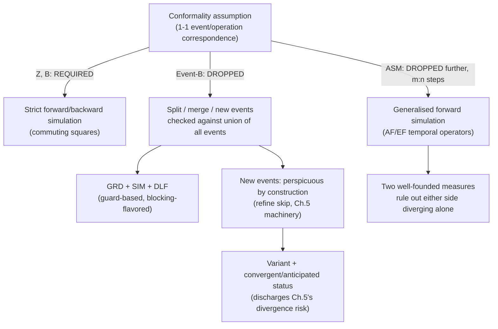

[[book-guidelines|↩ Back to guidelines]]

## Dropping the assumption every prior chapter quietly relied on

Every refinement theory so far — LTS, automata, relational ADTs, Z, B — assumed **conformality**: abstract and concrete systems share the same alphabet of named events/operations, in strict 1–1 correspondence. This chapter's central move, in both Event-B and ASM, is to **drop that assumption entirely**. One abstract event can be refined by several concrete events (**splitting**); several abstract events can collapse into one concrete event (**merging**); entirely new events, invisible abstractly, can appear (a formalized, disciplined version of [[Perspicuity-Error-Behaviour-and-Divergence|Chapter 5's]] perspicuous operations); and in ASM, a single abstract step can correspond to a variable, unbounded-in-advance number of concrete steps, not just one. **This is precisely the flexibility your elaborator will need** the moment a single abstract contract operation gets refined into multiple concrete implementation steps, or several abstract API calls collapse into one optimized concrete routine — a scenario any real compiler pipeline hits constantly and that strict conformality cannot express.

## Event-B: machines and contexts, guards instead of preconditions

Event-B splits a specification into **contexts** (static: carrier sets, constants, axioms) and **machines** (dynamic: variables, invariant, events, an optional variant). An event has the template:

```
eventname
  status ...      -- ordinary | convergent | anticipated
  refines ...      -- list of events this one refines (not necessarily 1-1!)
  when G(v)        -- guard
  then v :| BA(v, v')  -- action, possibly non-deterministic
end
```

Two proof obligations make a machine internally consistent — directly analogous to [[State-Based-Specification-Languages-Z-and-B|B's]] machine consistency conditions, but phrased per-event rather than needing a schema-calculus derivation:

$$\textbf{INV: } I(v) \wedge G(v) \wedge BA(v,v') \Rightarrow I(v') \qquad \textbf{FIS: } I(v) \wedge G(v) \Rightarrow \exists v'.\, BA(v,v')$$

**INV** is invariant preservation; **FIS** is feasibility — the guard must actually guarantee a legal after-state exists (this is [[State-Based-and-Relational-Models-of-Refinement|Chapter 4's]] "magic operation" hazard from the explicit-guards callout box, made into an explicit, mandatory, per-event proof obligation rather than a background caveat). An optional **deadlock-freedom** obligation requires at least one guard to hold at every reachable point — progress is always possible somewhere.

```lean
-- Event-B's per-event proof obligations, directly as Lean goals your
-- elaborator's contract checker would need to discharge per operation.
structure EventB (V : Type) where
  invariant : V → Prop
  guard : V → Prop
  action : V → V → Prop  -- possibly non-deterministic relation

def INV (e : EventB V) : Prop :=
  ∀ v v', e.invariant v → e.guard v → e.action v v' → e.invariant v'

def FIS (e : EventB V) : Prop :=
  ∀ v, e.invariant v → e.guard v → ∃ v', e.action v v'
```

## Refinement without conformality: guards get their own rule

Rather than deriving simulation rules abstractly and then instantiating (as [[State-Based-Specification-Languages-Z-and-B|Z's Chapter 7]] did), this chapter *builds* the relational framework from scratch for Event-B, because the observations are genuinely different: **traces of states**, not traces of events (closer to CSMATs' state-trace semantics, [[State-Based-and-Relational-Models-of-Refinement|Chapter 3]], than to LTS event-traces) — and deadlock (completed traces) is explicitly observable, echoing [[Labelled-Transition-Systems-and-the-Spectrum-of-Observational-Refinement|Chapter 1's completed-trace refinement]]. Dropping event names from the observation is precisely what *permits* dropping conformality: if "which event fired" was never part of what's observable, splitting/merging events can't possibly change what's observable, only *how many steps* it took to get there.

The forward-simulation obligations that fall out (**Definition 8.1**), given a **gluing invariant** $J(v,w)$ (Event-B's name for retrieve relation / linking invariant), abstract invariant $I(v)$, abstract guard/action $G_i, BA_i$, and concrete guard/action $H_i, CBA_i$:

$$\begin{cases}
\textbf{INV\_INIT: } N(w) \Rightarrow \exists v.\, K(v) \wedge J(v,w) \\
\textbf{FIS\_REF: } I(v) \wedge J(v,w) \wedge H_i(w) \Rightarrow \exists w'.\, CBA_i(w,w') \\
\textbf{GRD: } I(v) \wedge J(v,w) \wedge H_i(w) \Rightarrow G_i(v) \\
\textbf{SIM: } I(v) \wedge J(v,w) \wedge H_i(w) \wedge CBA_i(w,w') \Rightarrow \exists v'.\, BA_i(v,v') \wedge J(v',w') \\
\textbf{DLF: } I(v) \wedge J(v,w) \wedge (G_1(v) \vee \cdots \vee G_n(v)) \Rightarrow (H_1(w) \vee \cdots \vee H_n(w))
\end{cases}$$

**GRD (guard strengthening) is the sharpest thing to notice here, and it inverts your intuition if you're coming from a Liskov-substitution mindset.** It says: *whenever the concrete guard holds, the abstract guard must also have held* — the concrete operation may not become enabled in strictly more situations than the abstract one promised. This looks backwards next to [[State-Based-Specification-Languages-Z-and-B|Z's applicability condition]] ("abstract precondition ⇒ concrete precondition," i.e. the concrete side may accept *more*) until you recognize the semantic difference: **Event-B's guards are the blocking interpretation's guards** — an event genuinely *cannot fire* outside its guard, so a concrete event enabled in a state the abstract system would have refused is a state where the concrete system does something the abstract system never sanctioned at all — an illegal new possibility, not a legally-broadened contract. This is the operational cash value of the blocking-vs-non-blocking distinction from [[State-Based-and-Relational-Models-of-Refinement|Chapter 4]]/[[State-Based-Specification-Languages-Z-and-B|Chapter 7]]: **the direction of the precondition-comparison inequality flips depending on which interpretation you're in**, and Event-B's guard-based semantics locks in the blocking reading by construction, unlike Z's non-blocking default. If your refinement-type system supports both guarded (blocking) and contract-style (non-blocking) operations, you need *both* inequality directions available, keyed to which interpretation an operation uses — using the wrong one silently inverts your soundness argument.

DLF (relative deadlock freedom) rules out the degenerate "refine everything to a machine that never fires" move, the Event-B analogue of trace refinement's `stop`-refines-everything problem — a live concern precisely *because* GRD alone, without DLF, would let a refinement narrow guards down to nothing.

## Splitting, merging, and new perspicuous events

Because the master soundness condition is stated over the **entire** transition relation ($ae = \bigcup_i ae_i$, $ce = \bigcup_i ce_i$) rather than per-event, Event-B can license genuinely structural changes as long as the union-level condition holds:

- **Splitting**: if two concrete events $ce_1, ce_2$ both `refines aei`, each is separately checked against the *same* abstract event $ae_i$ via the ordinary forward/backward rules — no extra machinery needed.
- **Merging**: two abstract events with **identical actions** (possibly different guards) collapse into one concrete event, with the single proof obligation $I(v) \wedge H(v) \Rightarrow G_1(v) \vee G_2(v)$ — the merged concrete guard must imply *at least one* of the abstract guards held.
- **New events** are, by construction, **perspicuous** (they "refine skip," directly invoking [[Perspicuity-Error-Behaviour-and-Divergence|Chapter 5's]] machinery): $r^{-1} \fatsemi ne_i \subseteq r^{-1}$ for a forward simulation — a new event must leave the gluing invariant's abstract-side projection unchanged. This is Event-B's disciplined, checkable version of exactly the perspicuous-operation refinement that [[Perspicuity-Error-Behaviour-and-Divergence|Chapter 5]] flagged as *unlikely to be verifiable by a complete simulation method on its own* — Event-B closes that gap by making the "refines skip" obligation an explicit, per-new-event proof condition (INV_NE) rather than leaving it implicit.

### The variant: turning Chapter 5's divergence warning into a discharged proof obligation

Because new events are perspicuous, [[Perspicuity-Error-Behaviour-and-Divergence|Chapter 5's]] divergence hazard is live: an unbounded run of new events could diverge, invisibly, forever. Event-B's answer is a **variant** $V$, a natural-number-valued state expression, with a three-way status discipline:

- **convergent**: the event must **strictly decrease** $V$ on every firing — $\textbf{NAT}: I \wedge J \wedge NE_i \Rightarrow V(w) \in \mathbb{N}$, $\textbf{VAR}: I \wedge J \wedge NE_i \wedge NBA_i \Rightarrow V(w') < V(w)$. A strictly-decreasing natural-number-valued measure is exactly a **well-founded ranking function** — this is the identical proof obligation your compiler needs to discharge to certify loop/recursion termination for a Hoare-triple `ensures termination` guarantee, applied here specifically to bound how long a refinement step's "invisible" internal work can run.
- **anticipated**: sometimes you can't yet name the right variant (it may depend on state variables that only appear in a *later* refinement step). Anticipated events only need to prove **non-increase**, $V(w') \le V(w)$ — a weaker, temporary commitment, with the promise that the event is later either proved convergent (once the right variant is available) or becomes ordinary. **This staged-commitment pattern is directly reusable for incremental/gradual verification in your own tool**: when a termination argument genuinely can't be completed yet because a needed piece of state hasn't been introduced, don't block progress — accept a weaker, checkable interim obligation (non-increase) and track the debt explicitly (the "anticipated" tag) until later refinement discharges it fully.

```rust
// Convergent-event proof obligation as a check you'd literally run:
// the variant must be a natural number and strictly decrease.
fn check_convergent<S: Clone>(
    variant: impl Fn(&S) -> i64,
    guard: impl Fn(&S) -> bool,
    action: impl Fn(&S) -> S,
    reachable_states: &[S],
) -> bool {
    reachable_states.iter().all(|s| {
        !guard(s) || {
            let v = variant(s);
            let s2 = action(s);
            v >= 0 && variant(&s2) < v   // NAT ∧ VAR
        }
    })
}
```

## ASM: dropping the 1–1 step correspondence entirely

Abstract State Machines generalize one step further than Event-B: rather than "many events refined, one step each," ASM allows a **single abstract transition to correspond to a variable number $n$ of concrete steps, and a single concrete transition to correspond to $m$ abstract steps** — genuine **$m$:$n$ simulation**, dropping the commuting-square shape entirely in favor of commuting *diagrams whose sides can each be zero, one, or several steps long*.

The observation model itself changes shape from Event-B's: ASM's basic transition system $M = (States, T, IN)$ treats **any infinite trace as inherently divergent** — unlike CSP's FDI semantics, which could separately track infinite-but-non-divergent behaviour, ASM's model has no such distinction; infinite means diverging, full stop. This gives four refinement-correctness notions of increasing strength:

- **Preservation of partial correctness**: every finite (terminating) concrete run has a matching finite abstract run, related by input relation $IR$ and output relation $OR$. Weak — a finite abstract run is allowed to be implemented by a *divergent* concrete one, exactly [[Perspicuity-Error-Behaviour-and-Divergence|Chapter 3's]] partial-correctness weakness re-appearing.
- **Preservation of total correctness**: adds that every infinite concrete run must correspond to *some* infinite abstract run (matched only at the *initial* states — no intermediate correspondence required yet) — this rules out "terminating spec implemented by looping code," but says nothing about what the infinite run is actually *doing* along the way.
- **Total/partial preservation of traces**: the genuinely strong notion — an $IO$ relation must connect abstract and concrete states **infinitely often** along matched, strictly monotone index sequences $i_0 < i_1 < \cdots$ and $j_0 < j_1 < \cdots$ — "the two systems touch base, in the same relative order, forever," without requiring a step-by-step lockstep correspondence at every single step. This is a genuinely different, weaker demand than a simulation's per-step invariant — it's closer to a **fairness / liveness condition on an infinite sequence** ("eventually and repeatedly, the states line up") than to an inductive per-step invariant.

### The generalised simulation: $m$:$n$ diagrams via temporal operators

To *verify* these correctness notions without re-deriving trace inclusion from scratch each time, ASM builds a simulation using **temporal reachability operators**:

$$AF(s,p) \equiv \text{every execution from } s \text{ eventually satisfies } p, \qquad EF(s,p) \equiv \text{some execution from } s \text{ eventually satisfies } p$$

**Generalised forward simulation** (Definition 8.7), given coupling invariant $INV$:

$$\begin{cases}
\textbf{initialisation: } \forall cs \in CIN.\, \exists as \in AIN.\, IR(as,cs) \\
\textbf{correctness: } \forall as, cs.\, IR(as,cs) \Rightarrow AF\big(cs,\, \lambda cs'.\, EF(as,\, \lambda as'.\, INV(as',cs'))\big) \\
\textbf{finalisation: } \forall as, cs.\, as \in AOUT \wedge cs \in COUT \wedge INV(as,cs) \Rightarrow OR(as,cs) \\
\textbf{non-divergence: } \text{well-founded measures } {<_{m0}}, {<_{0n}} \text{ ruling out infinite 0-step diagrams on either side}
\end{cases}$$

Read the **correctness** clause carefully — it is doing genuinely more work than an ordinary simulation's single-step obligation: *for every future concrete state ($AF$), there must be some future abstract state ($EF$) restoring the invariant* — a "for all ... eventually ... there exists ... eventually" alternation, not a one-step commuting square. This is precisely the shape needed when concrete steps and abstract steps aren't in lockstep: you can't demand the invariant hold at *the next* state on either side, because "next" isn't even well-defined symmetrically anymore — you can only demand it holds *at some point down the line, on both sides, and that this keeps happening*.

**This is a genuinely important pattern for your own compiler if it will ever refine one abstract operation into a multi-instruction concrete sequence (which essentially every real compilation pass does)** — the standard "one abstract step, one concrete step, prove the square commutes" simulation shape (everything up through [[Event-B-and-Abstract-State-Machines-ASM|Event-B]]) is provably *not general enough* for that setting, and ASM's $AF$/$EF$-based, temporal-logic-flavored simulation is the book's worked answer for how to state and discharge soundness when step counts genuinely don't match up on the two sides. The two well-founded measures ($<_{m0}$ ruling out an infinite sequence of "$m$ abstract steps, 0 concrete steps" triangles; $<_{0n}$ the dual) are exactly two *separate* termination arguments needed to prevent either side from silently "getting ahead" of the other forever — a subtlety a naive $m$:$n$ correspondence could otherwise hide a divergence inside.

## Where this leads



This chapter completes the book's tour of how the same relational refinement theory ([[State-Based-and-Relational-Models-of-Refinement|Chapter 4]]) gets specialized differently by four real languages: Z (strict conformality, non-blocking, complete), B (strict conformality, direct WP obligations, forward-only), Event-B (conformality dropped for splitting/merging/new events, guard-based blocking semantics, disciplined divergence control via variants), and ASM (conformality dropped entirely, $m$:$n$ step correspondence, temporal-logic-flavored simulation). For your project, the progression from Z/B through Event-B to ASM is a direct roadmap of *how much simulation-rule complexity you buy* as you relax conformality: if your elaborator only ever refines one abstract operation into exactly one concrete operation, Z/B-style simple commuting squares suffice; the moment you need to split an abstract contract into several concrete steps, or introduce genuinely new internal bookkeeping operations, you need Event-B's guard-strengthening-plus-variant machinery; and if you ever need to reason about an optimizing compiler pass where the *number* of concrete instructions per abstract operation varies dynamically, you need ASM's full $m$:$n$, temporal-operator-based simulation — the heaviest, but also the most general, tool this book builds.
