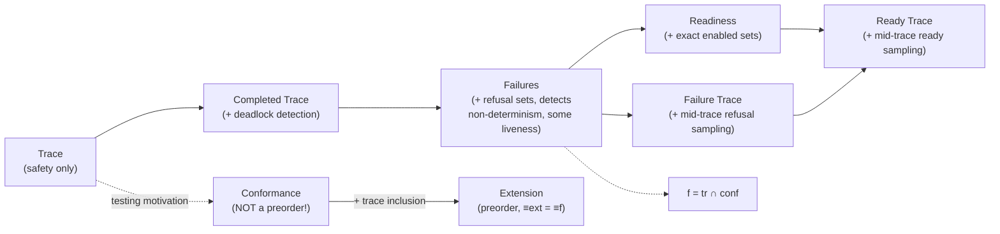

[[book-guidelines|↩ Back to guidelines]]

## The organizing idea: refinement relations are a knob on "what an observer can see"

[[Refinement-as-Reduction-of-Non-Determinism-and-Behavioural-Consistency|The previous topic]] established the master template: $A \sqsubseteq_{\mathcal{O}} C$ iff $\mathcal{O}(C) \subseteq \mathcal{O}(A)$, and that every specific refinement relation is just a choice of what $\mathcal{O}$ records. This topic is where the book cashes that promise out into a concrete, ordered *spectrum* of relations, each one recording strictly more about a process's behaviour than the last, and each independently justified by a **testing scenario** — an imagined observer-with-a-display experiment. The spectrum, in the order the book builds it:

$$\text{trace} \;\rightarrow\; \text{completed trace} \;\rightarrow\; \text{failures} \;\rightarrow\; \text{readiness} \;\rightarrow\; \text{failure trace} \;\rightarrow\; \text{ready trace}$$

with **conformance** and **extension** branching off sideways (testing-motivated, not strictly on this ladder), and **infinite trace / infinite completed trace** as an orthogonal axis (finite vs. unbounded behaviour) rather than a further rung.

If you've built an abstract interpreter, this whole chapter should read like a catalogue of **abstract domains ranked by precision**: trace refinement is your coarsest, cheapest-to-check abstraction (like an interval domain); failures refinement adds a dimension of information (like adding relational constraints between variables); readiness refinement is even finer-grained. Each step buys you the ability to distinguish processes the previous relation conflated — exactly the way a more precise abstract domain distinguishes program states a coarser one collapses together, at the cost of more expensive checking.

## Trace refinement: the baseline, and exactly what it throws away

Trace refinement (**Definition**, introduced informally in the previous topic, given precisely here) simply compares the sets of finite action sequences a process can perform:

$$\mathcal{T}(p) = \{\sigma \in Act^* \mid \exists q.\, p \xRightarrow{\sigma} q\}, \qquad p \sqsubseteq_{tr} q \iff \mathcal{T}(q) \subseteq \mathcal{T}(p)$$

```rust
// A process as "the set of action sequences it can perform" — the
// simplest possible semantic domain for refinement checking.
use std::collections::HashSet;

#[derive(Clone, PartialEq, Eq, Hash)]
struct Trace(Vec<String>);

fn trace_refines(abstract_traces: &HashSet<Trace>, concrete_traces: &HashSet<Trace>) -> bool {
    // p ⊑_tr q  iff  T(q) ⊆ T(p)
    concrete_traces.is_subset(abstract_traces)
}
```

**What breaks without more than this:** as the previous topic already flagged, `stop` (the process that does nothing) trivially trace-refines everything, because $\mathcal{T}(\mathsf{stop}) = \{\varepsilon\} \subseteq \mathcal{T}(p)$ for any $p$. Trace refinement preserves *safety* but is blind to *liveness* — it can never punish a system for refusing to do something, only for doing something it shouldn't have.

## Completed trace refinement: distinguishing "done" from "stuck for now"

The fix is small but exposes the real mechanism the rest of the chapter runs on: also record *maximal* traces — ones that end in deadlock — separately.

$$\mathcal{CT}(p) = \{\sigma \mid \exists q.\, p \xRightarrow{\sigma} q \wedge next(q) = \emptyset\}, \qquad p \sqsubseteq_{ctr} q \iff \mathcal{T}(q)\subseteq\mathcal{T}(p) \wedge \mathcal{CT}(q)\subseteq\mathcal{CT}(p)$$

The book's Example 1.7 is the canonical illustration: two vending machines $P$ (offers `coffee_button` then only `coffee`) and $Q$ (same, but after `coffee_button` sometimes deadlocks) have *identical* trace sets — every sequence one can do, the other can too — but $\text{pound}\cdot\text{coffee\_button}$ is a *completed* (maximal, stuck) trace of $Q$ and not of $P$. Trace refinement can't see this; completed trace refinement can, because it separately tracks "and then it got stuck here."

Crucially, though, completed trace refinement is proved (Proposition 1.1) to be *strictly stronger* — $P \sqsubseteq_{ctr} Q \Rightarrow P \sqsubseteq_{tr} Q$ — and the book immediately shows (Example 1.9) it's still too weak: it can't tell apart a process where, after doing `a`, you can *always* choose `c` next, from one where an internal non-deterministic choice might have already silently ruled `c` out. Both processes have the same completed traces, but they behave very differently under interaction. This is exactly the motivating gap for the next relation.

## Failures refinement: the workhorse relation, and where non-determinism becomes observable

This is arguably the most important relation in the whole spectrum — the book calls trace, failures, and bisimulation (next chapter) "by far the most important relations used in the literature." A **failure** is a pair $(\sigma, X)$: a trace $\sigma$ the process can perform, followed by a *refusal set* $X$ — a set of actions that, having reached that point, the process is guaranteed *not* to be able to do (right now).

$$\mathcal{F}(p) = \{(\sigma, X) \mid \exists q.\, p \xRightarrow{\sigma} q \wedge next(q) \cap X = \emptyset\}, \qquad p \sqsubseteq_f q \iff \mathcal{F}(q) \subseteq \mathcal{F}(p)$$

Refusal sets are **downward closed**: if $q$ refuses $\{a,b\}$, it also (trivially) refuses $\{a\}$, $\{b\}$, and $\emptyset$ — so $(\sigma, \{a,b\}) \in \mathcal{F}(p)$ forces every $(\sigma, X)$ with $X \subseteq \{a,b\}$ into $\mathcal{F}(p)$ too. This is the book's Example 1.10/1.11 mechanically enumerated.

### This is exactly how you detect non-determinism, and exactly how CEGAR detects a spurious refinement

Here's the key semantic move, and it's the reason failures refinement matters far beyond process algebra: **a single observation of a trace tells you nothing about whether other continuations were available; a refusal observation does.** If $P$ can produce both the observation $(a, \emptyset)$ — "after nothing, $a$ is not refused" — and $(\varepsilon, \{a\})$ — "initially, $a$ can be refused" — those two facts *together* witness non-determinism: sometimes $a$ is offered, sometimes it isn't, for the same starting state. Formally, the book characterizes determinism as:

$$\forall tr \in traces(P).\; (tr, X) \in failures(P) \wedge a \in X \implies tr \frown a \notin traces(P)$$

i.e., a deterministic process refuses *exactly* the actions that can't extend its current trace — no slack, no hidden branching.

Translate this into your abstract-interpretation/CEGAR vocabulary directly: a **refusal set is a negative witness** — it certifies "from this point, these transitions are *not* reachable," which is structurally the same kind of artifact a CEGAR loop extracts from a spurious counterexample (an infeasible path in the abstraction that a refined, more precise abstract domain must now refuse to admit). Failures refinement gives you liveness guarantees precisely because it forces the concrete system to keep offering whatever the abstract system guaranteed it would offer — it can't silently *refuse more* than the spec allowed, which is the process-algebra analogue of "the refined abstract domain must not lose reachability of states the concrete semantics actually reaches."

```rust
// Failures as (trace, refusal-set) pairs; refinement is set inclusion
// on this richer observation domain.
use std::collections::BTreeSet;

#[derive(Clone, PartialEq, Eq, PartialOrd, Ord)]
struct Failure {
    trace: Vec<String>,
    refusals: BTreeSet<String>, // downward-closed by construction if you enumerate properly
}

fn failures_refines(spec: &BTreeSet<Failure>, impl_: &BTreeSet<Failure>) -> bool {
    impl_.is_subset(spec) // F(q) ⊆ F(p)
}

// Determinism check, directly from the book's characterization:
// every refusal after tr must correspond to something NOT extending tr.
fn is_deterministic(traces: &BTreeSet<Vec<String>>, failures: &BTreeSet<Failure>) -> bool {
    failures.iter().all(|f| {
        f.refusals.iter().all(|a| {
            let mut extended = f.trace.clone();
            extended.push(a.clone());
            !traces.contains(&extended)
        })
    })
}
```

A cheaper variant, **singleton failures** (Definition 1.5, $\mathcal{F}_1$), only records refusals of size 1 — you lose the downward-closure-derived information about which *combinations* of actions are jointly refusable, but you also need to separately track traces (unlike full failures, where trace inclusion is implied). Example 1.13 shows two systems with identical singleton failures but different full failures — so singleton failures sits strictly between completed-trace and (full) failures in discriminating power.

## Readiness refinement: dualize refusal into "what's enabled instead"

Rather than recording what's refused, record the exact set of actions *enabled*:

$$\mathcal{R}(p) = \{(\sigma, X) \mid \exists q.\, p \xRightarrow{\sigma} q \wedge next(q) = X\}, \qquad p \sqsubseteq_r q \iff \mathcal{R}(q) \subseteq \mathcal{R}(p)$$

This looks like it should carry the *same* information as failures (refusing everything outside $X$ is "the same" as being ready with exactly $X$), but the book's Example 1.15 shows it doesn't: two processes can have identical failure sets yet differ in readiness, because $X$-as-a-refusal-set only constrains a lower bound on what's refused (refusal sets are downward closed, so many different "ready sets" can produce the *same* failure information via their subsets), whereas $X$-as-a-ready-set pins the enabled set *exactly*. **Readiness refinement is strictly stronger than failures refinement** (Proposition 1.3): $P \sqsubseteq_r Q \Rightarrow P \sqsubseteq_f Q$.

## Failure trace and ready trace refinement: stop sampling only at the end

Failures and readiness both record information only *at the end* of a trace — one snapshot per completed run. **Failure trace refinement** interleaves refusal-set observations *between every action*, not just at the finish:

$$\sigma = X_1\, a_1\, X_2\, a_2 \cdots X_n\, a_n\, X_{n+1}$$

where $a_1,\dots,a_n$ is an ordinary trace and each $X_{i+1}$ is a refusal set observed *after* $a_1 \cdots a_i$ but *before* $a_{i+1}$ is chosen. **Ready trace refinement** does the same but with ready sets instead of refusal sets. Both are strictly finer than their end-of-trace cousins (Proposition 1.4 for failure traces) — Example 1.16 exhibits two processes that agree on both failures *and* readiness (their end-states look identical) but disagree once you sample mid-trace, because the *order* in which non-determinism resolves is now observable, not just its final outcome.

This is a genuinely important structural point for anything you build around symbolic execution or path-sensitive abstract interpretation: **sampling an invariant only at loop exit versus sampling it at every loop iteration are different levels of precision**, exactly the way end-of-trace failures/readiness versus interleaved failure-trace/ready-trace are different levels of precision here. A path-sensitive analysis is, in this book's vocabulary, closer to failure-trace refinement than to plain failures refinement — it's tracking what's ruled in/out *at every step*, not just at the observation point.

## Conformance and extension: refinement relations built for *testing*, not for chaining

These two are motivated differently — not "what's the next rung of discriminating power" but "what's checkable by generating a *manageable* number of tests against real, physical implementations" (this is literally LOTOS conformance-testing terminology; see also Chapter 6). The key formal move is restricting **which traces you have to quantify refusal-checks over**.

Failures refinement, unwound, is:

$$p \sqsubseteq_f q \iff \forall \sigma \in Act^*,\, X \subseteq Act.\; (q \text{ after } \sigma\ ref\ X) \implies (p \text{ after } \sigma\ ref\ X)$$

— quantified over **all possible traces**, including ones neither system ever mentioned. **Conformance** restricts the quantifier to only the abstract system's own traces:

$$p\ conf\ q \iff \forall \sigma \in \mathcal{T}(p),\, X \subseteq Act.\; (q \text{ after } \sigma\ ref\ X) \implies (p \text{ after } \sigma\ ref\ X)$$

Fewer traces to check means fewer tests to generate — that's the entire point — but the price is real: conformance **cannot detect that the implementation grew new traces the spec never had** (Example 1.18's $C_1, C_2, C_3\ conf\ C_3$, even though $C_3$ trace-refines nothing like $C_1$ in the other direction). Worse, and this is the sharpest fact in the section: **conformance is reflexive but not transitive** (Proposition 1.5) — so it fails to be a preorder at all. That's disqualifying for stepwise development (recall from the previous topic: transitivity is what makes multi-stage refinement sound without re-checking against the original spec at every stage), which is exactly why the book immediately patches it.

**Extension** is conformance plus an explicit requirement that the implementation's traces *include* the spec's:

$$p\ ext\ q \iff \mathcal{T}(p) \subseteq \mathcal{T}(q) \;\wedge\; (p\ conf\ q\text{'s refusal condition})$$

and this repair works: extension **is** a preorder (Proposition 1.6), and its induced equivalence coincides with failures-refinement's equivalence ($\equiv_{ext} = \equiv_f$). The book's clean summary identity ties the whole family together:

$$\sqsubseteq_f \;=\; \sqsubseteq_{tr} \cap\; conf$$

Failures refinement is *exactly* "no new traces, and conformance holds" — trace inclusion supplies the discipline conformance alone lacks, and conformance supplies the refusal-sensitivity trace inclusion alone lacks.

## Deadlock, non-determinism, and infinite behaviour as cross-cutting concerns

Two structural notions recur across every relation above rather than defining a rung of their own:

- **Deadlock**: $p$ is deadlocked iff $next(p) = \emptyset$ — no transition is possible. This is what completed-trace refinement is specifically built to make observable (a maximal trace *is* "reached a deadlock").
- **Non-determinism**: a state with two transitions on the *same* action leading to *different* states. Trace refinement cannot detect this at all (it only sees "an $a$ happened," never "which branch was taken" or "was there a choice"); failures refinement is the first relation in the spectrum that can, via the co-occurrence of a permitting and a refusing observation for the same action after the same trace.

Finally, **infinite trace refinement** extends $\mathcal{T}(p)$ with $\mathcal{T}^\infty(p)$, the set of infinite action sequences $p$ admits, requiring inclusion of *both*. This matters because finite-trace refinement alone is a strictly weaker check when a system is not **image-finite** (finitely branching at every state) — Example 1.21 exhibits a system $A$ that is infinitely branching but every individual trace terminates, versus $B$ which additionally has one genuinely infinite trace; $A \sqsubseteq_{tr} B$ holds but $A \not\sqsubseteq_{tr}^{\infty} B$. For image-finite systems, though, **König's lemma** closes the gap (Proposition 1.7): finite trace refinement *implies* infinite trace refinement automatically, because an infinite trace can only fail to be "covered" if there's an infinite path through a finitely-branching tree that isn't witnessed by any of its finite prefixes being extendable forever — which König's lemma rules out. This is a fact worth filing away: **it's the same compactness argument that underlies why finitely-branching search trees in a CSP or SAT/SMT solver can be reasoned about via their finite unrollings**, and why termination arguments over finitely-branching abstract-interpretation lattices don't need to separately handle "infinite branching went wrong."

## Where this leads



Two things this chapter sets up that the rest of the book leans on constantly. First, the **finest relation of all — bisimulation — is deliberately deferred to Chapter 2** ([[Automata-and-Simulations|next topic]]), because it needs a genuinely different proof technique (a structural relation between states, not just set inclusion between observation sets) — and that technique, *simulation*, turns out to be how you'd actually *check* any of the relations above without enumerating a possibly-infinite observation set, which is the mechanism you'll want for checking refinement of infinite-state abstract-interpretation domains. Second, the failures/conformance identity $\sqsubseteq_f = \sqsubseteq_{tr} \cap\ conf$, and the general pattern of "richer observation domain ⇒ stronger, more expensive-to-verify refinement relation," reappears nearly verbatim in Chapters 7–11 when the book moves from LTS-flavored process semantics to state-based specification languages (Z, B, Event-B) and to the relational data-refinement framework — the exact same spectrum gets re-derived there as failures-divergences refinement versus plain data refinement, which is the refinement notion your Hoare-triple/contract-checking compiler will actually need to reason about soundness against.
