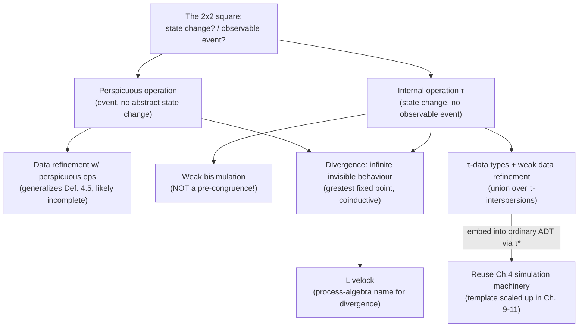

[[book-guidelines|↩ Back to guidelines]]

## The square the book has been avoiding

[[State-Based-and-Relational-Models-of-Refinement|Chapter 4's]] relational ADTs labelled every transition with an operation name and dropped the CSMAT's stuttering (reflexivity) — deliberately, because now individual steps *are* observable. But that leaves a gap: CSMATs (Chapter 3) had stuttering baked in for a reason — you genuinely cannot always tell whether "nothing changed" means literally nothing happened, or something happened that just didn't move the state you're watching. This chapter closes that gap by asking two orthogonal yes/no questions about any transition and filling in the resulting 2×2 square:

|                          | **Observable event?** Yes | **Observable event?** No |
|---|---|---|
| **State change?** Yes | Ordinary operation ([[State-Based-and-Relational-Models-of-Refinement|Ch. 4]]) | Internal operation (§5.4) |
| **State change?** No | **Perspicuous operation** (§5.1) | The empty program |

Two of these four cells were already handled; this chapter is entirely about the remaining two, plus a cross-cutting concern — **divergence** — that both of them expose in a way ordinary operations never did.

## Perspicuous operations: an event that leaves no visible trace

A **perspicuous operation** is one where an observable event fires, but the *abstract* state doesn't change — a `skip`, a `NOP`, an "active waiting" loop iteration. The name is a small joke: like a perspicuous (translucent) material, it's there, you just can't see through it to detect it happened. The book's own compiler-relevant framing: this is exactly what a concrete refinement step looks like when it operates on a state component the abstraction *doesn't expose* — e.g., a concrete counter incrementing that has no abstract counterpart. It is inherently a **simulation-relative notion**: whether a step "changes the abstract state" only makes sense once you've fixed a retrieve relation $R$ between concrete and abstract states.

The refinement definition generalizes cleanly by having the abstract program *drop* every perspicuous operation from the concrete program before comparison:

$$A \sqsubseteq_{persp} C \iff \forall p \text{ over } I \cup J.\; \llbracket p \rrbracket_C \subseteq \llbracket p \restriction I \rrbracket_A$$

where $J$ indexes the perspicuous operations (invisible abstractly) and $p \restriction I$ erases them. Setting $J = \emptyset$ recovers ordinary data refinement (Definition 4.5) exactly — this definition is a strict generalization, not a different theory.

```rust
// A perspicuous step, at the type level: it changes concrete state but
// its abstraction leaves the retrieve relation's target untouched.
struct ConcreteStep<S> { before: S, after: S }

fn is_perspicuous<S, A: PartialEq>(step: &ConcreteStep<S>, retrieve: impl Fn(&S) -> A) -> bool {
    retrieve(&step.before) == retrieve(&step.after)
}
```

**What the book flags as a real gap, not a footnote**: this semantic definition makes no reference to a *specific* simulation $R$ — so any given simulation that introduces perspicuous operations is "unlikely to form a complete method" for verifying this notion of refinement. This is the same completeness caution you saw in [[State-Based-and-Relational-Models-of-Refinement|Chapter 4's]] blocking-interpretation counterexample: generalizing a definition doesn't automatically hand you a matching sound-*and*-complete proof technique for it. File this connection: it's directly relevant to Event-B's "new events" mechanism ([[Event-B-and-Abstract-State-Machines-ASM|later topic]]) — introducing perspicuous, "convergent" events in a refinement step is exactly this construct, formalized with an explicit termination proof obligation to keep it from degenerating into divergence.

## Catastrophic versus non-catastrophic error: what does "possibly bad" mean?

Before divergence proper, the book generalizes a distinction you already met implicitly in [[State-Based-and-Relational-Models-of-Refinement|Chapter 4's]] blocking-vs-non-blocking totalisation. Given some "problematic" outcome (an operation applied outside its domain; non-termination), a semantics can treat it in one of two qualitatively different ways:

- **Non-catastrophic (partial-correctness-style)**: the bad outcome is recorded as *one possible outcome among others* — reaching an error state is just another observation, on par with normal ones. This is what **blocking** totalisation does: a program that *might* reach $\bot$ has $\bot$ added to its outcome set alongside the normal ones, not replacing them.
- **Catastrophic / chaotic**: the mere *possibility* of the bad outcome is treated as being *as bad as its certainty* — the presence of one path to error corrupts the *entire* observation set for that program, because "chaos" ($\mathsf{all}$ possible outcomes) subsumes everything else once unioned in. This is what **non-blocking** totalisation does, algebraically: since non-deterministic choice is relational union, and the totalised operation maps every out-of-domain input to *the whole range*, unioning that into an outcome set makes any genuine normal outcome indistinguishable from "literally anything could happen." The book states this precisely: **a catastrophic error is a zero element in the algebra of behaviours under non-deterministic choice** — the algebraic annihilator, the way $0 \times x = 0$ regardless of $x$.

Reusing Chapter 4's Fig. 4.6 example, the two totalisations make this concrete: blocking totalisation of `bb` from $c_0$ reaches $\{c_2, c_6, \bot\}$ — three distinct, individually meaningful possibilities. Non-blocking totalisation instead reaches *all* states reachable via $\bot$, swallowing the specific $c_2$/$c_6$ branches into an undifferentiated blob.

**Three general strategies for handling any problematic behaviour**, which the book flags as recurring throughout the rest of the book:
1. **Partial correctness**: stop offering guarantees where the problem occurs (Chapter 3's approach to non-termination).
2. **Rule it out by proof obligation**: require that specifications and refinement steps *cannot* produce the problem at all (e.g., requiring `Init` be satisfiable, so an ADT never trivializes).
3. **Model it explicitly and bound its growth under refinement**: represent the error as a genuine value ($\bot$) and require refinement steps not to make it worse (Chapter 4's totalised relational semantics).

**This triage is directly load-bearing for how you design error/undefined-behaviour semantics in your compiler.** A refinement type system's treatment of a violated `requires` clause is exactly this choice: do you (a) simply refuse to guarantee `ensures` past that point (partial correctness — closest to "undefined behaviour, but bounded"), (b) statically reject any call site that can't be proven to satisfy the precondition (proof-obligation elimination — closest to what a sound refinement-type checker *should* do for a genuinely verified language), or (c) model the violation as an explicit trapped error value threaded through the semantics (closest to `Result`/`Option`-style explicit error propagation, or to how a symbolic executor represents an infeasible/erroring path)? These are not equivalent, and mixing them inconsistently across your type system's operations is exactly the kind of soundness gap that shows up only under adversarial testing.

## Divergence: infinite behaviour that never becomes observable

Earlier chapters had infinite *traces* (Chapter 1's §1.10) without treating them as degenerate — an infinite trace just meant "a correct system that never has to stop," fine as long as the environment is still, in principle, engaging with it. **Perspicuous and internal operations break that safety property**, because now infinite behaviour can occur *without ever producing another observable event* — the environment isn't involved at all, and nothing will ever tell it the system is still "doing something."

$$\textbf{Divergence: a state from which infinite behaviour is possible that is never observable.}$$

$$\text{A trace is \textit{strictly divergent} if it can end in a divergent state.}$$

For CSMATs specifically, the mechanism is concrete: matching a concrete state trace against an abstract one requires recording one abstract *stuttering step* per concrete *perspicuous step* — but nothing in the framework so far guarantees a **finite** number of perspicuous steps happen per abstract stutter. A finite abstract trace can correspond to a genuinely infinite concrete one. That's not a bookkeeping inconvenience; it's a real semantic hazard, because a client reasoning about the *abstract* specification (which looks totally well-behaved — finite, terminating) has no way to detect that the concrete implementation might spin forever doing "invisible" work.

For LTS with internal actions, divergence gets its precise fixed-point characterization:

$$p \uparrow \iff p \in \nu S.\; \mathrm{dom}(\tau \lhd S)$$

— $p$ is divergent iff it lies in the **largest fixed point** of "states with a $\tau$-transition into $S$." This is a genuinely important pattern to recognize: **divergence is a greatest-fixed-point (coinductive) property**, exactly the dual of how reachability/termination is a least-fixed-point (inductive) property. If you're building a termination checker or a liveness-property verifier for your language, this is the formal shape you're computing: termination proofs are inductive (well-founded induction, ranking functions — smallest set closed under "terminates in one step from here"); divergence/non-termination witnesses are coinductive (greatest set closed under "can always take one more step and stay in the set"). Your abstract-interpretation pass proving *absence* of infinite loops needs an inductive argument; a CEGAR-style search for a genuine non-terminating counterexample is implicitly searching for a witness to this coinductive predicate.

### Livelock: divergence's process-algebra name

The book gives this phenomenon its more evocative name for the internal-action setting: **livelock** — internal actions taking precedence over external ones forever, so the system is technically "running" but structurally indistinguishable from deadlock as far as the environment is concerned. Deadlock (no transitions possible) and livelock (only invisible transitions possible, forever) are the two ways a system can stop being useful to its environment while looking completely different at the state-machine level — deadlock is externally silent because *nothing* happens; livelock is externally silent because *everything that happens is invisible*.

## Internal operations: formalizing $\tau$ beyond automata

Chapter 2 introduced $\tau$ in automata as a name without much semantic weight. This chapter cashes it out fully. In process algebras (Chapter 6), $\tau$ arises naturally: hiding a CSP channel, encoding LOTOS-style internal choice via an operator that only directly expresses external choice. The trace semantics generalizes by construction: compute traces treating $\tau$ as an ordinary event, then erase every $\tau$ from the result. The transition notation generalizes correspondingly: $p \xRightarrow{a} q$ now permits arbitrarily many (but — to dodge divergence — implicitly *finitely* many) $\tau$-steps immediately before and after the single visible $a$.

### Weak bisimulation: bisimulation that looks past $\tau$

Chapter 2's bisimulation (Definition 2.8) required *every* step, visible or not, to be matched. **Weak bisimulation** relaxes this to only require matching *up to invisible steps*:

$$\begin{cases}
p\,R\,q \wedge p \xRightarrow{a} p' \Rightarrow \exists q'.\; q \xRightarrow{a} q' \wedge p'\,R\,q' \\
p\,R\,q \wedge q \xRightarrow{a} q' \Rightarrow \exists p'.\; p \xRightarrow{a} p' \wedge p'\,R\,q' \\
p\,R\,q \wedge p \xRightarrow{\varepsilon} p' \Rightarrow \exists q'.\; q \xRightarrow{\varepsilon} q' \wedge p'\,R\,q' \\
p\,R\,q \wedge q \xRightarrow{\varepsilon} q' \Rightarrow \exists p'.\; p \xRightarrow{\varepsilon} p' \wedge p'\,R\,q'
\end{cases}$$

— using $\xRightarrow{a}$ (possibly-surrounded-by-$\tau$'s) throughout, plus explicit clauses for pure-$\tau$ ($\varepsilon$) evolution. This is *exactly* the coinductive-equality-up-to-unfolding idea flagged in [[Automata-and-Simulations|the previous topic]] — with $\tau$-steps now playing the role of "internal reduction the equality check is allowed to skip past," the way a definitional-equality checker skips past `let`-unfolding or delta-reduction steps a user never has to think about.

### Why "weak bisimulation is not a pre-congruence" should worry you specifically

This is the chapter's sharpest technical result, and it's a genuine trap. **A refinement relation should be a pre-congruence** — refining a *part* of a system should always be safe to substitute into the whole (compositionality: if $S \sqsubseteq S'$, then replacing $S$ by $S'$ inside any context $T$ should give $T[S] \sqsubseteq T[S']$). The book's Fig. 5.2 example — three LTS all with identical traces $\{\varepsilon, \langle a \rangle, \langle b \rangle\}$, differing only in *where* internal choice resolves — shows the branch-by-branch pieces are all weakly bisimilar to each other, **but the whole systems are not**, because weak bisimulation wants to identify the pre-$\tau$ and post-$\tau$ states, and those states have genuinely different **refusal sets** (one refuses $a$, the other doesn't, right after the empty trace).

**This is a warning you should carry directly into your unifier/elaborator design.** Any equality or refinement notion that quotients "too eagerly" over internal steps can break compositional reasoning — checking refinement/equality of a whole term by checking it piecewise on subterms is *not automatically valid* just because your equality relation is an equivalence. If your elaborator's definitional-equality check (or your refinement-type subsumption check) isn't provably a congruence with respect to every term-forming operation, then "check equality of subterms, conclude equality of the compound terms" is unsound — exactly the failure mode this example exhibits. Concretely: if your kernel's `isDefEq` ever needs a "weak" variant that looks past some internal reduction step (e.g. laziness, memoization, or elaboration-inserted coercions), you must separately re-verify it stays a congruence, not assume it does because the un-weakened version was one.

### Stable states resolve an ambiguity, at a cost

For systems like Fig. 5.2's versions (ii)/(iii), "the state after the empty trace" is ambiguous — before or after an available $\tau$? The book offers **stable states** as the fix: a state is stable iff it has no outgoing $\tau$-transition, and observation functions can be restricted to consider only stable states after a trace. This resolves the ambiguity but at a real cost — restricting to stable states makes "briefly enabled, then internally withdrawn" behaviour (like $a$ in version (ii)) permanently unobservable, silently changing what your semantics can distinguish. This is the same trade-off as choosing which points in an operational semantics count as "observation points" for a symbolic executor — sample too coarsely (only at stable/quiescent states) and you lose real distinctions; sample every micro-step and you drown in irrelevant internal bookkeeping.

### τ-data types: internal operations in the relational world

The relational-model generalization adds $\tau$ as one more component: $D = (State, Init, \{Op_k\}_{k \in I}, \tau, Fin)$. **Weak data refinement** compares programs by taking the *union over all ways of interspersing $\tau$'s* between the named operations:

$$\hat{p}_D = \bigcup \{ \llbracket q \rrbracket_D \mid q \in seq(I \cup \{i\}),\, q \restriction I = p \}$$

with $C$ weakly refining $A$ iff $\hat{p}_C \subseteq \hat{p}_A$ for every program $p$ over $I$. The union is essential, not decorative: it lets a **non-deterministic** abstract internal action be realized by a **deterministic** concrete one that fires (or doesn't) depending on branch — you cannot ask for a one-to-one trace correspondence once internal choice is in play. This generalizes Definition 5.6 (weak data refinement) strictly further than perspicuous-operation refinement (Definition 5.1) — refining $\tau$ to `skip` is a *sufficient*, not *necessary*, special case, and the book flags explicitly that in real specifications, treating internal operations as pure `skip`-refinements is often the wrong modelling choice (an internal step legitimately changes abstract state while staying uninteractable, e.g. a webpage loading in the background between HTTP requests).

The book also previews its general strategy for handling this cleanly: **embed** a $\tau$-data type into an ordinary data type by post-composing every operation and the initialisation with $\tau^*$ (the reflexive-transitive closure of internal steps), then reuse the ordinary Chapter 4 simulation machinery on the embedding. This "reduce a richer semantics to the existing theory via an explicit embedding" move is the exact template Chapters 9–11 scale up dramatically — process-algebraic refinement relations embedded wholesale into the relational framework via finalisation functions.

## Where this leads



This chapter is the direct semantic prerequisite for [[Process-Algebras-CSP-LOTOS-and-CCS|Chapter 6's]] treatment of CSP's failures-divergences-infinite-traces (FDI) semantics — "divergence" there is exactly Definition 5.2 specialized to CSP's hiding operator — and for Event-B's "convergent" new-events proof obligation ([[Event-B-and-Abstract-State-Machines-ASM|Chapter 8]]), which is precisely a termination proof bounding perspicuous-operation sequences to rule out the divergence this chapter identifies as possible. For your project directly: the catastrophic/non-catastrophic error distinction is a design decision you must make explicitly for every place your language can go "off contract," the coinductive character of divergence tells you what proof technique (greatest fixed point, not induction) a non-termination oracle in your CEGAR loop actually needs, and the weak-bisimulation-is-not-a-congruence result is a standing caution to re-verify compositionality any time your elaborator's equality check is defined "up to" some internal computation step.
