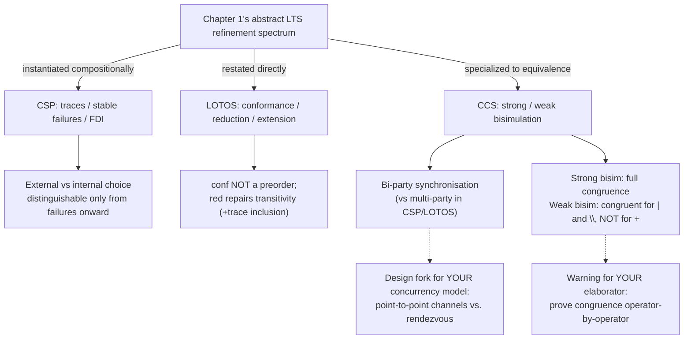

[[book-guidelines|↩ Back to guidelines]]

## Real languages, not just semantic models

Every previous chapter built a semantic *model* — LTS, automata, CSMATs, relational ADTs — abstractly, with no concrete syntax a specification-writer would actually type. This chapter is where the abstract theory meets three real, historically important languages for describing concurrent systems: **CSP**, **LOTOS**, and **CCS**. The payoff for you is concrete: this is the chapter that shows how [[Refinement-as-Reduction-of-Non-Determinism-and-Behavioural-Consistency|Chapters 1's]] observation-set refinement relations, [[Perspicuity-Error-Behaviour-and-Divergence|Chapter 5's]] divergence machinery, and [[Automata-and-Simulations|Chapter 2's]] bisimulation all get **instantiated compositionally** — a definition, given operator-by-operator, that computes a process's semantics recursively from its syntax. This compositional style is exactly the shape a type checker or an abstract interpreter needs: a semantics defined by structural recursion on syntax, so that "the meaning of the whole" is computable from "the meanings of the parts."

## CSP: the canonical example

CSP (Communicating Sequential Processes) describes a system as **processes** interacting by **synchronising on events** — atomic, instantaneous, like LTS actions. The core operators:

- $\mathsf{stop}$: deadlock, no activity, no termination.
- $\mathsf{skip}$: no activity either, but *does* terminate successfully — this needs a distinguished termination event $\checkmark \notin \Sigma$, precisely so `skip` can be told apart from `stop` at the semantic level (an easy category-confusion to make if you're not careful: "does nothing" and "successfully finishes doing nothing" are different facts a client needs to know).
- $a \to P$ (event prefix): do $a$, then behave like $P$.
- $c!v \to P$ / $c?v{:}T \to P$: output/input along a channel — the event set for a channel $c$ carrying type $T$ is $\{c.v \mid v \in T\}$.
- $P_1 \square P_2$ (**external choice**): both processes' initial events are on offer; the *environment's* first move resolves the choice.
- $P_1 \sqcap P_2$ (**internal choice**): the *process itself* non-deterministically resolves which branch is offered, before the environment gets to choose anything.
- $P_1 ||| P_2$ (interleaving, no synchronisation), $P_1 \Vert_A P_2$ (synchronise exactly on events in $A$, interleave the rest), $P \setminus L$ (hiding — remove $L$ from the interface).

### External vs. internal choice: why plain LTS traces can't tell them apart

This is the chapter's first real payoff, and it directly cashes out something [[Labelled-Transition-Systems-and-the-Spectrum-of-Observational-Refinement|Chapter 1]] and [[Perspicuity-Error-Behaviour-and-Divergence|Chapter 5]] both flagged as a limitation. $P = (\mathit{coffee\_button} \to \mathit{coffee} \to \mathsf{stop}) \;\square\; (\mathit{tea\_button} \to \mathit{tea} \to \mathsf{stop})$ and $Q$, the same but with $\sqcap$, have **identical trace sets**. But put $P$ and $Q$ in an environment only willing to offer `coffee_button`: $P$ can always proceed (both branches were externally on offer); $Q$ *may deadlock*, because $Q$ might have already, silently, committed to the `tea` branch. **This is exactly why plain LTS can't express internal choice** — you need the $\tau$-machinery from [[Perspicuity-Error-Behaviour-and-Divergence|Chapter 5]] (specifically, $\sqcap$ compiles to an internal $\tau$-branch, Fig. 5.2(iii)'s shape) to represent it at all.

```rust
// External choice: both branches genuinely available, environment decides.
enum ExternalChoice<A> { Branch(String, A), Branch2(String, A) }
// Internal choice needs an extra, invisible resolution step BEFORE
// either branch's events become available — you cannot encode this
// as a plain enum selection; it needs a hidden nondeterministic step.
enum InternalChoice<A> { Resolved(Box<dyn Fn() -> ExternalChoiceLike<A>>) }
```

## CSP semantics: three models, three refinement relations, one recipe

The book gives CSP semantics **compositionally**: a function from process syntax to a semantic domain, defined by structural recursion, matching syntax constructor by constructor. Three domains of increasing richness, each yielding its own refinement relation via $\mathcal{O}(C) \subseteq \mathcal{O}(A)$ (the master template from topic 1, now literally instantiated three separate times on the same language):

**Traces**: $traces(\mathsf{stop}) = \{\varepsilon\}$; $traces(a \to P) = \{\varepsilon\} \cup \{a \frown tr \mid tr \in traces(P)\}$; $traces(P \square Q) = traces(P \sqcap Q) = traces(P) \cup traces(Q)$ — note the *last* equation is exactly why traces can't distinguish $\square$ from $\sqcap$: the definitions coincide. $\sqsubseteq_{tr}$ is defined exactly as in Chapter 1.

**Stable failures** ($SF$): pairs $(trace, refusal\text{-}set)$, restricted to *stable* states (no outgoing $\tau$) — literally [[Labelled-Transition-Systems-and-the-Spectrum-of-Observational-Refinement|Chapter 1's failures semantics]] plus [[Perspicuity-Error-Behaviour-and-Divergence|Chapter 5's]] stability refinement, applied compositionally. Four well-formedness conditions (F1–F4) mirror Chapter 1's downward-closure and consistency requirements. Crucially, $SF$ *does* distinguish external from internal choice: $(\varepsilon, \{\mathit{coffee\_button}\})$ is a stable failure of the $\sqcap$-version but *not* the $\square$-version — the internal-choice process can refuse `coffee_button` right at the start (it may have silently committed to `tea`), the external-choice one cannot. **Stable failures refinement preserves both safety and (some) liveness**, escaping the "refine to `stop`" degeneracy that pure trace refinement suffers.

**Failures-Divergences-Infinite-traces (FDI)**: adds $D$ (divergent traces) and $I$ (infinite traces) to the failures component, and — critically — takes the **catastrophic** view of divergence from [[Perspicuity-Error-Behaviour-and-Divergence|Chapter 5's]] taxonomy explicitly: once a trace diverges, *every* extension of it is also treated as divergent (D1), and a divergent trace can refuse *anything* (D2) — the most pessimistic possible interpretation, chosen deliberately because you cannot, in general, verify that a system will eventually "recover" from an unboundedly-long internal computation. This is the process-algebra instance of the catastrophic-error algebra from Chapter 5: $\bot$-like behaviour swallows everything unioned with it.

```rust
// The FDI semantics as a Rust type — the compositional structure the
// book builds process-by-process is exactly this recursive triple.
struct Fdi {
    failures: std::collections::BTreeSet<(Vec<String>, std::collections::BTreeSet<String>)>,
    divergences: std::collections::BTreeSet<Vec<String>>, // catastrophic: closed under extension
    infinite_traces: std::collections::BTreeSet<Vec<String>>, // conceptually; infinite in practice
}

// Prefixing, computed structurally from a sub-process's Fdi — this
// recursion-on-syntax IS the compiler-relevant idea: define semantics
// by pattern-matching the AST, exactly like a denotational-semantics
// interpreter or a type checker's structural recursion.
fn prefix_fdi(a: &str, sub: &Fdi) -> Fdi {
    Fdi {
        failures: sub.failures.iter()
            .map(|(tr, x)| { let mut t = vec![a.to_string()]; t.extend(tr.clone()); (t, x.clone()) })
            .collect(),
        divergences: sub.divergences.iter()
            .map(|tr| { let mut t = vec![a.to_string()]; t.extend(tr.clone()); t })
            .collect(),
        infinite_traces: sub.infinite_traces.clone(), // similarly prefixed
    }
}
```

Three refinement relations follow directly: $\sqsubseteq_{tr}$, $\sqsubseteq_{sf}$, $\sqsubseteq_{fdi}$ (the last requiring inclusion in all three components at once), each strictly finer than the last, and — the book's clean sanity check — when divergences are empty, $SF$ and FDI's failures component *coincide exactly*, so FDI conservatively extends stable failures rather than replacing it.

### Why this matters for verification-condition generation

**This compositional-semantics recipe is the direct template for how your compiler should compute weakest preconditions or symbolic-execution path conditions.** Just as $SF(P \square Q)$ is defined purely in terms of $SF(P)$ and $SF(Q)$ (no re-derivation from an operational LTS needed), a sound VC generator computes the precondition of a compound statement purely from the preconditions of its parts — the entire discipline of structural/syntax-directed semantics that makes both type checking and Hoare-logic verification tractable rests on exactly this compositionality property, and CSP's semantics here is a clean, worked example of building such a definition rigorously, complete with explicit well-formedness side-conditions (F1–F4, D1–D4, I1–I2) you'd want analogues of when defining your own IR's denotational semantics.

## LOTOS: an explicit internal action, and conformance's transitivity failure repaired

LOTOS looks syntactically close to CSP (`stop`, prefixing as `a;P`, `[]` for choice, `|[x1,...,xn]|` for general synchronising parallelism, `hide` for hiding) with two notable differences: it has an **explicit internal action** $i$ (so internal choice is just ordinary choice with an $i$-prefixed branch: `(i; a; P) [] (i; b; Q)` — no separate $\sqcap$ operator needed), and its multi-party synchronisation genuinely lets $n$ processes rendezvous on one action together (contrast CCS below).

LOTOS's refinement story **directly reuses Chapter 1's conformance/extension apparatus**, restated with $Ref_P(\sigma)$ (LOTOS notation for the refusal set after trace $\sigma$, i.e. Definition 1.8's $P \; \mathrm{after} \; \sigma \; \mathrm{ref} \; X$):

- **Conformance**: $P \; conf \; Q \iff \forall \sigma \in traces(P).\; Ref_Q(\sigma) \subseteq Ref_P(\sigma)$ — but the book is blunt: *conformance is not a preorder*, illustrated concretely by Example 6.22's three processes with $P_3 \; conf \; P_2$ and $P_2 \; conf \; P_1$ but **not** $P_3 \; conf \; P_1$. The book's stated defense — "it isn't meant to be a development relation, just a one-time spec-vs-implementation check" — is worth remembering as a general principle: **not every useful comparison relation needs to be a preorder; only relations meant to *compose across development stages* do.** If you're building a one-shot conformance test between a spec and a deployed binary, you don't necessarily need transitivity; if you're building a *chain* of successive refinements (which your elaborator almost certainly is), you do.
- **Reduction** ($red$): conformance **plus** trace inclusion — $P \; red \; Q \iff traces(Q) \subseteq traces(P) \wedge P \; conf \; Q$. This repairs transitivity the same way [[Labelled-Transition-Systems-and-the-Spectrum-of-Observational-Refinement|Chapter 1's extension relation]] repaired conformance — and the book states plainly: **in the absence of divergence, reduction coincides with CSP's failures refinement, and with "must testing."**
- **Extension** ($ext$): conformance plus the *opposite* inclusion — $T(P) \subseteq T(Q)$ — allowing new traces to be added, exactly Chapter 1's LTS extension relation restated.
- **Testing equivalence**: the equivalence induced by both reduction and extension (they coincide) — traces and refusals both equal.

This is a genuinely satisfying confirmation that Chapter 1's abstract LTS-level relations aren't just theoretical scaffolding — they are, verbatim, the refinement theory of a real, standardized specification language used for telecoms protocol verification. Your elaborator's contract-subsumption check, if it's going to support "one-shot" acceptance testing of a black-box implementation against a spec (rather than only stepwise-refined development), should expect to need a conformance-*shaped* relation distinct from your main (necessarily transitive) subtyping/refinement preorder — and know in advance that the two will not have the same algebraic properties.

## CCS: bi-party synchronisation and equivalence over preorder

CCS (Calculus of Communicating Systems) shares the family resemblance ($\mathbf{0}$ for `stop`, $a.P$ for prefixing, $\tau$ for internal action, $+$ for choice, recursion, restriction $P \setminus \{a_1,\dots,a_n\}$ for hiding-that-forbids-rather-than-conceals) but makes one structural choice that changes everything about composition: **synchronisation is bi-party via complementary actions**, not CSP/LOTOS-style multi-party rendezvous on a shared event name.

In CCS, $P = x.Q \mid \bar{x}.R \mid x.T$ (note: **two** components offer $x$, one offers the complementary $\bar{x}$) can non-deterministically synchronise $\bar x$ with *either* offering of $x$, hiding that specific interaction as $\tau$ while the other, un-synchronised offer of $x$ remains externally visible. Compare LOTOS's `(x;Q) |[x]| (x;R) |[x]| (x;T)`, where **all three** processes *must* agree and fire $x$ together as one shared multi-party event. This is a genuine expressiveness difference, not just notation — CCS's bi-party model naturally represents point-to-point channel communication (the way most real message-passing systems, and most concurrent-programming runtimes, actually work), while LOTOS/CSP's multi-party model naturally represents broadcast-style, all-parties-must-agree synchronisation. If you ever design a concurrency model for your compiler's runtime or its concurrent-verification fragment, this is a foundational design fork worth having made *consciously*: point-to-point channels (CCS-flavored, and the ancestor of most real message-passing runtimes including Rust's `mpsc`/actor-style channels) versus rendezvous-on-shared-event (CSP/LOTOS-flavored, closer to how a global barrier or broadcast synchronization primitive behaves).

### Strong and weak bisimulation, revisited with a real congruence pay-off

CCS's refinement theory, unlike CSP's and LOTOS's failures/testing-based story, centers on **equivalences, not preorders** — bisimulation from [[Automata-and-Simulations|Chapter 2]] (strong equivalence $\sim$, $\tau$ treated as an ordinary action) and weak bisimulation from [[Perspicuity-Error-Behaviour-and-Divergence|Chapter 5]] (observational equivalence $\approx$, $\tau$-steps ignored). Two payoffs here matter beyond the definitions themselves:

1. **Algebraic laws fall out for free**: $P + Q \sim Q + P$, $P + P \sim P$, $P \mid \mathbf{0} \sim P$, etc. — bisimulation gives you an equational theory of processes, the process-algebra analogue of the equational laws (associativity, idempotence, unit laws) you'd want to hold — and be able to *prove* hold, not just assume — for any term-rewriting or normalization system in your elaborator.
2. **Strong bisimulation is a genuine congruence** in CCS: $P_1 \sim P_2 \Rightarrow a.P_1 \sim a.P_2$, $P_1 + Q \sim P_2 + Q$, $P_1 \mid Q \sim P_2 \mid Q$, $P_1 \setminus L \sim P_2 \setminus L$ — substituting an equivalent subprocess anywhere preserves equivalence, for **every** operator. **This is the positive counterpart to [[Perspicuity-Error-Behaviour-and-Divergence|Chapter 5's]] warning** that weak bisimulation is *not* generally a pre-congruence (Fig. 5.2's counterexample). CCS partially rescues this: weak bisimulation ($\approx$) **is** proved congruent for parallel composition and restriction ($P_1 \mid Q \approx P_2 \mid Q$, $P_1 \setminus L \approx P_2 \setminus L$) — just not, in general, for `+` (choice), which is exactly where Chapter 5's counterexample bites. **The lesson generalizes directly to your elaborator's equality/subsumption checks**: congruence has to be proved operator-by-operator, and it can hold for some operators in your term language and fail for others — you cannot assume "my equality relation is an equivalence, therefore it's automatically a congruence everywhere," and choice/branching constructs are a recurring trouble spot.

## Where this leads



This chapter is the book's proof, by worked example, that everything built in Chapters 1–5 is not idle abstraction — it's exactly the theory underlying three real, standardized, industrially-used specification languages, differing only in surface syntax and a handful of genuine design choices (multi- vs. bi-party synchronisation; testing-based refinement vs. bisimulation-based equivalence; implicit vs. explicit internal action). The next two topics — [[State-Based-Specification-Languages-Z-and-B|Z and B]], then [[Event-B-and-Abstract-State-Machines-ASM|Event-B and ASM]] — run the exact same "instantiate the general theory in a real language" move one more time, but starting from [[State-Based-and-Relational-Models-of-Refinement|Chapter 4's]] relational ADT theory instead of Chapters 1–2's LTS/automata theory — which is the branch of this book most directly relevant to a Hoare-triple, precondition/postcondition-style contract language like the one your compiler will need to check.
