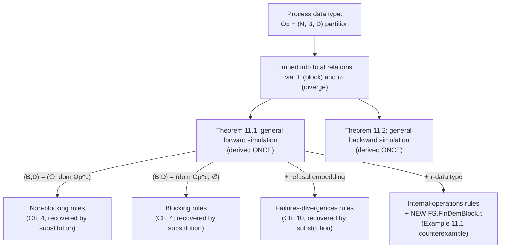

[[book-guidelines|↩ Back to guidelines]]

## The payoff: derive the simulation rules exactly once

[[Relating-Process-Algebraic-and-Relational-Refinement|Chapter 9]] embedded six process-algebraic relations by hand, one finalisation at a time. [[Relating-Data-Refinement-and-Failures-Divergences-Refinement|Chapter 10]] worked the failures-divergences case in exhausting detail, producing a table with a dozen named proof-obligation variants across blocking/non-blocking and demonic/angelic. **This chapter's entire point is to stop doing that by hand.** It builds one relational model — the **process data type** — expressive enough that blocking, non-blocking, refusals, and divergence are all just *instances* of a single three-way partition on each operation, derives forward and backward simulation **once**, and every earlier special case (Chapter 4's totalisations, Chapter 10's failures-divergences rules) falls out as a substitution into that one general theorem. **This is the single most valuable engineering pattern in the whole book for you to internalize: build the general model once, prove the general soundness theorem once, then specialize by substitution — never re-derive a special case's proof obligations from scratch.**

## Program-controlled ADTs and the output/refusal embeddings, made axiomatic

Two small preliminary moves matter. First, restrict attention to **program controlled ADTs** — initialisation is independent of the *incoming* global state ($\mathit{Init} = G \times \mathrm{ran}\,\mathit{Init}$), so an ADT run's outcome is determined purely by the program, not by ambient global context. This is a genuinely useful simplifying discipline: **it's the formal statement of "no hidden global mutable state influencing your contract's initialisation" — a property you'd want to enforce, or at least be explicit about, for any function contract in a verified language**, since silent dependence on ambient global state is exactly what makes modular reasoning about contracts break down.

Second, rather than re-deriving the input/output-threading and refusal-observing machinery from [[State-Based-Specification-Languages-Z-and-B|Chapter 7]] and [[Relating-Data-Refinement-and-Failures-Divergences-Refinement|Chapter 10]] concretely, the book states their **structural properties axiomatically**:

- **Output embedding** (Definition 11.2): $G = GB \times seq\,Output$, and — crucially — *an operation's domain and its effect on state depend only on the local state, never on previously produced outputs.* This axiom is what later guarantees that adding outputs to a model has a "very localised effect" on the refinement conditions — because outputs, by construction, can never retroactively influence anything upstream.
- **Refusal embedding** (Definition 11.3): $G = \mathcal{P}\,E \times GB$, with the finalisation exposing exactly a refusal relation $\mathit{Ref}: State \leftrightarrow \mathcal{P}\,E$.

**This axiomatic-property style is worth adopting directly in your own soundness-proof engineering.** Rather than proving "output embedding X has property P" every time you introduce a new concrete embedding, state the property as the *defining axiom* of a class of embeddings, prove your general theorems relative to that axiom once, then just check any new concrete construction satisfies it — a much smaller, much more reusable proof burden than re-deriving from scratch each time.

## The (N, B, D) partition: one operation shape subsuming everything

This is the chapter's central idea. Rather than choosing blocking *or* non-blocking totalisation up front, split every operation into **three disjoint pieces covering the whole state space**:

$$Op_i = (N_i, B_i, D_i), \qquad \mathrm{dom}\,N_i,\, B_i,\, D_i \text{ partition } State$$

- $N$: the operation's ordinary, well-defined effect.
- $B$: states where the operation **blocks** (deadlock/refusal).
- $D$: states where the operation **diverges** (livelock).

```rust
enum OpOutcome<S> {
    Normal(S),   // N: a well-defined after-state
    Blocked,     // B: this operation cannot fire here — a refusal
    Diverges,    // D: anything might happen from here on — the catastrophic zero
}
```

**Chapter 4's totalisations are exactly the two degenerate special cases**: the blocking interpretation is $(Op, \mathrm{dom}\,Op^c, \emptyset)$ — never diverges, blocks outside its domain; the non-blocking interpretation is $(Op, \emptyset, \mathrm{dom}\,Op^c)$ — never blocks, diverges outside its domain. **Every specification formalism using *both* explicit preconditions and explicit guards simultaneously — the book names B, which genuinely has both — needs the general three-way partition, because neither pure interpretation is adequate on its own.** This is directly relevant if your language distinguishes a `requires` contract violation (undefined behaviour — non-blocking) from a runtime guard failure (the operation is simply unavailable — blocking): a single operation with *both* kinds of failure mode needs exactly this three-way split, not a forced choice between the two pure models.

### The choice-ordering table: divergence as the algebraic zero, made precise

When non-determinism combines behaviours of different kinds (normal/divergent/blocking), what should the *resulting* observable behaviour be? The book answers with an explicit lattice:

| Choice | normal | divergence | deadlock |
|---|---|---|---|
| **normal** | normal | divergence | poss. deadlock |
| **divergence** | divergence | divergence | divergence |
| **deadlock** | poss. deadlock | divergence | deadlock |

**Divergence absorbs everything** — this is [[Perspicuity-Error-Behaviour-and-Divergence|Chapter 5's]] catastrophic-zero algebra, now stated as a literal multiplication table rather than argued informally. Deadlock, by contrast, is *not* absorbing — a choice between "definitely deadlocks" and "definitely works" yields **possible** deadlock (a genuinely new, third value: not certain deadlock, not certain success, but *either* could happen and both remain observable) — deadlock composes additively, divergence composes as an annihilator. **This distinction is worth internalizing as a design principle for your own abstract-interpretation lattice**: not every "bad outcome" category should be modeled the same way algebraically — some bad outcomes (like divergence/`⊥`/non-termination) genuinely should swallow all other information once possible, while others (like "this branch might fail an assertion") should remain a *distinguishable, still-informative* third state rather than collapsing to the same absorbing bottom.

## The embedding, and the two theorems that make the whole chapter earn its keep

The process data type is embedded into an ordinary total relation over an enhanced state space $State_{\bot,\omega} = State \cup \{\bot, \omega\}$ ($\bot$ = blocking, $\omega$ = divergence), with:

$$[[(N,B,D)]] = N \;\cup\; (B_{\bot,\omega} \times \{\bot\}) \;\cup\; (D_\omega \times State_\omega)$$

— the normal effect stays as-is; every blocking state routes to $\bot$ (and $\bot$ is absorbing to itself); every divergent state routes to *everything*, including $\bot$ and $\omega$ (the catastrophic reading, made literal: once diverged, any subsequent behaviour, including apparent blocking, is possible).

Deriving forward and backward simulation conditions for this embedding — mechanically, by the same "unwind the total-relation simulation rules and eliminate $\bot/\omega$" procedure used throughout the book — yields the two theorems this chapter exists to produce:

$$\textbf{Theorem 11.1 (Forward simulation): } \begin{cases}
CInits \subseteq \mathrm{ran}(AInits \lhd R) \\
R \fatsemi CFin \subseteq AFin \\
(\mathrm{dom}\,AFin) \lhd R = R \rhd (\mathrm{dom}\,CFin) \\
AD^{-} \fatsemi \, R \fatsemi CN \subseteq AN \fatsemi R \\
\mathrm{dom}(R \rhd CB) \subseteq AB \\
\mathrm{dom}(R \rhd CD) \subseteq AD
\end{cases}$$

$$\textbf{Theorem 11.2 (Backward simulation): } \begin{cases}
\mathrm{ran}(CInits \lhd T) \subseteq AInits \\
CFin \subseteq T \fatsemi AFin \\
\mathrm{dom}\,CFin \subseteq \mathrm{dom}(T \rhd \mathrm{dom}\,AFin) \\
\mathrm{dom}(T \rhd AD)^{-} \fatsemi \, CN \fatsemi T \subseteq T \fatsemi AN \\
CB \subseteq \mathrm{dom}(T \rhd AB) \\
CD \subseteq \mathrm{dom}(T \rhd AD)
\end{cases}$$

**Read the per-operation conditions as exactly what you'd hope for, generalized**: correctness holds *outside abstract divergence* (a divergent abstract state licenses anything, so correctness is moot there — this is the catastrophic-zero property earning its keep in the proof, not just the informal story); concrete blocking must be matched by abstract blocking; concrete divergence must be matched by abstract divergence. **And the book proves explicitly that setting $(B,D) = (\emptyset, \mathrm{dom}\,Op^c)$ collapses this exactly to Chapter 4's non-blocking rules, and $(B,D) = (\mathrm{dom}\,Op^c, \emptyset)$ collapses it exactly to the blocking rules** — this is the concrete confirmation that nothing was lost by generalizing: the special cases you already trust are literally substitution instances, not merely "morally similar."

## Internal operations revisited: the fully worked τ-data-type case

Section 11.3 applies the general theory to exactly the case [[Perspicuity-Error-Behaviour-and-Divergence|Chapter 5]] first flagged and [[Relating-Process-Algebraic-and-Relational-Refinement|Chapter 9 §9.6]] sketched: **τ-data types**, where internal operations can occur before/after any visible one, and unbounded internal evolution in some states is livelock. The chapter names five genuine subtleties that arise once you actually try to make this precise (not just gesture at it):

1. Finitely many internal steps can occur around any visible operation.
2. Unbounded internal evolution in some state is exactly divergence — states reachable that way, and operations leading into them, become divergent.
3. A divergent *initial* state poisons the entire ADT — every trace is divergent (the catastrophic zero, propagated from the very start).
4. CSP's failures-divergences semantics only observes refusals in **stable** states (no outgoing $\tau$) — [[Perspicuity-Error-Behaviour-and-Divergence|Chapter 5's]] stability notion, now load-bearing for exactly which finalisation observations are even meaningful.
5. Refusal in an *unstable* state is immaterial (the state might move on internally before the environment notices), but **momentary enabledness in an unstable state is not immaterial** — a trace that fires while briefly passing through an unstable state is genuinely observable, even though refusal information there isn't.

This last asymmetry — *enabledness in unstable states matters, refusal in unstable states doesn't* — is a genuinely subtle point about what "observable" means once internal steps are in play, and it's exactly the kind of asymmetry a naive implementation would get wrong by treating "observable" as a single uniform predicate rather than recognizing that different kinds of facts (can-fire vs. cannot-fire) have different observability rules under internal-step erasure.

## Example 11.1: outputs plus internal operations need their own extra condition, again

Just as [[Relating-Data-Refinement-and-Failures-Divergences-Refinement|Chapter 10]] found that adding outputs strengthens the backward-simulation finalisation condition, this chapter proves the *same phenomenon recurs* once internal operations are added on top: a genuinely new proof obligation, `FS.FinDemBlock.τ`, is needed and is **not implied by the other conditions** — proved by a sharp concrete counterexample. Two Z specifications where the abstract system has a genuine internal choice between two branches (each committing to a specific output pairing, $\{P!1,Q!1\}$ or $\{P!2,Q!2\}$), and the concrete system, presented as flat external choice, can jointly refuse the "mismatched" combination $\{P!1, Q!2\}$ — a combination the abstract system, whichever branch it silently took, can never simultaneously refuse. **The concrete system can refuse something no run of the abstract system could ever refuse, so it is not a refinement — yet it satisfies every ordinary simulation condition.** The needed fix (`FS.FinDemBlock.τ`) is, structurally, the *exact same* maximal-refusal-set machinery ($Sim$/$Maxsim$) from Chapter 10, now additionally quantified over which *stable* state is reached after internal evolution ($\tau_A^*$), rather than the state itself.

**The recurring shape across this whole Part III of the book — "adding observable dimension $X$ (refusals, outputs, internal steps) always risks strengthening exactly the *finalisation* condition, and it's always worth checking with a small concrete counterexample before assuming the ordinary correctness/applicability conditions already cover it" — is the single most transferable engineering habit from this material.** Every time you extend your own refinement-type system's observable surface (adding a new kind of effect, a new form of non-determinism, a new failure mode), budget explicitly for re-checking whether your *existing* simulation-style soundness proof's finalisation obligation still suffices, or whether — as happens here, repeatedly, provably — it needs strengthening. Don't assume additivity; verify it, ideally with a two-line counterexample in the style of Example 11.1 before trusting the general theorem to have covered the new case for free.

## Where this leads



This chapter is the deliberate capstone of Part III's methodology: rather than treating each combination of blocking/non-blocking, refusals, outputs, and internal operations as its own bespoke theory (which is how Chapters 9–10 initially presented them), it proves they're all substitution instances of one $(N,B,D)$-partitioned relational model with one soundness theorem. [[Beyond-This-Book-Related-Refinement-Theories|Chapter 12]] closes the book by surveying refinement theories that go beyond even this general model — weakest-precondition/action-systems semantics, timed and probabilistic refinement — but the engineering lesson to take forward into your own compiler is already complete here: **when you notice yourself deriving the "same shape" of soundness proof for several special cases in a row, stop and look for the general parametrized model — usually a single extra partition, tag, or parameter — that makes every special case a substitution instead of a re-derivation.**
