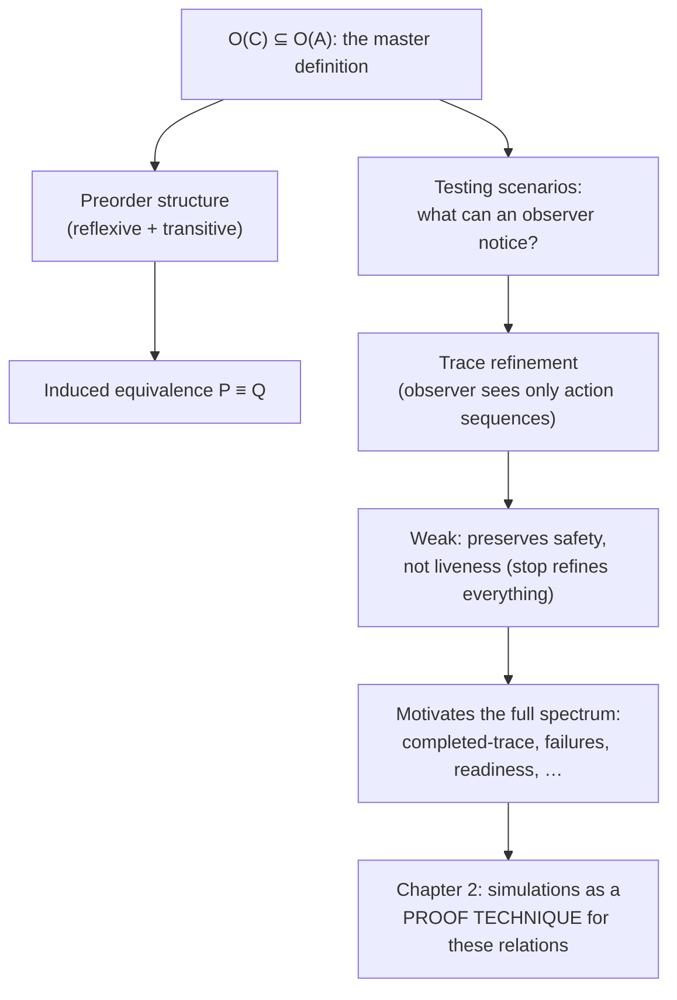

[[book-guidelines|↩ Back to guidelines]]

## Why you need a theory of refinement at all

Say you write a specification for a vending machine: insert a pound, choose coffee or tea, get your drink. Later you (or someone else) writes an *implementation* — real code, or a lower-level design — that's supposed to realize that specification. The question this whole book exists to answer is deceptively simple: **when is the implementation allowed to differ from the spec, and when has it broken the contract?**

"Differ" is doing a lot of work there. An implementation is *always* going to differ syntactically — it's a different artifact, written at a different level of abstraction, possibly with internal machinery the spec never mentions. What you actually care about is whether it differs in a way that matters to whoever is *using* the system. That's the whole ballgame: refinement is not about structural similarity, it's about **preserving what an external observer can see**.

If you've built type checkers or verifiers before, this should feel familiar in shape, even though the vocabulary is different. A subtyping relation $S <: T$ says "anywhere a $T$ is expected, an $S$ will do" — it's a promise about substitutability under observation (the observer being whatever code consumes the value). Refinement is the same idea one level up: a concrete system $C$ refines an abstract system $A$ when $C$ can be substituted for $A$ anywhere $A$ was expected, because nothing an observer could notice gets worse.

## The core definition: observations and inclusion

The book states this with almost provocative simplicity. For a system $A$, let $\mathcal{O}(A)$ be the set of everything an external observer could possibly observe about $A$ — this is deliberately abstract for now; what counts as an "observation" is exactly what differs between the refinement relations this book spends 300 pages cataloguing. Then:

$$A \sqsubseteq_{\mathcal{O}} C \quad \text{iff} \quad \mathcal{O}(C) \subseteq \mathcal{O}(A)$$

Read this carefully, because the direction is the crux of the entire subject: **every observation the concrete system can produce must already have been an observation the abstract system could produce.** The concrete system is not required to reproduce everything the abstract one *could* do — it's required not to do anything the abstract one *couldn't*. Refinement is fundamentally about **eliminating possibilities, not adding them.**

### What breaks without this direction

If you flip the inclusion — require $\mathcal{O}(A) \subseteq \mathcal{O}(C)$ instead — you get "extension," not refinement: the concrete system would be free to do anything the abstract one does, *plus more*, including new bad behaviors nobody signed off on. That's not what a client of the abstract system was promised. A client who was told "this vending machine only ever does X, Y, or Z" would be rightly upset if the concrete machine also does W. Refinement's whole value proposition is that a client can reason about the abstract spec and that reasoning stays sound after refinement — which only works if the concrete system's behaviour set is a *subset*.

### Non-determinism is the resource being spent

Why is refinement usually described as "reducing non-determinism"? Because the most common way $\mathcal{O}(A) \supsetneq \mathcal{O}(C)$ arises is that $A$ left some choices open (the spec is non-deterministic — it under-specifies, on purpose, so that many different implementations are legal), and $C$ pins some of those choices down. A specification saying "returns *some* prime greater than $n$" has many observations (many valid return values); an implementation that always returns the smallest such prime has fewer — it has *resolved* non-determinism that the spec left available. That's a legal refinement: every value the implementation returns was already among the values the spec allowed.

This is the same intuition as **under-specification in a Hoare-triple postcondition**. If a contract promises `ensures result > n && is_prime(result)`, any implementation satisfying that postcondition is a valid refinement of "a function meeting this contract" — the space of legal return values is exactly $\mathcal{O}(A)$, and a deterministic implementation just picks one path through it.

```rust
// The "abstract system": a trait describing a non-deterministic contract.
// Any type implementing it, however it resolves the choice, is a valid refinement.
trait NextPrimeSpec {
    // Contract: result must be prime and strictly greater than n.
    // Multiple correct answers are NOT possible here (next prime is unique),
    // but imagine a spec like "returns *a* prime factor of n" — there,
    // multiple implementations legally disagree with each other while each
    // individually refining the same abstract contract.
    fn next_prime(&self, n: u64) -> u64;
}

struct NaiveScan;
impl NextPrimeSpec for NaiveScan {
    fn next_prime(&self, n: u64) -> u64 {
        let mut k = n + 1;
        while !is_prime(k) { k += 1 }
        k
    }
}

fn is_prime(k: u64) -> bool {
    (2..k).all(|d| k % d != 0)
}
```

Two different types could both implement `NextPrimeSpec` and both be correct refinements of the trait's contract, even if their internal strategies (and performance) differ wildly — because the trait only constrains *observable results*, not *how* they're computed. That's precisely $\mathcal{O}(C) \subseteq \mathcal{O}(A)$: the trait's contract is $A$; any conforming `impl` is a $C$.

## Preorders: refinement composes, and gives you an equivalence for free

The book immediately flags a structural property that any sane refinement relation should have: it must be a **preorder** — reflexive ($A \sqsubseteq A$, a system trivially refines itself) and transitive (if $A \sqsubseteq B$ and $B \sqsubseteq C$, then $A \sqsubseteq C$). Transitivity is what makes *stepwise* refinement possible at all: you refine a spec into a design, the design into an implementation, and the implementation is guaranteed to refine the original spec without having to re-check that fact directly. This is exactly why set-inclusion-based definitions like $\mathcal{O}(C) \subseteq \mathcal{O}(A)$ are such a good starting template — $\subseteq$ is *free* preorder structure, inherited straight from set theory, at zero extra proof cost.

Once you have a preorder $\sqsubseteq$, you get an induced equivalence relation for free:

$$P \equiv Q \iff P \sqsubseteq Q \text{ and } Q \sqsubseteq P$$

For an observation-inclusion-based refinement, this collapses to exactly what you'd expect: $\mathcal{O}(P) = \mathcal{O}(Q)$ — two systems are equivalent under this refinement relation precisely when they have identical observation sets. This is worth sitting with, because it means **"equivalence" is not a separately-invented notion** — it *falls out* of the refinement preorder mechanically. Every refinement relation in this book (trace, failures, readiness, bisimulation, …) automatically comes with its own bespoke notion of "these two systems are the same," and different relations disagree about what counts as "the same" precisely because they disagree about what $\mathcal{O}$ captures.

### The Lean-side reading: this *is* a setoid

If you've worked with Lean or any dependently-typed proof assistant, a preorder-plus-induced-equivalence is a structure you already have a name for: it's a **setoid** in embryo. In Lean, `Preorder α` gives you `le` (`≤`) as reflexive and transitive, and the induced `Antisymm`-free equivalence `a ≈ b := a ≤ b ∧ b ≤ a` is exactly the `AntisymmRel` construction the standard library uses to build a partial order (or, when you *don't* quotient by it, to reason "up to refinement-equivalence" the way this book does throughout).

```lean
-- The book's schema, directly in Lean's order-theory vocabulary.
structure ObsSystem where
  Obs : Type
  -- observation set, left abstract on purpose

def refines (A C : ObsSystem) : Prop := ∀ o, o ∈ C.Obs → o ∈ A.Obs
-- i.e. C.Obs ⊆ A.Obs, matching O(C) ⊆ O(A)

theorem refines_refl (A : ObsSystem) : refines A A := fun _ h => h

theorem refines_trans {A B C : ObsSystem}
    (hAB : refines A B) (hBC : refines B C) : refines A C :=
  fun o hoC => hAB o (hBC o hoC)

def equiv_refines (A B : ObsSystem) : Prop := refines A B ∧ refines B A
-- exactly P ≡ Q from the book, definitionally the AntisymmRel of `refines`
```

This connection matters for more than aesthetics. **This is the same shape as Lean's own definitional-equality machinery.** `isDefEq` in a real elaborator isn't literally checking syntactic identity — it's checking a notion of "these two terms are interchangeable as far as the type checker can observe," which is, structurally, an equivalence induced by mutual reducibility (a two-way `≤` on some evaluation preorder). When you eventually build unification for your refinement-type elaborator, you'll be defining exactly this kind of "preorder first, equivalence as the derived antisymmetric collapse" structure — refinement relations here and definitional equality there are cousins, both instances of "comparability up to what an observer/checker can distinguish."

## Testing scenarios: refinement relations as imagined experiments

The book's recurring device for *justifying* a given refinement relation (rather than just stating it) is the **testing scenario**: imagine a concrete observer — a display, maybe some buttons — watching the system evolve, and ask *what the observer's display could possibly show*. Two systems are related by a refinement relation exactly when no such observer-experiment can distinguish "the concrete system is doing something the abstract one couldn't."

For trace refinement (introduced informally here, formalized properly as its own topic later in the chapter), the testing scenario is: the display just shows, in sequence, the name of each action the process performs. An observer watching only this display cannot detect *choices the system declined* — only what it *did*. This directly motivates why trace refinement, on its own, is weak: **the system that does nothing at all, `stop`, refines every other system.** Formally, for any process $p$: $p \sqsubseteq_{tr} \mathsf{stop}$, since $\mathsf{stop}$'s trace set (just the empty trace) is trivially a subset of any process's trace set. A vending machine that swallows your pound and never dispenses anything is, under this relation, a "valid" refinement of one that works.

### What breaks without a finer relation: safety versus liveness

That failure mode has a name, and it's one you'll want permanently on hand: trace refinement preserves **safety properties** ("something bad never happens") but not **liveness properties** ("something good eventually happens"). A system that does nothing violates no safety property — it just never gets around to doing anything good either. The book states the distinction crisply:

- **Safety properties** can be violated by a *finite* execution — you can point to a concrete bad step and say "there, that's the violation."
- **Liveness properties** require looking at *infinite* (or at least unboundedly long) runs — you can never point to a finite prefix and conclusively say "liveness has failed here," only that it *hasn't happened yet*.
- Any property expressible in a sufficiently expressive formal framework decomposes as the intersection of a safety part and a liveness part (this is the classical Alpern–Schneider decomposition, which the book gestures at without naming).

If you've touched temporal logic, model checking, or termination proofs, this dichotomy is exactly the safety/liveness split that drives *why* model checkers need separate machinery for invariant checking (safety — finite counterexample traces suffice) versus fairness/termination checking (liveness — needs Büchi automata or ranking functions, because a counterexample is an infinite "bad" run, not a finite one). **This is directly load-bearing for your project**: when your abstract-interpretation pass proves an invariant holds ("this pointer is never null" — safety), a bounded/finite abstract-domain analysis can suffice; but proving "this loop always terminates" (liveness) needs a fundamentally different artifact — a ranking function / well-founded measure — because no finite unrolling of the abstract semantics can witness it. The refinement relations later in this chapter (completed-trace, failures, readiness, …) are exactly the book's escalating toolkit for clawing back the liveness-adjacent distinctions that raw trace refinement throws away.

### Why weak relations still get discussed

You might ask: if trace refinement is this permissive, why does the book spend a whole section on it before moving to anything stronger? Because **weakness is exactly what makes it easy to check and easy to reason about compositionally** — and because every stronger relation in the spectrum (Topic 2's subject) is built by *adding* exactly one more thing the testing-scenario observer is allowed to notice (can it also see refusals? readiness? completed vs. incomplete runs?) on top of this same base. Trace refinement is the coordinate origin of the whole spectrum, not a dead end.

## Where this leads



This topic is the load-bearing skeleton for the rest of the book: every refinement relation from here on (trace, failures, readiness, bisimulation, and the state-based and relational refinements of Chapters 3–4) is a specific instantiation of $\mathcal{O}(C) \subseteq \mathcal{O}(A)$ for a specific choice of "what counts as an observation," justified by its own testing scenario, and automatically inheriting preorder-plus-equivalence structure for free. When the book later proves *proof techniques* for checking these relations (forward/backward simulation, Chapter 2), it's building sound-and-complete ways to establish this same inclusion without having to enumerate the (possibly infinite) observation sets directly — which is the exact same move abstract interpretation makes when it proves a program safe without enumerating its (possibly infinite) concrete execution traces. Keep that analogy close: **a refinement relation is a soundness contract between two levels of description, and a simulation is the proof obligation that discharges it** — this is the conceptual ancestor of the soundness argument your abstract-interpretation and CEGAR machinery will need between concrete and abstract program semantics.
