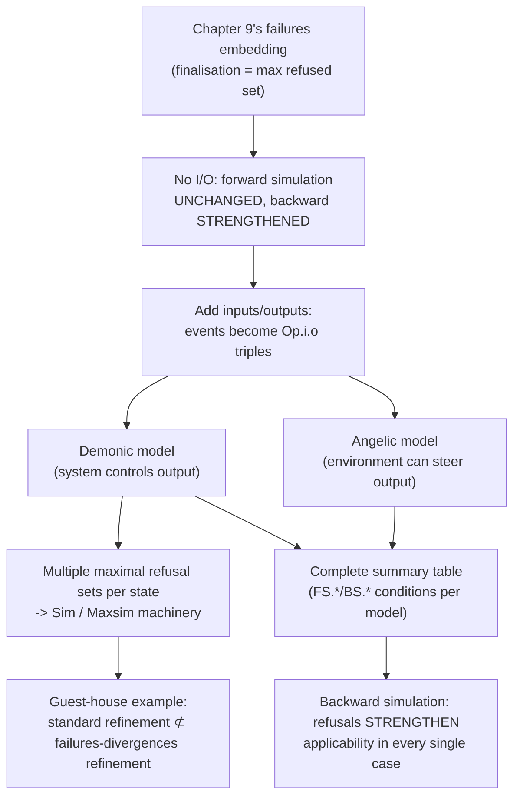

[[book-guidelines|↩ Back to guidelines]]

## Zooming in on the one hard case from Chapter 9

[[Relating-Process-Algebraic-and-Relational-Refinement|Chapter 9]] embedded six process-algebraic relations into the relational world by choosing the right finalisation, and flagged one embedding as needing deeper treatment: **failures refinement**, where the backward-simulation finalisation condition turned out to be *strictly stronger* than the ordinary applicability condition. This chapter is that deeper treatment — worked through completely, first without inputs/outputs, then (the genuinely hard part) with them, ending in a definitive summary table covering every combination of blocking/non-blocking and demonic/angelic output models. **If your compiler needs to verify refinement between concurrent or I/O-bearing contract specifications, this chapter is the closest thing in the book to a ready-made proof-obligation checklist you could implement directly.**

## Without I/O: forward simulation is untouched, backward simulation is not

Revisiting the failures embedding from Chapter 9 (finalisation = maximal refused operation set $\mathit{Ref}(State) = \{i \mid \neg\,\mathit{pre}\,Op_i\}$), the chapter derives the two simulation directions' finalisation conditions from scratch:

$$\textbf{Forward: } R \fatsemi CFin \subseteq AFin \;\equiv\; \forall R.\, \mathit{Ref}(CState) \subseteq \mathit{Ref}(AState) \;\equiv\; \textbf{ordinary applicability, unchanged}$$

$$\textbf{Backward: } CFin \subseteq T \fatsemi AFin \;\equiv\; \forall\, CState.\, \exists\, AState.\, T \wedge \mathit{Ref}(CState) \subseteq \mathit{Ref}(AState)$$

**The forward case is a clean, reassuring result**: proving Chapter 4's ordinary applicability-plus-correctness conditions *already* certifies the refusal-inclusion you need — nothing extra to prove. The backward case is the opposite, and the book states the difference precisely: **ordinary backward applicability lets you pick a *different* linked abstract state for each operation** ("$\forall i.\, \exists AState$"); **the refusals-aware condition demands *one* linked abstract state that simultaneously works for *every* operation's precondition comparison at once** ("$\exists AState.\, \forall i$"). Quantifier order swapped — and that swap is exactly what makes the refusals condition strictly stronger. **This single quantifier-order distinction is the mechanical root cause of every complication the rest of the chapter works through** — it's worth sitting with until it's fully internalized, because it is a completely general phenomenon: *"a single witness must work uniformly across all cases" is a strictly harder proof obligation than "a witness may vary case by case,"* and it shows up any time you move from checking properties independently to checking a property of their **joint, simultaneous** behaviour — precisely the difference between sequential correctness (check each operation's contract independently) and concurrent correctness (check what an *environment* can jointly observe about several operations at once, without knowing in advance which one it will invoke).

Both directions are then proved sound and complete for their respective interpretations: **Theorem 10.1** (blocking model, no divergences — refusals arise purely from blocked preconditions) and **Theorem 10.2** (non-blocking model — divergences arise from the catastrophic out-of-precondition case, refusals only occur *after* a divergence). One structural observation the book makes explicit is worth flagging for your own semantics design: **the failures-divergences finalisation makes intermediate choice points visible in a way the standard sequential Z finalisation does not** — a standard finalisation's output-at-the-end determines everything about intermediate outputs too (because the whole computation is threaded sequentially), but this refusal-observing finalisation independently records what's observable *at every prefix*, which is exactly why the resulting relation is strictly more discriminating than plain trace inclusion despite starting from the same "universal quantification over all programs" definition.

## Adding input and output: where the real complexity lives

Naively extending the no-I/O approach hits a wall: **a bare operation name transition loses the input/output values entirely**, and those values are themselves observable (which output value arrived is exactly the kind of thing an environment notices). The fix: events become triples $Op.i.o$ (operation, input, output), and traces/refusals/divergences are redefined over this richer event alphabet. But this immediately surfaces a genuine design fork the book treats with real care:

### Demonic vs. angelic: who controls a non-deterministic output?

If an operation can non-deterministically produce several different legal outputs for the same input, **who decides which one actually happens** — the system, or a cooperating environment?

- **Demonic**: the environment has *no* influence — the system can refuse all-but-one of the possible outputs on its own initiative, and the environment just has to accept whatever it gets. This is the standard, default reading (the name "demonic" signals: assume the worst-case resolution, exactly like demonic non-determinism in a Hoare-logic `wp` calculus).
- **Angelic**: the environment *can* influence which output is selected — it can synchronise on any output value that's available, and the system cannot pre-emptively rule one out. This is a *tighter coupling* model.

$$\textbf{Demonic refusal: } Op.i.o \in E \iff \neg\,(Op.i.o\text{ possible}) \;\vee\; \exists\, o_2 \ne o.\, (Op.i.o_2\text{ possible} \wedge Op.i.o_2 \in E)$$

$$\textbf{Angelic refusal: } Op.i.o \in E \iff \neg\,(Op.i.o\text{ possible})$$

**This distinction maps directly onto a genuinely important design decision for concurrent/nondeterministic contracts in your own compiler.** If a refinement-typed function specifies `ensures result ∈ {3, 4}` (a legally under-specified postcondition), does the *caller* get any say in which value comes back (angelic — like a `choose` operator the caller can steer, or non-deterministic choice resolved cooperatively), or does the *implementation* get to pick unilaterally with no recourse (demonic — the standard, conservative reading for verified code, where you must prove correctness under **any** resolution the implementation might choose)? Get this wrong and your soundness proof either over-promises (assuming the caller has control it doesn't) or over-constrains (forbidding legitimate demonic implementations). The book's default — demonic — is also the conservative, safety-first choice: **assume the implementation is adversarial with respect to output selection, and prove your contract holds regardless.**

### Maximal refusal sets and Sim: the proof-theoretic payoff of demonic choice

The demonic model has one genuinely subtle consequence the book works hard to make precise: **a state can have *several* incomparable maximal refusal sets simultaneously**, not just one. If operation $i$ with input $in$ can output either $3$ or $4$, the state has (at least) two maximal refusal sets — one refusing everything-but-$3$, one refusing everything-but-$4$ — and neither is a subset of the other. This forces the machinery of **$Sim$** (the type $(I \times Input) \to Output$, i.e. a partial function choosing at most one output per operation-input pair) and **$Maxsim(E, State)$** (characterizing $E$ as exactly the *complement* of one such maximal refusal set: every event in $E$ is genuinely possible, and every operation-input pair outside $E$'s domain is genuinely blocked). The resulting backward simulation finalisation condition:

$$\forall\, CState;\, E : Sim.\; \mathit{Maxsim}(E, CState) \Rightarrow \exists\, AState;\, E' : Sim.\; T \wedge E' \subseteq E \wedge \mathit{Maxsim}(E', AState)$$

**Example 10.2** is the worked demonstration of why this genuinely needs per-refusal-set quantification rather than a single fixed linked state: a concrete state $c{=}1$ has *two* possible maximal-simultaneous-offer sets (roughly, "output could be 3" or "output could be 4"), and each one needs a *different* abstract witness state ($a{=}0$ for one, $a{=}1$ for the other) — no single abstract state simultaneously accounts for both possible output resolutions. **This is a direct, worked illustration of exactly the kind of proof-obligation subtlety that arises whenever your verifier's witness-finding for non-deterministic output selection has to be case-split per possible resolution rather than found once and reused** — a pattern you'll hit again the moment your refinement-type checker needs to verify a contract for an operation whose postcondition legally admits multiple result values.

## The guest-house example: why standard refinement is not enough, concretely

**Example 10.3** is the chapter's centerpiece counterexample, and it's worth internalizing as a permanent cautionary tale. Two hotel booking systems, `Marges` (rooms are `none`/`simple`/`luxury`) and `StThomas` (rooms are `no`/`tv`/`ensuite`), both correctly implement an abstract `GuestHouse` contract (book a room, then optionally ask if it has a TV or an en-suite bathroom) — **and both satisfy the standard backward simulation conditions for ordinary data refinement, in both directions, making them provably equivalent under Chapter 4's theory.**

But they are **not** failures-divergences equivalent, because after booking, their refusal sets are pairwise incomparable: `simple` refuses both facilities; `tv` refuses en-suite but not TV; `ensuite` refuses TV but not en-suite — and there is no single abstract state whose refusal behaviour "covers" any given concrete state's refusal behaviour, because the concrete choice of which facility (if any) is present has already been resolved by the time you ask, while the abstract contract left both questions genuinely open until asked. **Standard relational refinement is checking sequential input/output correctness — it cannot see that the two implementations resolve their internal non-determinism at structurally different points relative to when the environment gets to interact with the result.** This is precisely the "internal choice vs external choice" distinction from [[Process-Algebras-CSP-LOTOS-and-CCS|Chapter 6]], now surfacing as a genuine counterexample to a theorem you might otherwise have trusted uncritically.

**The lesson for your compiler is unambiguous and important: sequential contract-equivalence (input/output relational refinement) is not sufficient for concurrent/interactive contract-equivalence, even when every individual operation's precondition/postcondition checks out identically.** If your language ever supports interactive or streaming contracts (an operation whose "postcondition" is really a protocol observed incrementally, not a single input-output pair), you cannot get away with standard Hoare-triple-style refinement checking — you need the refusal-aware, failures-divergences-flavored machinery this chapter builds, or you will silently accept "refinements" that a real concurrent client could observably distinguish from the original.

## The complete summary table: your implementation checklist

The chapter's payoff is a from-first-principles-derived, exhaustive table of exactly which proof obligations are needed in each combination — genuinely useful as a direct reference:

**Forward simulation** — unaffected by refusals in every case *except* angelic outputs, where an extra `FS.FinAng` condition appears (angelic choice specifically forbids reducing output non-determinism, which the ordinary correctness condition alone doesn't rule out):

| Outputs | none | demonic | angelic |
|---|---|---|---|
| Init | `FS.Init` | | |
| App | `FS.App` | `FS.App` | *(subsumed)* |
| Corr | `FS.CorrBlock`/`FS.CorrNonBlock` | | |
| Fin | *(subsumed)* | *(subsumed)* | `FS.FinAng` |

**Backward simulation** — the observation of refusals **strengthens the applicability condition in every single case**, no exceptions:

| Outputs | none | demonic | angelic |
|---|---|---|---|
| Init | `BS.Init` | | |
| App | *(subsumed into Fin)* | | |
| Corr | `BS.CorrBlock`/`BS.CorrNonBlock` | | |
| Fin | `BS.FinRef` | `BS.FinDem` (needs `Sim`/`Maxsim`) | `BS.FinAng` |

**The asymmetry between the two rows is the chapter's single most reusable finding.** Forward simulation, being fundamentally a "does the concrete side stay inside what the abstract side allows, checked pointwise" argument, survives the move to a richer observation model almost unscathed. Backward simulation, being fundamentally a "does one abstract witness work for the whole concrete situation at once" argument, is exactly where the extra discriminating power of refusal-observation bites — because refusal-observation is itself a "what holds simultaneously across all choices" kind of fact. **If you're choosing which simulation direction to lean on by default in your own elaborator's proof search, forward simulation is the more robust choice when your observation model might later need to become richer** — it degrades more gracefully; backward simulation's proof obligations are more fragile to exactly the kind of extension (adding refusal-awareness, or any other "joint" observable) your language's contract system is likely to eventually need.

## Where this leads

This chapter's derivation is the concrete existence proof that [[Relating-Process-Algebraic-and-Relational-Refinement|Chapter 9's]] flagged strengthening isn't an isolated oddity — it's systematic, provable, and fully characterized across the entire space of blocking/non-blocking and demonic/angelic combinations. [[Process-Data-Types-A-General-Model-of-Concurrent-Refinement|Chapter 11]] takes this exact table and *generalizes* it one more level: rather than deriving a separate simulation-rule set per combination as this chapter did by hand, it builds one relational model — the process data type — general enough that blocking, non-blocking, refusals, and divergence all fall out as special cases of a single (N, B, D) partition, giving you the forward/backward simulation rules for *all* of these combinations at once, derived exactly once.
